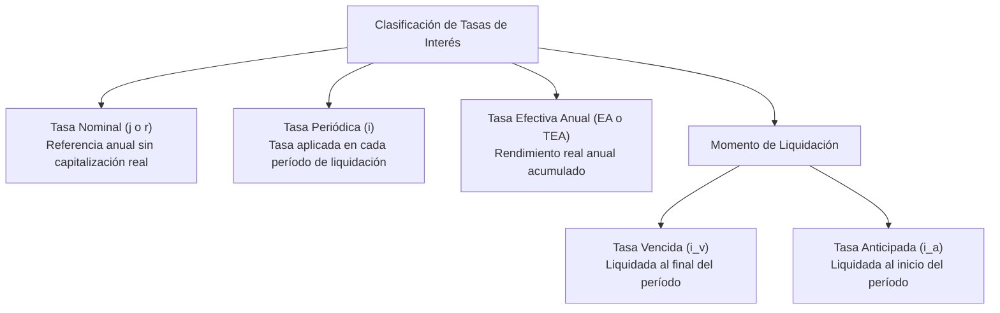
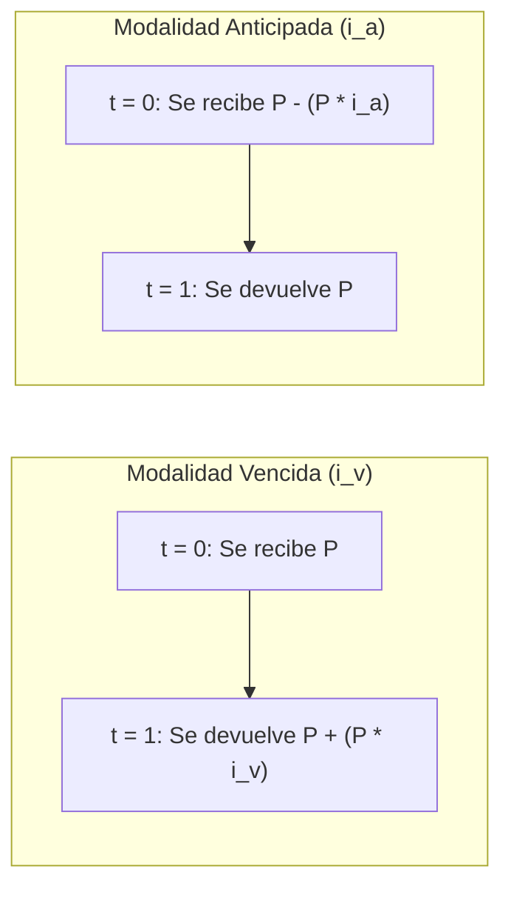

# Tasas de Interés, Principio de Equivalencia y Ecuaciones de Valor

En la **Ingeniería Económica**, dos o más flujos de efectivo en diferentes instantes de tiempo no pueden compararse ni sumarse aritméticamente de forma directa. Para hacerlo, deben homogeneizarse mediante el **Principio de Equivalencia Financiera**, la transformación adecuada de **Tasas de Interés** y la formulación de **Ecuaciones de Valor**.

---

## 1. Clasificación Rigurosa de Tasas de Interés



### 1.1. Tasa Nominal ($j$ o $r$)
Es una tasa de interés de referencia anual que se estipula contractualmente, pero que **no mide el costo ni el rendimiento financiero real**, ya que no incorpora el fenómeno de la capitalización periódica de intereses. Siempre debe estar acompañada de su **frecuencia de capitalización** ($m$).

### 1.2. Tasa Periódica ($i$)
Es la tasa efectiva que se aplica directamente sobre el capital o saldo insoluto en cada uno de los períodos de liquidación ($m$ períodos en un año):

$$\mathbf{i = \frac{j}{m}}$$

Donde $m$ es el número de períodos de capitalización contenidos en un año:
- Anual: $m = 1$
- Semestral: $m = 2$
- Cuatrimestral: $m = 3$
- Trimestral: $m = 4$
- Bimestral: $m = 6$
- Mensual: $m = 12$
- Diario (año comercial): $m = 360$ (o $365$ año calendario).

### 1.3. Tasa Efectiva Anual (EA o TEA)
Es la tasa que mide la verdadera rentabilidad obtenida o el verdadero costo financiero asumido al término de un año completo, como resultado de reinvertir periódicamente los intereses generados:

$$\mathbf{EA = \left(1 + \frac{j}{m}\right)^m - 1 = (1 + i)^m - 1}$$

### 1.4. Equivalencia entre Tasas Periódicas de Distinta Frecuencia
Dos tasas periódicas $i_1$ (con frecuencia $m_1$) e $i_2$ (con frecuencia $m_2$) son financieramente equivalentes si generan exactamente la misma Tasa Efectiva Anual ($EA$):

$$(1 + i_1)^{m_1} = (1 + i_2)^{m_2} = 1 + EA$$

Despejando $i_2$ en función de $i_1$:
$$\mathbf{i_2 = (1 + i_1)^{\frac{m_1}{m_2}} - 1}$$

> [!important] Proporcionalidad vs. Equivalencia Exponencial
> - **En Interés Simple:** Las tasas de interés son directamente proporcionales (lineales). Una tasa de $2\%$ mensual equivale exactamente por regla de tres a $2\% \times 12 = 24\%$ anual.
> - **En Interés Compuesto:** Las tasas de interés **NO son proporcionales, sino equivalentes exponenciales**. Una tasa del $2\%$ mensual genera una tasa efectiva anual de:
>   $$EA = (1 + 0.02)^{12} - 1 = 1.26824 - 1 = \mathbf{26.82\% \text{ anual}} \neq 24\%$$

---

## 2. Tasas Vencidas vs. Tasas Anticipadas

En las operaciones bancarias y comerciales, los intereses pueden liquidarse al concluir el período (**modalidad vencida**) o retenerse por adelantado al inicio del período (**modalidad anticipada**):



### 2.1. Deducción de las Fórmulas de Conversión
Supongamos un crédito por un monto nominal de $\$1.00$ a una tasa periódica anticipada $i_a$:
1. Al inicio del período ($t=0$), el prestamista descuenta los intereses por adelantado ($1 \cdot i_a$), entregando efectivamente al deudor un capital líquido de:
   $$\text{Dinero Recibido} = 1 - i_a$$
2. Al final del período ($t=1$), el deudor debe pagar el valor nominal completo: $\$1.00$.
3. La tasa periódica vencida equivalente ($i_v$) es el interés cobrado dividido entre el capital real recibido:
   $$i_v = \frac{\text{Interés Pagado}}{\text{Capital Real Recibido}} = \frac{i_a}{1 - i_a}$$

$$\mathbf{i_v = \frac{i_a}{1 - i_a}}$$

Despejando la tasa anticipada ($i_a$) a partir de la tasa vencida:
$$i_v(1 - i_a) = i_a \implies i_v - i_v \cdot i_a = i_a \implies i_v = i_a(1 + i_v)$$

$$\mathbf{i_a = \frac{i_v}{1 + i_v}}$$

> [!warning] Asimetría Financiera
> Puesto que el denominador en la conversión a tasa vencida es $(1 - i_a) < 1$, se cumple estrictamente que:
> $$\mathbf{i_v > i_a}$$
> Prestar dinero a una tasa nominal aparentemente baja pero en modalidad anticipada encarece drásticamente el costo financiero real de la deuda.

---

## 3. Principio de Equivalencia Financiera y Ecuaciones de Valor

### 3.1. Concepto Fundamental
El **Principio de Equivalencia Financiera** establece que dos conjuntos de flujos de efectivo (ingresos y egresos, o compromisos de pago y obligaciones refinanciadas) son equivalentes entre sí a una tasa de interés pactada si la suma de sus valores presentes o futuros es exactamente igual en un punto temporal específico denominado **Fecha Focal ($f$)**.

```mermaid
flowchart LR
    Past["Flujo en t < f\n(A la izquierda)"] -->|Capitalizar:\nMultiplicar por (1+i)^(f - t)| FF(("FECHA FOCAL (f)"))
    Future["Flujo en t > f\n(A la derecha)"] -->|Actualizar / Descontar:\nDividir entre (1+i)^(t - f)| FF
```

### 3.2. Formulación Matemática de la Ecuación de Valor
$$\mathbf{\sum \text{Ingresos (o Deudas) valuados en } f = \sum \text{Egresos (o Pagos) valuados en } f}$$

- **Traslado hacia el futuro ($t < f$):** Se capitaliza multiplicando por el factor $(1 + i)^{f - t}$.
- **Traslado hacia el presente ($t > f$):** Se descuenta dividiendo por el factor $(1 + i)^{t - f}$.

> [!important] Independencia de la Fecha Focal en Interés Compuesto
> En el régimen de **Interés Compuesto**, el resultado matemático de la Ecuación de Valor es **rigurosamente independiente de la Fecha Focal ($f$) elegida**. Seleccionar $f = 0$, $f = 5$ o $f = 12$ arrojará exactamente la misma solución para la variable incógnita.
> *(Nota: En interés simple, la fecha focal sí afecta ligeramente el resultado final, por lo que debe pactarse contractualmente).*

---

## 4. Tiempos Equivalentes (Vencimiento Medio / Plazo Único)

El problema del **Tiempo Equivalente ($\bar{t}$)** consiste en determinar en qué fecha única debe liquidarse un pago consolidado único de valor nominal igual a la suma total de varias deudas ($D_1, D_2, \dots, D_k$ que vencen en los plazos $t_1, t_2, \dots, t_k$) para que no exista ganancia ni pérdida de valor para ninguna de las partes.

### 4.1. Deducción Rigurosa en Interés Compuesto
Sea $D_{\text{total}} = \sum_{k=1}^m D_k$. Planteando la ecuación de equivalencia en la fecha focal $f = 0$ (Valor Presente):

$$\frac{D_{\text{total}}}{(1 + i)^{\bar{t}}} = \sum_{k=1}^m \frac{D_k}{(1 + i)^{t_k}}$$

Invertimos y despejamos $(1 + i)^{\bar{t}}$:
$$(1 + i)^{-\bar{t}} = \frac{1}{D_{\text{total}}} \sum_{k=1}^m \frac{D_k}{(1 + i)^{t_k}}$$

Aplicando logaritmo natural ($\ln$) a ambos miembros:
$$-\bar{t} \cdot \ln(1 + i) = \ln\left( \frac{1}{D_{\text{total}}} \sum_{k=1}^m \frac{D_k}{(1 + i)^{t_k}} \right)$$

$$\mathbf{\bar{t} = -\frac{\ln\left( \frac{1}{D_{\text{total}}} \sum_{k=1}^m \frac{D_k}{(1 + i)^{t_k}} \right)}{\ln(1 + i)}}$$

### 4.2. Aproximación en Interés Simple (Vencimiento Medio Ponderado)
Bajo el régimen lineal de interés simple, el plazo equivalente se aproxima a la media aritmética ponderada de los plazos por sus respectivos montos de deuda:

$$\mathbf{\bar{t} \approx \frac{\sum_{k=1}^m D_k \cdot t_k}{\sum_{k=1}^m D_k}}$$

---

## 5. Ejemplos Numéricos Prácticos Resueltos Paso a Paso

### Ejemplo 1: Conversión de Tasa Nominal a Efectiva Anual y Tasa Mensual Equivalente
**Enunciado:** Una empresa de software adquiere infraestructura en la nube bajo un esquema de financiamiento cuya tasa pactada es del **$18\%$ Nominal Anual capitalizable trimestralmente ($j = 18\%$, $m = 4$)**.
1. Calcule la Tasa Periódica Trimestral ($i_T$).
2. Calcule la Tasa Efectiva Anual ($EA$).
3. Calcule la Tasa Periódica Mensual equivalente ($i_M$).

**Solución Paso a Paso:**
1. **Tasa trimestral periódica:**
   $$i_T = \frac{j}{m} = \frac{0.18}{4} = 0.045 = \mathbf{4.50\% \text{ trimestral}}$$

2. **Tasa Efectiva Anual ($EA$):**
   $$EA = (1 + i_T)^4 - 1 = (1 + 0.045)^4 - 1 = (1.045)^4 - 1 = 1.192518 - 1 = \mathbf{19.25\% \text{ EA}}$$

3. **Tasa periódica mensual equivalente ($i_M$):**
   Sabemos que $(1 + i_M)^{12} = 1 + EA = (1 + i_T)^4$:
   $$i_M = (1 + i_T)^{\frac{4}{12}} - 1 = (1.045)^{\frac{1}{3}} - 1 = \sqrt[3]{1.045} - 1 \approx 1.01478 - 1 = \mathbf{1.478\% \text{ mensual}}$$

---

### Ejemplo 2: Conversión de Tasa Anticipada a Tasa Efectiva Anual
**Enunciado:** Un pagaré se descuenta a una tasa del **$4\%$ trimestral anticipada ($i_{Ta} = 0.04$)**. Determine la Tasa Efectiva Anual ($EA$) real que asume la empresa.

**Solución Paso a Paso:**
1. **Convertir la tasa trimestral anticipada a tasa trimestral vencida ($i_{Tv}$):**
   $$i_{Tv} = \frac{i_{Ta}}{1 - i_{Ta}} = \frac{0.04}{1 - 0.04} = \frac{0.04}{0.96} = 0.041667 = \mathbf{4.1667\% \text{ trimestral vencido}}$$

2. **Calcular la Tasa Efectiva Anual ($EA$):**
   Dado que en un año hay 4 trimestres ($m = 4$):
   $$EA = (1 + i_{Tv})^4 - 1 = (1 + 0.041667)^4 - 1 = (1.041667)^4 - 1 = 1.1774 - 1 = \mathbf{17.74\% \text{ EA}}$$

---

### Ejemplo 3: Ecuación de Valor para Reestructuración de Deudas
**Enunciado:** Una startup de ingeniería tiene dos compromisos de pago con un proveedor de tecnología:
- Deuda 1: $\$5,000$ con vencimiento a los **3 meses**.
- Deuda 2: $\$8,000$ con vencimiento a los **8 meses**.

La startup acuerda reestructurar su plan de pagos para liquidar ambas deudas mediante **dos pagos iguales ($X$)**: el primero al **mes 6** y el segundo al **mes 12**. La tasa de interés acordada para la reestructuración es del **$1.5\%$ mensual compuesto ($i = 0.015$)**.

Calcule el valor de cada cuota $X$ estableciendo como **Fecha Focal el mes 12 ($f = 12$)**.

```mermaid
flowchart LR
    subgraph DeudasOrig ["Deudas Originales"]
        D1["$5,000 (Mes 3)"] -->|Traslado de 9 meses: (1+i)^9| FF(("Fecha Focal (Mes 12)"))
        D2["$8,000 (Mes 8)"] -->|Traslado de 4 meses: (1+i)^4| FF
    end
    subgraph NuevosPagos ["Nuevos Pagos"]
        P1["X (Mes 6)"] -->|Traslado de 6 meses: (1+i)^6| FF
        P2["X (Mes 12)"] -->|En la fecha focal: X| FF
    end
```

**Solución Paso a Paso:**
1. **Plantear la Ecuación de Valor en $f = 12$:**
   $$\sum \text{Deudas en } f_{12} = \sum \text{Pagos en } f_{12}$$

   $$5,000(1 + 0.015)^{12 - 3} + 8,000(1 + 0.015)^{12 - 8} = X(1 + 0.015)^{12 - 6} + X$$

2. **Calcular los factores de capitalización:**
   - Factor mes 3 a mes 12: $(1.015)^9 \approx 1.14339$
   - Factor mes 8 a mes 12: $(1.015)^4 \approx 1.06136$
   - Factor mes 6 a mes 12: $(1.015)^6 \approx 1.09344$

3. **Sustituir los valores numéricos:**
   $$5,000(1.14339) + 8,000(1.06136) = X(1.09344) + X$$
   $$5,716.95 + 8,490.88 = X(1.09344 + 1)$$
   $$14,207.83 = 2.09344 \cdot X$$

4. **Despejar la cuota $X$:**
   $$\mathbf{X = \frac{14,207.83}{2.09344} = \$6,786.88}$$

**Conclusión:** La empresa cancelará completamente sus dos obligaciones realizando dos pagos iguales de **$\$6,786.88$** en el mes 6 y en el mes 12.

---

## 6. Observaciones Prácticas y Marco Jurídico-Financiero

- **Estrategia Operativa de Conversión:** En la resolución de problemas financieros de ingeniería existen tres vías de trabajo equivalentes:
  1. *Convertir tiempos pero no tasas:* Ajustar los plazos temporales al período base de la tasa de interés.
  2. *Convertir tasas pero no tiempos:* Transformar la tasa de interés dada a la periodicidad de los flujos de pago.
  3. *Convertir tiempos y tasas al año base:* Homogeneizar todos los elementos a años y a la Tasa Efectiva Anual ($EA$).
- **Contexto Regulatorio Ecuatoriano:**
  - En el sistema financiero nacional (bancos privados, banca pública y cooperativas de ahorro y crédito), la legislación prohíbe el uso de tasas proporcionales lineales para operaciones activas de crédito o pasivas de inversión; se exige el cálculo estricto bajo **interés compuesto y tasas efectivas anuales (TEA)**.
  - Las casas comerciales de venta a plazos y almacenes de electrodomésticos y tecnología utilizan esquemas equivalentes de amortización con cuotas quincenales o mensuales que deben someterse a la tasa máxima legal de crédito de consumo regulada mensualmente por el Banco Central del Ecuador.

---

## Notas relacionadas
- [[Interes]]
- [[proyectos]]
- [[producto minimo viable]]
- [[tdr terminos de refencia]]