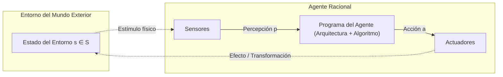
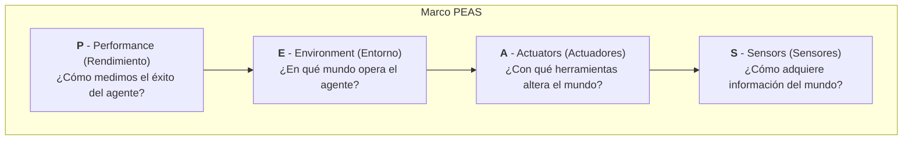
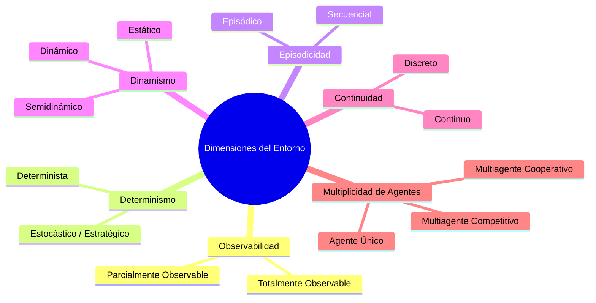
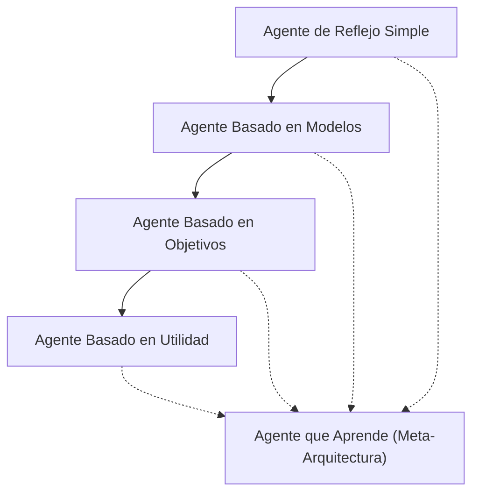
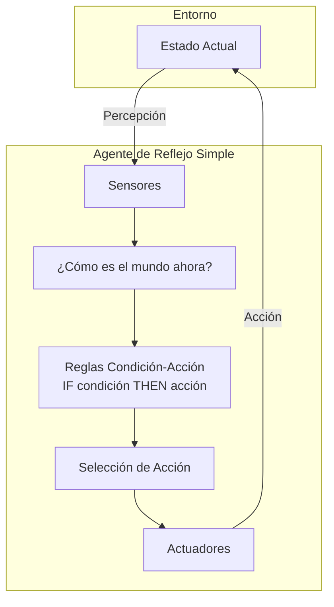
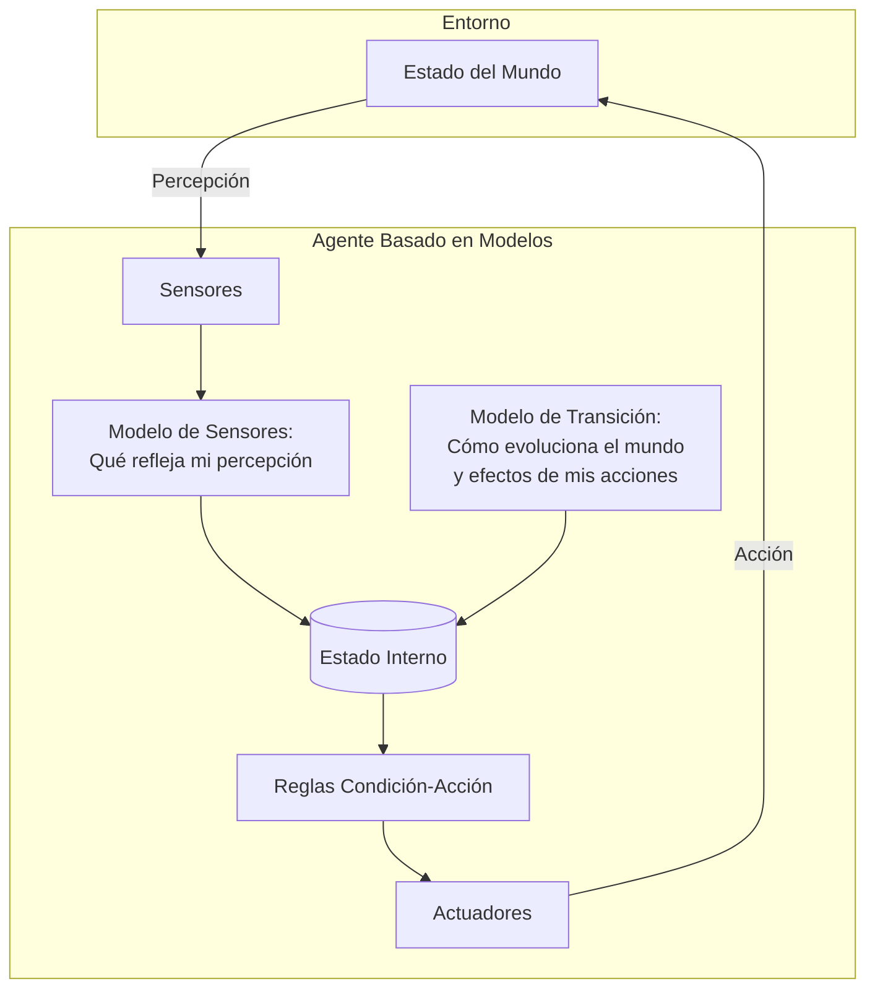
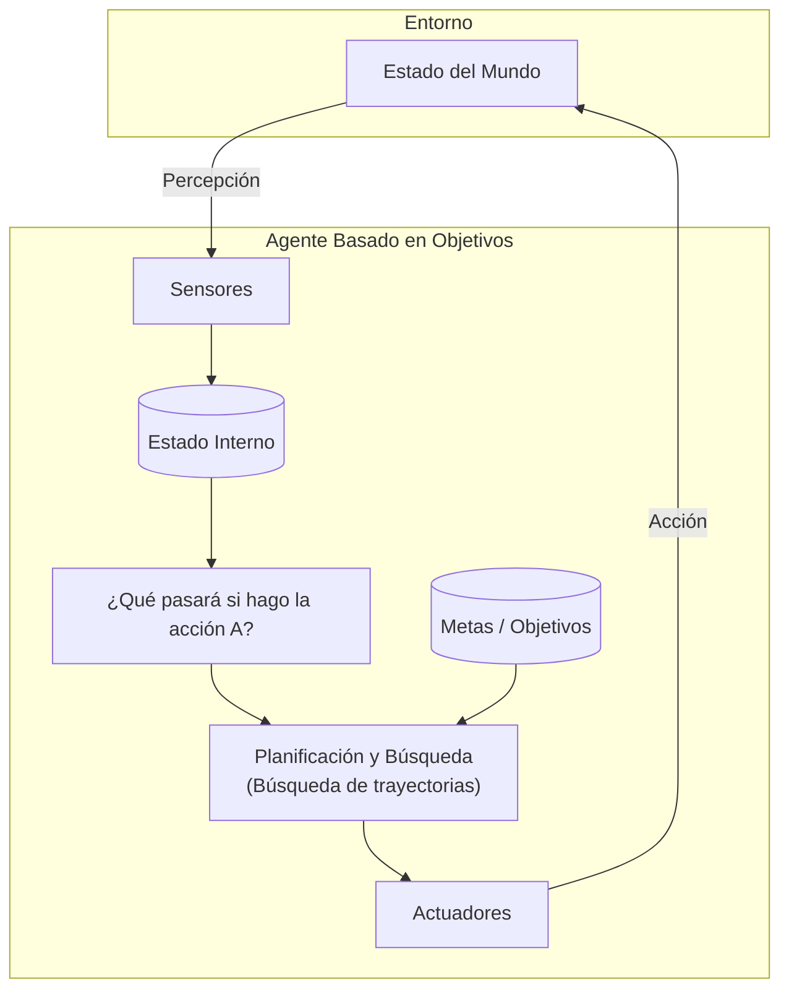
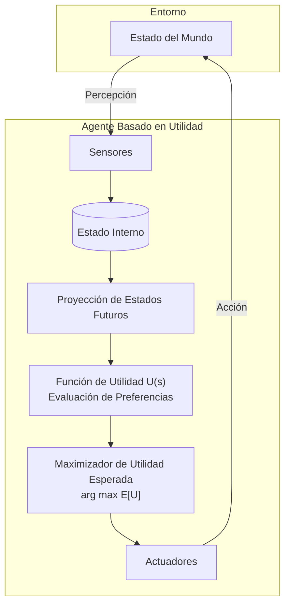
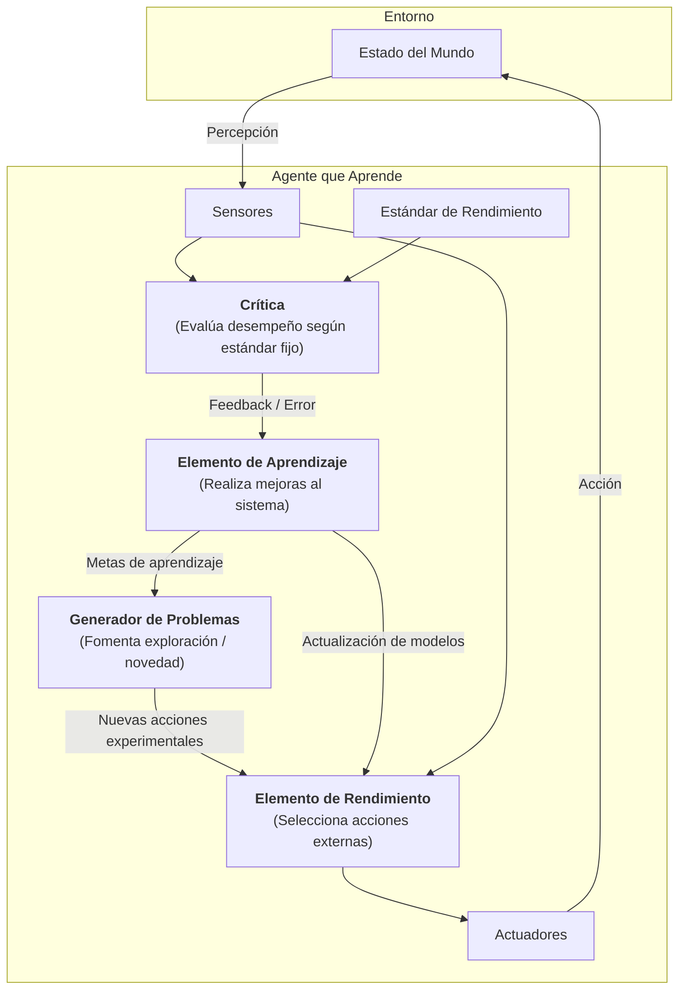

# Agentes Inteligentes y Entornos de Tarea (PEAS)

En la teoría moderna de Inteligencia Artificial (formalizada de manera canónica por Stuart Russell y Peter Norvig), el concepto unificador de la disciplina no es la emulación del pensamiento humano, sino el diseño e implementación de **agentes racionales**. 

Esta perspectiva define a la IA como el estudio de sistemas computacionales que perciben su entorno a través de sensores y ejecutan acciones mediante actuadores para maximizar una medida cuantificable de éxito.

---

## 1. Fundamentos Matemáticos del Agente Racional

### 1.1 Definición Formal de Agente
Un **agente** es cualquier entidad capaz de percibir su entorno mediante un conjunto de sensores y actuar sobre dicho entorno mediante efectores o actuadores.

Matemáticamente, definimos:
- **Espacio de Percepciones ($\mathcal{P}$):** Conjunto de todas las posibles entradas sensoriales instantáneas que el agente puede recibir del entorno.
- **Secuencia o Historia de Percepciones ($\mathcal{P}^*$):** La secuencia temporal completa de todas las percepciones recibidas por el agente desde su inicialización hasta el tiempo actual $t$:
  $$p^* = (p_0, p_1, p_2, \dots, p_t) \in \mathcal{P}^*$$
- **Espacio de Acciones ($\mathcal{A}$):** Conjunto finito o continuo de todas las acciones operativas que el agente puede ejecutar mediante sus actuadores.
- **Función del Agente ($f$):** Mapeo matemático abstracto de cualquier historia de percepciones hacia una acción:
  $$f: \mathcal{P}^* \to \mathcal{A}$$
- **Programa del Agente:** La implementación concreta del algoritmo que corre sobre una arquitectura física (hardware) para materializar la función $f$.

> [!important] Función vs. Programa del Agente
> La **función del agente** es una descripción matemática abstracta ($f: \mathcal{P}^* \to \mathcal{A}$) que puede concebirse teóricamente como una tabla de correspondencia infinita. El **programa del agente** es la realización algorítmica ejecutable y computable en tiempo y espacio finitos sobre un procesador real.

---

### 1.2 Racionalidad según Russell & Norvig
La racionalidad no juzga los procesos mentales internos ni la conciencia del sistema, sino la **calidad de sus decisiones y sus resultados esperados**.

Para un instante temporal $t$, un agente racional selecciona la acción $a^* \in \mathcal{A}$ que maximiza el valor esperado de la medida de rendimiento, condicionada a la secuencia de percepciones acumulada hasta la fecha y a cualquier conocimiento a priori incorporado en el agente:

$$a^* = \arg\max_{a \in \mathcal{A}} \mathbb{E}\Big[\mathcal{U}(S_{t+1}, S_{t+2}, \dots) \;\Big|\; \mathcal{P}^*, \mathcal{K}_{\text{prior}}, a\Big]$$

Donde:
- $\mathcal{U}$ representa la función o medida de rendimiento (utilidad/desempeño).
- $\mathcal{P}^*$ es la historia de percepciones observadas.
- $\mathcal{K}_{\text{prior}}$ es el conocimiento base preprogramado del agente.
- $\mathbb{E}[\cdot]$ es el operador de esperanza matemática sobre los estados futuros no deterministas del entorno.

> [!warning] Racionalidad no es Omnisciencia
> Un agente **omnisciente** conoce el resultado real de sus acciones por adelantado y no comete errores. La **racionalidad** evalúa la elección óptima en base a la información *disponible*. Un agente puede actuar de forma 100% racional y, debido a la estocasticidad o parcial observabilidad del entorno, obtener un mal resultado. El rendimiento se mide por el éxito esperado, no por la adivinación infalible.

### 1.3 Autonomía y Aprendizaje
Un agente es **autónomo** en la medida en que su comportamiento depende de su propia experiencia y aprendizaje sensorial, más que del conocimiento a priori insertado por su diseñador humano. 
- Si un agente depende exclusivamente del conocimiento cableado del diseñador, carece de autonomía y fallará ante cambios dinámicos del entorno.
- Un agente verdaderamente racional debe incorporar mecanismos de exploración, recolección de información y aprendizaje inductivo para adaptarse a entornos no estacionarios.

---

## 2. El Marco PEAS (*Performance, Environment, Actuators, Sensors*)

El marco **PEAS** es la metodología de especificación rigurosa utilizada en ingeniería de IA para formalizar el problema y los requerimientos de un agente antes de seleccionar su arquitectura algorítmica.

### Tabla Comparativa PEAS de Sistemas Clásicos

| Tipo de Agente | Medida de Rendimiento (**P**erformance) | Entorno de Tarea (**E**nvironment) | Actuadores (**A**ctuators) | Sensores (**S**ensors) |
| :--- | :--- | :--- | :--- | :--- |
| **Vehículo Autónomo** (*Waymo, Tesla FSD*) | - Tiempo de viaje mínimo. - Seguridad (0 colisiones). - Cumplimiento legal de tránsito. - Confort de pasajeros (baja aceleración brusca). - Eficiencia de combustible/batería. | - Carreteras públicas urbanas e interurbanas. - Otros vehículos y peatones. - Ciclistas y animales. - Señalización vial y semáforos. - Clima variable (lluvia, niebla, nieve). | - Dirección electromecánica (volante). - Acelerador electrónico. - Frenos hidráulicos/regenerativos. - Luces intermitentes y bocina. - Pantalla/audio de interfaz humana. | - Cámaras RGB estereoscópicas. - Sensores LiDAR (nubes de puntos 3D). - Radares de onda milimétrica. - Sonar ultrasónico de proximidad. - GPS diferencial / GNSS. - IMU (giróscopos y acelerómetros). |
| **Sistema de Diagnóstico Médico** (*CDSS*) | - Precisión de diagnóstico (alto recall/precision). - Tasa mínima de falsos negativos (crítico en patologías graves). - Costo y tiempo de pruebas diagnósticas minimizado. - Recuperación del paciente sin efectos adversos. | - Pacientes con historiales médicos complejos. - Personal médico de hospital. - Normativas clínicas y farmacológicas. - Variabilidad biológica y errores de laboratorio. | - Despliegue de diagnósticos en pantalla. - Recomendación de tratamientos y dosis. - Solicitud de exámenes paraclínicos adicionales. - Alertas de interacciones medicamentosas. | - Datos clínicos en texto libre (EHR). - Resultados numéricos de laboratorio. - Imágenes médicas DICOM (TAC, RMN, Rayos X). - Síntomas reportados por médico/paciente. |
| **Agente de Ajedrez** (*Deep Blue, Stockfish*) | - Victoria contra el adversario (+1). - Tablas (+0.5). - Derrota (-1). - Eficiencia computacional (tiempo por jugada $\le$ reloj de torneo). | - Tablero de $8 \times 8$ casillas. - 32 piezas reglamentarias FIDE. - Reloj de control de tiempo. - Oponente adversario racional/heurístico. | - Generador de movimientos válidos algebraicos (ej. $e2e4$, $Nf3$). - Señal de rendición o reclamo de tablas. | - Codificación simbólica del estado del tablero (notación FEN / bitboards). - Reloj del adversario y propio. |
| **Robot Aspirador Autónomo** (*Roomba*) | - Porcentaje de superficie limpia ($\ge 95\%$). - Consumo energético y retorno autónomo a base de carga. - Tiempo total de limpieza. - Cero caídas por escaleras o daños a mobiliario. | - Suelos de madera, alfombra, baldosas. - Mobiliario estático y obstáculos dinámicos (mascotas, personas). - Cables sueltos y desniveles/escalones. | - Motores de tracción diferencial en ruedas. - Motor de cepillos rotatorios y turbina de succión. - Emisor sonoro y leds de estado. | - Sensores infrarrojos de proximidad (parachoques). - Sensor de caída óptica (*cliff sensor*). - Sensor de suciedad piezoeléctrico. - Odometría en ruedas y giroscopio (SLAM / cámara cenital vSLAM). |

---

## 3. Las 6 Dimensiones Canónicas de los Entornos de Tarea

La naturaleza del entorno de tarea determina fundamentalmente la complejidad algorítmica y la arquitectura requerida para el agente.

### 3.1 Totalmente Observable vs. Parcialmente Observable
- **Totalmente Observable:** Los sensores del agente tienen acceso al estado completo del entorno en cada punto en el tiempo ($s_t = p_t$). No se requiere mantener un estado interno para recordar el pasado (ej. Ajedrez).
- **Parcialmente Observable:** El agente solo percibe una proyección ruidosa o incompleta del estado real ($p_t = h(s_t) + \epsilon$). El agente debe mantener un **estado interno** (creencia / *belief state*) para inferir variables ocultas (ej. Póker, conducción autónoma con oclusiones).
- **Inobservable:** El agente no tiene sensores; debe operar a ciegas basándose exclusivamente en secuencias de acciones conformantes.

### 3.2 Determinista vs. Estocástico
- **Determinista:** El siguiente estado del entorno está completamente determinado por el estado actual y la acción del agente:
  $$\mathcal{P}(s' \mid s, a) = 1 \quad \text{para un único } s'$$
- **Estocástico:** Existe incertidumbre probabilística intrínseca en las transiciones de estado. La misma acción en el mismo estado puede derivar en múltiples estados con diferentes probabilidades $\mathcal{P}(s' \mid s, a)$.
- **Estratégico:** Si el entorno es determinista excepto por las acciones de otros agentes competitivos, se clasifica comúnmente como entorno estratégico (ej. Ajedrez).

### 3.3 Episódico vs. Secuencial
- **Episódico:** La experiencia del agente se divide en episodios atómicos independientes. En cada episodio, el agente percibe y ejecuta una sola acción. La acción tomada en el episodio actual **no afecta** a los episodios futuros (ej. Clasificación de imágenes en control de calidad, detección de spam).
- **Secuencial:** Las decisiones actuales tienen consecuencias directas a largo plazo sobre los estados y decisiones futuras. Requiere planificación, búsqueda y razonamiento prospectivo (ej. Ajedrez, conducción, robótica móvil).

### 3.4 Estático vs. Dinámico (y Semidinámico)
- **Estático:** El entorno no sufre modificaciones mientras el agente delibera y computa su siguiente acción. El tiempo de deliberación no penaliza el rendimiento (ej. Crucigrama).
- **Dinámico:** El entorno evoluciona continuamente de forma independiente mientras el agente calcula su acción. El agente debe responder en tiempo real o el estado cambiará bajo sus pies (ej. Conducción de alta velocidad).
- **Semidinámico:** El entorno en sí no cambia con el paso del tiempo, pero la medida de rendimiento del agente se degrada a medida que tarda más en decidir (ej. Ajedrez con reloj de torneo).

### 3.5 Discreto vs. Continuo
- **Discreto:** El espacio de estados, el tiempo, las percepciones y las acciones tienen un número finito y numerable de valores claramente demarcados (ej. Posición de casillas en ajedrez, turnos discretos).
- **Continuo:** Las variables físicas del estado (velocidad, aceleración, coordenadas espaciales $\mathbb{R}^3$) y el tiempo evolucionan de forma continua sobre variedades diferenciables (ej. Control de vuelo de un dron).

### 3.6 Agente Único (*Single-Agent*) vs. Multiagente
- **Agente Único:** El agente opera en solitario; cualquier cambio en el entorno obedece a leyes físicas naturales no estratégicas (ej. Solitario, laberinto).
- **Multiagente:** Existen otras entidades capaces de actuar de manera intencional para maximizar sus propios objetivos.
  - **Competitivo:** Los objetivos son opuestos; juego de suma cero (ej. Ajedrez, damas). Ver [[Busqueda con Adversarios (Minimax y Poda Alfa-Beta)]].
  - **Cooperativo:** Los agentes maximizan una función de utilidad común compartida (ej. Flota de robots en almacén logístico).

### Matriz Clasificatoria de Entornos Típicos

| Entorno de Tarea | Observabilidad | Determinismo | Episodicidad | Dinamismo | Continuidad | Agentes |
| :--- | :--- | :--- | :--- | :--- | :--- | :--- |
| **Ajedrez (con reloj)** | Totalmente | Estratégico | Secuencial | Semidinámico | Discreto | Multiagente (competitivo) |
| **Póker** | Parcialmente | Estocástico | Secuencial | Estático | Discreto | Multiagente (competitivo) |
| **Conducción Autónoma** | Parcialmente | Estocástico | Secuencial | Dinámico | Continuo | Multiagente (mixto) |
| **Diagnóstico Médico** | Parcialmente | Estocástico | Secuencial | Dinámico | Continuo | Agente único |
| **Clasificación de Spam**| Totalmente | Determinista | Episódico | Estático | Discreto | Agente único |
| **Robot Aspirador** | Parcialmente | Estocástico | Secuencial | Dinámico | Continuo | Agente único |

---

## 4. Taxonomía de las 5 Arquitecturas Básicas de Agentes

Russell y Norvig categorizan a los agentes en cinco familias arquitectónicas, ordenadas por complejidad representacional y capacidad de deliberación:

---

### 4.1 Agente de Reflejo Simple (*Simple Reflex Agent*)
Operan exclusivamente mediante **reglas de condición-acción** directas (*if-then rules*). No poseen memoria de estados previos; su decisión depende exclusivamente de la percepción sensorial instantánea $p_t$.

- **Ecuación de decisión:** $a_t = \pi(p_t)$.
- **Limitación crítica:** Solo funcionan correctamente en entornos **totalmente observables**. En entornos parcialmente observables caen en bucles infinitos no convergentes debido a la falta de contexto histórico.

---

### 4.2 Agente de Reflejo Basado en Modelos (*Model-Based Reflex Agent*)
Mantiene un **estado interno** que almacena la historia y modela aspectos no observables del mundo.

El agente responde dos preguntas ontológicas fundamentales:
1. *¿Cómo evoluciona el mundo independientemente del agente?*
2. *¿Cómo afectan las acciones del agente al estado del mundo?*

- **Actualización del estado:**
  $$s_{t} = \text{UpdateState}(s_{t-1}, a_{t-1}, p_t, \text{Modelo})$$

---

### 4.3 Agente Basado en Objetivos (*Goal-Based Agent*)
Incorpora una representación explícita de uno o varios **objetivos** o metas (*goals*) que definen situaciones deseables. No basta con saber cómo es el mundo; el agente evalúa qué secuencias de acciones conducen a un estado meta.

- Utiliza algoritmos de búsqueda y planificación deliberativa (ver [[Algoritmos de Busqueda no Informada y Heuristica]]).
- **Ventaja:** Altamente flexible. Si el objetivo cambia (ej. nuevo destino de navegación), el agente solo actualiza la meta sin necesidad de reescribir miles de reglas reactivas.

---

### 4.4 Agente Basado en Utilidad (*Utility-Based Agent*)
Los objetivos binarios (éxito/fracaso) son insuficientes cuando existen múltiples caminos con costos dispares o metas en conflicto. La **función de utilidad** $U: S \to \mathbb{R}$ mapea un estado a un número real que cuantifica la felicidad, beneficio o calidad del estado.

- Permite resolver *trade-offs* racionales (ej. velocidad vs. seguridad en conducción).
- Marco teórico fundamental para la teoría de juegos y toma de decisiones bajo incertidumbre mediante el principio de **Maximización de la Utilidad Esperada (MEU)**:
  $$a^* = \arg\max_a \sum_{s'} \mathcal{P}(s' \mid s, a) \cdot \mathcal{U}(s')$$

---

### 4.5 Agente que Aprende (*Learning Agent*)
Es una meta-arquitectura que desacopla la formulación de decisiones en cuatro bloques operacionales independientes:

1. **Elemento de Rendimiento (*Performance Element*):** Es el agente completo anterior (reflejo, modelo, objetivo o utilidad) encargado de seleccionar acciones en base a percepciones.
2. **Crítica (*Critic*):** Evalúa el comportamiento del agente comparando las observaciones sensoriales con un estándar de rendimiento externo invariable. Produce una señal de realimentación (recompensa o castigo).
3. **Elemento de Aprendizaje (*Learning Element*):** Modifica los componentes del elemento de rendimiento para mejorar su comportamiento futuro en función del feedback de la crítica.
4. **Generador de Problemas (*Problem Generator*):** Sugiere acciones no óptimas a corto plazo pero informativas a largo plazo; fomenta la **exploración** frente a la **explotación** (fundamental en Aprendizaje por Refuerzo).

---

## 5. Cuadro Comparativo de Arquitecturas

| Arquitectura | Manejo de Incertidumbre | Requiere Modelo del Mundo | Capacidad de Planificación | Función de Decisión |
| :--- | :--- | :--- | :--- | :--- |
| **Reflejo Simple** | Nulo | No | No | Tabla de reglas condición-acción |
| **Basado en Modelos** | Parcial (inferencia de variables ocultas) | Sí (cinemática / transiciones) | No | Reglas condicionadas al estado inferido |
| **Basado en Objetivos** | Alto (delibera secuencias viables) | Sí | Sí (Búsqueda hacia la meta) | Búsqueda en grafos / satisfacción de metas |
| **Basado en Utilidad** | Óptimo (decisiones bajo riesgo probabilístico) | Sí | Sí (Optimización multi-criterio) | Maximización de la Utilidad Esperada ($\mathbb{E}[U]$) |
| **Que Aprende** | Adaptativo (aprende transiciones y utilidades) | Sí (aprendido o híbrido) | Sí (mejora continua del planificador) | Co-evolución mediante exploración y crítica |

---

## Notas Relacionadas y Enlaces de Vault
- [[conducta racional]] — Principios fundacionales de la racionalidad humana vs computacional.
- [[problemas en IA]] — Formulación canónica de problemas de búsqueda y espacios de estados.
- [[Algoritmos de Busqueda no Informada y Heuristica]] — Algoritmos para agentes basados en objetivos.
- [[Busqueda con Adversarios (Minimax y Poda Alfa-Beta)]] — Agentes en entornos multiagente competitivos.
