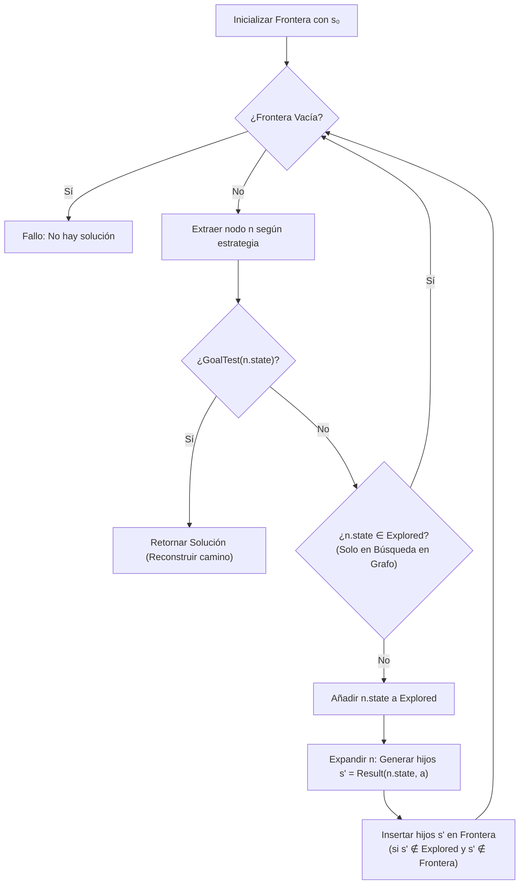
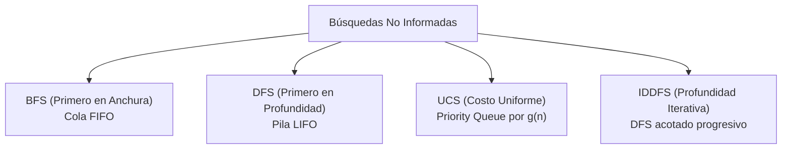
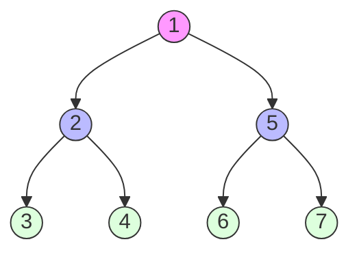
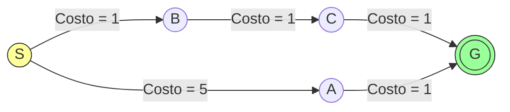
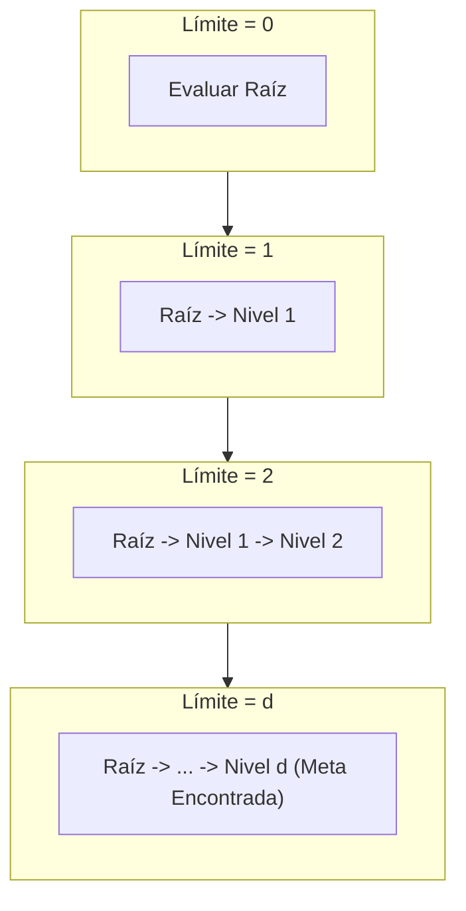
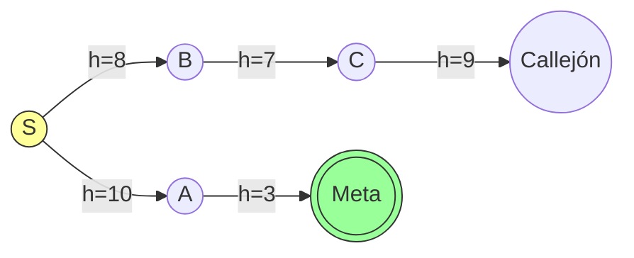
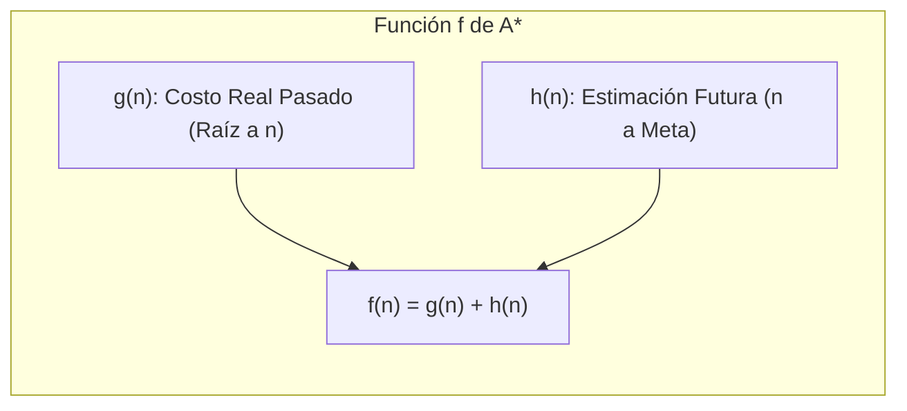

# Algoritmos de Búsqueda no Informada y Heurística

En el marco de la [[conducta racional]] y el diseño de [[Agentes Inteligentes y Entornos de Tarea (PEAS)|agentes basados en objetivos]], un agente que no puede ejecutar una acción refleja inmediata debe formular un plan deliberativo. 

La **resolución de problemas mediante búsqueda** es el paradigma clásico de la Inteligencia Artificial donde un agente explora sistemáticamente las ramificaciones de sus acciones futuras sobre un espacio de estados abstracto antes de comprometerse físicamente en el entorno.

> [!info] 💡 ¿Cómo entender esto desde cero? (Guía para novatos de pregrado)
> - **El dilema de la búsqueda:** Tienes un cubo Rubik desordenado. Hay trillones de combinaciones posibles. ¿Cómo encuentras la secuencia de movimientos para armarlo sin perderte en una eternidad de intentos?
> - **Búsquedas Ciegas (No Informadas):** No tienen idea de qué tan cerca están de la meta.
>   - **BFS (Anchura):** Explora primero todos los caminos de 1 paso, luego todos los de 2 pasos. Garantiza encontrar el camino más corto, pero consume tanta memoria RAM que tu computadora colapsa a los 10 pasos.
>   - **DFS (Profundidad):** Avanza por un solo camino hasta toparse con una pared. Gasta casi nada de memoria, pero puede perderse para siempre en un bucle infinito.
>   - **IDDFS (Profundidad Iterativa):** Lo mejor de ambos mundos: hace DFS con límites crecientes de profundidad.
> - **Búsquedas Informadas (Heurísticas):** Usan una pista ($h(n)$) para no buscar a ciegas. Si buscas una dirección en Quito, sabes que el norte te acerca a Carcelén y el sur a Quitumbe, evitando explorar caminos en la dirección contraria.

---

## 1. Formulación Formal de Problemas en Espacios de Estados

Siguiendo el marco analizado en [[problemas en IA]], un problema de búsqueda formal se define rigurosamente como una 5-tupla $\mathcal{P} = \langle S_0, \mathcal{A}, \text{Result}, \text{GoalTest}, c \rangle$:

1. **Estado Inicial ($s_0 \in \mathcal{S}$):** Configuración precisa del agente y su entorno al comenzar el proceso de búsqueda.
2. **Acciones Disponibles ($\mathcal{A}(s)$):** Conjunto finito de acciones válidas y ejecutables que el agente puede llevar a cabo dado un estado $s$:
   $$\mathcal{A}(s) = \{ a \in \mathcal{A} \mid \text{EsValida}(a, s) \}$$
3. **Modelo de Transición / Función de Resultado ($\text{Result}(s, a)$):** Especificación formal del entorno determinista que devuelve el estado resultante tras aplicar la acción $a$ en el estado $s$:
   $$\text{Result}: \mathcal{S} \times \mathcal{A} \to \mathcal{S}$$
4. **Prueba de Meta ($\text{GoalTest}(s)$):** Función booleana que determina si un estado evaluado satisface las condiciones de solución:
   $$\text{GoalTest}: \mathcal{S} \to \{\text{True}, \text{False}\}$$
   Puede definirse como un conjunto explícito de estados meta $\mathcal{S}_G \subset \mathcal{S}$ o mediante una propiedad declarativa implícita (ej. "jaque mate").
5. **Costo de Paso ($c(s, a, s')$):** Función de costo numérico asignado a la transición del estado $s$ al estado $s'$ mediante la acción $a$, donde $c(s, a, s') \ge 0$.
   - El **costo de trayectoria** $g(n)$ corresponde a la suma acumulada de los costos de cada paso desde el estado inicial hasta el nodo $n$:
     $$g(n) = \sum_{i=0}^{k-1} c(s_i, a_i, s_{i+1})$$

> [!info] Conexión con [[problemas en IA]]: Estado vs. Camino y Reversibilidad
> Tal como se definió en [[problemas en IA#Características básicas de los problemas]]:
> - En problemas de **Estado**, el camino recorrido es irrelevante; solo importa hallar una configuración válida que cumpla la meta (ej. Las 8 Reinas).
> - En problemas de **Camino**, la solución es la secuencia óptima de acciones para llegar a la meta (ej. Navegación GPS, resolución del 15-puzzle o cubo de Rubik).
> - La **reversibilidad** del espacio determina si el agente puede recuperarse de ramas erróneas sin costo fatal; en búsqueda abstracta sobre memoria, todas las transiciones son reversibles mediante *backtracking*.

---

## 2. Anatomía de un Algoritmo de Búsqueda: Árbol vs. Grafo

La búsqueda se ejecuta instanciando una estructura de datos denominada **árbol de búsqueda**, donde la raíz es $s_0$, los nodos representan estados parciales alcanzados a través de rutas concretas, y las aristas corresponden a las acciones ejecutadas.

```mermaid
flowchart TD
    subgraph EspacioDeEstados [Grafo del Espacio de Estados (Con ciclos)]
        S((S)) -->|a1| A((A))
        S -->|a2| B((B))
        A -->|a3| C((C))
        B -->|a4| C
        C -->|a5| S
        C -->|a6| G(((G)))
    end
```

### Nodo de Búsqueda vs. Estado
Un **estado** es una configuración física del mundo. Un **nodo de búsqueda** es una estructura de datos que almacena el libro contable de la búsqueda:
```python
class SearchNode:
    state: State          # Estado del mundo representado
    parent: SearchNode    # Puntero al nodo padre para reconstruir la ruta
    action: Action        # Acción ejecutada por el padre para generar este nodo
    path_cost: float      # g(n): Costo acumulado desde la raíz hasta este nodo
    depth: int            # Profundidad d en el árbol de búsqueda
```

### Búsqueda en Árbol vs. Búsqueda en Grafo (Manejo de Ciclos)
En espacios de estados con caminos redundantes o ciclos (ej. una cuadrícula de navegación donde Arriba-Abajo vuelve al mismo estado), la **búsqueda en árbol** simple sufre de una explosión combinatoria exponencial infinita al regenerar infinitamente los mismos estados.



- **Frontera (*Open List*):** Estructura de datos que almacena los nodos generados pero aún no expandidos. La elección de la estructura de datos (FIFO, LIFO, Cola de Prioridad) define la estrategia de búsqueda.
- **Conjunto Explorados (*Closed List*):** Tabla hash o conjunto que almacena todos los estados cuyos nodos ya fueron expandidos, garantizando que ningún estado se procese más de una vez.

---

## 3. Algoritmos de Búsqueda No Informada (Ciega)

Las búsquedas ciegas no poseen información sobre qué tan cerca o lejos se encuentra un estado del objetivo; solo distinguen un estado meta de uno que no lo es.

Parámetros formales de complejidad:
- $b$: Factor de ramificación (*branching factor*), número máximo de sucesores de cualquier nodo.
- $d$: Profundidad de la solución más superficial (óptima en número de pasos).
- $m$: Profundidad máxima del espacio de estados (puede ser $\infty$).



---

### 3.1 Búsqueda Primero en Anchura (BFS - *Breadth-First Search*)
- **Estructura de la Frontera:** Cola FIFO (*First-In, First-Out*).
- **Mecanismo:** Se expande la raíz, luego todos sus sucesores (profundidad 1), luego los sucesores de estos (profundidad 2), nivel por nivel.
- **Comprobación de Meta:** Se evalúa al **generar** el nodo (antes de meterlo a la cola), lo que ahorra un nivel completo de expansiones.


- **Propiedades Teóricas:**
  - **Completitud:** Sí, si $b$ es finito.
  - **Optimalidad:** Sí, siempre que todas las acciones tengan el mismo costo uniforme $c(s, a, s') = c$.
  - **Complejidad Temporal:** 
    $$\mathcal{O}(1 + b + b^2 + \dots + b^d) = \mathcal{O}(b^d)$$
  - **Complejidad Espacial:** Almacena todos los nodos en memoria (frontera + explorados):
    $$\mathcal{O}(b^d)$$

> [!danger] El Cuello de Botella de BFS: Agotamiento de Memoria
> Para un problema con $b=10$ y profundidad $d=8$, con nodos de $1\text{ KB}$, la memoria requerida es de aproximadamente:
> $$10^8 \times 1\text{ KB} = 100\text{ Gigabytes}$$
> A $d=12$, se requerirían $100\text{ Petabytes}$. En la práctica, BFS agota la memoria RAM del sistema mucho antes de que el tiempo de CPU sea un problema.

---

### 3.2 Búsqueda Primero en Profundidad (DFS - *Depth-First Search*)
- **Estructura de la Frontera:** Pila LIFO (*Last-In, First-Out*) o recursión del sistema.
- **Mecanismo:** Explora inmediatamente el camino más profundo en el árbol actual hasta topar con un nodo sin sucesores o la profundidad máxima, retrocediendo (*backtracking*) a la alternativa no explorada más reciente.



- **Propiedades Teóricas:**
  - **Completitud:** No en espacios de búsqueda infinitos o grafos con ciclos (búsqueda en árbol). Sí en espacios finitos si se registran estados visitados.
  - **Optimalidad:** No. Puede encontrar una solución en una rama extremadamente profunda cuando existía una solución a profundidad 1 en otra rama.
  - **Complejidad Temporal:** $\mathcal{O}(b^m)$, donde $m$ es la profundidad máxima del árbol ($m \ge d$). Si $m$ es grande o infinito, el tiempo es catastrófico.
  - **Complejidad Espacial:** Su gran ventaja; solo necesita almacenar el camino actual desde la raíz hasta las hojas y los hermanos no explorados:
    $$\mathcal{O}(b \cdot m)$$
    Para $b=10$ y $m=12$, solo requiere $120\text{ nodos} \approx 120\text{ KB}$.

---

### 3.3 Búsqueda de Costo Uniforme (UCS - *Uniform-Cost Search*)
- **Estructura de la Frontera:** Cola de Prioridad (*Priority Queue / Min-Heap*) ordenada por el costo acumulado $g(n)$.
- **Conexión Teórica:** Es la versión de búsqueda en espacio de estados del [[Algoritmo Dijkstra]] en grafos. Mientras Dijkstra calcula distancias mínimas a todos los vértices, UCS se detiene en cuanto la meta es extraída de la frontera.
- **Mecanismo:** En cada paso, expande el nodo $n$ de la frontera con el menor costo de trayectoria $g(n)$.
- **Comprobación de Meta:** **Crítico:** La prueba de meta debe aplicarse cuando el nodo se **extrae** (*pop*) de la frontera, NO cuando se genera. Si se probara al generar, se podría aceptar una ruta costosa prematuramente.


*En el grafo anterior, la ruta $S \to B \to C \to G$ tiene costo $3$, mientras que la ruta más directa en número de aristas $S \to A \to G$ tiene costo $6$. UCS garantiza seleccionar la ruta de costo 3.*

- **Propiedades Teóricas:**
  - **Completitud:** Sí, siempre que el costo de cada paso esté acotado inferiormente por una constante positiva $\epsilon > 0$ ($c(s, a, s') \ge \epsilon$).
  - **Optimalidad:** Sí, es óptimo para costos arbitrarios no negativos.
  - **Complejidad Temporal y Espacial:** Sea $C^*$ el costo de la solución óptima:
    $$\mathcal{O}\left(b^{1 + \lfloor C^* / \epsilon \rfloor}\right)$$
    Si todos los costos son idénticos ($c=1$), UCS se reduce exactamente a BFS ($\lfloor C^*/\epsilon \rfloor = d$).

---

### 3.4 Búsqueda en Profundidad Iterativa (IDDFS - *Iterative Deepening DFS*)
IDDFS resuelve el dilema fundamental entre el bajo consumo de memoria de DFS y la completitud/optimalidad de BFS.

- **Mecanismo:** Ejecuta internamente una serie de búsquedas DFS con límite de profundidad (*Depth-Limited Search*), incrementando el límite progresivamente: Límite = 0, Límite = 1, Límite = 2, ..., Límite = $d$.



- **Análisis de Sobrecarga por Regeneración de Nodos:**
  Pareciera ineficiente regenerar los niveles superiores repetidamente, pero la abrumadora mayoría de los nodos de un árbol residen en el nivel inferior:
  - Nodos en el nivel $d$ se generan 1 vez.
  - Nodos en el nivel $d-1$ se generan 2 veces.
  - Nodos en la raíz se generan $d+1$ veces.
  - Número total de expansiones:
    $$N(\text{IDDFS}) = (d+1) \cdot 1 + d \cdot b + (d-1) \cdot b^2 + \dots + 1 \cdot b^d = \mathcal{O}(b^d)$$
  - Comparación con BFS:
    $$\frac{N(\text{IDDFS})}{N(\text{BFS})} \approx \frac{b}{b - 1}$$
    Para un factor de ramificación típico $b=10$, la sobrecarga es de apenas un $11\%$, a cambio de reducir la memoria de gigabytes a kilobytes:
    $$\text{Memoria IDDFS} = \mathcal{O}(b \cdot d)$$

---

## 4. Algoritmos de Búsqueda Informada (Heurística)

Las búsquedas informadas utilizan una **función heurística** $h(n)$ que estima computacionalmente el costo más barato desde el estado del nodo $n$ hasta un estado meta:

$$h(n) = \text{Costo estimado de la ruta más económica de } n \text{ a la meta}$$
$$h(\text{meta}) = 0$$

---

### 4.1 Búsqueda Voraz Primero el Mejor (*Greedy Best-First Search*)
- **Estrategia:** Función de evaluación $f(n) = h(n)$. Expande en cada ciclo el nodo que parece estar más cerca de la meta según la heurística.
- **Ventaja:** Sumamente rápida cuando la heurística es precisa.
- **Defecto Crítico:** No es óptima y no es completa. Puede ser engañada por heurísticas engañosas que la conducen por callejones sin salida o bucles infinitos en espacios con grafos.


*Greedy BFS elegirá el camino $S \to B \to C$ seducido por $h(B)=8 < h(A)=10$, atrapándose en un camino subóptimo.*

---

### 4.2 El Algoritmo A* (*A-Star Search*)
El algoritmo $A^*$ evalúa los nodos combinando el costo real ya incurrido para alcanzar el nodo ($g(n)$) con la estimación heurística del costo restante ($h(n)$):

$$f(n) = g(n) + h(n)$$

Donde:
- $g(n)$: Costo exacto desde el estado inicial hasta el nodo $n$.
- $h(n)$: Costo estimado desde $n$ hasta la meta.
- $f(n)$: Costo total estimado del camino más económico que pasa por $n$ hacia la meta.



#### Condiciones de Optimalidad de A*
1. **Admisibilidad (Requerida para Búsqueda en Árbol):**
   Una heurística es **admisible** si nunca sobreestima el costo real para alcanzar la meta. Para todo nodo $n$:
   $$0 \le h(n) \le h^*(n)$$
   Donde $h^*(n)$ es el costo real mínimo para llegar de $n$ a la meta. Una heurística admisible es intrínsecamente *optimista*.

2. **Consistencia / Monotonía (Requerida para Búsqueda en Grafo):**
   Una heurística es **consistente** si satisface la desigualdad triangular. Para cualquier nodo $n$ y cualquier sucesor $n'$ generado mediante la acción $a$:
   $$h(n) \le c(n, a, n') + h(n')$$
   
> [!tip] Teorema de Consistencia
> Si $h(n)$ es consistente, entonces los valores de $f(n)$ a lo largo de cualquier camino nunca decrecen ($f(n') \ge f(n)$), y la primera vez que $A^*$ expande un estado, **ya ha encontrado el camino óptimo hacia dicho estado**. Esto elimina la necesidad de reabrir nodos en el conjunto de explorados.

---

### 4.3 Diseño de Heurísticas Admisibles mediante Problemas Relajados

La forma matemáticamente rigurosa de construir heurísticas admisibles sin inventar números arbitrarios es definir un **problema relajado**.

Un problema relajado es una simplificación del problema original donde se han eliminado restricciones a las acciones válidas. El costo de la solución óptima del problema relajado es una **heurística admisible y consistente** para el problema original.

#### Caso Canónico: El 8-Puzzle

```
Estado Actual:        Estado Meta:
+---+---+---+         +---+---+---+
| 7 | 2 | 4 |         | 1 | 2 | 3 |
+---+---+---+         +---+---+---+
| 5 |   | 6 |         | 4 | 5 | 6 |
+---+---+---+         +---+---+---+
| 8 | 3 | 1 |         | 7 | 8 |   |
+---+---+---+         +---+---+---+
```

Regla del juego original: Una ficha puede moverse a la posición adyacente vacía.
- **Relajación 1:** Una ficha puede moverse a cualquier posición adyacente (aunque esté ocupada).
  - *Heurística resultante:* **Distancia Manhattan ($h_2$):** Suma de las distancias horizontales y verticales de cada ficha hasta su casilla meta:
    $$h_2(n) = \sum_{i=1}^8 \Big(|x_i - x_{i,\text{meta}}| + |y_i - y_{i,\text{meta}}|\Big)$$
- **Relajación 2:** Una ficha puede teletransportarse directamente a su casilla meta.
  - *Heurística resultante:* **Fichas Fuera de Lugar ($h_1$):** Número de fichas que no están en su casilla final.

#### Dominancia de Heurísticas
Dadas dos heurísticas admisibles $h_1$ y $h_2$, decimos que $h_2$ **domina** a $h_1$ si:
$$\forall n, \quad h_2(n) \ge h_1(n)$$
Dado que la distancia Manhattan siempre es mayor o igual al número de fichas descolocadas ($h_2(n) \ge h_1(n)$), **$h_2$ domina a $h_1$**. $A^*$ utilizando $h_2$ expandirá estrictamente un menor o igual número de nodos que $A^*$ con $h_1$, ahorrando cómputo sin perder optimalidad.

---

## 5. Matriz Comparativa Exhaustiva de Algoritmos

| Algoritmo | Criterio de Selección | Completitud | Optimalidad | Complejidad Temporal | Complejidad Espacial | Observaciones |
| :--- | :--- | :--- | :--- | :--- | :--- | :--- |
| **BFS** | Menor profundidad $d$ (FIFO) | Sí (si $b < \infty$) | Sí (si costos uniformes) | $\mathcal{O}(b^d)$ | $\mathcal{O}(b^d)$ | Cuello de botella severo de memoria RAM. |
| **DFS** | Mayor profundidad (LIFO) | No (en grafos con ciclos / ramas $\infty$) | No | $\mathcal{O}(b^m)$ | $\mathcal{O}(b \cdot m)$ | Memoria lineal. Útil cuando hay muchas soluciones densas. |
| **UCS** | Menor costo acumulado $g(n)$ | Sí (si $c \ge \epsilon > 0$) | Sí | $\mathcal{O}(b^{1 + \lfloor C^* / \epsilon \rfloor})$ | $\mathcal{O}(b^{1 + \lfloor C^* / \epsilon \rfloor})$ | Versión de búsqueda de [[Algoritmo Dijkstra]]. |
| **IDDFS** | Profundidad progresiva | Sí (si $b < \infty$) | Sí (si costos uniformes) | $\mathcal{O}(b^d)$ | $\mathcal{O}(b \cdot d)$ | Combina completitud/optimalidad de BFS con memoria de DFS. |
| **Greedy BFS**| Menor $h(n)$ estimado | No (en grafos) | No | $\mathcal{O}(b^m)$ peor caso | $\mathcal{O}(b^m)$ | Muy veloz pero propenso a mínimos locales. |
| **A\*** | Menor $f(n) = g(n) + h(n)$ | Sí | Sí (si $h$ es admisible/consistente) | $\mathcal{O}(b^d)$ (depende del error de $h$) | $\mathcal{O}(b^d)$ | Óptimamente eficiente; ningún otro algoritmo con la misma $h$ expande menos nodos. |

---

## Notas Relacionadas y Enlaces de Vault
- [[conducta racional]] — Comportamiento y toma de decisiones óptima en IA.
- [[problemas en IA]] — Características fundamentales de problemas: descomposición, reversibilidad, y estado vs camino.
- [[Agentes Inteligentes y Entornos de Tarea (PEAS)]] — Agentes basados en objetivos y modelos de tareas.
- [[Busqueda con Adversarios (Minimax y Poda Alfa-Beta)]] — Extensión de algoritmos de búsqueda en presencia de oponentes competitivos.
- [[Algoritmo Dijkstra]] — Fundamento teórico de la búsqueda de costo uniforme.
