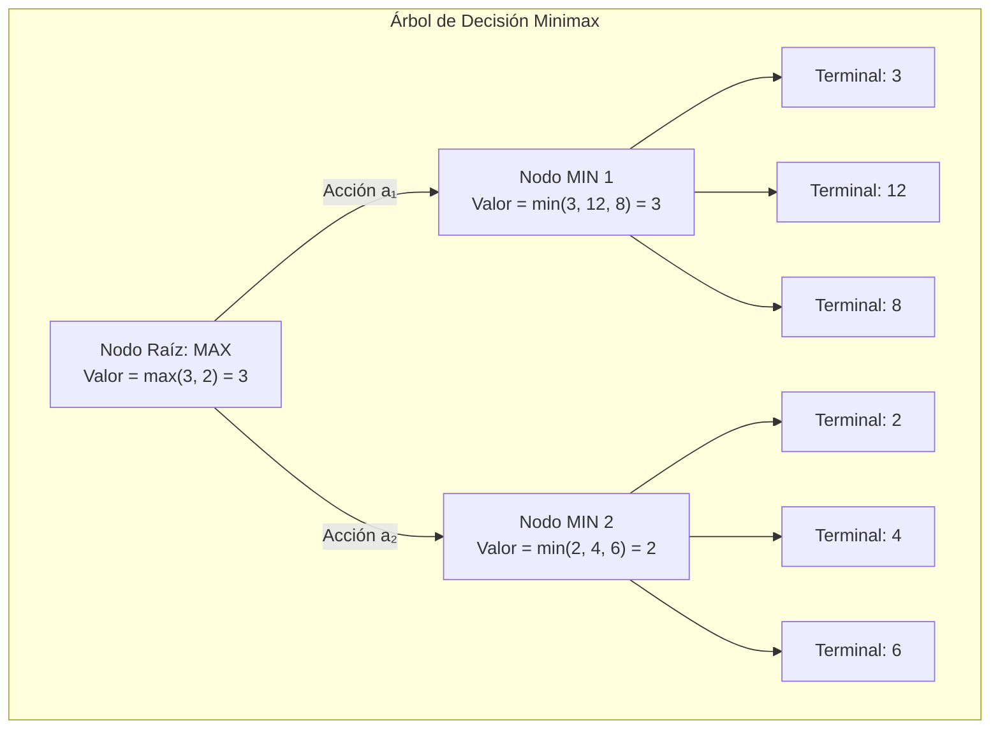
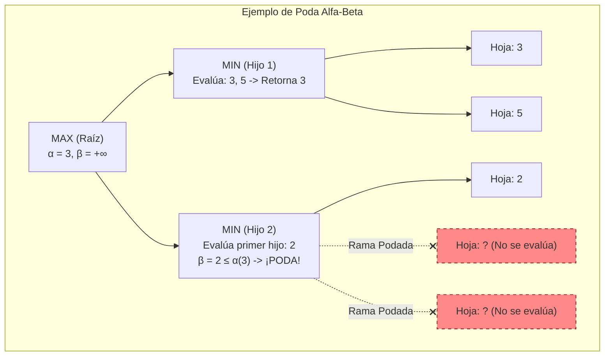
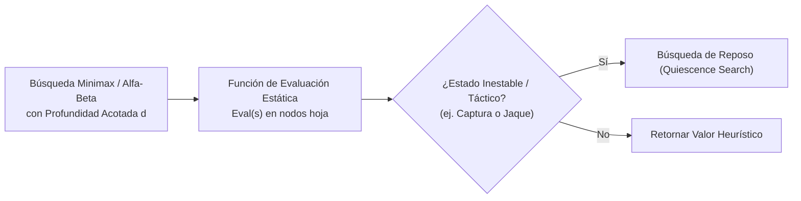

# Búsqueda con Adversarios (Minimax y Poda Alfa-Beta)

En los problemas de búsqueda clásicos ([[Algoritmos de Busqueda no Informada y Heuristica]]), el agente operaba en un entorno unipersonal donde él tenía el control absoluto de las transiciones. 

En los **entornos multiagente competitivos** (definidos en [[Agentes Inteligentes y Entornos de Tarea (PEAS)#3.6 Agente Único (Single-Agent) vs. Multiagente]]), el agente debe interactuar con otro ente racional cuyos objetivos son diametralmente opuestos a los suyos. En la teoría de la [[conducta racional]], esto se modela como un **juego de dos jugadores, por turnos, determinista, de suma cero y con información perfecta** (como el Ajedrez, las Damas, el Conecta 4 o el Go).

> [!info] Conexión con [[problemas en IA]]: Irreversibilidad y Predicción
> Tal como se analizó en [[problemas en IA#Características básicas de los problemas]]:
> - Los juegos con adversario son problemas eminentemente **irreversibles**: un movimiento en el tablero físico no puede deshacerse una vez ejecutado.
> - La **predicción** no es meramente inferir la física del mundo, sino modelar la mente del adversario, asumiendo que este siempre elegirá la peor jugada posible para nosotros.

---

## 1. Definición Formal de un Juego de Suma Cero

Un juego formal de dos jugadores ($\text{MAX}$ y $\text{MIN}$) se define mediante la tupla $\langle S_0, \text{Player}, \text{Actions}, \text{Result}, \text{TerminalTest}, \text{Utility} \rangle$:

1. **Estado Inicial ($S_0$):** Configuración inicial del juego (ej. tablero de ajedrez montado).
2. **Función de Turno ($\text{Player}(s)$):** Especifica a qué jugador le corresponde mover en el estado $s$:
   $$\text{Player}(s) \in \{\text{MAX}, \text{MIN}\}$$
3. **Acciones Legales ($\text{Actions}(s)$):** Conjunto de movimientos reglamentarios permitidos en el estado $s$.
4. **Función de Transición ($\text{Result}(s, a)$):** Estado resultante de aplicar la jugada $a$ sobre el estado $s$.
5. **Prueba de Estado Terminal ($\text{TerminalTest}(s)$):** Booleano que determina si la partida ha finalizado (jaque mate, rey ahogado, victoria, derrota o tablas).
6. **Función de Utilidad ($\text{Utility}(s, p)$):** Asigna un valor numérico final al estado terminal $s$ para el jugador $p$. En juegos de suma cero puros:
   $$\text{Utility}_{\text{MAX}}(s) = -\text{Utility}_{\text{MIN}}(s)$$
   Típicamente normalizado como: $+1$ (victoria de MAX), $-1$ (derrota de MAX / victoria de MIN), y $0$ (empate o tablas).

---

## 2. El Algoritmo Minimax

El algoritmo **Minimax** calcula la estrategia óptima para el jugador $\text{MAX}$, bajo la premisa infalible de que el oponente $\text{MIN}$ también juega de forma perfectamente racional para minimizar la recompensa de $\text{MAX}$.



### 2.1 Formulación Matemática Recursiva
El valor Minimax de un estado $s$ se define formalmente como:

$$\text{Minimax}(s) = \begin{cases} 
\text{Utility}(s) & \text{si } \text{TerminalTest}(s) \\ 
\displaystyle \max_{a \in \text{Actions}(s)} \text{Minimax}(\text{Result}(s, a)) & \text{si } \text{Player}(s) = \text{MAX} \\ 
\displaystyle \min_{a \in \text{Actions}(s)} \text{Minimax}(\text{Result}(s, a)) & \text{si } \text{Player}(s) = \text{MIN} 
\end{cases}$$

### 2.2 Propiedades y Complejidad de Minimax
Sea $b$ el factor de ramificación legal promedio y $m$ la profundidad máxima del árbol del juego:
- **Completitud:** Sí, si el árbol del juego es finito.
- **Optimalidad:** Sí, contra un oponente perfecto. (Si el oponente comete errores, Minimax no necesariamente los explota de forma voraz, pero garantiza un resultado al menos tan bueno como el valor teórico del juego).
- **Complejidad Temporal:** $\mathcal{O}(b^m)$ (realiza un recorrido en profundidad DFS completo de todo el espacio del juego).
- **Complejidad Espacial:** $\mathcal{O}(b \cdot m)$ (almacena únicamente el camino activo en la pila de recursión).

> [!warning] La Maldición Combinatoria en Juegos Reales
> En el ajedrez: $b \approx 35$, y la profundidad típica de una partida es de $m \approx 80$ turnos. El número de nodos a explorar sería:
> $$35^{80} \approx 10^{123} \text{ estados}$$
> Dado que el número estimado de átomos en el universo observable es de $\sim 10^{80}$, es físicamente imposible calcular el árbol Minimax exhaustivo hasta las hojas terminales.

---

## 3. La Poda Alfa-Beta ($\alpha$-$\beta$ Pruning)

La **Poda Alfa-Beta** es una técnica de optimización rigurosa que calcula exactamente el mismo movimiento y valor Minimax que el algoritmo exhaustivo, pero **sin explorar ramas completas que se demuestran matemáticamente irrelevantes**.



### 3.1 Definición Rigurosa de Parámetros $\alpha$ y $\beta$
Durante el recorrido en profundidad, se mantienen dos cotas a lo largo de cada nodo del árbol:
- $\alpha$: **El valor de la mejor opción (la de mayor valor) que MAX tiene garantizada hasta el momento** a lo largo de la ruta hacia la raíz. Inicializado en $-\infty$.
- $\beta$: **El valor de la mejor opción (la de menor valor) que MIN tiene garantizada hasta el momento** a lo largo de la ruta hacia la raíz. Inicializado en $+\infty$.

### 3.2 Condición Matemática de Corte
Un subárbol puede podarse inmediatamente si en cualquier momento de la exploración se cumple:

$$\alpha \ge \beta$$

- **Corte Beta ($\beta$-cut):** Ocurre dentro de un nodo $\text{MIN}$ cuando encuentra un hijo con valor $v \le \alpha$. Dado que $\text{MIN}$ elegirá un valor $\le v \le \alpha$, el padre $\text{MAX}$ (que ya tiene garantizado al menos $\alpha$) **nunca seleccionará esta rama**. El resto de hijos de $\text{MIN}$ son descartados.
- **Corte Alfa ($\alpha$-cut):** Ocurre dentro de un nodo $\text{MAX}$ cuando encuentra un hijo con valor $v \ge \beta$. Dado que el padre $\text{MIN}$ elegirá como mucho $\beta$, nunca permitirá que el juego llegue a este estado donde $\text{MAX}$ obtiene $v \ge \beta$.

### 3.3 Reducción de Complejidad Computacional
La eficacia de la poda alfa-beta depende críticamente del **orden en que se examinan los sucesores**:
- **Peor Ordenamiento:** Los peores movimientos se examinan primero. No se poda ninguna rama:
  $$\text{Complejidad} = \mathcal{O}(b^m)$$
- **Ordenamiento Óptimo (Perfecto):** Los mejores movimientos para cada jugador se exploran primero. Los cortes ocurren con la máxima frecuencia:
  $$\text{Complejidad Temporal} = \mathcal{O}\left(b^{m/2}\right) = \mathcal{O}\left(\sqrt{b^m}\right)$$

> [!tip] Doble Profundidad de Búsqueda
> Reducir la complejidad a $\mathcal{O}(b^{m/2})$ significa que con el **mismo presupuesto de tiempo de cómputo**, un motor de ajedrez puede duplicar su profundidad de búsqueda efectiva (por ejemplo, buscar a profundidad 12 en lugar de profundidad 6), transformando radicalmente la fuerza táctica del agente.

---

## 4. Decisiones Imperfectas en Tiempo Real: Motores de Juego Modernos

En la práctica, ningún motor puede llegar a los estados terminales. Se aplican técnicas de aproximación estocástica y heurística:



### 4.1 Función de Evaluación Estática ($\text{Eval}(s)$)
Reemplaza la función $\text{Utility}(s)$ cuando se alcanza un límite predeterminado de profundidad $d$. Estima la probabilidad relativa de victoria sin explorar más:

$$\text{Eval}(s) = w_1 f_1(s) + w_2 f_2(s) + \dots + w_n f_n(s)$$

Donde las características $f_i$ ponderan:
- **Balance de Material:** Asignación numérica a piezas (Peón=1, Caballo=3, Alfil=3.2, Torre=5, Dama=9).
- **Control del Centro y Espacio:** Casillas dominadas por peones y piezas menores.
- **Seguridad del Rey:** Integridad del enroque y peones de cobertura.
- **Estructura de Peones:** Penalización por peones doblados, aislados o retrasados.

### 4.2 El Efecto Horizonte (*Horizon Effect*) y Búsqueda de Reposo
El **efecto horizonte** ocurre cuando un evento desfavorable inevitable se retrasa artificialmente empujándolo más allá del límite de profundidad de búsqueda mediante jugadas intermedias irrelevantes (ej. sacrificios fútiles).

- **Solución: Búsqueda de Reposo (*Quiescence Search*):** Cuando se alcanza la profundidad $d$, el evaluador no se detiene si la posición es "inestable" (hay capturas de piezas en curso, jaques o amenazas tácticas inmediatas). Continúa evaluando exclusivamente jugadas tácticas (capturas y recapturas) hasta que la posición se vuelve "quieta" o en reposo (*quiescent*), evitando evaluaciones estáticas distorsionadas.

### 4.3 Tablas de Transposición
En muchos juegos, se llega exactamente a la misma posición por distintas permutaciones de movimientos (e.g. 1. e4 e5 2. Nf3 Nc6 vs. 1. Nf3 Nc6 2. e4 e5). 
Las **tablas de transposición** son cachés hash en memoria de alta velocidad (indexadas mediante **Zobrist Hashing**) que guardan el valor exacto de posiciones ya evaluadas y sus cotas alfa/beta, evitando recalcular ramas redundantes.

---

## 5. Implementación en Python: Minimax con Poda Alfa-Beta

A continuación se presenta una implementación canónica y modular del algoritmo con poda $\alpha$-$\beta$:

```python
from typing import Tuple, List, Optional
import math

class GameState:
    """Interfaz abstracta para el estado del juego."""
    def is_terminal(self) -> bool:
        raise NotImplementedError
        
    def get_utility(self) -> float:
        raise NotImplementedError
        
    def evaluate(self) -> float:
        """Función de evaluación heurística para estados no terminales."""
        raise NotImplementedError
        
    def get_actions(self) -> List[any]:
        raise NotImplementedError
        
    def apply_action(self, action: any) -> 'GameState':
        raise NotImplementedError

def alpha_beta_search(
    state: GameState, 
    max_depth: int, 
    alpha: float = -math.inf, 
    beta: float = math.inf, 
    maximizing_player: bool = True
) -> Tuple[float, Optional[any]]:
    """
    Retorna una tupla (mejor_valor, mejor_accion) utilizando poda alfa-beta.
    """
    if state.is_terminal():
        return state.get_utility(), None
    
    if max_depth == 0:
        return state.evaluate(), None
    
    best_action = None
    
    if maximizing_player:
        max_eval = -math.inf
        for action in state.get_actions():
            child_state = state.apply_action(action)
            eval_score, _ = alpha_beta_search(
                child_state, max_depth - 1, alpha, beta, False
            )
            
            if eval_score > max_eval:
                max_eval = eval_score
                best_action = action
                
            alpha = max(alpha, eval_score)
            if alpha >= beta:
                # Corte Beta: MIN nunca permitirá este camino
                break
        return max_eval, best_action
    
    else:
        min_eval = math.inf
        for action in state.get_actions():
            child_state = state.apply_action(action)
            eval_score, _ = alpha_beta_search(
                child_state, max_depth - 1, alpha, beta, True
            )
            
            if eval_score < min_eval:
                min_eval = eval_score
                best_action = action
                
            beta = min(beta, eval_score)
            if alpha >= beta:
                # Corte Alfa: MAX nunca permitirá este camino
                break
        return min_eval, best_action
```

---

## Notas Relacionadas y Enlaces de Vault
- [[conducta racional]] — Toma de decisiones óptima y maximización del valor esperado.
- [[problemas en IA]] — Características de problemas: reversibilidad, estado vs camino, y predicción en entornos complejos.
- [[Agentes Inteligentes y Entornos de Tarea (PEAS)]] — Agentes en entornos multiagente competitivos.
- [[Algoritmos de Busqueda no Informada y Heuristica]] — Algoritmos de búsqueda en espacios de estados unipersonales.
