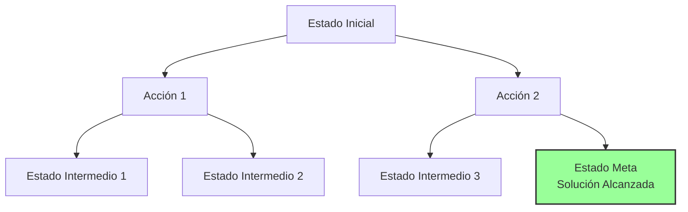

## Características básicas de los problemas
- **Descomposición:** Es la habilidad de dividir y descomponer un problema complejo en subproblemas más simples y fáciles de manejar (divide y vencerás).
- **Reversibilidad:** Es la capacidad del sistema de volver a un estado anterior después de haber ejecutado una acción, útil en problemas donde los pasos pueden deshacerse fácilmente (ej. el cubo de Rubik).
- **Absolutismo vs Relativismo:** Se refiere a determinar si existe una solución absoluta (única y perfecta) para el problema, o si existen múltiples soluciones posibles que varían en calidad, donde el objetivo es encontrar la mejor de ellas (relativa).
- **Predicción:** Es la capacidad del agente de anticipar y predecir los resultados o consecuencias de una acción o evento futuro en entornos no completamente observables.
- **Estado vs Camino:** Distingue si la solución al problema es simplemente alcanzar el estado final (ej. encontrar la salida de un laberinto) o si la solución importa toda la secuencia de pasos o el camino recorrido para llegar a ese estado (ej. la demostración de un teorema matemático).

- **Conocimiento:** Describe el grado en el cual el conocimiento previo introducido en el sistema puede ser utilizado o es indispensable para resolver el problema eficientemente.
- **Interacción humana:** Determina si existe la necesidad o el grado de participación de interacción con expertos humanos durante el proceso de resolución del problema.

> [!info] Explicación
> **¿Por qué son importantes estas características?** En Inteligencia Artificial, antes de programar un agente o elegir un algoritmo (como búsqueda A*, algoritmos genéticos o redes neuronales), primero debes modelar y analizar el problema. Si sabes que tu problema es *irreversible* (como el ajedrez: una vez que mueves la pieza, no puedes deshacer la jugada), necesitarás un algoritmo que planifique meticulosamente a futuro antes de actuar. Si el problema permite *descomposición*, podrás procesarlo en paralelo y será mucho más rápido de resolver.

![[Pasted image 20231115154452.png]]

## Notas relacionadas
- [[conducta racional]]
- [[machine learning]]
- [[Algoritmo Dijkstra]]
