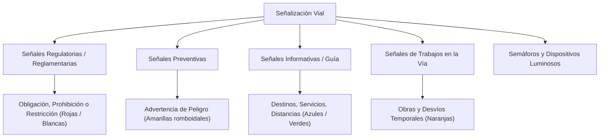

# Leyes y Normativas de Tránsito (Ecuador - COIP y LOTTTSV)

> [!info] 💡 Propósito de la nota
> Esta nota resume las principales infracciones, sanciones penales y administrativas, límites de velocidad y clasificación de señalización vial vigentes en el Ecuador según el **Código Orgánico Integral Penal (COIP)** y la **Ley Orgánica de Transporte Terrestre, Tránsito y Seguridad Vial (LOTTTSV)**.

---

## 1. Marco Jurídico General

- **Ley Orgánica de Transporte Terrestre, Tránsito y Seguridad Vial (LOTTTSV):** Norma rectora del transporte y la movilidad a nivel nacional. Establece competencias de la Agencia Nacional de Tránsito (ANT), Gobiernos Autónomos Descentralizados (GADs / Agentes Civiles de Tránsito) y Policía Nacional.
- **Código Orgánico Integral Penal (COIP):** Tipifica los delitos y contravenciones de tránsito, estableciendo penas privativas de libertad, multas pecuniarias (calculadas sobre el Salario Básico Unificado - SBU) y reducción de puntos en la licencia de conducir (iniciando con 30 puntos).

---

## 2. Contravenciones de Primera Clase y Casos Críticos (COIP Art. 386)

Sanción general: **Multa de 1 Salario Básico Unificado (SBU)**, **reducción de 10 puntos** en la licencia de conducir y **3 días de pena privativa de libertad**:

1. **Exceso de velocidad fuera del rango moderado.**
2. **Conductor que falte de palabra o de obra a la autoridad o agentes de tránsito.**
3. **Conducir con vehículo cuyas llantas se encuentren lisas o en mal estado** (además de la retención del vehículo).
4. **Conducir sin haber obtenido previamente la licencia de conducir.**

---

## 3. Conducción Bajo Efectos del Alcohol (COIP Art. 385)

Las sanciones para conductores de vehículos particulares se gradúan según el nivel de alcohol por litro de sangre:

| Nivel de Alcohol en Sangre (g/L) | Sanción Económica | Reducción de Puntos | Privación de Libertad | Suspensión de Licencia |
| :--- | :--- | :--- | :--- | :--- |
| **0.3 a 0.8 g/L** | 1 SBU | 5 puntos | 5 días de prisión | — |
| **0.8 a 1.2 g/L** | 2 SBU | 10 puntos | 15 días de prisión | — |
| **Mayor a 1.2 g/L** | 3 SBU | Pérdida total (o agravado) | 30 días de prisión | Suspensión por 60 días |

> [!warning] Conductores de Transporte Público o Comercial
> Para conductores de vehículos de transporte público, comercial o de carga, la tolerancia es sustancialmente menor: el límite máximo tolerable es **0.1 g/L**. Si se supera este nivel, la sanción es de **90 días de prisión**, pérdida de **30 puntos** y revocatoria definitiva o suspensión prolongada.

---

## 4. Límites de Velocidad y Rangos Moderados

El reglamento de tránsito establece rangos moderados y rangos fuera de límite. Exceder el rango moderado activa la sanción privativa de libertad (Art. 386 COIP):

| Tipo de Vía / Vehículo | Límite Máximo Permitido | Rango Moderado | Fuera de Rango Moderado (Art. 386) |
| :--- | :--- | :--- | :--- |
| **Urbana (Vehículos Livianos)** | 50 km/h | 50 a 60 km/h | > 60 km/h (1 SBU + 3 días cárcel + -10 pts) |
| **Perimetral (Vehículos Livianos)** | 90 km/h | 90 a 120 km/h | > 120 km/h |
| **Carreteras / Rectas (Livianos)** | 100 km/h | 100 a 135 km/h | > 135 km/h |
| **Transporte Público en Carretera** | 90 km/h | 90 a 100 km/h | > 100 km/h |
| **Transporte de Carga en Carretera** | 70 km/h | 70 a 85 km/h | > 85 km/h |

- **Dentro del rango moderado:** Contravención de cuarta clase (30% SBU y -6 puntos).
- **Fuera del rango moderado:** Contravención de primera clase (1 SBU, -10 puntos y 3 días de prisión).

---

## 5. Señalización Vial (Norma Técnica INEN)

El sistema vial ecuatoriano clasifica la señalización vertical en las siguientes categorías (con un catálogo normativo de más de 900 señales):

### Clasificación y Sanciones Asociadas
1. **Regulatorias o Prohibitivas:** Indican límites, prohibiciones y prioridades (ej. PARE, Ceda el Paso, No Girar a la Izquierda). Desobedecerlas acarrea sanciones de 30% del SBU y reducción de 6 puntos.
2. **Preventivas:** Alertan sobre riesgos geográficos, curvas peligrosas, cruces de peatones o estrechamientos.
3. **Informativas o Guía:** Orientan al conductor sobre direcciones, distancias, servicios turísticos y de emergencia.
4. **De Trabajo / Especiales:** Color naranja para zonas de construcción o mantenimiento.
5. **Semafóricas y Luminosas:** El irrespeto a luz roja conlleva sanción económica (30% SBU) y pérdida de puntos.

---

## 6. Resumen de Puntos y Sanciones Pecuniarias

- Cada conductor inicia con **30 puntos** en su licencia de conducir.
- **Desobediencia general de señales de tránsito:** Multa del 10% del SBU y reducción de 3 puntos.
- **Infracción de prohibición expresa (ej. semáforo en rojo o contravía):** Multa del 30% del SBU y reducción de 6 puntos.
- Los puntos pueden recuperarse mediante cursos aprobados ante la ANT tras cumplir los periodos de sanción establecidos en la LOTTTSV.
