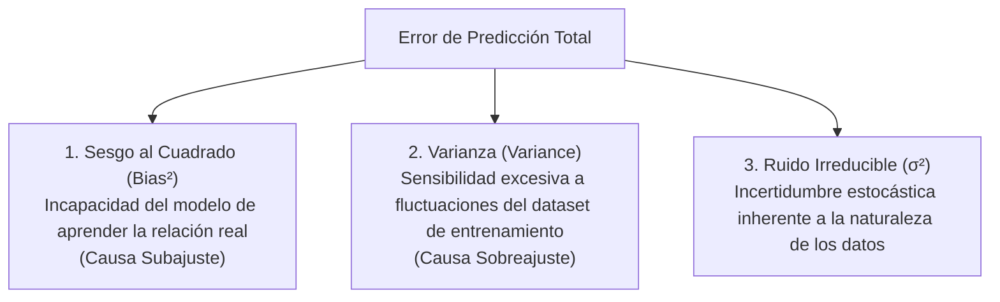
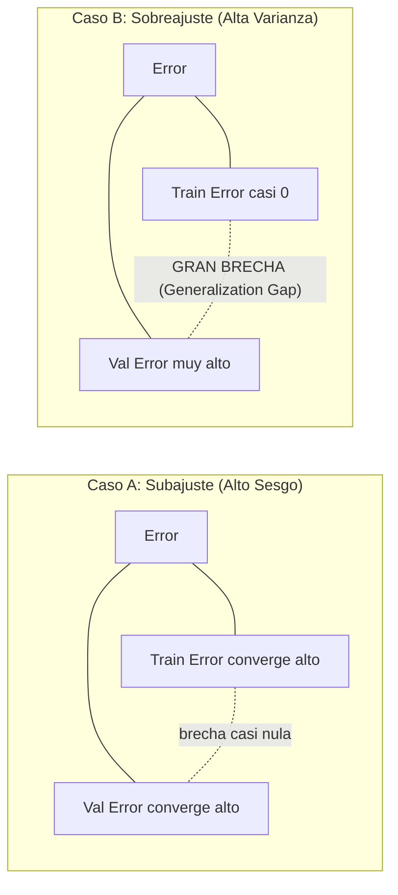
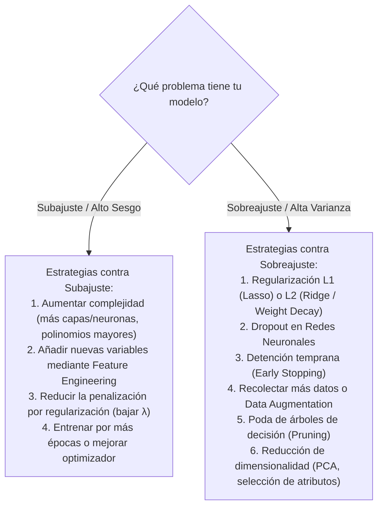

# Ajuste de Modelos en Machine Learning (Subajuste, Sobreajuste y Compensación Sesgo-Varianza)

En el aprendizaje automático, el **ajuste de modelos** (*model tuning* y *model fitting*) es el proceso de calibrar la complejidad de una hipótesis matemática para que capture los patrones reales subyacentes en los datos sin memorizar el ruido espurio del conjunto de entrenamiento. La meta final no es que el modelo memorice el pasado, sino que logre una alta **capacidad de generalización** ante datos nunca antes vistos.

> [!info] 💡 ¿Cómo entender esto desde cero? (Guía para novatos de pregrado)
> - **Analogía del estudiante y el examen:**
>   - **Subajuste (Underfitting):** El estudiante apenas hojeó el libro la noche anterior. En el examen no puede responder preguntas fáciles ni difíciles porque no aprendió los conceptos básicos (el modelo es demasiado tonto o simple).
>   - **Sobreajuste (Overfitting):** El estudiante memorizó al pie de la letra los ejercicios del cuaderno con puntos y comas exactos. En los deberes saca 10/10, pero cuando el profesor cambia un solo número en el examen, el estudiante colapsa y reprueba (el modelo memorizó el ruido y no sabe generalizar).
>   - **Ajuste Óptimo (Sweet Spot):** El estudiante entendió los principios fundamentales. Puede resolver problemas con números nuevos porque aprendió el razonamiento detrás de los datos.
> - **El dilema de la manta corta:** Si haces tu modelo muy rígido para evitar equivocarte con datos raros, fallarás en capturar la tendencia real (alto sesgo). Si lo haces ultra flexible para ajustarse a cada dato, será inestable y cualquier pequeña fluctuación cambiará drásticamente sus predicciones (alta varianza).

---

## 1. El Dilema Sesgo-Varianza (*Bias-Variance Tradeoff*)

Matemáticamente, para cualquier problema de regresión con ruido irreducible $\epsilon \sim \mathcal{N}(0, \sigma^2)$ donde $y = f(x) + \epsilon$, el Error Cuadrático Medio Esperado ($\text{MSE}$) de un estimador $\hat{f}(x)$ se descompone aditivamente en tres términos ortogonales:

$$\mathbb{E}\left[(y - \hat{f}(x))^2\right] = \underbrace{\left(\mathbb{E}[\hat{f}(x)] - f(x)\right)^2}_{\text{Sesgo}^2 \text{ (Bias)}^2} + \underbrace{\mathbb{E}\left[\left(\hat{f}(x) - \mathbb{E}[\hat{f}(x)]\right)^2\right]}_{\text{Varianza (Variance)}} + \underbrace{\sigma^2}_{\text{Error Irreducible}}$$



| Dimensión | Subajuste (*Underfitting*) | Sobreajuste (*Overfitting*) | Ajuste Óptimo (*Good Fit*) |
| :--- | :--- | :--- | :--- |
| **Error en Entrenamiento ($J_{\text{train}}$)** | Alto | Extremadamente bajo | Bajo / Aceptable |
| **Error en Validación ($J_{\text{val}}$)** | Alto (similar a $J_{\text{train}}$) | Muy alto ($J_{\text{val}} \gg J_{\text{train}}$) | Bajo (muy cercano a $J_{\text{train}}$) |
| **Diagnóstico principal** | Alto Sesgo (*High Bias*) | Alta Varianza (*High Variance*) | Balance óptimo |
| **Complejidad del modelo** | Insuficiente (ej. recta para datos parabólicos) | Excesiva (ej. polinomio grado 25 con 30 puntos) | Adecuada para la dimensionalidad |

---

## 2. Detección Mediante Curvas de Aprendizaje (*Learning Curves*)

Las curvas de aprendizaje grafican el error de entrenamiento y de validación en función del tamaño del conjunto de entrenamiento $N$ o del número de épocas de optimización.



> [!important] Regla de Oro del Diagnóstico
> - Si **ambos errores son altos y planos**, agregar más datos de entrenamiento NO ayudará; necesitas un modelo con mayor capacidad representativa o mejores características.
> - Si hay una **gran brecha** entre el error de entrenamiento (muy bajo) y el de validación (alto), agregar más datos de entrenamiento o aplicar regularización sí cerrará la brecha.

---

## 3. Estrategias para Combatir el Subajuste y el Sobreajuste



---

## 4. Ajuste de Hiperparámetros (*Hyperparameter Tuning*)

Los parámetros del modelo (pesos $W$, sesgos $b$) se aprenden mediante algoritmos de optimización ([[Gradient Descent]]). En cambio, los **hiperparámetros** (tasa de aprendizaje $\alpha$, factor de regularización $\lambda$, profundidad máxima del árbol, número de vecinos $K$) deben fijarse antes del entrenamiento.

### Métodos Principales:
1. **Grid Search (Búsqueda en Rejilla):** Evalúa exhaustivamente el producto cartesiano de todas las combinaciones especificadas. Es determinista pero exponencial en costo computacional ($\mathcal{O}(m^d)$).
2. **Random Search (Búsqueda Aleatoria):** Muestrea combinaciones aleatorias de distribuciones continuas o discretas. Bergstra y Bengio (2012) demostraron que supera a Grid Search al explorar más eficientemente las dimensiones más sensibles del espacio de hiperparámetros.
3. **Optimización Bayesiana:** Modela la función de rendimiento del modelo como un proceso gaussiano y utiliza funciones de adquisición (como *Expected Improvement*) para decidir qué combinación de hiperparámetros evaluar a continuación, minimizando el número de entrenamientos costosos.

---

## 5. Implementación en Python con Scikit-Learn

```python
import numpy as np
from sklearn.model_selection import GridSearchCV, KFold
from sklearn.linear_model import Ridge
from sklearn.preprocessing import StandardScaler
from sklearn.pipeline import Pipeline

# 1. Pipeline para prevenir Data Leakage
pipeline = Pipeline([
    ('scaler', StandardScaler()),
    ('model', Ridge())
])

# 2. Espacio de hiperparámetros a explorar
param_grid = {
    'model__alpha': np.logspace(-3, 3, 20)  # De 0.001 a 1000
}

# 3. Validación Cruzada de 5 pliegues
cv = KFold(n_splits=5, shuffle=True, random_state=42)
grid_search = GridSearchCV(
    estimator=pipeline,
    param_grid=param_grid,
    cv=cv,
    scoring='neg_mean_squared_error',
    return_train_score=True,
    n_jobs=-1
)

# 4. Ajuste óptimo
# grid_search.fit(X_train, y_train)
# print(f"Mejor lambda: {grid_search.best_params_}")
```

---

## Notas Relacionadas
- [[bias y viarianza]] — Demostración matemática detallada y formal de los componentes del error.
- [[Regularización]] — Formulación de normas $L_1$ (Lasso) y $L_2$ (Ridge / Tikhonov) para controlar varianza.
- [[Validacion Cruzada]] — Métodos de partición de datos para una evaluación libre de sesgo.
- [[metodo hold out]] — Partición clásica Train/Val/Test y protocolos de evaluación.
- [[test harness]] — Diseño del arnés de pruebas para comparación sistemática de algoritmos.
