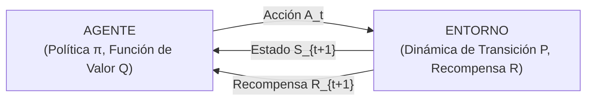
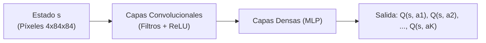

# Aprendizaje por Refuerzo (Q-Learning y MDP)

El **Aprendizaje por Refuerzo** (*Reinforcement Learning* o **RL**) constituye, junto al aprendizaje supervisado y el no supervisado, uno de los tres pilares fundamentales descritos en [[tipos de machine learning]]. 

A diferencia del aprendizaje supervisado —donde el modelo aprende de un supervisor externo que proporciona etiquetas de verdad fundamental (*ground truth*)—, en el RL un **agente autónomo** aprende a tomar secuencias de decisiones óptimas mediante un proceso dinámico de **ensayo y error**, interactuando continuamente con un entorno estocástico para maximizar una señal escalar acumulada de **recompensa** (*reward*).

---

## 1. Fundamentos del Paradigma (Sutton & Barto)

El marco clásico propuesto por Richard Sutton y Andrew Barto modela la interacción continua entre el agente y el entorno a través de pasos temporales discretos $t = 0, 1, 2, \dots$:



1. En el instante $t$, el agente percibe la representación del estado actual del entorno $S_t \in \mathcal{S}$.
2. En base a su conocimiento, el agente selecciona y ejecuta una acción $A_t \in \mathcal{A}(S_t)$.
3. El entorno responde transicionando a un nuevo estado $S_{t+1} \in \mathcal{S}$ y entregando al agente una recompensa numérica escalar $R_{t+1} \in \mathbb{R}$.
4. El objetivo del agente es hallar una **política** $\pi(a|s) = \mathbb{P}(A_t = a \mid S_t = s)$ que maximice el retorno esperado a largo plazo.

---

## 2. Procesos de Decisión de Markov (MDP)

El formalismo matemático estándar para describir problemas de aprendizaje por refuerzo es el **Proceso de Decisión de Markov** (*Markov Decision Process* o MDP).

### 2.1 Definición Formal
Un MDP se define rigurosamente mediante la 5-tupla $\langle \mathcal{S}, \mathcal{A}, \mathcal{P}, \mathcal{R}, \gamma \rangle$:

1. $\mathcal{S}$ es el conjunto (espacio) de todos los estados válidos del entorno.
2. $\mathcal{A}$ es el conjunto de acciones accesibles para el agente.
3. $\mathcal{P}$ es la función de probabilidad de transición de estados:
   $$\mathcal{P}_{ss'}^a = \mathbb{P}(S_{t+1} = s' \mid S_t = s, \, A_t = a)$$
4. $\mathcal{R}$ es la función de recompensa esperada tras ejecutar la acción $a$ en el estado $s$ y transicionar a $s'$:
   $$\mathcal{R}(s, a) = \mathbb{E}[R_{t+1} \mid S_t = s, \, A_t = a]$$
5. $\gamma \in [0, 1)$ es el **factor de descuento temporal**.

### 2.2 La Propiedad de Markov
Un entorno satisface la **Propiedad de Markov** si la distribución de probabilidad del siguiente estado y la recompensa dependen única y exclusivamente del estado actual y la acción tomada, siendo condicionalmente independientes de la historia pasada de estados y acciones previas:

$$\mathbb{P}(S_{t+1} = s', \, R_{t+1} = r \mid S_t = s_t, \, A_t = a_t, \, S_{t-1} = s_{t-1}, \dots, S_0 = s_0, \, A_0 = a_0) = \mathbb{P}(S_{t+1} = s', \, R_{t+1} = r \mid S_t = s_t, \, A_t = a_t)$$

> [!important] Implicación Práctica en Ingeniería
> La propiedad de Markov garantiza que el estado actual $S_t$ actúa como un **estadístico suficiente** de toda la trayectoria histórica. El agente no necesita almacenar ni reprocesar la memoria episódica previa para tomar la decisión óptima presente.

---

## 3. Retorno Descontado y Ecuaciones de Bellman

### 3.1 Función de Retorno Descontado ($G_t$)
Dado que un proceso puede extenderse indefinidamente (horizontes temporales infinitos), la meta no puede ser simplemente sumar recompensas directas sin acotar. Se introduce el retorno descontado $G_t$:

$$G_t = \sum_{k=0}^{\infty} \gamma^k R_{t+k+1} = R_{t+1} + \gamma R_{t+2} + \gamma^2 R_{t+3} + \dots = R_{t+1} + \gamma G_{t+1}$$

**Justificación del factor de descuento $\gamma \in [0, 1)$:**
- **Convergencia Matemática:** Asegura que $\sum_{k=0}^{\infty} \gamma^k R_{\max} = \frac{R_{\max}}{1 - \gamma} < \infty$, evitando divergencias infinitas.
- **Preferencia Temporal:** Modela matemáticamente el principio financiero y conductual de que una recompensa inmediata tiene mayor certidumbre y valor que una recompensa demorada en un futuro lejano.
- **Tolerancia a Incertidumbre:** Si $\gamma \to 0$, el agente es miope (*greedy* inmediato); si $\gamma \to 1$, el agente se vuelve extremadamente previsor y paciente.

### 3.2 Funciones de Valor
- **Función de Valor de Estado ($V^{\pi}(s)$):** Retorno esperado partiendo del estado $s$ bajo la política $\pi$:
  $$V^{\pi}(s) = \mathbb{E}_{\pi}[G_t \mid S_t = s]$$
- **Función de Valor de Acción / Calidad ($Q^{\pi}(s, a)$):** Retorno esperado partiendo del estado $s$, ejecutando la acción $a$, y siguiendo en adelante la política $\pi$:
  $$Q^{\pi}(s, a) = \mathbb{E}_{\pi}[G_t \mid S_t = s, \, A_t = a]$$

### 3.3 Ecuaciones de Bellman y Ecuación de Optimalidad
Descomponiendo recursivamente el retorno esperado en la recompensa inmediata más el valor descontado del siguiente estado:

$$V^{\pi}(s) = \sum_{a \in \mathcal{A}} \pi(a|s) \left[ \mathcal{R}(s, a) + \gamma \sum_{s' \in \mathcal{S}} \mathcal{P}(s'|s, a) V^{\pi}(s') \right]$$

$$Q^{\pi}(s, a) = \mathcal{R}(s, a) + \gamma \sum_{s' \in \mathcal{S}} \mathcal{P}(s'|s, a) \sum_{a' \in \mathcal{A}} \pi(a'|s') Q^{\pi}(s', a')$$

Para la **política óptima** $\pi^*$, la función de valor óptima $Q^*(s, a) = \max_{\pi} Q^{\pi}(s, a)$ satisface la **Ecuación de Optimalidad de Bellman**:

$$Q^*(s, a) = \mathcal{R}(s, a) + \gamma \sum_{s' \in \mathcal{S}} \mathcal{P}(s'|s, a) \max_{a' \in \mathcal{A}} Q^*(s', a')$$

---

## 4. El Dilema de Exploración vs Explotación y la Política $\epsilon$-Greedy

Una tensión fundamental e intrínseca al RL es:
- **Explotación (*Exploitation*):** Tomar la mejor acción conocida hasta el momento según la tabla $Q(s, a)$ actual para maximizar la recompensa a corto plazo.
- **Exploración (*Exploration*):** Seleccionar acciones subóptimas o no exploradas para descubrir si conducen a trayectorias de recompensa cualitativamente superiores a largo plazo.

### Política $\epsilon$-Greedy (*Epsilon-Greedy Policy*)
Para balancear este compromiso, se define la regla estocástica de toma de decisiones:

$$\pi(a|s) = \begin{cases} 1 - \epsilon + \frac{\epsilon}{|\mathcal{A}|} & \text{si } a = \arg\max_{a'} Q(s, a') \\ \frac{\epsilon}{|\mathcal{A}|} & \text{si } a \neq \arg\max_{a'} Q(s, a') \end{cases}$$

En la práctica, con probabilidad $1 - \epsilon$ el agente explota la mejor acción conocida (*greedy*), y con probabilidad $\epsilon$ explora una acción elegida de manera uniforme en $\mathcal{A}$.

```
      DECAIMIENTO TEMPORAL DE EPSILON (ε-DECAY)
      ε (Probabilidad de Exploración)
      1.0 ┬───┐
          │    \
          │     \   Fase de Exploración Agresiva
      0.5 │      \
          │       └───┐
          │            \───┐  Fase de Explotación y Convergencia
      0.0 └───┴───┴───┴────┴──────────► Episodios de Entrenamiento
          0             Episodios_Max
```

Esquema de decaimiento común: $\epsilon_{t+1} = \max(\epsilon_{\min}, \, \epsilon_t \cdot \delta_{\text{decay}})$.

---

## 5. El Algoritmo Q-Learning (Watkins, 1989)

**Q-Learning** es un algoritmo fundamental con tres atributos distintivos:
1. **Libre de Modelo (*Model-Free*):** No requiere conocer a priori las probabilidades de transición $\mathcal{P}(s'|s, a)$ ni la función de recompensas $\mathcal{R}(s, a)$; aprende interactuando directamente con el entorno.
2. **Basado en Diferencias Temporales (TD(0)):** Actualiza sus estimaciones paso a paso sin esperar al final del episodio (a diferencia de los métodos de Monte Carlo), utilizando *bootstrapping*.
3. **Fuera de Política (*Off-Policy*):** Aprende la función de valor óptima $Q^*$ de la política codiciosa (*greedy target* $\max_{a'} Q(s', a')$) mientras ejecuta una política de comportamiento exploratoria diferente ($\epsilon$-greedy).

### 5.1 Regla de Actualización Fundamental de Q-Learning

Al experimentar la transición $(s, a, r, s')$, el agente actualiza la entrada tabular correspondiente mediante:

$$Q(s, a) \leftarrow Q(s, a) + \alpha \underbrace{\left[ r + \gamma \max_{a'} Q(s', a') - Q(s, a) \right]}_{\text{Error de Diferencia Temporal (TD Error) } \delta_t}$$

donde:
- $\alpha \in (0, 1]$ es la **tasa de aprendizaje** (*learning rate*).
- $r + \gamma \max_{a'} Q(s', a')$ es el **Objetivo TD** (*TD Target*).
- $\delta_t$ cuantifica la sorpresa o discrepancia entre la recompensa observada más el potencial futuro y la estimación previa.

> [!note] Teorema de Convergencia (Watkins & Dayan, 1992)
> Si todos los pares estado-acción $(s, a)$ se visitan infinitas veces y la tasa de aprendizaje cumple las condiciones clásicas de aproximación estocástica de Robbins-Monro:
> 
> $$\sum_{t=1}^{\infty} \alpha_t = \infty \quad \text{y} \quad \sum_{t=1}^{\infty} \alpha_t^2 < \infty$$
> 
> entonces $Q(s, a)$ converge casi seguramente hacia el valor óptimo $Q^*(s, a)$.

---

## 6. De Q-Learning Tabular a Deep Q-Networks (DQN)

En problemas de ingeniería del mundo real o videojuegos (e.g., juegos de Atari), el espacio de estados $\mathcal{S}$ es continuo o de dimensionalidad masiva (imágenes de $210 \times 160$ píxeles en RGB con $(256)^{3 \times 210 \times 160}$ configuraciones posibles). 

Una tabla $Q(s, a)$ se vuelve impracticable:
1. Requiere memoria infinita.
2. Es incapaz de generalizar conocimiento a estados no vistos que compartan similitudes visuales o físicas.

### 6.1 Aproximación Paramétrica de Funciones con Redes Neuronales
Para superar esto, Volodymyr Mnih et al. (DeepMind, 2013, 2015 en *Nature*) introdujeron **Deep Q-Networks (DQN)**, aproximando la función de calidad mediante una red neuronal profunda parametrizada por pesos $\theta$:

$$Q(s, a) \approx Q(s, a; \theta)$$

En tareas visuales, la red toma como entrada la imagen de píxeles sin procesar y utiliza capas de [[Redes Neuronales Convolucionales (CNN)]] para extraer características espaciales de alto nivel, emitiendo un valor escalar $Q(s, a_i)$ para cada acción discreta posible $a_i \in \mathcal{A}$.



### 6.2 Las Dos Claves de Estabilización de DQN
La aplicación ingenua de redes neuronales a la ecuación de Bellman genera divergencias e inestabilidades severas debido a que:
- Las transiciones sucesivas están fuertemente correlacionadas temporalmente (violación del supuesto de muestras independientes).
- El objetivo a optimizar depende de los mismos parámetros $\theta$ que se están modificando (*moving target problem*).

DeepMind resolvió categóricamente estas patologías mediante dos innovaciones:

#### A. Búfer de Reproducción de Experiencia (*Experience Replay*)
Las transiciones del agente $e_t = (s_t, a_t, r_t, s_{t+1}, done)$ se almacenan en un búfer circular de memoria $\mathcal{D} = \{e_1, \dots, e_N\}$ de tamaño acotado (e.g., $10^6$ pasos). Durante el entrenamiento:
- En lugar de entrenar con el paso recién ocurrido, se extrae un **minibatch aleatorio uniforme** de experiencias $\mathcal{B} \sim \mathcal{D}$.
- Esto destruye las autocorrelaciones temporales entre observaciones sucesivas y transforma el problema de optimización en un ajuste estocástico similar al aprendizaje supervisado i.i.d.

#### B. Red Objetivo Congelada (*Target Network*)
Se mantienen dos conjuntos de parámetros:
1. La red de comportamiento en línea (*Online Network* con parámetros $\theta$).
2. La red objetivo (*Target Network* con parámetros congelados $\theta^-$).

La función de pérdida cuadrática de Bellman para el minibatch se define como:

$$\mathcal{L}(\theta) = \mathbb{E}_{(s, a, r, s') \sim \mathcal{D}} \left[ \left( r + \gamma \max_{a'} Q(s', a'; \, \theta^-) - Q(s, a; \, \theta) \right)^2 \right]$$

El objetivo $y = r + \gamma \max_{a'} Q(s', a'; \theta^-)$ se evalúa con los pesos fijos $\theta^-$, previniendo bucles de retroalimentación positiva inestables. Cada $C$ iteraciones (e.g., cada $10.000$ pasos), los parámetros se sincronizan: $\theta^- \leftarrow \theta$.

---

## 7. Pseudocódigo Algorítmico Riguroso: Deep Q-Learning

```text
Algoritmo: Deep Q-Learning con Experience Replay y Target Network
─────────────────────────────────────────────────────────────────────────────
1:  Inicializar capacidad del búfer de reproducción D a tamaño N
2:  Inicializar pesos de la red Q en línea θ de forma aleatoria
3:  Inicializar pesos de la red target θ⁻ ← θ
4:  Para cada episodio e = 1 hasta E do:
5:      Inicializar estado s_1
6:      Para cada paso de tiempo t = 1 hasta T do:
7:          Con probabilidad ε seleccionar acción aleatoria a_t ∈ A
8:          En caso contrario seleccionar a_t = argmax_a Q(s_t, a; θ)
9:          Ejecutar acción a_t en el entorno
10:         Observar recompensa r_t, nuevo estado s_{t+1} y bandera terminal d_t
11:         Almacenar transición (s_t, a_t, r_t, s_{t+1}, d_t) en D
12:         s_t ← s_{t+1}
13:
14:         // Paso de Optimización
15:         Muestrear minibatch aleatorio de transiciones {(s_j, a_j, r_j, s_{j+1}, d_j)} desde D
16:         Para cada muestra j en el minibatch:
17:             Si d_j es verdadero (estado terminal):
18:                 y_j = r_j
19:             Si no:
20:                 y_j = r_j + γ · max_{a'} Q(s_{j+1}, a'; θ⁻)
21:         Realizar un paso de Gradient Descent sobre (y_j - Q(s_j, a_j; θ))² respecto a θ
22:
23:         // Sincronización periódica de la red objetivo
24:         Cada C pasos fijar θ⁻ ← θ
25:     Fin Para
26:     Decaer valor de ε según el esquema prefijado
27: Fin Para
─────────────────────────────────────────────────────────────────────────────
```

---

## 8. Notas Relacionadas
- [[tipos de machine learning]]: Comparativa estructural entre aprendizaje supervisado, no supervisado y por refuerzo.
- [[machine learning]]: Principios inductivos y formulación de espacios de hipótesis.
- [[Redes neuronales]]: Fundamentos de aproximación universal de funciones que posibilitan el Deep Q-Learning.
- [[Gradient Descent]]: Algoritmos estocásticos empleados para minimizar el error cuadrático medio de Bellman.
- [[bias y viarianza]]: Análisis de sobreestimación del valor en Q-Learning (sesgo positivo por el operador $\max$) y trade-off en aproximadores profundos.
- [[modelos de regresion]]: Formulación de la estimación del valor de acción $Q(s,a)$ como un problema de regresión sobre objetivos móviles.
- [[Redes Neuronales Convolucionales (CNN)]]: Arquitecturas para extraer tensores de características a partir de imágenes de videojuegos o sensores robóticos en DQN.
- [[Ajuste de modelos]]: Métodos para evitar sobreajuste en políticas y sobreestimación de valores de acción.
- [[curvas roc]] y [[metricas para clasificadores]]: Enfoques diagnósticos alternativos para evaluar decisiones binarias o multiclase de agentes.
