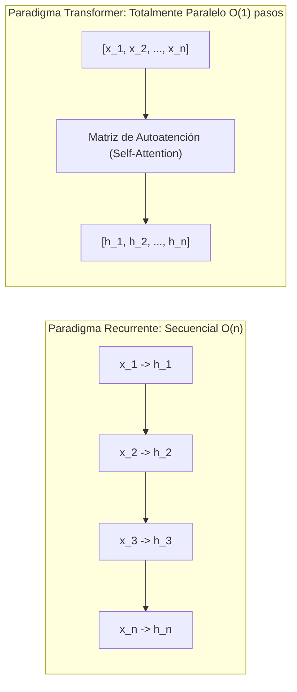
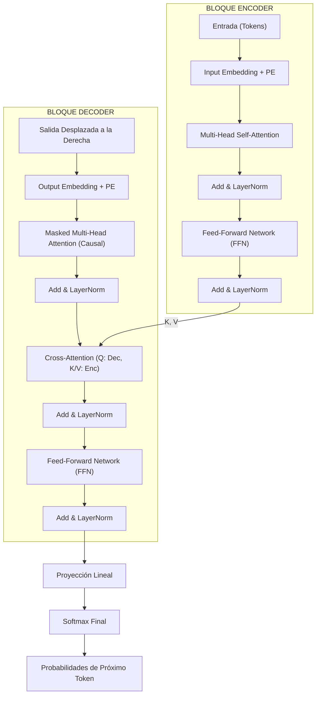

# Arquitectura Transformer y Mecanismo de Atención

Presentada por Vaswani et al. (2017) en el seminal artículo *"Attention Is All You Need"*, la **Arquitectura Transformer** constituye el paradigma predominante en el procesamiento del lenguaje natural (NLP), visión por computadora (Vision Transformers) y la base matemática de los **Grandes Modelos de Lenguaje** (*Large Language Models* o LLMs).

El Transformer supuso una ruptura epistemológica radical: demostró que es posible modelar dependencias complejas y secuencias arbitrarias basándose exclusivamente en **mecanismos de autoatención** (*self-attention*), prescindiendo por completo de la recurrencia temporal ([[Redes Neuronales Recurrentes (RNN) y LSTM|RNN/LSTM]]) y de los operadores de convolución local ([[Redes Neuronales Convolucionales (CNN)|CNN]]).

---

## 1. El Quiebre del Paradigma Secuencial

### 1.1 El Fin de la Dependencia Recurrente $\mathcal{O}(n)$
Hasta 2017, el modelado secuencial dependía de la recursión temporal:

$$h_t = f(h_{t-1}, x_t)$$

Esta formulación impone una restricción computacional insuperable: **el paso $t$ no puede ejecutarse hasta que el paso $t-1$ haya finalizado por completo**. Esta barrera secuencial $\mathcal{O}(n)$:
1. **Impide la Paralelización en Hardware Acelerador:** Las GPUs y TPUs modernas integran miles de núcleos de procesamiento tensorial optimizados para álgebra matricial masivamente paralela. Las RNNs dejan a las GPUs sustancialmente ociosas debido a la dependencia temporal lineal.
2. **Cuello de Botella de Compresión Semántica:** Forzar a una oración de 50 palabras a resumirse en un único vector de estado oculto $h_T$ genera una pérdida inevitable de matices en las palabras tempranas de la secuencia.
3. **Complejidad de Camino de Propagación:** La distancia de propagación del gradiente entre la primera y la última palabra escala linealmente como $\mathcal{O}(n)$, dificultando la captura de dependencias gramaticales y fácticas de largo alcance.

El Transformer resuelve esto permitiendo que cada token interactúe directamente con todos los demás tokens de la secuencia en una única operación matricial $\mathcal{O}(1)$ en profundidad de pasos, alcanzando una paralelización completa durante el entrenamiento.



---

## 2. Mecanismo de Atención: Scaled Dot-Product y Multi-Head Attention

### 2.1 Analogía con Sistemas de Recuperación de Información
El mecanismo de atención emula conceptualmente las consultas en motores de búsqueda y bases de datos relacionales:
- **Query ($Q$):** El vector de consulta que formula la pregunta ("¿Qué información estoy buscando desde la perspectiva del token actual?").
- **Key ($K$):** El vector de clave o descriptor de cada token en el contexto ("¿Qué tipo de información ofrezco yo como token?").
- **Value ($V$):** El contenido sustantivo o semántico transportado por cada token ("Si mi clave coincide con tu consulta, este es el valor que te entrego").

### 2.2 Atención Producto Escalar Escalada (*Scaled Dot-Product Attention*)

Dadas las matrices empaquetadas de consultas $Q \in \mathbb{R}^{n \times d_k}$, claves $K \in \mathbb{R}^{m \times d_k}$ y valores $V \in \mathbb{R}^{m \times d_v}$, la operación de atención se define formalmente como:

$$\text{Attention}(Q, K, V) = \text{softmax}\left(\frac{Q K^T}{\sqrt{d_k}}\right) V$$

```
                           Matriz Q       Matriz K^T
                              │               │
                              ▼               ▼
                           ┌─────────────────────┐
                           │ Matriz de Productos │
                           │     Escalares       │
                           └──────────┬──────────┘
                                      │ (Q · K^T)
                                      ▼
                           ┌─────────────────────┐
                           │ Escalamiento /√d_k  │
                           └──────────┬──────────┘
                                      │
                                      ▼
                           ┌─────────────────────┐
                           │  Máscara Opcional   │ (Causal / Padding)
                           └──────────┬──────────┘
                                      │
                                      ▼
                           ┌─────────────────────┐
                           │  Softmax por Filas  │ (Pesos de Atención α_ij)
                           └──────────┬──────────┘
                                      │
                                      ├──────────────┐ Matriz V
                                      ▼              ▼
                           ┌────────────────────────────┐
                           │ Multiplicación Matricial   │
                           │   ∑ α_ij · V_j             │
                           └──────────┬─────────────────┘
                                      ▼
                           Salida de Contexto
```

#### Justificación Matemática Rigurosa del Factor de Escala $\frac{1}{\sqrt{d_k}}$
Supóngase que los componentes de los vectores fila $q \in \mathbb{R}^{d_k}$ y $k \in \mathbb{R}^{d_k}$ son variables aleatorias independientes e idénticamente distribuidas (i.i.d.) con media cero y varianza unitaria:

$$\mathbb{E}[q_i] = \mathbb{E}[k_i] = 0, \quad \operatorname{Var}(q_i) = \operatorname{Var}(k_i) = 1$$

El producto escalar $q \cdot k = \sum_{i=1}^{d_k} q_i k_i$ tiene valor esperado:

$$\mathbb{E}[q \cdot k] = \sum_{i=1}^{d_k} \mathbb{E}[q_i k_i] = \sum_{i=1}^{d_k} \mathbb{E}[q_i] \mathbb{E}[k_i] = 0$$

Por la propiedad de varianza de la suma de variables independientes:

$$\operatorname{Var}(q \cdot k) = \sum_{i=1}^{d_k} \operatorname{Var}(q_i k_i) = \sum_{i=1}^{d_k} \left( \mathbb{E}[q_i^2]\mathbb{E}[k_i^2] - (\mathbb{E}[q_i k_i])^2 \right) = \sum_{i=1}^{d_k} (1 \cdot 1 - 0) = d_k$$

Por consiguiente, la desviación estándar del producto escalar es $\sigma = \sqrt{d_k}$. 
- Para dimensiones elevadas de representación (e.g., $d_k = 64$ o $d_k = 128$), los productos escalares adquieren magnitudes absolutas muy grandes ($\pm 20$ o más).
- Cuando entradas de magnitud elevada se introducen en la función Softmax, esta satura en regiones asintóticas extremas, donde su derivada analítica tiende a cero:

$$\frac{\partial \text{softmax}(z)_i}{\partial z_j} = \text{softmax}(z)_i (\delta_{ij} - \text{softmax}(z)_j) \approx 0$$

Al dividir por $\sqrt{d_k}$, la varianza del argumento del softmax se normaliza exactamente a $1$:

$$\operatorname{Var}\left(\frac{q \cdot k}{\sqrt{d_k}}\right) = \frac{1}{d_k} \operatorname{Var}(q \cdot k) = \frac{d_k}{d_k} = 1$$

preservando gradientes saludables y estables durante el proceso de [[Gradient Descent]].

### 2.3 Atención Multicabezal (*Multi-Head Attention*)

En lugar de calcular una única función de atención sobre la dimensión global $d_{\text{model}}$, la atención multicabezal proyecta linealmente las consultas, claves y valores $h$ veces con transformaciones aprendibles distintas hacia subespacios de menor dimensión $d_k = d_v = d_{\text{model}} / h$:

$$\text{MultiHead}(Q, K, V) = \text{Concat}(\text{head}_1, \, \text{head}_2, \, \dots, \, \text{head}_h) \, W^O$$

$$\text{head}_i = \text{Attention}\left(Q W_i^Q, \, K W_i^K, \, V W_i^V\right)$$

donde las matrices de proyección paramétricas son:
- $W_i^Q \in \mathbb{R}^{d_{\text{model}} \times d_k}$
- $W_i^K \in \mathbb{R}^{d_{\text{model}} \times d_k}$
- $W_i^V \in \mathbb{R}^{d_{\text{model}} \times d_v}$
- $W^O \in \mathbb{R}^{h d_v \times d_{\text{model}}}$

> [!tip] Razón Lingüística y Semántica de Múltiples Cabezas
> La atención multicabezal dota al modelo de la capacidad de enfocar simultáneamente diferentes tipos de dependencias contextuales. Por ejemplo, en una oración compleja:
> - La **Cabeza 1** puede aprender a seguir concordancias sintácticas sujeto-verbo ("El ingeniero *diseña*").
> - La **Cabeza 2** puede rastrear resoluciones de correferencia pronominal ("El servidor falló porque *su* memoria se agotó").
> - La **Cabeza 3** puede enfocar relaciones semánticas de largo alcance o tópicos globales.

---

## 3. Codificación Posicional (*Positional Encoding*)

Dado que el cálculo de atención matricial $Q K^T$ opera como un conjunto no ordenado (*permutation invariant*):

$$\text{Attention}(\mathbf{P} Q, \, \mathbf{P} K, \, \mathbf{P} V) = \mathbf{P} \, \text{Attention}(Q, K, V)$$

donde $\mathbf{P}$ es cualquier matriz de permutación, el modelo sería completamente incapaz de distinguir entre *"el perro mordió al humano"* y *"el humano mordió al perro"*.

Para inyectar la información del orden secuencial sin alterar las dimensiones tensoriales, Vaswani et al. propusieron sumar al vector de embedding de cada token un vector de **Codificación Posicional Sinusoidal**:

$$x_{\text{input}} = \text{Embedding}(token) + PE$$

$$PE_{(pos, \, 2i)} = \sin\left(\frac{pos}{10000^{\frac{2i}{d_{\text{model}}}}}\right)$$

$$PE_{(pos, \, 2i+1)} = \cos\left(\frac{pos}{10000^{\frac{2i}{d_{\text{model}}}}}\right)$$

donde:
- $pos$ es la posición discreta del token en la secuencia ($0 \le pos < L$).
- $i$ es el índice de la dimensión dentro del vector de embedding ($0 \le i < d_{\text{model}} / 2$).
- Las longitudes de onda forman una progresión geométrica desde $2\pi$ hasta $10000 \cdot 2\pi$.

> [!note] Propiedad de Desplazamiento Lineal Relativo
> La elección de senos y cosenos permite al modelo atender fácilmente a distancias relativas: para cualquier desplazamiento constante $k$, existe una matriz ortogonal de transformación lineal $M_k$ dependiente únicamente de $k$ tal que:
> 
> $$PE_{pos + k} = M_k \cdot PE_{pos}$$
> 
> gracias a las identidades trigonométricas de suma de ángulos: $\sin(\alpha + \beta) = \sin\alpha \cos\beta + \cos\alpha \sin\beta$.
> En arquitecturas contemporáneas (LLaMA, Mistral) se utilizan generalizaciones rotacionales más sofisticadas como **RoPE** (*Rotary Position Embeddings*).

---

## 4. Bloques Fundamentales del Transformer

Cada capa del Transformer apila de forma sistemática dos subcapas principales: un bloque de atención y una red densa por posición (*Feed-Forward Network*), interconectadas mediante conexiones residuales y normalización por capas.

```
                          Entrada Subcapa x
                                 │
                   ┌─────────────┴─────────────┐
                   │                           │ (Salto Residual)
                   ▼                           │
             ┌───────────┐                     │
             │ Subcapa   │ (MHA o FFN)         │
             │ Cómputo   │                     │
             └─────┬─────┘                     │
                   ▼                           │
                 Sub(x)                        │
                   │                           │
                   ▼                           ▼
                  ( + ) <──────────────────────┘  (Add: x + Sub(x))
                    │
                    ▼
           ┌─────────────────┐
           │ LayerNorm (LN)  │
           └────────┬────────┘
                    ▼
                 Salida
```

### 4.1 Conexiones Residuales y Normalización (*Add & Norm*)
Siguiendo los principios de [[Redes Neuronales Convolucionales (CNN)|ResNet]], cada subcapa computa:

$$\text{Salida} = \text{LayerNorm}(x + \text{SubLayer}(x))$$

A diferencia de *Batch Normalization* (que normaliza a lo largo del lote de ejemplos), **Layer Normalization** normaliza a lo largo de las características de cada token individualmente, siendo completamente independiente del tamaño de minibatch:

$$\text{LayerNorm}(z) = \frac{z - \mu}{\sqrt{\sigma^2 + \epsilon}} \odot \gamma + \beta$$

donde $\mu$ y $\sigma^2$ son la media y varianza calculadas a través de la dimensión $d_{\text{model}}$.

### 4.2 Red Neuronal Feed-Forward por Posición (FFN)
Cada posición procesa su vector de manera idéntica e independiente mediante dos transformaciones afines con una función no lineal intermedia:

$$\text{FFN}(x) = \max\left(0, \, x W_1 + b_1\right) W_2 + b_2$$

Típicamente, la dimensión interna se expande por un factor de 4 ($d_{\text{ff}} = 4 \times d_{\text{model}}$) para dotar a la red de capacidad memorística y asociativa no lineal (en modelos modernos como LLaMA se usa activación **SwiGLU**).

---

## 5. Máscaras de Atención (*Attention Masking*)

1. **Máscara de Padding (*Padding Mask*):** Impide que el mecanismo de atención calcule similitudes o propague información desde tokens artificiales de relleno (`<PAD>`), estableciendo sus posiciones en la matriz $Q K^T$ en $-\infty$ antes del softmax, de modo que $\text{softmax}(-\infty) = 0$.
2. **Máscara Causal (*Look-Ahead / Causal Mask*):** Empleada obligatoriamente en el bloque **Decoder** para preservar la naturaleza autorregresiva en la generación de texto. 
   - La matriz de máscara causal $M \in \mathbb{R}^{L \times L}$ contiene ceros en la diagonal y el triángulo inferior, y $-\infty$ en el triángulo estrictamente superior:
   
   $$M_{ij} = \begin{cases} 0 & \text{si } j \le i \\ -\infty & \text{si } j > i \end{cases}$$
   
   - Al sumar $M$ a $Q K^T / \sqrt{d_k}$, se garantiza matemáticamente que el token en el paso $i$ solo pueda atender a tokens en posiciones $j \le i$, impidiendo que el modelo "mire hacia el futuro" durante el entrenamiento supervisado.

---

## 6. Diagrama de la Arquitectura Completa (Vaswani et al.)



---

## 7. Taxonomía de Grandes Modelos de Lenguaje (LLMs)

La arquitectura general del Transformer ha originado tres familias especializadas según la configuración de sus bloques:

```
               ARQUITECTURA TRANSFORMER ORIGINAL (Encoder-Decoder)
                                   │
         ┌─────────────────────────┼─────────────────────────┐
         ▼                         ▼                         ▼
   SOLO ENCODER              SOLO DECODER             ENCODER-DECODER
 (Autoencoding)            (Autoregressive)         (Seq-to-Seq Clásico)
   BERT, RoBERTa         GPT-3/4, LLaMA, Mistral          T5, BART
```

### 7.1 Solo Encoder (*Autoencoding Models*)
- **Modelos:** BERT (Devlin et al., 2018), RoBERTa, DeBERTa.
- **Mecanismo:** Atención completamente bidireccional sin máscaras causales. Se entrenan mediante *Masked Language Modeling* (MLM), donde el modelo predice tokens ocultos aleatoriamente (`[MASK]`).
- **Casos de Uso Primarios:** Clasificación de texto, extracción de entidades nombradas (NER), análisis de sentimiento y **generación de embeddings contextuales de alta fidelidad**.
- **Conexión con RAG:** Estos modelos constituyen el motor de indexación de vectores semánticos en sistemas de [[retrival augmented generation|RAG (Retrieval-Augmented Generation)]].

### 7.2 Solo Decoder (*Autoregressive Models*)
- **Modelos:** GPT-2/3/4 (OpenAI), LLaMA 1/2/3 (Meta), Mistral / Mixtral, Gemma (Google).
- **Mecanismo:** Emplean exclusivamente atención enmascarada causal. Su objetivo de entrenamiento es la predicción del siguiente token (*Next Token Prediction* / Causal Language Modeling):
  
  $$\max_\theta \sum_{i=1}^N \log P(x_i \mid x_{<i}; \theta)$$

- **Casos de Uso Primarios:** Generación libre y coherente de texto, razonamiento deductivo paso a paso (*Chain of Thought*), agentes conversacionales e ingeniería de código.

### 7.3 Encoder-Decoder (*Sequence-to-Sequence Models*)
- **Modelos:** T5 (*Text-to-Text Transfer Transformer*), BART.
- **Mecanismo:** El Encoder procesa el contexto de entrada bidireccionalmente y el Decoder genera una secuencia de salida autorregresiva condicionada por la matriz de *Cross-Attention*.
- **Casos de Uso Primarios:** Traducción automática entre idiomas dispares, resúmenes abstractivos y reformulación de documentos extensos.

---

## 8. Implementación Canónica en PyTorch: Scaled Dot-Product y Multi-Head Attention

```python
import math
import torch
import torch.nn as nn


class ScaledDotProductAttention(nn.Module):
    """
    Cálculo canónico de la atención escalada por producto punto:
    Attention(Q, K, V) = softmax(Q @ K.T / sqrt(d_k) + Mask) @ V
    """
    def __init__(self, dropout: float = 0.1):
        super().__init__()
        self.dropout = nn.Dropout(dropout)

    def forward(
        self,
        q: torch.Tensor,
        k: torch.Tensor,
        v: torch.Tensor,
        mask: torch.Tensor = None
    ) -> tuple[torch.Tensor, torch.Tensor]:
        # Dimensiones esperadas: [Batch, Heads, Seq_Len, d_k]
        d_k = q.size(-1)
        scores = torch.matmul(q, k.transpose(-2, -1)) / math.sqrt(d_k)

        if mask is not None:
            # Reemplazar ceros de la máscara con -inf para anularlos en el Softmax
            scores = scores.masked_fill(mask == 0, float("-inf"))

        attn_weights = torch.softmax(scores, dim=-1)
        attn_weights = self.dropout(attn_weights)
        output = torch.matmul(attn_weights, v)
        return output, attn_weights


class MultiHeadAttention(nn.Module):
    """
    Bloque de Atención Multicabezal con proyecciones paralelas eficientes.
    """
    def __init__(self, d_model: int, num_heads: int, dropout: float = 0.1):
        super().__init__()
        assert d_model % num_heads == 0, "d_model debe ser divisible por num_heads"

        self.d_model = d_model
        self.num_heads = num_heads
        self.d_k = d_model // num_heads

        # Proyecciones lineales conjuntas para Q, K, V
        self.q_proj = nn.Linear(d_model, d_model)
        self.k_proj = nn.Linear(d_model, d_model)
        self.v_proj = nn.Linear(d_model, d_model)
        self.out_proj = nn.Linear(d_model, d_model)

        self.attention = ScaledDotProductAttention(dropout=dropout)

    def forward(
        self,
        query: torch.Tensor,
        key: torch.Tensor,
        value: torch.Tensor,
        mask: torch.Tensor = None
    ) -> torch.Tensor:
        batch_size = query.size(0)

        # 1. Proyecciones lineales y reorganización a [Batch, Heads, Seq_Len, d_k]
        q = self.q_proj(query).view(batch_size, -1, self.num_heads, self.d_k).transpose(1, 2)
        k = self.k_proj(key).view(batch_size, -1, self.num_heads, self.d_k).transpose(1, 2)
        v = self.v_proj(value).view(batch_size, -1, self.num_heads, self.d_k).transpose(1, 2)

        # 2. Computar atención escalada en paralelo sobre todas las cabezas
        context, _ = self.attention(q, k, v, mask=mask)

        # 3. Concatenación de cabezas y proyección final
        context = context.transpose(1, 2).contiguous().view(batch_size, -1, self.d_model)
        output = self.out_proj(context)
        return output


if __name__ == "__main__":
    batch = 2
    seq_len = 8
    d_model = 64
    heads = 4

    mha = MultiHeadAttention(d_model=d_model, num_heads=heads)
    dummy_tokens = torch.randn(batch, seq_len, d_model)

    # Máscara causal triangular inferior para Decoder autorregresivo
    causal_mask = torch.tril(torch.ones(seq_len, seq_len)).unsqueeze(0).unsqueeze(0)
    
    out = mha(dummy_tokens, dummy_tokens, dummy_tokens, mask=causal_mask)
    print(f"Forma del tensor procesado por Multi-Head Attention: {out.shape}")
    assert out.shape == (batch, seq_len, d_model)
```

---

## 9. Notas Relacionadas
- [[machine learning]]: Paradigma general de entrenamiento de modelos a partir de corpus masivos de datos.
- [[tipos de machine learning]]: Enfoques autosupervisados (Next Token Prediction, Masked LM) y transfer learning.
- [[Redes neuronales]]: Fundamentos de propagación hacia adelante, funciones de activación y capas densas.
- [[Redes Neuronales Recurrentes (RNN) y LSTM]]: Arquitecturas secuenciales previas superadas por la autoatención paralela.
- [[Redes Neuronales Convolucionales (CNN)]]: Mecanismos alternativos de extracción de características locales e invarianza espacial.
- [[retrival augmented generation]]: Arquitectura sistémica que acopla LLMs con bases de datos vectoriales para enriquecer la generación con fuentes externas.
- [[Gradient Descent]]: Algoritmos de optimización AdamW y programadores de tasa de aprendizaje (*warmup schedules*) esenciales en Transformers.
- [[bias y viarianza]]: Análisis de capacidad extrema y técnicas para mitigar el sobreajuste en modelos con miles de millones de parámetros.
- [[Regularización]]: Estrategias de Dropout, Layer Normalization y decaimiento de pesos.
- [[Reduccion de Dimensionalidad (PCA y t-SNE)]]: Métodos para visualizar y proyectar las representaciones de embeddings latentes de modelos Transformers.
