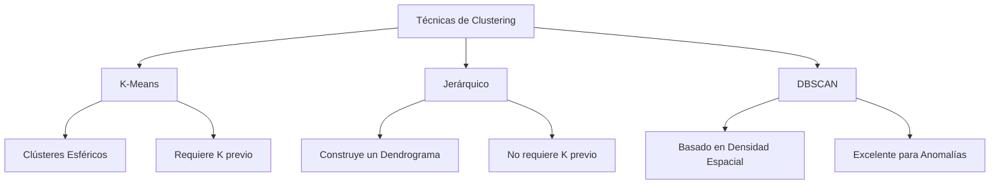

# Clustering (Agrupamiento)

El **Clustering** es indiscutiblemente la técnica más importante y utilizada dentro de la rama del Aprendizaje No Supervisado. Su objetivo estadístico central es segmentar o agrupar un conjunto masivo de datos no etiquetados en distintos subconjuntos o "clústeres". El propósito del algoritmo es garantizar que los datos contenidos dentro de un mismo clúster exhiban una enorme similitud matemática entre sí, siendo simultáneamente lo más diferentes y distantes posible de los datos pertenecientes a los otros clústeres.

## Algoritmos Principales de Clustering

### 1. K-Means
Es, de lejos, el algoritmo de agrupamiento más famoso, intuitivo y de ejecución más veloz.
- **Funcionamiento Dinámico:** Como primer paso, el usuario debe definir previamente y de forma manual el número deseado de clústeres, representado por el hiperparámetro $K$. El algoritmo procede a ubicar aleatoriamente $K$ puntos centrales (llamados "centroides") en el espacio de datos. A continuación, cada registro del dataset se asigna matemáticamente al centroide que tenga más cerca (usualmente midiendo la distancia Euclidiana). Acto seguido, la posición de los centroides se recalcula de forma exacta promediando las coordenadas de todos los puntos que le fueron asignados. Este ciclo se repite de forma iterativa hasta que la posición de los centroides se estabiliza y deja de moverse.
- **Limitaciones Técnicas:** Su principal desventaja es que te obliga a conocer o estimar el valor óptimo de $K$ de antemano. Además, su naturaleza matemática asume que los clústeres tendrán siempre una forma geométrica esférica o circular, lo cual suele fallar con datos de distribución irregular.

### 2. Clustering Jerárquico
A diferencia de K-Means, esta familia de algoritmos no requiere que el ingeniero defina el número total de clústeres a priori.
- Su mecanismo construye paulatinamente una jerarquía visual de agrupaciones. Usualmente opera mediante un enfoque aglomerativo (bottom-up), uniendo iterativamente los pares de datos o clústeres más cercanos geométricamente, repitiendo el proceso hasta consolidar todo en un único y masivo clúster raíz.
- Este extenso proceso se representa visualmente mediante un diagrama de árbol llamado **Dendrograma**. Observando el dendrograma, el analista puede "cortar" las ramas del árbol en el nivel de altura deseado para obtener exactamente el número de agrupaciones que mejor se adapte a su problema.

### 3. DBSCAN (Clustering Basado en Densidad)
DBSCAN agrupa de forma inteligente aquellos puntos que se encuentran densamente empaquetados en regiones de alta concentración, y aísla y marca deliberadamente como ruido o anomalías (outliers) a los puntos dispersos en regiones de baja densidad.
- **Ventaja Suprema:** Posee una capacidad excelente para descubrir clústeres que poseen formas geométricas completamente arbitrarias e irregulares. Además, es sumamente robusto frente a valores atípicos severos que destruirían fácilmente a un algoritmo como K-Means.

> [!info] Explicación Práctica
> En la realidad industrial corporativa, los algoritmos de clustering son masivamente utilizados para la segmentación automatizada de clientes en campañas de marketing, en los motores de búsqueda y sistemas de recomendación (para encontrar artículos similares a los que un usuario ya compró), en la detección de fraudes o anomalías bancarias, y como un paso exploratorio previo indispensable en complejas tareas de análisis de datos para revelar estructuras latentes que permanecían ocultas.

## Notas relacionadas
- [[tipos de machine learning]]
- [[Preprocesamiento de datos]]
