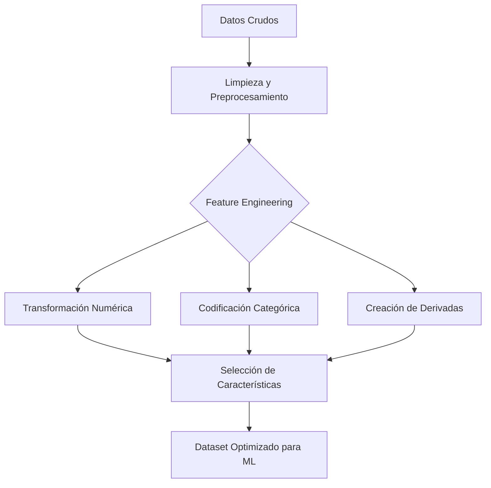

# Feature Engineering (Ingeniería de Características)

El **Feature Engineering** es el arte y la ciencia estadística de extraer, transformar o crear nuevas variables predictivas (denominadas *características* o *features*) a partir de los datos crudos originales. El propósito principal de este proceso es mejorar sustancialmente el rendimiento predictivo y la precisión de los algoritmos de Machine Learning.

En la industria, el Feature Engineering es a menudo considerado el paso más crítico e influyente para lograr un modelo de alto rendimiento, siendo incluso más determinante que la elección del propio algoritmo matemático a utilizar.

## Técnicas Comunes

### 1. Transformación de Datos Numéricos
- **Escalado y Normalización:** Muchos algoritmos fundamentales (como SVM, KNN y Redes Neuronales) son extremadamente sensibles a la escala y magnitud de los datos. Si una variable maneja valores en millones (ej. salario) y otra en decimales (ej. porcentaje de interés), el modelo se desestabiliza y le da un peso artificialmente mayor a la variable más grande.
  - *Min-Max Scaler:* Comprime proporcionalmente los valores de una característica para que entren en el rango estricto entre 0 y 1.
  - *Standard Scaler (Z-Score):* Modifica la distribución de los datos para que tengan una media exacta de 0 y una varianza de 1.

### 2. Codificación de Variables Categóricas (Encoding)
Los modelos matemáticos no comprenden palabras en formato texto como "Rojo", "Verde" o "Casado"; toda la información debe convertirse rigurosamente a un formato numérico.
- **Label Encoding:** Asigna un número entero único y diferente a cada categoría (ej. 0, 1, 2). Funciona excepcionalmente bien para categorías ordinales que poseen un orden lógico implícito (como Bajo, Medio, Alto).
- **One-Hot Encoding:** Crea una nueva columna binaria exclusiva (que contiene solo 0 o 1) por cada categoría única presente en la variable. Esto es vital para evitar que el modelo asuma falsas jerarquías matemáticas entre categorías que carecen de un orden natural (como los colores o las ciudades).

### 3. Creación de Características (Feature Creation)
Este proceso implica utilizar el conocimiento experto y la intuición del dominio del negocio para derivar nueva información altamente predictiva.
*Ejemplo:* Si el dataset incluye la fecha de nacimiento exacta, el algoritmo podría no saber interpretarla. Sin embargo, puedes crear una nueva característica derivada llamada "Edad_Actual", u otra variable cíclica indicando "Dia_de_la_Semana", patrones que el modelo puede captar con tremenda facilidad.

### 4. Selección de Características (Feature Selection)
Consiste en la eliminación sistemática de variables que introducen ruido, que son altamente correlacionadas o que resultan redundantes. El objetivo es evitar la "maldición de la dimensionalidad", simplificar la arquitectura del modelo y prevenir eficazmente el sobreajuste (*overfitting*). Para lograr esto, se emplean pruebas estadísticas complejas, técnicas de regularización (como L1/Lasso) o algoritmos basados en árboles (como Random Forest) para evaluar matemáticamente la importancia de cada variable.

> [!info] Explicación Estratégica
> Como reza un famoso principio fundamental en la ciencia de datos: *"Garbage in, garbage out"* (Basura entra, basura sale). Si alimentas tu algoritmo con datos pobres y no procesados, invariablemente obtendrás malas predicciones, sin importar cuán profunda o sofisticada sea tu red neuronal. Por el contrario, un proceso de Feature Engineering excepcional puede permitir que un modelo lineal extremadamente simple supere el rendimiento de un algoritmo muy complejo.

## Notas relacionadas
- [[machine learning]]
- [[Preprocesamiento de datos]]
- [[Regularización]]
