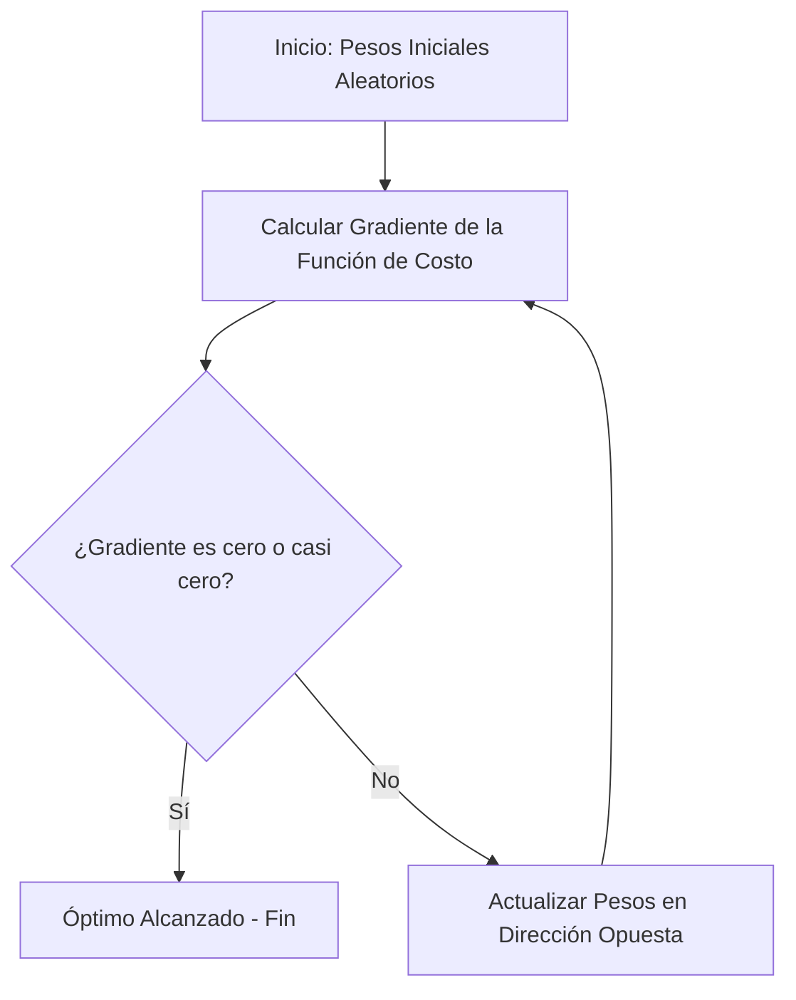

# Gradient Descent (Descenso del Gradiente)

El **Descenso del Gradiente** es el algoritmo de optimización iterativa más famoso y fundamental dentro del Machine Learning, sirviendo como el motor matemático principal detrás del entrenamiento de las Redes Neuronales y de diversos modelos lineales.

El objetivo central de este algoritmo es descubrir sistemáticamente los valores óptimos para los parámetros de un modelo, de forma que se minimice al máximo la función de costo (es decir, el nivel de error del modelo en sus predicciones).

## ¿Cómo funciona la analogía?

Imagina que te encuentras con los ojos vendados en la cima de una montaña sumamente irregular. Esta montaña representa la función de costo, donde la cima indica tu nivel de error inicial (muy alto). Tu objetivo principal es descender hasta llegar al punto más bajo del valle, lo que representa el error mínimo posible.

Dado que no puedes ver el entorno, utilizas tu pie para tantear la inclinación y la pendiente del suelo, dando siempre un paso en la dirección que apunta más pronunciadamente hacia abajo. Este proceso se repite una y otra vez de forma iterativa hasta que sientes que el terreno bajo tus pies es completamente plano (indicando que el gradiente matemáticamente es cero).

## Conceptos Clave

- **El Gradiente:** En términos matemáticos rigurosos, es el vector que contiene las derivadas parciales de la función de costo con respecto a cada uno de los parámetros del modelo. Este vector siempre indica la dirección de la máxima pendiente ascendente. Por consiguiente, el algoritmo siempre debe moverse exactamente en la dirección opuesta al gradiente para poder descender.
- **Tasa de Aprendizaje (Learning Rate - $\alpha$):** Es un hiperparámetro que determina el tamaño de los "pasos" que el modelo da cuesta abajo en cada iteración.
  - *Si es muy alto:* El modelo dará pasos demasiado grandes, lo cual puede provocar que se salte el valle por completo e incluso que el error comience a divergir (aumentar).
  - *Si es muy bajo:* El modelo avanzará con pasos microscópicos y tardará una eternidad computacional en llegar al fondo del valle.

## Variantes del Algoritmo

1. **Batch Gradient Descent:** Utiliza *todos* los datos de entrenamiento disponibles para calcular el gradiente en cada paso. Suele ser muy lento y enormemente costoso en uso de memoria RAM cuando se trabaja con datasets grandes.
2. **Stochastic Gradient Descent (SGD):** Utiliza un *solo* ejemplo seleccionado aleatoriamente por iteración para estimar el gradiente. Es computacionalmente muy rápido, pero su camino trazado hacia el mínimo es sumamente errático y ruidoso.
3. **Mini-Batch Gradient Descent:** Representa el equilibrio perfecto. Emplea pequeños lotes de datos (por ejemplo, 32 o 64 ejemplos) por paso. Actualmente es el estándar indiscutible en la industria del Deep Learning.
4. **Optimizadores Modernos (ej. Adam, RMSprop):** Son algoritmos matemáticamente avanzados que adaptan y modifican de forma dinámica la tasa de aprendizaje para cada parámetro individual basándose en el historial de los gradientes anteriores, logrando así una convergencia mucho más rápida, estable y confiable.

> [!info] Explicación y Limitaciones
> El algoritmo del Descenso del Gradiente es la razón fundamental por la cual hoy en día podemos entrenar modelos masivos que contienen miles de millones de parámetros matemáticos. Sin embargo, sufre del riesgo intrínseco de quedarse atascado en "mínimos locales" (pequeños valles intermedios que no representan el fondo real absoluto de la montaña). Afortunadamente, se ha demostrado que en espacios geométricos de altísima dimensionalidad, este problema es estadísticamente menos grave de lo que la teoría clásica presuponía.

## Notas relacionadas
- [[machine learning]]
- [[Redes neuronales]]
- [[Ajuste de modelos]]
