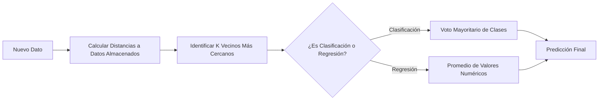

# K-Nearest Neighbors (KNN)

El algoritmo **K-Nearest Neighbors (KNN)** es un método de aprendizaje supervisado muy simple e intuitivo que se utiliza tanto para tareas de clasificación como de regresión. Pertenece a la familia de métodos basados en instancias, comúnmente conocidos como aprendizaje perezoso (*lazy learning*).

## Funcionamiento del Algoritmo

A diferencia de otros algoritmos, KNN no construye un modelo matemático interno durante la fase de entrenamiento, motivo por el cual se le denomina *lazy learning*. En su lugar, el modelo simplemente almacena todo el conjunto de datos de entrenamiento en la memoria.

Cuando ingresa un nuevo dato que requiere predicción, el algoritmo sigue estos pasos:

1. Calcula la distancia geométrica entre el nuevo dato y todos los puntos previamente almacenados.
2. Encuentra los $K$ puntos más cercanos, a los cuales se les llama vecinos.
3. **Para clasificación:** Asigna la clase más frecuente entre los $K$ vecinos mediante un sistema de voto mayoritario.
4. **Para regresión:** Asigna el promedio de los valores numéricos de los $K$ vecinos encontrados.

## Medidas de Distancia

La elección de la métrica para calcular la "cercanía" entre los puntos es un factor crucial para el éxito del modelo:

- **Distancia Euclidiana:** Es la métrica más común y representa la línea recta entre dos puntos en un espacio multidimensional.
- **Distancia de Manhattan:** Se calcula como la suma de las diferencias absolutas de las coordenadas de los puntos.
- **Distancia de Minkowski:** Es una generalización matemática que engloba tanto la distancia Euclidiana como la de Manhattan.

## La Elección de K

El hiperparámetro fundamental en este algoritmo es $K$, que representa el número de vecinos a considerar.

- Un valor de $K$ muy pequeño (por ejemplo, $K=1$) genera una alta varianza, lo que hace al modelo muy sensible al ruido y propenso al sobreajuste.
- Un valor de $K$ muy grande suaviza las fronteras de decisión de forma excesiva, lo que puede generar un alto sesgo o subajuste. Para más detalles, consulte [[bias y viarianza]].

Como regla general, se recomienda elegir un valor de $K$ impar para evitar empates durante las clasificaciones binarias.

> [!info] Ventajas y Desventajas
> **Ventajas:** Es un algoritmo no paramétrico muy simple de comprender y de implementar. Además, no asume ninguna distribución estadística subyacente en los datos, lo que lo hace muy flexible.
> **Desventajas:** Resulta computacionalmente muy costoso durante la fase de predicción, ya que requiere calcular la distancia contra la totalidad de los ejemplos del dataset. También sufre significativamente por la "maldición de la dimensionalidad"; su rendimiento decae drásticamente si existen demasiadas características irrelevantes. Por ello, es indispensable aplicar un adecuado [[Preprocesamiento de datos]].

## Notas relacionadas
- [[algoritmos parametricos y no parametricos]]
- [[bias y viarianza]]
- [[Preprocesamiento de datos]]
