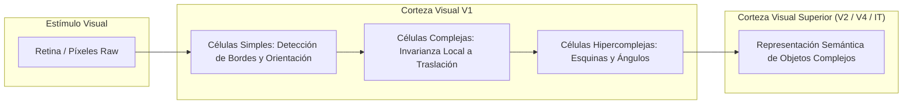
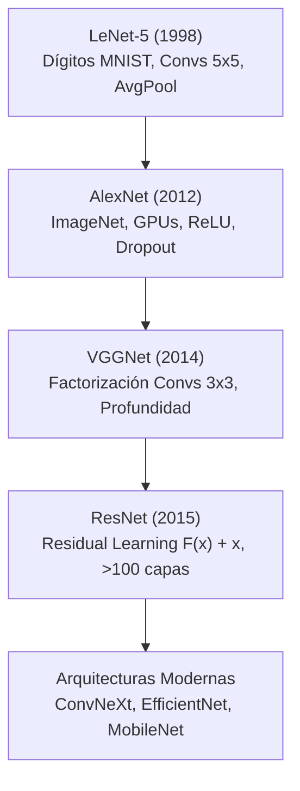
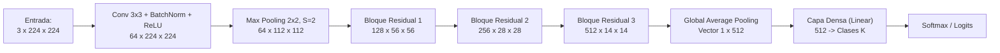

# Redes Neuronales Convolucionales (CNN)

Las **Redes Neuronales Convolucionales** (*Convolutional Neural Networks* o **CNN**) constituyen una clase especializada de arquitecturas de [[Redes neuronales]] profundas diseñadas específicamente para procesar datos que poseen una topología de cuadrícula conocida (*grid-structured data*), tales como señales temporales 1D, imágenes 2D, espectrogramas de audio y volúmenes de video o datos médicos 3D. 

El éxito fundamental de las CNN radica en la incorporación de **sesgos inductivos espaciales** (*spatial inductive biases*): conectividad local, compartición de parámetros e invarianza/equivarianza a la traslación, resolviendo de manera categórica la explosión paramétrica que experimentan los perceptrones multicapa (MLP) tradicionales al enfrentarse a entradas de alta dimensión.

---

## 1. Fundamentos Biológicos y Procesamiento de Señales Multidimensionales

### 1.1 El Experimento de Hubel & Wiesel (1959, 1962)

La base conceptual de las CNN se remonta a los descubrimientos neurofisiológicos de **David Hubel y Torsten Wiesel** sobre el procesamiento de la información visual en la corteza estriada primaria ($V1$) de gatos y primates (premio Nobel de Medicina en 1981):

1. **Campos Receptivos Locales (*Local Receptive Fields*):** Las neuronas de la corteza visual no responden a todo el campo visual global de forma homogénea, sino exclusivamente a estímulos lumínicos concentrados en una pequeña región espacialmente delimitada de la retina.
2. **Jerarquía Funcional de Células Corticales:**
   - **Células Simples (*Simple Cells*):** Se activan intensamente ante barras o bordes luminosos con orientaciones y posiciones angulares muy específicas dentro de su campo receptivo local.
   - **Células Complejas (*Complex Cells*):** Poseen campos receptivos más amplios; responden a bordes orientados independientemente de su posición espacial exacta dentro del campo (primera noción de *invarianza a la traslación local*).
   - **Células Hipercomplejas (*End-stopped / Hypercomplex Cells*):** Detectan características estructurales de orden superior, como extremos de líneas, vértices, esquinas y curvaturas.

Este principio jerárquico inspiró el desarrollo del **Neocognitrón** de Kunihiko Fukushima (1980), predecesor directo de las CNN modernas, al alternar capas de extracción de características locales (*S-cells*) y capas de tolerancia a deformaciones y traslaciones (*C-cells*).



### 1.2 Procesamiento de Señales 1D, 2D y 3D

El operador convolucional se adapta de forma natural a la dimensionalidad intrínseca de los tensores de entrada:

- **Señales 1D ($L \times C$):** Series de tiempo financieras, secuencias bioinformáticas de ADN/ARN y formas de onda de audio continuas. El kernel se desplaza a lo largo de un único eje temporal.
- **Señales 2D ($H \times W \times C$):** Imágenes estáticas ($C=1$ para escala de grises, $C=3$ para RGB) y **espectrogramas de audio** generados mediante la Transformada de Fourier de Tiempo Corto (STFT), donde los ejes representan tiempo y frecuencia.
- **Señales 3D ($D \times H \times W \times C$):** Secuencias de video ($T \times H \times W$, donde el tiempo actúa como tercera dimensión espacial) y volúmenes médicos tomográficos (resonancia magnética nuclear MRI, tomografía axial computarizada TAC).

---

## 2. La Capa de Convolución (*Convolutional Layer*)

La capa de convolución es el bloque computacional primario. A diferencia de una capa densa donde cada neurona de salida se conecta con la totalidad de las entradas mediante una matriz de pesos completa, la convolución explota la correlación espacial local mediante bancos de filtros de tamaño reducido.

### 2.1 Operación Matemática: Convolución vs Correlación Cruzada

En análisis matemático continuo, la convolución de dos funciones $I$ y $K$ en $\mathbb{R}^2$ se define como:

$$(I * K)(x, y) = \int_{-\infty}^{\infty} \int_{-\infty}^{\infty} I(\tau_1, \tau_2) K(x - \tau_1, y - \tau_2) \, d\tau_1 \, d\tau_2$$

En el dominio discreto para una matriz de imagen $I$ y un filtro bidimensional $K \in \mathbb{R}^{K_h \times K_w}$:

$$S(i, j) = (I * K)(i, j) = \sum_{m} \sum_{n} I(i - m, j - n) K(m, n)$$

> [!note] Nota de Rigor: Correlación Cruzada en Frameworks de Deep Learning
> En bibliotecas como PyTorch y TensorFlow, la operación implementada computacionalmente no es una convolución estricta con inversión espacial del kernel (*kernel flipping*), sino una **correlación cruzada discreta** (*cross-correlation*, denotada por $\star$):
> 
> $$S(i, j) = (I \star K)(i, j) = \sum_{m} \sum_{n} I(i + m, j + n) K(m, n)$$
> 
> Dado que los coeficientes del kernel $K$ son parámetros libres optimizados mediante [[Gradient Descent]] y retropropagación (*backpropagation*), prescindir de la inversión del filtro no altera la capacidad de aproximación ni la expresividad de la red, ahorrando ciclos de cálculo en memoria.

#### Convolución Multicanal Tensorial
Para un tensor de entrada $X \in \mathbb{R}^{C_{\text{in}} \times H \times W}$ y un banco de $C_{\text{out}}$ filtros tridimensionales de tamaño $C_{\text{in}} \times K_h \times K_w$, el mapa de características de salida $Y \in \mathbb{R}^{C_{\text{out}} \times H_{\text{out}} \times W_{\text{out}}}$ se calcula como:

$$Y(k, i, j) = b_k + \sum_{c=1}^{C_{\text{in}}} \sum_{m=0}^{K_h - 1} \sum_{n=0}^{K_w - 1} X(c, \, i \cdot S + m, \, j \cdot S + n) \cdot K(k, c, m, n)$$

donde $b_k \in \mathbb{R}$ es el sesgo (*bias*) específico del canal de salida $k$ y $S$ es el paso de desplazamiento (*stride*).

```
ENTRADA (Canal c)              KERNEL (c, k)              MAPA SALIDA (Canal k)
┌───┬───┬───┬───┐              ┌───┬───┐                  ┌─────┬─────┐
│ 1 │ 2 │ 0 │ 1 │              │ 1 │ 0 │                  │  7  │  4  │
├───┼───┼───┼───┤              ├───┼───┤                  ├─────┼─────┤
│ 0 │ 3 │ 1 │ 2 │      *       │ 0 │ 2 │        =         │  8  │  7  │
├───┼───┼───┼───┤              └───┴───┘                  └─────┴─────┘
│ 2 │ 1 │ 0 │ 1 │                                        (Calculado con S=1, P=0)
└───┴───┴───┴───┘
```

### 2.2 Hiperparámetros de la Convolución

1. **Tamaño del Kernel ($K \times K$):** Dimensión de la ventana receptiva local. Históricamente se emplearon filtros grandes ($11 \times 11$, $7 \times 7$), pero la práctica estándar moderna favorece filtros compactos $3 \times 3$ apilados y filtros puntuales $1 \times 1$.
2. **Stride ($S$):** Factor de traslación del filtro sobre la entrada. Un stride $S > 1$ produce un submuestreo espacial nativo, reduciendo la resolución del mapa de características sin requerir capas adicionales de agrupamiento.
3. **Padding ($P$):** Cantidad de filas y columnas agregadas a los bordes de la entrada (típicamente rellenadas con ceros, *zero-padding*):
   - **Valid Padding ($P = 0$):** El filtro solo opera donde cabe completamente dentro de la imagen. La dimensión espacial se reduce progresivamente.
   - **Same Padding:** Se dimensiona $P = \lfloor (K - 1) / 2 \rfloor$ para que, con un stride $S = 1$, la resolución espacial de salida coincida exactamente con la de entrada ($W_{\text{out}} = W_{\text{in}}$).
4. **Dilatación (*Dilation Rate* $d$):** Convolución atrosa (*atrous convolution*), donde los elementos del kernel se separan por un factor $d - 1$. Permite expandir drásticamente el campo receptivo sin incrementar el número de parámetros aprendibles. El tamaño efectivo del kernel se convierte en $K_{\text{eff}} = K + (K - 1)(d - 1)$.

### 2.3 Ecuación Fundamental de Dimensionamiento

Dada una entrada de dimensión espacial $W_{\text{in}} \times H_{\text{in}}$, el tamaño del mapa de características resultante $W_{\text{out}} \times H_{\text{out}}$ está gobernado por:

$$W_{\text{out}} = \left\lfloor \frac{W_{\text{in}} - K_w + 2P}{S} \right\rfloor + 1$$

$$H_{\text{out}} = \left\lfloor \frac{H_{\text{in}} - K_h + 2P}{S} \right\rfloor + 1$$

> [!important] Condición de Consistencia Espacial
> Para que el kernel cubra de manera uniforme la cuadrícula sin truncamientos asimétricos, el numerador $(W_{\text{in}} - K_w + 2P)$ debe ser divisible exactamente por el stride $S$.

### 2.4 Principios de Diseño Inductivo

Las CNN incorporan dos propiedades estructurales clave que las diferencian de las capas densas tradicionales:

#### A. Compartición de Pesos (*Weight Sharing*)
Los parámetros del filtro $K(k, c, \cdot, \cdot)$ permanecen idénticos a medida que este barre todas las posiciones espaciales $(i, j)$ del mapa. 

*Comparación analítica de parámetros:*
Supóngase una imagen de entrada de $1000 \times 1000$ píxeles RGB ($3 \times 10^6$ entradas) conectada a una capa oculta de $1000$ neuronas:
- **Red Totalmente Conectada (Dense/MLP):** Requiere $(3 \times 10^6) \times 1000 = 3 \times 10^9$ parámetros (3 mil millones de pesos), lo que induce sobreajuste catastrófico e imposibilidad de cómputo en memoria GPU.
- **Capa Convolucional (CNN):** 64 filtros de tamaño $3 \times 3 \times 3$ requieren únicamente:
  
  $$\text{Parámetros} = 64 \times (3 \times 3 \times 3 + 1) = 64 \times 28 = 1.792 \text{ parámetros}$$

Esta reducción masiva actúa como un mecanismo intrínseco de [[Regularización]] que restringe el espacio de hipótesis.

#### B. Invarianza y Equivarianza a la Traslación
- **Equivarianza:** Una función $f$ es equivariante respecto a una transformación $g$ si $f(g(x)) = g(f(x))$. La convolución es inherentemente equivariante a traslaciones espaciales: si un patrón (e.g., un ojo o una esquina) se desplaza $\Delta x$ en la imagen de entrada, su representación en el mapa de activaciones se desplazará exactamente $\Delta x$.
- **Invarianza:** Se logra al combinar la convolución con capas de agrupamiento (*pooling*). Permite que la clasificación global de la red sea insensible a perturbaciones o desplazamientos posicionales menores del objeto en la escena.

---

## 3. Capa de Agrupamiento (*Pooling Layer*)

El objetivo del pooling es reducir progresivamente la dimensionalidad espacial ($H \times W$) de los mapas de activaciones, controlando el costo computacional, incrementando el **campo receptivo efectivo** de las capas subsecuentes y previniendo el sobreajuste.

```
       MAX POOLING (2x2, S=2)              AVERAGE POOLING (2x2, S=2)
     ┌───┬───┬───┬───┐                          ┌───┬───┬───┬───┐
     │ 1 │ 3 │ 2 │ 4 │                          │ 1 │ 3 │ 2 │ 4 │
     ├───┼───┼───┼───┤    ┌───┬───┐             ├───┼───┼───┼───┤    ┌───┬───┐
     │ 5 │ 6 │ 1 │ 2 │ -> │ 6 │ 4 │             │ 5 │ 6 │ 1 │ 2 │ -> │3.7│2.2│
     ├───┼───┼───┼───┤    ├───┼───┤             ├───┼───┼───┼───┤    ├───┼───┤
     │ 3 │ 2 │ 1 │ 0 │    │ 8 │ 3 │             │ 3 │ 2 │ 1 │ 0 │    │4.0│1.0│
     ├───┼───┼───┼───┤    └───┴───┘             ├───┼───┼───┼───┤    └───┴───┘
     │ 8 │ 3 │ 2 │ 3 │                          │ 8 │ 3 │ 2 │ 3 │
     └───┴───┴───┴───┘                          └───┴───┴───┴───┘
```

### 3.1 Tipos Principales de Pooling

1. **Max Pooling:**
   Extrae la activación máxima dentro de una ventana espacial local $P_h \times P_w$:
   
   $$Y(i, j) = \max_{m, n} X(i \cdot S + m, \, j \cdot S + n)$$
   
   *Propiedad:* Actúa como un detector de presencia de características distintivas dominantes, ignorando detalles de fondo y ruido de baja intensidad.

2. **Average Pooling:**
   Calcula la media aritmética de todos los valores contenidos en la ventana:
   
   $$Y(i, j) = \frac{1}{P_h P_w} \sum_{m=0}^{P_h - 1} \sum_{n=0}^{P_w - 1} X(i \cdot S + m, \, j \cdot S + n)$$
   
   *Propiedad:* Proporciona un suavizado espacial homogéneo, reteniendo información del contexto global pero diluyendo activaciones agudas.

3. **Global Average Pooling (GAP):**
   Introducido por Lin et al. en *Network in Network* (2013). Reduce cada mapa de características bidimensional $H \times W$ a un único escalar calculando el promedio global del canal completo:
   
   $$\text{GAP}(c) = \frac{1}{H \times W} \sum_{i=1}^H \sum_{j=1}^W X(c, i, j)$$
   
   *Ventaja estructural:* Reemplaza las capas totalmente conectadas (*Fully Connected*) previas al clasificador final, eliminando millones de parámetros y volviendo a la red inmune al colapso de dimensionalidad arbitrario.

---

## 4. Capas Densas Finales y Funciones de Activación

### 4.1 Transición y Clasificador Multiclase
Tras una secuencia de convoluciones y poolings jerárquicos (donde la resolución espacial disminuye mientras la profundidad de canales $C$ se incrementa), el tensor tridimensional resultante se colapsa mediante:
- **Vectorización (*Flattening*):** Desenrollado del tensor $C \times H \times W$ en un vector $D = C \cdot H \cdot W$ conectado a capas densas MLP.
- **Global Average Pooling:** Proyección directa a un vector de dimensión $C$ sin parámetros libres intermedios.

La capa de salida final para un problema de clasificación con $K$ categorías mutuamente excluyentes emplea la función **Softmax**:

$$\sigma(\mathbf{z})_i = \frac{e^{z_i}}{\sum_{j=1}^K e^{z_j}}, \quad \forall i \in \{1, \dots, K\}$$

cuyo vector de probabilidades se optimiza mediante la función de pérdida de entropía cruzada categórica (*Categorical Cross-Entropy Loss*): $\mathcal{L} = -\sum_{i=1}^K y_i \log(\hat{y}_i)$.

### 4.2 Funciones de Activación No Lineales

```
     ReLU: f(x) = max(0, x)            Leaky ReLU: f(x) = max(αx, x)
             y                                     y
             │   /                                 │   /
             │  /                                  │  /
             │ /                                   │ /
     ────────┼/─────── x                   ───────/┼─────── x
             │                            /        │
```

- **ReLU (*Rectified Linear Unit*):** $f(x) = \max(0, x)$. Introduce no linealidad eficiente, computacionalmente trivial, e induce representaciones dispersas (*sparsity*). Resuelve el desvanecimiento del gradiente para $x > 0$ con derivada constante $f'(x) = 1$.
- **Leaky ReLU:** $f(x) = \max(\alpha x, x)$ con $\alpha \approx 0.01$. Resuelve el problema del "ReLU moribundo" (*Dying ReLU*), garantizando que las neuronas con activaciones negativas sigan propagando un gradiente residual $\alpha$.
- **GELU (*Gaussian Error Linear Unit*):** $f(x) = x \Phi(x) = x P(X \le x), X \sim \mathcal{N}(0, 1)$. Utilizada en modelos convolucionales contemporáneos de alto rendimiento (e.g., ConvNeXt) y en arquitecturas [[Arquitectura Transformer y Mecanismo de Atencion]].

---

## 5. Hitos Arquitectónicos Históricos



### 5.1 LeNet-5 (Yann LeCun et al., 1998)
- **Propósito:** Reconocimiento óptico de caracteres y dígitos manuscritos en cheques bancarios (dataset MNIST, imágenes $32 \times 32$).
- **Innovaciones:** Primera demostración funcional de backpropagation aplicado a una jerarquía convolucional con capas alternadas de Convolución ($5 \times 5$), Subsampling (Average Pooling ponderado), y capas densas con activaciones sigmoideas/tanh. Estableció el patrón canónico: $\text{Conv} \to \text{Pool} \to \text{Conv} \to \text{Pool} \to \text{FC}$.

### 5.2 AlexNet (Alex Krizhevsky, Ilya Sutskever, Geoffrey Hinton, 2012)
- **Hito:** Ganadora del concurso ImageNet LSVRC-2012, reduciendo la tasa de error top-5 del $26.2\%$ al $15.3\%$ y desencadenando la era moderna del Deep Learning.
- **Claves del Éxito:**
  - Implementación paralela en 2 GPUs NVIDIA GeForce GTX 580 (3 GB VRAM).
  - Sustitución de funciones sigmoides por **ReLU**, acelerando el entrenamiento por un factor de 6.
  - Implementación de **Dropout** ($p = 0.5$) en las capas totalmente conectadas para mitigar el sobreajuste.
  - Esquema masivo de aumento de datos (*Data Augmentation*): traslaciones aleatorias, recortes y reflexiones horizontales.
  - Uso de Normalización de Respuesta Local (LRN) y Max Pooling con solapamiento ($3 \times 3$, $S=2$).

### 5.3 VGGNet (Karen Simonyan & Andrew Zisserman, 2014)
- **Principio Central:** Factorización de campos receptivos mediante la sustitución sistemática de convoluciones grandes por pilas de filtros pequeños de $3 \times 3$.
- **Demostración de Equivalencia de Campo Receptivo:**
  Dos capas convolucionales sucesivas de $3 \times 3$ con $S=1$ poseen un campo receptivo efectivo idéntico al de una única convolución de $5 \times 5$:
  
  $$R_{\text{eff}} = 3 + (3 - 1) = 5$$
  
  Similarmente, tres capas de $3 \times 3$ abarcan un campo de $7 \times 7$.
- **Ventajas Cuantitativas:**
  1. *Ahorro Paramétrico:* Suponiendo $C$ canales de entrada y salida:
     - Tres capas de $3 \times 3$: $3 \times (3^2 \cdot C^2) = 27 C^2$ parámetros.
     - Una capa de $7 \times 7$: $1 \times (7^2 \cdot C^2) = 49 C^2$ parámetros.
     - Representa una reducción neta del **$45\%$ en parámetros**.
  2. *Mayor Capacidad de Discriminación:* Al apilar tres capas en lugar de una, se introducen tres funciones de activación no lineales intermedias en lugar de una sola.

### 5.4 ResNet (Kaiming He, Xiangyu Zhang, Shaoqing Ren, Jian Sun, 2015)
- **El Problema de la Degradación:** Al incrementar la profundidad de redes neuronales estándar más allá de 20-30 capas, el rendimiento no solo se satura sino que empeora abruptamente tanto en test como en **entrenamiento** (descartando el sobreajuste). Las transformaciones sucesivas destruyen el flujo del gradiente.
- **La Solución: Aprendizaje Residual:**
  En lugar de obligar a una pila de capas a aprender directamente el mapeo subyacente deseado $\mathcal{H}(\mathbf{x})$, se parametrizan para ajustar un residuo $\mathcal{F}(\mathbf{x}) = \mathcal{H}(\mathbf{x}) - \mathbf{x}$. La función objetivo se reescribe como:

$$\mathcal{H}(\mathbf{x}) = \mathcal{F}(\mathbf{x}) + \mathbf{x}$$

```
                x ──────────────┐ (Conexión de Salto / Skip Connection)
                │               │
                ▼               │
           ┌──────────┐         │
           │  Conv    │         │
           └────┬─────┘         │
                ▼               │
           ┌──────────┐         │
           │  Conv    │         │
           └────┬─────┘         │
                ▼               │
              F(x)              │
                │               │
                ▼               ▼
               ( + ) <──────────┘
                 │
                 ▼
            ReLU(F(x) + x)
```

- **Dinámica del Gradiente en Backpropagation:**
  Dada una pérdida $\mathcal{E}$, la regla de la cadena para la entrada $\mathbf{x}$ en un bloque residual establece:

$$\frac{\partial \mathcal{E}}{\partial \mathbf{x}} = \frac{\partial \mathcal{E}}{\partial \mathcal{H}} \cdot \frac{\partial \mathcal{H}}{\partial \mathbf{x}} = \frac{\partial \mathcal{E}}{\partial \mathcal{H}} \left( \frac{\partial \mathcal{F}}{\partial \mathbf{x}} + \mathbf{I} \right)$$

El término aditivo de la matriz identidad $\mathbf{I}$ asegura que el gradiente $\frac{\partial \mathcal{E}}{\partial \mathcal{H}}$ se propague intacto directamente hacia atrás a través de las conexiones de salto (*skip connections*), sin importar qué tan pequeño sea $\frac{\partial \mathcal{F}}{\partial \mathbf{x}}$. Esto permitió entrenar exitosamente arquitecturas de 50, 101 e incluso 152 capas (ResNet-152), superando el umbral de error humano en ImageNet con $3.57\%$.

---

## 6. Diagrama Mermaid del Flujo de Procesamiento en una CNN Canónica



---

## 7. Implementación Canónica en PyTorch

A continuación se presenta una implementación rigurosa y modular de una CNN con conexiones residuales y regularización moderna:

```python
import torch
import torch.nn as nn
import torch.nn.functional as F


class ResidualBlock(nn.Module):
    """
    Bloque residual canónico con dos convoluciones 3x3,
    Batch Normalization y conexión de salto (skip connection).
    """
    def __init__(self, in_channels: int, out_channels: int, stride: int = 1):
        super().__init__()
        self.conv1 = nn.Conv2d(
            in_channels, out_channels, kernel_size=3,
            stride=stride, padding=1, bias=False
        )
        self.bn1 = nn.BatchNorm2d(out_channels)
        self.conv2 = nn.Conv2d(
            out_channels, out_channels, kernel_size=3,
            stride=1, padding=1, bias=False
        )
        self.bn2 = nn.BatchNorm2d(out_channels)

        # Proyección lineal si las dimensiones espaciales o de canales difieren
        self.shortcut = nn.Sequential()
        if stride != 1 or in_channels != out_channels:
            self.shortcut = nn.Sequential(
                nn.Conv2d(
                    in_channels, out_channels, kernel_size=1,
                    stride=stride, bias=False
                ),
                nn.BatchNorm2d(out_channels)
            )

    def forward(self, x: torch.Tensor) -> torch.Tensor:
        residual = self.shortcut(x)
        out = F.relu(self.bn1(self.conv1(x)))
        out = self.bn2(self.conv2(out))
        out += residual  # F(x) + x
        return F.relu(out)


class CanonicalCNN(nn.Module):
    """
    Arquitectura convolucional canónica para clasificación multiclase.
    Integra convolución inicial, bloques residuales, GAP y clasificador lineal.
    """
    def __init__(self, in_channels: int = 3, num_classes: int = 10):
        super().__init__()
        # Extracción inicial de bajo nivel
        self.stem = nn.Sequential(
            nn.Conv2d(in_channels, 32, kernel_size=3, stride=1, padding=1, bias=False),
            nn.BatchNorm2d(32),
            nn.ReLU(inplace=True)
        )
        
        # Etapas residuales con submuestreo progresivo
        self.layer1 = ResidualBlock(32, 64, stride=2)   # H/2, W/2
        self.layer2 = ResidualBlock(64, 128, stride=2)  # H/4, W/4
        self.layer3 = ResidualBlock(128, 256, stride=2) # H/8, W/8

        # Agrupamiento global y clasificación
        self.gap = nn.AdaptiveAvgPool2d((1, 1))
        self.classifier = nn.Linear(256, num_classes)

    def forward(self, x: torch.Tensor) -> torch.Tensor:
        # x shape: [Batch_Size, in_channels, H, W]
        x = self.stem(x)
        x = self.layer1(x)
        x = self.layer2(x)
        x = self.layer3(x)
        
        x = self.gap(x)                  # [Batch_Size, 256, 1, 1]
        x = torch.flatten(x, 1)          # [Batch_Size, 256]
        logits = self.classifier(x)      # [Batch_Size, num_classes]
        return logits


if __name__ == "__main__":
    # Verificación de flujo tensorial
    batch_size = 4
    sample_input = torch.randn(batch_size, 3, 64, 64)
    model = CanonicalCNN(in_channels=3, num_classes=10)
    output = model(sample_input)
    
    print(f"Dimensiones de entrada: {sample_input.shape}")
    print(f"Dimensiones de salida:  {output.shape}")
    assert output.shape == (batch_size, 10), "Error en dimensiones de salida."
```

---

## 8. Notas Relacionadas
- [[machine learning]]: Marco general del aprendizaje computacional y ajuste de hipótesis funcionales.
- [[tipos de machine learning]]: Clasificación de tareas en aprendizaje supervisado (clasificación y regresión de imágenes) y autosupervisado.
- [[Redes neuronales]]: Fundamento básico del perceptrón multicapa y retropropagación de gradientes.
- [[bias y viarianza]]: Análisis del trade-off; la compartición de pesos en CNNs reduce drásticamente la varianza frente a redes densas (MLP).
- [[modelos de regresion]]: Aplicación de CNNs para tareas de regresión continua (e.g., predicción de coordenadas de bounding boxes o estimación de pose).
- [[Gradient Descent]]: Algoritmo de optimización para ajustar los kernels convolucionales mediante backpropagation.
- [[Regularización]]: Técnicas aplicadas a CNNs (Dropout, Weight Decay, BatchNorm, Data Augmentation).
- [[Preprocesamiento de datos]]: Estandarización de tensores y normalización de canales RGB.
- [[metricas para clasificadores]]: Evaluación de rendimiento multiclase en visión artificial (Precision, Recall, F1-Score).
- [[curvas roc]]: Análisis de tasas de verdaderos y falsos positivos en detección visual binaria y multiclase.
- [[Arquitectura Transformer y Mecanismo de Atencion]]: Paradigma contemporáneo alternativo (Vision Transformers / ViT).
- [[Reduccion de Dimensionalidad (PCA y t-SNE)]]: Visualización de espacios latentes extraídos en capas profundas de CNNs.
