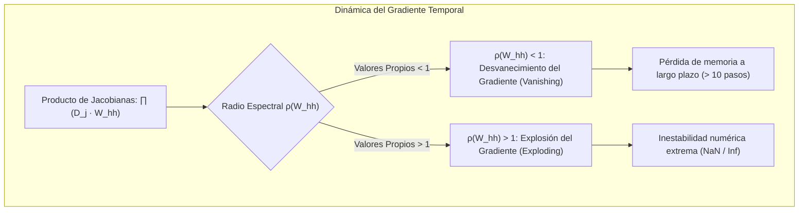

# Redes Neuronales Recurrentes (RNN) y LSTM

Las **Redes Neuronales Recurrentes** (*Recurrent Neural Networks* o **RNN**) representan la extensión natural de las [[Redes neuronales]] clásicas de alimentación hacia adelante (*feedforward*) para procesar datos estructurados en secuencias temporales u ordenadas. 

Mientras que un perceptrón multicapa o una [[Redes Neuronales Convolucionales (CNN)|CNN]] asume que todas las entradas $x_i$ son independientes e idénticamente distribuidas (supuesto i.i.d.), las RNN introducen **bucles de retroalimentación interna** que actúan como una memoria dinámica, permitiendo que la salida en el instante de tiempo $t$ esté condicionada por el historial completo de computaciones previas $\{x_1, x_2, \dots, x_t\}$.

---

## 1. Modelado de Secuencias Temporales y Dependencias Dinámicas

### 1.1 Limitaciones del Paradigma Feedforward en Secuencias
En problemas donde el orden y la distancia temporal determinan la semántica (e.g., lenguaje natural, señales electrofisiológicas, series financieras), los modelos feedforward estándar presentan tres deficiencias estructurales críticas:
1. **Entradas y Salidas de Dimensión Fija:** Un MLP requiere que el tensor de entrada tenga un tamaño rígido $p$, impidiendo procesar oraciones de longitud variable o señales continuas sin recortar o rellenar de manera arbitraria.
2. **Incapacidad de Compartición Temporal:** Un parámetro aprendido para detectar una palabra en la posición $t=1$ no se transfiere automáticamente a la posición $t=15$.
3. **Pérdida de la Causalidad Temporal:** En comparación con los [[modelos de regresion]] autorregresivos clásicos (ARIMA, VAR), los MLPs ignoran las restricciones causales inherentes al tiempo.

### 1.2 Dominios de Aplicación en Ingeniería
- **Procesamiento de Lenguaje Natural (NLP):** Modelado de lenguaje causal, traducción automática, análisis de sentimientos y etiquetado secuencial (POS tagging, NER).
- **Series de Tiempo Financieras y Económicas:** Predicción de volatilidad, precios de activos y detección de fraudes en flujos de transacciones.
- **Señales Biomédicas e Industriales:** Análisis de electrocardiogramas (ECG), electroencefalogramas (EEG) y telemetría de vibraciones mecánicas para mantenimiento predictivo.
- **Modelos Secuencia a Secuencia (Seq2Seq):** Sistemas de diálogo y reconocimiento automático del habla (ASR).

---

## 2. Redes Neuronales Recurrentes Estándar (RNN de Elman)

La arquitectura recurrente elemental fue propuesta por Jeffrey Elman (1990). En cada paso temporal discreto $t \in \{1, \dots, T\}$, la red recibe un vector de entrada $x_t \in \mathbb{R}^{d_x}$ y el vector de estado oculto previo $h_{t-1} \in \mathbb{R}^{d_h}$.

```
      DESPLIEGUE TEMPORAL (UNROLLING) DE UNA RNN DE ELMAN

      y_1          y_2          y_t          y_T
       ▲            ▲            ▲            ▲
   W_hy│        W_hy│        W_hy│        W_hy│
     ┌─┴──┐       ┌─┴──┐       ┌─┴──┐       ┌─┴──┐
     │h_1 ├──────►│h_2 ├──────►│h_t ├──────►│h_T │
     └─▲──┘  W_hh └─▲──┘  W_hh └─▲──┘  W_hh └─▲──┘
   W_xh│        W_xh│        W_xh│        W_xh│
       │            │            │            │
      x_1          x_2          x_t          x_T
```

### 2.1 Formulación Matemática

El cálculo del estado oculto actual $h_t$ y de la predicción de salida $\hat{y}_t$ se define formalmente como:

$$h_t = \tanh\left(W_{hh} h_{t-1} + W_{xh} x_t + b_h\right)$$

$$\hat{y}_t = \text{softmax}\left(W_{hy} h_t + b_y\right) \quad \text{o} \quad \hat{y}_t = W_{hy} h_t + b_y$$

donde:
- $x_t \in \mathbb{R}^{d_x}$ es el vector de características en el instante $t$.
- $h_t \in \mathbb{R}^{d_h}$ es el estado oculto que condensa la memoria contextual.
- $W_{xh} \in \mathbb{R}^{d_h \times d_x}$ es la matriz de pesos de entrada a estado oculto.
- $W_{hh} \in \mathbb{R}^{d_h \times d_h}$ es la matriz recurrente de transición entre estados ocultos (compartida a través de todos los instantes de tiempo).
- $W_{hy} \in \mathbb{R}^{d_y \times d_h}$ es la matriz de proyección hacia el espacio de salida.
- $b_h \in \mathbb{R}^{d_h}$ y $b_y \in \mathbb{R}^{d_y}$ son los vectores de sesgo (*bias*).

### 2.2 Entrenamiento: Backpropagation Through Time (BPTT)

El algoritmo BPTT consiste en desplegar (*unroll*) la red a lo largo de los $T$ pasos temporales de la secuencia, convirtiéndola en un grafo acíclico dirigido (DAG) muy profundo sobre el cual se aplica la regla de la cadena habitual de [[Gradient Descent]].

La función de pérdida global es la suma temporal de los errores individuales:

$$\mathcal{L} = \sum_{t=1}^T \mathcal{L}_t(\hat{y}_t, y_t)$$

Para actualizar la matriz de pesos recurrente $W_{hh}$, se aplica la diferenciación total teniendo en cuenta que $h_t$ depende de $W_{hh}$ tanto directamente como indirectamente a través de $h_{t-1}$:

$$\frac{\partial \mathcal{L}}{\partial W_{hh}} = \sum_{t=1}^T \sum_{k=1}^t \frac{\partial \mathcal{L}_t}{\partial h_t} \cdot \frac{\partial h_t}{\partial h_k} \cdot \frac{\partial h_k}{\partial W_{hh}}$$

---

## 3. La Patología del Gradiente: Desvanecimiento y Explosión

El problema central de las RNN simples surge al analizar el término de acoplamiento temporal $\frac{\partial h_t}{\partial h_k}$, el cual requiere calcular la multiplicación encadenada de matrices jacobianas intermedias:

$$\frac{\partial h_t}{\partial h_k} = \prod_{j=k+1}^t \frac{\partial h_j}{\partial h_{j-1}}$$

### 3.1 Demostración Matemática Rigurosa

Definiendo la preactivación como $a_j = W_{hh} h_{j-1} + W_{xh} x_j + b_h$, de modo que $h_j = \tanh(a_j)$, la matriz jacobiana individual es:

$$\frac{\partial h_j}{\partial h_{j-1}} = \operatorname{diag}\left(1 - \tanh^2(a_j)\right) \cdot W_{hh}^T$$

Sea $\mathbf{D}_j = \operatorname{diag}\left(1 - \tanh^2(a_j)\right) \in \mathbb{R}^{d_h \times d_h}$. Al ser la derivada de la tangente hiperbólica acotada estrictamente en el intervalo $(0, 1]$, los elementos diagonales satisfacen $0 < (\mathbf{D}_j)_{ii} \le 1$.

Al calcular la norma del producto encadenado sobre $N = t - k$ pasos temporales:

$$\left\| \frac{\partial h_t}{\partial h_k} \right\| = \left\| \prod_{j=k+1}^t \mathbf{D}_j W_{hh}^T \right\| \le \prod_{j=k+1}^t \|\mathbf{D}_j\| \cdot \|W_{hh}^T\| \le \left(\gamma \cdot \|W_{hh}\|\right)^{t-k}$$

donde $\gamma \le 1$ es la cota superior del gradiente de la activación.



1. **Desvanecimiento del Gradiente (*Vanishing Gradient*):**
   Si el radio espectral de la matriz de transición $\rho(W_{hh}) < 1$ (el mayor autovalor en magnitud es menor a 1), el factor decae exponencialmente:
   
   $$\lim_{(t - k) \to \infty} \left\| \frac{\partial h_t}{\partial h_k} \right\| = 0$$
   
   *Consecuencia práctica:* El error en el paso $t$ no induce ninguna corrección en los pesos respecto a las entradas en el paso $k$. La red sufre de amnesia a corto plazo, siendo incapaz de aprender dependencias más allá de 5 a 10 pasos temporales.

2. **Explosión del Gradiente (*Exploding Gradient*):**
   Si $\rho(W_{hh}) > 1$ y las activaciones no saturan, el gradiente crece exponencialmente hacia el infinito:
   
   $$\left\| \frac{\partial h_t}{\partial h_k} \right\| \to \infty$$
   
   *Consecuencia práctica:* Oscilaciones destructivas en el espacio de parámetros, desbordamiento numérico (*floating-point overflow*) y colapso del entrenamiento con valores `NaN`.

> [!tip] Solución Práctica a la Explosión: Recorte de Gradientes (*Gradient Clipping*)
> Para mitigar la explosión de gradientes en RNNs, Mikolov et al. (2012) propusieron el recorte por norma euclidiana antes del paso de [[Gradient Descent]]:
> 
> $$\mathbf{g} \leftarrow \begin{cases} \mathbf{g} & \text{si } \|\mathbf{g}\| \le \theta \\ \theta \frac{\mathbf{g}}{\|\mathbf{g}\|} & \text{si } \|\mathbf{g}\| > \theta \end{cases}$$
> 
> donde $\theta$ es un hiperparámetro de umbral (típicamente $\theta \in [1.0, 5.0]$).

---

## 4. Redes LSTM (*Long Short-Term Memory*)

Diseñadas por **Sepp Hochreiter y Jürgen Schmidhuber** (1997), y perfeccionadas con compuertas de olvido por Felix Gers et al. (2000), las redes **LSTM** solucionan el desvanecimiento del gradiente rediseñando por completo la estructura interna de la neurona recurrente.

### 4.1 La "Cinta Transportadora" y el Flujo Aditivo
El núcleo de la celda LSTM es el **estado de celda** (*Cell State*, $C_t$), que discurre en línea recta a través de la secuencia con mínimas interacciones lineales:

```
        C_{t-1} ───────( X )────────────────(+)────────► C_t
                         ▲                   ▲
                         │ f_t               │ i_t * C~_t
                   ┌─────┴─────┐       ┌─────┴─────┐
                   │  Forget   │       │   Input   │
                   │   Gate    │       │   Gate    │
                   └─────▲─────┘       └─────▲─────┘
                         │                   │
        h_{t-1} ─────────┴───────────────────┴──────────┬──► ( X ) ──► h_t
                                                        │      ▲
                                                  ┌─────┴──┐   │
                                                  │ Output │   │ tanh(C_t)
                                                  │  Gate  │───┘
                                                  └────────┘
```

El estado de celda funciona como un **carrusel de error constante** (*Constant Error Carousel* - CEC). Al incorporar adiciones lineales en vez de únicamente transformaciones afines seguidas de tangentes hiperbólicas, la derivada temporal satisface:

$$\frac{\partial C_t}{\partial C_{t-1}} = f_t$$

Si la compuerta de olvido $f_t \approx 1$, el gradiente fluye intacto a lo largo de cientos de pasos temporales sin atenuación exponencial.

### 4.2 Las Cuatro Ecuaciones de Compuertas de la Celda LSTM

En cada paso $t$, la celda recibe $x_t$ y $h_{t-1}$, concatenados como $[h_{t-1}, x_t] \in \mathbb{R}^{d_h + d_x}$:

#### 1. Compuerta de Olvido (*Forget Gate* $f_t$)
Decide qué proporción del estado de celda anterior $C_{t-1}$ se descarta ($0$) o se preserva ($1$):

$$f_t = \sigma\left(W_f \cdot [h_{t-1}, x_t] + b_f\right)$$

donde $\sigma(z) = \frac{1}{1 + e^{-z}}$ es la función logística sigmoide, acotada en $(0, 1)$.

#### 2. Compuerta de Entrada (*Input Gate* $i_t$) y Candidato ($\tilde{C}_t$)
Decide qué nueva información candidata se almacenará en la celda:
- Filtro de admisión:
  $$i_t = \sigma\left(W_i \cdot [h_{t-1}, x_t] + b_i\right)$$
- Estado candidato (nuevos contenidos potenciales calculados con $\tanh$ para acotar entre $[-1, 1]$):
  $$\tilde{C}_t = \tanh\left(W_c \cdot [h_{t-1}, x_t] + b_c\right)$$

#### 3. Actualización del Estado de Celda ($C_t$)
Combina la memoria pasada filtrada con el nuevo conocimiento incorporado mediante el operador de producto elemento a elemento de Hadamard ($\odot$):

$$C_t = f_t \odot C_{t-1} + i_t \odot \tilde{C}_t$$

#### 4. Compuerta de Salida (*Output Gate* $o_t$) y Estado Oculto ($h_t$)
Determina qué partes del estado de celda se exponen al exterior como el nuevo estado oculto $h_t$:

$$o_t = \sigma\left(W_o \cdot [h_{t-1}, x_t] + b_o\right)$$

$$h_t = o_t \odot \tanh(C_t)$$

---

## 5. Variante GRU (*Gated Recurrent Unit*)

Propuesta por **Kyunghyun Cho et al. (2014)**, la unidad recurrente con compuertas (**GRU**) representa una simplificación elegante y computacionalmente eficiente de la celda LSTM.

```
                           ┌───────────────────────────────┐
                           │                               ▼
      h_{t-1} ───────( X )─┴─►(+)────────────────────────( X )──► h_t
                       ▲       ▲                           ▲
                       │       │                           │
                      r_t      │                          z_t (Update)
                 ┌─────┴──┐    │                  (1 - z_t)│
                 │ Reset  │    │                           │
                 │  Gate  │    ▼                           │
                 └─────▲──┘  tanh(W · [r_t*h, x])          │
                       │                                   │
      x_t ─────────────┴───────────────────────────────────┴──────
```

### 5.1 Fórmulas Matemáticas de la Celda GRU

La arquitectura GRU unifica el estado de celda $C_t$ y el estado oculto $h_t$ en una sola variable $h_t$, gobernada por dos compuertas:

1. **Compuerta de Reinicio (*Reset Gate* $r_t$):** Determina qué tanto del estado oculto anterior se ignora para calcular la nueva propuesta:
   $$r_t = \sigma\left(W_r \cdot [h_{t-1}, x_t] + b_r\right)$$
2. **Compuerta de Actualización (*Update Gate* $z_t$):** Regula simultáneamente el olvido y la incorporación de nueva información (actuando de forma análoga a $f_t$ e $i_t$ combinadas mediante interpolación afín):
   $$z_t = \sigma\left(W_z \cdot [h_{t-1}, x_t] + b_z\right)$$
3. **Estado Oculto Candidato ($\tilde{h}_t$):**
   $$\tilde{h}_t = \tanh\left(W \cdot [r_t \odot h_{t-1}, \, x_t] + b\right)$$
4. **Actualización Final del Estado Oculto ($h_t$):**
   $$h_t = (1 - z_t) \odot h_{t-1} + z_t \odot \tilde{h}_t$$

### 5.2 Ventajas Comparativas de GRU frente a LSTM
- **Eficiencia Paramétrica:** Posee un $25\%$ menos de parámetros que una celda LSTM equivalente (3 conjuntos de pesos matriciales en lugar de 4).
- **Velocidad de Convergencia:** Requiere menos operaciones de memoria y FLOPS, lo que resulta ventajoso en conjuntos de datos pequeños o medianos donde LSTM corre el riesgo de sobreajuste por exceso de varianza ([[bias y viarianza]]).
- **Rendimiento Empírico:** En la mayoría de tareas de modelado secuencial estándar, la precisión de GRU y LSTM es estadísticamente comparable.

---

## 6. Comparación Formal entre Modelos Recurrentes y el Paradigma de Atención

| Dimensión de Análisis | RNN Estándar (Elman) | LSTM | GRU | [[Arquitectura Transformer y Mecanismo de Atencion\|Transformer]] |
| :--- | :--- | :--- | :--- | :--- |
| **Conjunto de Parámetros** | $d_h^2 + d_h d_x$ | $4 \times (d_h^2 + d_h d_x)$ | $3 \times (d_h^2 + d_h d_x)$ | $4 \times d_{\text{model}}^2 + \text{FFN}$ |
| **Complejidad Temporal Inferencia** | $\mathcal{O}(T \cdot d_h^2)$ | $\mathcal{O}(T \cdot d_h^2)$ | $\mathcal{O}(T \cdot d_h^2)$ | $\mathcal{O}(T \cdot d_{\text{model}}^2)$ |
| **Complejidad Entrenamiento** | $\mathcal{O}(T)$ secuencial | $\mathcal{O}(T)$ secuencial | $\mathcal{O}(T)$ secuencial | $\mathcal{O}(1)$ pasos paralelos ($\mathcal{O}(T^2)$ cómputo) |
| **Capacidad de Memoria Efectiva** | Muy corta ($< 10$ tokens) | Media-Larga ($100 - 1000$ tokens) | Media ($100 - 500$ tokens) | Muy Larga ($> 8.000 - 1.000.000$ tokens) |
| **Paralelización en GPU** | Imposible (dependencia $h_{t-1}$) | Imposible (dependencia $h_{t-1}$) | Imposible (dependencia $h_{t-1}$) | **Nativa y Total** |
| **Cuello de Botella de Información** | Extremo (vector $h_t$ fijo) | Severo (vector $h_t$ fijo) | Severo (vector $h_t$ fijo) | Ninguno (acceso directo a todos los tokens) |

---

## 7. Implementación en PyTorch: Celda LSTM Canónica

```python
import torch
import torch.nn as nn


class CanonicalLSTMClassifier(nn.Module):
    """
    Clasificador secuencial basado en LSTM bidireccional
    con regularización por Dropout y conexión lineal final.
    """
    def __init__(
        self,
        vocab_size: int,
        embed_dim: int,
        hidden_dim: int,
        num_layers: int,
        num_classes: int,
        dropout_rate: float = 0.3
    ):
        super().__init__()
        self.embedding = nn.Embedding(vocab_size, embed_dim, padding_idx=0)
        
        # LSTM multicapa con soporte para Dropout entre capas intermedias
        self.lstm = nn.LSTM(
            input_size=embed_dim,
            hidden_size=hidden_dim,
            num_layers=num_layers,
            batch_first=True,
            bidirectional=True,
            dropout=dropout_rate if num_layers > 1 else 0.0
        )
        
        self.dropout = nn.Dropout(dropout_rate)
        # Multiplicador 2 debido a la bidireccionalidad (Forward + Backward)
        self.fc = nn.Linear(hidden_dim * 2, num_classes)

    def forward(self, x: torch.Tensor) -> torch.Tensor:
        # x shape: [Batch_Size, Seq_Len]
        embedded = self.embedding(x)  # [Batch_Size, Seq_Len, Embed_Dim]
        
        # out: [Batch_Size, Seq_Len, hidden_dim * 2]
        # h_n: [num_layers * 2, Batch_Size, hidden_dim]
        # c_n: [num_layers * 2, Batch_Size, hidden_dim]
        out, (h_n, c_n) = self.lstm(embedded)
        
        # Concatenar los estados ocultos finales de ambas direcciones de la última capa
        forward_hidden = h_n[-2, :, :]
        backward_hidden = h_n[-1, :, :]
        context = torch.cat((forward_hidden, backward_hidden), dim=1)  # [Batch_Size, hidden_dim * 2]
        
        context = self.dropout(context)
        logits = self.fc(context)  # [Batch_Size, num_classes]
        return logits


if __name__ == "__main__":
    batch_size = 8
    seq_length = 32
    vocab = 5000
    
    model = CanonicalLSTMClassifier(
        vocab_size=vocab,
        embed_dim=128,
        hidden_dim=256,
        num_layers=2,
        num_classes=5,
        dropout_rate=0.25
    )
    
    tokens = torch.randint(low=1, high=vocab, size=(batch_size, seq_length))
    predictions = model(tokens)
    print(f"Tensor de entrada:  {tokens.shape}")
    print(f"Logits predichos:   {predictions.shape}")
    assert predictions.shape == (batch_size, 5)
```

---

## 8. Notas Relacionadas
- [[machine learning]]: Paradigma computacional de inducción de modelos a partir de experiencias y datos.
- [[tipos de machine learning]]: Clasificación de tareas de aprendizaje secuencial supervisado y autosupervisado.
- [[Redes neuronales]]: Fundamentos del perceptrón multicapa, backpropagation y funciones de activación.
- [[Gradient Descent]]: Optimización estocástica y algoritmos adaptativos (Adam, RMSprop) para mitigar la inestabilidad en BPTT.
- [[bias y viarianza]]: Análisis del trade-off entre capacidad de modelo en secuencias y riesgo de sobreajuste.
- [[modelos de regresion]]: Comparativa con modelos autorregresivos lineales tradicionales para series temporales.
- [[Regularización]]: Métodos para redes recurrentes (Gradient Clipping, Recurrent Dropout, L2 Weight Decay).
- [[Arquitectura Transformer y Mecanismo de Atencion]]: El sucesor moderno de las RNN que eliminó el cuello de botella secuencial.
- [[retrival augmented generation]]: Integración de secuencias procesadas y búsqueda semántica en modelos de lenguaje.
