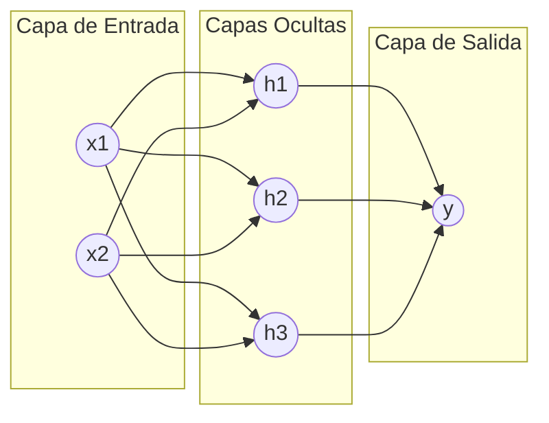

# Redes Neuronales Artificiales (ANN)

Las **Redes Neuronales Artificiales** consisten en un conjunto de algoritmos inspirados en el funcionamiento biológico del cerebro humano, diseñados específicamente para reconocer patrones sumamente complejos. Estos modelos constituyen el fundamento y la base principal de todo el campo del Deep Learning.

## Conceptos Clave

- **Perceptrón:** Es la unidad básica de procesamiento computacional (la neurona artificial). Recibe múltiples señales de entrada, las multiplica por "pesos" específicos ($w$), añade un valor de sesgo ($bias$) y somete el resultado a una función matemática de activación.
- **Estructura de Capas (Layers):** 
  - *Capa de entrada (Input Layer):* Es la primera capa que recibe los datos sin procesar.
  - *Capas ocultas (Hidden Layers):* Son las capas intermedias encargadas de realizar las transformaciones matemáticas complejas y la extracción de características.
  - *Capa de salida (Output Layer):* Emite la predicción o resultado final, como puede ser la probabilidad de pertenencia a una clase o un valor numérico continuo.
- **Funciones de Activación:** Son fórmulas matemáticas que deciden la magnitud con la que una neurona debe "activarse". Tienen la función crítica de añadir no-linealidad al modelo computacional, permitiéndole aprender patrones del mundo real. Ejemplos comunes incluyen *Sigmoide, ReLU y Tanh*.

## ¿Cómo aprenden? (Backpropagation)

El proceso de entrenamiento de una red neuronal ocurre en dos fases fundamentales por cada iteración sobre los datos:

1. **Forward Pass (Propagación hacia adelante):** Los datos fluyen desde la capa de entrada hacia adelante hasta generar una predicción final. Una vez obtenida, el sistema calcula el nivel de error comparando la predicción del modelo con el valor real u objetivo.
2. **Backward Pass (Retropropagación):** El error obtenido se propaga hacia atrás, recorriendo las capas en orden inverso. Usando principios de cálculo diferencial y el algoritmo de [[Gradient Descent]], la red ajusta finamente los pesos matemáticos de todas sus conexiones internas para minimizar este error en la siguiente iteración.

> [!info] Capacidades y Limitaciones
> Las redes neuronales son herramientas extremadamente poderosas para procesar datos no estructurados, como imágenes de alta resolución, archivos de audio o texto natural. Sin embargo, su entrenamiento exige cantidades masivas de datos y un enorme poder computacional. Adicionalmente, se les considera "modelos de caja negra", ya que resulta extremadamente difícil auditar e interpretar el razonamiento matemático exacto detrás de una decisión específica.

## Notas relacionadas
- [[machine learning]]
- [[algoritmos parametricos y no parametricos]]
- [[Gradient Descent]]
