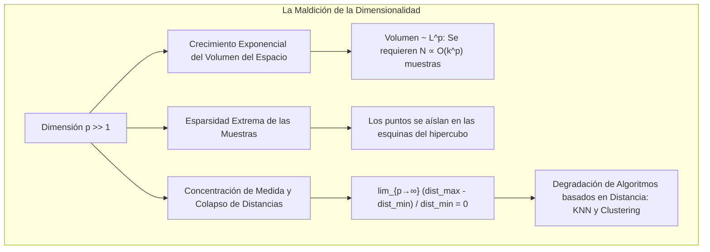
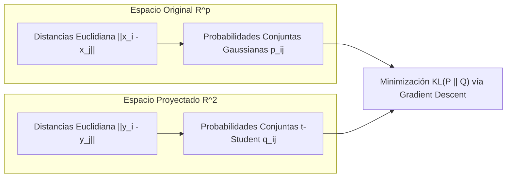

# Reducción de Dimensionalidad (PCA y t-SNE)

En el aprendizaje no supervisado y la ingeniería de características ([[Feature Engineering]]), la **reducción de dimensionalidad** comprende el conjunto de técnicas matemáticas diseñadas para transformar un conjunto de datos definido en un espacio de alta dimensión $\mathbb{R}^p$ hacia un subespacio o variedad de dimensión sustancialmente menor $\mathbb{R}^k$ ($k \ll p$), preservando la máxima cantidad de información relevante posible (varianza global o vecindades locales).

La reducción de dimensionalidad es indispensable para:
1. **Mitigar la Maldición de la Dimensionalidad.**
2. **Visualizar e Interpretar Datos Complejos** en 2D o 3D.
3. **Comprimir Datos y Acelerar el Entrenamiento** de modelos subsecuentes.
4. **Eliminar Multicolinealidad** en [[modelos de regresion]] lineales y regularizar modelos controlando el trade-off de [[bias y viarianza]].

> [!info] 💡 ¿Cómo entender esto desde cero? (Guía para novatos de pregrado)
> - **La sombra en la pared:** Si proyectas la sombra de una tetera 3D sobre una pared 2D, pierdes una dimensión (la profundidad), pero si iluminas la tetera desde el ángulo correcto, la silueta 2D te permite reconocer claramente la tetera con su asa y pico.
> - **PCA (El fotógrafo que busca el mejor ángulo):** Encuentra los ejes perpendiculares (Componentes Principales) a lo largo de los cuales los datos están más esparcidos (tienen la máxima varianza). Es un método lineal rápido y matemático (basado en autovectores y SVD).
> - **t-SNE (El organizador de fotos en un álbum 2D):** A t-SNE no le importa la varianza global; le importa que los puntos que eran "vecinos cercanos" en 100 dimensiones sigan estando juntos en tu pantalla 2D. Es perfecto para visualizar grupos (clusters) de datos médicos o imágenes, pero es lento y no sirve para transformar datos nuevos.

---

## 1. La Maldición de la Dimensionalidad (*Curse of Dimensionality*)

Acuñado por Richard Bellman (1957) en el contexto de control dinámico, el término describe las patologías geométricas y estadísticas contraintuitivas que emergen cuando el número de variables o características $p$ crece significativamente.



### 1.1 Crecimiento Exponencial del Hipervolumen y Esparsidad
Consideremos un hipercubo unitario $[0, 1]^p$ de volumen $V = 1^p = 1$. Si deseamos cubrir este hipercubo con una cuadrícula que tenga únicamente 10 divisiones por eje coordenado:
- En dimensión $p = 1$: se requieren $10^1 = 10$ puntos de muestreo.
- En dimensión $p = 2$: se requieren $10^2 = 100$ puntos.
- En dimensión $p = 100$: se requieren $10^{100}$ puntos (un número superior a la cantidad total de átomos en el universo observable).

Para cualquier conjunto de datos finito $n$, a medida que $p$ crece, **la densidad de muestreo se desvanece asintóticamente a cero**. Los datos se vuelven extremadamente dispersos (*sparse*), habitando las "esquinas" del espacio y dejando el centro prácticamente vacío.

### 1.2 El Fenómeno de Concentración de Medida y Colapso de Distancias
Beyer et al. (1999) demostraron rigurosamente que bajo condiciones muy generales de distribuciones de datos, a medida que la dimensionalidad tiende a infinito ($p \to \infty$):

$$\lim_{p \to \infty} \frac{\text{dist}_{\max} - \text{dist}_{\min}}{\text{dist}_{\min}} = 0$$

donde $\text{dist}_{\max}$ y $\text{dist}_{\min}$ representan las distancias euclidianas desde un punto de consulta hacia su vecino más lejano y más cercano, respectivamente.

> [!important] Impacto Crítico en Modelos de Machine Learning
> Cuando la diferencia relativa entre la distancia al vecino más próximo y al más distante colapsa a cero, el concepto mismo de "proximidad" o "vecindario espacial" pierde significado métrico.
> Algoritmos fuertemente dependientes de distancias euclidianas —como [[K-Nearest Neighbors (KNN)]], k-means en [[Clustering]] o Support Vector Machines con kernel RBF— experimentan una degradación severa en su desempeño.

---

## 2. Método Lineal: Análisis de Componentes Principales (PCA)

Introducido por Karl Pearson (1901) y desarrollado formalmente por Harold Hotelling (1933), el **Análisis de Componentes Principales** (*Principal Component Analysis* o **PCA**) es la técnica de proyección ortogonal lineal más empleada en ciencia de datos.

### 2.1 Objetivo Geométrico y Estadístico
PCA busca encontrar una secuencia de ejes ortogonales ordenados —denominados **componentes principales**— tales que:
1. El primer componente capture la **máxima varianza posible** de los datos proyectados.
2. Cada componente subsiguiente capture la máxima varianza restante sujeta a la restricción estricta de ser **ortogonal** (descorrelacionado) respecto a todos los componentes previos.
3. Equivalentemente, la proyección en los primeros $k$ componentes **minimiza el error cuadrático medio de reconstrucción** entre los puntos originales y sus aproximaciones proyectadas.

```
                  EJE DEL PRIMER COMPONENTE PRINCIPAL (PC1)
                                      /  * (Máxima Varianza)
                                  *  /  *
                             *  *   / *
                     PC2 ───────*──/────── (Ortogonal a PC1, menor varianza)
                           *  *   /
                                 /  *
                                /
```

### 2.2 Deducción Matemática Formal Paso a Paso

#### Paso 1: Centrado y Estandarización de los Datos
Sea la matriz de datos $\mathbf{X} \in \mathbb{R}^{n \times p}$ compuesta por $n$ observaciones y $p$ variables continuas. Es requisito indispensable centrar cada columna a media cero:

$$\tilde{\mathbf{X}} = \mathbf{X} - \mathbf{1}_n \boldsymbol{\mu}^T, \quad \text{donde } \boldsymbol{\mu} = \frac{1}{n} \mathbf{X}^T \mathbf{1}_n$$

*(Si las variables poseen magnitudes o unidades heterogéneas, se debe aplicar Z-score scaling dividiendo adicionalmente por la desviación estándar muestral, conforme a [[Preprocesamiento de datos]]).*

#### Paso 2: Proyección sobre un Vector de Dirección
Sea $\mathbf{u}_1 \in \mathbb{R}^p$ un vector unitario de proyección, tal que $\|\mathbf{u}_1\|_2^2 = \mathbf{u}_1^T \mathbf{u}_1 = 1$.

Las coordenadas escalares de las proyecciones de todas las muestras sobre esta dirección están dadas por el vector columna $\mathbf{y}_1 = \tilde{\mathbf{X}} \mathbf{u}_1 \in \mathbb{R}^n$.

La media de las proyecciones es nula: $\mathbb{E}[\mathbf{y}_1] = \frac{1}{n} \mathbf{1}^T \tilde{\mathbf{X}} \mathbf{u}_1 = \mathbf{0}^T \mathbf{u}_1 = 0$.

#### Paso 3: Maximización de la Varianza Proyectada
La varianza muestral de las proyecciones a lo largo de $\mathbf{u}_1$ es:

$$\operatorname{Var}(\mathbf{y}_1) = \frac{1}{n - 1} \mathbf{y}_1^T \mathbf{y}_1 = \frac{1}{n - 1} (\tilde{\mathbf{X}} \mathbf{u}_1)^T (\tilde{\mathbf{X}} \mathbf{u}_1) = \mathbf{u}_1^T \left( \frac{1}{n - 1} \tilde{\mathbf{X}}^T \tilde{\mathbf{X}} \right) \mathbf{u}_1 = \mathbf{u}_1^T \boldsymbol{\Sigma} \mathbf{u}_1$$

donde $\boldsymbol{\Sigma} = \frac{1}{n - 1} \tilde{\mathbf{X}}^T \tilde{\mathbf{X}} \in \mathbb{R}^{p \times p}$ es la **Matriz de Covarianza Muestral**, la cual es simétrica y semidefinida positiva.

#### Paso 4: Optimización con Multiplicadores de Lagrange
Formulamos el problema de optimización con restricción de norma unitaria:

$$\max_{\mathbf{u}_1} \mathbf{u}_1^T \boldsymbol{\Sigma} \mathbf{u}_1 \quad \text{sujeto a } \mathbf{u}_1^T \mathbf{u}_1 = 1$$

Construimos la función Lagrangiana con el multiplicador escalar $\lambda_1$:

$$\mathcal{L}(\mathbf{u}_1, \lambda_1) = \mathbf{u}_1^T \boldsymbol{\Sigma} \mathbf{u}_1 - \lambda_1 (\mathbf{u}_1^T \mathbf{u}_1 - 1)$$

Calculando el gradiente respecto a $\mathbf{u}_1$ e igualando a cero:

$$\nabla_{\mathbf{u}_1} \mathcal{L} = 2 \boldsymbol{\Sigma} \mathbf{u}_1 - 2 \lambda_1 \mathbf{u}_1 = \mathbf{0} \implies \boldsymbol{\Sigma} \mathbf{u}_1 = \lambda_1 \mathbf{u}_1$$

> [!note] Conclusión Fundamental del Teorema Espectral
> La ecuación $\boldsymbol{\Sigma} \mathbf{u}_1 = \lambda_1 \mathbf{u}_1$ demuestra que $\mathbf{u}_1$ es un **autovector** (*eigenvector*) de la matriz de covarianza $\boldsymbol{\Sigma}$, y $\lambda_1$ es su correspondiente **autovalor** (*eigenvalue*).
> 
> Sustituyendo de regreso en la varianza proyectada:
> 
> $$\operatorname{Var}(\mathbf{y}_1) = \mathbf{u}_1^T (\boldsymbol{\Sigma} \mathbf{u}_1) = \mathbf{u}_1^T (\lambda_1 \mathbf{u}_1) = \lambda_1 (\mathbf{u}_1^T \mathbf{u}_1) = \lambda_1$$
> 
> Por ende, para **maximizar la varianza**, $\mathbf{u}_1$ debe ser el autovector asociado al **mayor autovalor** $\lambda_1$ de $\boldsymbol{\Sigma}$.

#### Paso 5: Componentes Subsecuentes y Descomposición Espectral
Para el segundo componente $\mathbf{u}_2$, se maximiza $\mathbf{u}_2^T \boldsymbol{\Sigma} \mathbf{u}_2$ sujeto a $\mathbf{u}_2^T \mathbf{u}_2 = 1$ y a la condición de ortogonalidad $\mathbf{u}_2^T \mathbf{u}_1 = 0$, resultando en el segundo autovector correspondiente a $\lambda_2 \le \lambda_1$.

Dado que $\boldsymbol{\Sigma}$ es simétrica y real, el teorema espectral garantiza la descomposición:

$$\boldsymbol{\Sigma} = \mathbf{V} \boldsymbol{\Lambda} \mathbf{V}^T$$

donde $\mathbf{V} = [\mathbf{v}_1, \dots, \mathbf{v}_p]$ es una matriz ortogonal de autovectores y $\boldsymbol{\Lambda} = \operatorname{diag}(\lambda_1, \dots, \lambda_p)$ con $\lambda_1 \ge \lambda_2 \ge \dots \ge \lambda_p \ge 0$.

### 2.3 Enfoque Numérico Moderno: Descomposición en Valores Singulares (SVD)

En entornos de producción e ingeniería de software (e.g., `scikit-learn`), calcular explícitamente la matriz $\boldsymbol{\Sigma} = \frac{1}{n-1}\tilde{\mathbf{X}}^T \tilde{\mathbf{X}}$ es computacionalmente ineficiente y susceptible a errores de redondeo numérico cuando $p$ es muy grande. 

Se aplica **Descomposición en Valores Singulares (SVD)** directamente sobre la matriz de datos centrada $\tilde{\mathbf{X}}$:

$$\tilde{\mathbf{X}} = \mathbf{U} \mathbf{S} \mathbf{V}^T$$

donde:
- $\mathbf{U} \in \mathbb{R}^{n \times n}$ es una matriz ortogonal de vectores singulares izquierdos.
- $\mathbf{S} \in \mathbb{R}^{n \times p}$ es una matriz diagonal con los valores singulares $s_1 \ge s_2 \ge \dots \ge s_p \ge 0$.
- $\mathbf{V} \in \mathbb{R}^{p \times p}$ es una matriz ortogonal de vectores singulares derechos.

Relación exacta con la matriz de covarianza:

$$\boldsymbol{\Sigma} = \frac{1}{n-1} \tilde{\mathbf{X}}^T \tilde{\mathbf{X}} = \frac{1}{n-1} (\mathbf{V} \mathbf{S}^T \mathbf{U}^T)(\mathbf{U} \mathbf{S} \mathbf{V}^T) = \mathbf{V} \left( \frac{\mathbf{S}^2}{n-1} \right) \mathbf{V}^T$$

- Los vectores singulares derechos $\mathbf{V}$ son exactamente los componentes principales (autovectores de $\boldsymbol{\Sigma}$).
- Los autovalores se obtienen directamente mediante: $\lambda_i = \frac{s_i^2}{n - 1}$.
- Las coordenadas de los datos proyectados en el espacio de dimensión reducida $k$ son:
  
  $$\mathbf{Z} = \tilde{\mathbf{X}} \mathbf{V}_k = \mathbf{U}_k \mathbf{S}_k$$

### 2.4 Criterio de Selección de Componentes: Varianza Explicada Acumulada

El ratio de varianza explicada por el componente $i$-ésimo es:

$$\text{EVR}_i = \frac{\lambda_i}{\sum_{j=1}^p \lambda_j}$$

Para seleccionar el número óptimo de componentes $k$, se calculan las sumas acumuladas buscando un umbral de fidelidad $\tau$ (típicamente $85\%$, $90\%$ o $95\%$):

$$\sum_{i=1}^k \text{EVR}_i \ge \tau$$

```
      GRÁFICO DEL CODO Y VARIANZA EXPLICADA ACUMULADA (SCREE PLOT)
      Varianza Acumulada (%)
      100 ┬                                 *───────* Umbral 95%
          │                         *───────┘
       80 │                 *───────┘
          │         *───────┘
       50 │ *───────┘
          └─┴───────┴───────┴───────┴───────┴───────►
            PC1    PC2     PC3     PC4     PC5
```

---

## 3. Método No Lineal: t-SNE (*t-Distributed Stochastic Neighbor Embedding*)

Propuesto por **Laurens van der Maaten y Geoffrey Hinton (2008)**, **t-SNE** es una técnica no lineal de aprendizaje de variedades (*manifold learning*) diseñada para la visualización de datos de alta dimensión en espacios 2D o 3D.

### 3.1 La Limitación de PCA y la Necesidad de Métodos No Lineales
PCA solo puede capturar subespacios lineales planos. Si la topología intrínseca de los datos reside sobre una variedad curvada no lineal (como el famoso *Swiss Roll* o las representaciones latentes de [[Redes neuronales]]), PCA proyecta puntos distantes sobre el mismo plano aplastando la estructura real.

### 3.2 Formulación Probabilística de t-SNE

#### A. Similitudes en Alta Dimensión (Distribución Gaussiana)
En el espacio original $\mathbb{R}^p$, la similitud entre los puntos $x_i$ y $x_j$ se define como la probabilidad condicional de que $x_i$ escoja a $x_j$ como su vecino bajo una distribución normal centrada en $x_i$:

$$p_{j|i} = \frac{\exp\left(-\frac{\|x_i - x_j\|^2}{2\sigma_i^2}\right)}{\sum_{k \neq i} \exp\left(-\frac{\|x_i - x_k\|^2}{2\sigma_i^2}\right)}, \quad p_{ii} = 0$$

Para hacer el cálculo simétrico y robusto ante datos atípicos (*outliers*), se computa la probabilidad conjunta:

$$p_{ij} = \frac{p_{j|i} + p_{i|j}}{2n}$$

La varianza $\sigma_i^2$ de cada punto se ajusta automáticamente mediante búsqueda binaria para satisfacer un nivel fijo de **Perplejidad** (*Perplexity*):

$$\operatorname{Perp}(P_i) = 2^{H(P_i)} = 2^{-\sum_j p_{j|i} \log_2 p_{j|i}}$$

La perplejidad actúa como una medida del número efectivo de vecinos locales que cada punto considera relevante (valores típicos entre 5 y 50).

#### B. Similitudes en Baja Dimensión (Distribución t-Student)
Sean $y_i, y_j \in \mathbb{R}^2$ las coordenadas proyectadas. Si se emplease una función Gaussiana en baja dimensión, se produciría el severo **problema de hacinamiento** (*Crowding Problem*). 

Para resolverlo, t-SNE modela la probabilidad conjunta en el espacio de salida mediante una **distribución t-Student con 1 grado de libertad** (equivalente a una distribución de Cauchy):

$$q_{ij} = \frac{\left(1 + \|y_i - y_j\|^2\right)^{-1}}{\sum_{k} \sum_{l \neq k} \left(1 + \|y_k - y_l\|^2\right)^{-1}}, \quad q_{ii} = 0$$



### 3.3 El Problema del Hacinamiento (*Crowding Problem*) y las Colas Pesadas
- En un espacio $p$-dimensional, el volumen disponible dentro de un radio $r$ escala como $r^p$. Hay muchísimo más espacio relativo para acomodar puntos a distancias moderadas que en un plano bidimensional ($r^2$).
- Si modelamos ambos espacios con Gaussianas, en 2D no hay suficiente volumen para separar todos los puntos a distancias moderadas, forzando a los grupos a colapsar en un único conglomerado amorfo central.
- La distribución t-Student posee **colas pesadas** (*heavy tails*): su densidad decae como una ley potencial inversa $\sim \frac{1}{d^2}$, mucho más lentamente que la exponencial Gaussiana $\sim e^{-d^2}$.
- Por consiguiente, para emparejar una probabilidad pequeña $p_{ij}$ de alta dimensión con $q_{ij}$, la distancia euclidiana en el plano $\|y_i - y_j\|$ debe ser notablemente mayor. Esto "empuja hacia afuera" a los clústeres separados, despejando el espacio visual.

### 3.4 Función de Coste: Divergencia de Kullback-Leibler

t-SNE encuentra las coordenadas óptimas $\{y_1, \dots, y_n\}$ minimizando la divergencia KL entre las distribuciones $P$ y $Q$:

$$\mathcal{L} = \operatorname{KL}(P \parallel Q) = \sum_{i \neq j} p_{ij} \log\left(\frac{p_{ij}}{q_{ij}}\right)$$

> [!important] Naturaleza Asimétrica de la Divergencia KL
> La penalización es intrínsecamente asimétrica:
> - Si $p_{ij}$ es grande (puntos muy cercanos en alta dimensión) y $q_{ij}$ es pequeño (separados en baja dimensión), el término $p_{ij} \log(p_{ij}/q_{ij})$ produce un **coste enorme**. El gradiente empuja con fuerza los puntos proyectados para que se junten.
> - Si $p_{ij}$ es pequeño (puntos distantes en alta dimensión) y $q_{ij}$ es grande, la penalización es despreciable.
> 
> *Conclusión:* t-SNE se enfoca obsesivamente en preservar la **estructura local** (vecindades y clústeres inmediatos), desentendiéndose de la escala métrica global entre clústeres distantes.

El gradiente analítico respecto a $y_i$ adopta la forma intuitiva de un sistema de fuerzas de atracción y repulsión:

$$\frac{\partial \mathcal{L}}{\partial y_i} = 4 \sum_{j} (p_{ij} - q_{ij})(y_i - y_j)(1 + \|y_i - y_j\|^2)^{-1}$$

el cual se optimiza mediante [[Gradient Descent]] acelerado por *momentum* y la técnica de "exageración temprana" (*early exaggeration*).

### 3.5 Limitaciones Críticas de t-SNE en Ingeniería
1. **Es un Algoritmo No Paramétrico de Visualización:** No induce una función analítica de mapeo $f: \mathbb{R}^p \to \mathbb{R}^2$. **No permite proyectar nuevos datos de test (*out-of-sample*)**; para incorporar una sola muestra nueva hay que reiniciar la optimización completa de todos los puntos.
2. **Las Distancias Inter-Clúster Carecen de Significado Métrico:** Que dos clústeres aparezcan cerca o lejos en un gráfico t-SNE depende de la perplejidad y de la semilla aleatoria, no de su distancia real en $\mathbb{R}^p$.
3. **Costo Computacional:** La complejidad del algoritmo ingenuo es $\mathcal{O}(n^2)$ (reducida a $\mathcal{O}(n \log n)$ mediante árboles de Barnes-Hut).

---

## 4. Comparación Profunda: PCA vs t-SNE vs UMAP

| Criterio | PCA (Pearson, 1901) | t-SNE (Hinton, 2008) | UMAP (McInnes, 2018) |
| :--- | :--- | :--- | :--- |
| **Naturaleza Matemática** | Lineal, algebraico (SVD / Eigendecomposition) | No lineal, estocástico probabilístico | No lineal, topología difusa (*fuzzy simplicial sets*) |
| **Objetivo Principal** | Maximizar varianza global proyectada | Preservar vecindarios locales estrictos | Preservar estructura local y balancear estructura global |
| **Proyección de Nuevos Puntos** | **Sí** ($Z_{\text{new}} = X_{\text{new}} \mathbf{V}_k$) | **No** (requiere reentrenar todo el dataset) | **Sí** (soporta `transform` sobre nuevos datos) |
| **Complejidad Computacional** | $\mathcal{O}(\min(n p^2, n^2 p))$ analítico | $\mathcal{O}(n \log n)$ con Barnes-Hut | $\mathcal{O}(n \cdot k)$ sumamente rápido y escalable |
| **Sensibilidad a Escala / Hiperparámetros** | Requiere estandarización; sin hiperparámetros | Extremadamente sensible a *Perplexity* y semilla | Sensible a `n_neighbors` y `min_dist` |
| **Función de Pérdida** | Error cuadrático medio de reconstrucción | Divergencia Kullback-Leibler $KL(P \parallel Q)$ | Entropía cruzada difusa sobre grafos |
| **Caso de Uso Recomendado** | Preprocesamiento para modelos de ML, compresión | Exploración visual cualitativa en 2D/3D | Visualización a gran escala y pipeline de embeddings |

---

## 5. Notas Relacionadas
- [[machine learning]]: Marco epistemológico y estadístico de inferencia no supervisada sobre estructuras latentes.
- [[tipos de machine learning]]: Clasificación dentro del aprendizaje no supervisado (reducción dimensional y clustering).
- [[Preprocesamiento de datos]]: Estandarización imprescindible previa al cálculo de la covarianza en PCA.
- [[Feature Engineering]]: Diferencias entre extracción de características (PCA) y selección de características.
- [[K-Nearest Neighbors (KNN)]]: Superación de la maldición de la dimensionalidad en modelos métricos.
- [[Clustering]]: Uso de PCA y t-SNE para evaluar visualmente la separación de clústeres en k-means y DBSCAN.
- [[bias y viarianza]]: Reducción de varianza en modelos complejos mediante el filtrado de ruido y reducción dimensional.
- [[modelos de regresion]]: Regresión sobre Componentes Principales (PCR) para eliminar la multicolinealidad severa.
- [[Gradient Descent]]: Algoritmo de optimización fundamental empleado en la minimización de la divergencia KL en t-SNE.
- [[Redes neuronales]]: Compresión de representaciones de capas ocultas profundas para inspección visual de características aprendidas.
