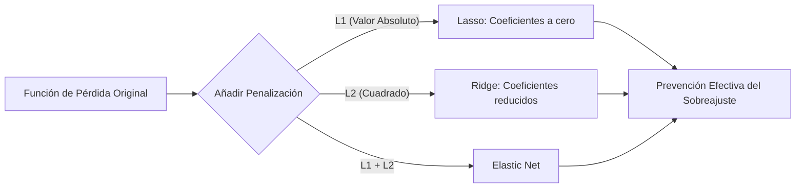

# Regularización

La **Regularización** engloba un conjunto de técnicas estadísticas críticas utilizadas en Machine Learning para disuadir o penalizar a un modelo de volverse excesivamente complejo durante su fase de aprendizaje, logrando evitar de manera efectiva el grave problema del sobreajuste (*overfitting*). En términos prácticos, la regularización castiga matemáticamente a aquellos modelos que intentan ajustarse de forma perfecta al ruido inherente de los datos de entrenamiento, sacrificando su capacidad de generalización.

## ¿Cómo funciona?

El mecanismo opera añadiendo un "término de penalización" específico directamente a la función de pérdida matemática del modelo (es decir, la función de error que el algoritmo intenta minimizar durante el proceso de entrenamiento, típicamente mediante el Descenso del Gradiente). 

Al introducir este término, el objetivo del modelo cambia sutilmente: en lugar de buscar únicamente el menor error de predicción posible, el algoritmo ahora está obligado a buscar el menor error predictivo *al mismo tiempo que se esfuerza por mantener sus parámetros internos (coeficientes o pesos) lo más pequeños y cercanos a cero posible*.

### Técnicas Principales

1. **Regularización L1 (Lasso):**
   - Esta técnica añade el valor absoluto de la magnitud de los coeficientes a la función de pérdida total.
   - **Efecto clave:** Posee la propiedad matemática única de reducir los coeficientes correspondientes a las características menos importantes exactamente a cero. Por consiguiente, Lasso actúa de forma brillante como un mecanismo automático e integrado de selección de características (*Feature Selection*).

2. **Regularización L2 (Ridge):**
   - En este caso, añade el cuadrado de la magnitud de los coeficientes a la ecuación de pérdida.
   - **Efecto clave:** Penaliza de forma mucho más severa a los coeficientes que se vuelven excesivamente grandes, reduciendo el valor de todos ellos de forma gradual y equitativa hacia cero (aunque sin permitir que lleguen a ser exactamente cero). Es una técnica que funciona excepcionalmente bien para estabilizar el modelo cuando existe multicolinealidad severa (alta correlación) entre las variables predictivas.

3. **Elastic Net:**
   - Consiste en una combinación lineal avanzada que integra tanto la penalización de L1 (Lasso) como la de L2 (Ridge) simultáneamente. Su propósito es capturar y aprovechar las ventajas matemáticas de ambos mundos, resultando extremadamente útil cuando el conjunto de datos posee múltiples características fuertemente correlacionadas entre sí.

> [!info] Explicación Práctica e Hiperparámetros
> Desde un punto de vista analítico, aplicar regularización equivale a forzar al modelo a operar bajo un "presupuesto matemático" limitado para distribuir sus pesos internos. 
> La fuerza con la que se aplica esta penalización está controlada por un hiperparámetro universalmente conocido como **Alpha** o **Lambda** ($\lambda$). Si Lambda se ajusta a cero, la regularización se desactiva por completo. Por el contrario, si el valor de Lambda es exageradamente alto, el modelo penalizará tan fuertemente la magnitud de los pesos que terminará colapsando y causando un severo subajuste (*underfitting*).

## Notas relacionadas
- [[Ajuste de modelos]]
- [[modelos de regresion]]
- [[bias y viarianza]]
