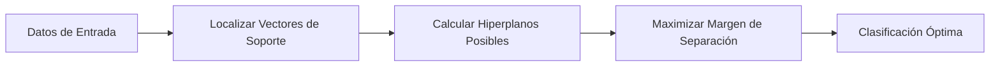

# Support Vector Machines (SVM)

Las **Máquinas de Vectores de Soporte (SVM)** son algoritmos de aprendizaje supervisado altamente potentes y versátiles. Son capaces de ejecutar tareas complejas como la clasificación lineal y no lineal, el análisis de regresión e incluso la detección de valores atípicos (anomalías).

## Hiperplanos y el Margen Máximo

El objetivo geométrico fundamental de un modelo SVM, particularmente en tareas de clasificación, es encontrar el **hiperplano** que separe óptimamente las distintas clases dentro del espacio multidimensional de características. 

Dado que pueden existir infinitos hiperplanos que separen los datos de forma válida, el algoritmo de SVM busca específicamente aquel que ofrezca el **margen máximo**. Esto significa que buscará la línea de separación que se encuentre lo más alejada posible de los puntos de datos más cercanos correspondientes a cada clase.

- **Vectores de Soporte:** Son puntos de datos sumamente críticos que se localizan justo en los bordes del margen de decisión. Estos puntos son los únicos que verdaderamente influyen y definen la posición del hiperplano de separación; si se eliminaran todos los demás puntos del conjunto de datos, el límite de decisión permanecería inalterado.

## El Truco del Kernel (Kernel Trick)

En escenarios del mundo real, los conjuntos de datos rara vez son perfectamente separables mediante una simple línea recta o un plano bidimensional.

Para solucionar este problema, el *Kernel Trick* actúa como una técnica matemática brillante. Su función es proyectar implícitamente los datos originales hacia un espacio de mayor dimensionalidad en el cual sí puedan separarse de forma lineal. Lo excepcional de este método es que logra realizar esta separación geométrica sin necesidad de calcular exhaustivamente las nuevas coordenadas espaciales, lo cual evita un costo computacional inasumible.

- **Kernels comunes:** Incluyen el kernel Lineal, el Polinomial y el RBF (Función de Base Radial o Gaussiano).

> [!info] Ventajas y Desventajas
> **Ventajas:** Los modelos SVM son excepcionalmente efectivos en espacios de alta dimensionalidad, manteniéndose robustos incluso cuando el número de dimensiones supera al número de muestras disponibles. Además, son altamente eficientes en el uso de memoria RAM, ya que su modelo matemático solo almacena los vectores de soporte.
> **Desventajas:** El tiempo de entrenamiento del algoritmo escala de forma cúbica en relación al tamaño del dataset, lo que los hace ineficientes e inapropiados para conjuntos de datos verdaderamente masivos. Asimismo, son modelos extremadamente sensibles a la escala numérica de las características, por lo que una etapa estricta de estandarización o normalización previa resulta obligatoria.

## Notas relacionadas
- [[algoritmos parametricos y no parametricos]]
- [[tipos de machine learning]]
- [[Preprocesamiento de datos]]
