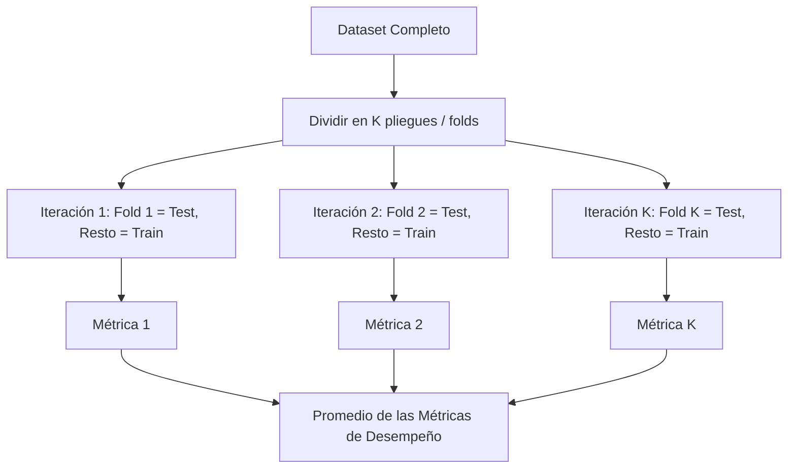

# Validación Cruzada (Cross-Validation)

El objetivo fundamental de cualquier proyecto de Machine Learning es construir un modelo computacional que, partiendo de un conjunto de datos de entrada, sea plenamente capaz de generar predicciones precisas y confiables. 

Durante el proceso de construcción, el algoritmo ajusta de forma automática sus **parámetros** internos (como los pesos o coeficientes numéricos) en la fase de entrenamiento. De forma paralela y previa, nosotros como desarrolladores debemos definir cuidadosamente los **hiperparámetros**, los cuales son configuraciones de diseño esenciales que buscan optimizar la arquitectura del modelo para obtener las mejores predicciones posibles.

Resulta indispensable entrenar múltiples variantes del modelo con distintas configuraciones de hiperparámetros para determinar científicamente cuál es la más idónea. Para ello, necesitamos medir de forma rigurosa el desempeño de cada variante y seleccionar objetivamente la que ofrezca los resultados superiores.

## Capacidad de generalización

La capacidad de generalización se define simplemente como la aptitud y robustez del modelo para generar predicciones correctas y confiables sobre datos completamente nuevos, los cuales no ha observado previamente durante su fase de entrenamiento.

## Enfoque Clásico: Sets de validación y prueba 

Tradicionalmente, la práctica estándar consistía en fraccionar el dataset en tres conjuntos excluyentes. Usualmente, se destinaba aproximadamente un 70% de los datos para entrenamiento, un 15% para validación y el 15% restante para prueba.

- El **set de entrenamiento** se utiliza para ajustar computacionalmente y obtener los parámetros internos del modelo.
- El **set de validación** se emplea para ajustar los hiperparámetros y seleccionar empíricamente el mejor modelo entre varios candidatos evaluados.
- El **set de prueba** se reserva estrictamente para el final, permitiéndonos medir objetivamente la verdadera capacidad de generalización del modelo ya finalizado y seleccionado.

El inconveniente principal de este enfoque clásico de partición estática radica en que requiere una inmensa cantidad de datos para ser estadísticamente representativo, lo cual en numerosos proyectos no es viable. Adicionalmente, existe el riesgo inminente de que, al realizar una partición puramente aleatoria, estos tres subconjuntos resulten con distribuciones estadísticas dispares, afectando severamente y sesgando la evaluación del modelo.

## K-Fold Cross Validation (Validación Cruzada de K-Iteraciones)

Para mitigar radicalmente el problema de la distribución estadística asimétrica, la validación cruzada propone un enfoque dinámico: en lugar de dividir y aislar permanentemente los datos, este método iterativo utiliza la totalidad del dataset tanto para las fases de entrenamiento como para las de evaluación. El mecanismo estándar más popular en la industria se denomina validación cruzada de *k* iteraciones (K-Fold).

### Algoritmo del K-Fold

- **Inicio:** El proceso arranca con una mezcla aleatoria del dataset completo y la inicialización del parámetro numérico *k*. Este valor *k* dicta la cantidad exacta de particiones iguales (pliegues o *folds*) en las que se segmentarán los datos, definiendo simultáneamente el número total de iteraciones a ejecutar.
- **Fase de Entrenamiento y Validación:**
  - Durante cada iteración, se aísla una de las *k* particiones y se mantiene completamente oculta al proceso de aprendizaje del modelo, funcionando temporalmente como el set de validación.
  - Con las *k-1* particiones restantes, se procede a entrenar el modelo intensivamente.
  - Inmediatamente después, se evalúa el modelo confrontando sus predicciones contra la partición que mantuvimos oculta. La métrica de desempeño resultante se almacena para su posterior análisis.
- **Cierre del Ciclo:** Todo el proceso descrito se repite sistemáticamente *k* veces, asegurándonos de rotar y cambiar la partición oculta en cada nueva ronda. Al finalizar todas las iteraciones, dispondremos de *k* medidas independientes de desempeño. El desempeño global final del modelo se calculará simplemente como el promedio aritmético de estas *k* evaluaciones.

> [!info] Conceptos Fundamentales
> **Diferencia entre Parámetros e Hiperparámetros:**
> - **Parámetros:** El modelo los descubre y ajusta matemáticamente por sí mismo durante el entrenamiento (por ejemplo, los pesos sinápticos en una red neuronal o los coeficientes en una regresión lineal).
> - **Hiperparámetros:** Tú, como ingeniero de datos, los estableces manualmente antes del entrenamiento (por ejemplo, la profundidad máxima tolerada de un árbol de decisión, la tasa de aprendizaje *learning rate*, o el valor *K* numérico en KNN).
> 
> **Ventaja Suprema del K-Fold:**
> Esta técnica garantiza estadísticamente que absolutamente todos los registros del dataset se aprovechen en algún punto tanto para entrenar como para validar, maximizando el rendimiento extraído de la información disponible y arrojando una estimación final del error sustancialmente más confiable y libre de sesgos.

## Número adecuado de particiones (k)

Lamentablemente, no existe una única respuesta correcta o regla de oro universal para definir el valor óptimo de *k*, puesto que esto depende directamente de la complejidad computacional del modelo que estamos diseñando y del volumen absoluto de datos disponibles. No obstante, el consenso establece que un valor *k* idóneo no debe pecar ni de ser extremadamente pequeño ni excesivamente grande. 

Si *k* es masivamente grande (como en el enfoque Leave-One-Out, donde k es igual a N, el total de registros), se incurrirá en un desgaste de poder computacional injustificado y severo. Por el contrario, si *k* es muy pequeño, la estimación del rendimiento del modelo exhibirá una preocupante alta varianza, impidiéndole detectar patrones genuinos. En el contexto de la práctica industrial del Machine Learning, los valores estándar de mayor aceptación y recomendación técnica son *k=5* o *k=10*.

## Notas relacionadas
- [[machine learning]]
- [[resampling methods]]
- [[metodo hold out]]
- [[Ajuste de modelos]]
- [[test harness]]
