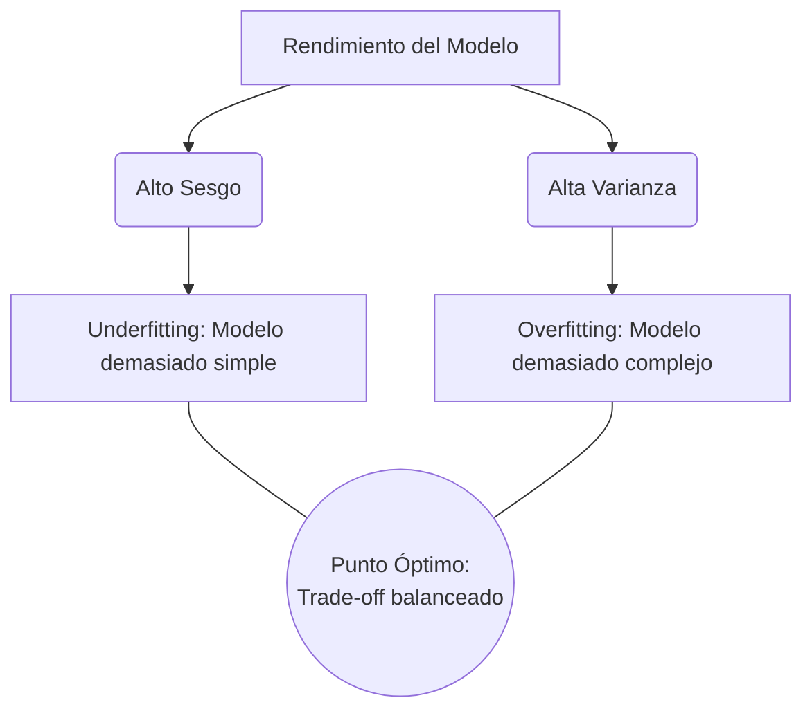

# Sesgo y Varianza (Bias and Variance)

En la teoría estadística del aprendizaje automático, entender el equilibrio entre Sesgo y Varianza es fundamental para desarrollar modelos robustos.

- **El Sesgo (Bias)** representa la incapacidad matemática de un método de Machine Learning para capturar la verdadera relación subyacente que existe en los datos. Un modelo con un alto sesgo suele hacer suposiciones demasiado simples y restrictivas sobre la forma de los datos.
- **La Varianza (Variance)** mide el nivel de sensibilidad y de fluctuación del modelo ante los cambios en el conjunto de entrenamiento. Un modelo con alta varianza es extremadamente sensible; ajusta sus parámetros dramáticamente incluso ante variaciones minúsculas en el dataset.

El algoritmo ideal y utópico es aquel que posee un sesgo bajo (capaz de modelar con alta precisión la verdadera relación compleja de los datos) y una varianza baja simultáneamente (produciendo predicciones muy estables y consistentes al evaluarse sobre diferentes datasets de prueba).

![[Pasted image 20240617222510.png]]
![[Pasted image 20240617222532.png]]

> [!info] Explicación Detallada del Trade-Off
> - **Alto Sesgo (Subajuste / Underfitting):** El modelo resultante es muy rígido y asume una forma demasiado básica que no se corresponde con la realidad (por ejemplo, intentar ajustar obligatoriamente una línea recta a datos que siguen una curva exponencial). Pierde irremediablemente información sobre las relaciones críticas entre las variables.
> - **Alta Varianza (Sobreajuste / Overfitting):** El modelo resulta ser tan excesivamente flexible que memoriza y persigue cada punto de datos, incluyendo el ruido estadístico aleatorio. Si le alteras el dataset de entrenamiento ligeramente, la forma del modelo cambiará de manera radical.
> - **El Equilibrio (Trade-off):** Existe un compromiso fundamental e ineludible en el modelado. Al disminuir el sesgo de un modelo (dotándolo de mayor complejidad matemática), casi siempre aumentas su varianza, y viceversa. Encontrar y ajustar este balance fino es la clave absoluta para lograr un rendimiento predictivo superior.

## Notas relacionadas
- [[Ajuste de modelos]]
- [[Validacion Cruzada]]
- [[test harness]]
- [[modelos de regresion]]
