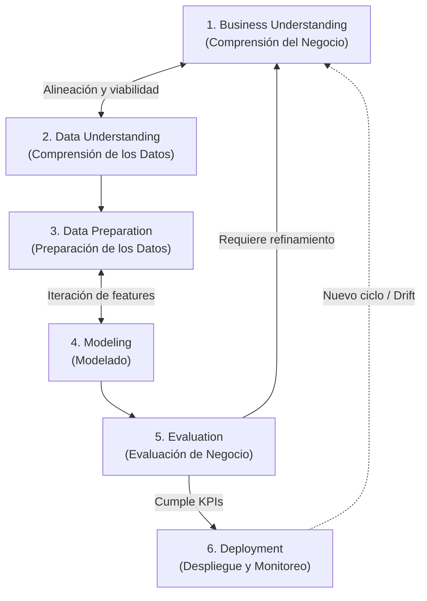
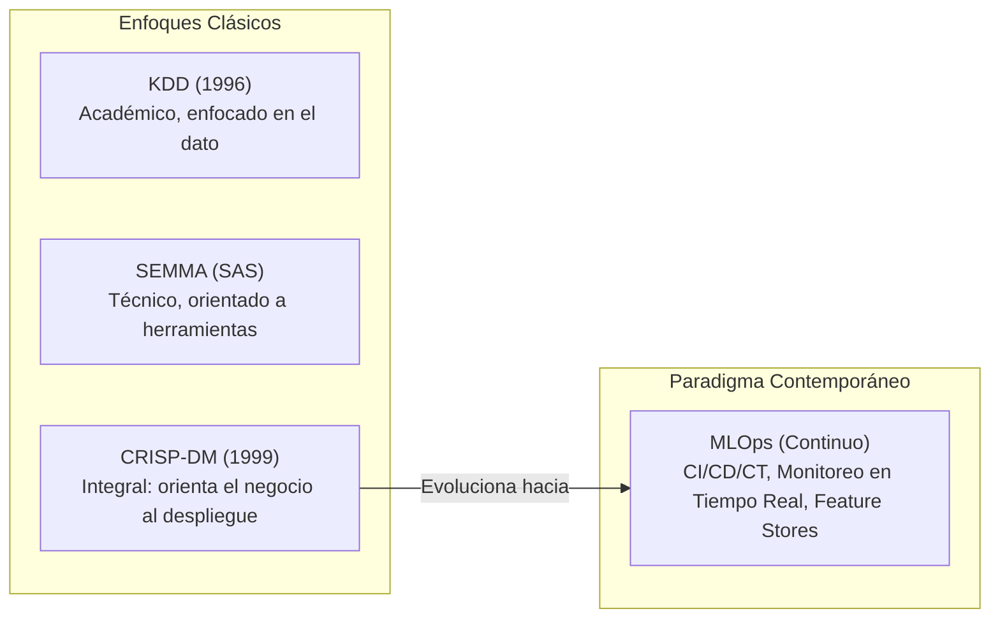

# Metodología CRISP-DM (Cross-Industry Standard Process for Data Mining)

**CRISP-DM** (*Cross-Industry Standard Process for Data Mining*) es el marco metodológico estándar de la industria, neutral respecto a herramientas y proveedores, diseñado para guiar de manera estructurada, repetible y rigurosa los proyectos de minería de datos, ciencia de datos y aprendizaje automático.

Concebida formalmente a finales de la década de 1990 por un consorcio de organizaciones líderes en la industria (DaimlerChrysler, SPSS, NCR y TeraData), la metodología descompone el ciclo de vida del proyecto en un modelo jerárquico estructurado en cuatro niveles: **Fases**, **Tareas Genéricas**, **Tareas Especializadas** e **Instancias de Proceso**.

---

## 1. El Ciclo de Vida de CRISP-DM: Las 6 Fases Fundamentales

El ciclo de vida de un proyecto de ciencia de datos bajo CRISP-DM comprende seis fases interconectadas. Su naturaleza no es una cascada rígida lineal, sino un proceso **iterativo y cíclico** donde la retroalimentación constante entre fases refina los artefactos producidos.

---

### Fase 1: Comprensión del Negocio (*Business Understanding*)
Constituye la fase inicial crítica que orienta todo el esfuerzo técnico hacia la generación de valor organizacional medible.

* **Tareas Genéricas y Actividades:**
  1. *Determinar los Objetivos del Negocio:* Identificar los problemas comerciales, requerimientos estratégicos y criterios organizacionales de éxito (ej. reducir la tasa de deserción de clientes en un 15%).
  2. *Evaluar la Situación Actual:* Inventario exhaustivo de recursos (personal, hardware, software, datos disponibles), requisitos regulatorios y de privacidad (GDPR, ética algorítmica), suposiciones del proyecto, riesgos y planes de contingencia, junto con un análisis riguroso de costo-beneficio.
  3. *Determinar los Objetivos de Minería de Datos:* Traducir las metas comerciales abstractas en objetivos analíticos y técnicos cuantificables (ej. formular un modelo de clasificación binaria optimizado para maximizar el recall al 85% limitando la tasa de falsos positivos al 10%).
  4. *Producir el Plan del Proyecto:* Diseñar el cronograma de trabajo, hitos clave y la selección de tecnologías y arquitecturas iniciales.

---

### Fase 2: Comprensión de los Datos (*Data Understanding*)
Establece el primer contacto operativo con los datos reales para evaluar su potencial y limitaciones frente a los objetivos fijados.

* **Tareas Genéricas y Actividades:**
  1. *Recolección Inicial de Datos:* Extracción, ingesta e integración de fuentes heterogéneas (bases de datos relacionales, logs de servidores, APIs REST, almacenamiento de objetos).
  2. *Descripción de los Datos:* Análisis de volumen (número de registros y atributos), tipos de variables (numéricas continuas, discretas, categóricas ordinales/nominales) y verificación de esquemas.
  3. *Exploración de los Datos (EDA - Exploratory Data Analysis):* Aplicación de estadística descriptiva de primer y segundo orden (medias, varianzas, asimetría, curtosis), matrices de correlación y visualizaciones de distribución para formular hipótesis iniciales.
  4. *Verificación de la Calidad de los Datos:* Auditoría de anomalías: presencia de valores nulos o faltantes (*missing values*), ruido, valores atípicos (*outliers*), inconsistencias de codificación y evaluación del grado de desbalance en la variable objetivo.

---

### Fase 3: Preparación de los Datos (*Data Preparation*)

> [!important] Centro de Gravedad Operativo
> La fase de preparación de datos consume históricamente entre el **70% y el 80% del tiempo y esfuerzo** de un proyecto de ciencia de datos. Su resultado es el conjunto final de datos estructurados (matriz de diseño $X$ y vector objetivo $y$) que alimentará a los algoritmos.

* **Tareas Genéricas y Actividades:**
  1. *Selección de Datos:* Filtrado de tablas, registros y variables relevantes; exclusión fundada de atributos redundantes, irrelevantes o que induzcan fugas temporales.
  2. *Limpieza de Datos:* Tratamiento formal de valores faltantes (imputación mediante estimadores robustos: mediana, KNN, MICE), supresión o transformación de outliers y eliminación de duplicados.
  3. *Construcción de Datos (Feature Engineering):* Derivación de nuevos atributos con mayor poder discriminante (ratios financieros, agregaciones temporales, interacciones no lineales, discretización o binning).
  4. *Integración de Datos:* Combinación de información proveniente de múltiples orígenes mediante operaciones de mezcla (*joins*, *merges*, uniones).
  5. *Formateo y Normalización:* Reestructuración matemática indispensable para los inductores: codificación de variables categóricas (*One-Hot Encoding*, *Target Encoding*), escalado y estandarización ($z$-score, *MinMaxScaler*).

---

### Fase 4: Modelado (*Modeling*)
En esta fase se seleccionan, calibran y entrenan los algoritmos de aprendizaje automático sobre las matrices construidas en la etapa previa.

* **Tareas Genéricas y Actividades:**
  1. *Selección de Técnicas de Modelado:* Elección razonada de familias de algoritmos (paramétricos vs no paramétricos, modelos lineales, árboles de decisión, ensambles tipo Random Forest o Gradient Boosting, redes neuronales) de acuerdo a las características del problema.
  2. *Generación del Diseño de Prueba:* Establecimiento del [[test harness]], definiendo las particiones estrictas mediante [[metodo hold out]] o validación cruzada estratificada con aislamiento total de transformaciones para evitar filtraciones de datos (*data leakage*).
  3. *Construcción del Modelo:* Ejecución de los algoritmos de entrenamiento sobre los datos preparados, optimizando las funciones de pérdida correspondientes.
  4. *Evaluación Técnica y Calibración de Hiperparámetros:* Búsqueda sistemática de configuraciones óptimas (*Grid Search*, *Random Search*, optimización bayesiana) y análisis de curvas de aprendizaje para diagnosticar [[bias y viarianza]].

---

### Fase 5: Evaluación (*Evaluation*)
A diferencia de la evaluación puramente técnica de la fase 4, la fase 5 audita los modelos construidos en relación directa con los **objetivos estratégicos del negocio**.

* **Tareas Genéricas y Actividades:**
  1. *Evaluación de Resultados:* Contrastar las métricas analíticas (ROC-AUC, RMSE, F1-score) contra los criterios de aceptación del negocio definidos en la Fase 1. Análisis de impacto financiero (curvas de ganancia, matrices de coste-beneficio y análisis de *Lift*).
  2. *Revisión del Proceso (Auditoría Metodológica):* Revisión exhaustiva de todo el ciclo para garantizar que no se hayan cometido errores metodológicos, violaciones éticas o supuestos desatendidos.
  3. *Determinación de los Siguientes Pasos:* Toma de decisión formal basada en evidencia:
     * Aprobar la solución para la fase de despliegue.
     * Iniciar una iteración de retorno (hacia *Business Understanding* o *Data Preparation*) para corregir deficiencias.
     * Cancelar el proyecto si los datos no contienen la señal requerida para solucionar el problema comercial de forma rentable.

---

### Fase 6: Despliegue (*Deployment*)
La creación de un modelo carece de valor si sus predicciones no se integran de manera operativa en los sistemas de toma de decisiones o flujos de producción.

* **Tareas Genéricas y Actividades:**
  1. *Planificación del Despliegue:* Diseño de la arquitectura de puesta en producción: inferencia por lotes (*batch scoring* en Data Lakehouse/DWH) o servicios de baja latencia en tiempo real (APIs REST/gRPC en contenedores Docker/Kubernetes).
  2. *Planificación del Monitoreo y Mantenimiento:* Implementación de alarmas contra la degradación del modelo:
     * *Data Drift (Deriva de Datos):* Cambios en la distribución marginal de entrada $P(X)$.
     * *Concept Drift (Deriva de Concepto):* Modificaciones en la relación funcional entre variables y objetivo $P(Y \mid X)$.
  3. *Producción del Informe Final:* Documentación integral técnica y resumen ejecutivo para los *stakeholders*.
  4. *Revisión del Proyecto (Retrospectiva):* Análisis de lecciones aprendidas para mejorar futuros ciclos analíticos.

---

## 2. Comparación Metodológica: CRISP-DM, KDD, SEMMA y MLOps

| Criterio | KDD (*Knowledge Discovery in Databases*) | SEMMA (*Sample, Explore, Modify, Model, Assess*) | CRISP-DM (*Cross-Industry Standard*) | MLOps (*Machine Learning Operations*) |
| :--- | :--- | :--- | :--- | :--- |
| **Origen y Propulsor** | Fayyad et al. (1996) - Ámbito Académico / Científico. | SAS Institute - Orientado a su suite analítica (Enterprise Miner). | Consorcio Industrial (SPSS, DaimlerChrysler, NCR, TeraData). | Industria de Ingeniería de Software e Inteligencia Artificial moderna. |
| **Enfoque Principal** | Descubrimiento formal de patrones válidos y novedosos en datos. | Pasos operativos de modelado estadístico y análisis exploratorio. | Ciclo integral de extremo a extremo: Negocio $\leftrightarrow$ Modelado $\leftrightarrow$ Despliegue. | Automatización del ciclo de vida: CI/CD/CT, infraestructura y gobernanza. |
| **Fase de Negocio** | Implícita o preliminar (*Domain Understanding*). | No contemplada de forma explícita en el acrónimo. | **Explícita y central** (*Business Understanding* como punto de partida y evaluación). | Integra los requerimientos de negocio mediante métricas de observabilidad y SLAs. |
| **Fase de Despliegue** | Reducida a la consolidación del conocimiento descubierto. | Focalizada en la evaluación (*Assess*), sin detalles de despliegue operativo. | **Fase formal 6 (Deployment)**, con planes de monitoreo y reporte. | **Automatizado y Continuo:** Canarios, Blue-Green, APIs en Kubernetes, reentrenamiento activo. |
| **Monitoreo Continuo** | No considerado. | No considerado. | Planificado conceptualmente, pero estático. | **Nativo y central:** Detección de drift en tiempo real, linaje de datos y trazabilidad de artefactos. |

---

## Notas relacionadas
- [[machine learning]]
- [[Caracteristicas del big data]]
- [[extract transform load]]
- [[matriz termino frecuencia]]
- [[test harness]]
- [[metodo hold out]]
- [[modelos de regresion]]
