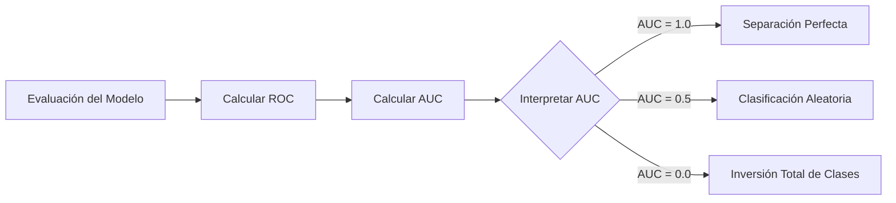

# Curvas ROC y AUC

En el ámbito del Machine Learning, la medición precisa del rendimiento es una tarea indispensable, cobrando especial relevancia cuando nos enfrentamos a problemas de clasificación binaria o multiclase.

Si bien existen métricas tradicionales muy comunes, tales como la exactitud (accuracy), la precisión, la sensibilidad, la especificidad y el puntaje F1, todas ellas presentan ciertas limitaciones operativas; su objetivo siempre es auditar y verificar el comportamiento de los clasificadores desde distintos ángulos.

## Conceptos de ROC y AUC

El término **ROC** proviene de las siglas en inglés para "Características Operativas del Receptor" (Receiver Operating Characteristic), un concepto heredado de la teoría de detección de señales de radar. Por otro lado, **AUC** significa sencillamente "Área Bajo la Curva" (Area Under the Curve).

La curva ROC es una representación gráfica invaluable que nos indica qué tan hábil es el modelo para distinguir y separar dos clases diferentes.
Los modelos de clasificación de alto rendimiento logran distinguir con precisión meridiana entre ambas clases (por ejemplo, detectar enfermos vs sanos), mientras que un modelo pobre o defectuoso mostrará serias dificultades y solapará ambas poblaciones.

![[Pasted image 20240617191423.png]]
![[Pasted image 20240617191702.png]]

El **AUC** es el valor numérico integral del área encerrada bajo la curva ROC trazada. Este puntaje único nos proporciona una idea global, clara y estandarizada sobre qué tan bien funciona el modelo a través de todos los umbrales posibles.

- **Cuando AUC = 1.0:** Las curvas de distribución de probabilidades de ambas clases no se superponen en lo absoluto. El modelo ha alcanzado una medida ideal y utópica de separación, logrando distinguir a la perfección entre los ejemplos de la clase positiva y los de la clase negativa.
- **Cuando AUC = 0.7:** Las distribuciones estadísticas de ambas clases se superponen ligeramente, lo cual introduce un grado inevitable de errores (Falsos Positivos o Falsos Negativos). Un AUC de 0.7 indica matemáticamente que existe un 70% de probabilidad de que el modelo asigne a un ejemplo positivo elegido aleatoriamente un puntaje de predicción superior que a un ejemplo negativo aleatorio.
- **Cuando AUC es 0.5 (El Peor Escenario Práctico):** En este umbral, la curva es una línea completamente en diagonal. El modelo carece de cualquier capacidad de discriminación real; su rendimiento equivale estadísticamente a adivinar lanzando una moneda al azar.
- **Cuando AUC es 0.0:** Este extraño escenario significa que el modelo está invirtiendo las predicciones por completo; es decir, predice consistentemente que todos los ejemplos negativos son positivos, y viceversa.

> [!info] Explicación Técnica de la Gráfica
> La **Curva ROC** se construye gráficamente trazando en el eje Y la **Tasa de Verdaderos Positivos** (Sensibilidad o *Recall*) contra la **Tasa de Falsos Positivos** (calculada como 1 menos la Especificidad) en el eje X, evaluando el desempeño del modelo a través de múltiples y diversos valores de umbral de clasificación.
> - Su principal ventaja radica en que es una métrica absolutamente independiente de la proporción original de las clases en el dataset, volviéndola extremadamente robusta y confiable al trabajar con datasets muy desbalanceados.
> - El indicador **AUC** logra resumir la complejidad de toda la curva geométrica en un solo y elegante número situado entre 0 y 1.

## Notas relacionadas
- [[metricas para clasificadores]]
- [[metodo hold out]]
- [[tipos de machine learning]]
