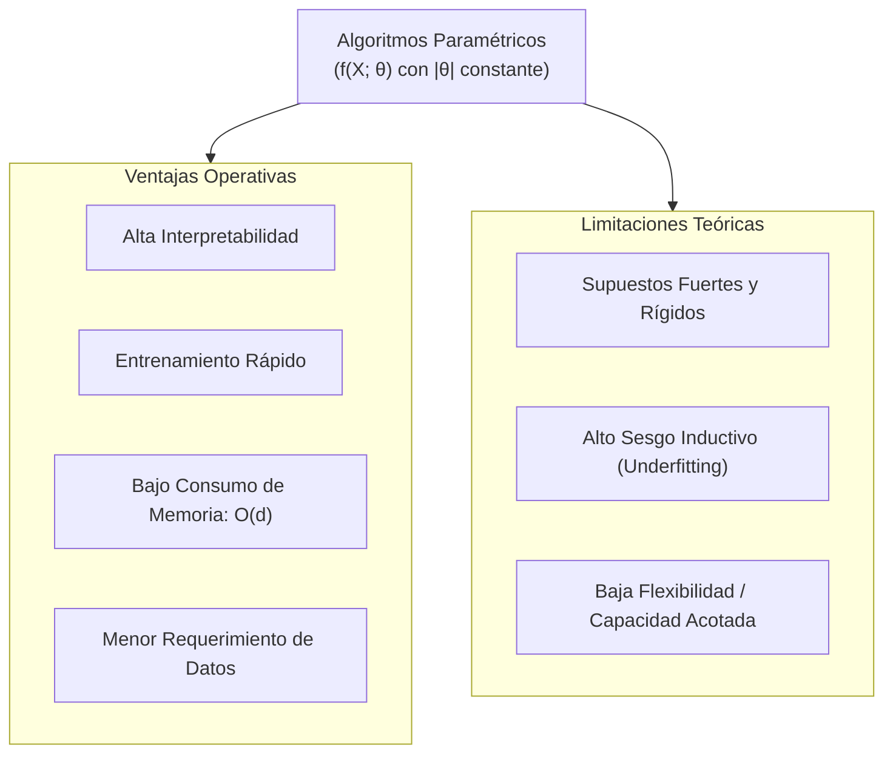
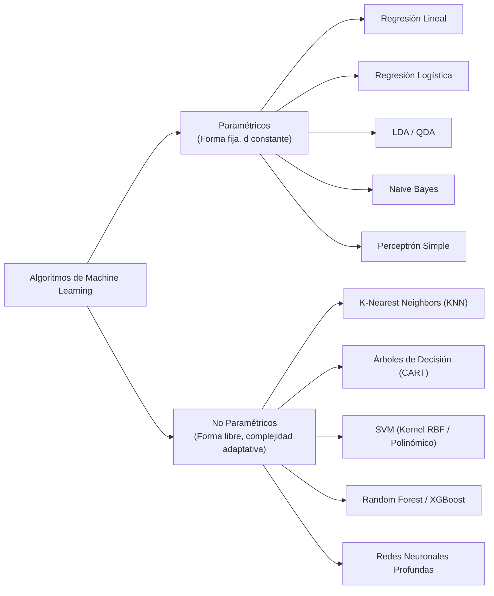

# Algoritmos Paramétricos y No Paramétricos en Machine Learning

En el aprendizaje automático, la distinción fundamental entre **algoritmos paramétricos** y **no paramétricos** radica en la naturaleza de los supuestos impuestos sobre la función objetivo subyacente $f(X)$ y en cómo la complejidad del modelo escala respecto al tamaño del conjunto de entrenamiento $N$.

---

## 1. Fundamento Teórico y Definición Formal

Sea un conjunto de datos de entrenamiento $\mathcal{D} = \{(x_i, y_i)\}_{i=1}^N$, donde $x_i \in \mathbb{R}^p$ y $y_i \in \mathcal{Y}$. El objetivo del aprendizaje es inducir una hipótesis $h \in \mathcal{H}$ que aproxime la verdadera función generadora $f: \mathcal{X} \to \mathcal{Y}$.

```
      PARADIGMA PARAMÉTRICO                       PARADIGMA NO PARAMÉTRICO
┌────────────────────────────────┐           ┌────────────────────────────────┐
│   Forma funcional fija: f(x; θ)│           │ Sin forma funcional prefijada  │
│   Número de parámetros |θ| = d │           │ Capacidad adaptativa:          │
│   Constante respecto a N       │           │ Complejidad crece con N        │
└───────────────┬────────────────┘           └───────────────┬────────────────┘
                │                                            │
                ▼                                            ▼
      θ se estima desde D                          D se utiliza directamente
    D se descarta para inferir                     o define la estructura del modelo
```

### 1.1 Algoritmos Paramétricos

Un algoritmo de aprendizaje se clasifica como **paramétrico** si satisface las siguientes dos condiciones:
1. **Forma Funcional Prefijada:** Asume a priori que la función objetivo $f(X)$ pertenece a una familia matemática específica parametrizada por un vector $\theta \in \Theta \subseteq \mathbb{R}^d$ (ej. combinaciones lineales, polinomios fijos, distribuciones gaussianas).
2. **Dimensión Paramétrica Fija e Independiente de $N$:** El número de parámetros libres $d = |\theta|$ es **finito y constante**, determinado exclusivamente por la dimensionalidad de las características de entrada $p$ y la estructura elegida, independientemente de que $N$ sea $10^2$ o $10^8$.

El proceso de entrenamiento se reduce a un problema de optimización para estimar los parámetros óptimos $\hat{\theta}$ mediante criterios como:
* **Mínimos Cuadrados Ordinarios (OLS):** $\displaystyle \min_\theta \sum_{i=1}^N (y_i - f(x_i; \theta))^2$
* **Estimación de Máxima Verosimilitud (MLE):** $\displaystyle \hat{\theta}_{\text{MLE}} = \arg\max_\theta \sum_{i=1}^N \log P(y_i \mid x_i; \theta)$
* **Máxima Verosimilitud A Posteriori (MAP):** $\displaystyle \hat{\theta}_{\text{MAP}} = \arg\max_\theta \left[ \sum_{i=1}^N \log P(y_i \mid x_i; \theta) + \log P(\theta) \right]$

> [!note] Propiedad de Compresión
> Una vez estimado $\hat{\theta}$, el conjunto de entrenamiento $\mathcal{D}$ **puede descartarse por completo**. Para realizar inferencias sobre nuevas instancias no vistas $x^*$, el modelo únicamente requiere evaluar $f(x^*; \hat{\theta})$, consumiendo memoria $\mathcal{O}(d)$.

### 1.2 Algoritmos No Paramétricos

El término **no paramétrico** no implica la ausencia total de parámetros, sino que **el modelo no asume una forma funcional a priori** rígida y que el número efectivo de parámetros o grados de libertad no está prefijado, pudiendo crecer a medida que se incorporan más datos de entrenamiento ($d \propto N$ o $d \to \infty$).

Estos algoritmos adoptan un enfoque *data-driven* ("libre de distribución"), adaptando la complejidad y geometría de las fronteras de decisión directamente a la topología de los datos observados.

---

## 2. Algoritmos Paramétricos a Fondo



### 2.1 Ventajas Técnicas
* **Simplicidad e Interpretabilidad:** Los coeficientes $\theta_j$ tienen un significado estadístico unívoco (tasas de cambio marginal, elasticidades o razones de momios / *odds ratios*).
* **Eficiencia Computacional:** Los costes temporales de entrenamiento son habitualmente lineales $\mathcal{O}(N)$ o admiten formulaciones analíticas cerradas. La inferencia es instantánea $\mathcal{O}(p)$.
* **Baja Demanda de Datos para Generalizar:** Poseen una baja dimensión VC (*Vapnik-Chervonenkis*), lo que proporciona cotas de generalización estrechas incluso con muestras de tamaño moderado o reducido.
* **Escalabilidad de Almacenamiento:** El artefacto desplegado en producción ocupa un tamaño fijo y despreciable en memoria RAM o disco.

### 2.2 Desventajas y Riesgos
* **Incapacidad ante Fronteras Complejas:** Si el proceso generador de datos real no responde a la forma asumida (ej. no linealidades intrínsecas, interacciones cruzadas de alto orden), el modelo incurre en **alto sesgo** (*bias*), resultando en subajuste (*underfitting*) irrecuperable sin ingeniería manual de atributos.
* **Fragilidad ante Violación de Supuestos:** Supuestos no cumplidos (como multicolinealidad severa, heterocedasticidad o autocorrelación) invalidan las inferencias y desestabilizan las estimaciones.

### 2.3 Modelos Paramétricos Representativos

1. **Regresión Lineal Múltiple:**
   $$f(x; \beta) = \beta_0 + \sum_{j=1}^p \beta_j x_j, \quad |\theta| = p + 1$$
   Asume relación estrictamente lineal entre los predictores y la esperanza condicional de la respuesta.
2. **Regresión Logística:**
   $$P(Y = 1 \mid X = x) = \sigma(\beta^T x) = \frac{1}{1 + e^{-(\beta_0 + \sum_{j=1}^p \beta_j x_j)}}, \quad |\theta| = p + 1$$
   Modela el logaritmo de los momios (*log-odds*) como una función lineal, imponiendo una frontera de decisión hiperplana.
3. **Análisis Discriminante Lineal (LDA):**
   $$P(X \mid Y = k) \sim \mathcal{N}(\mu_k, \Sigma)$$
   Asume normalidad multivariada para cada clase con una **matriz de covarianza compartida** $\Sigma$, produciendo superficies de separación lineales con $|\theta| = K \cdot p + \frac{p(p+1)}{2}$.
4. **Naive Bayes Gaussiano:**
   $$P(X_1, \dots, X_p \mid Y = k) = \prod_{j=1}^p P(X_j \mid Y = k), \quad X_j \mid Y=k \sim \mathcal{N}(\mu_{jk}, \sigma_{jk}^2)$$
   Asume independencia condicional entre todas las características dada la clase objetivo.
5. **Perceptrón Simple:**
   $$f(x) = \text{sign}(w^T x + b), \quad |\theta| = p + 1$$
   Separador lineal fundamental de clasificación binaria optimizado por la regla de Hebb/Rosenblatt.

---

## 3. Algoritmos No Paramétricos a Fondo

Los algoritmos no paramétricos no condensan el conocimiento en un vector rígido de tamaño constante, sino que memorizan instancias o permiten que la estructura del modelo se expanda libremente con la cantidad de datos disponible.

### 3.1 Modelos No Paramétricos Representativos

1. **K-Nearest Neighbors (KNN):**
   * Es un aprendiz perezoso (*lazy learner*): la fase de entrenamiento consiste exclusivamente en almacenar el dataset $\mathcal{D}$.
   * La predicción para un nuevo punto $x^*$ calcula la distancia euclidiana hacia los $N$ puntos de entrenamiento, con un coste de inferencia de $\mathcal{O}(N \cdot p)$ y complejidad espacial $\mathcal{O}(N \cdot p)$.
2. **Árboles de Decisión (CART / C4.5):**
   * El número de divisiones ortogonales (*splits*) y nodos hoja no está prefijado; un árbol sin podar puede crecer hasta aislar cada observación individual ($M \le N$).
3. **Máquinas de Vectores de Soporte con Kernel RBF (SVM-RBF):**
   * Mediante la función de base radial $K(x, x') = \exp(-\gamma \|x - x'\|^2)$, mapea implícitamente los datos a un espacio de Hilbert de **dimensión infinita**.
   * La hipótesis final es $f(x) = \sum_{i \in \text{SV}} \alpha_i y_i K(x_i, x) + b$, donde el número de vectores de soporte (SV) escala con $N$.
4. **Random Forest y Gradient Boosted Trees:**
   * Ensambles de cientos de árboles de decisión adaptativos. Aunque cada árbol se regularice, la capacidad global del ensamble se adapta libremente a superficies no lineales arbitrarias.
5. **Redes Neuronales Profundas (Aproximadores Universales):**
   * Si bien formalmente poseen un número finito de pesos fijados por su arquitectura, en la práctica moderna operan en regímenes sobreparametrizados ($d \gg N$), comportándose conceptualmente como modelos de capacidad cuasi-infinita capaces de memorizar cualquier función continua (Teorema de Aproximación Universal de Hornik).

---

## 4. Tabla Comparativa Exhaustiva

| Dimensión de Análisis | Algoritmos Paramétricos | Algoritmos No Paramétricos |
| :--- | :--- | :--- |
| **Forma Funcional $f(X)$** | Prefijada rígidamente antes de ver los datos. | Libre; determinada directamente por la distribución de los datos. |
| **Parámetros libres ($d$)** | Finito y fijo ($d = \text{constante}$). | Crece con el tamaño muestral ($d = f(N)$ o $d \to \infty$). |
| **Supuestos Previos** | Fuertes (linealidad, normalidad, independencia). | Mínimos (habitualmente solo suavidad local o continuidad). |
| **Complejidad Entrenamiento** | Comúnmente rápida: $\mathcal{O}(N)$ o analítica cerrada. | Generalmente lenta: $\mathcal{O}(N^2)$ a $\mathcal{O}(N^3)$ (ej. SVM, ensambles). |
| **Complejidad Inferencia** | Inmediata: $\mathcal{O}(p)$ independiente de $N$. | Elevada: puede depender de $N$ (ej. KNN es $\mathcal{O}(Np)$). |
| **Almacenamiento del Modelo** | Despreciable: solo guarda $\hat{\theta} \in \mathbb{R}^d$. | Alto: requiere retener instancias de datos o estructuras extensas. |
| **Dilema Sesgo-Varianza** | **Alto Sesgo** (riesgo de *underfitting*), **Baja Varianza**. | **Bajo Sesgo**, **Alta Varianza** (riesgo severo de *overfitting*). |
| **Requerimiento de Datos** | Efectivos con datasets pequeños a medianos. | Exigen grandes volúmenes de datos para converger adecuadamente. |
| **Interpretabilidad** | Alta y directa (coeficientes explicables). | Baja a nula ("caja negra", requiere SHAP / LIME). |

---

## 5. Taxonomía Estructurada



---

## Notas relacionadas
- [[machine learning]]
- [[algoritmos parametricos y no parametricos]]
- [[modelos de regresion]]
- [[bias y viarianza]]
- [[Ajuste de modelos]]
- [[test harness]]
- [[metodo hold out]]
