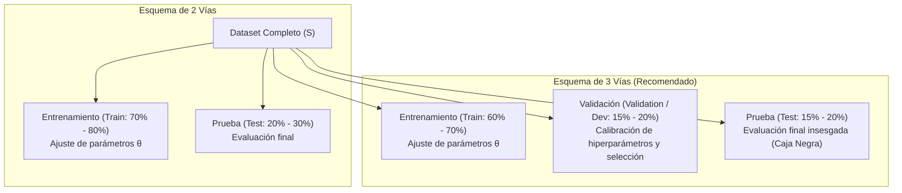
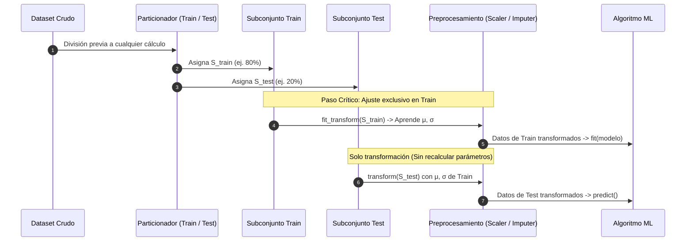

# Método Hold-Out (Validación por Retención)

El **método Hold-Out** (validación por retención o partición de datos) es la técnica fundamental de validación de modelos en Machine Learning. Consiste en dividir el conjunto de datos disponible $\mathcal{S}$ en subconjuntos mutuamente disjuntos, garantizando que el modelo sea evaluado sobre observaciones que no intervinieron en el ajuste de sus parámetros.

Su fundamento teórico reside en la necesidad de obtener un estimador insesgado del **error de generalización**:
$$R_{\text{gen}}(h) = \mathbb{E}_{(x, y) \sim \mathcal{D}} [L(h(x), y)]$$

Dado que el error de entrenamiento (o empírico) $R_{\text{emp}}(h) = \frac{1}{N} \sum_{i=1}^N L(h(x_i), y_i)$ presenta un sesgo marcadamente optimista debido al sobreajuste (*overfitting*), el método Hold-Out simula la llegada de datos futuros en un entorno experimental controlado.

---

## 1. Esquemas de Partición

### 1.1 Esquema de Partición de 2 Vías (Train / Test)

El conjunto de datos original se divide en dos subconjuntos disjuntos:
$$\mathcal{S} = \mathcal{S}_{\text{train}} \cup \mathcal{S}_{\text{test}}, \quad \mathcal{S}_{\text{train}} \cap \mathcal{S}_{\text{test}} = \emptyset$$

* **Entrenamiento ($\mathcal{S}_{\text{train}}$, comúnmente 70% u 80%):** Utilizado por el algoritmo para optimizar la función de pérdida y calcular los parámetros del modelo (pesos $\beta$, árboles, etc.).
* **Prueba ($\mathcal{S}_{\text{test}}$, comúnmente 20% o 30%):** Utilizado exclusivamente para medir el rendimiento final del modelo entrenado.

> [!danger] La Trampa de la Partición de 2 Vías (*Data Snooping*)
> Si un ingeniero utiliza repetidamente el conjunto de prueba para afinar hiperparámetros (ej. profundidad máxima de un árbol, regularización $\lambda$ o número de neuronas), el conjunto de test **queda comprometido**. La información de test se filtra indirectamente a las decisiones de diseño del modelo a través del investigador, induciendo un sesgo optimista que destruye la validez del estimador final.

### 1.2 Esquema de Partición de 3 Vías (Train / Validation / Test)

Para seleccionar modelos y calibrar hiperparámetros con rigor científico sin invalidar la prueba final, se emplea una partición tripartita:
$$\mathcal{S} = \mathcal{S}_{\text{train}} \cup \mathcal{S}_{\text{val}} \cup \mathcal{S}_{\text{test}}$$

1. **Conjunto de Entrenamiento (*Training Set*, ~60% - 70%):**
   * Ajusta los parámetros internos del modelo ($\theta$).
2. **Conjunto de Validación o Desarrollo (*Validation / Dev Set*, ~15% - 20%):**
   * Ajusta y optimiza los **hiperparámetros** (ej. *Grid Search*, *Random Search*, optimización bayesiana).
   * Compara y selecciona entre distintas familias de modelos (ej. SVM vs Random Forest).
   * Controla el criterio de parada temprana (*early stopping*) en redes neuronales.
3. **Conjunto de Prueba (*Test Set*, ~15% - 20%):**
   * Debe permanecer completamente **aislado como una caja negra** durante todo el ciclo de desarrollo experimental.
   * Se evalúa una única vez al finalizar el proyecto para certificar el rendimiento esperado en producción.

---

## 2. Fenómeno Crítico: Filtración de Datos (*Data Leakage*)

La **filtración de datos** ocurre cuando información del conjunto de validación o prueba contamina el proceso de entrenamiento, produciendo métricas infladas que se desploman al desplegar el sistema en producción.

### 2.1 Formas Comunes de Leakage en Preprocesamiento
1. **Escalado y Normalización Global:** Calcular la media poblacional $\mu$ y la desviación estándar $\sigma$ sobre la totalidad de los datos antes de la partición:
   $$z_i = \frac{x_i - \mu_{\text{global}}}{\sigma_{\text{global}}}$$
   *Error:* $\mu_{\text{global}}$ y $\sigma_{\text{global}}$ contienen información estadística de las observaciones de prueba.
2. **Imputación Global de Valores Faltantes:** Rellenar valores nulos con la media o mediana del dataset completo.
3. **Ingeniería de Características y Selección de Variables:** Realizar análisis de correlación con la etiqueta $Y$ o codificaciones categóricas basadas en la respuesta (*Target Encoding*) sobre la totalidad de los datos.
4. **Fuga Temporal (*Temporal Leakage*):** En datos secuenciales o series de tiempo, utilizar una partición aleatoria uniforme en lugar de una división cronológica (*Time-based Split*), permitiendo que el modelo use información del futuro para predecir el pasado.

> [!important] Regla de Oro Anti-Leakage
> **Dividir primero, transformar después.** Cualquier estimador estadístico ($\mu, \sigma$, modas, frecuencias, vocabularios de NLP) debe aprenderse (`fit`) estrictamente con $\mathcal{S}_{\text{train}}$ y aplicarse (`transform`) sin modificación sobre $\mathcal{S}_{\text{val}}$ y $\mathcal{S}_{\text{test}}$.

---

## 3. División Estratificada (*Stratified Hold-Out*)

En problemas de clasificación donde las clases exhiben una distribución desbalanceada (ej. detección de fraudes donde la clase minoritaria representa el 0.5% del total), un muestreo aleatorio simple puede dejar al conjunto de validación o prueba con un número insuficiente de ejemplos de la clase positiva, o incluso omitirla completamente.

La **Estratificación** garantiza que cada subconjunto preserve de manera idéntica las proporciones marginales de clase del conjunto original:

$$\frac{|\{i \in \mathcal{S}_{\text{train}} : y_i = k\}|}{|\mathcal{S}_{\text{train}}|} \approx \frac{|\{i \in \mathcal{S}_{\text{test}} : y_i = k\}|}{|\mathcal{S}_{\text{test}}|} \approx \frac{|\{i \in \mathcal{S} : y_i = k\}|}{|\mathcal{S}|}, \quad \forall k \in \mathcal{Y}$$

---

## 4. Ventajas y Limitaciones

### 4.1 Ventajas
* **Bajo Coste Computacional:** Requiere entrenar el modelo una única vez ($\mathcal{O}(1)$ ejecuciones), a diferencia de métodos iterativos como K-Fold que requieren $K$ entrenamientos.
* **Imprescindible en Big Data y Deep Learning:** Cuando entrenar una arquitectura profunda o procesar cientos de gigabytes toma días o semanas en clústeres de GPUs, la validación cruzada resulta computacionalmente prohibitiva, haciendo del Hold-Out la única opción viable.

### 4.2 Desventajas y Limitaciones
* **Alta Varianza en la Estimación del Rendimiento:** El resultado de la métrica es altamente sensible a la semilla aleatoria (`random_state`). Una partición desafortunada que concentre casos atípicos o difíciles en el test subestimará el verdadero rendimiento del modelo, y viceversa.
* **Inadecuado para Datasets Reducidos:** Reservar un 20% a 30% de datos en muestras pequeñas (ej. $N < 1000$) priva al algoritmo de información crítica para el aprendizaje y reduce el poder estadístico de la evaluación en test.

---

## 5. Hold-Out vs K-Fold Cross-Validation

| Criterio | Hold-Out (Validación por Retención) | K-Fold Cross-Validation |
| :--- | :--- | :--- |
| **Número de entrenamientos** | 1 único entrenamiento. | $K$ entrenamientos (típicamente $K = 5$ o $10$). |
| **Coste Computacional** | Muy bajo ($\mathcal{O}(1)$). | Alto ($\mathcal{O}(K)$). |
| **Varianza del estimador del error** | **Alta**: Depende fuertemente de la partición aleatoria elegida. | **Baja**: Promedia los resultados a lo largo de los $K$ folds. |
| **Aprovechamiento de los datos** | Pobre: Se desperdicia entre el 20% y el 40% de los datos para entrenamiento. | Óptimo: Cada observación es evaluada en test exactamente una vez y entrena en $K-1$ folds. |
| **Escenario Ideal de Uso** | Grandes volúmenes de datos ($N > 100{,}000$), Deep Learning, redes complejas. | Datasets pequeños a medianos ($N < 100{,}000$), evaluación rigurosa de algoritmos clásicos. |

---

## Notas relacionadas
- [[resampling methods]]
- [[Validacion Cruzada]]
- [[test harness]]
- [[Ajuste de modelos]]
- [[metricas para clasificadores]]
- [[bias y viarianza]]
- [[machine learning  algoritmos parametricos]]
- [[modelos de regresion]]
