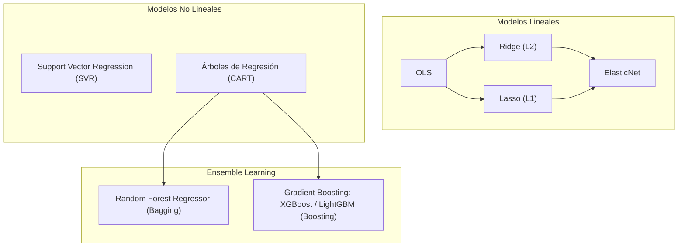

# Modelos de Regresión en Machine Learning

Un **modelo de regresión** es un enfoque de aprendizaje supervisado cuyo objetivo es estimar la relación funcional subyacente entre un vector de variables predictoras o independientes $X = (X_1, X_2, \dots, X_p)^T \in \mathbb{R}^p$ y una variable continua de respuesta o dependiente $Y \in \mathbb{R}$.

Desde la perspectiva de la teoría estadística del aprendizaje, el problema consiste en inferir la función de regresión poblacional:
$$f(X) = \mathbb{E}[Y \mid X]$$

El proceso generador de datos se modela comúnmente como:
$$Y = f(X) + \epsilon$$

donde $\epsilon$ representa el error estocástico irreducible que satisface $\mathbb{E}[\epsilon \mid X] = 0$ y $\text{Var}(\epsilon \mid X) = \sigma^2$.

Dada una estimación $\hat{f}(X)$, el error cuadrático esperado de predicción en un punto $X = x$ se descompone formalmente en:
$$\mathbb{E}[(Y - \hat{f}(x))^2] = \underbrace{\left(f(x) - \mathbb{E}[\hat{f}(x)]\right)^2}_{\text{Sesgo}^2(\hat{f}(x))} + \underbrace{\text{Var}(\hat{f}(x))}_{\text{Varianza}} + \underbrace{\sigma^2}_{\text{Error Irreducible}}$$

---

## 1. Regresión Lineal Simple y Múltiple

### 1.1 Formulación Matemática

En la **Regresión Lineal**, se asume que la función de regresión $f(X)$ es una combinación lineal de los parámetros:

$$y = \beta_0 + \sum_{j=1}^p \beta_j x_j + \epsilon, \quad \epsilon \sim \mathcal{N}(0, \sigma^2)$$

En notación matricial para un conjunto de $n$ observaciones con $p$ características:
$$Y = X\beta + \epsilon$$

Donde:
* $Y \in \mathbb{R}^{n \times 1}$ es el vector de respuestas.
* $X \in \mathbb{R}^{n \times (p+1)}$ es la matriz de diseño (con una primera columna de $1$s para el intercepto $\beta_0$).
* $\beta = (\beta_0, \beta_1, \dots, \beta_p)^T \in \mathbb{R}^{(p+1) \times 1}$ es el vector de coeficientes desconocidos.
* $\epsilon \in \mathbb{R}^{n \times 1}$ es el vector de perturbaciones aleatorias.

### 1.2 Función de Coste: RSS y MSE

El ajuste del modelo busca minimizar las discrepancias entre los valores observados $y_i$ y los predichos $\hat{y}_i = x_i^T \beta$. La **Suma de Cuadrados de los Residuos** (RSS - *Residual Sum of Squares*) se formula como:

$$\text{RSS}(\beta) = \sum_{i=1}^n (y_i - x_i^T \beta)^2 = \|Y - X\beta\|_2^2 = (Y - X\beta)^T (Y - X\beta)$$

El **Error Cuadrático Medio** (MSE - *Mean Squared Error*) es la versión promediada de la función de coste:
$$J(\beta) = \text{MSE}(\beta) = \frac{1}{n} \text{RSS}(\beta) = \frac{1}{n} (Y - X\beta)^T (Y - X\beta)$$

### 1.3 Solución Analítica: Ecuación Normal OLS

Para hallar el estimador de Mínimos Cuadrados Ordinarios (OLS - *Ordinary Least Squares*) $\hat{\beta}$, calculamos el gradiente de $\text{RSS}(\beta)$ con respecto a $\beta$ e igualamos a cero:

$$\nabla_{\beta} \text{RSS}(\beta) = \frac{\partial}{\partial \beta} \left( Y^T Y - 2\beta^T X^T Y + \beta^T X^T X \beta \right) = -2 X^T Y + 2 X^T X \beta = 0$$

$$X^T X \beta = X^T Y$$

Si la matriz de Gram $(X^T X)$ es de rango completo (no singular), existe su inversa y obtenemos la **Ecuación Normal**:
$$\hat{\beta}_{\text{OLS}} = (X^T X)^{-1} X^T Y$$

> [!note] Complejidad Computacional de OLS
> El cálculo de $(X^T X)^{-1}$ requiere una complejidad temporal de $\mathcal{O}(p^3 + np^2)$. Cuando el número de características $p$ supera varios millares o cuando $n < p$, la inversión matricial se vuelve computacionalmente inviable o mal condicionada, exigiendo métodos iterativos o regularización.

### 1.4 Solución Iterativa: Algoritmos de Descenso de Gradiente

Para datasets a gran escala, la optimización de $J(\beta)$ se realiza mediante variantes de **Descenso de Gradiente**, cuya regla de actualización es:
$$\beta^{(t+1)} = \beta^{(t)} - \alpha \nabla_{\beta} J(\beta^{(t)})$$

donde $\alpha > 0$ es la tasa de aprendizaje (*learning rate*).

* **Batch Gradient Descent (BGD):** Utiliza la totalidad de los $n$ registros para calcular el gradiente en cada época:
  $$\nabla_{\beta} J(\beta) = -\frac{2}{n} X^T (Y - X\beta)$$
  Garantiza convergencia al mínimo global (problema convexo), pero es ineficiente en memoria para datos masivos.
* **Stochastic Gradient Descent (SGD):** Actualiza los pesos evaluando un único ejemplo aleatorio $i$ en cada paso:
  $$\nabla_{\beta} J_i(\beta) = -2 x_i (y_i - x_i^T \beta)$$
  Es veloz y permite escapar de mínimos locales en problemas no convexos, pero presenta alta fluctuación estocástica.
* **Mini-batch Gradient Descent:** Compromiso óptimo donde se evalúa un subconjunto de tamaño $b$ (comúnmente $b \in \{32, 64, 128, 256\}$). Aprovecha la paralelización en arquitecturas vectoriales (GPU/SIMD) y estabiliza la varianza del gradiente.

---

## 2. Supuestos de Gauss-Markov y Diagnósticos

Bajo el marco del **Teorema de Gauss-Markov**, el estimador OLS $\hat{\beta}$ es el **BLUE** (*Best Linear Unbiased Estimator*, el estimador lineal insesgado de varianza mínima) si se satisfacen los siguientes supuestos:

1. **Linealidad en los Parámetros:** El modelo es lineal respecto a $\beta$: $Y = X\beta + \epsilon$.
2. **Exogeneidad Estricta:** La esperanza condicional de los errores dado $X$ es nula:
   $$\mathbb{E}[\epsilon \mid X] = 0$$
   Garantiza que los estimadores sean insesgados: $\mathbb{E}[\hat{\beta}] = \beta$.
3. **Homocedasticidad:** La varianza de las perturbaciones condicional a $X$ es finita y constante para todas las observaciones:
   $$\text{Var}(\epsilon_i \mid X) = \sigma^2 \quad \forall i \in \{1, \dots, n\}$$
   *Violación (Heterocedasticidad):* Se detecta mediante la prueba de White o Breusch-Pagan, o con gráficos de residuos vs valores ajustados. Invalida los errores estándar convencionales.
4. **No Autocorrelación (Independencia de Errores):** Las perturbaciones de distintas observaciones no están correlacionadas:
   $$\text{Cov}(\epsilon_i, \epsilon_j \mid X) = 0 \quad \forall i \neq j$$
   *Diagnóstico:* Test de Durbin-Watson (frecuente en series de tiempo).
5. **Rango Completo (Ausencia de Multicolinealidad Perfecta):** La matriz $X$ tiene rango de columnas completo $\text{rango}(X) = p + 1 \leq n$. Las columnas de $X$ deben ser linealmente independientes; de lo contrario, $X^T X$ es singular y no invertible.
   *Diagnóstico de Multicolinealidad Imperfecta:* Se evalúa mediante el **Factor de Inflación de la Varianza (VIF)** para cada variable $x_j$:
   $$\text{VIF}_j = \frac{1}{1 - R_j^2}$$
   donde $R_j^2$ es el coeficiente de determinación obtenido al regresar $x_j$ sobre las restantes $p-1$ características.
   * Criterio: Un $\text{VIF}_j > 5$ a $10$ señala multicolinealidad severa, inflando la varianza del estimador: $\text{Var}(\hat{\beta}_j) = \sigma^2 (X^T X)_{jj}^{-1} = \frac{\sigma^2}{(n-1) s_j^2} \text{VIF}_j$.
6. **Normalidad de los Residuos (Supuesto para Inferencia):**
   $$\epsilon \mid X \sim \mathcal{N}(0, \sigma^2 I_n)$$
   No es indispensable para la propiedad BLUE, pero es mandatorio para pruebas de hipótesis ($t$-test individual sobre $\beta_j$, $F$-test conjunto de significancia global) y construcción de intervalos de confianza.

---

## 3. Métricas de Evaluación para Regresión

Sea $y_i$ el valor real, $\hat{y}_i$ el valor predicho por el modelo, $\bar{y} = \frac{1}{n}\sum_{i=1}^n y_i$ la media muestral, y $n$ el número de instancias:

| Métrica | Expresión Matemática | Características y Sensibilidad |
| :--- | :--- | :--- |
| **MAE** (*Mean Absolute Error*) | $\displaystyle \frac{1}{n} \sum_{i=1}^n \|y_i - \hat{y}_i\|$ | Interpretable en las mismas unidades de $Y$. Menos sensible a valores atípicos (*outliers*). Su gradiente no es continuo en cero. |
| **MSE** (*Mean Squared Error*) | $\displaystyle \frac{1}{n} \sum_{i=1}^n (y_i - \hat{y}_i)^2$ | Función diferenciable en todo punto. Penaliza cuadráticamente las desviaciones grandes; muy sensible a *outliers*. |
| **RMSE** (*Root Mean Squared Error*) | $\displaystyle \sqrt{\frac{1}{n} \sum_{i=1}^n (y_i - \hat{y}_i)^2}$ | Conserva la escala original de la variable objetivo y mantiene una mayor penalización a errores de magnitud alta. |
| **MAPE** (*Mean Absolute Percentage Error*) | $\displaystyle \frac{100\%}{n} \sum_{i=1}^n \left\| \frac{y_i - \hat{y}_i}{y_i} \right\|$ | Medida relativa adimensional expresada en porcentaje. Presenta inestabilidad o indeterminación cuando $y_i \to 0$. |
| **$R^2$** (*Coeficiente de Determinación*) | $\displaystyle 1 - \frac{\text{SS}_{\text{res}}}{\text{SS}_{\text{tot}}} = 1 - \frac{\sum (y_i - \hat{y}_i)^2}{\sum (y_i - \bar{y})^2}$ | Proporción de la varianza total de $Y$ explicada por el modelo. $R^2 \in (-\infty, 1]$. Tiende a incrementarse monótonamente al añadir predictores arbitrarios. |
| **$R^2$ Ajustado** (*Adjusted $R^2$*) | $\displaystyle 1 - \left[ \frac{(1 - R^2)(n - 1)}{n - p - 1} \right]$ | Corrige el $R^2$ penalizando la inclusión de predictores redundantes $p$ que no aporten información estadísticamente significativa. |

---

## 4. Regresión Polinómica y el Dilema Sesgo-Varianza

La **Regresión Polinómica** modela relaciones no lineales proyectando el espacio original de características a un espacio vectorial de dimensión superior mediante términos polinómicos (ej. $x, x^2, x^3, \dots, x^d$), preservando la linealidad en los parámetros:

$$y = \beta_0 + \beta_1 x + \beta_2 x^2 + \dots + \beta_d x^d + \epsilon$$

```
Alto Sesgo (Underfitting)           Balance Óptimo             Alta Varianza (Overfitting)
      (Grado d = 1)                 (Grado d = 2 o 3)                 (Grado d = 15)
     y ^    . .                   y ^    . .                    y ^   /\  . .
       |   . /                      |   . / \                     |  /  \ / \
       |  . /                       |  . /   \                    | /    v   \
       | . /                        | . /     \                   |/          \
       +---------> x                +----------> x                +-------------> x
  Incapacidad de capturar        Generaliza adecuadamente      Memoriza el ruido y oscila
   la curvatura real              la estructura latente        abruptamente entre puntos
```

> [!important] Trade-off Sesgo-Varianza
> * **Bajo grado $d$ (Alto Sesgo / Underfitting):** El modelo impone supuestos excesivamente restrictivos; la capacidad es insuficiente para capturar la función subyacente.
> * **Alto grado $d$ (Alta Varianza / Overfitting):** El modelo cuenta con demasiados grados de libertad, ajustándose al ruido aleatorio muestral. Los coeficientes $|\beta_j|$ explotan en magnitud.

---

## 5. Regularización en Modelos Lineales

Para controlar la varianza del modelo, prevenir el sobreajuste y solucionar el mal condicionamiento cuando existen variables altamente correlacionadas o cuando $p > n$, se introducen penalizaciones sobre la norma del vector de pesos $\beta$ (excluyendo el intercepto $\beta_0$).

```mermaid
flowchart LR
    A["Función de Coste OLS: RSS(β)"] --> B{"Técnica de Regularización"}
    B -->|Penalización L2: ||β||₂²| C["Regresión Ridge<br>(Shrinkage suave, no anula coeficientes)"]
    B -->|Penalización L1: ||β||₁| D["Regresión Lasso<br>(Sparsity, selección de variables)"]
    B -->|L1 + L2 combinado| E["ElasticNet<br>(Balance y manejo de grupos correlacionados)"]
```

### 5.1 Regresión Ridge (Penalización $L_2$ / Regularización de Tikhonov)

Añade a la función de coste la norma $\ell_2$ al cuadrado de los coeficientes:

$$J_{\text{Ridge}}(\beta) = \text{RSS}(\beta) + \lambda \|\beta\|_2^2 = (Y - X\beta)^T (Y - X\beta) + \lambda \sum_{j=1}^p \beta_j^2$$

donde $\lambda \ge 0$ es el hiperparámetro de regularización.

**Solución Analítica:**
$$\nabla_{\beta} J_{\text{Ridge}}(\beta) = -2 X^T Y + 2 X^T X \beta + 2 \lambda \beta = 0$$
$$\hat{\beta}_{\text{Ridge}} = (X^T X + \lambda I_{p+1})^{-1} X^T Y$$

> [!tip] Estabilidad Numérica de Ridge
> Al sumar $\lambda I$ a la diagonal principal de $(X^T X)$, la matriz resultante es estrictamente definida positiva y siempre invertible, incluso si $X^T X$ es singular o $p > n$. Ridge contrae (*shrinks*) suavemente los coeficientes hacia cero, pero **nunca los anula exactamente**.

### 5.2 Regresión Lasso (Penalización $L_1$)

Introduce la norma $\ell_1$ de los coeficientes:

$$J_{\text{Lasso}}(\beta) = \text{RSS}(\beta) + \lambda \|\beta\|_1 = (Y - X\beta)^T (Y - X\beta) + \lambda \sum_{j=1}^p |\beta_j|$$

* **Geometría de la solución:** La bola unitaria $\ell_1$ es un politopo rómbico con vértices agudos situados en los ejes coordenados. Al colisionar las elipses de nivel del RSS con el espacio de restricción $\ell_1$, la tangencia se produce preferentemente en los vértices, fijando coeficientes **exactamente en cero**.
* **Propiedad de Dispersión (*Sparsity*):** Lasso actúa simultáneamente como método de contracción y técnica intrínseca de **selección de variables**.
* Al no ser diferenciable en $\beta_j = 0$, no admite solución matricial cerrada; se optimiza mediante **Descenso por Coordenadas** (*Coordinate Descent*) o algoritmos de punto proximal.

### 5.3 ElasticNet

Combina linealmente las penalizaciones $\ell_1$ y $\ell_2$:

$$J_{\text{Elastic}}(\beta) = \text{RSS}(\beta) + \lambda \left( \alpha \|\beta\|_1 + \frac{1 - \alpha}{2} \|\beta\|_2^2 \right)$$

donde $\alpha \in [0, 1]$ es el parámetro de mezcla (*l1_ratio*). Supera la limitación de Lasso ante predictores fuertemente correlacionados (donde Lasso selecciona arbitrariamente uno de ellos), induciendo el efecto de agrupamiento (*grouping effect*).

---

## 6. Modelos de Regresión No Lineales y Basados en Ensambles

Cuando las relaciones funcionales entre $X$ e $Y$ son complejas, discontinuas o altamente no lineales, se emplean modelos avanzados:



### 6.1 Support Vector Regression (SVR)

Adapta las máquinas de vectores de soporte a regresión utilizando la función de **pérdida $\epsilon$-insensible de Vapnik**:

$$L_\epsilon(y, \hat{y}) = \max(0, |y - \hat{y}| - \epsilon)$$

* Define un "tubo" de tolerancia de ancho $2\epsilon$ alrededor de la predicción. Los errores que caen dentro del tubo no son penalizados.
* Para acomodar desviaciones mayores al margen, se introducen variables de holgura $\xi_i, \xi_i^* \ge 0$ reguladas por un hiperparámetro de penalización $C$:
  $$\min_{\beta, b, \xi, \xi^*} \frac{1}{2} \|\beta\|^2 + C \sum_{i=1}^n (\xi_i + \xi_i^*)$$
* Mediante el **truco del kernel** (ej. RBF gaussiano: $K(x, x') = \exp(-\gamma \|x - x'\|^2)$), proyecta los datos a un espacio de Hilbert de dimensión infinita sin computar explícitamente las coordenadas transformadas.

### 6.2 Árboles de Regresión (CART)

Dividen el espacio de características $\mathbb{R}^p$ en $M$ regiones disjuntas ortogonales $R_1, R_2, \dots, R_M$. En cada región, la predicción es la media aritmética de las instancias de entrenamiento contenidas:

$$\hat{y}_{R_m} = \frac{1}{N_m} \sum_{i \in R_m} y_i$$

El corte óptimo en cada nodo divide la variable $j$ en el umbral $s$, minimizando la suma de errores cuadráticos:
$$\min_{j, s} \left[ \sum_{i: x_{ij} \le s} (y_i - \hat{y}_{R_1})^2 + \sum_{i: x_{ij} > s} (y_i - \hat{y}_{R_2})^2 \right]$$

### 6.3 Random Forest Regressor

Algoritmo de **Bagging** (*Bootstrap Aggregating*) que construye un ensamble de $B$ árboles de regresión descorrelacionados:
1. Extrae $B$ muestras con reemplazo del conjunto de entrenamiento original.
2. Entrena un árbol en cada subconjunto, restringiendo la selección de variables en cada split a un subconjunto aleatorio $m \approx p/3$.
3. La predicción final es el promedio no ponderado:
   $$\hat{f}_{\text{RF}}(x) = \frac{1}{B} \sum_{b=1}^B \hat{f}_b(x)$$
* Reduce drásticamente la varianza del modelo individual sin incrementar el sesgo.

### 6.4 Gradient Boosting (GBM, XGBoost, LightGBM)

Algoritmo secuencial de **Boosting** que ajusta nuevos árboles base sobre los residuos o gradientes negativos de la función de pérdida del ensamble acumulado:

$$F_m(x) = F_{m-1}(x) + \gamma_m h_m(x)$$

donde $h_m(x)$ se entrena para predecir los pseudo-residuos:
$$r_{im} = -\left[ \frac{\partial L(y_i, F(x_i))}{\partial F(x_i)} \right]_{F(x) = F_{m-1}(x)}$$

Implementaciones modernas como **XGBoost** (mediante aproximación de Taylor de segundo orden y regularización de la complejidad del árbol) y **LightGBM** (mediante *Histogram-based split finding* y *Leaf-wise tree growth*) constituyen el estado del arte en datos tabulares.

---

## Notas relacionadas
- [[machine learning]]
- [[algoritmos parametricos y no parametricos]]
- [[machine learning  algoritmos parametricos]]
- [[metodo hold out]]
- [[test harness]]
- [[bias y viarianza]]
- [[Ajuste de modelos]]
- [[metricas para clasificadores]]
