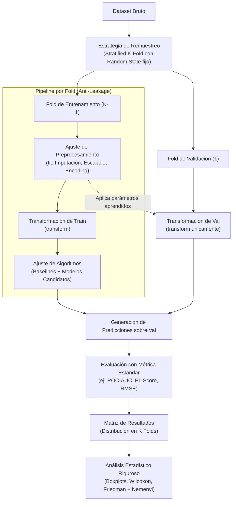

# Test Harness (Arnés de Pruebas) en Machine Learning

Un **Test Harness** (arnés de pruebas) en Machine Learning es un marco metodológico sistemático, automatizado y reproducible diseñado para evaluar, comparar y seleccionar objetivamente múltiples algoritmos de aprendizaje sobre uno o varios conjuntos de datos bajo condiciones experimentales estrictamente homogéneas.

Inspirado en los bancos de pruebas de ingeniería de software y hardware, su propósito es **aislar el efecto del algoritmo inductor**, garantizando que cualquier diferencia observada en las métricas de rendimiento sea atribuible a la capacidad intrínseca del modelo y no a fluctuaciones aleatorias en las particiones de datos, preprocesamientos sesgados o filtraciones de información.

---

## 1. Componentes Clave de un Test Harness

Para que un arnés de pruebas sea metodológicamente riguroso a nivel de ingeniería, debe estructurarse sobre seis componentes fundamentales:



### 1.1 Definición del Problema y Métrica de Rendimiento Estándar

El arnés requiere fijar a priori una métrica cuantitativa coherente con la función de pérdida del dominio y la distribución de las etiquetas:
* **Clasificación Balanceada:** Exactitud (*Accuracy*), AUC-ROC (*Area Under the Receiver Operating Characteristic*), Log-Loss.
* **Clasificación Desbalanceada:** F1-Score ponderado o macro, Coeficiente de Correlación de Matthews (MCC), Área bajo la curva PR (PR-AUC).
* **Regresión:** RMSE (*Root Mean Squared Error*), MAE (*Mean Absolute Error*), $R^2$ Ajustado.

> [!important] Regla de Consistencia
> La métrica seleccionada debe mantenerse invariable para todos los modelos candidatos. Modificar la métrica durante el análisis invalida la imparcialidad del banco de pruebas.

### 1.2 Estrategia de Remuestreo y Reproducibilidad

El remuestreo mitiga la varianza de estimación del error de generalización. La configuración estándar de la industria y la literatura empírica (Kohavi, 1995) es:
* **Validación Cruzada Estratificada de 10 Folds ($10$-Fold Stratified Cross-Validation):** Divide los datos en 10 bloques disjuntos asegurando que la proporción de clases $P(Y)$ sea idéntica en cada fold.
* **Semilla Aleatoria Fijada (`random_state`):** Garantiza que todos los algoritmos se entrenen y evalúen sobre **exactamente los mismos subconjuntos de datos**, permitiendo pruebas pareadas directas.

### 1.3 Modelos de Referencia (*Baseline Models*)

Un modelo complejo carece de valor en ingeniería si no es capaz de superar heurísticas triviales o modelos lineales simples. El Test Harness debe incluir siempre:
1. **Clasificador Dummy:**
   * `most_frequent`: Predice perpetuamente la clase mayoritaria. Define la cota inferior de exactitud trivial.
   * `stratified`: Genera predicciones respetando la distribución marginal de clases.
2. **Regresor Dummy:**
   * Predicción constante de la media $\bar{y}$ o la mediana de la variable respuesta.
3. **Modelos Lineales Estándar:**
   * Regresión Logística (clasificación) o Regresión Lineal OLS (regresión). Establecen el piso competitivo mínimo que un modelo no lineal o ensamble debe batir para justificar su coste operacional.

### 1.4 Aislamiento del Preprocesamiento y Prevención de Data Leakage

El error metodológico más destructivo en Machine Learning es la **filtración de datos** (*Data Leakage*), que ocurre cuando se calculan parámetros globales (ej. media, desviación estándar, modas para imputación o codificaciones de frecuencia) utilizando la totalidad del dataset antes de la partición.

```
INCORRECTO (Data Leakage Severo):
[ Dataset Completo ] ---> [ StandardScaler.fit_transform() ] ---> [ K-Fold Split ] (Optimismo espurio)

CORRECTO (Encapsulamiento en Pipeline):
[ Dataset Completo ] ---> [ K-Fold Split ]
                                |
                    +-----------+-----------+
                    |                       |
            [ Fold Train ]           [ Fold Test ]
                    |                       |
     StandardScaler.fit_transform()         |
                    |                       |
                    +-- (parámetros μ, σ) -> StandardScaler.transform()
```

* **Solución:** Todo paso de transformación debe encapsularse en un `Pipeline` que se ajuste exclusivamente sobre el subconjunto de entrenamiento de cada fold (`fit_transform`) y únicamente transforme el subconjunto de prueba (`transform`).

### 1.5 Batería Heterogénea de Algoritmos

El arnés debe comparar familias con diferentes sesgos inductivos:
* **Modelos Lineales / Paramétricos:** Regresión Logística, Ridge, LDA.
* **Modelos Basados en Distancias:** K-Nearest Neighbors (KNN).
* **Modelos Probabilísticos:** Gaussian Naive Bayes.
* **Modelos de Margen Máximo:** Support Vector Machines (SVM lineal y RBF).
* **Modelos de Árboles y Ensambles:** Decision Trees (CART), Random Forest, Extra Trees, Gradient Boosting (XGBoost, LightGBM).

### 1.6 Comparación Estadística de Resultados

La mera comparación de promedios ($\mu_{\text{modelo}}$) es insuficiente e informal. Para validar la superioridad de un algoritmo sobre otro, el arnés implementa:

1. **Inspección de Distribuciones (Boxplots):** Visualiza la dispersión, la mediana, los rangos intercuartílicos (IQR) y los valores atípicos a través de los $K$ folds, evaluando la estabilidad del modelo.
2. **Pruebas de Hipótesis Pareadas (Dos Modelos):**
   * *t-test pareado corregido (Nadeau y Bengio):* Corrige la violación de independencia introducida por el solapamiento de datos en el remuestreo.
   * *Wilcoxon Signed-Rank Test:* Prueba no paramétrica para contrastar si la mediana de las diferencias de rendimiento entre dos algoritmos difiere de cero sin asumir normalidad.
3. **Comparación Múltiple (Batería Completa de Modelos):**
   * *Test de Friedman:* Prueba no paramétrica de rangos para contrastar la hipótesis nula de equivalencia entre todos los algoritmos evaluados sobre múltiples folds o datasets.
   * *Post-hoc de Nemenyi:* Determina la Diferencia Crítica (CD - *Critical Difference*). Dos algoritmos difieren de forma estadísticamente significativa ($\alpha = 0.05$) si la distancia entre sus rangos promedio supera el valor crítico:
     $$\text{CD} = q_\alpha \sqrt{\frac{k(k+1)}{6N}}$$
     donde $k$ es el número de modelos, $N$ el número de folds/datasets y $q_\alpha$ el valor tabulado de la distribución de rango estudentizada.

---

## 2. Plantilla Conceptual en Python (`scikit-learn`)

A continuación se presenta una implementación formal y modular de un Test Harness para clasificación:

```python
import numpy as np
import pandas as pd
import matplotlib.pyplot as plt
from sklearn.datasets import load_breast_cancer
from sklearn.model_selection import StratifiedKFold, cross_val_score
from sklearn.pipeline import Pipeline
from sklearn.preprocessing import StandardScaler
from sklearn.impute import SimpleImputer

# Batería de Algoritmos
from sklearn.dummy import DummyClassifier
from sklearn.linear_model import LogisticRegression
from sklearn.discriminant_analysis import LinearDiscriminantAnalysis
from sklearn.neighbors import KNeighborsClassifier
from sklearn.naive_bayes import GaussianNB
from sklearn.svm import SVC
from sklearn.tree import DecisionTreeClassifier
from sklearn.ensemble import RandomForestClassifier, GradientBoostingClassifier

def run_test_harness(X, y, scoring="roc_auc", n_splits=10, random_state=42):
    """
    Ejecuta un Test Harness sistemático garantizando encapsulamiento
    de preprocesamiento y evaluación homogénea.
    """
    # 1. Definición del método de remuestreo estratificado con semilla fija
    cv = StratifiedKFold(n_splits=n_splits, shuffle=True, random_state=random_state)
    
    # 2. Configuración de modelos candidatos y baselines
    models = {
        "Baseline (Dummy)": DummyClassifier(strategy="most_frequent"),
        "Logistic Regression": LogisticRegression(max_iter=1000, random_state=random_state),
        "LDA": LinearDiscriminantAnalysis(),
        "KNN": KNeighborsClassifier(),
        "Gaussian NB": GaussianNB(),
        "Linear SVM": SVC(kernel="linear", probability=True, random_state=random_state),
        "RBF SVM": SVC(kernel="rbf", probability=True, random_state=random_state),
        "Decision Tree": DecisionTreeClassifier(random_state=random_state),
        "Random Forest": RandomForestClassifier(n_estimators=100, random_state=random_state),
        "Gradient Boosting": GradientBoostingClassifier(random_state=random_state)
    }
    
    results = {}
    print(f"=== INICIANDO TEST HARNESS (Métrica: {scoring}, Folds: {n_splits}) ===\n")
    
    for name, model in models.items():
        # 3. Pipeline encapsulado: preprocesamiento acoplado a cada fold
        pipeline = Pipeline([
            ("imputer", SimpleImputer(strategy="median")),
            ("scaler", StandardScaler()),
            ("classifier", model)
        ])
        
        # 4. Evaluación cruzada estricta
        scores = cross_val_score(pipeline, X, y, cv=cv, scoring=scoring, n_jobs=-1)
        results[name] = scores
        print(f"{name:22s} | Media {scoring}: {scores.mean():.4f} (± {scores.std():.4f})")
        
    return results

def plot_test_harness_results(results, scoring="roc_auc"):
    """Genera boxplots ordenados por la mediana de rendimiento."""
    df_results = pd.DataFrame(results)
    sorted_columns = df_results.median().sort_values(ascending=True).index
    df_sorted = df_results[sorted_columns]
    
    plt.figure(figsize=(12, 6))
    df_sorted.boxplot(vert=False, patch_artist=True, boxprops=dict(facecolor="#cde4f7"))
    plt.title(f"Comparación de Algoritmos en Test Harness ({scoring})", fontsize=14, pad=15)
    plt.xlabel(scoring.upper(), fontsize=12)
    plt.grid(True, linestyle="--", alpha=0.7)
    plt.tight_layout()
    plt.show()

# Ejecución conceptual
if __name__ == "__main__":
    data = load_breast_cancer()
    X, y = data.data, data.target
    benchmark_results = run_test_harness(X, y, scoring="roc_auc")
    # plot_test_harness_results(benchmark_results)
```

---

## 3. Guía de Interpretación de Resultados

> [!tip] Criterios de Selección en Ingeniería
> 1. **Principio de Parsimonia (Navaja de Ockham):** Si un modelo complejo (ej. Gradient Boosting) ofrece una ganancia marginal no estadísticamente significativa ($\Delta < 0.5\%$) respecto a un modelo lineal regularizado, se prefiere el modelo lineal por su menor coste de mantenimiento, interpretabilidad y baja latencia de inferencia.
> 2. **Varianza y Dispersión del Fold:** Un modelo con media elevada pero con un boxplot muy disperso denota inestabilidad y alta sensibilidad a perturbaciones de datos. Es preferible un modelo con varianza contenida.
> 3. **Superación del Baseline:** Cualquier arquitectura cuyos intervalos intercuartílicos se solapen con el `DummyClassifier` debe ser descartada de inmediato.

---

## Notas relacionadas
- [[metodo hold out]]
- [[Validacion Cruzada]]
- [[resampling methods]]
- [[machine learning]]
- [[machine learning  algoritmos parametricos]]
- [[modelos de regresion]]
- [[metricas para clasificadores]]
- [[Ajuste de modelos]]
