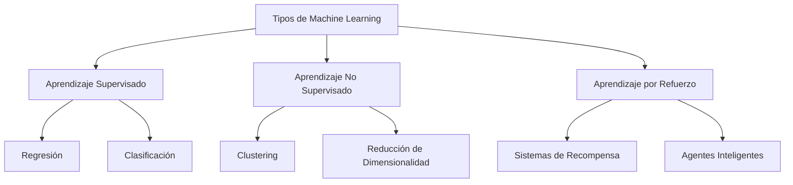

# Tipos de Machine Learning

El campo del **Machine Learning** se divide principalmente en tres grandes categorías, dependiendo de cómo se le presenten los datos al algoritmo y del objetivo final del modelo.

## 1. Aprendizaje Supervisado
Ocurre cuando los datos de entrenamiento contienen etiquetas, es decir, respuestas conocidas para cada ejemplo. El objetivo principal del modelo es aprender la relación entre los datos de entrada y estas etiquetas, con el fin de predecir las respuestas correctas para datos nuevos.

## 2. Aprendizaje No Supervisado
Se da cuando los datos proporcionados no cuentan con etiquetas previas ni respuestas correctas definidas. En este caso, se utilizan técnicas de agrupación (*clustering*) y reducción de dimensionalidad para descubrir patrones ocultos o estructuras intrínsecas dentro del conjunto de datos. Al no existir una verdad absoluta con la cual comparar, los resultados conllevan cierta ambigüedad.

## 3. Aprendizaje por Refuerzo
Es un enfoque frecuentemente utilizado en el desarrollo de videojuegos y robótica. Consiste en un agente inteligente que interactúa con un entorno dinámico, aprendiendo a tomar decisiones óptimas basándose en un sistema de recompensas y penalizaciones para maximizar su beneficio a largo plazo.

> [!info] Explicación Detallada
> - **Aprendizaje Supervisado:** Los algoritmos reciben un conjunto de datos estructurado que incluye la solución deseada (la variable objetivo). El modelo aprende empíricamente a relacionar las características (inputs) con las etiquetas (outputs). *Ejemplos:* Regresión Lineal, Regresión Logística y Árboles de Decisión.
> - **Aprendizaje No Supervisado:** El algoritmo analiza datos sin etiquetar de forma exploratoria. Su propósito es segmentar la información o detectar anomalías basándose únicamente en similitudes matemáticas. *Ejemplos:* Algoritmo K-Means, Análisis de Componentes Principales (PCA).
> - **Aprendizaje por Refuerzo:** Un agente de software descubre a través de prueba y error qué secuencia de acciones produce la mayor recompensa acumulada. *Ejemplos:* Modelos como AlphaGo que aprenden a jugar ajedrez o sistemas de navegación autónoma.

## Notas relacionadas
- [[machine learning]]
- [[algoritmos parametricos y no parametricos]]
- [[Ajuste de modelos]]
- [[metricas para clasificadores]]
