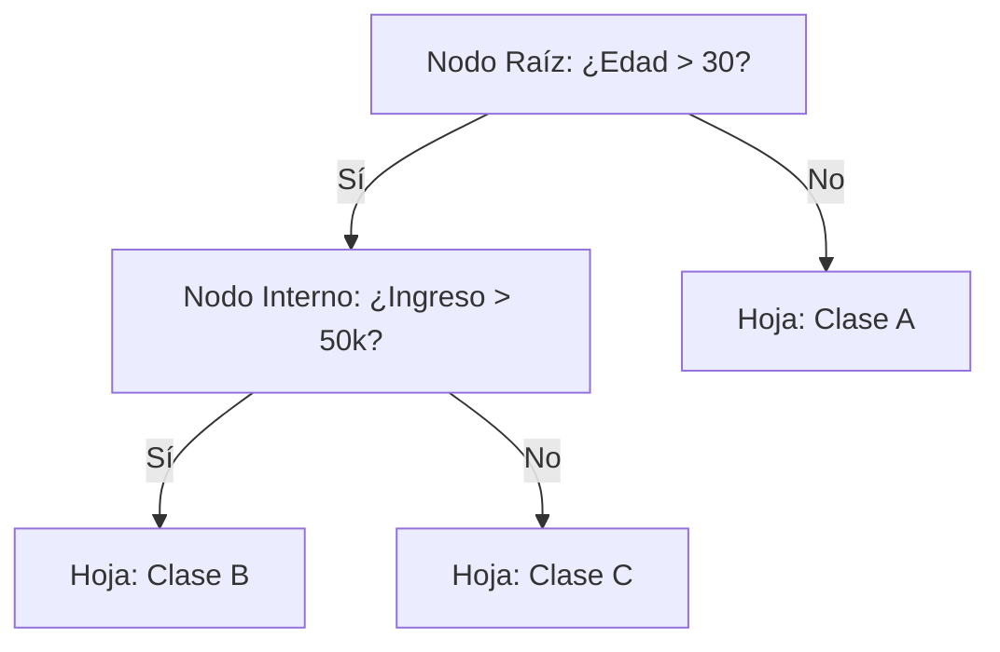

# Árboles de Decisión

Los **Árboles de Decisión** son modelos predictivos que pueden emplearse tanto para tareas de clasificación como de regresión. Se caracterizan por tener una estructura de diagrama de flujo donde cada nodo interno representa una prueba sobre una característica, cada rama indica el resultado de dicha prueba, y cada nodo hoja corresponde a una etiqueta de clase o un valor continuo.

## ¿Cómo funcionan?

El algoritmo divide el conjunto de datos en subconjuntos cada vez más pequeños basándose en reglas condicionales simples (por ejemplo, "¿La edad es mayor a 30?").

- **Entropía e Impureza de Gini:** Son métricas matemáticas utilizadas para decidir en qué característica es óptimo dividir los datos. El objetivo principal es que cada división produzca nodos secundarios lo más "puros" posible, es decir, que contengan muestras de una sola clase.
- **Ganancia de Información:** Mide la reducción de entropía lograda al dividir los datos según un atributo específico. El algoritmo siempre selecciona la división que maximice la ganancia de información.

## El problema del Sobreajuste y la Poda

Los árboles de decisión son modelos muy propensos al sobreajuste, también conocido como overfitting (ver [[Ajuste de modelos]]). Si no se les impone un límite durante su crecimiento, seguirán dividiéndose hasta que cada nodo hoja contenga un solo dato de entrenamiento, lo que resulta en una memorización perfecta del ruido en lugar de un aprendizaje generalizable.

- **Poda (Pruning):** Es la técnica utilizada para recortar las ramas del árbol que tienen poca importancia predictiva. Esto se logra limitando su profundidad máxima o estableciendo un número mínimo de muestras requeridas por hoja, lo cual mejora significativamente su capacidad de generalización.

> [!info] Ventajas y Desventajas
> **Ventajas:** Son modelos muy intuitivos y fáciles de explicar, considerándose modelos de "caja blanca". Además, requieren muy poco preprocesamiento de los datos, ya que no necesitan normalización ni estandarización.
> **Desventajas:** Son modelos inestables; pequeñas variaciones en los datos de entrenamiento pueden generar un árbol completamente diferente. También tienden a sobreajustarse con facilidad. Por estas razones, rara vez se implementan de forma aislada en entornos de producción, prefiriéndose su uso dentro de métodos de ensamblaje como los [[Ensemble Methods]] (por ejemplo, Random Forest).

## Notas relacionadas
- [[algoritmos parametricos y no parametricos]]
- [[tipos de machine learning]]
- [[Ajuste de modelos]]
- [[Ensemble Methods]]
