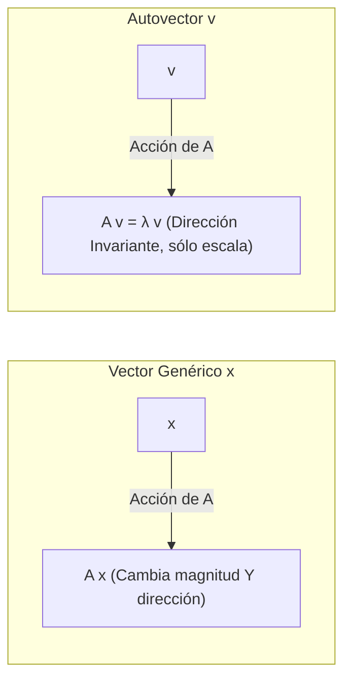
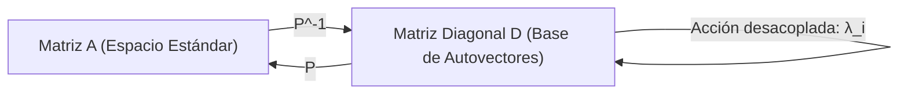
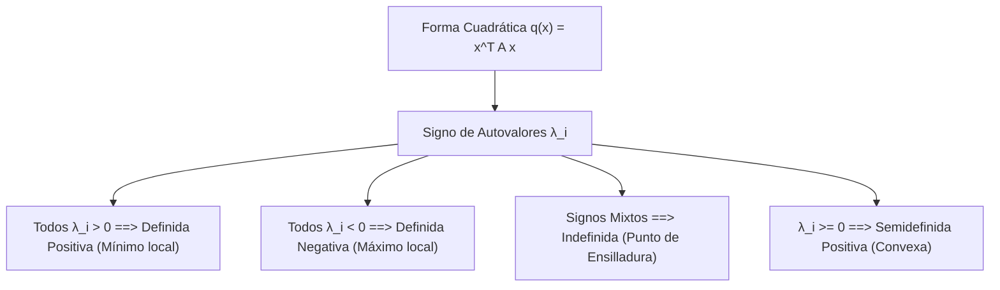
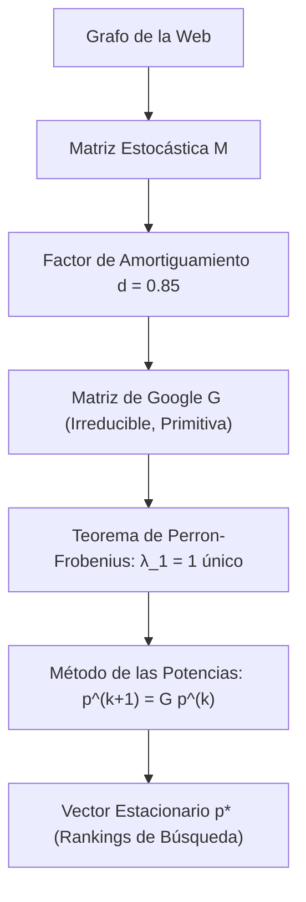

# Autovalores, Autovectores y Diagonalización

El análisis espectral es uno de los pilares matemáticos más fructíferos de las Ciencias de la Computación. Descomponer un operador lineal en sus direcciones fundamentales de escala (autovectores) y factores de dilatación (autovalores) permite desacoplar sistemas dinámicos complejos, optimizar algoritmos de búsqueda a escala planetaria ([[Autovalores, Autovectores y Diagonalizacion#7. Aplicación Clave en CS: El Algoritmo PageRank de Google|Algoritmo PageRank]]), acelerar el cálculo de potencias matriciales $A^k$ en grafos y caracterizar la curvatura de funciones de pérdida en Deep Learning mediante la matriz Hessiana.

> [!info] 💡 ¿Cómo entender esto desde cero? (Guía para novatos de pregrado)
> - **La intuición física:** Imagina que tienes una tela elástica estampada. Si la agarras de los extremos y la estiras en diagonal, casi todos los dibujos de la tela cambian de tamaño Y giran en nuevas direcciones.
> - **Los Autovectores mágicos:** Sin embargo, notarás que hay ciertas líneas rectas especiales en la tela que **NO giran en absoluto**: se mantienen en su misma línea original, simplemente se alargan o se encogen. Esas líneas que no cambian de dirección son los **autovectores** (*eigenvectors*).
> - **Los Autovalores:** Es simplemente el número que te dice **cuánto se estiró o encogió** esa línea especial (si se duplicó, $\lambda = 2$; si se invirtió, $\lambda = -1$; si se quedó igual, $\lambda = 1$).
> - **¿Por qué le importa a un ingeniero de sistemas?**
>   - **Google PageRank:** Google modela toda la web como una matriz gigante. La importancia de cada página web es exactamente el autovector principal de esa matriz.
>   - **Inteligencia Artificial y PCA:** Los autovectores te indican en qué dirección varían más los datos, permitiendo comprimir datos gigantescos sin perder información.

---

## 1. Definición Fundamental de Autovalor y Autovector

> [!definition] Autovalor y Autovector
> Sea $A \in \mathbb{K}^{n \times n}$ una matriz cuadrada asociada a un endomorfismo lineal $T: V \to V$ sobre un cuerpo $\mathbb{K}$. Un escalar $\lambda \in \mathbb{K}$ se denomina **autovalor** (o valor propio / *eigenvalue*) de $A$ si existe un vector no nulo $\mathbf{v} \in \mathbb{K}^n \setminus \{\mathbf{0}\}$ tal que:
> $$A\mathbf{v} = \lambda \mathbf{v}$$
> El vector $\mathbf{v}$ se denomina **autovector** (o vector propio / *eigenvector*) asociado al autovalor $\lambda$.

### El Autoespacio (Eigenspace)
Reordenando la ecuación fundamental:
$$A\mathbf{v} - \lambda \mathbf{v} = \mathbf{0} \iff (A - \lambda I_n)\mathbf{v} = \mathbf{0}$$
El conjunto de todos los autovectores asociados a $\lambda$, junto con el vector nulo $\mathbf{0}$, forma un subespacio vectorial denominado **autoespacio** $E_\lambda$:
$$E_\lambda = \ker(A - \lambda I_n) = \{\mathbf{v} \in \mathbb{K}^n \mid (A - \lambda I_n)\mathbf{v} = \mathbf{0}\} \le \mathbb{K}^n$$

---

## 2. Polinomio Característico y Ecuación Característica

Para que exista una solución no trivial $\mathbf{v} \neq \mathbf{0}$ en el sistema homogéneo $(A - \lambda I_n)\mathbf{v} = \mathbf{0}$, la matriz $(A - \lambda I_n)$ debe ser singular (no invertible), lo que exige que su determinante sea cero:

> [!theorem] Ecuación Característica
> Los autovalores de $A \in \mathbb{K}^{n \times n}$ son exactamente las raíces del **polinomio característico** $p(\lambda)$:
> $$p(\lambda) = \det(A - \lambda I_n) = 0$$
> $p(\lambda)$ es un polinomio mónico (o alternado $(-1)^n$) de grado $n$:
> $$p(\lambda) = (-1)^n \lambda^n + (-1)^{n-1}\text{tr}(A)\lambda^{n-1} + \dots + \det(A)$$

### Propiedades Espectrales Clave
Si $\lambda_1, \lambda_2, \dots, \lambda_n \in \mathbb{C}$ son las $n$ raíces (contando multiplicidades) de $p(\lambda)$:
1. **Traza:** La suma de los autovalores es igual a la traza de la matriz:
   $$\text{tr}(A) = \sum_{i=1}^n a_{ii} = \sum_{i=1}^n \lambda_i$$
2. **Determinante:** El producto de los autovalores es igual al determinante:
   $$\det(A) = \prod_{i=1}^n \lambda_i$$
3. **Invariancia Espectral por Similitud:** Si $B = P^{-1} A P$, entonces $A$ y $B$ tienen exactamente el mismo polinomio característico y, por ende, los mismos autovalores:
   $$\det(B - \lambda I) = \det(P^{-1}(A - \lambda I)P) = \det(P^{-1})\det(A - \lambda I)\det(P) = \det(A - \lambda I)$$

---

## 3. Multiplicidad Algebraica (MA) vs. Multiplicidad Geométrica (MG)

> [!definition] Multiplicidades de un Autovalor
> Sea $\lambda_0$ un autovalor de $A$:
> 1. **Multiplicidad Algebraica ($\text{MA}(\lambda_0)$):** Es el orden de multiplicidad de $\lambda_0$ como raíz del polinomio característico $p(\lambda)$; es decir, la mayor potencia $k$ tal que $(\lambda - \lambda_0)^k$ divide a $p(\lambda)$.
> 2. **Multiplicidad Geométrica ($\text{MG}(\lambda_0)$):** Es la dimensión del autoespacio asociado $E_{\lambda_0}$:
>    $$\text{MG}(\lambda_0) = \dim(E_{\lambda_0}) = \dim(\ker(A - \lambda_0 I_n)) = n - \text{rango}(A - \lambda_0 I_n)$$

> [!theorem] Desigualdad Fundamental de Multiplicidades
> Para todo autovalor $\lambda_0$ de una matriz $A$:
> $$1 \le \text{MG}(\lambda_0) \le \text{MA}(\lambda_0) \le n$$

- **Matriz Defectiva:** Si existe al menos un autovalor para el cual $\text{MG}(\lambda) < \text{MA}(\lambda)$, la matriz no posee suficientes autovectores linealmente independientes para formar una base de $\mathbb{K}^n$. Estas matrices no son diagonalizables y requieren la **Forma Canónica de Jordan**.

---

## 4. Teorema de Diagonalización

> [!theorem] Teorema Fundamental de Diagonalización
> Una matriz cuadrada $A \in \mathbb{K}^{n \times n}$ es **diagonalizable** (es decir, semejante a una matriz diagonal $D$) si y solo si admite $n$ autovectores linealmente independientes en $\mathbb{K}^n$.
> 
> Equivalentemente, $A$ es diagonalizable $\iff$ para cada autovalor $\lambda_i$ se cumple:
> $$\text{MG}(\lambda_i) = \text{MA}(\lambda_i)$$
> En tal caso, existe una matriz invertible $P \in \mathbb{K}^{n \times n}$ tal que:
> $$A = P D P^{-1} \iff D = P^{-1} A P$$
> donde $D = \text{diag}(\lambda_1, \lambda_2, \dots, \lambda_n)$ y las columnas de $P$ son los autovectores correspondientes:
> $$P = \begin{pmatrix} \mathbf{v}_1 & \mathbf{v}_2 & \dots & \mathbf{v}_n \end{pmatrix}$$

### Aplicación Computacional: Exponenciación y Potencias Rápidas
Calcular $A^k$ ingenuamente mediante multiplicaciones sucesivas cuesta $O(k \cdot n^3)$.
Utilizando la descomposición espectral:
$$A^k = (P D P^{-1})^k = P D^k P^{-1} = P \begin{pmatrix} \lambda_1^k & 0 & \dots & 0 \\ 0 & \lambda_2^k & \dots & 0 \\ \vdots & \vdots & \ddots & \vdots \\ 0 & 0 & \dots & \lambda_n^k \end{pmatrix} P^{-1}$$
El costo se reduce drásticamente a $O(n^3)$ para diagonalizar y $O(n)$ para calcular $D^k$, permitiendo simular cadenas de Markov y resolver ecuaciones en diferencias discretas para $k \to \infty$ de manera analítica.

---

## 5. Teorema Espectral para Matrices Simétricas Reales

Las matrices simétricas ($A = A^T \in \mathbb{R}^{n \times n}$) ocupan un lugar central en la informática: matrices de covarianza en machine learning, Laplacian de grafos en análisis de redes y operadores de rigidez en física.

> [!theorem] Teorema Espectral
> Sea $A \in \mathbb{R}^{n \times n}$ una matriz simétrica real. Entonces:
> 1. Todos sus autovalores son **estrictamente reales**: $\lambda_i \in \mathbb{R}, \forall i$.
> 2. Autovectores correspondientes a autovalores distintos son **mutuamente ortogonales**:
>    $$\lambda_i \neq \lambda_j \implies \mathbf{v}_i \perp \mathbf{v}_j \quad (\mathbf{v}_i^T \mathbf{v}_j = 0)$$
> 3. La matriz $A$ es **ortogonalmente diagonalizable**: existe una matriz ortogonal $Q \in \mathbb{R}^{n \times n}$ ($Q^T = Q^{-1}$) tal que:
>    $$A = Q \Lambda Q^T$$
>    donde $\Lambda = \text{diag}(\lambda_1, \dots, \lambda_n)$ y las columnas de $Q$ forman una base ortonormal de $\mathbb{R}^n$.

### Descomposición Espectral (Suma de Proyectores Ortogonales)
El producto $A = Q \Lambda Q^T$ puede reescribirse canónicamente como:
$$A = \sum_{i=1}^n \lambda_i \mathbf{q}_i \mathbf{q}_i^T$$
donde cada término $P_i = \mathbf{q}_i \mathbf{q}_i^T$ es una matriz de proyección ortogonal de rango 1 sobre el subespacio generado por el autovector $\mathbf{q}_i$.

---

## 6. Formas Cuadráticas y Criterio de Sylvester

> [!definition] Forma Cuadrática
> Una **forma cuadrática** sobre $\mathbb{R}^n$ es una función escalar $q: \mathbb{R}^n \to \mathbb{R}$ definida por una matriz simétrica $A \in \mathbb{R}^{n \times n}$:
> $$q(\mathbf{x}) = \mathbf{x}^T A \mathbf{x} = \sum_{i=1}^n \sum_{j=1}^n a_{ij} x_i x_j$$

### Clasificación por Signatura y Autovalores
Realizando el cambio de variable ortogonal $\mathbf{x} = Q\mathbf{y}$ (donde $A = Q\Lambda Q^T$):
$$q(\mathbf{x}) = \mathbf{y}^T Q^T A Q \mathbf{y} = \mathbf{y}^T \Lambda \mathbf{y} = \sum_{i=1}^n \lambda_i y_i^2$$

La signatura de $q(\mathbf{x})$ queda unívocamente determinada por los signos de sus autovalores:
- **Definida Positiva ($A \succ 0$):** $\lambda_i > 0, \forall i \iff q(\mathbf{x}) > 0, \forall \mathbf{x} \neq \mathbf{0}$. (Mínimo estricto en optimización).
- **Semidefinida Positiva ($A \succeq 0$):** $\lambda_i \ge 0, \forall i \iff q(\mathbf{x}) \ge 0, \forall \mathbf{x}$. (Funciones convexas).
- **Definida Negativa ($A \prec 0$):** $\lambda_i < 0, \forall i \iff q(\mathbf{x}) < 0, \forall \mathbf{x} \neq \mathbf{0}$. (Máximo estricto).
- **Indefinida:** Existen autovalores positivos y negativos ($\exists \lambda_i > 0, \lambda_j < 0$). Corresponde a **puntos de ensilladura** (*saddle points*), obstáculo crítico en el entrenamiento de redes neuronales profundas.

### Criterio de los Menores Principales Líderes de Sylvester
Sea $\Delta_k = \det(A_{1:k, 1:k})$ el menor principal líder de orden $k$ (determinante del bloque superior izquierdo $k \times k$):
- $A$ es **Definida Positiva** $\iff \Delta_k > 0, \quad \forall k \in \{1, 2, \dots, n\}$.
- $A$ es **Definida Negativa** $\iff (-1)^k \Delta_k > 0, \quad \forall k \in \{1, 2, \dots, n\}$ (signos alternados: $\Delta_1 < 0, \Delta_2 > 0, \Delta_3 < 0, \dots$).

---

## 7. Aplicación Clave en CS: El Algoritmo PageRank de Google

El algoritmo que originó Google modela la Web como un grafo dirigido $G = (V, E)$, donde las páginas web son nodos y los hipervínculos son aristas dirigidas.

### Formulación como Cadena de Markov
Sea $N = |V|$ el total de páginas. Definimos la matriz estocástica de adyacencia normalizada por columnas $M \in \mathbb{R}^{N \times N}$:
$$M_{ij} = \begin{cases} \frac{1}{L(j)} & \text{si existe enlace } j \to i \\ 0 & \text{en caso contrario} \end{cases}$$
donde $L(j)$ es el número de enlaces salientes de la página $j$. Un internauta aleatorio situado en $j$ salta a $i$ con probabilidad $M_{ij}$.

### Anomalías Estructurales y la Matriz de Google
En grafos reales surgen dos patologías:
1. **Nodos sumidero (*Dangling Nodes*):** Páginas sin enlaces salientes ($L(j) = 0$). Convierten la columna en ceros, destruyendo la condición estocástica. Se corrigen reemplazando la columna por un vector uniforme $\frac{1}{N}\mathbf{1}$.
2. **Trampas cíclicas (*Spider Traps*):** Subgrafos cerrados que absorben toda la probabilidad de la red.

Para resolver esto y garantizar ergodicidad, Larry Page y Sergey Brin introdujeron el factor de amortiguamiento (*damping factor*) $d \in (0, 1)$ (típicamente $d = 0.85$):
$$G = d \tilde{M} + \frac{1 - d}{N} \mathbf{E}$$
donde $\mathbf{E} = \mathbf{1} \mathbf{1}^T$ es la matriz de unos. Con probabilidad $d$ el usuario sigue un enlace real, y con probabilidad $1 - d$ se "teletransporta" a cualquier página arbitraria de la Web.

### El Teorema de Perron-Frobenius y el Método de las Potencias
La matriz de Google $G$ es estrictamente positiva ($G_{ij} > 0$), estocástica por columnas y aperiódica.
Por el **Teorema de Perron-Frobenius**:
1. El mayor autovalor de $G$ es **simple** y vale exactamente $\lambda_1 = 1$.
2. Todos los demás autovalores satisfacen $|\lambda_i| \le d = 0.85$.
3. Existe un único vector estacionario $\mathbf{p}^*$ con componentes estrictamente positivas ($\sum p_i^* = 1$) tal que:
   $$G \mathbf{p}^* = 1 \cdot \mathbf{p}^*$$

Dado que $N > 10^{10}$, calcular $\mathbf{p}^*$ resolviendo $(G - I)\mathbf{p} = \mathbf{0}$ es inviable. Se calcula numéricamente mediante el **Método de las Potencias** (*Power Iteration*):
$$\mathbf{p}^{(k+1)} = G \mathbf{p}^{(k)}$$
Gracias a la cota espectral $|\lambda_2| \le d$, la velocidad de convergencia es exponencial:
$$\|\mathbf{p}^{(k)} - \mathbf{p}^*\| \le C \cdot d^k = C \cdot (0.85)^k$$
bastando entre 50 y 100 iteraciones distribuidas con MapReduce/Spark para indexar toda la web mundial.

---

## 8. Resumen Comparativo de Conceptos Espectrales

| Concepto | Ecuación Formal | Interpretación Física / Computacional |
| :--- | :--- | :--- |
| **Problema Espectral** | $A\mathbf{v} = \lambda \mathbf{v}, \; \mathbf{v} \neq \mathbf{0}$ | Direcciones preferenciales invariantes de una transformación |
| **Polinomio Característico** | $\det(A - \lambda I) = 0$ | Raíces complejas representan el espectro completo |
| **Diagonalización** | $A = P D P^{-1}$ | Desacoplamiento de variables; potencias $A^k$ en $O(1)$ |
| **Teorema Espectral** | $A = Q \Lambda Q^T \quad (A = A^T)$ | Base ortonormal de autovectores reales; proyección espectral |
| **Sylvester (DP)** | $\Delta_k > 0, \; \forall k \in \{1,\dots,n\}$ | Condición suficiente de convexidad estricta y estabilidad |
| **PageRank** | $G \mathbf{p}^* = \mathbf{p}^* \quad (\lambda_1 = 1)$ | Distribución estacionaria de probabilidad en cadenas de Markov |