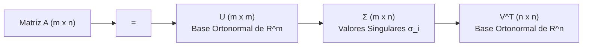
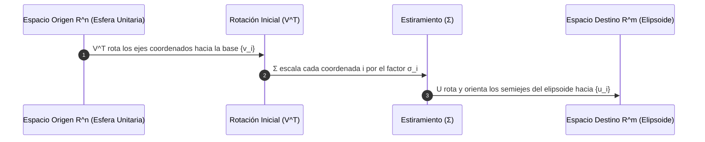
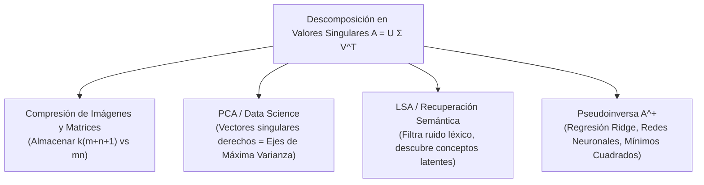

# Descomposición en Valores Singulares (SVD) y Pseudoinversa

La **Descomposición en Valores Singulares (Singular Value Decomposition - SVD)** es considerada el teorema culminante del álgebra lineal aplicada. Mientras que la diagonalización espectral estándar $A = P D P^{-1}$ está restringida a matrices cuadradas y no defectivas, la SVD existe y es computable para **cualquier matriz arbitraria** rectangular $A \in \mathbb{R}^{m \times n}$.

Constituye la herramienta fundamental en Ciencias de la Computación para compresión con pérdida, reducción de dimensionalidad ([[Reduccion de Dimensionalidad (PCA y t-SNE)]]), procesamiento de lenguaje natural (LSA), motores de recomendación colaborativa (filtrado colaborativo) y la resolución numéricamente robusta de sistemas sobredeterminados e indeterminados mediante la **Pseudoinversa de Moore-Penrose**.

> [!info] 💡 ¿Cómo entender esto desde cero? (Guía para novatos de pregrado)
> - **El superpoder de SVD:** Los autovalores solo funcionan para matrices cuadradas ($n 	imes n$). Pero en el mundo real, los datos casi nunca son cuadrados (por ejemplo, una tabla de 10,000 usuarios $	imes$ 500 películas). **SVD funciona para CUALQUIER matriz del mundo**, sin importar su tamaño o forma.
> - **Analogía de la radiografía de datos:** SVD descompone cualquier matriz de datos en tres piezas: $A = U \Sigma V^T$:
>   - $U$: Cómo se relacionan las filas (los usuarios).
>   - $\Sigma$: La importancia o peso de cada patrón oculto (los valores singulares $\sigma_i$, ordenados de mayor a menor).
>   - $V^T$: Cómo se relacionan las columnas (las películas).
> - **Compresión mágica:** Si una imagen ocupa 10 MB, SVD te permite quedarte solo con los primeros 20 valores singulares más grandes y descartar los otros 1000. La imagen reconstruida se ve idéntica al ojo humano pero ocupa apenas 200 KB.
> - **La Pseudoinversa ($A^+$):** Si tienes un sistema de ecuaciones donde hay más ecuaciones que incógnitas (imposible de resolver exactamente), la pseudoinversa encuentra automáticamente la "mejor respuesta aproximada posible" (mínimos cuadrados).

---

## 1. El Teorema Fundamental de SVD

> [!theorem] Teorema de Descomposición en Valores Singulares
> Sea $A \in \mathbb{R}^{m \times n}$ una matriz real de rango $r \le \min(m, n)$. Existen dos matrices ortogonales:
> - $U \in \mathbb{R}^{m \times m}$ con columnas ortonormales $\mathbf{u}_1, \dots, \mathbf{u}_m$ (**vectores singulares izquierdos**)
> - $V \in \mathbb{R}^{n \times n}$ con columnas ortonormales $\mathbf{v}_1, \dots, \mathbf{v}_n$ (**vectores singulares derechos**)
> 
> y una matriz rectangular diagonal $ \Sigma \in \mathbb{R}^{m \times n} $ tal que:
> $$A = U \Sigma V^T$$
> donde los elementos diagonales $\sigma_i = \Sigma_{ii}$ son los **valores singulares** de $A$, ordenados de forma no creciente:
> $$\sigma_1 \ge \sigma_2 \ge \dots \ge \sigma_r > 0 \quad \text{y} \quad \sigma_{r+1} = \sigma_{r+2} = \dots = \sigma_{\min(m,n)} = 0$$

### Forma Compacta (Thin / Reduced SVD)
Reteniendo únicamente los $r = \text{rango}(A)$ valores singulares estrictamente positivos:
$$A = U_r \Sigma_r V_r^T = \sum_{i=1}^r \sigma_i \mathbf{u}_i \mathbf{v}_i^T$$
donde:
- $U_r \in \mathbb{R}^{m \times r}$ ($U_r^T U_r = I_r$)
- $\Sigma_r = \text{diag}(\sigma_1, \dots, \sigma_r) \in \mathbb{R}^{r \times r}$ invertible
- $V_r \in \mathbb{R}^{n \times r}$ ($V_r^T V_r = I_r$)
Esta formulación expresa $A$ como una combinación lineal ponderada de $r$ matrices de **rango 1 ortonormales** $\mathbf{u}_i \mathbf{v}_i^T$.

---

## 2. Interpretación Geométrica y Desacoplamiento

Geométricamente, la transformación lineal inducida por cualquier matriz $A: \mathbb{R}^n \to \mathbb{R}^m$ mapea la esfera unitaria $S^{n-1} = \{\mathbf{x} \in \mathbb{R}^n \mid \|\mathbf{x}\|_2 = 1\}$ en un **hiperelipsoide** en el espacio destino $\mathbb{R}^m$.

La factorización $A = U \Sigma V^T$ desacopla esta acción en tres etapas geométricas elementales:

1. **Rotación / Reflexión en el Dominio ($V^T$):** Rota la base canónica alineándola con los vectores singulares derechos $\{\mathbf{v}_i\}$.
2. **Escalamiento por Ejes ($\Sigma$):** Dilata o comprime cada dirección independiente por el valor singular $\sigma_i$. Si $\sigma_i = 0$, colapsa la dimensión (pérdida de rango).
3. **Rotación / Orientación en el Codominio ($U$):** Rota el elipsoide deformado, haciendo coincidir sus semiejes con los vectores singulares izquierdos $\{\mathbf{u}_i\}$.

Los semiejes del elipsoide resultante tienen longitudes exactamente iguales a los valores singulares $\sigma_i$ en las direcciones canónicas $\mathbf{u}_i$.

---

## 3. Relación Analítica con $A^T A$ y $A A^T$

Multiplicando $A = U \Sigma V^T$ por su transpuesta:
$$A^T A = (V \Sigma^T U^T)(U \Sigma V^T) = V (\Sigma^T \Sigma) V^T$$
$$A A^T = (U \Sigma V^T)(V \Sigma^T U^T) = U (\Sigma \Sigma^T) U^T$$

Puesto que $A^T A \in \mathbb{R}^{n \times n}$ y $A A^T \in \mathbb{R}^{m \times m}$ son matrices **simétricas y semidefinidas positivas**, el Teorema Espectral garantiza que son ortogonalmente diagonalizables con autovalores reales no negativos:

> [!important] Vínculo Fundamental entre SVD y Espectro de Gramianos
> 1. Los vectores singulares derechos $\mathbf{v}_i$ son los **autovectores ortonormales** de $A^T A$:
>    $$(A^T A)\mathbf{v}_i = \lambda_i \mathbf{v}_i = \sigma_i^2 \mathbf{v}_i$$
> 2. Los vectores singulares izquierdos $\mathbf{u}_i$ son los **autovectores ortonormales** de $A A^T$:
>    $$(A A^T)\mathbf{u}_i = \mu_i \mathbf{u}_i = \sigma_i^2 \mathbf{u}_i$$
> 3. Los valores singulares $\sigma_i$ son las **raíces cuadradas positivas** de los autovalores no nulos comunes:
>    $$\sigma_i = \sqrt{\lambda_i(A^T A)} = \sqrt{\mu_i(A A^T)}$$
> 4. Conexión vectorial directa:
>    $$A \mathbf{v}_i = \sigma_i \mathbf{u}_i \iff \mathbf{u}_i = \frac{1}{\sigma_i} A \mathbf{v}_i \quad (1 \le i \le r)$$

### Revelación de los Cuatro Subespacios Fundamentales de Strang
La SVD proporciona de forma inmediata bases ortonormales para los cuatro subespacios vectoriales fundamentales asociados a $A$:

| Subespacio Vectorial | Dimensión | Base Ortonormal Canónica (SVD) |
| :--- | :--- | :--- |
| **Espacio Columna / Imagen:** $\text{Col}(A) = \text{Im}(A)$ | $r$ | $\{\mathbf{u}_1, \mathbf{u}_2, \dots, \mathbf{u}_r\}$ |
| **Espacio Nulo Izquierdo:** $\ker(A^T) = \text{Col}(A)^\perp$ | $m - r$ | $\{\mathbf{u}_{r+1}, \mathbf{u}_{r+2}, \dots, \mathbf{u}_m\}$ |
| **Espacio Fila:** $\text{Row}(A) = \text{Col}(A^T)$ | $r$ | $\{\mathbf{v}_1, \mathbf{v}_2, \dots, \mathbf{v}_r\}$ |
| **Espacio Nulo / Núcleo:** $\ker(A) = \text{Row}(A)^\perp$ | $n - r$ | $\{\mathbf{v}_{r+1}, \mathbf{v}_{r+2}, \dots, \mathbf{v}_n\}$ |

---

## 4. Teorema de Eckart-Young-Mirsky (Aproximación Óptima de Bajo Rango)

En el análisis de datos a gran escala, matrices con millones de filas y columnas contienen ruido e información redundante. El objetivo es encontrar una matriz de rango bajo $k \ll r$ que aproxime a $A$ de forma óptima.

> [!definition] SVD Truncada de Rango $k$
> Para cualquier entero $k < r = \text{rango}(A)$, la matriz **SVD Truncada** $A_k$ se define preservando únicamente los primeros $k$ valores singulares dominantes:
> $$A_k = U_k \Sigma_k V_k^T = \sum_{i=1}^k \sigma_i \mathbf{u}_i \mathbf{v}_i^T$$

> [!theorem] Teorema de Eckart-Young-Mirsky (1936 / 1960)
> Sea $A \in \mathbb{R}^{m \times n}$ con SVD $A = \sum_{i=1}^r \sigma_i \mathbf{u}_i \mathbf{v}_i^T$. Para cualquier entero $1 \le k < r$, la matriz $A_k$ es la **solución óptima** al problema de aproximación de rango $k$:
> $$\min_{\substack{B \in \mathbb{R}^{m \times n} \\ \text{rango}(B) \le k}} \|A - B\|$$
> tanto bajo la **norma espectral** (inducida $\ell_2$) como bajo la **norma de Frobenius**:
> 
> 1. **Bajo la Norma Espectral ($\|\cdot\|_2$):**
>    $$\min_{\text{rango}(B) \le k} \|A - B\|_2 = \|A - A_k\|_2 = \sigma_{k+1}$$
> 2. **Bajo la Norma de Frobenius ($\|\cdot\|_F$):**
>    $$\min_{\text{rango}(B) \le k} \|A - B\|_F = \|A - A_k\|_F = \sqrt{\sum_{i=k+1}^r \sigma_i^2}$$

> [!proof]- Demostración para la Norma Espectral
> Primero, nótese que:
> $$A - A_k = \sum_{i=k+1}^r \sigma_i \mathbf{u}_i \mathbf{v}_i^T$$
> Dado que los $\{\mathbf{u}_i\}$ y $\{\mathbf{v}_i\}$ son ortonormales, el mayor valor singular de $(A - A_k)$ es $\sigma_{k+1}$, por lo que $\|A - A_k\|_2 = \sigma_{k+1}$.
> 
> Supongamos ahora que existe una matriz $B \in \mathbb{R}^{m \times n}$ con $\text{rango}(B) \le k$ tal que $\|A - B\|_2 < \sigma_{k+1}$.
> Por el Teorema de Rango-Nulidad:
> $$\dim(\ker(B)) = n - \text{rango}(B) \ge n - k$$
> Consideremos el subespacio $W_{k+1} = \text{span}\{\mathbf{v}_1, \dots, \mathbf{v}_{k+1}\} \le \mathbb{R}^n$, de dimensión $k+1$.
> Como $\dim(\ker(B)) + \dim(W_{k+1}) \ge (n - k) + (k + 1) = n + 1 > n$, la intersección $\ker(B) \cap W_{k+1}$ contiene al menos un vector unitario no nulo $\mathbf{z} \in \mathbb{R}^n$ ($\|\mathbf{z}\|_2 = 1$).
> Dado que $\mathbf{z} \in W_{k+1}$, podemos escribir $\mathbf{z} = \sum_{i=1}^{k+1} c_i \mathbf{v}_i$ con $\sum_{i=1}^{k+1} c_i^2 = 1$.
> Entonces:
> $$\|A\mathbf{z}\|_2^2 = \left\| \sum_{i=1}^{k+1} \sigma_i c_i \mathbf{u}_i \right\|_2^2 = \sum_{i=1}^{k+1} \sigma_i^2 c_i^2 \ge \sigma_{k+1}^2 \sum_{i=1}^{k+1} c_i^2 = \sigma_{k+1}^2$$
> Luego $\|A\mathbf{z}\|_2 \ge \sigma_{k+1}$.
> Por otro lado, como $\mathbf{z} \in \ker(B)$, tenemos $B\mathbf{z} = \mathbf{0}$. En consecuencia:
> $$\|A - B\|_2 \ge \|(A - B)\mathbf{z}\|_2 = \|A\mathbf{z}\|_2 \ge \sigma_{k+1}$$
> Esto contradice la suposición inicial $\|A - B\|_2 < \sigma_{k+1}$.
> Por reducción al absurdo, ninguna matriz de rango $\le k$ puede aproximar a $A$ mejor que $A_k$. $\blacksquare$

---

## 5. La Pseudoinversa de Moore-Penrose ($A^+$)

Para matrices singulares o rectangulares $m \neq n$, la matriz inversa $A^{-1}$ no existe. La **pseudoinversa de Moore-Penrose** $A^+ \in \mathbb{R}^{n \times m}$ proporciona una generalización universal y unívoca.

### Definición Axiomática
Para cualquier matriz $A \in \mathbb{R}^{m \times n}$, su pseudoinversa es la **única** matriz $A^+ \in \mathbb{R}^{n \times m}$ que satisface las cuatro condiciones de Penrose:
1. $A A^+ A = A$
2. $A^+ A A^+ = A^+$
3. $(A A^+)^T = A A^+$ (Proyector ortogonal sobre $\text{Col}(A)$)
4. $(A^+ A)^T = A^+ A$ (Proyector ortogonal sobre $\text{Row}(A)$)

### Cálculo Analítico mediante SVD
Dada la descomposición $A = U \Sigma V^T$:
$$A^+ = V \Sigma^+ U^T = \sum_{i=1}^r \frac{1}{\sigma_i} \mathbf{v}_i \mathbf{u}_i^T$$
donde $\Sigma^+ \in \mathbb{R}^{n \times m}$ se calcula invirtiendo los valores singulares estrictamente positivos y transponiendo la estructura:
$$\Sigma^+ = \text{diag}\left( \frac{1}{\sigma_1}, \frac{1}{\sigma_2}, \dots, \frac{1}{\sigma_r}, 0, \dots, 0 \right)$$

### Solución Óptima de Mínimos Cuadrados
Dado cualquier sistema lineal arbitrario $A\mathbf{x} = \mathbf{b}$:
> [!theorem] Teorema de Solución de Norma Mínima
> El vector:
> $$\mathbf{x}^* = A^+ \mathbf{b}$$
> satisface:
> 1. Minimiza la norma del residuo:
>    $$\mathbf{x}^* = \arg\min_{\mathbf{x} \in \mathbb{R}^n} \|A\mathbf{x} - \mathbf{b}\|_2$$
> 2. Si el conjunto de soluciones de mínimos cuadrados es infinito (sistema indeterminado), $\mathbf{x}^*$ selecciona la **única solución de norma euclídea mínima**:
>    $$\|\mathbf{x}^*\|_2 < \|\mathbf{x}\|_2, \quad \forall \mathbf{x} \in \mathcal{S}_{\text{min}} \setminus \{\mathbf{x}^*\}$$

---

## 6. Aplicaciones Vitales en Ciencias de la Computación

### A. Compresión de Imágenes con Pérdida Controlada
Una imagen en escala de grises de resolución $m \times n$ es una matriz de intensidades de píxeles $A$.
- Almacenamiento original sin comprimir: $m \cdot n$ números flotantes.
- Almacenamiento usando SVD Truncada de rango $k$:
  $$\text{Memoria} = k \cdot m \;(U_k) + k \;(\Sigma_k) + k \cdot n \;(V_k) = k(m + n + 1)$$
- **Ejemplo EPN:** Para una imagen de satélite de $2000 \times 2000$ ($4 \times 10^6$ valores), truncando a $k = 50$:
  $$\text{Valores almacenados} = 50(2000 + 2000 + 1) = 200\,050 \approx 5\% \text{ del tamaño original}$$
  logrando una **reducción del $95\%$ del espacio** reteniendo más del $90\%$ de la energía espectral ($\sum_{i=1}^{50} \sigma_i^2 / \sum \sigma_i^2$).

### B. Análisis de Componentes Principales ([[Reduccion de Dimensionalidad (PCA y t-SNE)]])
Sea $X \in \mathbb{R}^{N \times d}$ una matriz de $N$ observaciones con $d$ variables, previamente centrada ($\sum_{i=1}^N x_{ij} = 0$).
- La matriz de covarianza muestral es $C = \frac{1}{N-1} X^T X \in \mathbb{R}^{d \times d}$.
- Si computamos la SVD de la matriz de datos $X = U \Sigma V^T$:
  $$C = \frac{1}{N-1} V \Sigma^T U^T U \Sigma V^T = V \left( \frac{\Sigma^2}{N-1} \right) V^T$$
- **Conclusión:** Las columnas de $V$ son **idénticas** a las Componentes Principales de PCA, y los autovalores de la matriz de covarianza son $\lambda_i = \frac{\sigma_i^2}{N-1}$. Calcular PCA mediante la SVD de $X$ es numéricamente superior porque evita calcular explícitamente $X^T X$, previniendo la pérdida de precisión por números de condición elevados.

### C. Indexación Semántica Latente (LSA) en NLP
En motores de búsqueda, representamos un corpus mediante una matriz término-documento $A \in \mathbb{R}^{V \times D}$ donde $A_{ij}$ representa la frecuencia o ponderación TF-IDF del término $i$ en el documento $j$.
- Problemas habituales: **Sinonimia** (distintas palabras significan lo mismo) y **Polisemia** (una palabra tiene múltiples significados).
- Al truncar a rango $k \approx 300$: $A_k = U_k \Sigma_k V_k^T$:
  - Las filas de $U_k$ mapean palabras a vectores semánticos latentes.
  - Las filas de $V_k$ mapean documentos a perfiles temáticos condensados.
  - La similitud semántica entre consultas y documentos se evalúa en el espacio comprimido mediante similitud de coseno (ver [[Espacios con Producto Interno y Ortogonalidad]]), resolviendo el problema de falta de coincidencia léxica exacta.

---

## 7. Cuadro Sinóptico de Propiedades

| Propiedad | Diagonalización Espectral ($A = P D P^{-1}$) | Descomposición en Valores Singulares ($A = U \Sigma V^T$) |
| :--- | :--- | :--- |
| **Dominio de Aplicabilidad** | Sólo cuadradas ($n \times n$), no defectivas | **Cualquier matriz** real o compleja $m \times n$ |
| **Bases de Transformación** | Una sola base $P$ (generalmente no ortogonal) | Dos bases **estrictamente ortonormales** ($U$ y $V$) |
| **Valores en la Diagonal** | Autovalores $\lambda_i \in \mathbb{C}$ (pueden ser complejos/negativos) | Valores singulares $\sigma_i \in \mathbb{R}_{\ge 0}$ (siempre reales positivos) |
| **Interpretación Geométrica** | Escalado sobre direcciones de autovectores | Rotación $\to$ Escalado $\to$ Rotación |
| **Aproximación de Rango $k$** | No garantiza mínima norma de error | **Garantizada óptima** (Teorema de Eckart-Young) |
| **Cálculo de Pseudoinversa** | No aplicable en general | Directo e incondicionalmente estable: $A^+ = V \Sigma^+ U^T$ |