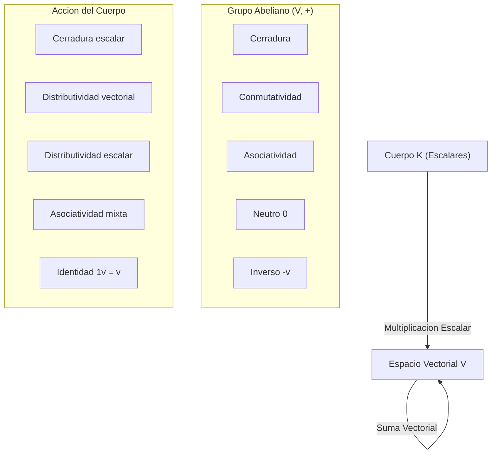
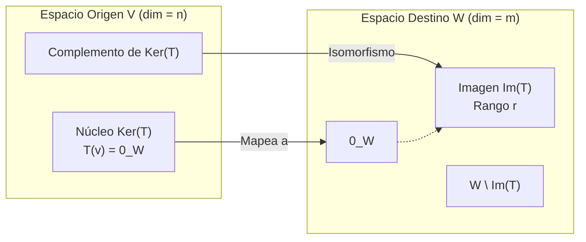
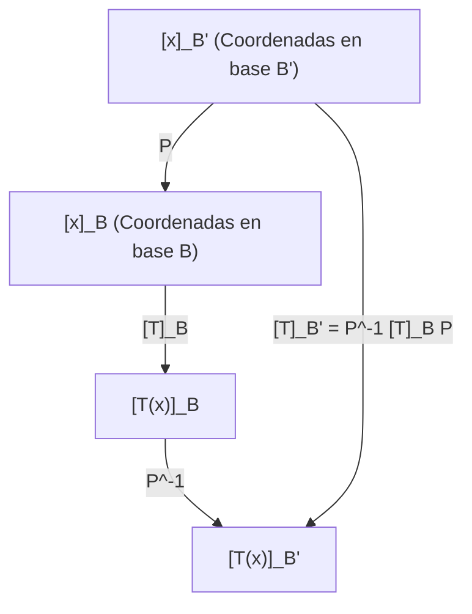

# Espacios Vectoriales, Bases y Transformaciones Lineales

En la fundamentación matemática de la **Ingeniería en Ciencias de la Computación** en la **Escuela Politécnica Nacional (EPN)**, el estudio del álgebra lineal trasciende el mero cálculo operacional con matrices. Se erige como el lenguaje algebraico y geométrico que modela desde el espacio latente de un modelo de lenguaje masivo (LLM) y las transformaciones de renderizado en computación gráfica, hasta los estados cuánticos y la criptografía poscuántica.

Este documento establece la teoría estructural de los **espacios vectoriales**, las **bases**, la noción de **dimensión** y los operadores fundamentales: las **transformaciones lineales**.

> [!info] 💡 ¿Cómo entender esto desde cero? (Guía para novatos de pregrado)
> - **¿Qué es un vector en realidad para un informático?** En el colegio te enseñaron que un vector es una flecha con flechita arriba. En Ciencias de la Computación, **un vector es simplemente una lista ordenada de números**: puede ser la edad, peso y altura de un usuario; los valores RGB de un píxel; o las 1536 coordenadas que representan el significado de una palabra en ChatGPT.
> - **¿Qué es un Espacio Vectorial?** Es un "universo con reglas matemáticas estrictas". Si tomas dos vectores de ese universo y los sumas, el resultado DEBE seguir viviendo dentro de ese universo. Si multiplicas un vector por un número (escalar), también se queda adentro.
> - **¿Qué es una Base?** Son los **ingredientes mínimos esenciales**. Con los ingredientes de una base, puedes "cocinar" cualquier otro vector del universo entero mediante combinaciones lineales, sin que sobre ni falte ninguno.
> - **¿Qué es una Transformación Lineal?** Es una función que toma vectores y los transforma (los rota, estira o proyecta) pero con una regla sagrada: **no curva el espacio ni mueve el origen $(0,0)$**. En computación gráfica y videojuegos, ¡todo el movimiento 3D de la cámara y personajes son transformaciones lineales!

---

## 1. Axiomas Formales de Espacio Vectorial sobre un Cuerpo $\mathbb{K}$

> [!definition] Espacio Vectorial
> Sea $(\mathbb{K}, +, \cdot)$ un cuerpo (típicamente $\mathbb{R}$ o $\mathbb{C}$, con elementos denominados **escalares**). Un **espacio vectorial** sobre $\mathbb{K}$ es una estructura algebraica $(V, \oplus, \odot)$, donde $V$ es un conjunto no vacío cuyos elementos se denominan **vectores**, equipado con dos operaciones cerradas:
> 1. **Suma vectorial:** $\oplus: V \times V \to V$, que asigna a cada par $(\mathbf{u}, \mathbf{v}) \in V \times V$ un elemento $(\mathbf{u} \oplus \mathbf{v}) \in V$.
> 2. **Multiplicación por escalar:** $\odot: \mathbb{K} \times V \to V$, que asigna a cada par $(\alpha, \mathbf{v}) \in \mathbb{K} \times V$ un elemento $(\alpha \odot \mathbf{v}) \in V$.

Para que $(V, \oplus, \odot)$ sea un espacio vectorial sobre $\mathbb{K}$, deben satisfacerse estrictamente los siguientes **diez axiomas**:

### Axiomas de la Suma Vectorial (Estructura de Grupo Abeliano $(V, \oplus)$)

1. **Cerradura bajo la suma:**
   $$\forall \mathbf{u}, \mathbf{v} \in V, \quad \mathbf{u} \oplus \mathbf{v} \in V$$
2. **Conmutatividad:**
   $$\forall \mathbf{u}, \mathbf{v} \in V, \quad \mathbf{u} \oplus \mathbf{v} = \mathbf{v} \oplus \mathbf{u}$$
3. **Asociatividad:**
   $$\forall \mathbf{u}, \mathbf{v}, \mathbf{w} \in V, \quad (\mathbf{u} \oplus \mathbf{v}) \oplus \mathbf{w} = \mathbf{u} \oplus (\mathbf{v} \oplus \mathbf{w})$$
4. **Existencia del elemento neutro aditivo:**
   $$\exists \mathbf{0} \in V \quad \text{tal que} \quad \forall \mathbf{v} \in V, \quad \mathbf{v} \oplus \mathbf{0} = \mathbf{v}$$
5. **Existencia del inverso aditivo (opuesto):**
   $$\forall \mathbf{v} \in V, \quad \exists (-\mathbf{v}) \in V \quad \text{tal que} \quad \mathbf{v} \oplus (-\mathbf{v}) = \mathbf{0}$$

### Axiomas de la Multiplicación por Escalar

6. **Cerradura bajo la multiplicación escalar:**
   $$\forall \alpha \in \mathbb{K}, \forall \mathbf{v} \in V, \quad \alpha \odot \mathbf{v} \in V$$
7. **Distributividad respecto a la suma vectorial:**
   $$\forall \alpha \in \mathbb{K}, \forall \mathbf{u}, \mathbf{v} \in V, \quad \alpha \odot (\mathbf{u} \oplus \mathbf{v}) = (\alpha \odot \mathbf{u}) \oplus (\alpha \odot \mathbf{v})$$
8. **Distributividad respecto a la suma de escalares:**
   $$\forall \alpha, \beta \in \mathbb{K}, \forall \mathbf{v} \in V, \quad (\alpha + \beta) \odot \mathbf{v} = (\alpha \odot \mathbf{v}) \oplus (\beta \odot \mathbf{v})$$
9. **Compatibilidad / Asociatividad escalar:**
   $$\forall \alpha, \beta \in \mathbb{K}, \forall \mathbf{v} \in V, \quad (\alpha \cdot \beta) \odot \mathbf{v} = \alpha \odot (\beta \odot \mathbf{v})$$
10. **Elemento neutro multiplicativo del cuerpo:**
    $$\forall \mathbf{v} \in V, \quad 1_\mathbb{K} \odot \mathbf{v} = \mathbf{v}$$

*(En adelante, por convención tipográfica simplificaremos $\oplus$ y $\odot$ escribiendo simplemente $\mathbf{u} + \mathbf{v}$ y $\alpha \mathbf{v}$).*

### Ejemplos Canónicos en Ciencias de la Computación

- **$\mathbb{R}^n$:** Espacio de tuplas o tensores de rango 1 (vectores de características, pesos neuronales, embeddings de tokens).
- **$\mathbb{R}^{m \times n}$:** Espacio de matrices rectangulares (filtros de convolución 2D, imágenes monocromáticas, tablas de pesos).
- **$\mathcal{P}_n(\mathbb{R})$:** Espacio de polinomios de grado menor o igual a $n$ (usados en curvas de Bézier, splines en diseño asistido por computadora y algoritmos de interpolación numérica).
- **$\mathcal{F}(X, \mathbb{R})$:** Espacio de funciones continuas o discretas (señales de audio, series de tiempo).

---

## 2. Subespacios Vectoriales

> [!definition] Subespacio Vectorial
> Sea $(V, +, \cdot)$ un espacio vectorial sobre $\mathbb{K}$. Un subconjunto no vacío $W \subseteq V$ es un **subespacio vectorial** de $V$ (denotado $W \le V$) si $W$ es en sí mismo un espacio vectorial sobre $\mathbb{K}$ bajo las operaciones heredadas de $V$.

### Criterio de Subespacio (Condición Necesaria y Suficiente)

Para verificar si $W \subseteq V$ es un subespacio, no es necesario verificar los 10 axiomas. Basta comprobar el **teorema de cerradura lineal**:

> [!theorem] Teorema de Caracterización de Subespacio
> Sea $V$ un espacio vectorial sobre $\mathbb{K}$ y $W \subseteq V$. Entonces $W \le V$ si y solo si se cumplen simultáneamente:
> 1. **No vacuidad:** $\mathbf{0}_V \in W$ (lo que garantiza que $W \neq \emptyset$).
> 2. **Cerradura lineal:** $\forall \mathbf{u}, \mathbf{v} \in W$ y $\forall \alpha, \beta \in \mathbb{K}$:
>    $$\alpha \mathbf{u} + \beta \mathbf{v} \in W$$

### Subespacios Triviales y Propios

- **Subespacios triviales:** Para todo espacio vectorial $V$, los conjuntos $\{\mathbf{0}_V\}$ (espacio nulo) y el propio $V$ son siempre subespacios.
- **Subespacio propio:** Cualquier subespacio $W \le V$ tal que $W \neq \{\mathbf{0}_V\}$ y $W \neq V$.

### Operaciones entre Subespacios

Sean $W_1, W_2 \le V$:
- **Intersección:** $W_1 \cap W_2$ es **siempre** un subespacio de $V$.
- **Unión:** $W_1 \cup W_2$ generalmente **no** es un subespacio, salvo que $W_1 \subseteq W_2$ o $W_2 \subseteq W_1$.
- **Suma de Subespacios:** El menor subespacio que contiene a la unión se define como:
  $$W_1 + W_2 = \{\mathbf{w}_1 + \mathbf{w}_2 \mid \mathbf{w}_1 \in W_1, \mathbf{w}_2 \in W_2\} \le V$$
- **Suma Directa ($W_1 \oplus W_2$):** Si $W_1 \cap W_2 = \{\mathbf{0}\}$, la descomposición de cualquier vector $\mathbf{v} \in W_1 + W_2$ en forma $\mathbf{v} = \mathbf{w}_1 + \mathbf{w}_2$ es **única**. En tal caso, se denota $V = W_1 \oplus W_2$.

---

## 3. Combinación Lineal, Span e Independencia Lineal

### Combinación Lineal y Espacio Generador (Span)

> [!definition] Combinación Lineal y Span
> Sea $S = \{\mathbf{v}_1, \mathbf{v}_2, \dots, \mathbf{v}_k\} \subset V$. Un vector $\mathbf{u} \in V$ es una **combinación lineal** de $S$ si existen escalares $c_1, c_2, \dots, c_k \in \mathbb{K}$ tales que:
> $$\mathbf{u} = \sum_{i=1}^k c_i \mathbf{v}_i = c_1 \mathbf{v}_1 + c_2 \mathbf{v}_2 + \dots + c_k \mathbf{v}_k$$
> 
> El **conjunto generador** o **cápsula lineal** de $S$, denotado $\text{span}(S)$ o $\text{gen}(S)$, es el conjunto de todas las combinaciones lineales posibles de $S$:
> $$\text{span}(S) = \left\{ \sum_{i=1}^k c_i \mathbf{v}_i \;\middle|\; c_i \in \mathbb{K}, k \in \mathbb{N} \right\}$$
> Se cumple axiomáticamente que $\text{span}(S) \le V$. Si $\text{span}(S) = V$, se dice que $S$ es un **sistema generador** de $V$.

### Dependencia e Independencia Lineal

> [!definition] Independencia Lineal
> Un conjunto de vectores $S = \{\mathbf{v}_1, \dots, \mathbf{v}_k\} \subset V$ es **linealmente independiente (L.I.)** si la única solución a la ecuación vectorial homogénea:
> $$c_1 \mathbf{v}_1 + c_2 \mathbf{v}_2 + \dots + c_k \mathbf{v}_k = \mathbf{0}$$
> es la solución trivial:
> $$c_1 = c_2 = \dots = c_k = 0$$
> Si existen escalares no todos nulos ($c_j \neq 0$ para al menos un $j$) que satisfagan dicha ecuación, el conjunto $S$ es **linealmente dependiente (L.D.)**.

#### Determinación Matricial de Independencia Lineal en $\mathbb{R}^n$
Si disponemos los vectores $\mathbf{v}_1, \dots, \mathbf{v}_k \in \mathbb{R}^n$ como columnas de una matriz $A = [\mathbf{v}_1 \mid \dots \mid \mathbf{v}_k] \in \mathbb{R}^{n \times k}$:
- $S$ es L.I. $\iff \text{rango}(A) = k \iff \ker(A) = \{\mathbf{0}\}$.
- Si $n = k$ (matriz cuadrada), $S$ es L.I. $\iff \det(A) \neq 0$.

#### El Wronskiano para Espacios Funcionales
En el espacio de funciones derivables $C^{n-1}(I, \mathbb{R})$, la independencia lineal de un conjunto de funciones $\{f_1(x), f_2(x), \dots, f_n(x)\}$ se evalúa a través de la matriz wronskiana:
$$W(f_1, \dots, f_n)(x) = \det \begin{pmatrix} f_1(x) & f_2(x) & \dots & f_n(x) \\ f_1'(x) & f_2'(x) & \dots & f_n'(x) \\ \vdots & \vdots & \ddots & \vdots \\ f_1^{(n-1)}(x) & f_2^{(n-1)}(x) & \dots & f_n^{(n-1)}(x) \end{pmatrix}$$
Si existe $x_0 \in I$ tal que $W(x_0) \neq 0$, entonces las funciones son linealmente independientes en el intervalo $I$.

---

## 4. Base y Dimensión

> [!definition] Base de un Espacio Vectorial
> Un conjunto ordenado de vectores $\mathcal{B} = \{\mathbf{b}_1, \mathbf{b}_2, \dots, \mathbf{b}_n\} \subset V$ es una **base** de $V$ si satisface dos condiciones simultáneas:
> 1. $\mathcal{B}$ es **linealmente independiente (L.I.)**.
> 2. $\mathcal{B}$ es un **conjunto generador** de $V$ ($\text{span}(\mathcal{B}) = V$).

### Teorema de Existencia y Unicidad de Coordenadas

> [!theorem] Unicidad de Coordenadas
> Sea $\mathcal{B} = \{\mathbf{b}_1, \dots, \mathbf{b}_n\}$ una base de $V$. Para cada vector $\mathbf{v} \in V$, existe una **única** tupla de escalares $(c_1, \dots, c_n)^T \in \mathbb{K}^n$ tal que:
> $$\mathbf{v} = \sum_{i=1}^n c_i \mathbf{b}_i$$
> El vector $[\mathbf{v}]_\mathcal{B} = \begin{pmatrix} c_1 \\ \vdots \\ c_n \end{pmatrix} \in \mathbb{K}^n$ se denomina **vector de coordenadas** de $\mathbf{v}$ respecto a la base $\mathcal{B}$.

> [!proof]- Demostración de Unicidad
> Supongamos dos representaciones para $\mathbf{v}$:
> $$\mathbf{v} = \sum_{i=1}^n c_i \mathbf{b}_i \quad \text{y} \quad \mathbf{v} = \sum_{i=1}^n d_i \mathbf{b}_i$$
> Restando ambas ecuaciones:
> $$\mathbf{0} = \sum_{i=1}^n (c_i - d_i)\mathbf{b}_i$$
> Dado que $\mathcal{B}$ es L.I., por definición de independencia lineal todos los coeficientes deben anularse:
> $$c_i - d_i = 0 \implies c_i = d_i, \quad \forall i \in \{1, \dots, n\}$$
> La representación de coordenadas es estrictamente única. $\blacksquare$

### Dimensión y el Lema de Steinitz

> [!theorem] Teorema de la Dimensión
> Si $V$ admite una base finita con $n$ elementos, entonces **toda otra base** de $V$ contiene exactamente $n$ elementos. Dicho número invariante es la **dimensión** de $V$, denotada $\dim(V) = n$.
> - Si un subespacio $W \le V$, entonces $\dim(W) \le \dim(V)$.
> - Si $\dim(W) = \dim(V)$ con $V$ de dimensión finita, entonces $W = V$.

---

## 5. Transformaciones Lineales

> [!definition] Transformación Lineal
> Sean $V$ y $W$ dos espacios vectoriales sobre el mismo cuerpo $\mathbb{K}$. Una función $T: V \to W$ es una **transformación lineal** (u homomorfismo de espacios vectoriales) si preserva las dos operaciones algebraicas:
> 1. **Aditividad:** $\forall \mathbf{u}, \mathbf{v} \in V, \quad T(\mathbf{u} + \mathbf{v}) = T(\mathbf{u}) + T(\mathbf{v})$
> 2. **Homogeneidad:** $\forall \alpha \in \mathbb{K}, \forall \mathbf{v} \in V, \quad T(\alpha \mathbf{v}) = \alpha T(\mathbf{v})$
> 
> En forma combinada:
> $$T(\alpha \mathbf{u} + \beta \mathbf{v}) = \alpha T(\mathbf{u}) + \beta T(\mathbf{v}), \quad \forall \alpha, \beta \in \mathbb{K}, \forall \mathbf{u}, \mathbf{v} \in V$$

### Propiedades Fundamentales Inmediatas
- $T(\mathbf{0}_V) = \mathbf{0}_W$.
- $T(-\mathbf{v}) = -T(\mathbf{v})$.
- $T\left(\sum_{i=1}^k c_i \mathbf{v}_i\right) = \sum_{i=1}^k c_i T(\mathbf{v}_i)$.

### Núcleo (Kernel / Null Space) e Imagen (Range)

> [!definition] Núcleo e Imagen
> - **Núcleo ($\ker(T)$ o $\text{Null}(T)$):** Es el conjunto de vectores en $V$ mapeados al vector nulo de $W$:
>   $$\ker(T) = \{\mathbf{v} \in V \mid T(\mathbf{v}) = \mathbf{0}_W\} \le V$$
> - **Imagen ($\text{Im}(T)$ o $\text{Range}(T)$):** Es el subconjunto de vectores en $W$ que son alcanzados por la transformación:
>   $$\text{Im}(T) = \{\mathbf{w} \in W \mid \exists \mathbf{v} \in V \text{ con } T(\mathbf{v}) = \mathbf{w}\} \le W$$

### Clasificación Estructural
- **Inyectividad (Monomorfismo):** $T$ es inyectiva $\iff \ker(T) = \{\mathbf{0}_V\}$.
- **Sobreyectividad (Epimorfismo):** $T$ es sobreyectiva $\iff \text{Im}(T) = W$.
- **Biyectividad (Isomorfismo):** $T$ es inyectiva y sobreyectiva. En tal caso, $V \cong W$ y necesariamente $\dim(V) = \dim(W)$.

---

## 6. El Teorema Fundamental de la Dimensión (Rango-Nulidad)

> [!theorem] Teorema de Rango-Nulidad (Rank-Nullity Theorem)
> Sea $V$ un espacio vectorial de dimensión finita sobre $\mathbb{K}$ y sea $T: V \to W$ una transformación lineal. Entonces:
> $$\dim(\ker(T)) + \dim(\text{Im}(T)) = \dim(V)$$
> donde $\dim(\ker(T))$ se denomina **nulidad** de $T$ ($\text{nullity}(T)$) y $\dim(\text{Im}(T))$ se denomina **rango** de $T$ ($\text{rank}(T)$).

> [!proof]- Demostración Formal
> Sea $k = \dim(\ker(T))$ y $n = \dim(V)$.
> 1. Sea $\{\mathbf{u}_1, \mathbf{u}_2, \dots, \mathbf{u}_k\}$ una base del subespacio $\ker(T)$.
> 2. Por el Teorema de Completamiento de Base, podemos extender este conjunto L.I. hasta formar una base de todo el espacio $V$:
>    $$\mathcal{B}_V = \{\mathbf{u}_1, \dots, \mathbf{u}_k, \mathbf{v}_1, \dots, \mathbf{v}_{n-k}\}$$
> 3. Demostraremos que el conjunto $S_W = \{T(\mathbf{v}_1), T(\mathbf{v}_2), \dots, T(\mathbf{v}_{n-k})\} \subset W$ es una base de $\text{Im}(T)$.
>    - **Generación:** Sea $\mathbf{w} \in \text{Im}(T)$. Existe $\mathbf{x} \in V$ tal que $T(\mathbf{x}) = \mathbf{w}$. Escribiendo $\mathbf{x}$ en la base $\mathcal{B}_V$:
>      $$\mathbf{x} = \sum_{i=1}^k a_i \mathbf{u}_i + \sum_{j=1}^{n-k} b_j \mathbf{v}_j$$
>      Aplicando $T$ y usando que $T(\mathbf{u}_i) = \mathbf{0}$:
>      $$\mathbf{w} = T(\mathbf{x}) = \sum_{i=1}^k a_i T(\mathbf{u}_i) + \sum_{j=1}^{n-k} b_j T(\mathbf{v}_j) = \sum_{j=1}^{n-k} b_j T(\mathbf{v}_j)$$
>      Luego $S_W$ genera $\text{Im}(T)$.
>    - **Independencia Lineal:** Supongamos que $\sum_{j=1}^{n-k} c_j T(\mathbf{v}_j) = \mathbf{0}_W$. Por linealidad:
>      $$T\left( \sum_{j=1}^{n-k} c_j \mathbf{v}_j \right) = \mathbf{0}_W \implies \sum_{j=1}^{n-k} c_j \mathbf{v}_j \in \ker(T)$$
>      Como $\{\mathbf{u}_1, \dots, \mathbf{u}_k\}$ es base de $\ker(T)$, existen escalares $d_1, \dots, d_k$ tales que:
>      $$\sum_{j=1}^{n-k} c_j \mathbf{v}_j = \sum_{i=1}^k d_i \mathbf{u}_i \implies \sum_{j=1}^{n-k} c_j \mathbf{v}_j - \sum_{i=1}^k d_i \mathbf{u}_i = \mathbf{0}$$
>      Dado que $\mathcal{B}_V$ es base de $V$ (y por ende L.I.), todos los coeficientes son nulos: $c_1 = \dots = c_{n-k} = 0$ y $d_1 = \dots = d_k = 0$.
> 4. Por lo tanto, $S_W$ es base de $\text{Im}(T)$, lo que implica $\dim(\text{Im}(T)) = n - k$.
> 5. Concluimos:
>    $$\dim(\ker(T)) + \dim(\text{Im}(T)) = k + (n - k) = n = \dim(V). \quad \blacksquare$$

---

## 7. Matriz Asociada a una Transformación Lineal y Cambio de Base

### Matriz de la Transformación respecto a Bases Arbitrarias

Sean $\mathcal{B} = \{\mathbf{v}_1, \dots, \mathbf{v}_n\}$ base de $V$ y $\mathcal{C} = \{\mathbf{w}_1, \dots, \mathbf{w}_m\}$ base de $W$. Para todo $\mathbf{x} \in V$, la acción de $T$ queda unívocamente determinada por la multiplicación matriz-vector:
$$[T(\mathbf{x})]_\mathcal{C} = [T]_\mathcal{B}^\mathcal{C} \, [\mathbf{x}]_\mathcal{B}$$
donde la **matriz asociada** $[T]_\mathcal{B}^\mathcal{C} \in \mathbb{K}^{m \times n}$ se construye disponiendo en sus columnas las coordenadas de las imágenes de la base $\mathcal{B}$ expresadas en la base $\mathcal{C}$:
$$[T]_\mathcal{B}^\mathcal{C} = \begin{pmatrix} [T(\mathbf{v}_1)]_\mathcal{C} & [T(\mathbf{v}_2)]_\mathcal{C} & \dots & [T(\mathbf{v}_n)]_\mathcal{C} \end{pmatrix}$$

### Matriz de Transición (Cambio de Base)

Sean $\mathcal{B}$ y $\mathcal{B}'$ dos bases de $V$. La matriz de cambio de base $P = P_{\mathcal{B}' \to \mathcal{B}}$ satisface:
$$[\mathbf{x}]_\mathcal{B} = P_{\mathcal{B}' \to \mathcal{B}} \, [\mathbf{x}]_{\mathcal{B}'}, \quad \text{donde} \quad P_{\mathcal{B}' \to \mathcal{B}} = \begin{pmatrix} [\mathbf{b}'_1]_\mathcal{B} & [\mathbf{b}'_2]_\mathcal{B} & \dots & [\mathbf{b}'_n]_\mathcal{B} \end{pmatrix}$$
Notar que $P_{\mathcal{B} \to \mathcal{B}'} = (P_{\mathcal{B}' \to \mathcal{B}})^{-1}$.

### Teorema de Similitud de Operadores Lineales
Si $T: V \to V$ es un endomorfismo, y $[T]_\mathcal{B}$ es su representación matricial en la base $\mathcal{B}$, su representación en la nueva base $\mathcal{B}'$ viene dada por una transformación por similitud:
$$[T]_{\mathcal{B}'} = P^{-1} [T]_\mathcal{B} P$$
donde $P = P_{\mathcal{B}' \to \mathcal{B}}$. Las matrices $[T]_{\mathcal{B}'}$ y $[T]_\mathcal{B}$ son **matrices semejantes** o similares, compartiendo el mismo determinante, traza, polinomio característico y autovalores.

---

## 8. Conexiones Directas con Ciencias de la Computación

### A. Computación Gráfica: Coordenadas Homogéneas y Transformaciones Afines
En los pipelines de renderizado (OpenGL, Vulkan, DirectX, Metal), las transformaciones rígidas (rotación, traslación) y perspectivas operan en el espacio proyectivo $\mathbb{P}^3$ embebido en $\mathbb{R}^4$.
Una traslación en $\mathbb{R}^3$ **no es** una transformación lineal pura (pues $T(\mathbf{0}) \neq \mathbf{0}$):
$$T_{\mathbf{d}}(\mathbf{x}) = \mathbf{x} + \mathbf{d}$$
Para linealizar el operador afín, representamos cada punto $\mathbf{p} = (x, y, z)^T$ en **coordenadas homogéneas**: $\tilde{\mathbf{p}} = (x, y, z, 1)^T \in \mathbb{R}^4$. Así, la traslación se modela como un automorfismo lineal canónico en $\mathbb{R}^4$:

$$M_{\text{trasl}} = \begin{pmatrix} 1 & 0 & 0 & d_x \\ 0 & 1 & 0 & d_y \\ 0 & 0 & 1 & d_z \\ 0 & 0 & 0 & 1 \end{pmatrix}, \quad M_{\text{rot}, z}(\theta) = \begin{pmatrix} \cos\theta & -\sin\theta & 0 & 0 \\ \sin\theta & \cos\theta & 0 & 0 \\ 0 & 0 & 1 & 0 \\ 0 & 0 & 0 & 1 \end{pmatrix}, \quad M_{\text{escala}} = \begin{pmatrix} s_x & 0 & 0 & 0 \\ 0 & s_y & 0 & 0 \\ 0 & 0 & s_z & 0 \\ 0 & 0 & 0 & 1 \end{pmatrix}$$

La composición de $k$ transformaciones complejas se reduce a la multiplicación asociativa de matrices en la GPU:
$$M_{\text{final}} = M_{\text{proj}} \cdot M_{\text{view}} \cdot M_{\text{model}}$$

### B. Modelos de Lenguaje y NLP: Espacios Semánticos y Matrices de Proyección
En el procesamiento de lenguaje natural contemporáneo (Transformers), las palabras o tokens se representan como vectores en un espacio vectorial $\mathbb{R}^{d_{\text{model}}}$ (donde $d_{\text{model}} \in \{768, 4096, 8192\}$):
1. **Espacio Semántico:** Dos vectores $\mathbf{u}, \mathbf{v}$ codifican cercanía semántica según su orientación geométrica (ver [[Espacios con Producto Interno y Ortogonalidad]]).
2. **Proyecciones de Atención (Q, K, V):** El mecanismo de autoatención (*Scaled Dot-Product Attention*) aplica transformaciones lineales aprendidas:
   $$Q = X W_Q, \quad K = X W_K, \quad V = X W_V$$
   donde $W_Q, W_K \in \mathbb{R}^{d_{\text{model}} \times d_k}$ y $W_V \in \mathbb{R}^{d_{\text{model}} \times d_v}$ son operadores lineales que proyectan los embeddings a subespacios específicos para computar relevancia y valor semántico.
3. **Cambio de Base Latente:** El paso a través de capas densas (*Feed-Forward Networks* $W_2 \cdot \text{GeLU}(W_1 x + b_1)$) corresponde geométricamente a una deformación no lineal precedida y sucedida por transformaciones lineales de cambio de base en el espacio de representación latente.

---

## 9. Resumen de Fórmulas y Referencia Rápida

| Concepto | Fórmula Matemática | Propiedad Computacional / Significado |
| :--- | :--- | :--- |
| **Criterio de Subespacio** | $\mathbf{0} \in W \land \forall \mathbf{u}, \mathbf{v} \in W, \alpha, \beta \in \mathbb{K}: \alpha \mathbf{u} + \beta \mathbf{v} \in W$ | Garantiza estabilidad algebraica y dimensional |
| **Independencia Lineal** | $\sum_{i=1}^k c_i \mathbf{v}_i = \mathbf{0} \implies c_i = 0, \forall i$ | Columnas de $A$ sin redundancia; $\ker(A) = \{\mathbf{0}\}$ |
| **Rango-Nulidad** | $\dim(\ker(T)) + \dim(\text{Im}(T)) = \dim(V)$ | Conservación de dimensiones en proyecciones y filtros |
| **Cambio de Base** | $[T]_{\mathcal{B}'} = P^{-1} [T]_\mathcal{B} P$ | Similitud de matrices; invariancia de espectro |
| **Transformación Afín** | $\tilde{\mathbf{x}}' = M_{\text{afín}} \tilde{\mathbf{x}} \quad (\text{en } \mathbb{R}^{n+1})$ | Composición matricial asociativa paralela en GPUs |