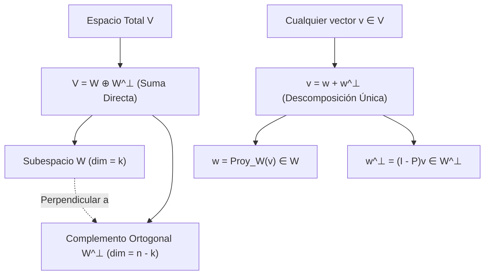
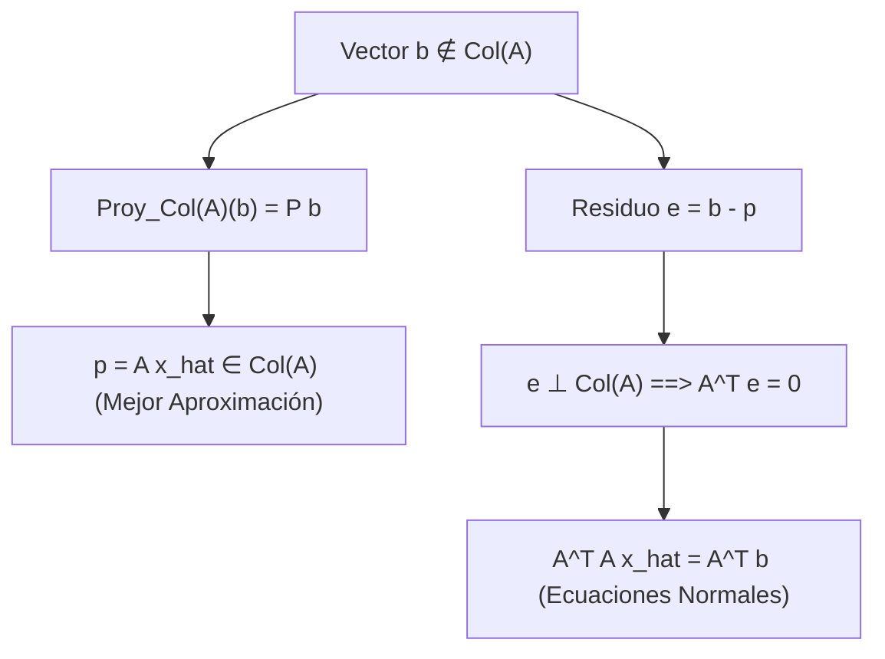
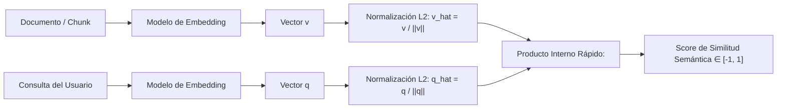

# Espacios con Producto Interno y Ortogonalidad

En un espacio vectorial abstracto (ver [[Espacios Vectoriales, Bases y Transformaciones Lineales]]), las operaciones de suma y multiplicación por escalar permiten definir combinaciones lineales y dimensión, pero carecen de conceptos métricos: no existe una noción intrínseca de **longitud**, **distancia** ni **ángulo** entre vectores.

El **producto interno** enriquece el espacio vectorial dotándolo de una geometría euclídea rigurosa. En las Ciencias de la Computación modernas, esta estructura es el cimiento de los motores de búsqueda vectorial en sistemas de generación aumentada por recuperación ([[retrival augmented generation]]), los modelos de incrustación semántica (*embeddings* en [[Procesamiento de Lenguaje Natural y Embeddings]]), los algoritmos de aproximación por mínimos cuadrados y la compresión en bases ortonormales.

> [!info] 💡 ¿Cómo entender esto desde cero? (Guía para novatos de pregrado)
> - **¿Cómo comparan las computadoras cosas del mundo real?** Si tienes dos canciones en Spotify, dos artículos de noticias o dos consultas en un buscador, la computadora las convierte en vectores numéricos.
> - **El Producto Interno como "detector de afinidad":** El producto interno (producto punto) es la operación matemática que mide qué tan alineados están dos vectores:
>   - Si apuntan en la misma dirección exacta, el producto es máximo (similitud máxima).
>   - Si son perpendiculares / **ortogonales** ($90^\circ$), el producto es $0$: **no tienen absolutamente nada que ver el uno con el otro**.
>   - Si apuntan en direcciones opuestas, el resultado es negativo (conceptos contrarios).
> - **Proyecciones y Sombras:** La proyección ortogonal es como la "sombra" que un vector proyecta sobre otro. En ingeniería de software, nos permite descomponer problemas complejos en componentes independientes que no interfieren entre sí.

---

## 1. Axiomas Formales de Producto Interno

> [!definition] Espacio con Producto Interno
> Sea $V$ un espacio vectorial sobre un cuerpo $\mathbb{K}$ (donde $\mathbb{K} = \mathbb{R}$ o $\mathbb{K} = \mathbb{C}$). Un **producto interno** (o producto escalar) en $V$ es una función:
> $$\langle \cdot, \cdot \rangle: V \times V \to \mathbb{K}$$
> que satisface los siguientes cuatro axiomas para todo $\mathbf{u}, \mathbf{v}, \mathbf{w} \in V$ y todo escalar $\alpha \in \mathbb{K}$:
> 
> 1. **Positividad Estricta (Definición Positiva):**
>    $$\langle \mathbf{v}, \mathbf{v} \rangle \ge 0, \quad \text{y} \quad \langle \mathbf{v}, \mathbf{v} \rangle = 0 \iff \mathbf{v} = \mathbf{0}$$
> 2. **Simetría Conjugada (Hermiticidad):**
>    $$\langle \mathbf{u}, \mathbf{v} \rangle = \overline{\langle \mathbf{v}, \mathbf{u} \rangle}$$
>    *(En el caso real $\mathbb{K} = \mathbb{R}$, la conjugación es trivial y se reduce a la simetría conmutativa: $\langle \mathbf{u}, \mathbf{v} \rangle = \langle \mathbf{v}, \mathbf{u} \rangle$).*
> 3. **Linealidad en el Primer Argumento (Aditividad y Homogeneidad):**
>    $$\langle \mathbf{u} + \mathbf{v}, \mathbf{w} \rangle = \langle \mathbf{u}, \mathbf{w} \rangle + \langle \mathbf{v}, \mathbf{w} \rangle$$
>    $$\langle \alpha \mathbf{u}, \mathbf{v} \rangle = \alpha \langle \mathbf{u}, \mathbf{v} \rangle$$
>    *(Nótese que por la simetría conjugada, en $\mathbb{C}$ la multiplicación en el segundo argumento extrae el conjugado: $\langle \mathbf{u}, \beta \mathbf{v} \rangle = \bar{\beta} \langle \mathbf{u}, \mathbf{v} \rangle$).*

### Norma y Distancia Métrica Inducidas
Todo producto interno induce de manera natural e incondicional:
1. **Norma inducida:** Medida de magnitud o longitud:
   $$\|\mathbf{v}\| = \sqrt{\langle \mathbf{v}, \mathbf{v} \rangle}$$
2. **Distancia métrica inducida:**
   $$d(\mathbf{u}, \mathbf{v}) = \|\mathbf{u} - \mathbf{v}\| = \sqrt{\langle \mathbf{u} - \mathbf{v}, \mathbf{u} - \mathbf{v} \rangle}$$
   haciendo de $(V, d)$ un espacio métrico (y si es completo, un **Espacio de Hilbert**).

### Ejemplos en Computación
- **Producto punto euclídeo en $\mathbb{R}^n$:** $\langle \mathbf{u}, \mathbf{v} \rangle = \mathbf{u}^T \mathbf{v} = \sum_{i=1}^n u_i v_i$.
- **Producto interno de Frobenius en matrices $\mathbb{R}^{m \times n}$:** $\langle A, B \rangle_F = \text{tr}(A^T B) = \sum_{i=1}^m \sum_{j=1}^n A_{ij} B_{ij}$.
- **Producto interno ponderado (Métricas de Mahalanobis):** $\langle \mathbf{u}, \mathbf{v} \rangle_W = \mathbf{u}^T W \mathbf{v}$, donde $W$ es una matriz simétrica y definida positiva ($W \succ 0$).

---

## 2. La Desigualdad de Cauchy-Schwarz y el Ángulo Abstracto

> [!theorem] Desigualdad de Cauchy-Schwarz
> Para cualquier par de vectores $\mathbf{u}, \mathbf{v}$ en un espacio con producto interno $V$:
> $$|\langle \mathbf{u}, \mathbf{v} \rangle| \le \|\mathbf{u}\| \, \|\mathbf{v}\|$$
> La igualdad se cumple si y solo si $\mathbf{u}$ y $\mathbf{v}$ son linealmente dependientes (uno es múltiplo escalar del otro).

> [!proof]- Demostración Matemática Formal (Caso Real)
> Si $\mathbf{v} = \mathbf{0}$, la desigualdad es trivialmente $0 \le 0$. Supongamos $\mathbf{v} \neq \mathbf{0}$.
> Para cualquier escalar $t \in \mathbb{R}$, definimos el vector $\mathbf{w} = \mathbf{u} + t\mathbf{v}$.
> Por el axioma de positividad del producto interno:
> $$0 \le \|\mathbf{w}\|^2 = \langle \mathbf{u} + t\mathbf{v}, \mathbf{u} + t\mathbf{v} \rangle = \langle \mathbf{u}, \mathbf{u} \rangle + 2t \langle \mathbf{u}, \mathbf{v} \rangle + t^2 \langle \mathbf{v}, \mathbf{v} \rangle$$
> Sea $p(t) = a t^2 + b t + c \ge 0$, con:
> $$a = \|\mathbf{v}\|^2 > 0, \quad b = 2\langle \mathbf{u}, \mathbf{v} \rangle, \quad c = \|\mathbf{u}\|^2$$
> Como $p(t)$ es un polinomio cuadrático no negativo para todo $t \in \mathbb{R}$, su gráfica no cruza el eje de abscisas, lo que exige que su discriminante $\Delta = b^2 - 4ac$ sea menor o igual a cero:
> $$\Delta = (2\langle \mathbf{u}, \mathbf{v} \rangle)^2 - 4 \|\mathbf{v}\|^2 \|\mathbf{u}\|^2 \le 0$$
> $$4 \langle \mathbf{u}, \mathbf{v} \rangle^2 \le 4 \|\mathbf{u}\|^2 \|\mathbf{v}\|^2 \implies |\langle \mathbf{u}, \mathbf{v} \rangle| \le \|\mathbf{u}\| \|\mathbf{v}\|. \quad \blacksquare$$

### Definición Rigurosa de Ángulo en Espacios Abstractos
Gracias a la desigualdad de Cauchy-Schwarz:
$$-1 \le \frac{\langle \mathbf{u}, \mathbf{v} \rangle}{\|\mathbf{u}\| \|\mathbf{v}\|} \le 1$$
Podemos definir unívocamente el **ángulo** $\theta \in [0, \pi]$ entre dos vectores no nulos cualesquiera mediante:
$$\cos \theta = \frac{\langle \mathbf{u}, \mathbf{v} \rangle}{\|\mathbf{u}\| \|\mathbf{v}\|}$$

---

## 3. Ortogonalidad y Teorema de Pitágoras Generalizado

> [!definition] Ortogonalidad
> Dos vectores $\mathbf{u}, \mathbf{v} \in V$ son **ortogonales** (denotado $\mathbf{u} \perp \mathbf{v}$) si su producto interno es nulo:
> $$\langle \mathbf{u}, \mathbf{v} \rangle = 0$$

> [!theorem] Teorema de Pitágoras Generalizado
> Sean $\mathbf{u}, \mathbf{v} \in V$. Si $\mathbf{u} \perp \mathbf{v}$, entonces:
> $$\|\mathbf{u} + \mathbf{v}\|^2 = \|\mathbf{u}\|^2 + \|\mathbf{v}\|^2$$
> Por inducción, si $\{\mathbf{v}_1, \mathbf{v}_2, \dots, \mathbf{v}_k\}$ es un conjunto ortogonal por pares:
> $$\left\| \sum_{i=1}^k \mathbf{v}_i \right\|^2 = \sum_{i=1}^k \|\mathbf{v}_i\|^2$$

### Conjuntos Ortonormales y Coordenadas de Fourier
Un conjunto de vectores $\{\mathbf{q}_1, \mathbf{q}_2, \dots, \mathbf{q}_k\}$ es **ortonormal** si satisface:
$$\langle \mathbf{q}_i, \mathbf{q}_j \rangle = \delta_{ij} = \begin{cases} 1 & \text{si } i = j \\ 0 & \text{si } i \neq j \end{cases}$$
- Todo conjunto ortonormal es **linealmente independiente**.
- Si $\mathcal{B} = \{\mathbf{q}_1, \dots, \mathbf{q}_n\}$ es una base ortonormal de $V$, el cálculo del vector de coordenadas se simplifica de resolver un sistema lineal $O(n^3)$ a realizar simples productos internos $O(n)$ (**Coeficientes de Fourier**):
  $$\mathbf{x} = \sum_{i=1}^n \langle \mathbf{x}, \mathbf{q}_i \rangle \mathbf{q}_i$$

---

## 4. Descomposición Ortogonal de Subespacios

> [!definition] Complemento Ortogonal
> Sea $W \le V$ un subespacio vectorial. El **complemento ortogonal** de $W$, denotado $W^\perp$, es el conjunto de todos los vectores de $V$ que son perpendiculares a cada vector de $W$:
> $$W^\perp = \{\mathbf{v} \in V \mid \langle \mathbf{v}, \mathbf{w} \rangle = 0, \; \forall \mathbf{w} \in W\} \le V$$



> [!theorem] Teorema de la Descomposición Ortogonal
> Sea $W$ un subespacio de dimensión finita de $V$. Entonces $V$ es la suma directa ortogonal de $W$ y $W^\perp$:
> $$V = W \oplus W^\perp$$
> Esto implica que todo vector $\mathbf{v} \in V$ admite una representación **única** como:
> $$\mathbf{v} = \mathbf{w} + \mathbf{w}^\perp, \quad \text{donde } \mathbf{w} \in W \quad \text{y} \quad \mathbf{w}^\perp \in W^\perp$$
> Además, $\dim(V) = \dim(W) + \dim(W^\perp)$ y $(W^\perp)^\perp = W$.

---

## 5. El Proceso de Gram-Schmidt: CGS vs. MGS

El algoritmo de Gram-Schmidt toma una base arbitraria $\{\mathbf{v}_1, \dots, \mathbf{v}_k\}$ de un subespacio $W$ y genera recursivamente una base ortonormal $\{\mathbf{q}_1, \dots, \mathbf{q}_k\}$.

### Gram-Schmidt Clásico (CGS)
Para cada vector $k$:
$$\mathbf{u}_k = \mathbf{v}_k - \sum_{j=1}^{k-1} \frac{\langle \mathbf{v}_k, \mathbf{u}_j \rangle}{\|\mathbf{u}_j\|^2} \mathbf{u}_j, \quad \mathbf{q}_k = \frac{\mathbf{u}_k}{\|\mathbf{u}_k\|}$$
*Deficiencia numérica:* En precisión finita de máquina, si los vectores originales son casi colineales, restar términos proyectados contra vectores no normalizados causa **cancelación catastrófica**, perdiendo la ortogonalidad entre los vectores finales ($\langle \mathbf{q}_i, \mathbf{q}_j \rangle \gg 10^{-16}$).

### Gram-Schmidt Modificado (MGS) - Estabilizado Numéricamente
En lugar de restar todas las proyecciones en una única suma, MGS actualiza los vectores residuales sucesivamente paso a paso:

```text
Para k = 1 hasta n:
    q_k = v_k / ||v_k||
    Para j = k+1 hasta n:
        v_j = v_j - <v_j, q_k> * q_k   // Proyección y deflación inmediata
```

MGS es algebraicamente equivalente a CGS en aritmética exacta, pero numéricamente es exponencialmente más estable frente a errores de redondeo en punto flotante.

---

## 6. Proyecciones Ortogonales y Mínimos Cuadrados Lineales

### Operador de Proyección Matricial
Sea $A \in \mathbb{R}^{m \times n}$ con columnas linealmente independientes ($m > n$). Deseamos proyectar ortogonalmente cualquier vector $\mathbf{b} \in \mathbb{R}^m$ sobre el subespacio columna $W = \text{Col}(A)$.

La proyección $\mathbf{p} = A\hat{\mathbf{x}} \in \text{Col}(A)$ debe satisfacer que el error $\mathbf{e} = \mathbf{b} - \mathbf{p}$ pertenezca al complemento ortogonal $\text{Col}(A)^\perp = \ker(A^T)$:
$$A^T (\mathbf{b} - A\hat{\mathbf{x}}) = \mathbf{0} \iff A^T A \hat{\mathbf{x}} = A^T \mathbf{b} \quad \text{(Ecuaciones Normales)}$$
Como $A$ tiene rango completo de columnas, $A^T A \in \mathbb{R}^{n \times n}$ es simétrica y definida positiva (SSPD), por lo tanto invertible:
$$\hat{\mathbf{x}} = (A^T A)^{-1} A^T \mathbf{b}$$



Sustituyendo $\hat{\mathbf{x}}$ en $\mathbf{p} = A\hat{\mathbf{x}}$:
$$\mathbf{p} = P \mathbf{b}, \quad \text{donde} \quad P = A(A^T A)^{-1} A^T \in \mathbb{R}^{m \times m}$$

> [!important] Propiedades de la Matriz de Proyección $P$
> 1. **Idempotencia:** $P^2 = P$ (proyectar un vector ya proyectado no cambia nada).
> 2. **Simetría:** $P^T = P$ (garantiza que la proyección sea estrictamente ortogonal).
> 3. **Proyección complementaria:** $I - P$ proyecta sobre el complemento ortogonal $\text{Col}(A)^\perp$.

---

## 7. Conexiones con Ciencias de la Computación

### A. Similitud de Coseno en Búsqueda Vectorial y RAG ([[retrival augmented generation]])
En arquitecturas RAG y bases de datos vectoriales (como se analiza en [[Procesamiento de Lenguaje Natural y Embeddings]] y [[retrival augmented generation]]), los documentos y consultas se transforman en *embeddings* densos de alta dimensión $\mathbf{u}, \mathbf{v} \in \mathbb{R}^d$ ($d \in [384, 1536]$).

La similitud semántica se mide a través del coseno del ángulo entre los vectores:
$$\text{sim}_{\cos}(\mathbf{u}, \mathbf{v}) = \frac{\langle \mathbf{u}, \mathbf{v} \rangle}{\|\mathbf{u}\|_2 \|\mathbf{v}\|_2} = \frac{\mathbf{u}^T \mathbf{v}}{\|\mathbf{u}\|_2 \|\mathbf{v}\|_2}$$

- **Optimización de Hardware en Producción:**
  Normalizar los vectores previamente de modo que $\|\mathbf{u}\|_2 = \|\mathbf{v}\|_2 = 1$ convierte la costosa similitud de coseno en un **producto punto directo**:
  $$\text{sim}_{\cos}(\hat{\mathbf{u}}, \hat{\mathbf{v}}) = \hat{\mathbf{u}}^T \hat{\mathbf{v}}$$
  y relaciona analíticamente el producto punto con la distancia euclídea:
  $$\|\hat{\mathbf{u}} - \hat{\mathbf{v}}\|_2^2 = \|\hat{\mathbf{u}}\|_2^2 + \|\hat{\mathbf{v}}\|_2^2 - 2 \langle \hat{\mathbf{u}}, \hat{\mathbf{v}} \rangle = 2(1 - \cos\theta)$$
  Esto permite a motores de búsqueda vectorial (FAISS, HNSW, Annoy) indexar mediante árboles métricos y acelerar las consultas utilizando instrucciones vectoriales SIMD (AVX-512) y núcleos Tensor de GPU.



### B. Algoritmos de Clustering Esférico (Spherical $K$-Means)
En agrupamiento de texto no supervisado, la longitud del vector a menudo representa el número de palabras del documento (frecuencia bruta), lo cual introduce sesgo.
El algoritmo de $K$-Means esférico proyecta todos los datos a la hiperesfera unitaria $S^{d-1}$ y utiliza la métrica de ortogonalidad y producto interno para reasignar centroides:
$$\mathbf{c}_k^{(t+1)} = \frac{\sum_{\mathbf{x} \in C_k} \mathbf{x}}{\left\| \sum_{\mathbf{x} \in C_k} \mathbf{x} \right\|_2}$$
asegurando que los clústeres representen cercanía conceptual y temática pura, inmunes a variaciones en la longitud del texto.

---

## 8. Síntesis de Conceptos y Fórmulas Clave

| Concepto | Expresión Matemática | Rol en Ciencias de la Computación |
| :--- | :--- | :--- |
| **Producto Interno** | $\langle \mathbf{u}, \mathbf{v} \rangle$ | Métrica fundamental para distancias y correlaciones |
| **Cauchy-Schwarz** | $|\langle \mathbf{u}, \mathbf{v} \rangle| \le \|\mathbf{u}\| \|\mathbf{v}\|$ | Acotamiento de scores de atención y métricas |
| **Similitud Coseno** | $\cos\theta = \frac{\mathbf{u}^T \mathbf{v}}{\|\mathbf{u}\| \|\mathbf{v}\|}$ | Recuperación semántica en RAG, LLMs y NLP |
| **Descomposición Ortogonal** | $V = W \oplus W^\perp$ | Separación de señal y ruido en procesamiento de señales |
| **Gram-Schmidt Modificado** | $v_j \leftarrow v_j - \langle v_j, q_k \rangle q_k$ | Generación de bases QR estables numéricamente |
| **Proyector Ortogonal** | $P = A(A^T A)^{-1} A^T$ | Regresión lineal y mínimos cuadrados en ML |