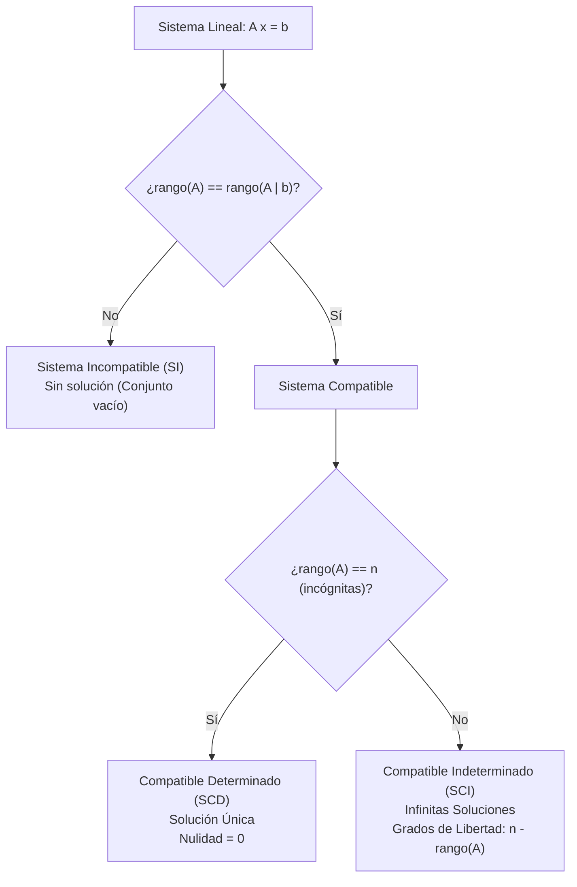
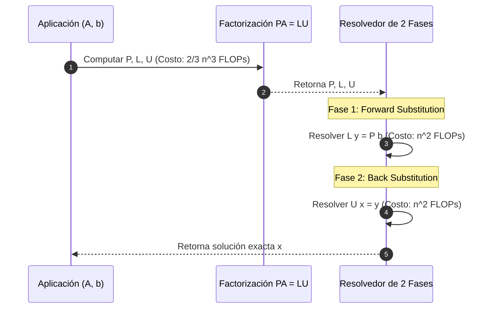
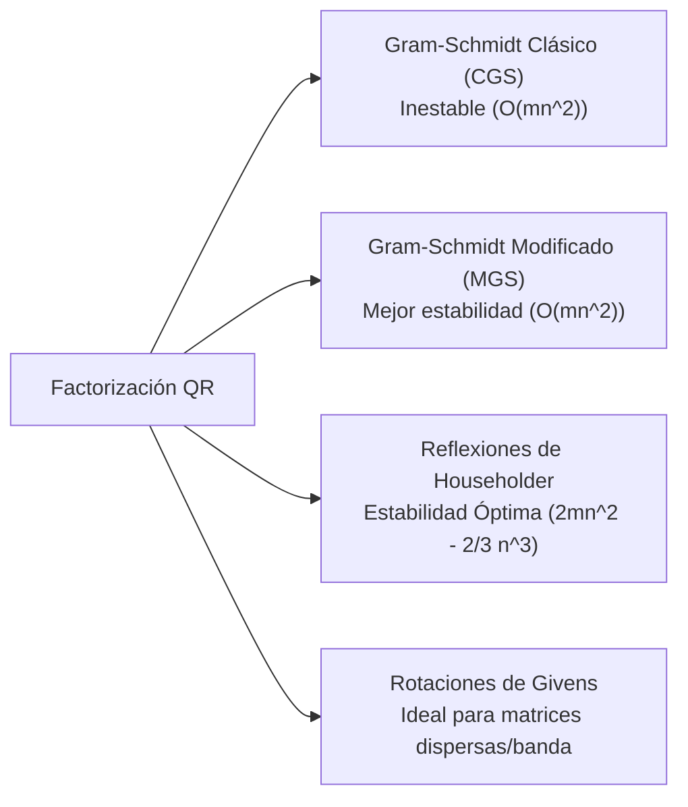

# Sistemas de Ecuaciones Lineales y Factorizaciones Matriciales

En la computación científica e ingeniería, la resolución eficiente de sistemas de ecuaciones lineales de la forma $A\mathbf{x} = \mathbf{b}$ constituye el cuello de botella computacional de problemas como simulación de física en tiempo real, renderizado de iluminación global (radiosidad), optimización convexa, balance de redes y entrenamiento de modelos lineales.

Calcular la matriz inversa explícita $A^{-1}$ es numéricamente inestable y computacionalmente prohibitivo. En su lugar, el paradigma estándar en Ciencias de la Computación consiste en **descomponer (factorizar)** la matriz de coeficientes en productos de matrices con estructuras triangulares u ortogonales canónicas.

> [!info] 💡 ¿Cómo entender esto desde cero? (Guía para novatos de pregrado)
> - **El problema real:** Resolver $Ax = b$ es encontrar qué valores desconocidos ($x$) cumplen muchas condiciones al mismo tiempo. Por ejemplo, en una red eléctrica, en el balance financiero de una empresa o en la simulación de físicas.
> - **¿Por qué no usamos simplemente la regla de Cramer o la inversa $A^{-1}$?** Porque calcular $A^{-1}$ a mano en una matriz de $1000 	imes 1000$ requeriría más operaciones que átomos hay en el universo y sufriría de errores de redondeo masivos.
> - **La solución inteligente (Factorizaciones):** En lugar de atacar la matriz $A$ directamente, la "descomponemos" en matrices triangulares más fáciles de digerir:
>   - **Factorización LU:** Divide $A$ en una matriz triangular inferior ($L$, Lower) y una superior ($U$, Upper). Resolver un sistema triangular es pan comido (sustitución hacia adelante y hacia atrás), reduciendo el tiempo de cálculo de horas a microsegundos.
>   - **Factorización de Cholesky:** Si la matriz es simétrica y "bien portada" (definida positiva), Cholesky es una versión de LU el doble de rápida y que no falla nunca por inestabilidad.
>   - **Factorización QR:** Convierte la matriz en una base ortogonal ($Q$) y una triangular ($R$), indispensable para mínimos cuadrados y algoritmos de optimización.

---

## 1. El Teorema de Rouché-Frobenius y Clasificación de Sistemas

Consideremos un sistema lineal general de $m$ ecuaciones con $n$ incógnitas sobre $\mathbb{R}$:
$$A\mathbf{x} = \mathbf{b}$$
donde $A \in \mathbb{R}^{m \times n}$ es la matriz de coeficientes, $\mathbf{x} \in \mathbb{R}^n$ es el vector de incógnitas y $\mathbf{b} \in \mathbb{R}^m$ es el vector de términos independientes. La **matriz ampliada** del sistema se denota:
$$(A \mid \mathbf{b}) \in \mathbb{R}^{m \times (n+1)}$$

> [!theorem] Teorema de Rouché-Frobenius (Kronecker-Capelli)
> El sistema de ecuaciones lineales $A\mathbf{x} = \mathbf{b}$ es **compatible** (admite al menos una solución) si y solo si el vector $\mathbf{b}$ pertenece al espacio columna de $A$ ($\mathbf{b} \in \text{Col}(A)$), lo cual equivale a la igualdad de rangos:
> $$\text{rango}(A) = \text{rango}(A \mid \mathbf{b}) = r$$
> 
> Clasificación formal:
> 1. **Sistema Incompatible (SI):**
>    $$\text{rango}(A) < \text{rango}(A \mid \mathbf{b})$$
>    No existe ningún vector $\mathbf{x} \in \mathbb{R}^n$ que satisfaga el sistema.
> 2. **Sistema Compatible Determinado (SCD):**
>    $$\text{rango}(A) = \text{rango}(A \mid \mathbf{b}) = n$$
>    Existe una **única solución** $\mathbf{x}^* \in \mathbb{R}^n$. El núcleo de $A$ es trivial ($\ker(A) = \{\mathbf{0}\}$).
> 3. **Sistema Compatible Indeterminado (SCI):**
>    $$\text{rango}(A) = \text{rango}(A \mid \mathbf{b}) = r < n$$
>    Existen **infinitas soluciones**. El conjunto solución es una variedad afín de dimensión $k = n - r$, donde $k$ representa el número de **variables libres** o **grados de libertad**:
>    $$\mathcal{S} = \mathbf{x}_p + \ker(A) = \{\mathbf{x}_p + \sum_{i=1}^{n-r} c_i \mathbf{v}_i \mid c_i \in \mathbb{R}\}$$
>    siendo $\mathbf{x}_p$ una solución particular y $\{\mathbf{v}_1, \dots, \mathbf{v}_{n-r}\}$ una base de $\ker(A)$.

---

## 2. Eliminación Gaussiana y Gauss-Jordan: Estabilidad Numérica

El algoritmo clásico transforma la matriz ampliada en una forma escalonada mediante **operaciones elementales por fila**:
1. $R_i \leftrightarrow R_j$: Permutación de filas.
2. $R_i \leftarrow c R_i$ ($c \neq 0$): Escalado de una fila.
3. $R_i \leftarrow R_i + c R_j$: Eliminación lineal.

### Formas Canónicas
- **Forma Escalonada por Filas (REF - Row Echelon Form):** Los pivotes (primer elemento no nulo de cada fila) avanzan estrictamente a la derecha y las filas de ceros se ubican al final. Permite resolver por sustitución regresiva (*back-substitution*).
- **Forma Escalonada Reducida por Filas (RREF - Reduced Row Echelon Form):** Los pivotes son 1 y son los únicos elementos no nulos de sus respectivas columnas (Eliminación Gauss-Jordan).

### Pivoteo Parcial y Estabilidad Numérica en Punto Flotante

En hardware real bajo el estándar IEEE 754 (doble precisión `float64`), un pivote cercano a cero produce divisiones catastróficas y amplificación masiva de errores por redondeo.

> [!important] Estrategia de Pivoteo Parcial (Partial Pivoting)
> En el paso $k$ de la eliminación gaussiana, antes de anular los elementos debajo del pivote $a_{kk}^{(k)}$, se busca el elemento de mayor magnitud absoluta en la columna $k$ desde la fila $k$ hasta la fila $n$:
> $$p = \arg\max_{i \in \{k, \dots, n\}} |a_{ik}^{(k)}|$$
> Si $p \neq k$, se intercambian las filas $k$ y $p$.
> Esto garantiza que los multiplicadores elementales satisfagan:
> $$|m_{ik}| = \left| \frac{a_{ik}^{(k)}}{a_{kk}^{(k)}} \right| \le 1, \quad \forall i > k$$
> acotando el factor de crecimiento del error hacia adelante (*forward error growth*).

---

## 3. Factorización LU ($A = LU$ y $PA = LU$)

La factorización LU descompone una matriz invertible $A \in \mathbb{R}^{n \times n}$ en el producto de una matriz triangular inferior unitaria $L$ (*Lower triangular*) y una matriz triangular superior $U$ (*Upper triangular*).

### Deducción Paso a Paso
Cada paso de la eliminación gaussiana equivale a multiplicar por la izquierda por una matriz elemental $E_k$:
$$E_{n-1} \cdots E_2 E_1 A = U$$
donde cada $E_k$ es de la forma:
$$E_k = I - \mathbf{m}_k \mathbf{e}_k^T, \quad \text{con } \mathbf{m}_k = (0, \dots, 0, m_{k+1, k}, \dots, m_{n, k})^T$$
Invertir cada matriz elemental es trivial: $E_k^{-1} = I + \mathbf{m}_k \mathbf{e}_k^T$. Dado que los multiplicadores no se solapan, la inversa del producto es simplemente la unión directa de los multiplicadores:
$$L = E_1^{-1} E_2^{-1} \cdots E_{n-1}^{-1} = \begin{pmatrix} 1 & 0 & \dots & 0 \\ m_{21} & 1 & \dots & 0 \\ \vdots & \vdots & \ddots & \vdots \\ m_{n1} & m_{n2} & \dots & 1 \end{pmatrix}$$
Así obtenemos:
$$A = L U$$

### Factorización con Pivoteo Parcial ($PA = LU$)
En presencia de intercambios de fila representados por una matriz de permutación ortogonal $P$ ($P^{-1} = P^T$):
$$P A = L U$$

### Algoritmo de Resolución en Dos Fases
Para resolver $A\mathbf{x} = \mathbf{b}$, sustituimos $PA = LU$:
$$LU\mathbf{x} = P\mathbf{b}$$
1. **Sustitución hacia adelante (*Forward Substitution*):**
   Resolver el sistema triangular inferior $L\mathbf{y} = P\mathbf{b}$:
   $$y_1 = (P\mathbf{b})_1, \quad y_i = (P\mathbf{b})_i - \sum_{j=1}^{i-1} l_{ij} y_j \quad (i = 2, \dots, n)$$
2. **Sustitución hacia atrás (*Back Substitution*):**
   Resolver el sistema triangular superior $U\mathbf{x} = \mathbf{y}$:
   $$x_n = \frac{y_n}{u_{nn}}, \quad x_i = \frac{1}{u_{ii}}\left( y_i - \sum_{j=i+1}^n u_{ij} x_j \right) \quad (i = n-1, \dots, 1)$$

### Análisis de Complejidad Computacional
- **Fase de Factorización:** Requiere $\approx \frac{2}{3}n^3$ operaciones de punto flotante (FLOPs).
- **Fase de Sustitución:** Cada sustitución requiere $n^2$ FLOPs; en total $2n^2 \in O(n^2)$.
- **Ventaja en Ingeniería:** Si se debe resolver $A\mathbf{x} = \mathbf{b}_k$ para $k$ vectores de carga distintos (p. ej., múltiples fotogramas de animación o múltiples fuentes eléctricas), se factoriza **una sola vez** ($O(n^3)$) y cada nuevo vector se resuelve en tiempo cuadrático ultrarrápido ($O(n^2)$).

---

## 4. Factorización de Cholesky ($A = L L^T$)

> [!definition] Matriz Simétrica y Definida Positiva (SSPD)
> Una matriz $A \in \mathbb{R}^{n \times n}$ es simétrica y definida positiva si:
> 1. $A = A^T$ (Simetría).
> 2. $\forall \mathbf{x} \in \mathbb{R}^n \setminus \{\mathbf{0}\}, \quad \mathbf{x}^T A \mathbf{x} > 0$.

> [!theorem] Teorema de Descomposición de Cholesky
> Si $A$ es una matriz real, simétrica y definida positiva, existe una **única** matriz triangular inferior $L$ con elementos diagonales estrictamente positivos ($l_{ii} > 0$) tal que:
> $$A = L L^T$$

### Deducción Formal de los Elementos de $L$
Multiplicando fila por columna en $A = L L^T$:
$$a_{ij} = \sum_{k=1}^n l_{ik} (L^T)_{kj} = \sum_{k=1}^j l_{ik} l_{jk} \quad (\text{para } i \ge j)$$
Despejando analíticamente:
1. **Elementos Diagonales ($i = j$):**
   $$a_{jj} = \sum_{k=1}^{j-1} l_{jk}^2 + l_{jj}^2 \implies l_{jj} = \sqrt{a_{jj} - \sum_{k=1}^{j-1} l_{jk}^2}$$
   *(La cantidad subradical es siempre estrictamente positiva debido a la definición positiva de $A$)*.
2. **Elementos Subdiagonales ($i > j$):**
   $$a_{ij} = \sum_{k=1}^{j-1} l_{ik} l_{jk} + l_{ij} l_{jj} \implies l_{ij} = \frac{1}{l_{jj}} \left( a_{ij} - \sum_{k=1}^{j-1} l_{ik} l_{jk} \right)$$

### Propiedades y Rendimiento
- **Estabilidad Numérica Incondicional:** No requiere pivoteo. Los elementos de $L$ están intrínsecamente acotados: $|l_{ij}| \le \sqrt{a_{ii}}$.
- **Eficiencia:** Requiere $\approx \frac{1}{3}n^3$ FLOPs ($\approx \frac{1}{6}n^3$ multiplicaciones y sumas). Es **exactamente el doble de rápida** que la factorización LU y consume la mitad de memoria al almacenar únicamente el triángulo inferior.
- **Detección:** Si en algún paso el argumento de la raíz cuadrada es $\le 0$, el algoritmo certifica de inmediato que la matriz **no** es definida positiva.

---

## 5. Factorización QR ($A = QR$)

> [!theorem] Teorema de Factorización QR
> Para cualquier matriz $A \in \mathbb{R}^{m \times n}$ con $m \ge n$, existen una matriz ortogonal $Q \in \mathbb{R}^{m \times m}$ ($Q^T Q = I_m$) y una matriz triangular superior $R \in \mathbb{R}^{m \times n}$ tal que:
> $$A = Q R = \begin{pmatrix} Q_1 & Q_2 \end{pmatrix} \begin{pmatrix} R_1 \\ \mathbf{0} \end{pmatrix} = Q_1 R_1$$
> donde $Q_1 \in \mathbb{R}^{m \times n}$ tiene columnas ortonormales y $R_1 \in \mathbb{R}^{n \times n}$ es triangular superior invertible (QR delgada o *thin QR*).

### Métodos de Cálculo Numérico

1. **Gram-Schmidt Modificado (MGS):** Ortogonaliza cada vector residual proyectándolo sucesivamente contra los vectores ya normalizados, minimizando el error de pérdida de ortogonalidad (ver [[Espacios con Producto Interno y Ortogonalidad]]).
2. **Reflectores de Householder:** Transforma columnas completas a múltiplos de vectores canónicos $\mathbf{e}_1$ mediante reflexiones ortogonales:
   $$H = I - 2 \frac{\mathbf{v}\mathbf{v}^T}{\mathbf{v}^T\mathbf{v}}$$
   Es la implementación estándar en librerías de producción (LAPACK, Eigen, PyTorch) debido a que preserva la ortogonalidad hasta la precisión de máquina.
3. **Rotaciones de Givens:** Aplica rotaciones en planos 2D para anular elementos individuales selectivos; óptimo para paralelización y matrices dispersas.

### Resolución de Mínimos Cuadrados mediante QR
Dado un sistema sobredeterminado $A\mathbf{x} \approx \mathbf{b}$ con $m > n$:
$$A\mathbf{x} = \mathbf{b} \iff Q R \mathbf{x} = \mathbf{b} \iff R\mathbf{x} = Q^T \mathbf{b}$$
La solución óptima en norma 2 se obtiene resolviendo directamente el sistema triangular superior:
$$R_1 \hat{\mathbf{x}} = Q_1^T \mathbf{b}$$
sin calcular las ecuaciones normales $A^T A$, evitando duplicar el número de condición ($\kappa(A^T A) = \kappa(A)^2$).

---

## 6. Métodos Directos vs. Métodos Iterativos en Sistemas Dispersos (*Sparse*)

En problemas a gran escala de Ciencias de la Computación (física computacional, simulación de fluidos por ecuaciones de Navier-Stokes, optimización en grafos web masivos), la matriz $A$ posee dimensiones $n > 10^7$, pero con menos del $0.01\%$ de entradas no nulas (**matrices dispersas** o *sparse*).

| Criterio | Métodos Directos (LU, Cholesky, QR) | Métodos Iterativos (Jacobi, Gauss-Seidel, CG) |
| :--- | :--- | :--- |
| **Complejidad Temporal** | $O(n^3)$ denso | $O(k \cdot \text{nnz}(A))$ donde $k \ll n$ iteraciones |
| **Complejidad Espacial** | Sufre de *fill-in* (las entradas cero se vuelven no nulas) | $O(\text{nnz}(A))$ estricto usando CSR/CSC |
| **Precisión** | Exacta (hasta errores de redondeo) | Aproximada (controlada por tolerancia $\epsilon$) |
| **Tolerancia a Escala** | Falla por memoria cuando $n > 10^5$ | Escala a $n > 10^8$ en clústeres distribuidos |

### Los Métodos de Jacobi y Gauss-Seidel

Descomponiendo $A = D + L + U$ (diagonal $D$, triangular inferior estricta $L$, triangular superior estricta $U$):

- **Método de Jacobi (Paralelizable en GPU):**
  Despeja $x_i$ usando únicamente los valores del paso temporal anterior:
  $$\mathbf{x}^{(k+1)} = D^{-1}\left( \mathbf{b} - (L + U)\mathbf{x}^{(k)} \right)$$
  $$x_i^{(k+1)} = \frac{1}{a_{ii}}\left( b_i - \sum_{j \neq i} a_{ij} x_j^{(k)} \right)$$
  Al no tener dependencias cruzadas en el mismo paso $k+1$, los núcleos CUDA pueden actualizar todos los $x_i$ en paralelo masivo.

- **Método de Gauss-Seidel (Convergencia más Rápida):**
  Utiliza de inmediato las componentes recién calculadas en el mismo paso:
  $$\mathbf{x}^{(k+1)} = (D + L)^{-1}\left( \mathbf{b} - U\mathbf{x}^{(k)} \right)$$
  $$x_i^{(k+1)} = \frac{1}{a_{ii}}\left( b_i - \sum_{j < i} a_{ij} x_j^{(k+1)} - \sum_{j > i} a_{ij} x_j^{(k)} \right)$$

### Condición de Convergencia
Ambos métodos convergen para cualquier vector inicial $\mathbf{x}^{(0)}$ si la matriz $A$ es **estrictamente dominante por diagonales**:
$$|a_{ii}| > \sum_{j \neq i} |a_{ij}|, \quad \forall i \in \{1, \dots, n\}$$
o equivalentemente si el radio espectral de la matriz de iteración satisface $\rho(M) < 1$.

---

## 7. Tabla Resumen de Complejidad y Selección de Algoritmos

| Descomposición | Restricciones de $A$ | Costo de Factorización | Costo de Resolución | Caso de Uso Primario en CS |
| :--- | :--- | :--- | :--- | :--- |
| **LU ($PA = LU$)** | Cuadrada, invertible | $\approx \frac{2}{3}n^3$ FLOPs | $2n^2$ FLOPs | Sistemas densos generales, cálculo de determinantes |
| **Cholesky ($LL^T$)** | Simétrica, Definida Positiva | $\approx \frac{1}{3}n^3$ FLOPs | $2n^2$ FLOPs | Filtros de Kalman, Procesos Gaussianos, Simulación FEM |
| **QR ($QR$)** | Rectangular $m \ge n$ | $\approx 2mn^2 - \frac{2}{3}n^3$ | $2n^2$ FLOPs | Regresión de mínimos cuadrados numéricamente robusta |
| **Gradiente Conjugado** | Simétrica, Definida Positiva | $0$ (sin descomposición) | $O(k \cdot \text{nnz}(A))$ | Simulación física 3D en tiempo real (mallas de tela/fluidos) |