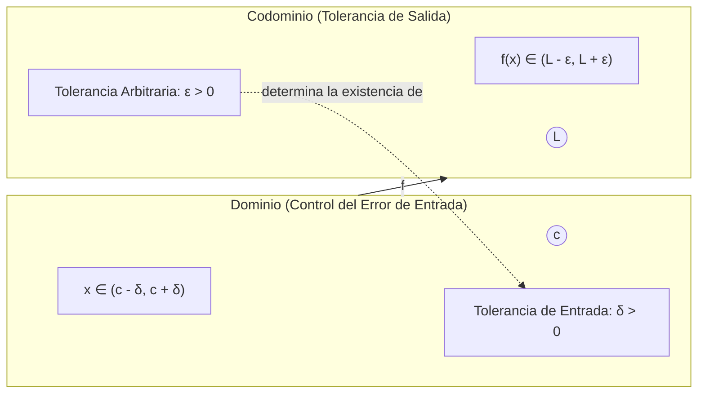
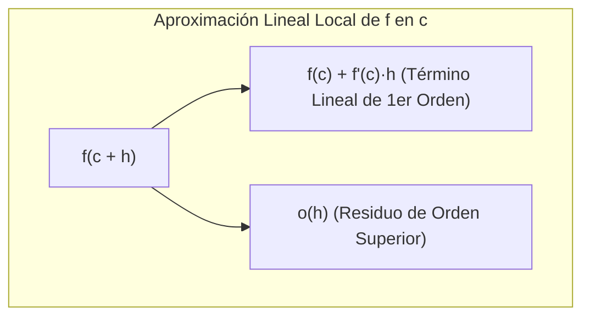
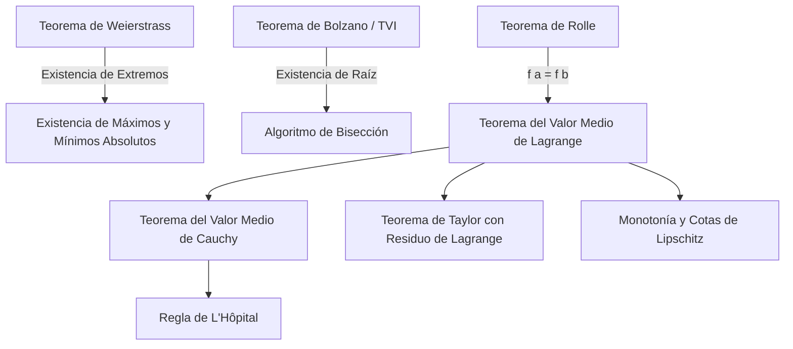
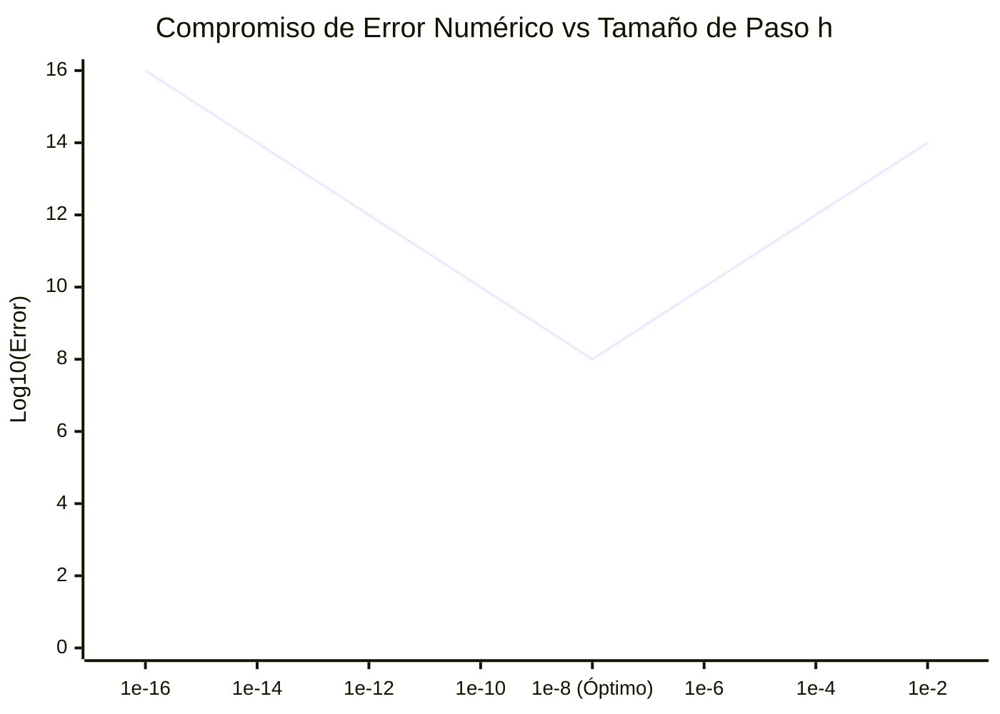
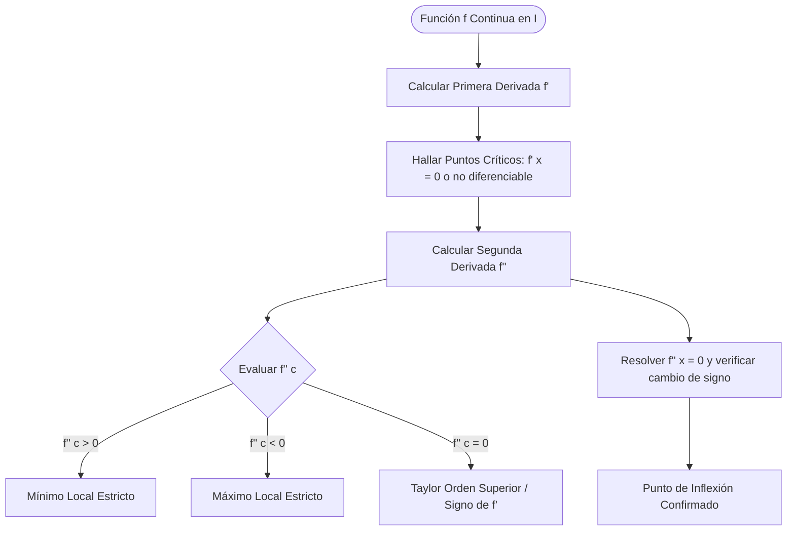

# Cálculo Diferencial y Teoremas Fundamentales

En la formación de un Ingeniero en Ciencias de la Computación de la Escuela Politécnica Nacional, el **Cálculo Diferencial** no es un mero recetario algebraico de reglas mecánicas de derivación, sino el lenguaje analítico y axiomático riguroso que modela la **tasa de cambio local**, la **sensibilidad de sistemas dinámicos**, la **aproximación óptima lineal y polinomial de operadores no lineales**, y la **complejidad de algoritmos de optimización continua**.

Esta nota establece las bases analíticas del Cálculo en una variable, partiendo de la topología métrica de $\mathbb{R}$, transitando por la formulación de Weierstrass, y coronando con los teoremas fundamentales del análisis real que garantizan la convergencia, exactitud y estabilidad de los algoritmos computacionales modernos.

> [!info] 💡 ¿Cómo entender esto desde cero? (Guía para novatos de pregrado)
> - **La gran idea del Cálculo Diferencial:** El álgebra tradicional solo sirve para cosas estáticas (velocidad fija, precios fijos). Pero en el mundo real todo cambia continuamente. La **derivada** es simplemente la herramienta para medir **la tasa de cambio instantánea**.
> - **Analogía del velocímetro:** Si viajas de Quito a Guayaquil en 8 horas, tu velocidad promedio fue de unos $50	ext{ km/h}$. Pero eso no te dice si en una curva ibas a $20	ext{ km/h}$ o en la autopista a $110	ext{ km/h}$. El velocímetro de tu auto es la derivada: te dice qué está pasando en un intervalo de tiempo infinitamente pequeño ($dt 	o 0$).
> - **¿Por qué importan los teoremas (Bolzano, Rolle, Lagrange)?**
>   - **Bolzano:** Si una curva continua empieza bajo el agua y termina sobre el agua, forzosamente tuvo que cruzar la superficie (raíz de una ecuación). ¡Es la base del algoritmo de bisección en computación!
>   - **Series de Taylor:** Las computadoras por dentro solo saben sumar y multiplicar. ¿Cómo calcula tu CPU $\sin(x)$, $\cos(x)$ o $e^x$? ¡Usando polinomios de Taylor para aproximarlos con sumas y multiplicaciones casi instantáneas!

---

## 1. Definición Analítica Rigurosa de Límite y Continuidad

### 1.1 Topología Métrica de $\mathbb{R}$ y Puntos de Acumulación

Para formular el concepto de límite sin ambigüedades circulares, se dota a la recta real $\mathbb{R}$ de la métrica euclidiana inducida por el valor absoluto $d(x, y) = |x - y|$.

> [!note] Definición 1.1: Bola Abierta (Entorno Simétrico)
> Dado $c \in \mathbb{R}$ y un radio $\varepsilon > 0$, la **bola abierta** (o $\varepsilon$-entorno) centrada en $c$ se define como:
> $$B_\varepsilon(c) = \{ x \in \mathbb{R} \mid |x - c| < \varepsilon \} = (c - \varepsilon, c + \varepsilon)$$
> La **bola perforada** o entorno reducido excluye al propio centro:
> $$B_\varepsilon^*(c) = B_\varepsilon(c) \setminus \{c\} = \{ x \in \mathbb{R} \mid 0 < |x - c| < \varepsilon \}$$

> [!important] Definición 1.2: Punto de Acumulación
> Sea $A \subseteq \mathbb{R}$. Un punto $c \in \mathbb{R}$ es un **punto de acumulación** de $A$ si para todo $\delta > 0$, la bola perforada contiene al menos un elemento de $A$:
> $$\forall \delta > 0, \quad B_\delta^*(c) \cap A \neq \emptyset$$
> El conjunto de todos los puntos de acumulación de $A$ se denota por $A'$ (conjunto derivado). Un límite $\lim_{x \to c} f(x)$ solo tiene sentido analítico si $c$ es un punto de acumulación del dominio $\operatorname{dom}(f)$.

### 1.2 Definición $\varepsilon-\delta$ de Límite (Karl Weierstrass)

> [!important] Definición 1.3: Límite Funcional de Weierstrass
> Sea $f: A \subseteq \mathbb{R} \to \mathbb{R}$ y sea $c \in A'$. Se afirma que el **límite de $f(x)$ cuando $x$ tiende a $c$ es $L \in \mathbb{R}$**, denotado como:
> $$\lim_{x \to c} f(x) = L$$
> si y solo si:
> $$\forall \varepsilon > 0, \quad \exists \delta > 0 \quad \text{tal que} \quad \forall x \in A, \; 0 < |x - c| < \delta \implies |f(x) - L| < \varepsilon$$

En términos algorítmicos y computacionales:
- $\varepsilon$ representa la **tolerancia de precisión requerida** en la salida (impuesta externamente, por ejemplo, precisión flotante IEEE 754 de 64 bits $\approx 10^{-16}$).
- $\delta$ representa el **margen de estabilidad o error admisible** en la entrada (jitter, perturbación o error de redondeo) para garantizar que la respuesta del sistema no exceda la tolerancia $\varepsilon$.

### 1.3 Continuidad Puntual y Global en Conjuntos Abiertos y Cerrados

> [!note] Definición 1.4: Continuidad Puntual
> Una función $f: A \to \mathbb{R}$ es **continua en un punto** $c \in A$ si:
> 1. Si $c \in A'$, $\lim_{x \to c} f(x) = f(c)$.
> 2. En formulación $\varepsilon-\delta$:
>    $$\forall \varepsilon > 0, \quad \exists \delta > 0 \quad \text{tal que} \quad \forall x \in A, \; |x - c| < \delta \implies |f(x) - f(c)| < \varepsilon$$
> (Nótese que en continuidad se permite $|x - c| = 0$, pues si $x = c$, $|f(c) - f(c)| = 0 < \varepsilon$).

#### Continuidad Topológica (Preimágenes de Abiertos)
En topología general, la continuidad se caracteriza globalmente sin recurrir a métricas explícitas:

> [!tip] Teorema 1.1: Caracterización Topológica de la Continuidad
> Una función $f: \mathbb{R} \to \mathbb{R}$ es continua en todo $\mathbb{R}$ si y solo si para todo conjunto abierto $U \subseteq \mathbb{R}$, la preimagen $f^{-1}(U) = \{x \in \mathbb{R} \mid f(x) \in U\}$ es un conjunto abierto en $\mathbb{R}$.
> Equivalentemente, para todo conjunto cerrado $F \subseteq \mathbb{R}$, la preimagen $f^{-1}(F)$ es cerrada.

#### Continuidad Puntual vs. Continuidad Uniforme
- **Continuidad puntual:** Para cada $x \in A$ y para cada $\varepsilon > 0$, el $\delta$ obtenido depende de ambos: $\delta = \delta(\varepsilon, x)$.
- **Continuidad uniforme:** El $\delta$ depende únicamente del umbral de precisión $\varepsilon$ y es válido para todo el dominio $A$:
  $$\forall \varepsilon > 0, \quad \exists \delta > 0 \quad \text{tal que} \quad \forall x_1, x_2 \in A, \; |x_1 - x_2| < \delta \implies |f(x_1) - f(x_2)| < \varepsilon$$

> [!important] Teorema 1.2: Teorema de Heine-Cantor
> Si $f: [a, b] \to \mathbb{R}$ es continua en un intervalo cerrado y acotado (compacto) $[a, b]$, entonces $f$ es **uniformemente continua** en $[a, b]$.
> *Impacto computacional:* Este teorema garantiza que un paso de discretización espacial o temporal uniforme $\Delta x < \delta$ es suficiente para muestrear o interpolar una señal continua sin que el error local exceda $\varepsilon$ en ningún sector del dominio.

---

## 2. La Derivada como Operador Lineal y Mejor Aproximación Lineal

### 2.1 Definición Diferencial y Formulación de Carathéodory

La derivada no es simplemente la "pendiente de la secante cuando $h \to 0$"; conceptualmente es el **coeficiente del operador lineal que mejor aproxima localmente** a una función no lineal.

> [!note] Definición 2.1: Derivada Clásica
> Sea $f: I \to \mathbb{R}$ definida en un intervalo abierto $I$, y sea $c \in I$. La derivada de $f$ en $c$ es el límite del cociente de Newton:
> $$f'(c) = \frac{df}{dx}(c) = \lim_{h \to 0} \frac{f(c + h) - f(c)}{h} = \lim_{x \to c} \frac{f(x) - f(c)}{x - c}$$
> siempre que el límite exista en $\mathbb{R}$.

> [!tip] Formulación de Carathéodory (Fundamental para Generalización Multivariable)
> Una función $f$ es diferenciable en $c$ si y solo si existe una función $\varphi: I \to \mathbb{R}$, **continua en $c$**, tal que:
> $$f(x) - f(c) = \varphi(x)(x - c), \quad \forall x \in I$$
> En dicho caso, $f'(c) = \varphi(c)$. Esta formulación evita divisiones por cero y simplifica demostraciones como la Regla de la Cadena.

### 2.2 La Mejor Aproximación Lineal Local y el Residuo Asintótico

Si definimos la función afín tangente $T_1(x) = f(c) + f'(c)(x - c)$, el error de aproximación local es $E(h) = f(c + h) - T_1(c + h)$:
$$E(h) = f(c + h) - f(c) - f'(c)h$$

Dividiendo por $h$:
$$\lim_{h \to 0} \frac{E(h)}{h} = \lim_{h \to 0} \left( \frac{f(c + h) - f(c)}{h} - f'(c) \right) = f'(c) - f'(c) = 0$$

En notación asintótica de Landau (Little-o):
$$f(c + h) = f(c) + f'(c)h + o(h) \quad \text{cuando } h \to 0$$
donde $o(h)$ representa un término que decae a cero estrictamente más rápido que $h$, esto es, $\lim_{h \to 0} \frac{o(h)}{h} = 0$.

### 2.3 Linealidad del Operador Diferencial

Sea $C^1(I)$ el espacio vectorial de las funciones continuas con primera derivada continua en $I$. El operador diferencial $D = \frac{d}{dx}$ es un operador lineal:
$$D: C^1(I) \to C^0(I)$$
que satisface los axiomas de transformación lineal:
1. **Aditividad:** $D(f + g) = Df + Dg$
2. **Homogeneidad:** $D(\alpha f) = \alpha Df, \quad \forall \alpha \in \mathbb{R}$

Propiedades de álgebra diferencial:
- **Regla de Leibniz (Producto):** $D(f \cdot g) = (Df)g + f(Dg)$
- **Regla del Cociente:** $D\left(\frac{f}{g}\right) = \frac{(Df)g - f(Dg)}{g^2} \quad \text{donde } g(x) \neq 0$
- **Regla de la Cadena (Composición):** $(g \circ f)'(c) = g'(f(c)) \cdot f'(c)$

---

## 3. Los Grandes Teoremas del Análisis Real

Los teoremas de existencia del análisis real proporcionan las garantías matemáticas indispensables sobre las que descansan los algoritmos de búsqueda, optimización y resolución de ecuaciones no lineales.

### 3.1 Teorema de Weierstrass (Teorema del Valor Extremo)

> [!important] Teorema 3.1: Teorema de Weierstrass
> Sea $K \subset \mathbb{R}$ un conjunto **compacto** (es decir, cerrado y acotado según el Teorema de Heine-Borel) no vacío, y sea $f: K \to \mathbb{R}$ una función continua. Entonces:
> 1. La imagen $f(K)$ es compacta (cerrada y acotada).
> 2. $f$ alcanza su máximo y mínimo globales en $K$. Existen puntos $x_{\min}, x_{\max} \in K$ tales que:
>    $$f(x_{\min}) \le f(x) \le f(x_{\max}), \quad \forall x \in K$$

*Demostración (Esbozo analítico):*
Por continuidad, la imagen de un conjunto compacto bajo una función continua es compacta. En $\mathbb{R}$, un conjunto compacto es cerrado y acotado. Al ser acotado superior e inferiormente, existen por el axioma del supremo: $M = \sup f(K)$ y $m = \inf f(K)$. Al ser cerrado, contiene a sus puntos de adherencia, por ende $M \in f(K)$ y $m \in f(K)$, lo que garantiza la existencia de preimágenes $x_{\max}, x_{\min} \in K$.

*Relevancia en Computación:*
En problemas de optimización de algoritmos y [[Machine Learning]], el Teorema de Weierstrass garantiza que si el espacio de parámetros admisibles es compacto y la función de costo es continua, la solución óptima **existe analíticamente** y la búsqueda de mínimos globales está bien formulada.

### 3.2 Teorema del Valor Intermedio (Bolzano)

> [!important] Teorema 3.2: Teorema del Valor Intermedio (TVI)
> Sea $f: [a, b] \to \mathbb{R}$ una función continua. Si $u$ es un valor comprendido entre $f(a)$ y $f(b)$ (es decir, $f(a) \le u \le f(b)$ o $f(b) \le u \le f(a)$), entonces existe al menos un punto $c \in [a, b]$ tal que:
> $$f(c) = u$$

> [!tip] Corolario 3.1: Teorema de Existencia de Raíces de Bolzano
> Si $f: [a, b] \to \mathbb{R}$ es continua y tiene signos opuestos en los extremos ($f(a) \cdot f(b) < 0$), entonces existe al menos un $c \in (a, b)$ tal que $f(c) = 0$.

#### Aplicación Computacional: El Algoritmo de Bisección
El Teorema de Bolzano es la base constructiva del algoritmo de bisección para hallar raíces de funciones continuas:
1. Se evalúa el punto medio $m_k = \frac{a_k + b_k}{2}$.
2. Si $f(m_k) = 0$, se halló la raíz.
3. Si $\operatorname{sign}(f(a_k)) == \operatorname{sign}(f(m_k))$, el subintervalo de búsqueda se actualiza a $[a_{k+1}, b_{k+1}] = [m_k, b_k]$; caso contrario a $[a_k, m_k]$.
- **Complejidad y Error:** Tras $n$ iteraciones, la longitud del intervalo se reduce a $\frac{b - a}{2^n}$.
  Para garantizar un error absoluto menor a $\varepsilon$:
  $$\frac{b - a}{2^n} < \varepsilon \implies n > \log_2\left(\frac{b - a}{\varepsilon}\right)$$
  Lo que demuestra la convergencia lineal global $\mathcal{O}(\log_2(1/\varepsilon))$ inmune a divisiones por cero o divergencias.

### 3.3 Teorema de Rolle

> [!important] Teorema 3.3: Teorema de Rolle
> Sea $f: [a, b] \to \mathbb{R}$ tal que:
> 1. $f$ es continua en el intervalo cerrado $[a, b]$.
> 2. $f$ es diferenciable en el intervalo abierto $(a, b)$.
> 3. $f(a) = f(b)$.
> 
> Entonces, existe al menos un punto $c \in (a, b)$ tal que $f'(c) = 0$.

*Demostración:*
Por el Teorema de Weierstrass, $f$ alcanza su máximo $M$ y mínimo $m$ en $[a, b]$.
- Caso 1: Si $M = m$, $f(x)$ es constante en $[a, b]$, luego $f'(x) = 0$ para todo $x \in (a, b)$.
- Caso 2: Si $M > m$, como $f(a) = f(b)$, al menos uno de los extremos (máximo o mínimo) se alcanza en el interior, es decir, existe $c \in (a, b)$ tal que $f(c) = M$ (o $m$).
  Por el Teorema de Fermat para extremos locales interiores, al ser $f$ diferenciable en $c$, debe cumplirse $f'(c) = 0$. $\blacksquare$

### 3.4 Teorema del Valor Medio de Lagrange (MVT)

> [!important] Teorema 3.4: Teorema del Valor Medio (MVT)
> Sea $f: [a, b] \to \mathbb{R}$ continua en $[a, b]$ y diferenciable en $(a, b)$. Entonces existe al menos un punto $c \in (a, b)$ tal que:
> $$f'(c) = \frac{f(b) - f(a)}{b - a}$$
> o equivalentemente:
> $$f(b) - f(a) = f'(c)(b - a)$$

*Demostración formal:*
Construimos la función auxiliar de desplazamiento $g: [a, b] \to \mathbb{R}$, restando a $f(x)$ la recta secante que une $(a, f(a))$ con $(b, f(b))$:
$$g(x) = f(x) - f(a) - \frac{f(b) - f(a)}{b - a}(x - a)$$
1. $g$ es continua en $[a, b]$ por ser combinación de funciones continuas.
2. $g$ es diferenciable en $(a, b)$ con $g'(x) = f'(x) - \frac{f(b) - f(a)}{b - a}$.
3. Evaluamos en los extremos:
   $$g(a) = f(a) - f(a) - 0 = 0$$
   $$g(b) = f(b) - f(a) - \frac{f(b) - f(a)}{b - a}(b - a) = 0 \implies g(a) = g(b) = 0$$
Por el Teorema de Rolle, existe $c \in (a, b)$ tal que $g'(c) = 0$:
$$0 = f'(c) - \frac{f(b) - f(a)}{b - a} \implies f'(c) = \frac{f(b) - f(a)}{b - a} \quad \blacksquare$$

#### Corolarios Fundamentales del MVT
1. **Monotonía:** Si $f'(x) \ge 0$ para todo $x \in (a, b)$, $f$ es monótona creciente en $[a, b]$.
2. **Función Constante:** Si $f'(x) = 0$ para todo $x \in (a, b)$, entonces $f(x) = C$ es constante.
3. **Continuidad Lipschitziana:** Si $|f'(x)| \le L$ para todo $x \in (a, b)$, entonces:
   $$|f(x_1) - f(x_2)| \le L |x_1 - x_2|, \quad \forall x_1, x_2 \in [a, b]$$
   Propiedad fundamental en teoría del aprendizaje automático para garantizar convergencia del gradiente descendente y evitar la explosión de gradientes.

---

## 4. Regla de L'Hôpital y el Teorema del Valor Medio de Cauchy

Para evaluar formas indeterminadas algebraicas como $\left[\frac{0}{0}\right]$ o $\left[\frac{\infty}{\infty}\right]$, se requiere una generalización geométrica del Teorema del Valor Medio a curvas paramétricas.

### 4.1 Teorema del Valor Medio Generalizado de Cauchy

> [!important] Teorema 4.1: Teorema de Cauchy
> Sean $f, g: [a, b] \to \mathbb{R}$ continuas en $[a, b]$ y diferenciables en $(a, b)$. Supongamos que $g'(x) \neq 0$ para todo $x \in (a, b)$. Entonces existe $c \in (a, b)$ tal que:
> $$\frac{f'(c)}{g'(c)} = \frac{f(b) - f(a)}{g(b) - g(a)}$$

*Demostración:*
Nótese primero que $g(b) \neq g(a)$, pues si $g(b) = g(a)$, por Rolle existiría $\xi \in (a, b)$ con $g'(\xi) = 0$, contradiciendo la hipótesis.
Definimos la función auxiliar:
$$h(x) = [g(b) - g(a)] f(x) - [f(b) - f(a)] g(x)$$
Verificamos que $h(a) = g(b)f(a) - f(b)g(a) = h(b)$. Por el Teorema de Rolle, existe $c \in (a, b)$ tal que $h'(c) = 0$:
$$[g(b) - g(a)] f'(c) - [f(b) - f(a)] g'(c) = 0 \implies \frac{f'(c)}{g'(c)} = \frac{f(b) - f(a)}{g(b) - g(a)} \quad \blacksquare$$

### 4.2 Deducción y Formulación de la Regla de L'Hôpital

> [!important] Teorema 4.2: Regla de L'Hôpital (Caso 0/0)
> Sean $f, g$ diferenciables en un entorno perforado $B_r^*(c)$ con $g'(x) \neq 0$. Si:
> $$\lim_{x \to c} f(x) = 0 \quad \text{y} \quad \lim_{x \to c} g(x) = 0$$
> y existe el límite $\lim_{x \to c} \frac{f'(x)}{g'(x)} = L$, entonces:
> $$\lim_{x \to c} \frac{f(x)}{g(x)} = \lim_{x \to c} \frac{f'(x)}{g'(x)} = L$$

*Justificación formal:*
Extendemos continuamente $f$ y $g$ asignando $f(c) = 0$ y $g(c) = 0$. Para cualquier $x \in B_r^*(c)$, el Teorema de Cauchy en el intervalo cerrado entre $c$ y $x$ garantiza la existencia de un punto intermedio $\xi_x$ tal que:
$$\frac{f(x)}{g(x)} = \frac{f(x) - f(c)}{g(x) - g(c)} = \frac{f'(\xi_x)}{g'(\xi_x)}$$
Dado que $\xi_x$ se encuentra estrictamente entre $c$ y $x$, cuando $x \to c$ se deduce forzosamente por compresión que $\xi_x \to c$. Por lo tanto:
$$\lim_{x \to c} \frac{f(x)}{g(x)} = \lim_{\xi_x \to c} \frac{f'(\xi_x)}{g'(\xi_x)} = L \quad \blacksquare$$

> [!warning] Transformación de Indeterminaciones Exponenciales
> En análisis computacional de complejidad asintótica (ej. límites en algoritmos aleatorizados), las indeterminaciones del tipo $0^0, \infty^0, 1^\infty$ deben transformarse rigurosamente vía diferenciabilidad de la función exponencial y logarítmica:
> $$y = [f(x)]^{g(x)} \implies \ln y = g(x) \ln f(x) = \frac{\ln f(x)}{1/g(x)} \quad \left[\frac{0}{0} \text{ o } \frac{\infty}{\infty}\right]$$
> Una vez calculado $\lim_{x \to c} \ln y = K$, por continuidad se concluye $\lim_{x \to c} y = e^K$.

---

## 5. Polinomios y Series de Taylor: Fundamento del Análisis Numérico

En arquitecturas computacionales, las CPUs y GPUs no pueden calcular funciones no algebraicas ($\sin x, \cos x, e^x, \ln x$) de forma analítica directa mediante circuitos booleanos básicos; únicamente realizan sumas, restas, multiplicaciones y desplazamientos de bits. La **Aproximación de Taylor** es el puente analítico que transforma cualquier función infinitamente diferenciable en un polinomio evaluable algorítmicamente.

### 5.1 Teorema de Taylor y Fórmula con Residuo de Lagrange

> [!important] Teorema 5.1: Teorema de Taylor con Residuo de Lagrange
> Sea $f: I \to \mathbb{R}$ una función con $n+1$ derivadas continuas en un intervalo abierto $I$, y sea $a \in I$. Para todo $x \in I$, se verifica la descomposición exacta:
> $$f(x) = P_n(x) + R_n(x)$$
> donde el **Polinomio de Taylor de orden $n$** centrado en $a$ es:
> $$P_n(x) = \sum_{k=0}^n \frac{f^{(k)}(a)}{k!} (x - a)^k = f(a) + f'(a)(x-a) + \frac{f''(a)}{2!}(x-a)^2 + \dots + \frac{f^{(n)}(a)}{n!}(x-a)^n$$
> y el **Residuo de Lagrange** (error analítico de truncamiento) viene dado por:
> $$R_n(x) = \frac{f^{(n+1)}(\xi)}{(n+1)!} (x - a)^{n+1}$$
> para algún punto intermedio $\xi$ comprendido estrictamente entre $a$ y $x$.

*Demostración analítica (utilizando el Teorema de Rolle):*
Fijamos $x \in I$ ($x \neq a$). Consideramos la constante $M$ definida por:
$$f(x) - P_n(x) - M(x - a)^{n+1} = 0$$
Definimos la función diferenciable $g(t)$ para $t$ entre $a$ y $x$:
$$g(t) = f(x) - \sum_{k=0}^n \frac{f^{(k)}(t)}{k!}(x - t)^k - M(x - t)^{n+1}$$
Evaluamos en los extremos:
1. Para $t = x$: $g(x) = f(x) - f(x) - 0 = 0$.
2. Para $t = a$: $g(a) = f(x) - P_n(x) - M(x - a)^{n+1} = 0$ (por definición de $M$).

Por el Teorema de Rolle, existe $\xi$ entre $a$ y $x$ tal que $g'(\xi) = 0$.
Calculando la derivada de $g(t)$ respecto a $t$ mediante la regla del producto y cancelando la serie telescópica:
$$g'(t) = 0 - \left[ f'(t) + \sum_{k=1}^n \left( \frac{f^{(k+1)}(t)}{k!}(x - t)^k - \frac{f^{(k)}(t)}{(k-1)!}(x - t)^{k-1} \right) \right] + (n+1)M(x - t)^n$$
La suma telescópica colapsa a:
$$g'(t) = -\frac{f^{(n+1)}(t)}{n!} (x - t)^n + (n+1)M(x - t)^n$$
Igualando a cero en $t = \xi$:
$$-\frac{f^{(n+1)}(\xi)}{n!} (x - \xi)^n + (n+1)M(x - \xi)^n = 0$$
Como $\xi \neq x$, dividimos entre $(x - \xi)^n \neq 0$:
$$(n+1)M = \frac{f^{(n+1)}(\xi)}{n!} \implies M = \frac{f^{(n+1)}(\xi)}{(n+1)!}$$
Sustituyendo $M$ en la definición original se obtiene:
$$R_n(x) = \frac{f^{(n+1)}(\xi)}{(n+1)!} (x - a)^{n+1} \quad \blacksquare$$

### 5.2 Series Notables de Maclaurin ($a = 0$) y Radios de Convergencia

| Función $f(x)$ | Serie de Maclaurin $\sum_{k=0}^\infty a_k x^k$ | Radio de Convergencia $R$ |
| :--- | :--- | :--- |
| $e^x$ | $\sum_{k=0}^\infty \frac{x^k}{k!} = 1 + x + \frac{x^2}{2!} + \frac{x^3}{3!} + \dots$ | $R = \infty$ |
| $\sin x$ | $\sum_{k=0}^\infty \frac{(-1)^k x^{2k+1}}{(2k+1)!} = x - \frac{x^3}{3!} + \frac{x^5}{5!} - \dots$ | $R = \infty$ |
| $\cos x$ | $\sum_{k=0}^\infty \frac{(-1)^k x^{2k}}{(2k)!} = 1 - \frac{x^2}{2!} + \frac{x^4}{4!} - \dots$ | $R = \infty$ |
| $\frac{1}{1 - x}$ | $\sum_{k=0}^\infty x^k = 1 + x + x^2 + x^3 + \dots$ | $R = 1$ |
| $\ln(1 + x)$ | $\sum_{k=1}^\infty \frac{(-1)^{k+1} x^k}{k} = x - \frac{x^2}{2} + \frac{x^3}{3} - \dots$ | $R = 1$ |

### 5.3 Importancia en Computación Científica y Diferenciación Numérica

#### Error de Truncamiento vs. Error de Redondeo (Round-Off)
Al computar numéricamente una derivada en una máquina física:
$$\frac{df}{dx} \approx \frac{f(x + h) - f(x)}{h}$$
Por el Teorema de Taylor: $f(x + h) = f(x) + f'(x)h + \frac{f''(\xi)}{2}h^2$.
- El **error de truncamiento analítico** es:
  $$\varepsilon_{\text{trunc}} = \frac{f''(\xi)}{2} h = \mathcal{O}(h)$$
- Sin embargo, en aritmética flotante de precisión finita, cada evaluación introduce un error de redondeo acotado por $\epsilon_{\text{mach}} \approx 10^{-16}$:
  $$\varepsilon_{\text{round}} \approx \frac{2\epsilon_{\text{mach}}}{h}$$
- El **error total numérico** es:
  $$\varepsilon_{\text{total}}(h) = \frac{M}{2}h + \frac{2\epsilon_{\text{mach}}}{h}$$
  Minimizando $\varepsilon_{\text{total}}'(h) = 0$, se obtiene el paso de discretización óptimo:
  $$h^* \approx 2 \sqrt{\frac{\epsilon_{\text{mach}}}{M}} \approx 10^{-8}$$

> [!tip] Diferencias Finitas Centradas de Orden $\mathcal{O}(h^2)$
> Expandiendo $f(x+h)$ y $f(x-h)$ hasta tercer orden:
> $$f(x + h) = f(x) + f'(x)h + \frac{f''(x)}{2}h^2 + \frac{f'''(\xi_1)}{6}h^3$$
> $$f(x - h) = f(x) - f'(x)h + \frac{f''(x)}{2}h^2 - \frac{f'''(\xi_2)}{6}h^3$$
> Restando ambas ecuaciones, los términos de segundo orden se anulan:
> $$f'(x) = \frac{f(x + h) - f(x - h)}{2h} - \mathcal{O}(h^2)$$
> Esto produce una fórmula de aproximación numérica de segundo orden, estándar en solucionadores de ecuaciones diferenciales y motores físicos de videojuegos y simulación.

---

## 6. Análisis de Funciones, Concavidad y Optimización Escalar

### 6.1 Puntos Críticos y Criterio de la Primera Derivada

> [!note] Definición 6.1: Punto Crítico
> Sea $f: I \to \mathbb{R}$ diferenciable. Un punto $c \in I$ es un **punto crítico** si:
> $$f'(c) = 0 \quad \text{o bien } f'(c) \text{ no está definida}$$

Por el **Teorema de Fermat**, si $f$ tiene un extremo local (máximo o mínimo) en $c$ y $f$ es diferenciable en $c$, necesariamente $f'(c) = 0$.

> [!important] Criterio de la Primera Derivada
> Sea $c$ un punto crítico de $f$ continua en un entorno $(c - \delta, c + \delta)$:
> 1. Si $f'(x) > 0$ en $(c - \delta, c)$ y $f'(x) < 0$ en $(c, c + \delta)$, entonces $f(c)$ es un **máximo local estricto**.
> 2. Si $f'(x) < 0$ en $(c - \delta, c)$ y $f'(x) > 0$ en $(c, c + \delta)$, entonces $f(c)$ es un **mínimo local estricto**.
> 3. Si $f'(x)$ no cambia de signo, $c$ no es un extremo local (ej. $f(x) = x^3$ en $x = 0$).

### 6.2 Concavidad, Puntos de Inflexión y Criterio de la Segunda Derivada

> [!note] Definición 6.2: Concavidad y Convexidad
> Sea $f: I \to \mathbb{R}$ dos veces diferenciable en $I$:
> - $f$ es **convexa** (cóncava hacia arriba) en $I$ si $f''(x) \ge 0$ para todo $x \in I$ (las rectas tangentes se ubican por debajo de la gráfica de la función).
> - $f$ es **cóncava** (cóncava hacia abajo) en $I$ si $f''(x) \le 0$ para todo $x \in I$ (las rectas tangentes se ubican por encima de la gráfica).

> [!important] Definición 6.3: Punto de Inflexión
> Un punto $(c, f(c))$ es un **punto de inflexión** si la función cambia de concavidad al pasar por $c$. Condición necesaria: si $f$ es dos veces diferenciable con continuidad en $c$, entonces $f''(c) = 0$.

> [!tip] Criterio de la Segunda Derivada para Extremos
> Sea $c$ un punto crítico tal que $f'(c) = 0$:
> - Si $f''(c) > 0 \implies$ $f(c)$ es un **mínimo local estricto**.
> - Si $f''(c) < 0 \implies$ $f(c)$ es un **máximo local estricto**.
> - Si $f''(c) = 0 \implies$ El criterio no es concluyente (se requiere análisis de derivadas de orden superior vía Taylor: si la primera derivada no nula es de orden par $k$, es extremo local; si es de orden impar, es punto de inflexión).

---

## 7. Diagrama de Flujo Metodológico: Caracterización de Funciones

---

## 8. Conexiones y Referencias Cruzadas

- [[Calculo Integral y Metodos de Integracion]]: El operador inverso de la derivada formalizado mediante el Teorema Fundamental del Cálculo.
- [[Calculo Multivariable, Gradiente y Matriz Jacobiana]]: Generalización de la mejor aproximación lineal a operadores en $\mathbb{R}^n \to \mathbb{R}^m$.
- [[Matriz Hessiana, Convexidad y Optimizacion Multivariable]]: Generalización del criterio de la segunda derivada a través de formas cuadráticas y matrices simétricas.
- [[Gradient Descent]]: Algoritmo de optimización iterativo basado en derivadas locales.