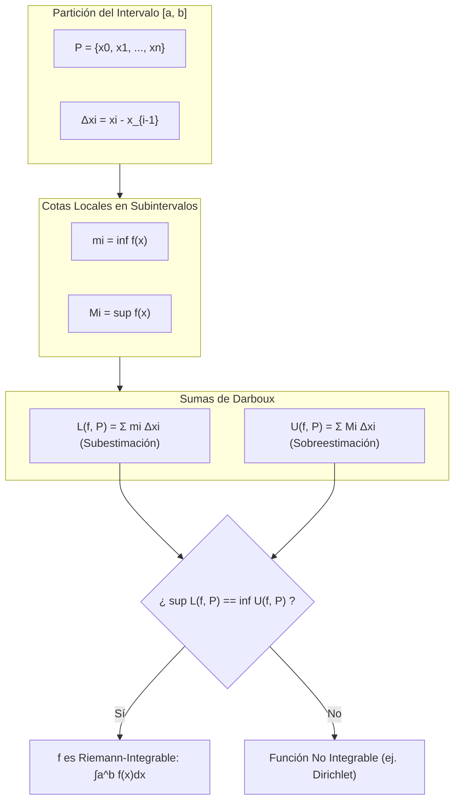
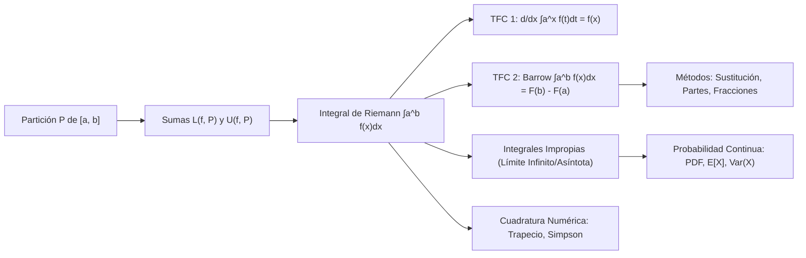

# Cálculo Integral y Métodos de Integración

Para los estudiantes y profesionales de la Ingeniería en Ciencias de la Computación de la Escuela Politécnica Nacional, el **Cálculo Integral** representa la estructura matemática que permite formalizar la **acumulación continua de cantidades infinitesimales**, la **inversión de operadores diferenciales lineales**, la **medición volumétrica y probabilística en espacios continuos**, y el desarrollo de **algoritmos de cuadratura numérica y simulación Monte Carlo**.

Esta nota expone la construcción axiomática rigurosa de la integral según Darboux y Riemann, desentraña la demostración del Teorema Fundamental del Cálculo, sistematiza los métodos analíticos de integración y convergencia de integrales impropias, y concluye con sus aplicaciones directas en la teoría de la probabilidad continua y la computación científica.

> [!info] 💡 ¿Cómo entender esto desde cero? (Guía para novatos de pregrado)
> - **La gran idea del Cálculo Integral:** Si la derivada despedaza un movimiento en instantes microscópicos, la **integral hace exactamente lo opuesto: acumula y suma todos esos pedacitos microscópicos para darte el total**.
> - **Analogía del odómetro:** Si la derivada es el velocímetro, la integral es el contador de kilómetros de tu auto. Si sumas tu velocidad en cada microsegundo multiplicada por ese microsegundo de tiempo, obtienes la distancia total recorrida.
> - **El Teorema Fundamental del Cálculo:** Es el milagro matemático que descubrieron Newton y Leibniz: ¡la derivación y la integración son operaciones inversas (como la suma y la resta)!
> - **En Informática y Probabilidad:** ¿Cómo sabemos la probabilidad de que un servidor no se caiga en los próximos 3 años? La probabilidad continua es el área bajo una curva de densidad. Calcular esa probabilidad es, literalmente, resolver una integral.

---

## 1. Construcción Formal de la Integral de Riemann-Darboux

La integral definida no surge heurísticamente como "el área bajo la curva", sino como el límite del supremo de sumas inferiores y el ínfimo de sumas superiores sobre el reticulado de todas las particiones admisibles de un intervalo compacto.

### 1.1 Particiones y Malla de un Intervalo

> [!note] Definición 1.1: Partición de un Intervalo Compacto
> Sea $[a, b] \subset \mathbb{R}$ un intervalo cerrado y acotado. Una **partición** $P$ de $[a, b]$ es un conjunto finito y ordenado de puntos:
> $$P = \{ x_0, x_1, x_2, \dots, x_n \}$$
> tal que:
> $$a = x_0 < x_1 < x_2 < \dots < x_{n-1} < x_n = b$$
> Cada subintervalo inducido se denota por $I_i = [x_{i-1}, x_i]$, con longitud $\Delta x_i = x_i - x_{i-1} > 0$, para $i = 1, \dots, n$.

> [!note] Definición 1.2: Norma o Malla de la Partición
> La **norma** o **malla** de la partición $P$, denotada por $\|P\|$, es la máxima longitud entre todos sus subintervalos:
> $$\|P\| = \max_{1 \le i \le n} \Delta x_i$$
> Decimos que una partición $P'$ es un **refinamiento** de $P$ ($P \subseteq P'$) si todos los puntos de $P$ pertenecen también a $P'$.

### 1.2 Sumas de Darboux: Inferiores y Superiores

Sea $f: [a, b] \to \mathbb{R}$ una función **acotada** en $[a, b]$. Existen $m, M \in \mathbb{R}$ tales que $m \le f(x) \le M$ para todo $x \in [a, b]$.

En cada subintervalo $I_i = [x_{i-1}, x_i]$, definimos:
$$m_i = \inf_{x \in I_i} f(x) \quad \text{y} \quad M_i = \sup_{x \in I_i} f(x)$$

> [!important] Definición 1.3: Sumas de Darboux
> - La **Suma Inferior de Darboux** de $f$ respecto a $P$ es:
>   $$L(f, P) = \sum_{i=1}^n m_i \Delta x_i$$
> - La **Suma Superior de Darboux** de $f$ respecto a $P$ es:
>   $$U(f, P) = \sum_{i=1}^n M_i \Delta x_i$$

Dado que $m \le m_i \le M_i \le M$ en todo subintervalo, se verifica de inmediato la desigualdad fundamental:
$$m(b - a) \le L(f, P) \le U(f, P) \le M(b - a)$$



> [!tip] Lema 1.1: Comportamiento bajo Refinamiento
> Si $P'$ es un refinamiento de $P$ ($P \subseteq P'$), entonces:
> $$L(f, P) \le L(f, P') \quad \text{y} \quad U(f, P') \le U(f, P)$$
> Es decir, al añadir puntos a la partición, las sumas inferiores no pueden decrecer y las sumas superiores no pueden aumentar.
> Más aún, para cualesquiera dos particiones $P_1, P_2$:
> $$L(f, P_1) \le U(f, P_2)$$

### 1.3 Integrales de Darboux y Criterio de Integrabilidad de Riemann

Definimos la **integral inferior** y la **integral superior** de Darboux sobre el conjunto $\mathcal{P}([a, b])$ de todas las particiones posibles:
$$\underline{\int_a^b} f(x) \, dx = \sup_{P \in \mathcal{P}} L(f, P) \quad \text{y} \quad \overline{\int_a^b} f(x) \, dx = \inf_{P \in \mathcal{P}} U(f, P)$$

> [!important] Definición 1.4: Condición de Integrabilidad de Riemann-Darboux
> Una función acotada $f: [a, b] \to \mathbb{R}$ es **Riemann-integrable** en $[a, b]$ (denotado $f \in \mathcal{R}[a, b]$) si y solo si:
> $$\underline{\int_a^b} f(x) \, dx = \overline{\int_a^b} f(x) \, dx$$
> El valor común se denomina la **integral de Riemann** de $f$ sobre $[a, b]$, y se denota por:
> $$\int_a^b f(x) \, dx$$

> [!important] Teorema 1.1: Criterio de Riemann
> Una función acotada $f$ es Riemann-integrable en $[a, b]$ si y solo si:
> $$\forall \varepsilon > 0, \quad \exists P \in \mathcal{P}([a, b]) \quad \text{tal que} \quad U(f, P) - L(f, P) < \varepsilon$$

> [!note] Teorema de Lebesgue-Vitali sobre Integrabilidad de Riemann
> Una función acotada $f: [a, b] \to \mathbb{R}$ es Riemann-integrable si y solo si el conjunto de sus discontinuidades tiene **medida de Lebesgue cero**. En particular:
> 1. Toda función continua en $[a, b]$ es Riemann-integrable ($C[a, b] \subset \mathcal{R}[a, b]$).
> 2. Toda función monótona en $[a, b]$ es Riemann-integrable.
> 3. Funciones con una cantidad numerable o finita de discontinuidades son Riemann-integrables.

---

## 2. El Teorema Fundamental del Cálculo (TFC)

El Teorema Fundamental del Cálculo establece el puente bidireccional entre los dos grandes pilares del análisis: el cálculo diferencial (tasa de cambio local) y el cálculo integral (acumulación global continua).

### 2.1 Teorema Fundamental del Cálculo - Parte 1 (Función Acumuladora)

> [!important] Teorema 2.1: TFC - Parte 1 (Derivabilidad de la Integral Acumuladora)
> Sea $f: [a, b] \to \mathbb{R}$ una función Riemann-integrable en $[a, b]$. Definimos la función acumuladora $F: [a, b] \to \mathbb{R}$ por:
> $$F(x) = \int_a^x f(t) \, dt$$
> Entonces:
> 1. $F$ es continua en todo el intervalo $[a, b]$. De hecho, es Lipschitziana.
> 2. Si $f$ es continua en un punto $x_0 \in (a, b)$, entonces $F$ es diferenciable en $x_0$ y se cumple:
>    $$F'(x_0) = \frac{d}{dx} \left[ \int_a^x f(t) \, dt \right]_{x=x_0} = f(x_0)$$

*Demostración analítica rigurosa:*
Evaluamos el cociente de diferencias de Newton para $h \neq 0$:
$$\frac{F(x_0 + h) - F(x_0)}{h} = \frac{1}{h} \left( \int_a^{x_0 + h} f(t) \, dt - \int_a^{x_0} f(t) \, dt \right) = \frac{1}{h} \int_{x_0}^{x_0 + h} f(t) \, dt$$
Restamos la constante $f(x_0) = \frac{1}{h} \int_{x_0}^{x_0 + h} f(x_0) \, dt$:
$$\left| \frac{F(x_0 + h) - F(x_0)}{h} - f(x_0) \right| = \left| \frac{1}{h} \int_{x_0}^{x_0 + h} (f(t) - f(x_0)) \, dt \right| \le \frac{1}{|h|} \left| \int_{x_0}^{x_0 + h} |f(t) - f(x_0)| \, dt \right|$$

Dado que $f$ es continua en $x_0$:
$$\forall \varepsilon > 0, \; \exists \delta > 0 : |t - x_0| < \delta \implies |f(t) - f(x_0)| < \varepsilon$$
Si tomamos $0 < |h| < \delta$, para todo $t$ en el intervalo entre $x_0$ y $x_0 + h$, se cumple $|t - x_0| \le |h| < \delta$, luego $|f(t) - f(x_0)| < \varepsilon$:
$$\left| \frac{F(x_0 + h) - F(x_0)}{h} - f(x_0) \right| \le \frac{1}{|h|} \varepsilon |h| = \varepsilon$$
Tomando el límite cuando $h \to 0$:
$$\lim_{h \to 0} \frac{F(x_0 + h) - F(x_0)}{h} = f(x_0) \implies F'(x_0) = f(x_0) \quad \blacksquare$$

> [!tip] Regla de Leibniz para Derivación bajo el Signo Integral (Límites Variables)
> Por aplicación directa de la Regla de la Cadena:
> $$\frac{d}{dx} \left[ \int_{u(x)}^{v(x)} f(t) \, dt \right] = f(v(x)) \cdot v'(x) - f(u(x)) \cdot u'(x)$$

### 2.2 Teorema Fundamental del Cálculo - Parte 2 (Regla de Barrow)

> [!important] Teorema 2.2: TFC - Parte 2 (Regla de Evaluación de Barrow)
> Sea $f: [a, b] \to \mathbb{R}$ continua en $[a, b]$ y sea $F: [a, b] \to \mathbb{R}$ cualquier antiderivada (o primitiva) de $f$, es decir, $F'(x) = f(x)$ para todo $x \in (a, b)$. Entonces:
> $$\int_a^b f(x) \, dx = F(b) - F(a) = \Big[ F(x) \Big]_a^b$$

*Demostración:*
Sea $P = \{a = x_0 < x_1 < \dots < x_n = b\}$ una partición cualquiera de $[a, b]$. Expresamos la diferencia $F(b) - F(a)$ mediante una suma telescópica:
$$F(b) - F(a) = \sum_{i=1}^n [F(x_i) - F(x_{i-1})]$$
Como $F$ es continua en $[x_{i-1}, x_i]$ y diferenciable en $(x_{i-1}, x_i)$, aplicamos el **Teorema del Valor Medio de Lagrange** a cada término:
$$\exists c_i \in (x_{i-1}, x_i) \quad \text{tal que} \quad F(x_i) - F(x_{i-1}) = F'(c_i)(x_i - x_{i-1}) = f(c_i) \Delta x_i$$
Por consiguiente:
$$F(b) - F(a) = \sum_{i=1}^n f(c_i) \Delta x_i$$
Dado que $m_i \le f(c_i) \le M_i$, se verifica que:
$$L(f, P) \le \sum_{i=1}^n f(c_i) \Delta x_i \le U(f, P) \implies L(f, P) \le F(b) - F(a) \le U(f, P)$$
Tomando el límite cuando $\|P\| \to 0$, por el Criterio de Riemann el extremo inferior y el superior convergen al mismo número real:
$$\lim_{\|P\| \to 0} L(f, P) = \lim_{\|P\| \to 0} U(f, P) = \int_a^b f(x) \, dx$$
Por el Teorema del Emparedado (Squeeze Theorem), se concluye idénticamente:
$$\int_a^b f(x) \, dx = F(b) - F(a) \quad \blacksquare$$

---

## 3. Técnicas Analíticas Avanzadas de Integración

```mermaid
flowchart TD
    Integrando["Integrando f(x) dx"] --> Analisis{Estructura Algebraica}
    Analisis -->|Composición f(g(x)) g' x| Sustitucion["Sustitución Algebraica u = g(x)"]
    Analisis -->|Producto de Tipos Mixtos| Partes["Integración por Partes ∫ u dv = uv - ∫ v du"]
    Analisis -->|Cociente Polinomial P x / Q x| Fracciones["Descomposición en Fracciones Parciales"]
    Analisis -->|Radicales Cuadráticos| Trigonom["Sustitución Trigonométrica"]
    Partes --> LIATE["Criterio LIATE: Log, InvTrig, Alg, Trig, Exp"]
    Fracciones --> Polinomios["Factores Lineales y Cuadráticos Irreducibles"]
    Trigonom --> Formas["√(a² - x²), √(a² + x²), √(x² - a²)"]
```

### 3.1 Integración por Sustitución Algebraica (Cambio de Variable)

Deducida directamente de la Regla de la Cadena diferencial:
$$\int f(g(x)) g'(x) \, dx = \int f(u) \, du, \quad \text{donde } u = g(x), \; du = g'(x)dx$$
Para integrales definidas con cambio de límites:
$$\int_a^b f(g(x)) g'(x) \, dx = \int_{g(a)}^{g(b)} f(u) \, du$$

### 3.2 Integración por Partes y Método Tabular

Deducida integrando la derivada del producto de dos funciones $u(x)$ y $v(x)$:
$$\frac{d}{dx}[u(x)v(x)] = u'(x)v(x) + u(x)v'(x) \implies u(x)v(x) = \int v(x)u'(x)dx + \int u(x)v'(x)dx$$
Reordenando términos obtenemos la fórmula clásica:
$$\int u \, dv = u v - \int v \, du$$

> [!tip] Regla Heurística de Selección: LIATE
> Orden prioritario de selección para $u$ (el factor que se simplifica más al derivarse):
> 1. **L**ogarítmicas ($\ln x, \log_a x$)
> 2. **I**nversas trigonométricas ($\arcsin x, \arctan x$)
> 3. **A**lgebraicas ($x^n, x^{1/2}$)
> 4. **T**rigonométricas ($\sin x, \cos x$)
> 5. **E**xponenciales ($e^x, a^x$)

#### Método Tabular para Productos Polinomial-Trigonométrico/Exponencial
Para $\int P_n(x) g(x) dx$ donde $P_n(x)$ es un polinomio de grado $n$ y $g(x)$ es integrable repetidamente (ej. $e^{\alpha x}, \sin(\beta x)$):
Se construyen dos columnas:
1. Derivadas sucesivas de $P_n(x)$ hasta alcanzar 0 en el paso $n+1$.
2. Antiderivadas sucesivas de $g(x)$.
Se multiplican las diagonales con signos alternantes $(+, -, +, -, \dots)$.

### 3.3 Descomposición en Fracciones Parciales

Permite integrar cualquier función racional $R(x) = \frac{P(x)}{Q(x)}$. Si $\deg(P) \ge \deg(Q)$, se efectúa primero la división polinomial $R(x) = C(x) + \frac{r(x)}{Q(x)}$ con $\deg(r) < \deg(Q)$.

Por el Teorema Fundamental del Álgebra, $Q(x)$ se factoriza sobre $\mathbb{R}$ en factores lineales y cuadráticos irreducibles:
$$Q(x) = a \prod_{i=1}^k (x - r_i)^{m_i} \prod_{j=1}^l (x^2 + p_j x + q_j)^{n_j} \quad (p_j^2 - 4q_j < 0)$$

Reglas de expansión:
1. **Factores lineales repetidos $(x - r)^m$:**
   $$\frac{A_1}{x - r} + \frac{A_2}{(x - r)^2} + \dots + \frac{A_m}{(x - r)^m}$$
   Cada término genera antiderivadas logarítmicas $\ln|x - r|$ o de potencia $\frac{-(m-1)^{-1}}{(x-r)^{m-1}}$.
2. **Factores cuadráticos irreducibles repetidos $(x^2 + px + q)^n$:**
   $$\frac{B_1 x + C_1}{x^2 + px + q} + \dots + \frac{B_n x + C_n}{(x^2 + px + q)^n}$$
   Completando el trinomio cuadrado perfecto en el denominador, estos términos generan combinaciones de logaritmos naturales y arcotangentes $\arctan\left(\frac{x + p/2}{\sqrt{q - p^2/4}}\right)$.

### 3.4 Sustituciones Trigonométricas e Hiperbólicas

| Forma Radical | Sustitución Trigonométrica | Identidad Clave | Diferencial | Sustitución Hiperbólica Alternativa |
| :--- | :--- | :--- | :--- | :--- |
| $\sqrt{a^2 - x^2}$ | $x = a \sin \theta$ ($-\frac{\pi}{2} \le \theta \le \frac{\pi}{2}$) | $1 - \sin^2 \theta = \cos^2 \theta$ | $dx = a \cos \theta \, d\theta$ | $x = a \tanh u$ |
| $\sqrt{a^2 + x^2}$ | $x = a \tan \theta$ ($-\frac{\pi}{2} < \theta < \frac{\pi}{2}$) | $1 + \tan^2 \theta = \sec^2 \theta$ | $dx = a \sec^2 \theta \, d\theta$ | $x = a \sinh u$ |
| $\sqrt{x^2 - a^2}$ | $x = a \sec \theta$ | $\sec^2 \theta - 1 = \tan^2 \theta$ | $dx = a \sec \theta \tan \theta \, d\theta$ | $x = a \cosh u$ |

> [!tip] Sustitución Universal de Weierstrass (Tangente del Ángulo Medio)
> Para funciones racionales trigonométricas $R(\sin x, \cos x)$:
> $$t = \tan\left(\frac{x}{2}\right) \implies \sin x = \frac{2t}{1 + t^2}, \quad \cos x = \frac{1 - t^2}{1 + t^2}, \quad dx = \frac{2 \, dt}{1 + t^2}$$
> Esta transformación algebraica convierte cualquier integral trigonométrica compleja en una integral de función racional estándar integrable por fracciones parciales.

---

## 4. Integrales Impropias y Criterios de Convergencia

Una integral definida estándar requiere dos hipótesis fundamentales:
1. El intervalo de integración $[a, b]$ es cerrado y acotado.
2. La función integrando $f(x)$ es acotada en todo $[a, b]$.
La violación de cualquiera de estas premisas da lugar a una **Integral Impropia**.

### 4.1 Clasificación Formal

#### Tipo I: Intervalos Infinitos (Límites no Acotados)
$$\int_a^\infty f(x) \, dx = \lim_{b \to \infty} \int_a^b f(x) \, dx$$
$$\int_{-\infty}^\infty f(x) \, dx = \lim_{a \to -\infty} \int_a^c f(x) \, dx + \lim_{b \to \infty} \int_c^b f(x) \, dx \quad (c \in \mathbb{R})$$
La integral converge si y solo si ambos límites existen independientemente de forma finita.

#### Tipo II: Integrandos Discontinuos no Acotados (Asíntotas Verticales)
Si $f$ es no acotada en $x = c \in (a, b)$:
$$\int_a^b f(x) \, dx = \lim_{\varepsilon_1 \to 0^+} \int_a^{c - \varepsilon_1} f(x) \, dx + \lim_{\varepsilon_2 \to 0^+} \int_{c + \varepsilon_2}^b f(x) \, dx$$

### 4.2 Criterios de Convergencia Analítica

> [!important] Integrales Patrón ($p$-integrales)
> 1. **Tipo I ($[1, \infty)$):**
>    $$\int_1^\infty \frac{dx}{x^p} = \begin{cases} \frac{1}{p - 1} & \text{si } p > 1 \quad (\text{CONVERGE}) \\ \infty & \text{si } p \le 1 \quad (\text{DIVERGE}) \end{cases}$$
> 2. **Tipo II ($[0, 1]$):**
>    $$\int_0^1 \frac{dx}{x^p} = \begin{cases} \frac{1}{1 - p} & \text{si } p < 1 \quad (\text{CONVERGE}) \\ \infty & \text{si } p \ge 1 \quad (\text{DIVERGE}) \end{cases}$$

> [!note] Criterio de Comparación Directa
> Sean $f, g$ continuas con $0 \le f(x) \le g(x)$ para todo $x \ge a$:
> - Si $\int_a^\infty g(x) \, dx$ **converge**, entonces $\int_a^\infty f(x) \, dx$ **converge**.
> - Si $\int_a^\infty f(x) \, dx$ **diverge**, entonces $\int_a^\infty g(x) \, dx$ **diverge**.

> [!tip] Criterio de Comparación en el Límite
> Si $f(x) > 0$ y $g(x) > 0$, y el límite del cociente asintótico es:
> $$L = \lim_{x \to \infty} \frac{f(x)}{g(x)}$$
> - Si $0 < L < \infty$: Ambas integrales convergen o ambas divergen simultáneamente.
> - Si $L = 0$ y $\int g$ converge $\implies \int f$ converge.
> - Si $L = \infty$ y $\int g$ diverge $\implies \int f$ diverge.

### 4.3 Valor Principal de Cauchy (P.V.)

Para integrales impropias que divergen en el sentido ordinario de límites independientes debido a simetrías asimétricas:

> [!important] Definición 4.1: Valor Principal de Cauchy
> Para una integral en $\mathbb{R}$:
> $$\text{P.V.} \int_{-\infty}^\infty f(x) \, dx = \lim_{R \to \infty} \int_{-R}^R f(x) \, dx$$
> *Ejemplo fundamental:*
> $\int_{-\infty}^\infty x \, dx$ diverge en el sentido ordinario (genera $[\infty - \infty]$).
> Sin embargo:
> $$\text{P.V.} \int_{-\infty}^\infty x \, dx = \lim_{R \to \infty} \left[ \frac{x^2}{2} \right]_{-R}^R = \lim_{R \to \infty} \left( \frac{R^2}{2} - \frac{R^2}{2} \right) = 0$$
> Esta noción es indispensable en la transformada de Hilbert, mecánica cuántica y procesamiento digital de señales.

---

## 5. Aplicaciones en Computación Científica y Probabilidad

### 5.1 Algoritmos de Cuadratura Numérica

Cuando el integrando carece de primitiva analítica elemental (ej. $e^{-x^2}, \frac{\sin x}{x}$), las máquinas evalúan sumas finitas ponderadas:
$$\int_a^b f(x) \, dx \approx \sum_{i=0}^N w_i f(x_i)$$

| Método | Regla de Cuadratura | Error de Truncamiento Local | Orden Global |
| :--- | :--- | :--- | :--- |
| **Trapecio Compuesto** | $\frac{h}{2} [f(a) + 2\sum_{i=1}^{N-1} f(x_i) + f(b)]$ | $-\frac{b-a}{12} h^2 f''(\xi)$ | $\mathcal{O}(h^2)$ |
| **Simpson 1/3 Compuesto** | $\frac{h}{3} [f(a) + 4\sum_{\text{impar}} f(x_i) + 2\sum_{\text{par}} f(x_i) + f(b)]$ | $-\frac{b-a}{180} h^4 f^{(4)}(\xi)$ | $\mathcal{O}(h^4)$ |
| **Simpson 3/8 Compuesto** | $\frac{3h}{8} [f_0 + 3f_1 + 3f_2 + 2f_3 + \dots + f_N]$ | $-\frac{b-a}{80} h^4 f^{(4)}(\xi)$ | $\mathcal{O}(h^4)$ |

### 5.2 Teoría de la Probabilidad Continua y Variables Aleatorias

En ciencias de la computación, el modelado del rendimiento de servidores, algoritmos probabilísticos y redes neuronales descansa sobre variables aleatorias continuas.

> [!important] Función de Densidad de Probabilidad (PDF)
> Una función medible $f: \mathbb{R} \to \mathbb{R}$ es una PDF válida si satisface:
> 1. No negatividad: $f(x) \ge 0, \quad \forall x \in \mathbb{R}$.
> 2. Normalización de masa probabilística total:
>    $$\int_{-\infty}^\infty f(x) \, dx = 1$$
> La probabilidad de que una variable aleatoria $X$ caiga en $[a, b]$ es:
> $$P(a \le X \le b) = \int_a^b f(x) \, dx$$

#### Momentos Estadísticos y Valor Esperado
- **Valor Esperado (Media $\mu$):** Es el centro de masa de la distribución:
  $$\mathbb{E}[X] = \int_{-\infty}^\infty x f(x) \, dx$$
- **Varianza ($\sigma^2$):** Medida de la dispersión de segundo orden:
  $$\operatorname{Var}(X) = \mathbb{E}[(X - \mu)^2] = \int_{-\infty}^\infty (x - \mu)^2 f(x) \, dx = \mathbb{E}[X^2] - (\mathbb{E}[X])^2$$

#### La Integral Gaussiana de Normalización
La distribución normal estándar $\mathcal{N}(0, 1)$ tiene densidad:
$$f(x) = \frac{1}{\sqrt{2\pi}} e^{-\frac{x^2}{2}}$$
La constante de normalización exige calcular la integral impropia:
$$I = \int_{-\infty}^\infty e^{-x^2} \, dx = \sqrt{\pi}$$
*Demostración clásica mediante cálculo multivariable:*
$$I^2 = \left( \int_{-\infty}^\infty e^{-x^2} dx \right) \left( \int_{-\infty}^\infty e^{-y^2} dy \right) = \int_{-\infty}^\infty \int_{-\infty}^\infty e^{-(x^2 + y^2)} \, dx \, dy$$
Transformando a coordenadas polares ($x = r\cos\theta, y = r\sin\theta, dx dy = r \, dr d\theta$):
$$I^2 = \int_0^{2\pi} d\theta \int_0^\infty e^{-r^2} r \, dr = 2\pi \left[ -\frac{1}{2} e^{-r^2} \right]_0^\infty = 2\pi \left( 0 - \left(-\frac{1}{2}\right) \right) = \pi \implies I = \sqrt{\pi} \quad \blacksquare$$

---

## 6. Diagrama de Relación Conceptual



---

## 7. Conexiones y Referencias Cruzadas

- [[Calculo Diferencial y Teoremas Fundamentales]]: Base analítica, límites y operadores diferenciales inversos.
- [[Calculo Multivariable, Gradiente y Matriz Jacobiana]]: Integración múltiple, cambio de coordenadas polares y determinantes Jacobianales.
- [[Gradient Descent]]: Algoritmos estocásticos que aproximan integrales de valor esperado mediante estimadores por muestreo (SGD).