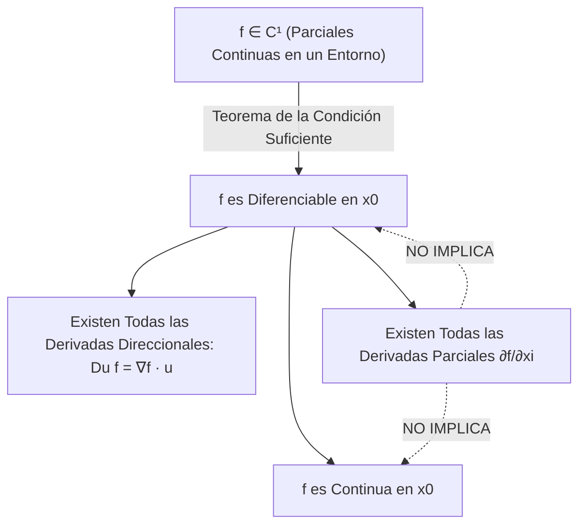
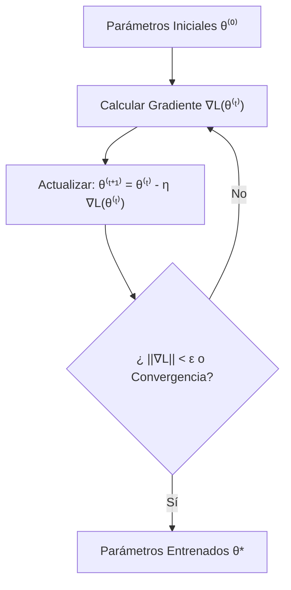
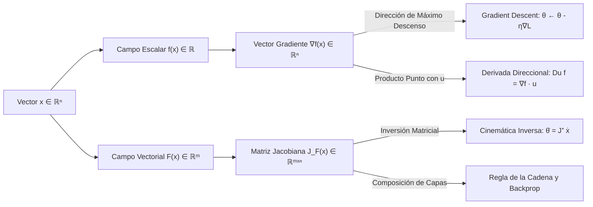

# Cálculo Multivariable, Gradiente y Matriz Jacobiana

En el currículo de Ingeniería en Ciencias de la Computación de la Escuela Politécnica Nacional, el **Cálculo Multivariable** constituye el andamiaje matemático sobre el cual se erigen las disciplinas de mayor impacto tecnológico del siglo XXI: el **Aprendizaje Automático (Machine Learning)**, las **Redes Neuronales Profundas (Deep Learning)**, la **Visión por Computador**, y la **Cinemática en Robótica y Sistemas Autónomos**.

Mientras que el cálculo univariable opera sobre líneas rectas, el cálculo multivariable estudia la geometría de variedades diferenciables en $\mathbb{R}^n$, la propagación de perturbaciones a través de campos vectoriales acoplados, y la optimización de funciones de pérdida en espacios de parámetros de dimensiones astronómicas.

> [!info] 💡 ¿Cómo entender esto desde cero? (Guía para novatos de pregrado)
> - **De una dimensión a muchas dimensiones:** En cálculo básico tenías funciones simples $y = f(x)$ (el precio de una casa según sus metros cuadrados). Pero en la vida real, el precio depende de metros cuadrados, número de cuartos, distancia al centro, crimen de la zona, etc. Ahora la entrada es un vector $\mathbf{x} = (x_1, x_2, \dots, x_n)$.
> - **¿Qué es el Gradiente ($
abla f$)?** Imagina que estás vendado de los ojos en una ladera empinada. Das un paso en círculo con tu pie para palpar el suelo: la dirección hacia donde el suelo sube con la mayor pendiente posible es el **Gradiente**.
> - **¿Por qué el Gradiente mueve el mundo de la IA?**
>   - Si quieres encontrar el mínimo error en una red neuronal (entrenarla), das un paso en la dirección opuesta al gradiente (**Descenso de Gradiente**). Toda la Inteligencia Artificial moderna funciona siguiendo el gradiente de una función de pérdida.
> - **¿Qué es la Matriz Jacobiana?** Si tienes una función que toma varios números y escupe varios números (por ejemplo, los ángulos de los motores de un brazo robótico y la posición 3D de su pinza), la Jacobiana te dice cómo se mueve la pinza ante el más mínimo movimiento de cada motor.

---

## 1. Topología de $\mathbb{R}^n$, Campos Escalares y Vectoriales

### 1.1 Estructura Métrica y Topológica de $\mathbb{R}^n$

El espacio euclidiano $\mathbb{R}^n$ está compuesto por $n$-tuplas ordenadas de números reales representadas como vectores columna $\mathbf{x} = [x_1, x_2, \dots, x_n]^T$.

> [!note] Definición 1.1: Producto Interno Estándar y Norma Euclidiana
> Para $\mathbf{x}, \mathbf{y} \in \mathbb{R}^n$:
> - **Producto punto (interno):** $\langle \mathbf{x}, \mathbf{y} \rangle = \mathbf{x}^T \mathbf{y} = \sum_{i=1}^n x_i y_i$
> - **Norma inducida ($\ell_2$):** $\|\mathbf{x}\|_2 = \sqrt{\mathbf{x}^T \mathbf{x}} = \sqrt{\sum_{i=1}^n x_i^2}$
> - **Métrica euclidiana:** $d(\mathbf{x}, \mathbf{y}) = \|\mathbf{x} - \mathbf{y}\|_2$

> [!important] Definición 1.2: Entornos y Conceptos Topológicos
> Sea $S \subseteq \mathbb{R}^n$ y $\mathbf{x}_0 \in \mathbb{R}^n$:
> 1. **Bola Abierta:** $B_r(\mathbf{x}_0) = \{ \mathbf{x} \in \mathbb{R}^n \mid \|\mathbf{x} - \mathbf{x}_0\|_2 < r \}$.
> 2. **Punto Interior:** $\mathbf{x}_0$ es punto interior de $S$ si $\exists r > 0$ tal que $B_r(\mathbf{x}_0) \subseteq S$. El interior de $S$ se denota $\operatorname{int}(S)$ o $S^\circ$.
> 3. **Conjunto Abierto:** $S$ es abierto si $S = \operatorname{int}(S)$.
> 4. **Punto Frontera:** $\mathbf{x}_0$ es punto frontera de $S$ si para todo $r > 0$, $B_r(\mathbf{x}_0) \cap S \neq \emptyset$ y $B_r(\mathbf{x}_0) \cap (\mathbb{R}^n \setminus S) \neq \emptyset$. La frontera se denota $\partial S$.
> 5. **Conjunto Cerrado:** $S$ es cerrado si contiene a todos sus puntos frontera ($\partial S \subseteq S$), o equivalentemente, si su complemento $\mathbb{R}^n \setminus S$ es abierto.
> 6. **Conjunto Convexo:** $S$ es convexo si para cualesquiera $\mathbf{x}, \mathbf{y} \in S$ y todo $\theta \in [0, 1]$:
>    $$\theta \mathbf{x} + (1 - \theta)\mathbf{y} \in S$$

### 1.2 Campos Escalares y Campos Vectoriales

> [!note] Definición 1.3: Clasificación de Aplicaciones
> - **Campo Escalar:** Función $f: \Omega \subseteq \mathbb{R}^n \to \mathbb{R}$ que asigna a cada vector $\mathbf{x}$ un único valor escalar real $f(\mathbf{x})$. *Ejemplo:* La función de pérdida o coste $\mathcal{L}(\mathbf{w})$ de una red neuronal respecto a sus pesos sinápticos.
> - **Campo Vectorial:** Función $\mathbf{F}: \Omega \subseteq \mathbb{R}^n \to \mathbb{R}^m$ que mapea cada vector de entrada a un vector de $m$ dimensiones:
>   $$\mathbf{F}(\mathbf{x}) = \begin{bmatrix} F_1(\mathbf{x}) \\ F_2(\mathbf{x}) \\ \vdots \\ F_m(\mathbf{x}) \end{bmatrix}, \quad \text{donde cada } F_i: \mathbb{R}^n \to \mathbb{R} \text{ es un campo escalar componente.}$$
>   *Ejemplo:* La transformación de una capa densa en una red neuronal con activación $\mathbf{y} = \sigma(W\mathbf{x} + \mathbf{b})$.

---

## 2. Límites Multivariables y Métodos de Trayectorias

### 2.1 Definición $\varepsilon-\delta$ en $\mathbb{R}^n$

> [!important] Definición 2.1: Límite Multivariable
> Sea $f: \Omega \subseteq \mathbb{R}^n \to \mathbb{R}$ y $\mathbf{x}_0$ un punto de acumulación de $\Omega$. Decimos que:
> $$\lim_{\mathbf{x} \to \mathbf{x}_0} f(\mathbf{x}) = L$$
> si y solo si:
> $$\forall \varepsilon > 0, \quad \exists \delta > 0 \quad \text{tal que} \quad \forall \mathbf{x} \in \Omega, \; 0 < \|\mathbf{x} - \mathbf{x}_0\|_2 < \delta \implies |f(\mathbf{x}) - L| < \varepsilon$$

### 2.2 El Método de Trayectorias Direccionales para Demostrar No Existencia

En una variable ($x \in \mathbb{R}$), aproximarse a un punto $c$ solo admite dos direcciones: izquierda y derecha. En $\mathbb{R}^n$ ($n \ge 2$), existen infinitas curvas continuas que convergen a $\mathbf{x}_0$.

> [!important] Teorema 2.1: Criterio de No Existencia por Trayectorias
> Si el límite $\lim_{\mathbf{x} \to \mathbf{x}_0} f(\mathbf{x})$ existe y vale $L$, entonces a lo largo de **toda curva continua** $\mathbf{r}(t)$ que satisfaga $\lim_{t \to 0} \mathbf{r}(t) = \mathbf{x}_0$ (con $\mathbf{r}(t) \neq \mathbf{x}_0$), debe cumplirse:
> $$\lim_{t \to 0} f(\mathbf{r}(t)) = L$$
> Por contraposición: Si existen dos trayectorias que arrojan valores límites distintos, o si el límite a lo largo de una familia paramétrica depende del parámetro de aproximación, **el límite multivariable NO existe**.

#### Ejemplo Analítico Canónico
Estudiar la existencia de $\lim_{(x, y) \to (0, 0)} \frac{x y^2}{x^2 + y^4}$:
1. **Aproximación por rectas $x = m y$:**
   $$\lim_{y \to 0} \frac{(my)y^2}{(my)^2 + y^4} = \lim_{y \to 0} \frac{m y^3}{m^2 y^2 + y^4} = \lim_{y \to 0} \frac{m y}{m^2 + y^2} = 0 \quad (\forall m \neq 0)$$
   Esto sugeriría falsamente que el límite es 0.
2. **Aproximación parabólica $x = k y^2$:**
   $$\lim_{y \to 0} \frac{(k y^2) y^2}{(k y^2)^2 + y^4} = \lim_{y \to 0} \frac{k y^4}{k^2 y^4 + y^4} = \lim_{y \to 0} \frac{k}{k^2 + 1} = \frac{k}{k^2 + 1}$$
   Como el resultado depende explícitamente de la constante de curvatura $k$ (para $k=1$ da $1/2$, para $k=0$ da $0$), se concluye formalmente que **el límite no existe**.

---

## 3. Derivadas Parciales y el Concepto Formal de Diferenciabilidad

### 3.1 Derivadas Parciales y su Insuficiencia

> [!note] Definición 3.1: Derivada Parcial
> Sea $f: \Omega \subseteq \mathbb{R}^n \to \mathbb{R}$ y $\mathbf{x} \in \operatorname{int}(\Omega)$. La derivada parcial respecto a la variable $x_i$ es:
> $$\frac{\partial f}{\partial x_i}(\mathbf{x}) = \lim_{h \to 0} \frac{f(\mathbf{x} + h \mathbf{e}_i) - f(\mathbf{x})}{h}$$
> donde $\mathbf{e}_i$ es el $i$-ésimo vector de la base canónica de $\mathbb{R}^n$.

> [!warning] La Trampa Multivariable: Existencia de Parciales $\centernot\implies$ Continuidad
> A diferencia del cálculo en 1D, donde la derivabilidad implica necesariamente continuidad, en $\mathbb{R}^n$ una función puede tener derivadas parciales en todas las direcciones de los ejes coordenados y ser **discontinua** en ese mismo punto. Las derivadas parciales únicamente exploran cambios a lo largo de $n$ rectas ortogonales aisladas, ignorando el resto del espacio euclidiano.

### 3.2 Definición Formal de Diferenciabilidad de Fréchet

Para superar esta limitación, el análisis multivariable exige que la función admita una **mejor aproximación afín hiperplana global**.

> [!important] Definición 3.2: Diferenciabilidad Multivariable
> Una función $f: \Omega \subseteq \mathbb{R}^n \to \mathbb{R}$ es **diferenciable** en un punto interior $\mathbf{x}_0 \in \Omega$ si existe una transformación lineal representada por un vector fila $\mathbf{A} \in \mathbb{R}^{1 \times n}$ tal que:
> $$\lim_{\mathbf{h} \to \mathbf{0}} \frac{|f(\mathbf{x}_0 + \mathbf{h}) - f(\mathbf{x}_0) - \mathbf{A}\mathbf{h}|}{\|\mathbf{h}\|_2} = 0$$
> Si tal operador existe, es único y coincide exactamente con la transpuesta del vector gradiente: $\mathbf{A} = \nabla f(\mathbf{x}_0)^T$.
> En notación de Landau:
> $$f(\mathbf{x}_0 + \mathbf{h}) = f(\mathbf{x}_0) + \nabla f(\mathbf{x}_0)^T \mathbf{h} + o(\|\mathbf{h}\|_2)$$

> [!tip] Ecuación del Hiperplano Tangente
> Si $f$ es diferenciable en $\mathbf{x}_0$, la gráfica de la aproximación de primer orden define el **hiperplano tangente** en $\mathbb{R}^{n+1}$:
> $$z = f(\mathbf{x}_0) + \sum_{i=1}^n \frac{\partial f}{\partial x_i}(\mathbf{x}_0) (x_i - x_{0, i}) = f(\mathbf{x}_0) + \nabla f(\mathbf{x}_0)^T (\mathbf{x} - \mathbf{x}_0)$$

---

## 4. El Vector Gradiente y la Derivada Direccional

### 4.1 Definición del Vector Gradiente

> [!note] Definición 4.1: Vector Gradiente
> Para una función diferenciable $f: \mathbb{R}^n \to \mathbb{R}$, el **Gradiente** $\nabla f(\mathbf{x})$ es el operador diferencial vectorial que reúne todas las derivadas parciales de primer orden:
> $$\nabla f(\mathbf{x}) = \begin{bmatrix} \frac{\partial f}{\partial x_1}(\mathbf{x}) \\ \frac{\partial f}{\partial x_2}(\mathbf{x}) \\ \vdots \\ \frac{\partial f}{\partial x_n}(\mathbf{x}) \end{bmatrix} \in \mathbb{R}^n$$

### 4.2 Derivada Direccional y Máximo Crecimiento

> [!important] Definición 4.2: Derivada Direccional
> Sea $\mathbf{u} \in \mathbb{R}^n$ un vector unitario ($\|\mathbf{u}\|_2 = 1$). La **derivada direccional** de $f$ en la dirección de $\mathbf{u}$ es:
> $$D_{\mathbf{u}} f(\mathbf{x}) = \lim_{t \to 0} \frac{f(\mathbf{x} + t\mathbf{u}) - f(\mathbf{x})}{t}$$
> Si $f$ es diferenciable en $\mathbf{x}$, este límite colapsa al producto punto:
> $$D_{\mathbf{u}} f(\mathbf{x}) = \nabla f(\mathbf{x}) \cdot \mathbf{u} = \nabla f(\mathbf{x})^T \mathbf{u}$$

> [!important] Teorema 4.1: Propiedad de Máximo Crecimiento y Ortogonalidad
> 1. **Dirección de Máxima Pendiente Ascendente:**
>    Por la desigualdad de Cauchy-Schwarz:
>    $$D_{\mathbf{u}} f(\mathbf{x}) = \langle \nabla f(\mathbf{x}), \mathbf{u} \rangle = \|\nabla f(\mathbf{x})\|_2 \|\mathbf{u}\|_2 \cos \theta = \|\nabla f(\mathbf{x})\|_2 \cos \theta$$
>    Dado que $-1 \le \cos \theta \le 1$:
>    - La tasa de crecimiento es **máxima** cuando $\cos \theta = 1 \implies \theta = 0$, lo que ocurre cuando $\mathbf{u} = \frac{\nabla f(\mathbf{x})}{\|\nabla f(\mathbf{x})\|_2}$. El valor de máxima pendiente es $\|\nabla f(\mathbf{x})\|_2$.
>    - La tasa de crecimiento es **mínima** (máximo descenso) cuando $\cos \theta = -1 \implies \theta = \pi$, apuntando en la dirección opuesta $-\nabla f(\mathbf{x})$.
> 2. **Ortogonalidad a los Conjuntos de Nivel:**
>    Sea $S_c = \{ \mathbf{x} \in \mathbb{R}^n \mid f(\mathbf{x}) = c \}$ un conjunto de nivel. Para cualquier curva suave $\mathbf{r}(t)$ contenida enteramente en la superficie de nivel ($f(\mathbf{r}(t)) = c$) con $\mathbf{r}(0) = \mathbf{x}_0$, derivando por la regla de la cadena:
>    $$\frac{d}{dt} [f(\mathbf{r}(t))]_{t=0} = \nabla f(\mathbf{x}_0) \cdot \mathbf{r}'(0) = 0$$
>    Dado que $\mathbf{r}'(0)$ es un vector tangente arbitrario a la superficie, **el vector gradiente $\nabla f(\mathbf{x}_0)$ es ortogonal (perpendicular) al hiperplano tangente del conjunto de nivel**.

---

## 5. Conexión Directa con Machine Learning: [[Gradient Descent]]

En [[Machine Learning]], el entrenamiento de modelos consiste en encontrar un vector de parámetros $\boldsymbol{\theta}^* \in \mathbb{R}^d$ que minimice una función de coste escalar no lineal $\mathcal{L}(\boldsymbol{\theta})$:
$$\boldsymbol{\theta}^* = \arg\min_{\boldsymbol{\theta} \in \mathbb{R}^d} \mathcal{L}(\boldsymbol{\theta})$$

Basado en el Teorema 4.1, la dirección de mayor reducción local del error en cada paso es el negativo del gradiente $-\nabla_{\boldsymbol{\theta}} \mathcal{L}(\boldsymbol{\theta})$.

> [!important] Ecuación de Actualización del Descenso del Gradiente
> $$\boldsymbol{\theta}^{(t+1)} = \boldsymbol{\theta}^{(t)} - \eta \nabla_{\boldsymbol{\theta}} \mathcal{L}(\boldsymbol{\theta}^{(t)})$$
> donde $\eta > 0$ es la **tasa de aprendizaje (learning rate)**.
> - Si $\mathcal{L}$ es $L$-Lipschitz suave ($\|\nabla \mathcal{L}(\mathbf{x}) - \nabla \mathcal{L}(\mathbf{y})\| \le L \|\mathbf{x} - \mathbf{y}\|$), el **Lema de Descenso** garantiza que si elegimos $\eta \le \frac{1}{L}$:
>   $$\mathcal{L}(\boldsymbol{\theta}^{(t+1)}) \le \mathcal{L}(\boldsymbol{\theta}^{(t)}) - \frac{\eta}{2} \|\nabla_{\boldsymbol{\theta}} \mathcal{L}(\boldsymbol{\theta}^{(t)})\|_2^2$$
>   asegurando una reducción monótona estricta del error en cada iteración del algoritmo.

---

## 6. Regla de la Cadena Multivariable Matricial

Sea $\mathbf{x} \in \mathbb{R}^n$, $\mathbf{u} = \mathbf{g}(\mathbf{x}) \in \mathbb{R}^m$, y $\mathbf{y} = \mathbf{f}(\mathbf{u}) \in \mathbb{R}^p$. La función compuesta es:
$$\mathbf{h}(\mathbf{x}) = (\mathbf{f} \circ \mathbf{g})(\mathbf{x}) = \mathbf{f}(\mathbf{g}(\mathbf{x})) \in \mathbb{R}^p$$

> [!important] Teorema 6.1: Regla de la Cadena en Forma Matricial
> Si $\mathbf{g}$ es diferenciable en $\mathbf{x}$ y $\mathbf{f}$ es diferenciable en $\mathbf{g}(\mathbf{x})$, entonces la función compuesta $\mathbf{h}$ es diferenciable en $\mathbf{x}$ y su matriz Jacobiana satisface la multiplicación matricial directa:
> $$J_{\mathbf{f} \circ \mathbf{g}}(\mathbf{x}) = J_{\mathbf{f}}(\mathbf{g}(\mathbf{x})) \cdot J_{\mathbf{g}}(\mathbf{x})$$
> En dimensiones:
> $$[p \times n] = [p \times m] \times [m \times n]$$
> En componentes escalares para $\frac{\partial h_i}{\partial x_j}$:
> $$\frac{\partial h_i}{\partial x_j}(\mathbf{x}) = \sum_{k=1}^m \frac{\partial f_i}{\partial u_k}(\mathbf{g}(\mathbf{x})) \frac{\partial g_k}{\partial x_j}(\mathbf{x})$$

Esta formulación compacta es el cimiento algebraico exacto sobre el que se implementa el algoritmo de **Backpropagation (Propagación hacia atrás)** en bibliotecas modernas como PyTorch y TensorFlow.

---

## 7. La Matriz Jacobiana y sus Aplicaciones en Computación

### 7.1 Definición Formal del Operador Jacobiano

Para un campo vectorial $\mathbf{F}: \mathbb{R}^n \to \mathbb{R}^m$, donde $\mathbf{F}(\mathbf{x}) = [F_1(\mathbf{x}), \dots, F_m(\mathbf{x})]^T$:

> [!note] Definición 7.1: Matriz Jacobiana
> La **Matriz Jacobiana** $J_{\mathbf{F}}(\mathbf{x}) \in \mathbb{R}^{m \times n}$ es la colección ordenada de todas las primeras derivadas parciales del sistema:
> $$J_{\mathbf{F}}(\mathbf{x}) = \begin{bmatrix} \nabla F_1(\mathbf{x})^T \\ \nabla F_2(\mathbf{x})^T \\ \vdots \\ \nabla F_m(\mathbf{x})^T \end{bmatrix} = \begin{bmatrix}
> \frac{\partial F_1}{\partial x_1} & \frac{\partial F_1}{\partial x_2} & \cdots & \frac{\partial F_1}{\partial x_n} \\
> \frac{\partial F_2}{\partial x_1} & \frac{\partial F_2}{\partial x_2} & \cdots & \frac{\partial F_2}{\partial x_n} \\
> \vdots & \vdots & \ddots & \vdots \\
> \frac{\partial F_m}{\partial x_1} & \frac{\partial F_m}{\partial x_2} & \cdots & \frac{\partial F_m}{\partial x_n}
> \end{bmatrix}$$
> El Jacobiano actúa como la **mejor aproximación lineal local** del mapeo no lineal $\mathbf{F}$:
> $$\mathbf{F}(\mathbf{x} + \Delta\mathbf{x}) \approx \mathbf{F}(\mathbf{x}) + J_{\mathbf{F}}(\mathbf{x}) \Delta\mathbf{x}$$

### 7.2 Aplicación 1: Cinemática Diferencial e Inversa en Robótica

En un brazo robótico articulado con $n$ grados de libertad (ángulos en las juntas $\boldsymbol{\theta} \in \mathbb{R}^n$), la posición y orientación del actuador final en el espacio cartesiano tridimensional se modela mediante el mapa cinemático directo no lineal $\mathbf{x} = \mathbf{K}(\boldsymbol{\theta}) \in \mathbb{R}^m$.

Derivando con respecto al tiempo:
$$\dot{\mathbf{x}} = \frac{d\mathbf{x}}{dt} = J_{\mathbf{K}}(\boldsymbol{\theta}) \dot{\boldsymbol{\theta}}$$
donde $\dot{\mathbf{x}}$ es la velocidad lineal/angular del efector y $\dot{\boldsymbol{\theta}}$ son las velocidades articulares de los motores.
- **Cinemática Inversa Diferencial:** Para mover el brazo hacia una velocidad deseada $\dot{\mathbf{x}}$, el computador debe invertir la ecuación diferencial:
  $$\dot{\boldsymbol{\theta}} = J_{\mathbf{K}}(\boldsymbol{\theta})^+ \dot{\mathbf{x}}$$
  donde $J^+$ es la **pseudoinversa de Moore-Penrose** de la matriz Jacobiana:
  $$J^+ = J^T (J J^T)^{-1}$$
- **Singularidades cinemáticas:** Ocurren cuando el rango de $J_{\mathbf{K}}$ decae ($\det(J J^T) \to 0$), provocando velocidades de motor infinitas si no se implementan algoritmos de amortiguamiento numérico (Damped Least Squares).

### 7.3 Aplicación 2: Visión por Computador y Detección de Bordes

En procesamiento digital de imágenes, una imagen en escala de grises se modela como un campo escalar discreto $I(x, y) \in [0, 255]$.
- El **Gradiente Espacial** se computa mediante convolución discreta con operadores como el filtro de Sobel:
  $$\nabla I(x, y) = \begin{bmatrix} G_x \\ G_y \end{bmatrix} = \begin{bmatrix} \frac{\partial I}{\partial x} \\ \frac{\partial I}{\partial y} \end{bmatrix}$$
- **Magnitud del gradiente:** Indica la presencia de transiciones bruscas de luminosidad (bordes estructurales):
  $$M(x, y) = \|\nabla I(x, y)\|_2 = \sqrt{G_x^2 + G_y^2}$$
- **Orientación del borde:** Ortogonal al gradiente:
  $$\alpha(x, y) = \arctan\left(\frac{G_y}{G_x}\right)$$
- **Flujo Óptico (Lucas-Kanade):** Estima el vector de movimiento $(u, v)$ de píxeles entre dos cuadros temporales resolviendo la ecuación diferencial de brillo mediante mínimos cuadrados:
  $$\nabla I \cdot \begin{bmatrix} u \\ v \end{bmatrix} + \frac{\partial I}{\partial t} = 0$$

### 7.4 Aplicación 3: Redes Neuronales y Backward Pass

En una red neuronal, para calcular el gradiente de la pérdida respecto a una capa oculta $\mathbf{z} \in \mathbb{R}^{d_{\text{in}}}$, dado el gradiente entrante $\mathbf{g}_{\text{out}} = \nabla_{\mathbf{a}} \mathcal{L} \in \mathbb{R}^{d_{\text{out}}}$ sobre la salida $\mathbf{a} = \mathbf{f}(\mathbf{z})$:
$$\nabla_{\mathbf{z}} \mathcal{L} = J_{\mathbf{f}}(\mathbf{z})^T \mathbf{g}_{\text{out}}$$
En la práctica computacional, **nunca se materializa explícitamente la matriz completa** $J \in \mathbb{R}^{d_{\text{out}} \times d_{\text{in}}}$ en memoria VRAM, sino que se evalúan operadores eficientes de **Producto Vector-Jacobiano (VJP)** con complejidad lineal $\mathcal{O}(d_{\text{in}})$.

---

## 8. Diagrama de Relaciones Multivariables

---

## 9. Conexiones y Referencias Cruzadas

- [[Calculo Diferencial y Teoremas Fundamentales]]: Fundamentos de aproximación lineal y derivadas en una variable.
- [[Matriz Hessiana, Convexidad y Optimizacion Multivariable]]: El operador diferencial de segundo orden como matriz Jacobiana del vector gradiente.
- [[Optimizacion con Restricciones y Multiplicadores de Lagrange]]: Ortogonalidad del gradiente a las restricciones y variedades activas.
- [[Gradient Descent]]: Aplicación directa del gradiente negativo en modelos paramétricos.
- [[Support Vector Machines (SVM)]]: Optimización de hiperplanos clasificadores utilizando normas euclidianas y proyecciones de gradiente.