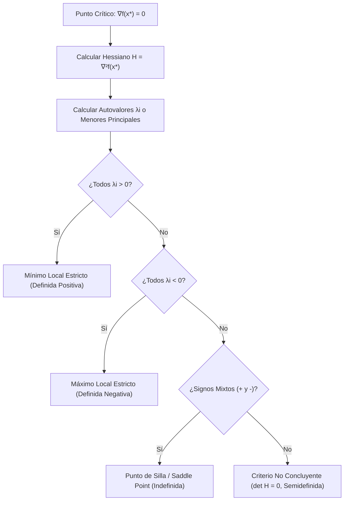
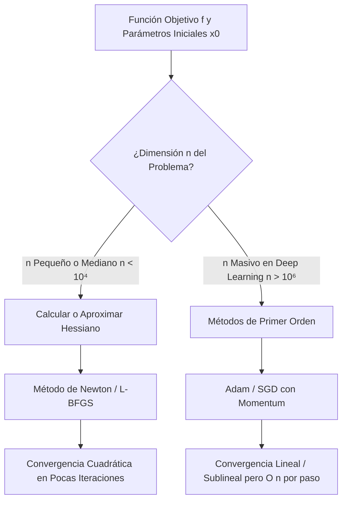

# Matriz Hessiana, Convexidad y Optimización Multivariable

En la computación contemporánea y la ciencia de datos en la Escuela Politécnica Nacional, comprender la **curvatura multivariable** es la clave para discernir entre algoritmos de convergencia lenta y métodos de aceleración cuadrática, así como para diseñar arquitecturas de redes neuronales capaces de escapar de trampas geométricas complejas.

Mientras que el vector gradiente proporciona únicamente información direccional de primer orden (pendiente local de un plano tangente), la **Matriz Hessiana** captura la **curvatura de segundo orden**, modulando cómo cambia la pendiente al desplazarse por el espacio de parámetros. Esta nota formaliza el análisis espectral del Hessiano, la teoría de la convexidad y su impacto en la optimización de algoritmos de Machine Learning.

> [!info] 💡 ¿Cómo entender esto desde cero? (Guía para novatos de pregrado)
> - **La limitación del Gradiente:** El gradiente solo te dice hacia dónde está la pendiente en este punto (primer orden). Pero no te dice si el suelo debajo de ti se está curvando hacia arriba, hacia abajo o torciéndose.
> - **La Matriz Hessiana (Curvatura de Segundo Orden):** Es la matriz que mide la curvatura del terreno en todas las direcciones:
>   - **Cuenco o Valle (Definida Positiva):** El suelo se curva hacia arriba en todas las direcciones. Si estás en el fondo, ¡es un **Mínimo Local**!
>   - **Cima de la montaña (Definida Negativa):** El suelo cae hacia abajo en todas direcciones. Es un **Máximo Local**.
>   - **Paso de montaña / Silla de montar (Indefinida):** Por un lado subes y por el otro caes. Es un **Punto de Silla**. En redes neuronales profundas hay millones de puntos de silla, y entender el Hessiano permite crear algoritmos como Adam para no quedarse atascado.
> - **Convexidad:** Un problema es convexo si su gráfica es como una taza gigante. ¡En los problemas convexos nunca te quedas atrapado en trampas locales; cualquier mínimo que encuentres es el mínimo absoluto global de todo el universo!

---

## 1. Segundas Derivadas Parciales y Teorema de Clairaut-Schwarz

### 1.1 Definición y Operadores de Segundo Orden

Dada una función $f: \Omega \subseteq \mathbb{R}^n \to \mathbb{R}$, las derivadas parciales de segundo orden se obtienen aplicando sucesivamente el operador de derivación parcial:
$$\frac{\partial^2 f}{\partial x_i \partial x_j} = \frac{\partial}{\partial x_i} \left( \frac{\partial f}{\partial x_j} \right)$$
Cuando $i = j$, se denominan derivadas parciales puras ($\frac{\partial^2 f}{\partial x_i^2}$). Cuando $i \neq j$, se denominan derivadas parciales mixtas o cruzadas.

### 1.2 Teorema de Simetría de Clairaut-Schwarz

A priori, el orden de derivación en las derivadas mixtas podría alterar el resultado. El Teorema de Clairaut (también atribuido a Schwarz) establece las condiciones de regularidad analítica bajo las cuales los operadores diferenciales conmutan.

> [!important] Teorema 1.1: Teorema de Clairaut-Schwarz (Igualdad de Derivadas Cruzadas)
> Sea $f: \Omega \subseteq \mathbb{R}^n \to \mathbb{R}$. Si las derivadas parciales mixtas $\frac{\partial^2 f}{\partial x_i \partial x_j}$ y $\frac{\partial^2 f}{\partial x_j \partial x_i}$ existen en un entorno del punto $\mathbf{x}_0$ y son **continuas en $\mathbf{x}_0$** (es decir, $f \in C^2(\Omega)$), entonces:
> $$\frac{\partial^2 f}{\partial x_i \partial x_j}(\mathbf{x}_0) = \frac{\partial^2 f}{\partial x_j \partial x_i}(\mathbf{x}_0)$$

*Demostración analítica (utilizando incrementos dobles y el Teorema del Valor Medio):*
Sin pérdida de generalidad, consideremos $n=2$ con variables $(x, y)$. Definimos el operador de diferencia finita bidimensional sobre un rectángulo de lados $h, k$:
$$\Delta(h, k) = f(x_0 + h, y_0 + k) - f(x_0 + h, y_0) - f(x_0, y_0 + k) + f(x_0, y_0)$$
Definimos la función auxiliar de una variable: $\varphi(x) = f(x, y_0 + k) - f(x, y_0)$.
Entonces $\Delta(h, k) = \varphi(x_0 + h) - \varphi(x_0)$.
Por el Teorema del Valor Medio de Lagrange en la variable $x$, existe $\xi \in (x_0, x_0 + h)$ tal que:
$$\Delta(h, k) = \varphi'(\xi) h = \left[ \frac{\partial f}{\partial x}(\xi, y_0 + k) - \frac{\partial f}{\partial x}(\xi, y_0) \right] h$$
Aplicando nuevamente el Teorema del Valor Medio, ahora a la función $y \mapsto \frac{\partial f}{\partial x}(\xi, y)$ en el intervalo $[y_0, y_0 + k]$, existe $\eta \in (y_0, y_0 + k)$ tal que:
$$\Delta(h, k) = \frac{\partial^2 f}{\partial y \partial x}(\xi, \eta) \cdot k \cdot h$$
De forma simétrica, definiendo $\psi(y) = f(x_0 + h, y) - f(x_0, y)$, se deduce análogamente que existen $\xi' \in (x_0, x_0 + h)$ y $\eta' \in (y_0, y_0 + k)$ tales que:
$$\Delta(h, k) = \frac{\partial^2 f}{\partial x \partial y}(\xi', \eta') \cdot h \cdot k$$
Igualando ambas expresiones y dividiendo entre $h k \neq 0$:
$$\frac{\partial^2 f}{\partial y \partial x}(\xi, \eta) = \frac{\partial^2 f}{\partial x \partial y}(\xi', \eta')$$
Tomando el límite cuando $(h, k) \to (0, 0)$, por la continuidad supuesta en $\mathbf{x}_0$, se concluye:
$$\frac{\partial^2 f}{\partial y \partial x}(x_0, y_0) = \frac{\partial^2 f}{\partial x \partial y}(x_0, y_0) \quad \blacksquare$$

---

## 2. Definición Formal de la Matriz Hessiana

> [!important] Definición 2.1: Matriz Hessiana
> Para una función dos veces diferenciable $f: \mathbb{R}^n \to \mathbb{R}$, la **Matriz Hessiana** $H_f(\mathbf{x}) \in \mathbb{R}^{n \times n}$ (o $\nabla^2 f(\mathbf{x})$) es la matriz cuadrada de segundas derivadas parciales:
> $$H_f(\mathbf{x}) = \begin{bmatrix}
> \frac{\partial^2 f}{\partial x_1^2} & \frac{\partial^2 f}{\partial x_1 \partial x_2} & \cdots & \frac{\partial^2 f}{\partial x_1 \partial x_n} \\
> \frac{\partial^2 f}{\partial x_2 \partial x_1} & \frac{\partial^2 f}{\partial x_2^2} & \cdots & \frac{\partial^2 f}{\partial x_2 \partial x_n} \\
> \vdots & \vdots & \ddots & \vdots \\
> \frac{\partial^2 f}{\partial x_n \partial x_1} & \frac{\partial^2 f}{\partial x_n \partial x_2} & \cdots & \frac{\partial^2 f}{\partial x_n^2}
> \end{bmatrix}$$

> [!tip] Propiedades Espectrales Clave del Hessiano
> 1. **Jacobiano del Gradiente:** El Hessiano es la matriz Jacobiana del vector gradiente:
>    $$H_f(\mathbf{x}) = J_{\nabla f}(\mathbf{x})$$
> 2. **Simetría:** Si $f \in C^2(\Omega)$, por Clairaut-Schwarz $H_f(\mathbf{x}) = H_f(\mathbf{x})^T$.
> 3. **Diagonalización Ortogonal:** Por el **Teorema Espectral**, toda matriz real y simétrica posee $n$ autovalores reales $\{\lambda_1, \lambda_2, \dots, \lambda_n\} \subset \mathbb{R}$ y una base ortonormal de autovectores $\{\mathbf{v}_1, \dots, \mathbf{v}_n\}$.

---

## 3. Expansión de Taylor Multivariable de Segundo Orden

La aproximación polinomial de segundo orden en $\mathbb{R}^n$ describe localmente la superficie de costo mediante un paraboloide elíptico o hiperbólico.

> [!important] Teorema 3.1: Teorema de Taylor de Segundo Orden en $\mathbb{R}^n$
> Sea $f: \Omega \subseteq \mathbb{R}^n \to \mathbb{R}$ de clase $C^2$ en un entorno convexo de $\mathbf{x}$. Para cualquier vector de perturbación $\Delta \mathbf{x} = \mathbf{h} \in \mathbb{R}^n$ suficientemente pequeño:
> $$f(\mathbf{x} + \Delta \mathbf{x}) = f(\mathbf{x}) + \nabla f(\mathbf{x})^T \Delta \mathbf{x} + \frac{1}{2} \Delta \mathbf{x}^T H_f(\mathbf{x}) \Delta \mathbf{x} + \mathcal{O}(\|\Delta \mathbf{x}\|_2^3)$$

La cantidad escalar $q(\Delta \mathbf{x}) = \Delta \mathbf{x}^T H_f(\mathbf{x}) \Delta \mathbf{x}$ es una **forma cuadrática** que rige el signo de la curvatura local:
$$q(\Delta \mathbf{x}) = \sum_{i=1}^n \sum_{j=1}^n \frac{\partial^2 f}{\partial x_i \partial x_j} \Delta x_i \Delta x_j$$

---

## 4. Criterio de la Matriz Hessiana para Clasificación de Puntos Críticos

Sea $\mathbf{x}^* \in \operatorname{int}(\Omega)$ un **punto crítico estacionario**, es decir, el vector gradiente se anula idénticamente:
$$\nabla f(\mathbf{x}^*) = \mathbf{0}$$

En tal punto, la expansión de Taylor colapsa a:
$$f(\mathbf{x}^* + \Delta \mathbf{x}) - f(\mathbf{x}^*) = \frac{1}{2} \Delta \mathbf{x}^T H_f(\mathbf{x}^*) \Delta \mathbf{x} + \mathcal{O}(\|\Delta \mathbf{x}\|_2^3)$$
Por tanto, el signo de la diferencia $f(\mathbf{x}^* + \Delta \mathbf{x}) - f(\mathbf{x}^*)$ en un entorno local queda gobernado enteramente por la forma cuadrática del Hessiano $H_f(\mathbf{x}^*)$.

### 4.1 Clasificación Espectral Rigurosa

1. **Definida Positiva ($H_f(\mathbf{x}^*) \succ 0$):**
   - **Condición:** Todos los autovalores son estrictamente positivos ($\lambda_i > 0, \forall i=1,\dots,n$).
   - **Forma Cuadrática:** $\Delta \mathbf{x}^T H_f(\mathbf{x}^*) \Delta \mathbf{x} > 0$ para todo $\Delta \mathbf{x} \neq \mathbf{0}$.
   - **Topología Local:** La función asciende en todas las direcciones radiales a partir de $\mathbf{x}^*$.
   - **Conclusión:** $\mathbf{x}^*$ es un **Mínimo Local Estricto**.

2. **Definida Negativa ($H_f(\mathbf{x}^*) \prec 0$):**
   - **Condición:** Todos los autovalores son estrictamente negativos ($\lambda_i < 0, \forall i=1,\dots,n$).
   - **Forma Cuadrática:** $\Delta \mathbf{x}^T H_f(\mathbf{x}^*) \Delta \mathbf{x} < 0$ para todo $\Delta \mathbf{x} \neq \mathbf{0}$.
   - **Topología Local:** La función desciende en todas las direcciones radiales.
   - **Conclusión:** $\mathbf{x}^*$ es un **Máximo Local Estricto**.

3. **Indefinida:**
   - **Condición:** Existen al menos dos autovalores con signos opuestos ($\exists \lambda_i > 0$ y $\exists \lambda_j < 0$).
   - **Topología Local:** A lo largo del autovector $\mathbf{v}_i$ la función se curva hacia arriba (mínimo direccional), mientras que a lo largo de $\mathbf{v}_j$ se curva hacia abajo (máximo direccional).
   - **Conclusión:** $\mathbf{x}^*$ es un **Punto de Silla (Saddle Point)**. No es ni máximo ni mínimo local.

4. **Semidefinida con Determinante Cero ($\det(H) = 0$):**
   - **Condición:** Al menos un autovalor es cero ($\lambda_k = 0$) y los demás no cambian de signo.
   - **Conclusión:** **Prueba no concluyente**. Se requiere analizar términos de Taylor de orden 3 o superior, o evaluar el comportamiento por curvas singulares.

> [!note] Criterio de los Menores Principales de Sylvester (Para Dimensiones $n=2$ y $n=3$)
> Sea $\Delta_k = \det(H_k)$ el determinante de la submatriz principal de orden $k \times k$ en la esquina superior izquierda de $H$:
> - **Definida Positiva:** Todos los menores son positivos: $\Delta_1 > 0, \Delta_2 > 0, \dots, \Delta_n > 0$.
> - **Definida Negativa:** Los menores alternan de signo comenzando por negativo: $\Delta_1 < 0, \Delta_2 > 0, \Delta_3 < 0, \dots, (-1)^k \Delta_k > 0$.

---

## 5. Visualización Geométrica: Cuenca Parabólica vs. Puerto de Montaña

Para interiorizar la naturaleza cualitativa de las formas cuadráticas multivariables, analizamos la representación gráfica siguiente almacenada en el repositorio:

![[hessiano-convexidad-grafico.png]]

### 5.1 Análisis Comparativo de la Geometría Cuadrática

> [!important] Geometría de la Cuenca Parabólica (Mínimo Local Estricto)
> - **Estructura Analítica:** Corresponde a la superficie $f(x, y) = x^2 + y^2$.
> - **Gradiente y Hessiano:** En $(0, 0)$, $\nabla f = [0, 0]^T$ y su Hessiano es $H = \begin{bmatrix} 2 & 0 \\ 0 & 2 \end{bmatrix}$, cuyos autovalores son $\lambda_1 = 2 > 0, \lambda_2 = 2 > 0$ (**Definida Positiva**).
> - **Geometría:** Las curvas de nivel son circunferencias concéntricas. La curvatura es uniformemente positiva en todas las direcciones del plano. Cualquier paso infinitesimal en cualquier dirección aumenta el valor de la función. En algoritmos de optimización, esta cuenca actúa como un atractor gravitacional estable para el descenso del gradiente.

> [!warning] Geometría del Puerto de Montaña / Punto de Silla (Hessiano Indefinido)
> - **Estructura Analítica:** Corresponde al paraboloide hiperbólico $f(x, y) = x^2 - y^2$.
> - **Gradiente y Hessiano:** En $(0, 0)$, $\nabla f = [0, 0]^T$ y su Hessiano es $H = \begin{bmatrix} 2 & 0 \\ 0 & -2 \end{bmatrix}$, con autovalores $\lambda_1 = 2 > 0$ y $\lambda_2 = -2 < 0$ (**Matriz Indefinida**).
> - **Geometría:** En la dirección del eje $X$ (autovector $[1, 0]^T$), la superficie tiene una curvatura positiva cóncava hacia arriba (valle). En la dirección del eje $Y$ (autovector $[0, 1]^T$), la superficie tiene curvatura negativa cóncava hacia abajo (cresta).
> - **Impacto Crítico en Deep Learning:** En espacios de alta dimensionalidad ($n \approx 10^7 - 10^{11}$ parámetros), la probabilidad de que un punto estacionario sea un mínimo local estricto ($\text{todos } \lambda_i > 0$) es casi nula ($2^{-n}$ bajo modelos de matrices aleatorias de Wigner); **la inmensa mayoría de los puntos críticos con gradiente cero son puntos de silla**, donde las direcciones de curvatura negativa permiten seguir descendiendo si el optimizador usa ruido estocástico o información de segundo orden.

---

## 6. Teoría de la Convexidad en $\mathbb{R}^n$

La convexidad es la propiedad matemática más preciada en optimización: transforma la búsqueda de extremos en un problema determinista sin mínimos locales espurios.

### 6.1 Definiciones Formales

> [!note] Definición 6.1: Conjunto Convexo
> Un conjunto $C \subseteq \mathbb{R}^n$ es **convexo** si para todo par de puntos $\mathbf{x}, \mathbf{y} \in C$ y todo escalar $\theta \in [0, 1]$:
> $$\theta \mathbf{x} + (1 - \theta)\mathbf{y} \in C$$
> El segmento que une cualquier par de puntos del conjunto permanece enteramente dentro de él.

> [!note] Definición 6.2: Función Convexa
> Sea $C \subseteq \mathbb{R}^n$ un conjunto convexo. Una función $f: C \to \mathbb{R}$ es **convexa** si para todo $\mathbf{x}, \mathbf{y} \in C$ y todo $\theta \in [0, 1]$:
> $$f(\theta \mathbf{x} + (1 - \theta)\mathbf{y}) \le \theta f(\mathbf{x}) + (1 - \theta) f(\mathbf{y})$$
> La cuerda secante que une dos puntos sobre la gráfica de la función siempre se sitúa por encima o sobre la propia función. Si la desigualdad es estricta para $\mathbf{x} \neq \mathbf{y}$ y $\theta \in (0, 1)$, se dice **estrictamente convexa**.

### 6.2 Caracterizaciones Diferenciales de Convexidad

> [!tip] Criterio de Primer Orden para Convexidad
> Si $f: \Omega \to \mathbb{R}$ es diferenciable en un abierto convexo $\Omega$, $f$ es convexa si y solo si:
> $$f(\mathbf{y}) \ge f(\mathbf{x}) + \nabla f(\mathbf{x})^T (\mathbf{y} - \mathbf{x}), \quad \forall \mathbf{x}, \mathbf{y} \in \Omega$$
> Geométricamente: el hiperplano tangente se ubica siempre como una cota inferior global de la función.

> [!important] Teorema 6.1: Criterio de Segundo Orden para Convexidad
> Sea $f: \Omega \to \mathbb{R}$ dos veces continuamente diferenciable ($C^2$) en un abierto convexo $\Omega$. Entonces:
> $$f \text{ es CONVEXA en } \Omega \iff H_f(\mathbf{x}) \succeq 0 \quad (\text{Semidefinida Positiva}), \quad \forall \mathbf{x} \in \Omega$$
> Además, si $H_f(\mathbf{x}) \succ 0$ (Definida Positiva) para todo $\mathbf{x} \in \Omega$, entonces $f$ es **estrictamente convexa**.

### 6.3 El Teorema Maestro de la Optimización Convexa

> [!important] Teorema 6.2: Teorema Fundamental de la Optimización Convexa
> Sea $f: C \subseteq \mathbb{R}^n \to \mathbb{R}$ una función convexa definida sobre un conjunto convexo $C$.
> 1. **Todo mínimo local de $f$ es automáticamente un MÍNIMO GLOBAL.**
> 2. El conjunto de puntos donde $f$ alcanza su mínimo global es un conjunto convexo.
> 3. Si además $f$ es **estrictamente convexa**, el mínimo global es **ÚNICO**.

*Demostración:*
Supongamos por contradicción que $\mathbf{x}^*$ es un mínimo local, pero existe otro punto $\mathbf{y} \in C$ tal que $f(\mathbf{y}) < f(\mathbf{x}^*)$.
Por ser $\mathbf{x}^*$ mínimo local, existe un radio $\delta > 0$ tal que para todo $\mathbf{z} \in C$ con $\|\mathbf{z} - \mathbf{x}^*\| < \delta$, se cumple $f(\mathbf{z}) \ge f(\mathbf{x}^*)$.
Construimos un punto intermedio sobre el segmento convexo: $\mathbf{z} = \theta \mathbf{y} + (1 - \theta)\mathbf{x}^* = \mathbf{x}^* + \theta (\mathbf{y} - \mathbf{x}^*)$ con $\theta \in (0, 1)$.
Eligiendo $\theta = \frac{\delta}{2 \|\mathbf{y} - \mathbf{x}^*\|} \in (0, 1)$, se garantiza $\|\mathbf{z} - \mathbf{x}^*\| = \frac{\delta}{2} < \delta$, por ende debe verificarse:
$$f(\mathbf{z}) \ge f(\mathbf{x}^*)$$
No obstante, por la definición de convexidad de $f$:
$$f(\mathbf{z}) \le \theta f(\mathbf{y}) + (1 - \theta) f(\mathbf{x}^*) = f(\mathbf{x}^*) + \theta [f(\mathbf{y}) - f(\mathbf{x}^*)]$$
Como por hipótesis $f(\mathbf{y}) - f(\mathbf{x}^*) < 0$ y $\theta > 0$:
$$f(\mathbf{z}) < f(\mathbf{x}^*)$$
Lo cual contradice la desigualdad $f(\mathbf{z}) \ge f(\mathbf{x}^*)$. La contradicción demuestra que no puede existir tal $\mathbf{y}$, y por lo tanto $\mathbf{x}^*$ es un mínimo global. $\blacksquare$

---

## 7. Optimización de Segundo Orden: El Método de Newton Multivariable

### 7.1 Deducción Algorítmica

El método clásico de [[Gradient Descent]] solo utiliza el vector gradiente, lo que causa oscilaciones en valles alargados o mal condicionados. El **Método de Newton** incorpora la curvatura del Hessiano para calcular el salto óptimo en una sola operación teórica.

Aproximamos $f(\mathbf{x} + \Delta \mathbf{x})$ por su polinomio de Taylor de segundo orden:
$$q(\Delta \mathbf{x}) = f(\mathbf{x}) + \nabla f(\mathbf{x})^T \Delta \mathbf{x} + \frac{1}{2} \Delta \mathbf{x}^T H_f(\mathbf{x}) \Delta \mathbf{x}$$
Para encontrar el vector de avance $\Delta \mathbf{x}$ que minimiza esta aproximación cuadrática, derivamos $q(\Delta \mathbf{x})$ con respecto al vector $\Delta \mathbf{x}$ e igualamos a cero:
$$\nabla_{\Delta \mathbf{x}} q(\Delta \mathbf{x}) = \nabla f(\mathbf{x}) + H_f(\mathbf{x}) \Delta \mathbf{x} = \mathbf{0}$$
Despejando el vector de avance $\Delta \mathbf{x}$ (asumiendo $H_f(\mathbf{x})$ invertible):
$$H_f(\mathbf{x}) \Delta \mathbf{x} = -\nabla f(\mathbf{x}) \implies \Delta \mathbf{x} = - H_f(\mathbf{x})^{-1} \nabla f(\mathbf{x})$$

> [!important] Ecuación de Iteración del Método de Newton Multivariable
> $$\mathbf{x}^{(t+1)} = \mathbf{x}^{(t)} - \left[ H_f(\mathbf{x}^{(t)}) \right]^{-1} \nabla f(\mathbf{x}^{(t)})$$

### 7.2 Convergencia Cuadrática vs. Convergencia Lineal

- **Descenso del Gradiente (Primer Orden):** Posee convergencia lineal:
  $$\|\mathbf{x}^{(t+1)} - \mathbf{x}^*\| \le C \|\mathbf{x}^{(t)} - \mathbf{x}^*\| \quad (C \in (0, 1))$$
  El número de dígitos exactos de precisión aumenta de forma aritméticamente constante en cada iteración.
- **Método de Newton (Segundo Orden):** Cerca del óptimo $\mathbf{x}^*$ (en la región de atracción cuadrática), posee **tasa de convergencia cuadrática**:
  $$\|\mathbf{x}^{(t+1)} - \mathbf{x}^*\| \le M \|\mathbf{x}^{(t)} - \mathbf{x}^*\|^2$$
  ¡El número de dígitos de precisión exactos **se duplica en cada iteración**! Si el error en el paso $t$ es $10^{-2}$, en el paso siguiente pasa a $10^{-4}$, luego a $10^{-8}$ y a $10^{-16}$.

### 7.3 Limitaciones Computacionales en Deep Learning

A pesar de su velocidad de convergencia teórica insuperable, el Método de Newton puro es computacionalmente inviable en el entrenamiento de redes neuronales modernas:

1. **Complejidad Temporal:** Invertir la matriz Hessiana o resolver el sistema lineal $H \mathbf{p} = -\mathbf{g}$ mediante descomposición de Cholesky requiere $\mathcal{O}(n^3)$ operaciones de punto flotante (FLOPs). Si una red convolucional o Transformer tiene $n = 10^8$ parámetros, $n^3 = 10^{24}$ operaciones por iteración, algo astronómicamente prohibitivo.
2. **Complejidad Espacial:** Almacenar el Hessiano en memoria VRAM requiere $\mathcal{O}(n^2)$ espacio. Para $n = 10^7$ parámetros en precisión float32 (4 bytes), la matriz requeriría:
   $$(10^7)^2 \times 4 \text{ bytes} = 10^{14} \text{ bytes} \approx 400 \text{ Terabytes de VRAM}$$
3. **Atracción hacia Puntos de Silla:** Si el Hessiano no es estrictamente definido positivo ($H \nsucc 0$), el método de Newton puede dar pasos hacia máximos locales o quedarse oscilando violentamente en puntos de silla donde $\nabla f \approx \mathbf{0}$.
4. **Soluciones en la Práctica:** La industria recurre a métodos **Quasi-Newton** (como BFGS y L-BFGS, que construyen aproximaciones de bajo rango del inverso del Hessiano en $\mathcal{O}(m n)$ memoria) o a optimizadores de primer orden con momentos adaptativos como Adam, RMSprop o SGD con Momentum.

---

## 8. Diagrama de Decisión Algorítmica en Optimización

---

## 9. Conexiones y Referencias Cruzadas

- [[Calculo Diferencial y Teoremas Fundamentales]]: Criterio de la segunda derivada escalar y Taylor 1D.
- [[Calculo Multivariable, Gradiente y Matriz Jacobiana]]: Definición del vector gradiente y Jacobiana.
- [[Optimizacion con Restricciones y Multiplicadores de Lagrange]]: Hessiano orlado (Bordered Hessian) y condiciones de segundo orden bajo restricciones.
- [[Gradient Descent]]: Comparativa directa de tasas de convergencia y paisajes de optimización.
- [[Support Vector Machines (SVM)]]: Problemas cuadráticos convexos con matrices Hessianas semidefinidas positivas.