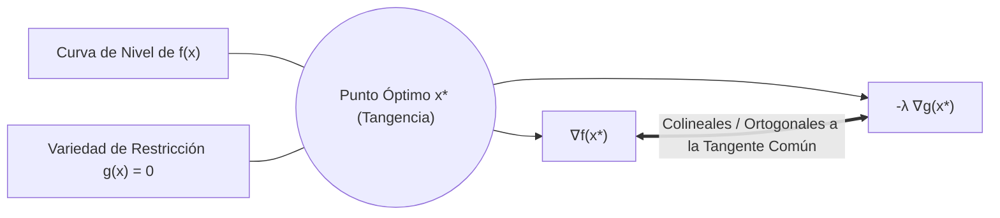
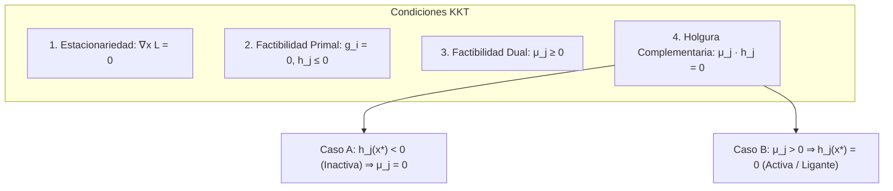
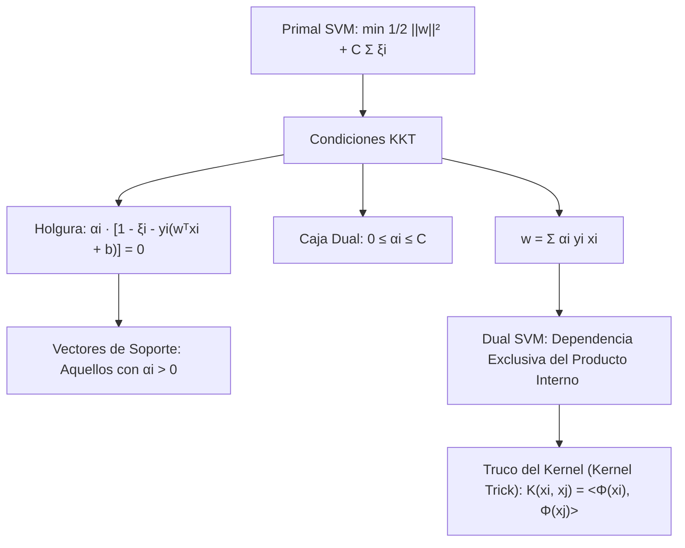
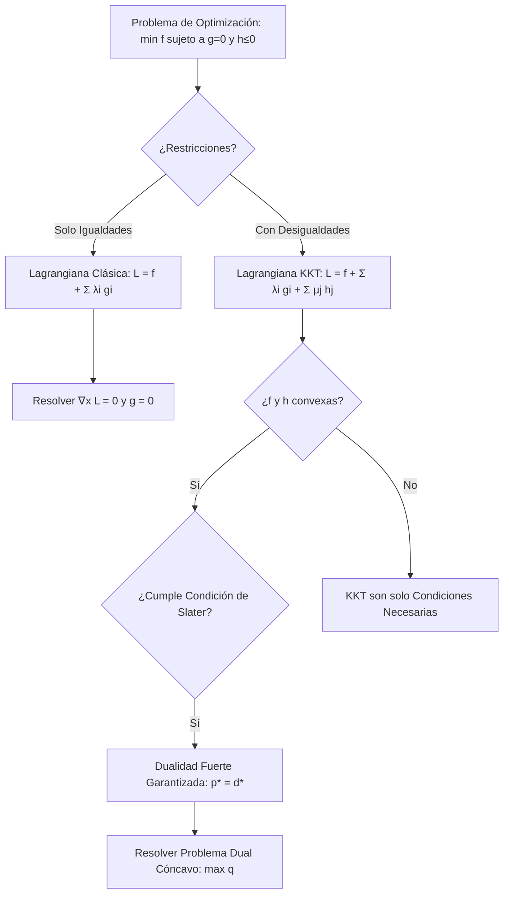

# Optimización con Restricciones y Multiplicadores de Lagrange

En la carrera de Ingeniería en Ciencias de la Computación de la Escuela Politécnica Nacional, los problemas reales rara vez se formulan como una minimización irrestricta en el espacio euclidiano $\mathbb{R}^n$. El diseño de algoritmos de compresión, el entrenamiento de clasificadores de margen máximo, la asignación de recursos en clústeres de computación en la nube (cloud computing) y el enrutamiento óptimo en redes de datos están sujetos a **restricciones físicas, presupuestarias y de latencia**.

Esta nota formaliza la teoría matemática de la **optimización no lineal bajo restricciones**, transitando desde el método geométrico clásico de Joseph-Louis Lagrange para igualdades, hasta las condiciones necesarias y suficientes de Karush-Kuhn-Tucker (KKT), la teoría de la dualidad y su aplicación angular en [[Support Vector Machines (SVM)]].

> [!info] 💡 ¿Cómo entender esto desde cero? (Guía para novatos de pregrado)
> - **El dilema de la vida real:** Quieres comprar la mayor cantidad de cosas ricas en el supermercado (maximizar satisfacción), pero solo tienes 30 dólares en el bolsillo (restricción). Casi ningún problema de ingeniería es libre; siempre hay presupuestos, límites de CPU, memoria RAM máxima o leyes físicas.
> - **Multiplicadores de Lagrange (Restricciones de Igualdad):** En lugar de adivinar, Lagrange descubrió que en el punto óptimo, la curva de lo que quieres maximizar debe ser **tangente** a la curva de tu límite. El multiplicador $\lambda$ te dice exactamente "cuánto mejoraría tu felicidad si te dieran 1 dólar más de presupuesto" (precio sombra).
> - **Condiciones KKT (Desigualdades):** Generaliza Lagrange para límites del tipo "gastar $\le 30$". Te dice formalmente si tu límite te está frenando o si te sobró recurso.
> - **Aplicación estrella en CS:** En **Support Vector Machines (SVM)**, las condiciones KKT son las que descubren cuáles son los "vectores de soporte" que sostienen la frontera de decisión para clasificar datos.

---

## 1. Formulación Canónica del Problema Primal de Optimización

> [!important] Definición 1.1: Problema Primal Estándar de Programación No Lineal
> Dados un campo escalar objetivo $f: \mathbb{R}^n \to \mathbb{R}$, $m$ funciones de restricción de igualdad $g_i: \mathbb{R}^n \to \mathbb{R}$, y $p$ funciones de restricción de desigualdad $h_j: \mathbb{R}^n \to \mathbb{R}$, el problema de optimización primal se formula canónicamente como:
> $$\begin{aligned}
> \min_{\mathbf{x} \in \mathcal{D}} \quad & f(\mathbf{x}) \\
> \text{sujeto a} \quad & g_i(\mathbf{x}) = 0, \quad i = 1, 2, \dots, m \\
> & h_j(\mathbf{x}) \le 0, \quad j = 1, 2, \dots, p
> \end{aligned}$$
> donde $\mathcal{D} = \operatorname{dom}(f) \cap \bigcap_{i=1}^m \operatorname{dom}(g_i) \cap \bigcap_{j=1}^p \operatorname{dom}(h_j) \subseteq \mathbb{R}^n$.

> [!note] Definición 1.2: Región Factible
> El conjunto de puntos que satisfacen simultáneamente todas las restricciones se denomina **región factible** $\mathcal{F}$:
> $$\mathcal{F} = \{ \mathbf{x} \in \mathcal{D} \mid g_i(\mathbf{x}) = 0 \; (\forall i) \quad \text{y} \quad h_j(\mathbf{x}) \le 0 \; (\forall j) \}$$
> El valor óptimo primal se denota por $p^* = \inf_{\mathbf{x} \in \mathcal{F}} f(\mathbf{x})$.

---

## 2. Restricciones de Igualdad y el Método de Multiplicadores de Lagrange

Consideremos inicialmente el caso con restricciones puras de igualdad: $\min f(\mathbf{x})$ sujeto a $g_i(\mathbf{x}) = 0$ ($i = 1, \dots, m$, con $m < n$). La región factible define una subvariedad diferenciable $\mathcal{M}$ de dimensión $n - m$ embebida en $\mathbb{R}^n$.

### 2.1 Interpretación Geométrica Profunda

Imaginemos que nos movemos a lo largo de la superficie de restricción $\mathcal{M} = \{\mathbf{x} \in \mathbb{R}^n \mid g(\mathbf{x}) = 0\}$.
- Si en un punto factible $\mathbf{x}$, el vector gradiente $\nabla f(\mathbf{x})$ tuviese una componente tangencial no nula proyectada sobre la variedad $\mathcal{M}$, sería posible dar un desplazamiento infinitesimal admisible $\mathbf{d} \in T_{\mathbf{x}} \mathcal{M}$ tal que $\langle \nabla f(\mathbf{x}), \mathbf{d} \rangle < 0$, disminuyendo aún más el valor de la función objetivo sin abandonar la restricción.
- Por consiguiente, en el punto óptimo local condicionado $\mathbf{x}^*$, **el gradiente $\nabla f(\mathbf{x}^*)$ debe carecer por completo de componentes tangenciales a la variedad**.
- Esto implica que $\nabla f(\mathbf{x}^*)$ debe pertenecer enteramente al espacio normal a la variedad. Como el espacio normal está generado por los gradientes de las restricciones $\{\nabla g_1(\mathbf{x}^*), \dots, \nabla g_m(\mathbf{x}^*)\}$, se deduce algebraicamente que:
  $$\nabla f(\mathbf{x}^*) + \sum_{i=1}^m \lambda_i^* \nabla g_i(\mathbf{x}^*) = \mathbf{0}$$

> [!important] En el punto óptimo, las curvas de nivel de la función objetivo son tangentes a la superficie de restricción. Es imposible mejorar la función objetivo sin violar la restricción.

### 2.2 La Función Lagrangiana

> [!note] Definición 2.1: Función Lagrangiana (Solo Igualdades)
> Se define la función Lagrangiana $\mathcal{L}: \mathbb{R}^n \times \mathbb{R}^m \to \mathbb{R}$ combinando la función objetivo y las restricciones mediante escalares $\lambda_i \in \mathbb{R}$ denominados **Multiplicadores de Lagrange**:
> $$\mathcal{L}(\mathbf{x}, \boldsymbol{\lambda}) = f(\mathbf{x}) + \sum_{i=1}^m \lambda_i g_i(\mathbf{x})$$

El sistema de condiciones necesarias de primer orden para encontrar los puntos estacionarios condicionados equivale a anular simultáneamente todas las derivadas parciales de $\mathcal{L}$:
$$\begin{aligned}
\nabla_{\mathbf{x}} \mathcal{L}(\mathbf{x}, \boldsymbol{\lambda}) &= \nabla f(\mathbf{x}) + \sum_{i=1}^m \lambda_i \nabla g_i(\mathbf{x}) = \mathbf{0} \quad &(n \text{ ecuaciones}) \\
\nabla_{\boldsymbol{\lambda}} \mathcal{L}(\mathbf{x}, \boldsymbol{\lambda}) &= \begin{bmatrix} g_1(\mathbf{x}) \\ \vdots \\ g_m(\mathbf{x}) \end{bmatrix} = \mathbf{0} \quad &(m \text{ ecuaciones})
\end{aligned}$$
Esto conforma un sistema cerrado de $n + m$ ecuaciones no lineales con $n + m$ incógnitas $(\mathbf{x}^*, \boldsymbol{\lambda}^*)$.

> [!tip] Interpretación Económica y Sensibilidad (Precio Sombra)
> Si perturbamos el nivel de restricción de $g_i(\mathbf{x}) = 0$ a $g_i(\mathbf{x}) = c_i$, el multiplicador óptimo $\lambda_i^*$ representa la tasa marginal de variación del valor óptimo de la función:
> $$\lambda_i^* = -\frac{\partial f^*}{\partial c_i}$$
> En economía e ingeniería de sistemas, $\lambda_i^*$ se conoce como el **precio sombra (shadow price)** del recurso restringido.

---

## 3. Condiciones de Karush-Kuhn-Tucker (KKT) para Desigualdades

Cuando intervienen restricciones de desigualdad $h_j(\mathbf{x}) \le 0$, el óptimo puede situarse en el interior de la región factible ($h_j(\mathbf{x}) < 0$) o en su contorno frontera ($h_j(\mathbf{x}) = 0$).

> [!important] Definición 3.1: Lagrangiana Generalizada
> Para el problema primal canónico completo:
> $$\mathcal{L}(\mathbf{x}, \boldsymbol{\lambda}, \boldsymbol{\mu}) = f(\mathbf{x}) + \sum_{i=1}^m \lambda_i g_i(\mathbf{x}) + \sum_{j=1}^p \mu_j h_j(\mathbf{x})$$
> donde $\boldsymbol{\lambda} \in \mathbb{R}^m$ son los multiplicadores de igualdad y $\boldsymbol{\mu} \in \mathbb{R}^p$ son los multiplicadores de desigualdad.

### 3.1 Teorema de las Condiciones KKT

> [!important] Teorema 3.1: Condiciones Necesarias de Karush-Kuhn-Tucker (KKT)
> Sea $\mathbf{x}^*$ un mínimo local del problema primal y supongamos que se cumple una condición de calificación de restricciones (Constraint Qualification). Entonces existen vectores de multiplicadores $\boldsymbol{\lambda}^* \in \mathbb{R}^m$ y $\boldsymbol{\mu}^* \in \mathbb{R}^p$ tales que se satisfacen rigurosamente las siguientes cuatro condiciones:
> 
> 1. **Estacionariedad del Gradiente:**
>    $$\nabla_{\mathbf{x}} \mathcal{L}(\mathbf{x}^*, \boldsymbol{\lambda}^*, \boldsymbol{\mu}^*) = \nabla f(\mathbf{x}^*) + \sum_{i=1}^m \lambda_i^* \nabla g_i(\mathbf{x}^*) + \sum_{j=1}^p \mu_j^* \nabla h_j(\mathbf{x}^*) = \mathbf{0}$$
> 
> 2. **Factibilidad Primal:**
>    $$g_i(\mathbf{x}^*) = 0, \quad \forall i = 1, \dots, m$$
>    $$h_j(\mathbf{x}^*) \le 0, \quad \forall j = 1, \dots, p$$
> 
> 3. **Factibilidad Dual (No Negatividad de los Multiplicadores de Desigualdad):**
>    $$\mu_j^* \ge 0, \quad \forall j = 1, \dots, p$$
> 
> 4. **Holgura Complementaria (Complementary Slackness):**
>    $$\mu_j^* \cdot h_j(\mathbf{x}^*) = 0, \quad \forall j = 1, \dots, p$$

### 3.2 Desentrañando la Holgura Complementaria

La condición $\mu_j^* h_j(\mathbf{x}^*) = 0$ es el núcleo algorítmico de la optimización con desigualdades:
- **Restricción Inactiva ($h_j(\mathbf{x}^*) < 0$):** El óptimo se encuentra holgadamente en el interior de la zona permitida por la restricción. La restricción no está obstaculizando la búsqueda del mínimo; por lo tanto, forzosamente $\mu_j^* = 0$. La restricción no ejerce presión ni influye en el gradiente de la solución.
- **Restricción Activa o Ligante ($h_j(\mathbf{x}^*) = 0$):** El óptimo choca contra la frontera impuesta por la desigualdad. La función objetivo intenta descender hacia una zona prohibida, pero la restricción la retiene; por lo tanto, $\mu_j^* > 0$, actuando como una fuerza restrictiva que equilibra el gradiente $\nabla f(\mathbf{x}^*)$.

> [!tip] Suficiencia de las Condiciones KKT en Problemas Convexos
> Si la función objetivo $f(\mathbf{x})$ es convexa, las restricciones de desigualdad $h_j(\mathbf{x})$ son funciones convexas, y las restricciones de igualdad son afines ($g_i(\mathbf{x}) = \mathbf{a}_i^T \mathbf{x} - b_i$), entonces **las condiciones KKT son tanto necesarias como SUFICIENTES para la optimalidad global**.

---

## 4. Teoría de la Dualidad de Lagrange

La dualidad permite transformar un problema de optimización difícil sobre variables acopladas con restricciones, en un problema equivalente (a menudo cóncavo y sin restricciones complicadas) sobre los multiplicadores.

### 4.1 La Función Dual de Lagrange

> [!note] Definición 4.1: Función Dual de Lagrange
> Se define la función dual $q: \mathbb{R}^m \times \mathbb{R}^p \to \mathbb{R} \cup \{-\infty\}$ como el ínfimo de la Lagrangiana sobre todas las variables primales:
> $$q(\boldsymbol{\lambda}, \boldsymbol{\mu}) = \inf_{\mathbf{x} \in \mathcal{D}} \mathcal{L}(\mathbf{x}, \boldsymbol{\lambda}, \boldsymbol{\mu}) = \inf_{\mathbf{x} \in \mathcal{D}} \left( f(\mathbf{x}) + \sum_{i=1}^m \lambda_i g_i(\mathbf{x}) + \sum_{j=1}^p \mu_j h_j(\mathbf{x}) \right)$$

> [!important] Teorema 4.1: Concavidad Intrínseca de la Función Dual
> Para cualquier problema de optimización arbitrario (incluso si la función objetivo $f$ o las restricciones no son convexas), **la función dual $q(\boldsymbol{\lambda}, \boldsymbol{\mu})$ es siempre cóncava**, y su dominio $\{ (\boldsymbol{\lambda}, \boldsymbol{\mu}) \mid q(\boldsymbol{\lambda}, \boldsymbol{\mu}) > -\infty \}$ es un conjunto convexo.
> *Razón:* $q$ es el ínfimo puntual de una familia de funciones afines (y por tanto cóncavas) en $(\boldsymbol{\lambda}, \boldsymbol{\mu})$.

### 4.2 Teorema de Dualidad Débil y Salto de Dualidad

> [!important] Teorema 4.2: Teorema de Dualidad Débil
> Sea $\tilde{\mathbf{x}} \in \mathcal{F}$ cualquier punto factible primal, y sean $\boldsymbol{\lambda} \in \mathbb{R}^m$, $\boldsymbol{\mu} \ge \mathbf{0}$ factibles duales. Entonces:
> $$q(\boldsymbol{\lambda}, \boldsymbol{\mu}) \le f(\tilde{\mathbf{x}})$$
> En particular, para el valor óptimo dual $d^* = \sup_{\boldsymbol{\mu} \ge \mathbf{0}, \boldsymbol{\lambda}} q(\boldsymbol{\lambda}, \boldsymbol{\mu})$ y el valor óptimo primal $p^* = \inf_{\mathbf{x} \in \mathcal{F}} f(\mathbf{x})$:
> $$d^* \le p^*$$

*Demostración:*
Para cualquier $\tilde{\mathbf{x}} \in \mathcal{F}$, tenemos $g_i(\tilde{\mathbf{x}}) = 0$ y $h_j(\tilde{\mathbf{x}}) \le 0$. Como $\mu_j \ge 0$, el producto $\mu_j h_j(\tilde{\mathbf{x}}) \le 0$:
$$\mathcal{L}(\tilde{\mathbf{x}}, \boldsymbol{\lambda}, \boldsymbol{\mu}) = f(\tilde{\mathbf{x}}) + \sum_{i=1}^m \lambda_i \underbrace{g_i(\tilde{\mathbf{x}})}_{=0} + \sum_{j=1}^p \underbrace{\mu_j h_j(\tilde{\mathbf{x}})}_{\le 0} \le f(\tilde{\mathbf{x}})$$
Por definición de ínfimo:
$$q(\boldsymbol{\lambda}, \boldsymbol{\mu}) = \inf_{\mathbf{x}} \mathcal{L}(\mathbf{x}, \boldsymbol{\lambda}, \boldsymbol{\mu}) \le \mathcal{L}(\tilde{\mathbf{x}}, \boldsymbol{\lambda}, \boldsymbol{\mu}) \le f(\tilde{\mathbf{x}})$$
Dado que esto se cumple para todo $\tilde{\mathbf{x}} \in \mathcal{F}$ y todo $(\boldsymbol{\lambda}, \boldsymbol{\mu})$ con $\boldsymbol{\mu} \ge \mathbf{0}$, tomando el supremo a la izquierda y el ínfimo a la derecha:
$$d^* \le p^* \quad \blacksquare$$

> [!note] Definición 4.2: Salto de Dualidad (Duality Gap)
> La diferencia no negativa:
> $$\Delta = p^* - d^* \ge 0$$
> se denomina **salto de dualidad**.

### 4.3 Dualidad Fuerte y Condición de Calificación de Slater

Se dice que existe **Dualidad Fuerte** cuando el salto de dualidad colapsa exactamente a cero:
$$d^* = p^*$$
En dicho escenario, resolver el problema dual es exactamente equivalente a resolver el problema primal original.

> [!important] Teorema 4.3: Condición de Calificación de Slater
> Si el problema primal es **convexo** ($f$ y $h_j$ convexas, $g_i$ afines) y existe al menos un punto estrictamente factible $\mathbf{x}_0 \in \operatorname{int}(\mathcal{D})$ tal que:
> $$g_i(\mathbf{x}_0) = 0 \quad (\forall i) \quad \text{y} \quad h_j(\mathbf{x}_0) < 0 \quad (\forall j)$$
> entonces **se verifica la Dualidad Fuerte ($p^* = d^*$)** y el problema dual alcanza su solución óptima $(\boldsymbol{\lambda}^*, \boldsymbol{\mu}^*)$.

---

## 5. Aplicaciones Cruciales en Ciencias de la Computación

### 5.1 Deducción del Problema Dual en [[Support Vector Machines (SVM)]]

En aprendizaje supervisado, un clasificador SVM lineal busca encontrar un hiperplano de decisión separador $\mathbf{w}^T \mathbf{x} + b = 0$ que maximice el margen geométrico $\frac{2}{\|\mathbf{w}\|_2}$, admitiendo penalizaciones por errores de margen blando (soft-margin) mediante variables de holgura $\xi_i \ge 0$.

#### Formulación Primal Canónica
$$\begin{aligned}
\min_{\mathbf{w} \in \mathbb{R}^d, b \in \mathbb{R}, \boldsymbol{\xi} \in \mathbb{R}^N} \quad & \frac{1}{2} \|\mathbf{w}\|_2^2 + C \sum_{i=1}^N \xi_i \\
\text{sujeto a} \quad & 1 - \xi_i - y_i(\mathbf{w}^T \mathbf{x}_i + b) \le 0, \quad i = 1, \dots, N \\
& -\xi_i \le 0, \quad i = 1, \dots, N
\end{aligned}$$
donde $(\mathbf{x}_i, y_i)$ son los datos de entrenamiento con etiquetas binarias $y_i \in \{-1, +1\}$, y $C > 0$ es el hiperparámetro de regularización.

#### Construcción de la Lagrangiana Generalizada
Asociamos multiplicadores $\alpha_i \ge 0$ a la restricción del margen y $\beta_i \ge 0$ a la no negatividad de $\xi_i$:
$$\mathcal{L}(\mathbf{w}, b, \boldsymbol{\xi}, \boldsymbol{\alpha}, \boldsymbol{\beta}) = \frac{1}{2} \|\mathbf{w}\|_2^2 + C \sum_{i=1}^N \xi_i + \sum_{i=1}^N \alpha_i \left( 1 - \xi_i - y_i(\mathbf{w}^T \mathbf{x}_i + b) \right) - \sum_{i=1}^N \beta_i \xi_i$$

#### Aplicación de las Condiciones de Estacionariedad KKT
Derivamos con respecto a las tres variables primales e igualamos a cero:
1. $\nabla_{\mathbf{w}} \mathcal{L} = \mathbf{w} - \sum_{i=1}^N \alpha_i y_i \mathbf{x}_i = \mathbf{0} \implies \mathbf{w} = \sum_{i=1}^N \alpha_i y_i \mathbf{x}_i$
2. $\frac{\partial \mathcal{L}}{\partial b} = -\sum_{i=1}^N \alpha_i y_i = 0 \implies \sum_{i=1}^N \alpha_i y_i = 0$
3. $\frac{\partial \mathcal{L}}{\partial \xi_i} = C - \alpha_i - \beta_i = 0 \implies \alpha_i + \beta_i = C$
   Como $\beta_i \ge 0$, esto acota superiormente a $\alpha_i$: $0 \le \alpha_i \le C$.

#### Sustitución en la Lagrangiana para Obtener el Problema Dual
Sustituyendo $\mathbf{w}$ y cancelando los términos que involucran $b$ y $\boldsymbol{\xi}$:
$$q(\boldsymbol{\alpha}) = \sum_{i=1}^N \alpha_i - \frac{1}{2} \sum_{i=1}^N \sum_{j=1}^N \alpha_i \alpha_j y_i y_j \langle \mathbf{x}_i, \mathbf{x}_j \rangle$$

> [!important] Formulación Dual de las SVM (Programación Cuadrática Pura)
> $$\begin{aligned}
> \max_{\boldsymbol{\alpha} \in \mathbb{R}^N} \quad & \sum_{i=1}^N \alpha_i - \frac{1}{2} \sum_{i=1}^N \sum_{j=1}^N \alpha_i \alpha_j y_i y_j (\mathbf{x}_i^T \mathbf{x}_j) \\
> \text{sujeto a} \quad & 0 \le \alpha_i \le C, \quad \forall i = 1, \dots, N \\
> & \sum_{i=1}^N \alpha_i y_i = 0
> \end{aligned}$$

#### Trascendencia Teórica del Resultado Dual
1. **Identificación de los Vectores de Soporte:** Por la holgura complementaria KKT, si $y_i(\mathbf{w}^T \mathbf{x}_i + b) > 1$, la restricción está inactiva y forzosamente $\alpha_i = 0$. La inmensa mayoría de los puntos del dataset tienen $\alpha_i = 0$ y **no juegan ningún papel en la definición del clasificador**. Solo los puntos difíciles situados sobre el margen o dentro de él tienen $\alpha_i > 0$ (**Vectores de Soporte**).
2. **El "Kernel Trick" (Truco del Núcleo):** En el problema dual, los datos de entrada $\mathbf{x}_i, \mathbf{x}_j$ solo aparecen mediante su **producto interno** $\langle \mathbf{x}_i, \mathbf{x}_j \rangle$. Reemplazando este producto por una función de núcleo $K(\mathbf{x}_i, \mathbf{x}_j) = \langle \Phi(\mathbf{x}_i), \Phi(\mathbf{x}_j) \rangle$ (como el kernel Gaussiano RBF $e^{-\gamma \|\mathbf{x}_i - \mathbf{x}_j\|^2}$), podemos clasificar en espacios de características de dimensión infinita sin computar explícitamente las coordenadas transformadas $\Phi(\mathbf{x})$.

### 5.2 Asignación Óptima de Recursos en Clústeres Cloud (Algoritmo Water-Filling)

Consideremos la asignación de potencia o procesamiento computacional $x_i$ a $n$ microservicios independientes alojados en un clúster distribuido, para minimizar la latencia global $\sum_{i=1}^n f_i(x_i)$ sujeta a una restricción de capacidad total del hardware $\sum_{i=1}^n x_i = P_{\text{total}}$, con $x_i \ge 0$.
- Aplicando multiplicadores de Lagrange y KKT, la solución analítica distribuye los recursos igualando los costos marginales modificados $f_i'(x_i^*) = -\lambda^*$, conocido como el **algoritmo de llenado de agua (Water-Filling)**, utilizado en ingeniería de tráfico en telecomunicaciones y planificación de pods en Kubernetes.

---

## 6. Diagrama Metodológico: Resolución con Restricciones

---

## 7. Conexiones y Referencias Cruzadas

- [[Calculo Multivariable, Gradiente y Matriz Jacobiana]]: Ortogonalidad del gradiente a las curvas de nivel y variedades diferenciables.
- [[Matriz Hessiana, Convexidad y Optimizacion Multivariable]]: Análisis de convexidad, condiciones de segundo orden y Hessiano orlado (Bordered Hessian).
- [[Support Vector Machines (SVM)]]: Algoritmo de clasificación de Machine Learning derivado directamente de la formulación dual de Lagrange.
- [[Gradient Descent]]: Métodos proyectados de descenso del gradiente para respetar restricciones convexas.