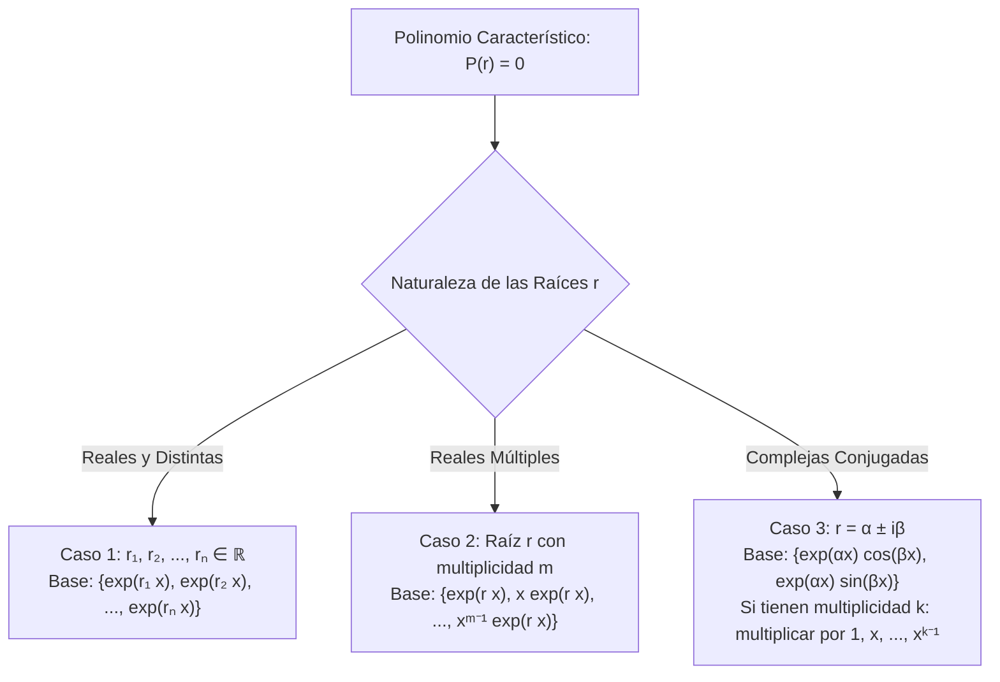
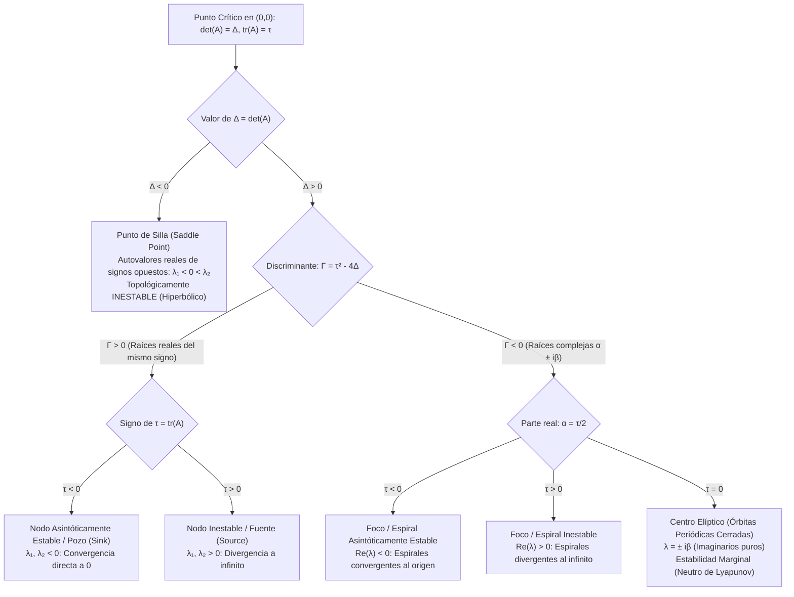
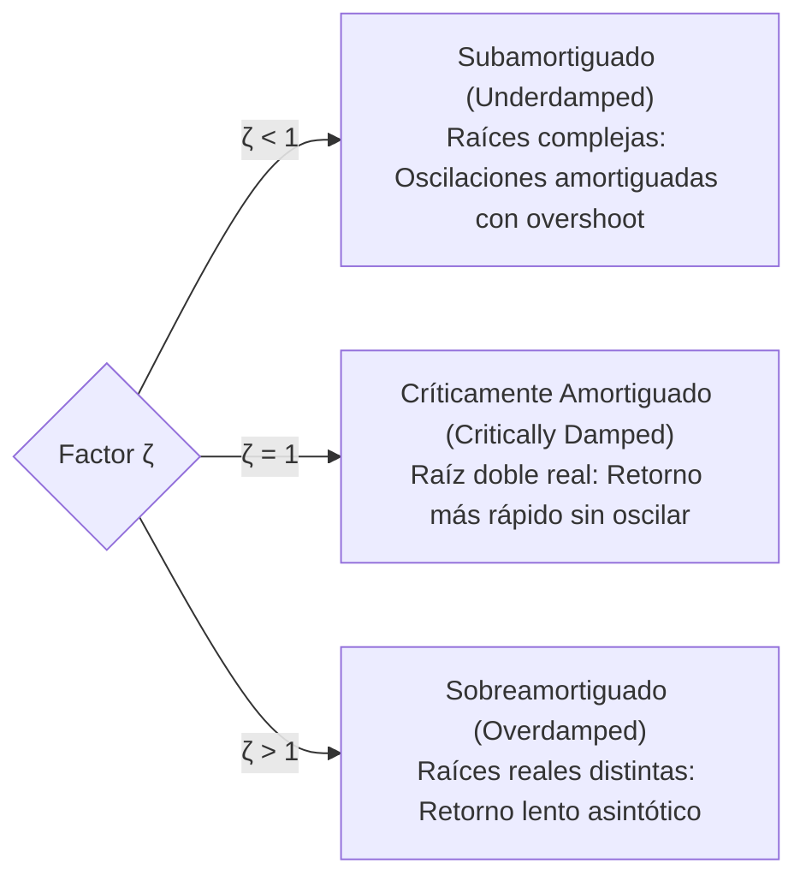

# EDO Lineales de Orden Superior y Coeficientes Constantes

En el programa de **Ingeniería en Ciencias de la Computación de la Escuela Politécnica Nacional (EPN)**, el curso **MATD213 (Ecuaciones Diferenciales Ordinarias)** profundiza en las ecuaciones de orden superior como el fundamento algebraico-analítico que describe oscilaciones, redes de sincronización, motores de renderizado de físicas en tiempo real, dinámica de vibración en arquitecturas robóticas y análisis espectral de estabilidad de sistemas acoplados.

Esta nota aborda la estructura algebraica del espacio de soluciones de operadores lineales, la teoría del Wronskiano y el Teorema de Abel, la resolución exhaustiva de ecuaciones homogéneas mediante el polinomio característico, la deducción de soluciones particulares por Coeficientes Indeterminados y Variación de Parámetros de Lagrange, y culmina en la teoría cualitativa de sistemas lineales y la clasificación topológica del plano de fase.

> [!info] 💡 ¿Cómo entender esto desde cero? (Guía para novatos de pregrado)
> - **¿Por qué orden superior?** Una EDO de primer orden describe sistemas sin "inercia" (la velocidad depende solo de la posición). Pero en física y computación real, las aceleraciones dependen de fuerzas: $F = m a = m y''$. Para describir una aceleración necesitas una derivada de **segundo orden** ($y''$).
> - **El milagro del Álgebra Lineal en EDOs:** Cuando una ecuación es lineal de orden $n$, **sus soluciones forman un espacio vectorial de dimensión $n$**. Esto significa que si encuentras $n$ soluciones independientes $\{y_1, y_2, \dots, y_n\}$, ¡cualquier otra solución del universo es simplemente una combinación lineal $y = C_1 y_1 + \dots + C_n y_n$!
> - **¿Qué hace el Wronskiano?** Es el equivalente al determinante en álgebra lineal. Si el Wronskiano es distinto de cero, tus soluciones son linealmente independientes y forman una **base** legítima.
> - **¿Por qué los coeficientes constantes son fáciles?** Porque convierten el cálculo diferencial en álgebra polinomial. La suposición mágica $y = e^{rx}$ transforma derivadas en potencias ($y' \to r$, $y'' \to r^2$).
> - **¿Qué es el plano de fase?** En lugar de graficar la posición contra el tiempo $(t, x)$, graficas la posición contra la velocidad $(x, x')$. El dibujo resultante muestra el mapa completo de todas las trayectorias posibles (si el sistema oscila en un ciclo cerrado, si colapsa a un nodo estable o si sale disparado a infinito).

---

## 1. Estructura del Espacio de Soluciones y Álgebra Lineal Diferencial

### 1.1 El Operador Diferencial Lineal y Principio de Superposición

Consideremos la ecuación diferencial lineal general de orden $n$:
$$L[y] \equiv a_n(x) \frac{d^n y}{dx^n} + a_{n-1}(x) \frac{d^{n-1} y}{dx^{n-1}} + \cdots + a_1(x) \frac{dy}{dx} + a_0(x) y = g(x)$$
asumiendo que las funciones coeficiente $a_i(x)$ y el término forzante $g(x)$ son continuos en un intervalo común $I \subseteq \mathbb{R}$, con $a_n(x) \neq 0$ para todo $x \in I$.

> [!definition] Definición 1.1: Operador Diferencial Lineal
> El mapa $L: C^n(I) \to C(I)$ definido por:
> $$L = a_n(x) D^n + a_{n-1}(x) D^{n-1} + \dots + a_1(x) D + a_0(x) I, \quad \text{donde } D^k = \frac{d^k}{dx^k}$$
> es un **operador lineal**, ya que para cualesquiera constantes $\alpha, \beta \in \mathbb{R}$ y funciones $u, v \in C^n(I)$:
> $$L[\alpha u + \beta v] = \alpha L[u] + \beta L[v]$$

> [!important] Teorema 1.1: Principio de Superposición y Dimensión del Núcleo
> El conjunto de soluciones de la ecuación homogénea asociada $L[y] = 0$ constituye el núcleo (espacio nulo) del operador $L$:
> $$S_h = \ker(L) = \{ y \in C^n(I) \mid L[y] = 0 \}$$
> Por la linealidad de $L$, $\ker(L)$ es un **subespacio vectorial** de $C^n(I)$.
> Además, por el Teorema de Existencia y Unicidad de Cauchy-Picard para sistemas lineales, la dimensión de dicho subespacio es exactamente el orden de la ecuación:
> $$\dim(\ker(L)) = n$$
> En consecuencia, la solución general homogénea viene dada por:
> $$y_h(x) = \sum_{k=1}^n C_k y_k(x)$$
> donde $\{y_1, y_2, \dots, y_n\}$ es un **Conjunto Fundamental de Soluciones (CFS)** (una base vectorial de $\ker(L)$).

---

### 1.2 Independencia Lineal y el Determinante Wronskiano

> [!definition] Definición 1.2: Determinante Wronskiano
> Dadas $n$ funciones $y_1, y_2, \dots, y_n \in C^{n-1}(I)$, su **Wronskiano** es la función escalar $W(y_1, \dots, y_n): I \to \mathbb{R}$ definida mediante el determinante de la matriz fundamental de derivadas:
> $$W(y_1, y_2, \dots, y_n)(x) = \det \begin{pmatrix}
> y_1(x) & y_2(x) & \cdots & y_n(x) \\
> y_1'(x) & y_2'(x) & \cdots & y_n'(x) \\
> y_1''(x) & y_2''(x) & \cdots & y_n''(x) \\
> \vdots & \vdots & \ddots & \vdots \\
> y_1^{(n-1)}(x) & y_2^{(n-1)}(x) & \cdots & y_n^{(n-1)}(x)
> \end{pmatrix}$$

### 1.3 Teorema de Abel y su Deducción Analítica

Un resultado asombroso del análisis diferencial es que el Wronskiano de soluciones de una EDO homogénea satisface a su vez una EDO separable de primer orden, independientemente de cuáles sean las soluciones particulares.

> [!important] Teorema 1.2: Identidad de Abel
> Sean $y_1, \dots, y_n$ soluciones de la ecuación homogénea normalizada:
> $$y^{(n)} + P_{n-1}(x) y^{(n-1)} + \cdots + P_1(x) y' + P_0(x) y = 0$$
> donde $P_{n-1}(x) = \frac{a_{n-1}(x)}{a_n(x)}$. Entonces, el Wronskiano $W(x) \equiv W(y_1, \dots, y_n)(x)$ satisface la EDO:
> $$\frac{dW}{dx} = -P_{n-1}(x) W(x)$$
> Cuya solución exacta para cualquier punto de referencia $x_0 \in I$ es:
> $$W(x) = W(x_0) \exp\left( -\int_{x_0}^x P_{n-1}(t) dt \right)$$

#### Demostración Analítica para el Caso de Segundo Orden ($n = 2$)
Consideremos $y'' + P(x) y' + Q(x) y = 0$, con dos soluciones $y_1(x), y_2(x)$.
El Wronskiano es:
$$W(x) = \det \begin{pmatrix} y_1 & y_2 \\ y_1' & y_2' \end{pmatrix} = y_1 y_2' - y_2 y_1'$$
Derivando respecto a $x$ por regla de Leibniz:
$$W'(x) = (y_1' y_2' + y_1 y_2'') - (y_2' y_1' + y_2 y_1'') = y_1 y_2'' - y_2 y_1''$$
Dado que $y_1$ e $y_2$ resuelven la EDO:
$$y_1'' = -P(x) y_1' - Q(x) y_1$$
$$y_2'' = -P(x) y_2' - Q(x) y_2$$
Sustituyendo estas expresiones en $W'(x)$:
$$\begin{aligned}
W'(x) &= y_1 \left( -P y_2' - Q y_2 \right) - y_2 \left( -P y_1' - Q y_1 \right) \\
&= -P(x) \left( y_1 y_2' - y_2 y_1' \right) - Q(x) \left( y_1 y_2 - y_2 y_1 \right) \\
&= -P(x) W(x) - Q(x) (0) \\
&= -P(x) W(x)
\end{aligned}$$
Separando variables e integrando de $x_0$ a $x$:
$$\frac{dW}{W} = -P(x) dx \implies \ln\left| \frac{W(x)}{W(x_0)} \right| = -\int_{x_0}^x P(t) dt \implies W(x) = W(x_0) e^{-\int_{x_0}^x P(t) dt} \quad \blacksquare$$

> [!tip] Corolario Fundamental del Wronskiano
> Como la función exponencial jamás se anula ($e^{-\int P dt} > 0$):
> 1. Si $W(x_0) \neq 0$ en algún punto $x_0 \in I$, entonces $W(x) \neq 0$ **para todo** $x \in I$. En este caso, $\{y_1, \dots, y_n\}$ es linealmente independiente en $I$ y forma una base del espacio de soluciones.
> 2. Si $W(x_0) = 0$ en algún punto $x_0 \in I$, entonces $W(x) \equiv 0$ **idénticamente en todo** $I$. En este caso, las funciones son linealmente dependientes.

---

## 2. Ecuaciones Homogéneas con Coeficientes Constantes

Consideremos la ecuación lineal homogénea con coeficientes reales constantes $a_k \in \mathbb{R}$ ($a_n \neq 0$):
$$a_n y^{(n)} + a_{n-1} y^{(n-1)} + \cdots + a_1 y' + a_0 y = 0$$

### 2.1 El Ansatz Exponencial y el Polinomio Característico

Proponiendo una solución de la forma exponencial pura $y(x) = e^{rx}$:
$$y'(x) = r e^{rx}, \quad y''(x) = r^2 e^{rx}, \quad \dots, \quad y^{(n)}(x) = r^n e^{rx}$$
Sustituyendo en la EDO:
$$(a_n r^n + a_{n-1} r^{n-1} + \dots + a_1 r + a_0) e^{rx} = 0$$
Dado que $e^{rx} \neq 0$ para todo $x$, se obtiene la **Ecuación Característica**:
$$P(r) \equiv a_n r^n + a_{n-1} r^{n-1} + \dots + a_1 r + a_0 = 0$$

Por el **Teorema Fundamental del Álgebra**, el polinomio característico $P(r)$ posee exactamente $n$ raíces (contadas con su multiplicidad algebraica) en el cuerpo de los complejos $\mathbb{C}$.

---

### 2.2 Análisis Riguroso de los Tres Casos Canónicos

#### Caso 1: Raíces Reales y Distintas
Si todas las raíces $r_1, r_2, \dots, r_n$ son reales y simples ($r_i \neq r_j$ para $i \neq j$):
$$y_h(x) = C_1 e^{r_1 x} + C_2 e^{r_2 x} + \dots + C_n e^{r_n x}$$
*Justificación de independencia:* El Wronskiano de $\{e^{r_1 x}, \dots, e^{r_n x}\}$ en $x = 0$ es un determinante de Vandermonde:
$$W(0) = \prod_{1 \le i < j \le n} (r_j - r_i) \neq 0$$

#### Caso 2: Raíces Reales con Multiplicidad $m \ge 2$
Sea $r$ una raíz real con multiplicidad algebraica $m$, es decir, $P(r) = (r - \lambda)^m Q(r)$ con $Q(\lambda) \neq 0$.
El operador diferencial se factoriza como:
$$L = Q(D) (D - \lambda)^m$$
Para el suboperador $(D - \lambda)^m y = 0$, proponemos $y(x) = v(x) e^{\lambda x}$.
Utilizando el operador de traslación diferencial $(D - \lambda)(v e^{\lambda x}) = (v' e^{\lambda x} + \lambda v e^{\lambda x}) - \lambda v e^{\lambda x} = v' e^{\lambda x}$:
$$(D - \lambda)^m [v(x) e^{\lambda x}] = v^{(m)}(x) e^{\lambda x} = 0 \implies v^{(m)}(x) = 0$$
Integrando $m$ veces $v^{(m)}(x) = 0$:
$$v(x) = C_0 + C_1 x + C_2 x^2 + \dots + C_{m-1} x^{m-1}$$
Por consiguiente, el conjunto de $m$ soluciones linealmente independientes asociadas a la raíz $\lambda$ es:
$$\{e^{\lambda x}, \; x e^{\lambda x}, \; x^2 e^{\lambda x}, \; \dots, \; x^{m-1} e^{\lambda x}\}$$

#### Caso 3: Raíces Complejas Conjugadas
Como los coeficientes $a_k$ son reales, las raíces complejas siempre aparecen en pares conjugados:
$$r_{1,2} = \alpha \pm i \beta, \quad \alpha, \beta \in \mathbb{R}, \; \beta \neq 0$$
Las soluciones complejas asociadas son:
$$z_1(x) = e^{(\alpha + i \beta)x} = e^{\alpha x} e^{i \beta x}, \quad z_2(x) = e^{(\alpha - i \beta)x} = e^{\alpha x} e^{-i \beta x}$$
Aplicando la **Fórmula de Euler** ($e^{i \theta} = \cos \theta + i \sin \theta$):
$$z_1(x) = e^{\alpha x} (\cos \beta x + i \sin \beta x), \quad z_2(x) = e^{\alpha x} (\cos \beta x - i \sin \beta x)$$
Como cualquier combinación lineal de soluciones complejas es solución, construimos la base real ortonormal:
$$y_1(x) = \frac{z_1(x) + z_2(x)}{2} = e^{\alpha x} \cos(\beta x)$$
$$y_2(x) = \frac{z_1(x) - z_2(x)}{2i} = e^{\alpha x} \sin(\beta x)$$
La contribución a la solución homogénea es:
$$y_h(x) = e^{\alpha x} \left( C_1 \cos(\beta x) + C_2 \sin(\beta x) \right)$$
Si el par complejo $\alpha \pm i \beta$ tiene multiplicidad algebraica $k > 1$, las $2k$ soluciones reales independientes son:
$$\{ x^j e^{\alpha x} \cos(\beta x), \; x^j e^{\alpha x} \sin(\beta x) \}_{j=0}^{k-1}$$

> [!example] Ejemplo 2.1: Resolución de EDO de 4to Orden
> Resolver la ecuación diferencial:
> $$y^{(4)} - 4y''' + 14y'' - 20y' + 25y = 0$$
> Ecuación característica:
> $$r^4 - 4r^3 + 14r^2 - 20r + 25 = 0$$
> Factorizando mediante completación de cuadrados:
> $$(r^2 - 2r + 5)^2 = 0$$
> Resolviendo $r^2 - 2r + 5 = 0$:
> $$r = \frac{2 \pm \sqrt{4 - 20}}{2} = 1 \pm 2i$$
> Tenemos el par complejo conjugado $\alpha = 1, \beta = 2$, con multiplicidad doble ($k = 2$).
> Las 4 soluciones linealmente independientes que conforman el CFS son:
> $$y_1(x) = e^x \cos(2x), \quad y_2(x) = e^x \sin(2x)$$
> $$y_3(x) = x e^x \cos(2x), \quad y_4(x) = x e^x \sin(2x)$$
> La solución general completa es:
> $$y(x) = e^x \left[ (C_1 + C_2 x) \cos(2x) + (C_3 + C_4 x) \sin(2x) \right]$$

---

## 3. Ecuaciones No Homogéneas y Solución Particular $y_p$

La solución general de la EDO no homogénea $L[y] = g(x)$ posee la estructura aditiva canónica:
$$y(x) = y_h(x) + y_p(x)$$
donde $y_h(x)$ es la solución general de la homogénea asociada ($L[y_h] = 0$) e $y_p(x)$ es cualquier solución particular fija que satisface $L[y_p] = g(x)$.

---

### 3.1 Método de Coeficientes Indeterminados y Regla de Resonancia

Este método algebraico se aplica cuando los coeficientes de $L$ son constantes y el término forzante $g(x)$ es de tipo cuasipolinomial (funciones que poseen un número finito de derivadas linealmente independientes: polinomios, exponenciales, senos, cosenos y sus combinaciones multiplicativas).

#### Tabla de Formas de Prueba Canónicas

| Término Forzante $g(x)$ | Forma de la Solución Particular $y_p(x)$ |
| :--- | :--- |
| **Polinomio:** $P_m(x) = \sum_{k=0}^m a_k x^k$ | $x^s \left( A_m x^m + A_{m-1} x^{m-1} + \dots + A_1 x + A_0 \right)$ |
| **Exponencial:** $C e^{\gamma x}$ | $x^s \left( A e^{\gamma x} \right)$ |
| **Trigonométrico:** $C_1 \cos(\omega x) + C_2 \sin(\omega x)$ | $x^s \left( A \cos(\omega x) + B \sin(\omega x) \right)$ |
| **Producto Mixto:** $P_m(x) e^{\gamma x} \cos(\omega x)$ | $x^s e^{\gamma x} \left[ \left(\sum_{j=0}^m A_j x^j\right) \cos(\omega x) + \left(\sum_{j=0}^m B_j x^j\right) \sin(\omega x) \right]$ |

> [!important] Regla de Resonancia (Multiplicador $x^s$)
> El exponente entero no negativo $s \ge 0$ es el número más pequeño tal que ningún término en la forma de prueba de $y_p(x)$ sea solución de la ecuación homogénea asociada $L[y] = 0$.
> - En términos del polinomio característico $P(r)$:
>   - Para $g(x) = P_m(x)$, $s$ es la multiplicidad de $r = 0$ como raíz de $P(r)$.
>   - Para $g(x) \propto e^{\gamma x}$, $s$ es la multiplicidad de $r = \gamma$ como raíz de $P(r)$.
>   - Para $g(x) \propto e^{\gamma x} \cos(\omega x)$, $s$ es la multiplicidad de $r = \gamma \pm i \omega$ como raíces complejas de $P(r)$.

> [!example] Ejemplo 3.1: Resonancia en Segundo Orden
> Resolver:
> $$y'' + 4y = 8 \cos(2x)$$
> 1. Solución homogénea: $r^2 + 4 = 0 \implies r = \pm 2i$.
>    $$y_h(x) = C_1 \cos(2x) + C_2 \sin(2x)$$
> 2. Forma de prueba particular:
>    El término externo tiene frecuencia $\omega = 2$, coincidente con la frecuencia natural del sistema ($\gamma + i\omega = 0 + 2i$).
>    Como $r = 2i$ es raíz simple de $P(r)$, tenemos resonancia con $s = 1$:
>    $$y_p(x) = x [A \cos(2x) + B \sin(2x)]$$
> 3. Derivadas de $y_p$:
>    $$y_p' = [A \cos(2x) + B \sin(2x)] + x [-2A \sin(2x) + 2B \cos(2x)]$$
>    $$y_p'' = 4[-A \sin(2x) + B \cos(2x)] + x [-4A \cos(2x) - 4B \sin(2x)]$$
> 4. Sustituyendo en $y_p'' + 4y_p$:
>    $$\{ -4A \sin(2x) + 4B \cos(2x) - 4x[A\cos(2x) + B\sin(2x)] \} + 4x[A\cos(2x) + B\sin(2x)] = 8\cos(2x)$$
>    $$-4A \sin(2x) + 4B \cos(2x) = 8\cos(2x)$$
>    Igualando coeficientes:
>    $$-4A = 0 \implies A = 0$$
>    $$4B = 8 \implies B = 2$$
> 5. Por lo tanto, la solución particular resonante es:
>    $$y_p(x) = 2x \sin(2x)$$
>    Nótese la amplitud linealmente creciente con el tiempo $x$, fenómeno crítico en sincronización y fallo por resonancia de circuitos y puentes.
> 6. Solución general completa:
>    $$y(x) = C_1 \cos(2x) + C_2 \sin(2x) + 2x \sin(2x)$$

---

### 3.2 Método General de Variación de Parámetros de Lagrange

Cuando el término forzante $g(x)$ no es cuasipolinomial (por ejemplo, $\tan x, \sec x, \ln x, \frac{1}{1 + e^x}$), Coeficientes Indeterminados no es aplicable. El método de Joseph-Louis Lagrange es completamente general y solo requiere conocer un CFS de la homogénea.

#### Deducción para Segundo Orden
Sea la ecuación normalizada:
$$y'' + P(x) y' + Q(x) y = g(x)$$
con CFS $\{y_1(x), y_2(x)\}$, de modo que $y_h = c_1 y_1 + c_2 y_2$.
Lagrange propuso "variar" las constantes $c_1, c_2$ haciéndolas funciones de $x$:
$$y_p(x) = u_1(x) y_1(x) + u_2(x) y_2(x)$$
Derivando:
$$y_p' = (u_1' y_1 + u_2' y_2) + (u_1 y_1' + u_2 y_2')$$
Para simplificar el cálculo y no generar segundas derivadas de $u_i$, imponemos la **primera condición de Lagrange**:
$$u_1'(x) y_1(x) + u_2'(x) y_2(x) = 0$$
Con esta condición, la derivada se reduce a:
$$y_p' = u_1 y_1' + u_2 y_2'$$
Derivando por segunda vez:
$$y_p'' = u_1' y_1' + u_2' y_2' + u_1 y_1'' + u_2 y_2''$$
Sustituyendo $y_p$, $y_p'$, $y_p''$ en la EDO original:
$$(u_1' y_1' + u_2' y_2' + u_1 y_1'' + u_2 y_2'') + P(x)(u_1 y_1' + u_2 y_2') + Q(x)(u_1 y_1 + u_2 y_2) = g(x)$$
Agrupando por $u_1$ y $u_2$:
$$u_1 \underbrace{[y_1'' + P y_1' + Q y_1]}_{= 0} + u_2 \underbrace{[y_2'' + P y_2' + Q y_2]}_{= 0} + (u_1' y_1' + u_2' y_2') = g(x)$$
Resultando en la **segunda condición de Lagrange**:
$$u_1'(x) y_1'(x) + u_2'(x) y_2'(x) = g(x)$$

Obtenemos el sistema algebraico lineal $2 \times 2$ para las derivadas desconocidas $u_1'(x)$ y $u_2'(x)$:
$$\begin{pmatrix} y_1(x) & y_2(x) \\ y_1'(x) & y_2'(x) \end{pmatrix} \begin{pmatrix} u_1'(x) \\ u_2'(x) \end{pmatrix} = \begin{pmatrix} 0 \\ g(x) \end{pmatrix}$$
El determinante de la matriz del sistema es precisamente el **Wronskiano** $W(y_1, y_2)(x) \neq 0$. Aplicando la **Regla de Cramer**:
$$u_1'(x) = \frac{\det \begin{pmatrix} 0 & y_2 \\ g(x) & y_2' \end{pmatrix}}{W(x)} = -\frac{y_2(x) g(x)}{W(x)}$$
$$u_2'(x) = \frac{\det \begin{pmatrix} y_1 & 0 \\ y_1' & g(x) \end{pmatrix}}{W(x)} = \frac{y_1(x) g(x)}{W(x)}$$

> [!tip] Teorema 3.1: Fórmula Integral de Lagrange para Segundo Orden
> Integrando directamente:
> $$u_1(x) = -\int \frac{y_2(x) g(x)}{W(y_1, y_2)(x)} dx, \quad u_2(x) = \int \frac{y_1(x) g(x)}{W(y_1, y_2)(x)} dx$$
> Por ende, la solución particular general viene dada por:
> $$y_p(x) = -y_1(x) \int \frac{y_2(x) g(x)}{W(y_1, y_2)(x)} dx + y_2(x) \int \frac{y_1(x) g(x)}{W(y_1, y_2)(x)} dx$$

---

## 4. Sistemas Lineales de Primer Orden $\mathbf{x}' = A\mathbf{x}$ y Retratos de Fase

Cualquier EDO lineal escalar de orden $n$ puede reescribirse canónicamente como un sistema lineal de $n$ ecuaciones acopladas de primer orden definiendo el vector de estado $\mathbf{x} = (y, y', \dots, y^{(n-1)})^T$.

### 4.1 Formulación Matricial y la Exponencial de Matriz

Consideremos el sistema homogéneo autónomo:
$$\frac{d\mathbf{x}}{dt} = A \mathbf{x}, \quad \mathbf{x}(0) = \mathbf{x}_0, \quad A \in \mathbb{R}^{n \times n}$$
En analogía directa con el caso escalar $x' = a x \implies x(t) = e^{at} x_0$, la solución formal única del sistema es:
$$\mathbf{x}(t) = \exp(At) \mathbf{x}_0$$
donde la **exponencial matricial** se define mediante la serie matricial de potencias absolutamente convergente:
$$\exp(At) = \sum_{k=0}^\infty \frac{(At)^k}{k!} = I + At + \frac{A^2 t^2}{2!} + \frac{A^3 t^3}{3!} + \dots$$

Si la matriz $A$ es diagonalizable ($A = V \Lambda V^{-1}$ con autovalores $\lambda_i$ y autovectores linealmente independientes $\mathbf{v}_i$):
$$\mathbf{x}(t) = \sum_{i=1}^n c_i e^{\lambda_i t} \mathbf{v}_i$$

---

### 4.2 Clasificación Topológica de Puntos Críticos en el Plano de Fase $2 \times 2$

Para un sistema en dos dimensiones ($n = 2$):
$$\begin{pmatrix} x' \\ y' \end{pmatrix} = \begin{pmatrix} a & b \\ c & d \end{pmatrix} \begin{pmatrix} x \\ y \end{pmatrix}$$
El origen $(0, 0)$ es siempre un punto de equilibrio estático. Su estabilidad y geometría están completamente determinadas por dos invariantes algebraicos de la matriz $A$:
1. **La Traza:** $\tau = \operatorname{tr}(A) = a + d = \lambda_1 + \lambda_2$.
2. **El Determinante:** $\Delta = \det(A) = ad - bc = \lambda_1 \lambda_2$.

La ecuación característica de $A$ es:
$$\det(A - \lambda I) = \lambda^2 - \tau \lambda + \Delta = 0$$
cuyas raíces son:
$$\lambda_{1,2} = \frac{\tau \pm \sqrt{\tau^2 - 4\Delta}}{2}$$
El discriminante $\Gamma = \tau^2 - 4\Delta$ define la parábola crítica $\Delta = \frac{\tau^2}{4}$ en el plano $(\tau, \Delta)$.

> [!important] Resumen de Clasificación Topológica del Plano de Fase
> 1. **Punto de Silla ($\Delta < 0$):** Un autovalor positivo y uno negativo. Las trayectorias convergen a lo largo del subespacio propio estable y divergen violentamente a lo largo del inestable. Esencialmente inestable.
> 2. **Nodo Estable ($\Delta > 0, \tau^2 \ge 4\Delta, \tau < 0$):** Ambos autovalores reales son estrictamente negativos ($\lambda_2 \le \lambda_1 < 0$). Todas las curvas convergen tangencialmente al autovector asociado al autovalor menos negativo (dirección lenta).
> 3. **Nodo Inestable ($\Delta > 0, \tau^2 \ge 4\Delta, \tau > 0$):** Ambos autovalores reales son positivos ($0 < \lambda_1 \le \lambda_2$). Todas las trayectorias nacen en el origen y escapan a infinito.
> 4. **Foco / Espiral Estable ($\Delta > 0, \tau^2 < 4\Delta, \tau < 0$):** Autovalores complejos con parte real negativa ($\alpha = \frac{\tau}{2} < 0$). Movimiento rotacional que decae exponencialmente hacia el equilibrio.
> 5. **Foco / Espiral Inestable ($\Delta > 0, \tau^2 < 4\Delta, \tau > 0$):** Autovalores complejos con parte real positiva ($\alpha > 0$). Oscilación de amplitud creciente sin límite.
> 6. **Centro Elíptico ($\Delta > 0, \tau = 0$):** Autovalores imaginarios puros ($\lambda = \pm i \sqrt{\Delta}$). El sistema conserva la energía y orbita en elipses cerradas concéntricas.

---

## 5. Modelado y Aplicaciones en Ciencias de la Computación

### 5.1 Motores de Física y Animaciones UI: Oscilador Armónico Amortiguado

En el renderizado de interfaces de usuario (como las animaciones por resorte en Flutter, React Native, CSS o SwiftUI) y en los motores de físicas de videojuegos (Unity, Unreal Engine), el movimiento de un elemento visual o partícula de masa $m$ sujeta a amortiguamiento viscoso $c$ y rigidez $k$ se modela mediante:
$$m \frac{d^2 x}{dt^2} + c \frac{dx}{dt} + k x = 0$$
Normalizando:
$$x'' + 2\zeta \omega_n x' + \omega_n^2 x = 0$$
donde:
- $\omega_n = \sqrt{\frac{k}{m}}$: Frecuencia natural no amortiguada.
- $\zeta = \frac{c}{2\sqrt{m k}}$: **Factor de amortiguamiento adimensional**.

Ecuación característica:
$$r^2 + 2\zeta \omega_n r + \omega_n^2 = 0 \implies r_{1,2} = \omega_n \left( -\zeta \pm \sqrt{\zeta^2 - 1} \right)$$

#### Relevancia Algorítmica del Caso Críticamente Amortiguado ($\zeta = 1$)
- **En Animaciones UI (Spring Physics):** Si $\zeta < 1$, el botón u objeto rebota y sobrepasa el destino (*overshoot*), lo que a veces es deseado para dar dinamismo visual ("bouncy spring"). Si $\zeta > 1$, la transición se percibe lenta y pesada ("sluggish").
- El régimen **críticamente amortiguado ($\zeta = 1$)** es el óptimo que garantiza **el tiempo mínimo de establecimiento ($t_s$) sin sufrir rebote ni sobreimpulso**. Su solución analítica con condiciones iniciales de desplazamiento $x(0) = x_0$ y reposo $x'(0) = 0$ es:
  $$x(t) = x_0 (1 + \omega_n t) e^{-\omega_n t}$$
  Esta fórmula cerrada se evalúa en $O(1)$ en cada tick del bucle de animación gráfica de 60 o 120 FPS sin requerir integración numérica iterativa de Euler, eliminando por completo los errores de inestabilidad acumulada.

---

### 5.2 Estabilidad y Jitter en Relojes Digitales (Circuitos RLC)

En los circuitos generadores de reloj (Phase-Locked Loops, PLL) que dictan la frecuencia de reloj de una CPU ($3.5\text{ GHz} \approx 3.5 \times 10^9 \text{ ciclos/segundo}$), la carga $q(t)$ en el resonador de cristal se rige por:
$$L \frac{d^2 q}{dt^2} + R \frac{dq}{dt} + \frac{1}{C} q = V(t)$$
- Si la resistencia parásita $R \to 0$, el sistema se comporta como un **centro elíptico puro** ($\lambda = \pm i \frac{1}{\sqrt{LC}}$), generando una onda electromagnética periódica perfecta con frecuencia $\omega_0 = \frac{1}{\sqrt{LC}}$.
- Pequeñas perturbaciones no lineales térmicas o de conmutación de compuertas introducen ruido de fase (*phase jitter*), modelable como una perturbación en el plano de fase donde el foco estable se desplaza continuamente, afectando la ventana temporal para el *setup* y *hold time* de los biestables (flip-flops).

---

## 6. Problema Resuelto Nivel Examen EPN

> [!example] Problema de Examen EPN: Sistema Dinámico $2 \times 2$ con Retrato de Fase Completo
> **Enunciado:** Sea el sistema dinámico que modela la interacción entre dos hilos de procesamiento en competencia por ancho de banda en un procesador multinúcleo:
> $$\begin{cases} x' = x - 2y \\ y' = 2x + y \end{cases}$$
> 1. Encontrar la solución general analítica del sistema.
> 2. Calcular los autovalores y autovectores de la matriz de coeficientes.
> 3. Clasificar el punto de equilibrio $(0, 0)$ en el plano de fase según su tipo topológico y estabilidad asintótica de Lyapunov.
> 4. Hallar la trayectoria específica con condición inicial $x(0) = 1, y(0) = 0$.
>
> **Solución Paso a Paso:**
> 1. Matriz de coeficientes:
>    $$A = \begin{pmatrix} 1 & -2 \\ 2 & 1 \end{pmatrix}$$
> 2. Cálculo de invariantes:
>    $$\tau = \operatorname{tr}(A) = 1 + 1 = 2$$
>    $$\Delta = \det(A) = (1)(1) - (-2)(2) = 1 + 4 = 5$$
>    Discriminante:
>    $$\Gamma = \tau^2 - 4\Delta = 2^2 - 4(5) = 4 - 20 = -16 < 0$$
> 3. Autovalores:
>    $$\lambda_{1,2} = \frac{2 \pm \sqrt{-16}}{2} = 1 \pm 2i$$
>    Tenemos raíces complejas conjugadas con $\alpha = 1 > 0$ y $\beta = 2$.
> 4. Autovector para $\lambda = 1 + 2i$:
>    $$(A - \lambda I)\mathbf{v} = \begin{pmatrix} 1 - (1 + 2i) & -2 \\ 2 & 1 - (1 + 2i) \end{pmatrix} \begin{pmatrix} v_1 \\ v_2 \end{pmatrix} = \begin{pmatrix} -2i & -2 \\ 2 & -2i \end{pmatrix} \begin{pmatrix} v_1 \\ v_2 \end{pmatrix} = \begin{pmatrix} 0 \\ 0 \end{pmatrix}$$
>    De la primera fila: $-2i v_1 - 2 v_2 = 0 \implies v_2 = -i v_1$.
>    Eligiendo $v_1 = 1 \implies \mathbf{v} = \begin{pmatrix} 1 \\ -i \end{pmatrix} = \begin{pmatrix} 1 \\ 0 \end{pmatrix} + i \begin{pmatrix} 0 \\ -1 \end{pmatrix}$.
> 5. Construcción de soluciones complejas y descomposición real:
>    $$\begin{aligned}
>    \mathbf{z}(t) &= e^{(1 + 2i)t} \mathbf{v} = e^t (\cos 2t + i \sin 2t) \left[ \begin{pmatrix} 1 \\ 0 \end{pmatrix} + i \begin{pmatrix} 0 \\ -1 \end{pmatrix} \right] \\
>    &= e^t \left[ \cos 2t \begin{pmatrix} 1 \\ 0 \end{pmatrix} - \sin 2t \begin{pmatrix} 0 \\ -1 \end{pmatrix} \right] + i e^t \left[ \sin 2t \begin{pmatrix} 1 \\ 0 \end{pmatrix} + \cos 2t \begin{pmatrix} 0 \\ -1 \end{pmatrix} \right] \\
>    &= e^t \begin{pmatrix} \cos 2t \\ \sin 2t \end{pmatrix} + i e^t \begin{pmatrix} \sin 2t \\ -\cos 2t \end{pmatrix}
>    \end{aligned}$$
> 6. Base de soluciones reales:
>    $$\mathbf{x}_1(t) = e^t \begin{pmatrix} \cos 2t \\ \sin 2t \end{pmatrix}, \quad \mathbf{x}_2(t) = e^t \begin{pmatrix} \sin 2t \\ -\cos 2t \end{pmatrix}$$
>    Solución general:
>    $$\mathbf{x}(t) = C_1 e^t \begin{pmatrix} \cos 2t \\ \sin 2t \end{pmatrix} + C_2 e^t \begin{pmatrix} \sin 2t \\ -\cos 2t \end{pmatrix}$$
> 7. Clasificación topológica:
>    - Como $\Delta = 5 > 0$, $\Gamma = -16 < 0$ y $\tau = 2 > 0$ ($\operatorname{Re}(\lambda) = 1 > 0$), el punto $(0,0)$ es un **Foco Inestable (Espiral Repulsora / Source Spiral)**.
>    - Las trayectorias giran en sentido antihorario o minutero y se expanden exponencialmente hacia el infinito conforme $t \to \infty$.
> 8. Aplicación de la condición inicial $\mathbf{x}(0) = \begin{pmatrix} 1 \\ 0 \end{pmatrix}$:
>    $$\begin{pmatrix} 1 \\ 0 \end{pmatrix} = C_1 \begin{pmatrix} 1 \\ 0 \end{pmatrix} + C_2 \begin{pmatrix} 0 \\ -1 \end{pmatrix} \implies C_1 = 1, \quad C_2 = 0$$
>    Solución particular del PVI:
>    $$\begin{cases} x(t) = e^t \cos(2t) \\ y(t) = e^t \sin(2t) \end{cases}$$
>    La trayectoria describe en el plano $(x, y)$ una **espiral logarítmica perfecta** $r(t) = e^t$, $\theta(t) = 2t \implies r(\theta) = e^{\theta / 2}$, verificando analítica y geométricamente la inestabilidad de foco.

---

## 7. Referencias Bibliográficas

1. **Boyce, W. E., & DiPrima, R. C.** (2017). *Elementary Differential Equations and Boundary Value Problems* (11th ed.). John Wiley & Sons.
2. **Hirsch, M. W., Smale, S., & Devaney, R. L.** (2012). *Differential Equations, Dynamical Systems, and an Introduction to Chaos* (3rd ed.). Academic Press.
3. **Zill, D. G.** (2018). *Ecuaciones Diferenciales con Aplicaciones de Modelado* (11va ed.). Cengage Learning.
4. **Nagle, R. K., Saff, E. B., & Snider, A. D.** (2018). *Fundamentals of Differential Equations* (9th ed.). Pearson.
