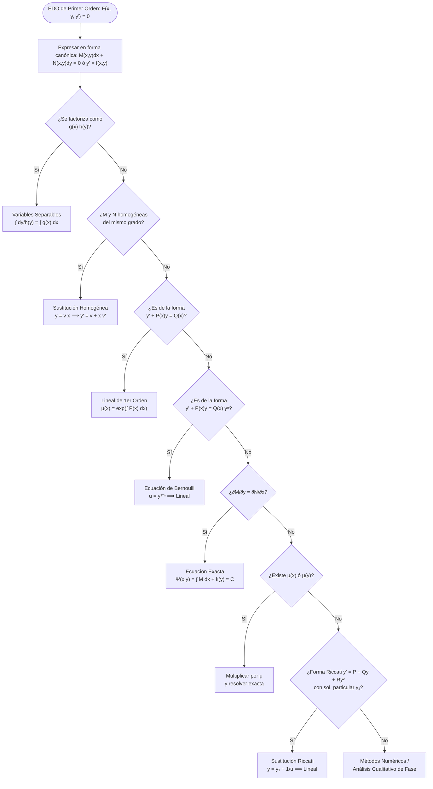
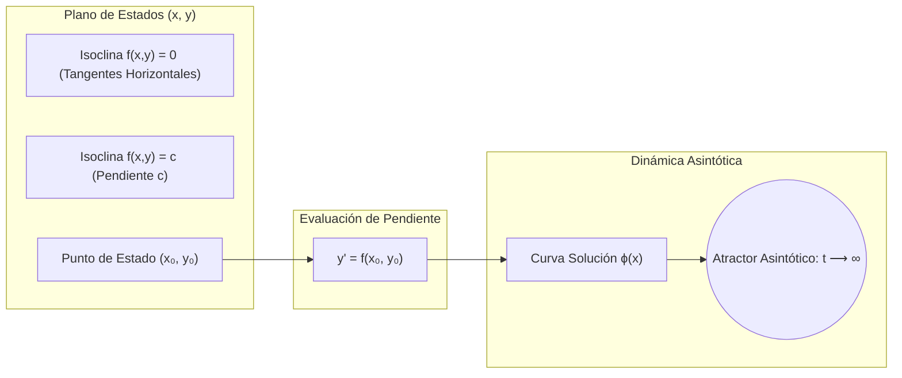
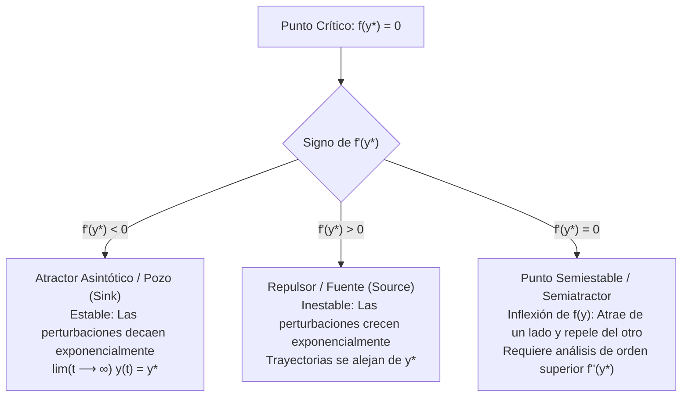
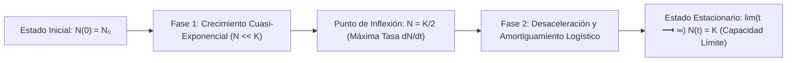

# EDO de Primer Orden y Métodos de Resolución

En el currículo de **Ingeniería en Ciencias de la Computación de la Escuela Politécnica Nacional (EPN)**, el curso **MATD213 (Ecuaciones Diferenciales Ordinarias)** constituye la columna vertebral analítica para modelar fenómenos continuos en el tiempo y el espacio. Lejos de ser un compendio aislado de recetas de integración, el estudio de las EDOs de primer orden suministra las herramientas formales para el diseño de simuladores físicos, algoritmos de optimización por flujo de gradiente continuo, análisis de concurrencia y colas, disipación térmica en centros de datos, y comprensión de sistemas dinámicos no lineales.

Esta nota aborda la fundamentación axiomática de las EDOs de primer orden, el célebre Teorema de Picard-Lindelöf, la taxonomía exhaustiva de métodos analíticos exactos, el análisis cualitativo en la línea de fase y su aplicación en la arquitectura computacional moderna.

> [!info] 💡 ¿Cómo entender esto desde cero? (Guía para novatos de pregrado)
> - **¿Qué es una EDO intuitivamente?** Imagina que conduces un vehículo autónomo programado para ajustar su acelerador no según dónde está, sino según la velocidad actual y la fricción del asfalto. Una ecuación diferencial no te da la posición directa $y(x)$, sino una **regla de cambio** $y' = f(x, y)$. Resolver la EDO significa reconstruir la trayectoria completa $y(x)$ a partir de esa regla local.
> - **El orden de la ecuación:** Indica cuántas derivadas aparecen. Primer orden involucra solo la primera derivada $y'$, lo que significa que relaciona la pendiente con el estado actual del sistema.
> - **¿Por qué hay infinitas soluciones?** Al integrar, siempre aparece una constante arbitraria $C$. Representa toda una familia de curvas. Para fijar una única curva real, necesitas un **PVI (Problema de Valor Inicial)**: especificar de dónde parte el sistema en $x_0$ (por ejemplo, $y(0) = 5$).
> - **¿Cuándo falla la resolución?** No todas las ecuaciones tienen solución expresable en funciones elementales ($\sin, \cos, e^x$). Por eso existen dos pilares indispensables:
>   1. **El Teorema de Picard-Lindelöf**, que nos asegura matemáticamente cuándo existe una solución única.
>   2. **El Análisis Cualitativo**, que permite predecir el destino del sistema (si colapsa, si se estabiliza o si explota a infinito) sin necesidad de integrar manualmente.

---

## 1. Fundamentos Teóricos: EDO de Orden $n$, Linealidad y el PVI

### 1.1 Definición General de EDO

> [!definition] Definición 1.1: Ecuación Diferencial Ordinaria de Orden $n$
> Sea $I \subseteq \mathbb{R}$ un intervalo abierto y $U \subseteq \mathbb{R}^{n+1}$. Una **Ecuación Diferencial Ordinaria (EDO)** de orden $n$ es una relación funcional implícita de la forma:
> $$F\left(x, y, y', y'', \dots, y^{(n)}\right) = 0$$
> donde $x \in I$ es la variable independiente, $y = \phi(x)$ es la función incógnita diferenciable hasta orden $n$ en $I$, y $F: I \times U \to \mathbb{R}$ es una función continua no trivial respecto a la componente $y^{(n)}$.
>
> Si la ecuación puede despejarse explícitamente respecto a la derivada de mayor orden, se denomina **forma normal o explícita**:
> $$y^{(n)} = f\left(x, y, y', \dots, y^{(n-1)}\right)$$

Para el caso fundamental de **primer orden ($n = 1$)**, la forma general y su forma normal son:
$$F(x, y, y') = 0 \iff y' = \frac{dy}{dx} = f(x, y)$$

### 1.2 Linealidad

> [!important] Definición 1.2: Linealidad de una EDO
> Una EDO de orden $n$ se clasifica como **lineal** si el operador diferencial actúa linealmente sobre la variable dependiente $y$ y sus derivadas. Su forma estándar es:
> $$a_n(x) y^{(n)} + a_{n-1}(x) y^{(n-1)} + \cdots + a_1(x) y' + a_0(x) y = g(x)$$
> donde $a_i(x)$ y $g(x)$ dependen exclusivamente de la variable independiente $x$.
>
> Una EDO de primer orden lineal admite la forma canónica:
> $$\frac{dy}{dx} + P(x) y = Q(x)$$
> Si los términos dependientes de $y$ aparecen con potencias distintas de uno, productos cruzados ($y y'$), o dentro de funciones trascendentes ($\sin(y), e^y$), la EDO es **no lineal**.

### 1.3 Problema de Valor Inicial (PVI de Cauchy)

> [!definition] Definición 1.3: Problema de Valor Inicial (PVI)
> Para una EDO de primer orden en forma normal, el **Problema de Valor Inicial (PVI)** o Problema de Cauchy consiste en el sistema:
> $$\begin{cases} \dfrac{dy}{dx} = f(x, y) \\ y(x_0) = y_0 \end{cases}$$
> donde $(x_0, y_0) \in \mathcal{D} \subseteq \mathbb{R}^2$ es un punto fijo denominado **condición inicial**.
>
> Una función $\phi: J \subseteq I \to \mathbb{R}$ es **solución del PVI** si:
> 1. $x_0 \in J$.
> 2. $\phi(x_0) = y_0$.
> 3. $\phi'(x) = f(x, \phi(x))$ para todo $x \in J$.

---

## 2. Teorema de Existencia y Unicidad de Picard-Lindelöf

Uno de los pilares del análisis matemático en computación y simulación numérica es garantizar que un modelo no produzca soluciones divergentes o espurias por defectos estructurales del problema.

### 2.1 Enunciado Formal y Condición de Lipschitz

> [!important] Teorema 2.1: Teorema de Picard-Lindelöf
> Sea un rectángulo cerrado $R \subset \mathbb{R}^2$ centrado en el punto inicial $(x_0, y_0)$:
> $$R = \{(x, y) \in \mathbb{R}^2 \mid |x - x_0| \le a, \; |y - y_0| \le b\}$$
> Supóngase que la función $f: R \to \mathbb{R}$ satisface:
> 1. **Continuidad:** $f(x, y)$ es continua en $R$, por lo que está acotada: $M = \max_{(x,y) \in R} |f(x, y)| < \infty$.
> 2. **Condición de Lipschitz respecto a $y$:** Existe una constante $L > 0$ (constante de Lipschitz) tal que para todo $(x, y_1), (x, y_2) \in R$:
>    $$|f(x, y_1) - f(x, y_2)| \le L |y_1 - y_2|$$
>
> Entonces, existe un intervalo cerrado $I = [x_0 - h, x_0 + h]$, con $h = \min\left(a, \frac{b}{M}\right)$, en el cual el PVI:
> $$\begin{cases} y' = f(x, y) \\ y(x_0) = y_0 \end{cases}$$
> posee **una y solo una solución única** $y = \phi(x) \in C^1(I)$.

> [!tip] Criterio Práctico de Lipschitz
> Si la derivada parcial $\frac{\partial f}{\partial y}$ existe y es continua en el conjunto cerrado $R$, por el Teorema del Valor Medio de Lagrange:
> $$|f(x, y_1) - f(x, y_2)| = \left| \frac{\partial f}{\partial y}(x, \xi) \right| |y_1 - y_2| \le L |y_1 - y_2|$$
> donde $L = \max_{(x,y) \in R} \left| \frac{\partial f}{\partial y}(x, y) \right|$. Por tanto, la continuidad de $\frac{\partial f}{\partial y}$ garantiza inmediatamente la condición de Lipschitz local.

### 2.2 Ecuación Integral de Volterra y Demostración por el Teorema del Punto Fijo de Banach

Integrando la EDO $y' = f(t, y)$ en el intervalo $[x_0, x]$:
$$\int_{x_0}^x y'(t) dt = \int_{x_0}^x f(t, y(t)) dt \implies y(x) = y_0 + \int_{x_0}^x f(t, y(t)) dt$$

Esta es la **Ecuación Integral de Volterra de segunda especie**. Resolver el PVI equivale exactamente a encontrar un **punto fijo** del operador integral de Picard $\mathcal{T}: C(I) \to C(I)$:
$$(\mathcal{T}y)(x) = y_0 + \int_{x_0}^x f(t, y(t)) dt$$

Dotando al espacio vectorial de funciones continuas $C(I)$ con la norma del supremo $\|y\|_\infty = \max_{x \in I} |y(x)|$, $(C(I), \|\cdot\|_\infty)$ se convierte en un **espacio de Banach** (espacio métrico completo). Al elegir el intervalo con ancho adecuado o usando una métrica con peso de Bielecki, $\mathcal{T}$ es una **contracción estricta**:
$$\|\mathcal{T}u - \mathcal{T}v\|_\infty \le \kappa \|u - v\|_\infty, \quad \kappa < 1$$
Por el **Teorema del Punto Fijo de Banach**, existe un único punto fijo $y^* \in C(I)$ tal que $\mathcal{T}y^* = y^*$, demostrando la existencia y unicidad global en el entorno $I$.

### 2.3 Método de Aproximaciones Sucesivas de Picard

El esquema constructivo del punto fijo genera recursivamente la secuencia de funciones $\{y_k(x)\}_{k=0}^\infty$:
$$\begin{aligned}
y_0(x) &= y_0 \\
y_{k+1}(x) &= y_0 + \int_{x_0}^x f(t, y_k(t)) dt, \quad k = 0, 1, 2, \dots
\end{aligned}$$

> [!example] Ejemplo 2.1: Construcción de la solución de $y' = 2x(y + 1)$ con $y(0) = 0$
> 1. **Iteración $k=0$:**
>    $$y_0(x) = 0$$
> 2. **Iteración $k=1$:**
>    $$y_1(x) = 0 + \int_0^x 2t(0 + 1) dt = \int_0^x 2t dt = x^2$$
> 3. **Iteración $k=2$:**
>    $$y_2(x) = \int_0^x 2t(t^2 + 1) dt = \int_0^x (2t^3 + 2t) dt = \frac{x^4}{2} + x^2$$
> 4. **Iteración $k=3$:**
>    $$y_3(x) = \int_0^x 2t\left(\frac{t^4}{2} + t^2 + 1\right) dt = \int_0^x (t^5 + 2t^3 + 2t) dt = \frac{x^6}{6} + \frac{x^4}{2} + x^2 = \frac{(x^2)^3}{3!} + \frac{(x^2)^2}{2!} + \frac{x^2}{1!}$$
> 5. **Límite cuando $k \to \infty$:**
>    $$y(x) = \lim_{k \to \infty} y_k(x) = \sum_{m=1}^\infty \frac{(x^2)^m}{m!} = e^{x^2} - 1$$
> Comprobación directa: $y' = 2x e^{x^2} = 2x(y + 1)$ y $y(0) = e^0 - 1 = 0$. ¡La serie converge a la solución exacta!

### 2.4 Contraejemplo: Ruptura de la Unicidad (Falla de Lipschitz)

Consideremos el problema:
$$\begin{cases} y' = 3 y^{2/3} \\ y(0) = 0 \end{cases}$$
Aquí $f(x, y) = 3 y^{2/3}$ es continua en todo $\mathbb{R}^2$. Sin embargo, su derivada parcial respecto a $y$:
$$\frac{\partial f}{\partial y} = \frac{2}{y^{1/3}}$$
diverge cuando $y \to 0$. Por ende, $f$ **no es Lipschitz continua** en ningún entorno que contenga al origen $y = 0$.

Resolviendo por separación de variables:
$$\frac{dy}{y^{2/3}} = 3 dx \implies 3 y^{1/3} = 3x + C \implies y(x) = (x + C)^3$$
Con la condición $y(0) = 0$, obtenemos $C = 0 \implies y_1(x) = x^3$.
Pero por inspección directa, la función trivial $y_2(x) = 0$ también cumple $y_2'(x) = 0 = 3(0)^{2/3}$ y $y_2(0) = 0$.
Aún más, para cualquier constante real $c > 0$, la función partida:
$$y(x) = \begin{cases} 0 & x \le c \\ (x - c)^3 & x > c \end{cases}$$
es continuamente diferenciable y resuelve el PVI. **Existen infinitas soluciones**, demostrando la necesidad imperativa de la hipótesis de Lipschitz para la unicidad.

---

## 3. Taxonomía y Métodos Analíticos Rigurosos de Resolución

Para sistematizar la resolución de EDOs de primer orden, se presenta el siguiente árbol de decisiones computacional:

---

### 3.1 Método de Variables Separables

> [!definition] Definición 3.1: Ecuación en Variables Separables
> Una EDO de primer orden es separable si admite la factorización:
> $$\frac{dy}{dx} = g(x) h(y) \iff \frac{1}{h(y)} dy = g(x) dx \quad (h(y) \neq 0)$$
> La solución implícita se obtiene por integración directa:
> $$\int \frac{1}{h(y)} dy = \int g(x) dx + C$$

> [!caution] Detección de Soluciones Singulares
> Al dividir para $h(y)$, se asume $h(y) \neq 0$. Los valores constantes $y = c_k$ tales que $h(c_k) = 0$ representan **soluciones de equilibrio o singulares**. Deben verificarse por separado para no perder trayectorias del espacio de fases.

> [!example] Ejemplo 3.1: Resolución analítica de PVI separable
> Resolver el PVI:
> $$\frac{dy}{dx} = \frac{x (y^2 + 1)}{y}, \quad y(0) = 1$$
> 1. Separación de variables:
>    $$\frac{y}{y^2 + 1} dy = x dx$$
> 2. Integración indefinida en ambos miembros:
>    $$\int \frac{y}{y^2 + 1} dy = \int x dx \implies \frac{1}{2} \ln(y^2 + 1) = \frac{x^2}{2} + C_1$$
> 3. Multiplicando por 2 y aplicando la exponencial:
>    $$\ln(y^2 + 1) = x^2 + 2C_1 \implies y^2 + 1 = e^{x^2 + 2C_1} = C e^{x^2} \quad (C = e^{2C_1} > 0)$$
> 4. Aplicando la condición inicial $y(0) = 1$:
>    $$1^2 + 1 = C e^0 \implies C = 2$$
> 5. Despejando la solución explícita positiva (pues $y(0) = 1 > 0$):
>    $$y(x) = \sqrt{2 e^{x^2} - 1}$$

---

### 3.2 Ecuaciones Homogéneas y Sustitución $y = vx$

> [!definition] Definición 3.2: Función Homogénea
> Una función $F(x, y)$ es homogénea de grado $k \in \mathbb{R}$ si para todo $t > 0$:
> $$F(tx, ty) = t^k F(x, y)$$
> Una EDO en forma diferencial $M(x, y) dx + N(x, y) dy = 0$ es **homogénea** si $M$ y $N$ son funciones homogéneas del mismo grado $k$.
> En tal caso, la pendiente depende exclusivamente de la razón $u = \frac{y}{x}$:
> $$\frac{dy}{dx} = -\frac{M(x, y)}{N(x, y)} = -\frac{x^k M(1, y/x)}{x^k N(1, y/x)} = g\left(\frac{y}{x}\right)$$

#### Algoritmo de Reducción
1. Introducir la variable auxiliar $v(x) = \frac{y(x)}{x} \implies y = v x$.
2. Diferenciar con la regla del producto: $\dfrac{dy}{dx} = v + x \dfrac{dv}{dx}$.
3. Sustituir en la EDO:
   $$v + x \frac{dv}{dx} = g(v) \implies x \frac{dv}{dx} = g(v) - v$$
4. Esta ecuación es siempre **separable**:
   $$\frac{dv}{g(v) - v} = \frac{dx}{x}$$

> [!example] Ejemplo 3.2: EDO Homogénea
> Resolver:
> $$(x^2 + y^2) dx - 2xy dy = 0$$
> Verificación de homogeneidad: $M(tx, ty) = t^2 x^2 + t^2 y^2 = t^2 M(x, y)$ y $N(tx, ty) = -2(tx)(ty) = t^2 N(x, y)$. Ambas son de grado 2.
>
> Despejando la derivada:
> $$\frac{dy}{dx} = \frac{x^2 + y^2}{2xy} = \frac{1 + (y/x)^2}{2(y/x)}$$
> Haciendo $y = vx \implies y' = v + x v'$:
> $$v + x \frac{dv}{dx} = \frac{1 + v^2}{2v} \implies x \frac{dv}{dx} = \frac{1 + v^2}{2v} - v = \frac{1 - v^2}{2v}$$
> Separando variables:
> $$\frac{2v}{1 - v^2} dv = \frac{dx}{x}$$
> Integrando ambos lados:
> $$-\ln|1 - v^2| = \ln|x| + C_1 \implies \ln|x(1 - v^2)| = -C_1 \implies x(1 - v^2) = C$$
> Restituyendo $v = \frac{y}{x}$:
> $$x \left(1 - \frac{y^2}{x^2}\right) = C \implies \frac{x^2 - y^2}{x} = C \implies x^2 - y^2 = C x$$
> La solución describe una familia de circunferencias o hipérbolas según la orientación del parámetro.

---

### 3.3 Ecuaciones Diferenciales Exactas y Factores Integrantes

#### Criterio de Euler-Clairaut y Teorema de Poincaré

> [!important] Teorema 3.1: Caracterización de Exactitud
> Sea la ecuación diferencial expresada en 1-forma diferencial en un dominio simplemente conexo $\Omega \subseteq \mathbb{R}^2$:
> $$\omega = M(x, y) dx + N(x, y) dy = 0$$
> con $M, N \in C^1(\Omega)$. La 1-forma $\omega$ es **exacta** si y solo si es el gradiente de un campo escalar o potencial $\Psi(x, y)$, es decir, $d\Psi = M dx + N dy$.
> Por el Teorema de Clairaut-Schwarz sobre la simetría de segundas derivadas cruzadas ($\frac{\partial^2 \Psi}{\partial y \partial x} = \frac{\partial^2 \Psi}{\partial x \partial y}$), la condición necesaria y suficiente es:
> $$\frac{\partial M}{\partial y} = \frac{\partial N}{\partial x}, \quad \forall (x, y) \in \Omega$$
> En tal caso, la solución general de la EDO viene dada por las curvas de nivel del potencial:
> $$\Psi(x, y) = C$$

#### Procedimiento Constructivo de la Función Potencial $\Psi(x, y)$
1. Integrar $M(x, y)$ respecto a $x$:
   $$\Psi(x, y) = \int M(x, y) dx + k(y)$$
   donde $k(y)$ es una "constante" de integración dependiente exclusivamente de $y$.
2. Derivar parcialmente respecto a $y$ e igualar a $N(x, y)$:
   $$\frac{\partial \Psi}{\partial y} = \frac{\partial}{\partial y}\left( \int M(x, y) dx \right) + k'(y) = N(x, y)$$
3. Despejar $k'(y)$:
   $$k'(y) = N(x, y) - \frac{\partial}{\partial y}\left( \int M(x, y) dx \right)$$
   (La condición de exactitud garantiza matemáticamente que todos los términos que contengan $x$ se cancelan).
4. Integrar $k'(y)$ para hallar $k(y)$ y sustituir en $\Psi(x, y) = C$.

#### Factores Integrantes $\mu(x)$ y $\mu(y)$
Si la ecuación no es exacta ($\frac{\partial M}{\partial y} \neq \frac{\partial N}{\partial x}$), se busca un factor $\mu(x, y)$ tal que:
$$\mu M dx + \mu N dy = 0 \quad \text{sea exacta} \iff \frac{\partial (\mu M)}{\partial y} = \frac{\partial (\mu N)}{\partial x}$$
Expandiendo por regla del producto:
$$\mu \frac{\partial M}{\partial y} + M \frac{\partial \mu}{\partial y} = \mu \frac{\partial N}{\partial x} + N \frac{\partial \mu}{\partial x} \implies N \frac{\partial \mu}{\partial x} - M \frac{\partial \mu}{\partial y} = \mu \left( \frac{\partial M}{\partial y} - \frac{\partial N}{\partial x} \right)$$

De aquí se derivan los dos casos canónicos:

| Caso de Factor Integrante | Condición de Dependencia | Expresión del Factor Integrante |
| :--- | :--- | :--- |
| **Dependiente solo de $x$:** $\mu = \mu(x)$ | $\dfrac{1}{N}\left(\dfrac{\partial M}{\partial y} - \dfrac{\partial N}{\partial x}\right) = \Phi(x)$ | $\mu(x) = \exp\left( \int \Phi(x) dx \right)$ |
| **Dependiente solo de $y$:** $\mu = \mu(y)$ | $\dfrac{1}{M}\left(\dfrac{\partial N}{\partial x} - \dfrac{\partial M}{\partial y}\right) = \Theta(y)$ | $\mu(y) = \exp\left( \int \Theta(y) dy \right)$ |

> [!example] Ejemplo 3.3: Resolución con Factor Integrante
> Resolver:
> $$(2xy^2 + y) dx + (x + 2x^2 y - x^4 y^3) dy = 0 \quad \text{--- modificado a caso clásico:}$$
> Consideremos la EDO:
> $$(3xy + y^2) dx + (x^2 + xy) dy = 0$$
> 1. Verificación de exactitud:
>    $$M(x, y) = 3xy + y^2 \implies \frac{\partial M}{\partial y} = 3x + 2y$$
>    $$N(x, y) = x^2 + xy \implies \frac{\partial N}{\partial x} = 2x + y$$
>    Como $3x + 2y \neq 2x + y$, no es exacta.
> 2. Búsqueda de factor integrante dependiente de $x$:
>    $$\frac{1}{N}\left(\frac{\partial M}{\partial y} - \frac{\partial N}{\partial x}\right) = \frac{(3x + 2y) - (2x + y)}{x^2 + xy} = \frac{x + y}{x(x + y)} = \frac{1}{x} = \Phi(x)$$
>    Depende únicamente de $x$. Por tanto:
>    $$\mu(x) = e^{\int \frac{1}{x} dx} = e^{\ln|x|} = x$$
> 3. Multiplicación de la EDO original por $\mu(x) = x$:
>    $$(3x^2 y + x y^2) dx + (x^3 + x^2 y) dy = 0$$
>    Comprobamos: $\frac{\partial \tilde{M}}{\partial y} = 3x^2 + 2xy$ y $\frac{\partial \tilde{N}}{\partial x} = 3x^2 + 2xy$. ¡Ahora es exacta!
> 4. Determinación del potencial $\Psi(x, y)$:
>    $$\Psi(x, y) = \int (3x^2 y + x y^2) dx + k(y) = x^3 y + \frac{x^2 y^2}{2} + k(y)$$
>    Derivando respecto a $y$:
>    $$\frac{\partial \Psi}{\partial y} = x^3 + x^2 y + k'(y) = \tilde{N}(x, y) = x^3 + x^2 y \implies k'(y) = 0 \implies k(y) = C_0$$
> 5. Solución implícita:
>    $$x^3 y + \frac{1}{2} x^2 y^2 = C$$

---

### 3.4 Ecuaciones Diferenciales Lineales de Primer Orden

La forma estándar de una EDO lineal de primer orden es:
$$y' + P(x) y = Q(x)$$
donde $P(x)$ y $Q(x)$ son continuas en un intervalo común $I$.

#### Deducción Rigurosa del Factor Integrante
Multiplicamos toda la ecuación por una función positiva $\mu(x)$:
$$\mu(x) y' + \mu(x) P(x) y = \mu(x) Q(x)$$
Buscamos que el miembro izquierdo sea la derivada del producto $[\mu(x) y]' = \mu(x) y' + \mu'(x) y$. Comparando coeficientes:
$$\mu'(x) y = \mu(x) P(x) y \implies \frac{\mu'(x)}{\mu(x)} = P(x)$$
Integrando respecto a $x$:
$$\ln|\mu(x)| = \int P(x) dx \implies \mu(x) = e^{\int P(x) dx}$$
Sustituyendo $\mu(x)$ en la ecuación:
$$\frac{d}{dx}\left[ \mu(x) y \right] = \mu(x) Q(x)$$
Integrando ambos miembros:
$$\mu(x) y = \int \mu(x) Q(x) dx + C$$

> [!tip] Teorema 3.2: Fórmula de la Solución General Lineal
> La solución general de la EDO lineal de primer orden viene dada por:
> $$y(x) = e^{-\int P(x) dx} \left[ \int e^{\int P(x) dx} Q(x) dx + C \right]$$

---

### 3.5 Ecuación No Lineal de Bernoulli

> [!definition] Definición 3.3: Ecuación de Bernoulli
> Una ecuación no lineal de la forma:
> $$\frac{dy}{dx} + P(x) y = Q(x) y^n, \quad n \in \mathbb{R} \setminus \{0, 1\}$$
> se denomina **Ecuación de Bernoulli**. Si $n = 0$, es lineal ordinaria; si $n = 1$, es lineal homogénea separable.

#### Transformación Canónica de Linealización
1. Dividir toda la ecuación para $y^n$:
   $$y^{-n} \frac{dy}{dx} + P(x) y^{1-n} = Q(x)$$
2. Definir la nueva variable dependiente:
   $$u(x) = y^{1-n}$$
3. Diferenciar $u(x)$ respecto a $x$ mediante regla de la cadena:
   $$\frac{du}{dx} = (1 - n) y^{-n} \frac{dy}{dx} \implies y^{-n} \frac{dy}{dx} = \frac{1}{1 - n} \frac{du}{dx}$$
4. Reemplazar en la ecuación modificada:
   $$\frac{1}{1 - n} \frac{du}{dx} + P(x) u = Q(x) \implies \frac{du}{dx} + (1 - n) P(x) u = (1 - n) Q(x)$$
   Esta es una **EDO lineal de primer orden en $u(x)$**, solucionable mediante factor integrante.

> [!example] Ejemplo 3.4: Resolución de Bernoulli
> Resolver:
> $$x y' + y = x^2 y^2$$
> Dividiendo para $x$: $y' + \frac{1}{x} y = x y^2$. Aquí $n = 2$, $P(x) = \frac{1}{x}$, $Q(x) = x$.
> 1. Sustitución: $u = y^{1-2} = y^{-1} = \frac{1}{y} \implies u' = -y^{-2} y'$.
> 2. Multiplicando la EDO por $-y^{-2}$:
>    $$-y^{-2} y' - \frac{1}{x} y^{-1} = -x \implies u' - \frac{1}{x} u = -x$$
> 3. Factor integrante para la ecuación lineal en $u$:
>    $$\mu(x) = e^{\int -\frac{1}{x} dx} = e^{-\ln|x|} = \frac{1}{x}$$
> 4. Multiplicando e integrando:
>    $$\frac{d}{dx}\left[ \frac{1}{x} u \right] = \frac{1}{x}(-x) = -1 \implies \frac{u}{x} = -x + C \implies u(x) = C x - x^2$$
> 5. Restituyendo $y = \frac{1}{u}$:
>    $$y(x) = \frac{1}{C x - x^2}$$
> Además, se verifica la solución trivial singular $y(x) \equiv 0$, que se perdió al dividir entre $y^2$.

---

### 3.6 Ecuación No Lineal de Riccati

> [!definition] Definición 3.4: Ecuación de Riccati
> Una EDO cuadrática en la variable dependiente de la forma:
> $$\frac{dy}{dx} = P(x) + Q(x) y + R(x) y^2$$
> se denomina **Ecuación de Riccati**. En general no puede resolverse por cuadraturas elementales; sin embargo, si se conoce una **solución particular** $y_1(x)$, puede transformarse en una ecuación lineal de primer orden.

#### Teorema de Reducción de Riccati
Sea $y_1(x)$ una solución conocida tal que $y_1' = P + Q y_1 + R y_1^2$.
Se propone la sustitución:
$$y(x) = y_1(x) + \frac{1}{u(x)}$$
Diferenciando:
$$y' = y_1' - \frac{u'}{u^2}$$
Sustituyendo en la EDO de Riccati:
$$y_1' - \frac{u'}{u^2} = P(x) + Q(x)\left( y_1 + \frac{1}{u} \right) + R(x)\left( y_1^2 + \frac{2y_1}{u} + \frac{1}{u^2} \right)$$
Agrupando términos y utilizando la identidad de $y_1'$:
$$\left( y_1' - P - Q y_1 - R y_1^2 \right) - \frac{u'}{u^2} = \frac{Q(x)}{u} + \frac{2 R(x) y_1}{u} + \frac{R(x)}{u^2}$$
Dado que el primer paréntesis es idénticamente nulo:
$$-\frac{u'}{u^2} = \frac{Q(x) + 2 R(x) y_1(x)}{u} + \frac{R(x)}{u^2}$$
Multiplicando toda la ecuación por $-u^2$:
$$u' + \left[ Q(x) + 2 R(x) y_1(x) \right] u = -R(x)$$
Esta es formalmente una **EDO lineal de primer orden para $u(x)$**.

> [!example] Ejemplo 3.5: EDO de Riccati con Solución Particular
> Resolver:
> $$y' = 1 + x^2 - 2xy + y^2$$
> 1. Identificación de componentes: $P(x) = 1 + x^2$, $Q(x) = -2x$, $R(x) = 1$.
> 2. Por inspección analítica, probamos $y_1(x) = x$:
>    $$y_1' = 1, \quad P(x) + Q(x)y_1 + R(x)y_1^2 = 1 + x^2 - 2x(x) + x^2 = 1$$
>    Cumple idénticamente. Por ende, $y_1(x) = x$ es solución particular.
> 3. Cambio de variable: $y = x + \frac{1}{u} \implies y' = 1 - \frac{u'}{u^2}$.
> 4. Ecuación lineal resultante en $u$:
>    $$u' + [ -2x + 2(1)(x) ] u = -1 \implies u' + 0 u = -1 \implies u' = -1$$
> 5. Integración elemental:
>    $$u(x) = -x + C = C - x$$
> 6. Solución general completa:
>    $$y(x) = x + \frac{1}{C - x}$$

---

## 4. Análisis Cualitativo: Campos de Direcciones y Líneas de Fase

Cuando una EDO no admite integración analítica en términos de funciones elementales, la teoría cualitativa iniciada por Henri Poincaré y Aleksandr Lyapunov permite deducir el comportamiento asintótico global sin resolver la ecuación.

### 4.1 Campos de Pendientes (Slope Fields) e Isoclinas

Para la EDO $y' = f(x, y)$:
- En cada punto del plano $(x, y)$, el valor $f(x, y)$ representa el coeficiente angular del segmento tangente a la curva solución que atraviesa dicho punto.
- Una **isoclina** es el lugar geométrico donde todas las trayectorias tienen la misma pendiente constante $c$:
  $$f(x, y) = c = \text{constante}$$

---

### 4.2 Ecuaciones Autónomas y Clasificación de Puntos de Equilibrio

> [!definition] Definición 4.1: EDO Autónoma y Puntos Críticos
> Una EDO es **autónoma** si la variable independiente (generalmente el tiempo $t$) no aparece explícitamente en la función de flujo:
> $$\frac{dy}{dt} = f(y)$$
> Los ceros reales de la función, es decir, las raíces $y^*$ tales que:
> $$f(y^*) = 0$$
> se denominan **puntos de equilibrio, puntos críticos o estados estacionarios**. Para cada $y^*$, la función constante $y(t) \equiv y^*$ es una solución analítica trivial de la EDO.

#### Clasificación por Linealización (Teorema de Estabilidad de Lyapunov)

Sea $y^*$ un punto de equilibrio simple ($f(y^*) = 0$). Aproximando por serie de Taylor alrededor de $y^*$:
$$f(y) \approx f(y^*) + f'(y^*) (y - y^*) = f'(y^*) (y - y^*)$$
Definiendo la perturbación $\eta(t) = y(t) - y^*$, su dinámica diferencial es:
$$\frac{d\eta}{dt} = f'(y^*) \eta \implies \eta(t) = \eta(0) e^{f'(y^*) t}$$

De esto se derivan los 3 comportamientos canónicos:

> [!important] Resumen de Clasificación en la Línea de Fase
> 1. **Atractor (Sink / Estable):** $\dfrac{df}{dy}(y^*) < 0$. El flujo entra hacia $y^*$ tanto desde la izquierda como desde la derecha ($\to y^* \leftarrow$).
> 2. **Repulsor (Source / Inestable):** $\dfrac{df}{dy}(y^*) > 0$. El flujo escapa de $y^*$ en ambas direcciones ($\leftarrow y^* \to$).
> 3. **Semiatractor (Nodo Shunt / Semiestable):** $\dfrac{df}{dy}(y^*) = 0$ con $f(y)$ sin cambio de signo a través de $y^*$ (ejemplo: $y' = y^2$ en $y^*=0$). Las trayectorias se acercan por un lado y se alejan por el otro ($\to y^* \to$ ó $\leftarrow y^* \leftarrow$).

---

## 5. Modelado y Aplicaciones en Ciencias de la Computación

### 5.1 Crecimiento de Datos y Saturación de Almacenamiento (Modelo Logístico de Verhulst)

En sistemas distribuidos y bases de datos NoSQL, el volumen de datos o número de usuarios activos $N(t)$ crece inicialmente a un ritmo exponencial ($r N$) debido al efecto de red, pero se ve restringido a largo plazo por el límite de infraestructura o capacidad de almacenamiento $K$ (capacidad de carga):
$$\frac{dN}{dt} = r N \left(1 - \frac{N}{K}\right), \quad N(0) = N_0 > 0$$

#### Resolución Analítica
Separando variables:
$$\frac{dN}{N\left(1 - \frac{N}{K}\right)} = r dt \implies \left( \frac{1}{N} + \frac{1/K}{1 - N/K} \right) dN = r dt$$
Integrando:
$$\ln|N| - \ln\left|1 - \frac{N}{K}\right| = r t + C_1 \implies \frac{N}{1 - N/K} = C e^{rt}$$
Sustituyendo $N(0) = N_0 \implies C = \frac{N_0}{1 - N_0/K}$:
$$N(t) = \frac{K N_0 e^{rt}}{K + N_0(e^{rt} - 1)} = \frac{K}{1 + \left(\frac{K - N_0}{N_0}\right) e^{-rt}}$$

Análisis cualitativo:
- Puntos críticos: $N = 0$ (repulsor, $f'(0) = r > 0$), $N = K$ (atractor, $f'(K) = -r < 0$).
- El sistema converge asintóticamente al límite de infraestructura $K$ independientemente del estado inicial $N_0 > 0$.

---

### 5.2 Dinámica Térmica y Disipación de Servidores en Datacenters

El calor disipado en un clúster de servidores de alta densidad depende del balance entre la generación térmica por disipación Joule de la CPU y la tasa de enfriamiento convectivo por refrigeración líquida o ventilación forzada.

Sea $T(t)$ la temperatura del procesador en el instante $t$ y $T_{amb}$ la temperatura del ambiente en el rack. Por la **Ley de Enfriamiento de Newton generalizada** con una fuente de calor interna originada por la potencia consumida $P(t)$:
$$C_{th} \frac{dT}{dt} = -k_{th} (T - T_{amb}) + P_{cpu}(t)$$
donde:
- $C_{th}$: Capacidad calorífica del empaquetado del procesador ($J / ^\circ C$).
- $k_{th}$: Coeficiente de transferencia convectiva de calor ($W / ^\circ C$).
- $P_{cpu}(t)$: Potencia activa consumida por la CPU ($W$).

Normalizando la EDO a forma lineal canónica:
$$\frac{dT}{dt} + \frac{k_{th}}{C_{th}} T = \frac{k_{th}}{C_{th}} T_{amb} + \frac{P_{cpu}(t)}{C_{th}}$$
Definiendo la constante de tiempo térmica $\tau = \frac{C_{th}}{k_{th}}$:
$$\frac{dT}{dt} + \frac{1}{\tau} T = \frac{1}{\tau} T_{amb} + \frac{P_{cpu}(t)}{C_{th}}$$

#### Caso: Servidor bajo Carga Computacional Súbita Constante
Supongamos que en $t = 0$, el servidor arranca una tarea de entrenamiento de Deep Learning, con potencia constante $P_{cpu}(t) = P_0$, partiendo de la temperatura ambiente $T(0) = T_{amb}$.
1. Factor integrante: $\mu(t) = e^{\int \frac{1}{\tau} dt} = e^{t/\tau}$.
2. Multiplicando la EDO e integrando:
   $$\frac{d}{dt}\left[ e^{t/\tau} T \right] = e^{t/\tau} \left( \frac{T_{amb}}{\tau} + \frac{P_0}{C_{th}} \right)$$
   $$e^{t/\tau} T(t) = \left( \frac{T_{amb}}{\tau} + \frac{P_0}{C_{th}} \right) \tau e^{t/\tau} + C = \left( T_{amb} + \frac{P_0}{k_{th}} \right) e^{t/\tau} + C$$
3. Dividiendo para $e^{t/\tau}$:
   $$T(t) = T_{amb} + \frac{P_0}{k_{th}} + C e^{-t/\tau}$$
4. Con $T(0) = T_{amb}$:
   $$T_{amb} = T_{amb} + \frac{P_0}{k_{th}} + C \implies C = -\frac{P_0}{k_{th}}$$
5. Trayectoria térmica analítica:
   $$T(t) = T_{amb} + \frac{P_0}{k_{th}} \left( 1 - e^{-t/\tau} \right)$$

> [!important] Aplicación en Gobernadores de Frecuencia (DVFS)
> La temperatura de estado estacionario es $T_\infty = T_{amb} + \frac{P_0}{k_{th}}$. Si $T_\infty$ excede el umbral de estrangulamiento térmico (*thermal throttling*) $T_{crit} \approx 95^\circ\text{C}$, el sistema operativo debe activar el algoritmo **DVFS (Dynamic Voltage and Frequency Scaling)** antes de que transcurra el tiempo crítico $t_{crit}$:
> $$t_{crit} = -\tau \ln\left( 1 - \frac{k_{th}(T_{crit} - T_{amb})}{P_0} \right)$$
> Esta deducción analítica es el principio que gobierna los controladores en tiempo real en los núcleos modernos de Linux (`intel_pstate`, `schedutil`).

---

## 6. Problemas Resueltos Representativos de Nivel Examen EPN

> [!example] Problema de Examen 1: EDO Exacta con Factor Integrante Oculto
> **Enunciado:** Resolver el siguiente PVI:
> $$\left( 2x y^4 e^y + 2xy^3 + y \right) dx + \left( x^2 y^4 e^y - x^2 y^2 - 3x \right) dy = 0, \quad y(1) = 1$$
> *(Reducción a factor integrante $\mu(y) = y^{-2}$).*
>
> **Solución Paso a Paso:**
> 1. Verificamos derivadas cruzadas:
>    $$\frac{\partial M}{\partial y} = 2x(4y^3 e^y + y^4 e^y) + 6xy^2 + 1 = 8xy^3 e^y + 2xy^4 e^y + 6xy^2 + 1$$
>    $$\frac{\partial N}{\partial x} = 2x y^4 e^y - 2x y^2 - 3$$
>    La diferencia es:
>    $$\frac{\partial M}{\partial y} - \frac{\partial N}{\partial x} = 8xy^3 e^y + 8xy^2 + 4 = 4(2xy^3 e^y + 2xy^2 + 1)$$
> 2. Notamos que $M(x, y) = y(2xy^3 e^y + 2xy^2 + 1)$. Por lo tanto:
>    $$\frac{1}{M}\left( \frac{\partial N}{\partial x} - \frac{\partial M}{\partial y} \right) = \frac{-4(2xy^3 e^y + 2xy^2 + 1)}{y(2xy^3 e^y + 2xy^2 + 1)} = -\frac{4}{y} = \Theta(y)$$
>    Depende únicamente de $y$.
> 3. Calculamos el factor integrante $\mu(y)$:
>    $$\mu(y) = \exp\left( \int \Theta(y) dy \right) = \exp\left( \int -\frac{4}{y} dy \right) = e^{-4\ln y} = y^{-4}$$
> 4. Multiplicamos la ecuación por $\mu(y) = y^{-4}$:
>    $$\left( 2x e^y + 2x y^{-1} + y^{-3} \right) dx + \left( x^2 e^y - x^2 y^{-2} - 3x y^{-4} \right) dy = 0$$
> 5. Verificamos nueva exactitud:
>    $$\frac{\partial \tilde{M}}{\partial y} = 2x e^y - 2x y^{-2} - 3y^{-4} = \frac{\partial \tilde{N}}{\partial x} \quad \checkmark$$
> 6. Calculamos la función potencial $\Psi(x, y)$:
>    $$\Psi(x, y) = \int (2x e^y + 2x y^{-1} + y^{-3}) dx + k(y) = x^2 e^y + x^2 y^{-1} + x y^{-3} + k(y)$$
>    Derivando respecto a $y$:
>    $$\frac{\partial \Psi}{\partial y} = x^2 e^y - x^2 y^{-2} - 3x y^{-4} + k'(y) = \tilde{N}(x, y) \implies k'(y) = 0 \implies k(y) = 0$$
> 7. Solución implícita:
>    $$x^2 e^y + \frac{x^2}{y} + \frac{x}{y^3} = C$$
> 8. Imponiendo $y(1) = 1$:
>    $$1^2 e^1 + \frac{1^2}{1} + \frac{1}{1^3} = C \implies C = e + 2$$
> 9. Solución final del PVI:
>    $$x^2 e^y + \frac{x^2}{y} + \frac{x}{y^3} = e + 2$$

---

## 7. Referencias Bibliográficas

1. **Boyce, W. E., & DiPrima, R. C.** (2017). *Elementary Differential Equations and Boundary Value Problems* (11th ed.). John Wiley & Sons.
2. **Zill, D. G.** (2018). *Ecuaciones Diferenciales con Aplicaciones de Modelado* (11va ed.). Cengage Learning.
3. **Coddington, E. A., & Levinson, N.** (1955). *Theory of Ordinary Differential Equations*. McGraw-Hill.
4. **Strogatz, S. H.** (2015). *Nonlinear Dynamics and Chaos: With Applications to Physics, Biology, Chemistry, and Engineering* (2nd ed.). Westview Press.
