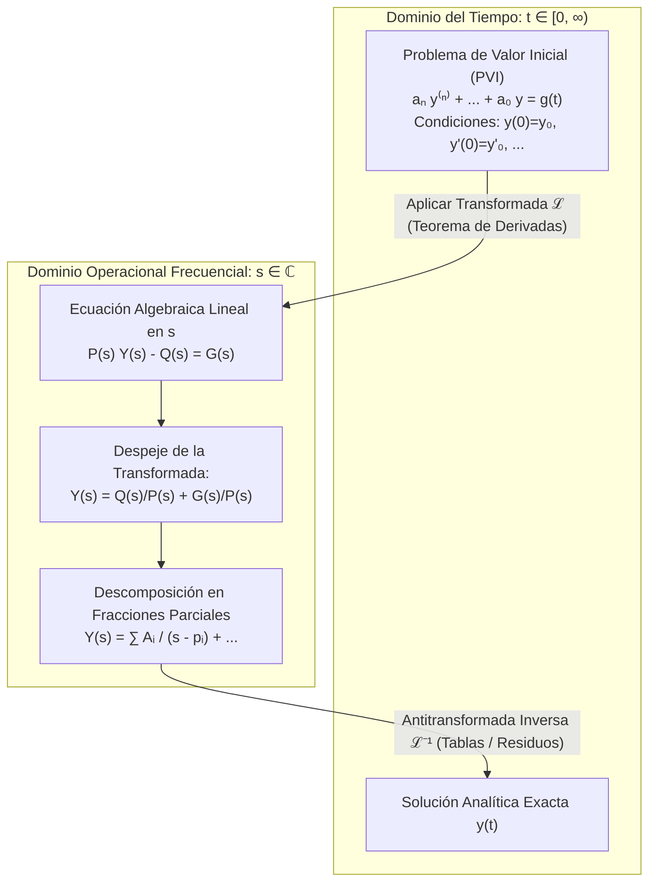
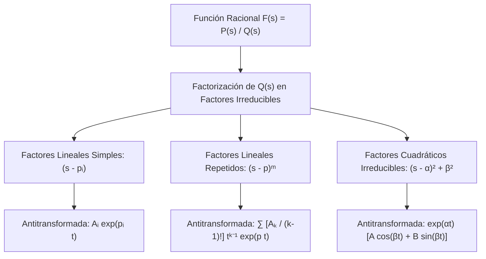
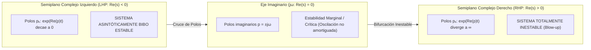

# Transformada de Laplace y Sistemas Dinámicos

En el plan docente de **Ingeniería en Ciencias de la Computación de la Escuela Politécnica Nacional (EPN)**, el estudio de la **Transformada de Laplace** dentro de la cátedra **MATD213 (Ecuaciones Diferenciales Ordinarias)** constituye la transición matemática definitiva del dominio temporal continuo al dominio frecuencial operacional. Este operador integral es la piedra angular del análisis y síntesis de sistemas lineales e invariantes en el tiempo (LTI), procesamiento analógico de señales, arquitectura de controladores retroalimentados (PID), diseño de filtros continuos y verificación de estabilidad de hardware y sistemas ciberfísicos.

Esta nota aborda con máxima rigurosidad analítica la fundamentación de la Transformada de Laplace, sus condiciones de convergencia de orden exponencial, la totalidad de sus teoremas operacionales, la teoría de distribuciones singulares (Delta de Dirac), el Teorema de Convolución, la técnica de descomposición en fracciones parciales y su aplicación fundamental en la estabilidad BIBO y funciones de transferencia de sistemas continuos.

> [!info] 💡 ¿Cómo entender esto desde cero? (Guía para novatos de pregrado)
> - **El problema del cálculo en el tiempo:** Resolver ecuaciones diferenciales con funciones discontinuas (como encender o apagar un switch de alimentación, o una interrupción de hardware) es sumamente engorroso con cálculo tradicional, porque hay que partir la solución en trozos continuos y empatar condiciones de frontera manualmente.
> - **La gran idea de Laplace (El agujero de gusano algebraico):** La Transformada de Laplace es como un "compilador". Toma una ecuación diferencial enredada en el tiempo $t$ y la traduce a una simple **ecuación algebraica** en la variable compleja $s$.
>   - La derivada $\frac{d}{dt}$ se convierte simplemente en multiplicar por $s$.
>   - La integral $\int dt$ se convierte en dividir para $s$.
>   - Las condiciones iniciales $y(0), y'(0)$ se incorporan automáticamente desde el primer paso algebraico.
> - **¿Cómo se resuelve?** Despejas la incógnita $Y(s)$ usando álgebra de colegio (fracciones parciales) y luego "descompilas" aplicando la **Transformada Inversa $\mathcal{L}^{-1}$** para volver al tiempo real $y(t)$.
> - **Polos y Estabilidad BIBO:** La función de transferencia del sistema $H(s)$ tiene puntos donde explota a infinito, llamados **polos**. Si todos los polos tienen parte real negativa (están a la izquierda del plano complejo), el sistema es seguro y estable. ¡Si un solo polo se cruza a la derecha, cualquier señal de entrada finita hará que el sistema diverja y se destruya!

---

## 1. Definición Analítica, Orden Exponencial y Región de Convergencia

### 1.1 Definición del Operador Integral de Laplace

> [!definition] Definición 1.1: Transformada Unilateral de Laplace
> Sea $f: [0, \infty) \to \mathbb{R}$ una función integrable en cualquier intervalo cerrado y acotado $[0, T]$. La **Transformada Unilateral de Laplace** de $f(t)$ se define mediante la integral impropia paramétrica:
> $$\mathcal{L}\{f(t)\} = F(s) \equiv \int_0^\infty e^{-st} f(t) dt = \lim_{T \to \infty} \int_0^T e^{-st} f(t) dt$$
> donde $s = \sigma + i\omega \in \mathbb{C}$ es una variable compleja frecuencial.

### 1.2 Condiciones de Existencia: Continuidad a Trozos y Orden Exponencial

Para garantizar que la integral impropia converja absolutamente, no se exige que $f(t)$ sea diferenciable ni estrictamente continua, sino que satisfaga dos condiciones de regularidad:

> [!important] Definición 1.2: Continuidad a Trozos y Orden Exponencial
> 1. **Continuidad a trozos (por secciones):** $f(t)$ es continua a trozos en $[0, \infty)$ si en cualquier subintervalo finito $[0, T]$ existen a lo sumo un número finito de puntos de discontinuidad $\{t_1, t_2, \dots, t_k\}$, en los cuales los límites laterales izquierdo $f(t_j^-)$ y derecho $f(t_j^+)$ existen y son finitos (discontinuidades de salto finito).
> 2. **Orden Exponencial:** Una función $f(t)$ es de **orden exponencial $c$** si existen constantes reales $M > 0$, $c \in \mathbb{R}$ y $t_0 \ge 0$ tales que:
>    $$|f(t)| \le M e^{ct}, \quad \forall t \ge t_0$$

> [!tip] Teorema 1.1: Existencia y Región de Convergencia (ROC)
> Si $f(t)$ es continua a trozos en $[0, \infty)$ y de orden exponencial $c$, entonces la integral de Laplace $\mathcal{L}\{f(t)\}$ converge absolutamente para todo $s \in \mathbb{C}$ tal que su parte real satisface:
> $$\operatorname{Re}(s) = \sigma > c$$
> El semiplano complejo $\{ s \in \mathbb{C} \mid \operatorname{Re}(s) > c \}$ se denomina **Región de Convergencia (ROC)**.
> Además, la función transformada $F(s)$ es **holomorfa (analítica)** en dicha región y cumple:
> $$\lim_{\operatorname{Re}(s) \to \infty} F(s) = 0$$

#### Demostración de Convergencia Absoluta
$$\begin{aligned}
|F(s)| &= \left| \int_0^\infty e^{-st} f(t) dt \right| \le \int_0^\infty \left| e^{-(\sigma + i\omega)t} f(t) \right| dt \\
&= \int_0^\infty e^{-\sigma t} |e^{-i\omega t}| |f(t)| dt = \int_0^\infty e^{-\sigma t} (1) |f(t)| dt \\
&\le \int_0^{t_0} e^{-\sigma t} |f(t)| dt + \int_{t_0}^\infty e^{-\sigma t} (M e^{ct}) dt \\
&= K_0 + M \int_{t_0}^\infty e^{-(\sigma - c)t} dt
\end{aligned}$$
Si $\sigma > c$, el exponente $-(\sigma - c) < 0$, por lo que la integral impropia converge:
$$\int_{t_0}^\infty e^{-(\sigma - c)t} dt = \left[ -\frac{e^{-(\sigma - c)t}}{\sigma - c} \right]_{t_0}^\infty = \frac{e^{-(\sigma - c)t_0}}{\sigma - c} < \infty \quad \blacksquare$$

---

### 1.3 Transformadas de las Funciones Elementales Canónicas

A partir de la definición directa por integración se obtienen los bloques constructivos fundamentales:

| Función Temporal $f(t)$ ($t \ge 0$) | Transformada $F(s) = \mathcal{L}\{f(t)\}$ | Región de Convergencia (ROC) |
| :--- | :--- | :--- |
| **Constante unitaria:** $1$ | $\dfrac{1}{s}$ | $\operatorname{Re}(s) > 0$ |
| **Potencia entera:** $t^n$ ($n \in \mathbb{N}$) | $\dfrac{n!}{s^{n+1}}$ | $\operatorname{Re}(s) > 0$ |
| **Exponencial real:** $e^{at}$ ($a \in \mathbb{R}$) | $\dfrac{1}{s - a}$ | $\operatorname{Re}(s) > a$ |
| **Seno trigonométrico:** $\sin(\omega t)$ | $\dfrac{\omega}{s^2 + \omega^2}$ | $\operatorname{Re}(s) > 0$ |
| **Coseno trigonométrico:** $\cos(\omega t)$ | $\dfrac{s}{s^2 + \omega^2}$ | $\operatorname{Re}(s) > 0$ |
| **Seno hiperbólico:** $\sinh(at)$ | $\dfrac{a}{s^2 - a^2}$ | $\operatorname{Re}(s) > \|a\|$ |
| **Coseno hiperbólico:** $\cosh(at)$ | $\dfrac{s}{s^2 - a^2}$ | $\operatorname{Re}(s) > \|a\|$ |

---

## 2. Propiedades Algebraicas y Teoremas Fundamentales

### 2.1 Linealidad
El operador $\mathcal{L}$ es lineal sobre su espacio funcional de convergencia:
$$\mathcal{L}\{\alpha f(t) + \beta g(t)\} = \alpha \mathcal{L}\{f(t)\} + \beta \mathcal{L}\{g(t)\}, \quad \forall \alpha, \beta \in \mathbb{R}$$

---

### 2.2 Primer Teorema de Traslación (Desplazamiento en la Frecuencia $s$)

> [!important] Teorema 2.1: Desplazamiento en $s$
> Sea $F(s) = \mathcal{L}\{f(t)\}$ existente para $\operatorname{Re}(s) > c$, y sea $a \in \mathbb{R}$. Entonces:
> $$\mathcal{L}\left\{ e^{at} f(t) \right\} = F(s - a), \quad \operatorname{Re}(s) > c + a$$

*Demostración:*
$$\mathcal{L}\{e^{at} f(t)\} = \int_0^\infty e^{-st} (e^{at} f(t)) dt = \int_0^\infty e^{-(s - a)t} f(t) dt = F(s - a) \quad \blacksquare$$

> [!example] Ejemplo 2.1: Oscilaciones Exponencialmente Amortiguadas
> $$\mathcal{L}\{e^{-\alpha t} \cos(\omega t)\} = \frac{s + \alpha}{(s + \alpha)^2 + \omega^2}$$
> $$\mathcal{L}\{e^{-\alpha t} \sin(\omega t)\} = \frac{\omega}{(s + \alpha)^2 + \omega^2}$$
> $$\mathcal{L}\{t^n e^{at}\} = \frac{n!}{(s - a)^{n+1}}$$

---

### 2.3 Función Escalón Unitario de Heaviside y Segundo Teorema de Traslación

En arquitecturas computacionales, señales digitales y telecomunicaciones, las entradas no son suaves ni continuas, sino pulsos de reloj conmutados en instantes discretos.

> [!definition] Definición 2.1: Función Escalón Unitario (Heaviside)
> Para cualquier umbral de activación $a \ge 0$, la función escalón unitario de Heaviside $u(t - a)$ se define como:
> $$u(t - a) = \begin{cases} 0, & 0 \le t < a \\ 1, & t \ge a \end{cases}$$
> Su transformada directa es:
> $$\mathcal{L}\{u(t - a)\} = \int_0^\infty e^{-st} u(t - a) dt = \int_a^\infty e^{-st} dt = \left[ -\frac{e^{-st}}{s} \right]_a^\infty = \frac{e^{-as}}{s}, \quad \operatorname{Re}(s) > 0$$

> [!important] Teorema 2.2: Segundo Teorema de Traslación (Desplazamiento Temporal)
> Si $F(s) = \mathcal{L}\{f(t)\}$ y $a > 0$, entonces la transformada de una señal retardada exactamente en $a$ unidades de tiempo y activada por el escalón es:
> $$\mathcal{L}\{f(t - a) u(t - a)\} = e^{-as} F(s)$$
> Equivalentemente, para una función $g(t)$ general no pre-retardada:
> $$\mathcal{L}\{g(t) u(t - a)\} = e^{-as} \mathcal{L}\{g(t + a)\}$$

*Demostración:*
$$\mathcal{L}\{f(t - a) u(t - a)\} = \int_0^\infty e^{-st} f(t - a) u(t - a) dt = \int_a^\infty e^{-st} f(t - a) dt$$
Efectuando el cambio de variable $\tau = t - a \implies t = \tau + a$, con $dt = d\tau$:
$$\int_0^\infty e^{-s(\tau + a)} f(\tau) d\tau = e^{-as} \int_0^\infty e^{-s\tau} f(\tau) d\tau = e^{-as} F(s) \quad \blacksquare$$

---

### 2.4 Transformada de Derivadas (La Clave para Resolver PVIs)

> [!important] Teorema 2.3: Derivada de Primer Orden
> Sea $f(t)$ continua en $[0, \infty)$ y de orden exponencial, con $f'(t)$ continua a trozos. Entonces:
> $$\mathcal{L}\{f'(t)\} = s F(s) - f(0)$$

*Demostración por integración por partes:*
Tomando $u = e^{-st} \implies du = -s e^{-st} dt$ y $dv = f'(t) dt \implies v = f(t)$:
$$\mathcal{L}\{f'(t)\} = \int_0^\infty e^{-st} f'(t) dt = \left[ e^{-st} f(t) \right]_0^\infty - \int_0^\infty (-s e^{-st}) f(t) dt$$
Dado que $f$ es de orden exponencial, para $\operatorname{Re}(s) > c$ se cumple $\lim_{t \to \infty} e^{-st} f(t) = 0$. En el límite inferior, $e^0 f(0) = f(0)$:
$$\mathcal{L}\{f'(t)\} = -f(0) + s \int_0^\infty e^{-st} f(t) dt = s F(s) - f(0) \quad \blacksquare$$

> [!tip] Teorema 2.4: Derivadas de Orden Superior
> Aplicando inducción matemática recursiva sobre la fórmula de primer orden:
> $$\mathcal{L}\{f''(t)\} = s^2 F(s) - s f(0) - f'(0)$$
> $$\mathcal{L}\{f'''(t)\} = s^3 F(s) - s^2 f(0) - s f'(0) - f''(0)$$
> En general, para el orden $n$:
> $$\mathcal{L}\{f^{(n)}(t)\} = s^n F(s) - s^{n-1} f(0) - s^{n-2} f'(0) - \dots - s f^{(n-2)}(0) - f^{(n-1)}(0) = s^n F(s) - \sum_{k=1}^n s^{n-k} f^{(k-1)}(0)$$

---

### 2.5 Transformada de Integrales

> [!important] Teorema 2.5: Transformada de la Integral
> Si $f(t)$ es continua a trozos y de orden exponencial con transformada $F(s)$, entonces:
> $$\mathcal{L}\left\{ \int_0^t f(\tau) d\tau \right\} = \frac{F(s)}{s}$$

*Demostración:*
Definamos $g(t) = \int_0^t f(\tau) d\tau$. Por el Teorema Fundamental del Cálculo, $g'(t) = f(t)$ y $g(0) = 0$.
Aplicando la transformada de la derivada:
$$\mathcal{L}\{g'(t)\} = s \mathcal{L}\{g(t)\} - g(0) \implies \mathcal{L}\{f(t)\} = s \mathcal{L}\{g(t)\} \implies \mathcal{L}\{g(t)\} = \frac{F(s)}{s} \quad \blacksquare$$

---

### 2.6 Derivada de la Transformada (Multiplicación por $t^n$)

> [!important] Teorema 2.6: Derivación en el Dominio $s$
> Si $F(s) = \mathcal{L}\{f(t)\}$, entonces derivar respecto a $s$ equivale a multiplicar por $-t$ en el dominio temporal:
> $$\mathcal{L}\{t^n f(t)\} = (-1)^n \frac{d^n}{ds^n} F(s), \quad n \in \mathbb{N}$$

---

## 3. Flujo Operacional de Resolución de PVIs

El flujo analítico con el que la transformada de Laplace evade la complejidad de la integración manual se esquematiza a continuación:

---

## 4. La Distribución Delta de Dirac y Respuesta Impulsiva

En el modelado computacional de eventos instantáneos (la llegada atómica de un paquete TCP, un cambio abrupto de voltaje en un latch, o una interrupción por software IRQ), una señal ocurre en una ventana temporal infinitamente estrecha con transferencia finita de energía.

### 4.1 Definición Rigurosa en la Teoría de Distribuciones

> [!definition] Definición 4.1: Distribución Delta de Dirac
> La **Delta de Dirac** $\delta(t - t_0)$ (con $t_0 \ge 0$) no es una función ordinaria en el sentido clásico de Weierstrass, sino un elemento del espacio dual de funcionales lineales continuos (espacio de distribuciones de Laurent Schwartz).
> Se concibe como el límite de un tren de pulsos rectangulares $\delta_\epsilon(t - t_0)$ de ancho $\epsilon$ y altura $\frac{1}{\epsilon}$:
> $$\delta(t - t_0) = \lim_{\epsilon \to 0^+} \frac{1}{\epsilon} [u(t - t_0) - u(t - (t_0 + \epsilon))]$$
> Posee las dos propiedades fundamentales:
> 1. $\delta(t - t_0) = 0$ para todo $t \neq t_0$.
> 2. **Integral de normalización:** $\displaystyle \int_{-\infty}^\infty \delta(t - t_0) dt = 1$.

> [!important] Propiedad de Tamizado o Muestreo (Sifting Property)
> Para cualquier función de prueba $\phi(t)$ continua en $t = t_0$:
> $$\int_0^\infty \phi(t) \delta(t - t_0) dt = \phi(t_0)$$

### 4.2 Transformada de Laplace de la Delta de Dirac
Aplicando la propiedad de tamizado con $\phi(t) = e^{-st}$:
$$\mathcal{L}\{\delta(t - t_0)\} = \int_0^\infty e^{-st} \delta(t - t_0) dt = e^{-s t_0}$$
En particular, para un impulso aplicado exactamente en el origen $t_0 = 0$:
$$\mathcal{L}\{\delta(t)\} = e^0 = 1$$

> [!tip] La Delta como Derivada Distribucional de Heaviside
> En el sentido generalizado de derivadas débiles o distribucionales:
> $$\frac{d}{dt} u(t - a) = \delta(t - a)$$
> Aplicando la transformada de la derivada a $u(t - a)$ con $u(0^-) = 0$:
> $$\mathcal{L}\left\{ \frac{d}{dt} u(t - a) \right\} = s \mathcal{L}\{u(t - a)\} = s \left(\frac{e^{-as}}{s}\right) = e^{-as} = \mathcal{L}\{\delta(t - a)\} \quad \checkmark$$

---

## 5. Teorema de Convolución y Ecuaciones Integrales

En el análisis de sistemas LTI y redes neuronales continuas (CNNs en tiempo continuo), la salida no depende únicamente de la entrada en el instante presente, sino de toda la historia ponderada por la memoria del sistema.

### 5.1 Definición de la Convolución Continua

> [!definition] Definición 5.1: Convolución de Dos Funciones
> Dadas dos funciones $f, g: [0, \infty) \to \mathbb{R}$ continuas a trozos, su **convolución** $(f * g)(t)$ es la operación bilineal definida por la integral de memoria:
> $$(f * g)(t) \equiv \int_0^t f(\tau) g(t - \tau) d\tau$$
> La convolución satisface las propiedades de:
> - **Conmutatividad:** $f * g = g * f$.
> - **Asociatividad:** $(f * g) * h = f * (g * h)$.
> - **Distributividad:** $f * (g + h) = (f * g) + (f * h)$.

### 5.2 El Teorema de Convolución en el Dominio de Laplace

> [!important] Teorema 5.1: Teorema de Convolución
> La convolución en el dominio temporal equivale exactamente a la multiplicación algebraica en el dominio frecuencial:
> $$\mathcal{L}\{(f * g)(t)\} = F(s) G(s)$$
> Inversamente:
> $$\mathcal{L}^{-1}\{F(s) G(s)\} = (f * g)(t) = \int_0^t f(\tau) g(t - \tau) d\tau$$

#### Demostración Analítica
Por definición:
$$\mathcal{L}\{(f * g)(t)\} = \int_0^\infty e^{-st} \left[ \int_0^t f(\tau) g(t - \tau) d\tau \right] dt = \int_{t=0}^\infty \int_{\tau=0}^t e^{-st} f(\tau) g(t - \tau) d\tau dt$$
La región de integración en el plano $(\tau, t)$ es la cuña infinita $0 \le \tau \le t < \infty$. Invirtiendo el orden de integración (Teorema de Fubini):
$$\int_{\tau=0}^\infty f(\tau) \left[ \int_{t=\tau}^\infty e^{-st} g(t - \tau) dt \right] d\tau$$
Efectuando el cambio de variable $u = t - \tau \implies t = u + \tau$, con $dt = du$:
$$\int_{\tau=0}^\infty f(\tau) \left[ \int_{u=0}^\infty e^{-s(u + \tau)} g(u) du \right] d\tau = \left( \int_{\tau=0}^\infty e^{-s\tau} f(\tau) d\tau \right) \left( \int_{u=0}^\infty e^{-su} g(u) du \right) = F(s) G(s) \quad \blacksquare$$

---

## 6. Transformada Inversa $\mathcal{L}^{-1}\{F(s)\}$ y Fracciones Parciales

Formalmente, la transformada inversa viene dada por la **Integral de Contorno de Bromwich** en el plano complejo:
$$f(t) = \mathcal{L}^{-1}\{F(s)\} = \frac{1}{2\pi i} \int_{\gamma - i\infty}^{\gamma + i\infty} e^{st} F(s) ds$$
donde la recta vertical $\operatorname{Re}(s) = \gamma$ se encuentra estrictamente a la derecha de todas las singularidades de $F(s)$.

En la práctica ingenieril, $F(s) = \frac{P(s)}{Q(s)}$ es una función racional propia ($\deg(P) < \deg(Q)$). La inversión se efectúa mediante **descomposición en fracciones parciales**:

---

## 7. Modelado en Ciencias de la Computación, Control y Sistemas Dinámicos

### 7.1 La Función de Transferencia $H(s)$ de Sistemas LTI

Consideremos un sistema dinámico continuo cuya evolución temporal está gobernada por una EDO lineal con coeficientes constantes:
$$a_n y^{(n)} + \cdots + a_1 y' + a_0 y = b_m x^{(m)} + \cdots + b_1 x' + b_0 x$$
donde $x(t)$ es la señal de entrada (input) e $y(t)$ es la respuesta o salida (output).

Asumiendo que el sistema parte del reposo (**condiciones iniciales nulas**: $y(0) = \dots = y^{(n-1)}(0) = 0$ y $x(0) = \dots = x^{(m-1)}(0) = 0$), aplicamos Laplace:
$$(a_n s^n + \dots + a_1 s + a_0) Y(s) = (b_m s^m + \dots + b_1 s + b_0) X(s)$$

> [!definition] Definición 7.1: Función de Transferencia y Respuesta al Impulso
> La **Función de Transferencia** $H(s)$ es el cociente algebraico entre la transformada de la salida y la transformada de la entrada en condiciones iniciales nulas:
> $$H(s) \equiv \frac{Y(s)}{X(s)} = \frac{b_m s^m + \dots + b_1 s + b_0}{a_n s^n + \dots + a_1 s + a_0}$$
> Si la entrada es un impulso unitario ideal $x(t) = \delta(t)$, entonces $X(s) = 1$. Por lo tanto:
> $$Y(s) = H(s) \cdot 1 = H(s) \implies y(t) = \mathcal{L}^{-1}\{H(s)\} \equiv h(t)$$
> La función $h(t)$ se denomina **Respuesta al Impulso** (*Impulse Response*).
> Para cualquier otra entrada arbitraria $x(t)$:
> $$Y(s) = H(s) X(s) \implies y(t) = (h * x)(t) = \int_0^t h(\tau) x(t - \tau) d\tau$$

---

### 7.2 Polos, Ceros y Estabilidad BIBO (Bounded-Input Bounded-Output)

Factorizando $H(s) = K \frac{\prod_{j=1}^m (s - z_j)}{\prod_{k=1}^n (s - p_k)}$:
- **Ceros ($z_j$):** Raíces del numerador ($H(z_j) = 0$). Anulan frecuencias específicas.
- **Polos ($p_k$):** Raíces del denominador ($H(p_k) \to \infty$). Determinan la dinámica natural del sistema.

> [!definition] Definición 7.2: Estabilidad BIBO
> Un sistema continuo es **BIBO estable (Bounded-Input Bounded-Output)** si para toda señal de entrada acotada en amplitud ($\|x(t)\| \le M_x < \infty$ para todo $t \ge 0$), la señal de salida resultante permanece acotada en todo instante:
> $$\exists M_y < \infty \quad \text{tal que} \quad |y(t)| \le M_y, \quad \forall t \ge 0$$

> [!important] Teorema 7.1: Criterio Fundamental de Estabilidad BIBO
> Un sistema LTI continuo es BIBO estable si y solo si su respuesta al impulso es absolutamente integrable en $L^1([0, \infty))$:
> $$\int_0^\infty |h(t)| dt < \infty$$
> En términos de los polos de la función de transferencia $H(s)$, esto se cumple si y solo si:
> **Todos los polos de $H(s)$ tienen parte real estrictamente negativa:**
> $$\operatorname{Re}(p_k) < 0, \quad \forall k \in \{1, 2, \dots, n\}$$
> Es decir, **todos los polos deben residir en el semiplano complejo izquierdo abierto (Open Left-Half Plane, LHP)**.

#### Consecuencias en Computación y Filtros Analógicos
1. **Filtros Antialiasing:** En tarjetas de adquisición de datos y microcontroladores antes del muestreo ADC con frecuencia de Nyquist $f_s$, se implementan filtros analógicos paso bajo continuos (como los filtros de Butterworth o Chebyshev). La función de transferencia de Butterworth de orden $N$ sitúa sus polos simétricamente sobre una semicircunferencia en el semiplano izquierdo LHP:
   $$p_k = \omega_c \exp\left( i \frac{\pi (2k + N - 1)}{2N} \right), \quad k = 1, 2, \dots, N$$
   garantizando máxima planitud en la banda de paso y estabilidad BIBO incondicional.
2. **Controladores en Servomotores de Robótica:** En el lazo de control de posición de un brazo robótico o dron, el software ejecuta un algoritmo PID continuo. Si los parámetros de ganancia $K_p, K_i, K_d$ no se sintonizan adecuadamente, los polos en bucle cerrado cruzan el eje imaginario hacia el RHP ($\operatorname{Re}(p) > 0$), provocando resonancias destructivas y saturación en los actuadores.

---

## 8. Problema Resuelto Nivel Examen EPN

> [!example] Problema de Examen EPN: PVI No Homogéneo con Conmutación y Pulso Impulsivo
> **Enunciado:** Un sistema dinámico modela la corriente transitoria $i(t)$ en un circuito regulador de potencia de un servidor cuando ocurre una interrupción abrupta de voltaje en $t = 1$ y una descarga estática modelada por una delta de Dirac en $t = 2$:
> $$y'' + 4y' + 13y = 26 u(t - 1) + 3\delta(t - 2)$$
> con condiciones iniciales de reposo total:
> $$y(0) = 0, \quad y'(0) = 0$$
> Hallar la respuesta temporal exacta $y(t)$ para todo $t \ge 0$.
>
> **Solución Paso a Paso:**
>
> **1. Aplicación de la Transformada de Laplace:**
> $$\mathcal{L}\{y''\} + 4\mathcal{L}\{y'\} + 13\mathcal{L}\{y\} = 26\mathcal{L}\{u(t - 1)\} + 3\mathcal{L}\{\delta(t - 2)\}$$
> Sustituyendo las condiciones iniciales nulas:
> $$(s^2 Y(s) - s y(0) - y'(0)) + 4(s Y(s) - y(0)) + 13 Y(s) = 26 \frac{e^{-s}}{s} + 3 e^{-2s}$$
> $$(s^2 + 4s + 13) Y(s) = 26 \frac{e^{-s}}{s} + 3 e^{-2s}$$
>
> **2. Despeje de la función de transferencia del estado:**
> Notamos que el polinomio característico es $s^2 + 4s + 13 = (s + 2)^2 + 9 = (s + 2)^2 + 3^2$.
> Sus raíces son los polos $p_{1,2} = -2 \pm 3i$ (ambos en el LHP, con $\operatorname{Re}(p) = -2 < 0$, garantizando estabilidad BIBO).
> Despejando $Y(s)$:
> $$Y(s) = e^{-s} \underbrace{\frac{26}{s(s^2 + 4s + 13)}}_{F_1(s)} + e^{-2s} \underbrace{\frac{3}{s^2 + 4s + 13}}_{F_2(s)}$$
>
> **3. Inversión del segundo término $F_2(s)$:**
> $$F_2(s) = \frac{3}{(s + 2)^2 + 3^2}$$
> Por el Primer Teorema de Traslación con $a = -2$ y $\omega = 3$:
> $$f_2(t) = \mathcal{L}^{-1}\{F_2(s)\} = e^{-2t} \sin(3t)$$
>
> **4. Descomposición en fracciones parciales de $F_1(s)$:**
> $$\frac{26}{s(s^2 + 4s + 13)} = \frac{A}{s} + \frac{Bs + C}{s^2 + 4s + 13}$$
> Multiplicando por el denominador común:
> $$26 = A(s^2 + 4s + 13) + (Bs + C)s = (A + B)s^2 + (4A + C)s + 13A$$
> Igualando coeficientes:
> - Término independiente: $13A = 26 \implies A = 2$.
> - Término de grado 2: $A + B = 0 \implies B = -A = -2$.
> - Término de grado 1: $4A + C = 0 \implies C = -4A = -8$.
>
> Reescribiendo el término cuadrático:
> $$\frac{-2s - 8}{(s + 2)^2 + 9} = \frac{-2(s + 2) - 4}{(s + 2)^2 + 9} = -2 \frac{s + 2}{(s + 2)^2 + 3^2} - \frac{4}{3} \frac{3}{(s + 2)^2 + 3^2}$$
>
> Aplicando la transformada inversa término a término:
> $$f_1(t) = \mathcal{L}^{-1}\left\{ \frac{2}{s} - 2 \frac{s + 2}{(s + 2)^2 + 3^2} - \frac{4}{3} \frac{3}{(s + 2)^2 + 3^2} \right\} = 2 - 2 e^{-2t} \cos(3t) - \frac{4}{3} e^{-2t} \sin(3t)$$
>
> **5. Aplicación del Segundo Teorema de Traslación para obtener $y(t)$:**
> Como $Y(s) = e^{-s} F_1(s) + e^{-2s} F_2(s)$, por el Teorema 2.2:
> $$y(t) = f_1(t - 1) u(t - 1) + f_2(t - 2) u(t - 2)$$
>
> **6. Solución analítica final:**
> $$y(t) = \left[ 2 - 2 e^{-2(t - 1)} \cos(3(t - 1)) - \frac{4}{3} e^{-2(t - 1)} \sin(3(t - 1)) \right] u(t - 1) + \left[ e^{-2(t - 2)} \sin(3(t - 2)) \right] u(t - 2)$$
>
> Esta expresión describe con absoluta precisión:
> 1. Para $t < 1$: el sistema permanece en reposo $y(t) = 0$.
> 2. Para $1 \le t < 2$: se produce una respuesta subamortiguada hacia el nuevo nivel de continua $y_\infty = 2$.
> 3. Para $t \ge 2$: se superpone la oscilación impulsiva generada por la delta de Dirac, que decae asintóticamente a cero debido al amortiguamiento $e^{-2t}$.

---

## 9. Referencias Bibliográficas

1. **Oppenheim, A. V., Willsky, A. S., & Nawab, S. H.** (1997). *Signals and Systems* (2nd ed.). Prentice Hall.
2. **Kuo, B. C.** (2003). *Automatic Control Systems* (8th ed.). John Wiley & Sons.
3. **Boyce, W. E., & DiPrima, R. C.** (2017). *Elementary Differential Equations and Boundary Value Problems* (11th ed.). John Wiley & Sons.
4. **Zill, D. G.** (2018). *Ecuaciones Diferenciales con Aplicaciones de Modelado* (11va ed.). Cengage Learning.
