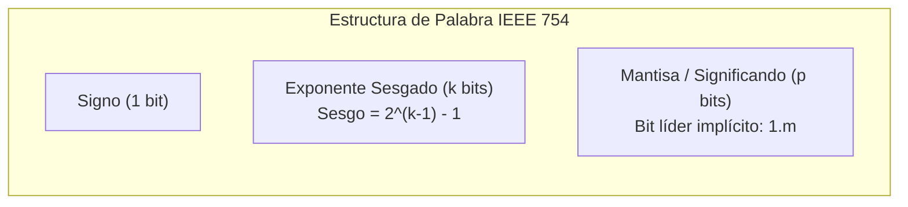
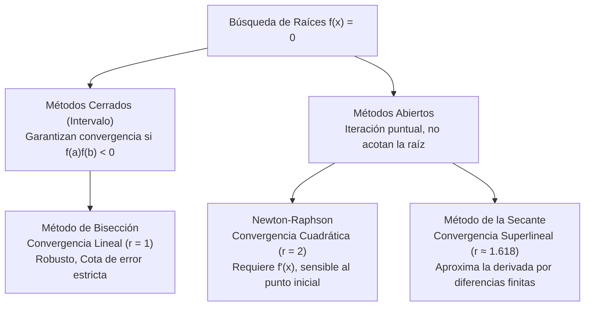
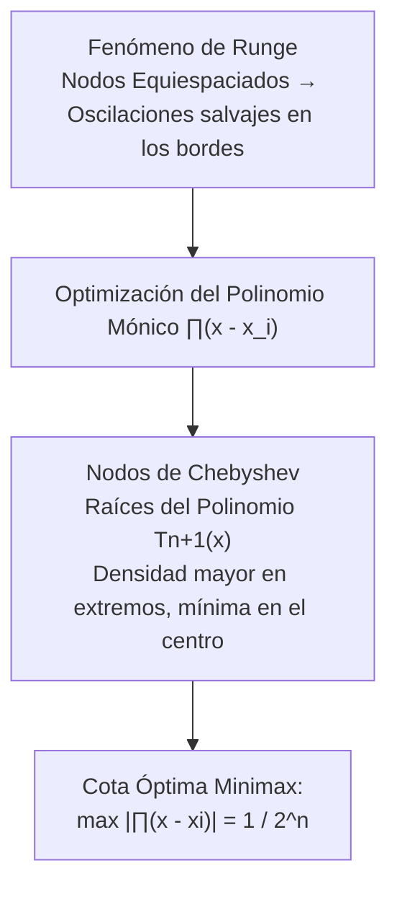
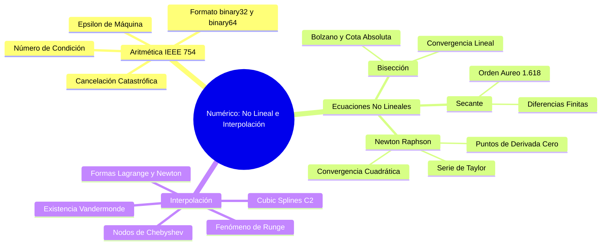

# Métodos Numéricos para Ecuaciones No Lineales e Interpolación Polinómica

> [!abstract] Fundamento en Ciencias de la Computación (EPN)
> En la arquitectura computacional, el continuo de los números reales $\mathbb{R}$ es aproximado por un subconjunto discreto y finito de números de punto flotante. Esta discretización introduce errores inherentes de representación y redondeo. Como futuros ingenieros de la EPN, dominar el análisis numérico implica garantizar la **estabilidad algorítmica**, controlar la **propagación del error** y diseñar solucionadores deterministas de alta eficiencia para problemas no lineales y aproximación funcional en [[computacion grafica]], robótica y física computacional.

> [!info] 💡 ¿Cómo entender esto desde cero? (Guía para novatos de pregrado)
> - **El choque con la realidad:** En el colegio nos enseñan fórmulas mágicas para despejar $x$. Pero si tienes una ecuación real como $e^x + \sin(x) - x^2 = 0$, **no existe ninguna fórmula humana en papel para despejar $x$**.
> - **El enfoque del Método Numérico:** Las computadoras no se cansan. En lugar de despejar con álgebra imposible, inventamos algoritmos inteligentes que van "acorralando" a la solución correcta:
>   - **Bisección:** Si sabes que la raíz está entre 1 y 2, pruebas en 1.5. Si está a la izquierda, descartas la derecha. En 30 pasos tienes una precisión de 9 decimales.
>   - **Newton-Raphson:** En lugar de ir a ciegas, calcula la recta tangente hacia donde apunta la función y viaja a toda velocidad hacia la raíz en apenas 4 o 5 iteraciones.
> - **Interpolación y Splines:** Si tienes 10 puntos de datos de un sensor GPS en un mapa, ¿cómo dibujas una curva suave que pase por todos ellos sin que se vuelva loca? Con **Splines Cúbicos**, la matemática que usan los programas de diseño (Photoshop, AutoCAD, Blender).

---

## 1. Teoría de Errores y Aritmética de Punto Flotante

### 1.1. El Estándar IEEE 754

Cualquier número real no nulo $x \in \mathbb{R}$ se normaliza en base 2 bajo el formato de punto flotante:

$$x = (-1)^s \times (1.m)_2 \times 2^{e - \text{bias}}$$

donde:
- $s \in \{0, 1\}$: Bit de signo ($0$ para positivo, $1$ para negativo).
- $m$: Mantisa o significando fraccionario con bit implícito $1$.
- $e$: Exponente entero no signado desplazado mediante un sesgo (*bias*).
- $\text{bias} = 2^{k-1} - 1$, donde $k$ es el número de bits asignados al exponente.



| Precisión | Formato IEEE | Bits Totales | Bits Signo ($s$) | Bits Exponente ($k$) | Sesgo (*Bias*) | Bits Mantisa ($p$) | Épsilon de Máquina ($\epsilon_{\text{mach}}$) |
| :--- | :--- | :--- | :--- | :--- | :--- | :--- | :--- |
| **Simple** | `binary32` (float) | 32 | 1 | 8 | 127 | 23 | $2^{-23} \approx 1.192 \times 10^{-7}$ |
| **Doble** | `binary64` (double) | 64 | 1 | 11 | 1023 | 52 | $2^{-52} \approx 2.220 \times 10^{-16}$ |

> [!important] Épsilon de Máquina ($\epsilon_{\text{mach}}$)
> El épsilon de máquina es la cota superior del error relativo inherente al redondeo de cualquier número real no nulo al formato flotante más cercano:
> $$\left| \frac{\text{fl}(x) - x}{x} \right| \le \epsilon_{\text{mach}} = 2^{-p}$$
> Formalmente, es la distancia entre $1.0$ y el número flotante estrictamente consecutivo más próximo representable en la arquitectura.

---

### 1.2. Tipología de Errores y Cancelación Catastrófica

- **Error Absoluto:** $E_{\text{abs}} = |\hat{x} - x|$.
- **Error Relativo:** $E_{\text{rel}} = \frac{|\hat{x} - x|}{|x|}, \quad (x \ne 0)$.

> [!danger] Cancelación Catastrófica (*Loss of Significance*)
> Ocurre al restar dos números de magnitud casi idéntica previamente afectados por redondeo. Los dígitos más significativos coinciden y se anulan, desplazando los bits espurios de menor significancia hacia los pesos altos del resultado:
> 
> *Ejemplo clásico:* Evaluar $f(x) = \sqrt{x+1} - \sqrt{x}$ para $x = 10^8$.
> Directamente: sufre cancelación drástica.
> **Reformulación algebraica estable:**
> $$f(x) = \frac{(\sqrt{x+1} - \sqrt{x})(\sqrt{x+1} + \sqrt{x})}{\sqrt{x+1} + \sqrt{x}} = \frac{1}{\sqrt{x+1} + \sqrt{x}}$$
> Esta transformación elimina la resta y preserva la precisión total de máquina.

### 1.3. Condicionamiento de un Problema y Estabilidad Algorítmica

El **Número de Condición** ($\kappa$) mide la sensibilidad relativa de la solución matemática respecto a perturbaciones infinitesimales en la entrada:

$$\kappa \triangleq \lim_{\Delta x \to 0} \frac{|\Delta f(x) / f(x)|}{|\Delta x / x|} = \left| \frac{x f'(x)}{f(x)} \right|$$

- Si $\kappa \approx 1$: El problema está **bien condicionado**.
- Si $\kappa \gg 1$: El problema está **mal condicionado** (cualquier algoritmo, por perfecto que sea, amplificará los errores de redondeo).

---

## 2. Métodos para Raíces de Ecuaciones No Lineales $f(x) = 0$

Dada una función continua $f: [a, b] \to \mathbb{R}$, se busca hallar $r \in [a, b]$ tal que $f(r) = 0$.



---

### 2.1. Método de Bisección

Fundamentado en el **Teorema del Valor Intermedio (Bolzano)**: Si $f \in C[a, b]$ y $f(a)f(b) < 0$, existe al menos un $r \in (a, b)$ tal que $f(r) = 0$.

1. Se computa el punto medio: $c_k = \frac{a_k + b_k}{2}$.
2. Si $f(a_k)f(c_k) < 0$, la raíz reside en $[a_k, c_k]$; por ende $b_{k+1} = c_k, a_{k+1} = a_k$.
3. Si $f(a_k)f(c_k) > 0$, la raíz reside en $[c_k, b_k]$; por ende $a_{k+1} = c_k, b_{k+1} = b_k$.

#### Cota de Error Absoluta y Número de Iteraciones A Priori
La longitud del intervalo en la iteración $n$ es $\frac{b-a}{2^n}$. Como el estimador es el punto medio, el error máximo absoluto está acotado por:

$$e_n = |r - c_n| \le \frac{b - a}{2^n}$$

Para garantizar una tolerancia estricta $\epsilon$:
$$\frac{b - a}{2^n} \le \epsilon \implies 2^n \ge \frac{b - a}{\epsilon} \implies n \ge \left\lceil \log_2 \left( \frac{b - a}{\epsilon} \right) \right\rceil$$

---

### 2.2. Método de Newton-Raphson

#### Deducción Analítica vía Expansión de Taylor
Sea $r$ la raíz buscada ($f(r) = 0$) y $x_k$ la aproximación actual. Expandiendo $f(x)$ en serie de Taylor de primer orden con residuo de Lagrange alrededor de $x_k$:

$$f(r) = f(x_k) + f'(x_k)(r - x_k) + \frac{f''(\xi_k)}{2}(r - x_k)^2 = 0, \quad \xi_k \in (\min(x_k, r), \max(x_k, r))$$

Truncando el término cuadrático y aproximando $r \approx x_{k+1}$:
$$0 \approx f(x_k) + f'(x_k)(x_{k+1} - x_k) \implies x_{k+1} = x_k - \frac{f(x_k)}{f'(x_k)}$$

#### Demostración del Orden de Convergencia Cuadrático
Definiendo el error en el paso $k$ como $e_k = x_k - r$:
$$x_{k+1} - r = x_k - r - \frac{f(x_k)}{f'(x_k)} \implies e_{k+1} = e_k - \frac{f(x_k)}{f'(x_k)} = \frac{e_k f'(x_k) - f(x_k)}{f'(x_k)}$$

Expandiendo $f(r) = 0$ alrededor de $x_k$:
$$0 = f(x_k) - e_k f'(x_k) + \frac{e_k^2}{2} f''(\xi_k) \implies e_k f'(x_k) - f(x_k) = \frac{e_k^2}{2} f''(\xi_k)$$

Sustituyendo:
$$e_{k+1} = \frac{f''(\xi_k)}{2 f'(x_k)} e_k^2$$

Tomando el límite cuando $k \to \infty$ ($x_k \to r$ y $\xi_k \to r$):
$$\lim_{k \to \infty} \frac{|e_{k+1}|}{|e_k|^2} = \left| \frac{f''(r)}{2 f'(r)} \right| = C$$
Esto prueba que **Newton-Raphson converge cuadráticamente ($p = 2$)**, duplicando la cantidad de dígitos significativos correctos en cada iteración, siempre que $f'(r) \ne 0$.

> [!warning] Patologías y Modos de Falla de Newton-Raphson
> 1. **Punto Estacionario ($f'(x_k) \approx 0$):** Provoca división por cero o un salto asintótico catastrófico hacia el infinito.
> 2. **Ciclos Oscilatorios Atractores:** La iteración queda atrapada en un ciclo periódico infinito (ej. $f(x) = x^3 - x - 3$ con $x_0 = 0$).
> 3. **Raíces Múltiples:** Si $f(r) = f'(r) = 0$ (raíz de multiplicidad $m > 1$), el orden decae a **lineal**. Se corrige usando el **Newton Modificado**:
>    $$x_{k+1} = x_k - m \frac{f(x_k)}{f'(x_k)}$$

---

### 2.3. Método de la Secante

Elimina la necesidad de calcular analíticamente la derivada $f'(x)$, aproximándola mediante el cociente de diferencias finitas hacia atrás:

$$f'(x_k) \approx \frac{f(x_k) - f(x_{k-1})}{x_k - x_{k-1}}$$

Sustituyendo en la fórmula de Newton se obtiene la relación de recurrencia de dos pasos:

$$x_{k+1} = x_k - f(x_k) \frac{x_k - x_{k-1}}{f(x_k) - f(x_{k-1})}$$

- **Orden de Convergencia:** $p = \phi = \frac{1 + \sqrt{5}}{2} \approx 1.618$ (**superlineal**, razón áurea).
- **Eficiencia Computacional:** Requiere solo una evaluación de función por paso (reutilizando $f(x_{k-1})$), superando a Newton en costo temporal por dígito en funciones trascendentes costosas.

---

## 3. Interpolación Polinómica y Fenómeno de Runge

Dados $n+1$ nodos distintos $\{(x_0, y_0), (x_1, y_1), \dots, (x_n, y_n)\}$, se busca un polinomio $P_n(x)$ de grado $\le n$ tal que $P_n(x_i) = y_i$ para todo $i \in \{0, \dots, n\}$.

### 3.1. Existencia y Unicidad: Matriz de Vandermonde

El sistema lineal resultante $V \mathbf{a} = \mathbf{y}$ involucra la **Matriz de Vandermonde**:

$$V = \begin{bmatrix}
1 & x_0 & x_0^2 & \dots & x_0^n \\
1 & x_1 & x_1^2 & \dots & x_1^n \\
\vdots & \vdots & \vdots & \ddots & \vdots \\
1 & x_n & x_n^2 & \dots & x_n^n
\end{bmatrix}$$

Su determinante viene dado por $\det(V) = \prod_{0 \le i < j \le n} (x_j - x_i)$. Si todos los nodos $x_i$ son distintos, $\det(V) \ne 0$; por consiguiente, el polinomio interpolador **existe y es único**.

---

### 3.2. Forma Canónica de Lagrange y Forma de Newton

1. **Forma de Lagrange:**
   $$P_n(x) = \sum_{k=0}^n y_k L_k(x), \quad \text{donde } L_k(x) = \prod_{\substack{j=0 \\ j \ne k}}^n \frac{x - x_j}{x_k - x_j}$$
   *Desventaja:* Agregar un nuevo punto exige recalcular todos los polinomios base $L_k(x)$ desde cero con complejidad $\mathcal{O}(n^2)$.

2. **Forma de Newton con Diferencias Divididas:**
   $$P_n(x) = f[x_0] + f[x_0, x_1](x - x_0) + f[x_0, x_1, x_2](x - x_0)(x - x_1) + \dots + f[x_0, \dots, x_n]\prod_{j=0}^{n-1}(x - x_j)$$
   Definición recursiva de las diferencias divididas:
   $$f[x_i] = y_i, \qquad f[x_i, x_{i+1}, \dots, x_{i+k}] = \frac{f[x_{i+1}, \dots, x_{i+k}] - f[x_i, \dots, x_{i+k-1}]}{x_{i+k} - x_i}$$
   *Ventaja en CS:* Soporta inserción incremental en tiempo $\mathcal{O}(n)$.

---

### 3.3. El Fenómeno de Runge y Nodos de Chebyshev

El error de interpolación para una función suave $f \in C^{n+1}[a, b]$ es:

$$f(x) - P_n(x) = \frac{f^{(n+1)}(\xi)}{(n+1)!} \prod_{i=0}^n (x - x_i)$$

> [!danger] Fenómeno de Runge (1901)
> Si se interpolan nodos **equiespaciados** en la función de Runge $f(x) = \frac{1}{1 + 25x^2}$ en $[-1, 1]$, a medida que $n \to \infty$, el polinomio oscila violentamente cerca de los extremos del intervalo:
> $$\lim_{n \to \infty} \max_{x \in [-1, 1]} |f(x) - P_n(x)| = \infty$$



#### Solución Mediante Nodos de Chebyshev
Para minimizar el término nodal $\max_{x \in [-1, 1]} |\prod_{i=0}^n (x - x_i)|$, se seleccionan los $x_i$ como las raíces del polinomio ortogonal de Chebyshev $T_{n+1}(x) = \cos((n+1)\arccos x)$:

$$x_k = \cos\left( \frac{2k + 1}{2(n + 1)} \pi \right), \quad k = 0, 1, \dots, n$$

Para un intervalo general $[a, b]$, se mapean linealmente:
$$\tilde{x}_k = \frac{a + b}{2} + \frac{b - a}{2} x_k$$
Esta distribución de nodos concentra más puntos cerca de los bordes, suprimiendo las oscilaciones y garantizando convergencia uniforme.

---

## 4. Trazadores Cúbicos (*Cubic Splines*)

Para evitar los polinomios globales de alto grado, los *splines* emplean funciones polinómicas por tramos de bajo grado unidas suavemente en los nodos.

### 4.1. Definición Formal del Spline Cúbico $C^2$

Dado el conjunto de $n+1$ nodos $\{x_0 < x_1 < \dots < x_n\}$, un trazador cúbico $S(x)$ es una función compuesta por $n$ polinomios cúbicos:

$$S(x) = S_i(x) = a_i + b_i(x - x_i) + c_i(x - x_i)^2 + d_i(x - x_i)^3 \quad \text{para } x \in [x_i, x_{i+1}]$$

que satisface obligatoriamente:
1. **Interpolación:** $S_i(x_i) = y_i$ y $S_i(x_{i+1}) = y_{i+1}$ para $i = 0, \dots, n-1$.
2. **Continuidad de la Función ($C^0$):** $S_{i-1}(x_i) = S_i(x_i)$.
3. **Continuidad de la Pendiente ($C^1$):** $S'_{i-1}(x_i) = S'_i(x_i)$ para $i = 1, \dots, n-1$.
4. **Continuidad de la Curvatura ($C^2$):** $S''_{i-1}(x_i) = S''_i(x_i)$ para $i = 1, \dots, n-1$.

---

### 4.2. Deducción del Sistema Tridiagonal

Sea $h_i = x_{i+1} - x_i$ y denotemos las segundas derivadas en los nodos como $M_i = S''(x_i)$.
Dado que $S_i''(x)$ es lineal en $[x_i, x_{i+1}]$:

$$S_i''(x) = M_i \frac{x_{i+1} - x}{h_i} + M_{i+1} \frac{x - x_i}{h_i}$$

Integrando dos veces e imponiendo las condiciones de empalme $C^1$ en cada nodo interno $x_i$, se obtiene el **sistema de ecuaciones tridiagonal**:

$$h_{i-1} M_{i-1} + 2(h_{i-1} + h_i) M_i + h_i M_{i+1} = 6 \left( \frac{y_{i+1} - y_i}{h_i} - \frac{y_i - y_{i-1}}{h_{i-1}} \right), \quad i = 1, \dots, n-1$$

#### Condiciones de Frontera
El sistema tiene $n-1$ ecuaciones y $n+1$ incógnitas ($M_0, \dots, M_n$). Se requieren 2 condiciones adicionales:
- **Spline Natural (Libre):** $M_0 = 0$ y $M_n = 0$. Minimiza la energía elástica de flexión $\int |S''(x)|^2 dx$.
- **Spline Sujeto (*Clamped*):** $S'(x_0) = f'(x_0)$ y $S'(x_n) = f'(x_n)$.

La matriz tridiagonal es **estrictamente diagonal dominante**, lo que garantiza la existencia de solución única y permite resolverla de forma óptima en tiempo $\mathcal{O}(n)$ mediante el **Algoritmo de Thomas**.

> [!tip] Aplicaciones en Computación Gráfica y CAD
> Los Cubic Splines y sus variantes paramétricas (Splines de Catmull-Rom, Curvas de Bézier, B-Splines y NURBS) constituyen el estándar de la industria en modelado tridimensional, motores de renderizado y animación cinemática para trayectorias de cámaras libres de discontinuidades de aceleración ($C^2$).

---

## 5. Implementación Canónica en Python

A continuación se presenta una suite modular en Python 3 con tipado estricto (`typing`) para cada método numérico:

```python
"""
Módulo de Métodos Numéricos: Ecuaciones No Lineales e Interpolación
Departamento de Ciencias de la Computación - EPN
"""

from typing import Callable, Tuple, List
import numpy as np


def bisection(f: Callable[[float], float], a: float, b: float, tol: float = 1e-7, max_iter: int = 100) -> float:
    """Encuentra la raíz de f(x)=0 en [a, b] mediante el método de bisección."""
    if f(a) * f(b) >= 0:
        raise ValueError("f(a) y f(b) deben tener signos opuestos (Teorema de Bolzano).")
    
    for k in range(max_iter):
        c = (a + b) / 2.0
        fc = f(c)
        if abs(fc) < tol or (b - a) / 2.0 < tol:
            return c
        if f(a) * fc < 0:
            b = c
        else:
            a = c
    return (a + b) / 2.0


def newton_raphson(f: Callable[[float], float], df: Callable[[float], float], 
                   x0: float, tol: float = 1e-10, max_iter: int = 50) -> float:
    """Resuelve f(x) = 0 usando el algoritmo de Newton-Raphson."""
    x = x0
    for _ in range(max_iter):
        deriv = df(x)
        if abs(deriv) < 1e-15:
            raise ZeroDivisionError("Derivada nula o cercana a cero detectada.")
        dx = f(x) / deriv
        x -= dx
        if abs(dx) < tol:
            return x
    return x


def divided_differences_table(x: np.ndarray, y: np.ndarray) -> np.ndarray:
    """Calcula la tabla de diferencias divididas de Newton."""
    n = len(x)
    table = np.zeros((n, n))
    table[:, 0] = y
    for j in range(1, n):
        for i in range(n - j):
            table[i, j] = (table[i+1, j-1] - table[i, j-1]) / (x[i+j] - x[i])
    return table


def newton_interpolate(x_nodes: np.ndarray, y_nodes: np.ndarray, x_eval: np.ndarray) -> np.ndarray:
    """Evalúa el polinomio interpolador de Newton."""
    table = divided_differences_table(x_nodes, y_nodes)
    coefs = table[0, :]
    n = len(coefs)
    
    # Evaluación mediante esquema de Horner
    result = np.zeros_like(x_eval, dtype=float) + coefs[-1]
    for i in range(n - 2, -1, -1):
        result = result * (x_eval - x_nodes[i]) + coefs[i]
    return result


def chebyshev_nodes(a: float, b: float, n_points: int) -> np.ndarray:
    """Genera n_points nodos de Chebyshev en el intervalo [a, b]."""
    k = np.arange(n_points)
    x_cheb = np.cos((2 * k + 1) * np.pi / (2 * n_points))
    return 0.5 * (a + b) + 0.5 * (b - a) * x_cheb


class NaturalCubicSpline:
    """Interpolador por Trazadores Cúbicos Naturales (C^2)."""
    def __init__(self, x: np.ndarray, y: np.ndarray):
        self.x = np.array(x, dtype=float)
        self.y = np.array(y, dtype=float)
        self.n = len(x) - 1
        
        h = np.diff(self.x)
        alpha = np.zeros(self.n)
        for i in range(1, self.n):
            alpha[i] = (3.0 / h[i]) * (self.y[i+1] - self.y[i]) - (3.0 / h[i-1]) * (self.y[i] - self.y[i-1])
            
        # Algoritmo de Thomas para sistema tridiagonal
        l = np.ones(self.n + 1)
        mu = np.zeros(self.n + 1)
        z = np.zeros(self.n + 1)
        
        for i in range(1, self.n):
            l[i] = 2.0 * (self.x[i+1] - self.x[i-1]) - h[i-1] * mu[i-1]
            mu[i] = h[i] / l[i]
            z[i] = (alpha[i] - h[i-1] * z[i-1]) / l[i]
            
        self.c = np.zeros(self.n + 1)
        self.b = np.zeros(self.n)
        self.d = np.zeros(self.n)
        self.a = self.y[:-1]
        
        for j in range(self.n - 1, -1, -1):
            self.c[j] = z[j] - mu[j] * self.c[j+1]
            self.b[j] = (self.y[j+1] - self.y[j]) / h[j] - h[j] * (self.c[j+1] + 2.0 * self.c[j]) / 3.0
            self.d[j] = (self.c[j+1] - self.c[j]) / (3.0 * h[j])

    def __call__(self, x_val: float) -> float:
        # Búsqueda binaria del tramo correspondiente
        idx = min(max(np.searchsorted(self.x, x_val) - 1, 0), self.n - 1)
        dx = x_val - self.x[idx]
        return self.a[idx] + self.b[idx] * dx + self.c[idx] * (dx**2) + self.d[idx] * (dx**3)


# Verificación experimental
if __name__ == "__main__":
    # Prueba de Newton-Raphson para f(x) = x^2 - 2 -> raiz = sqrt(2)
    f = lambda x: x**2 - 2.0
    df = lambda x: 2.0 * x
    root_nr = newton_raphson(f, df, 1.0)
    print(f"[Newton-Raphson] Raíz hallada: {root_nr:.12f}, Error: {abs(root_nr - np.sqrt(2)):.2e}")

    # Demostración del spline cúbico
    x_pts = np.array([0.0, 1.0, 2.0, 3.0, 4.0])
    y_pts = np.sin(x_pts)
    spline = NaturalCubicSpline(x_pts, y_pts)
    print(f"[Cubic Spline] S(1.5) = {spline(1.5):.6f}, sin(1.5) = {np.sin(1.5):.6f}")
```

---

## 6. Síntesis y Enlaces Cruzados



### Navegación del Programa
- Probabilidad y fundamentos: [[Probabilidad y Variables Aleatorias]]
- Estadística inferencial: [[Teoremas Limite e Inferencia Estadistica (MLE y Contraste de Hipotesis)]]
- Siguiente módulo computacional: [[Metodos Numericos para Integracion y Ecuaciones Diferenciales Ordinarias (EDO)]]