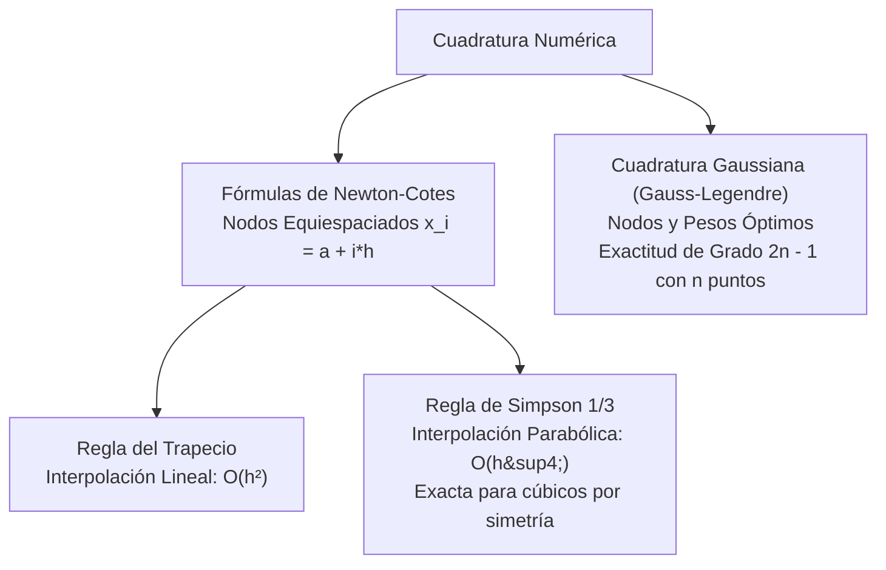
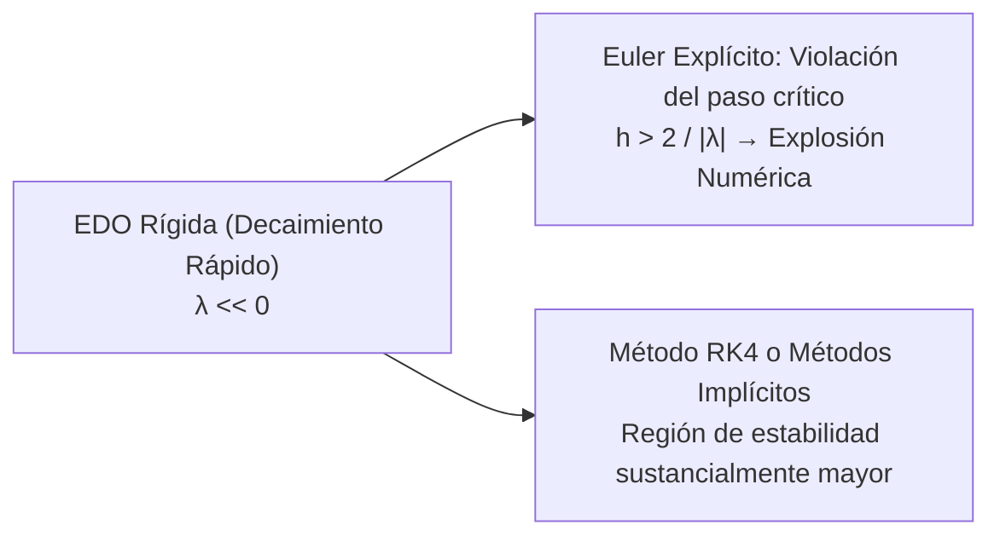
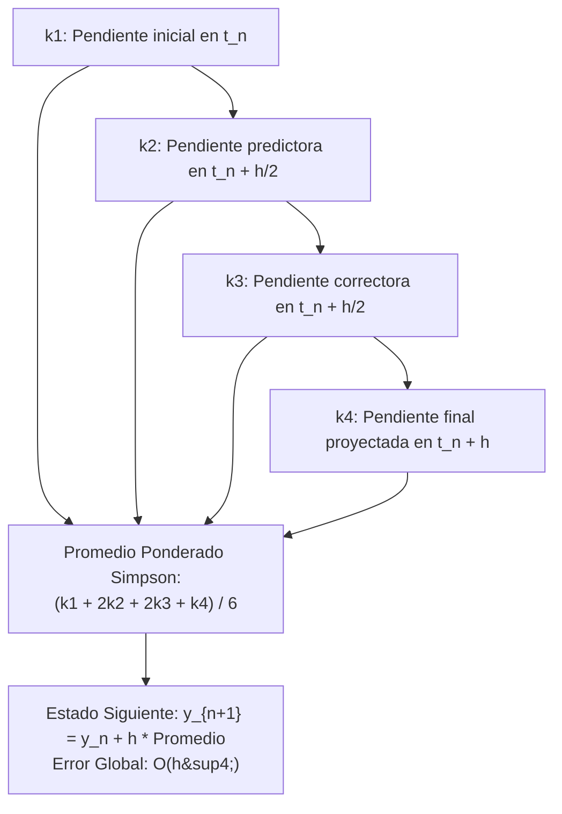
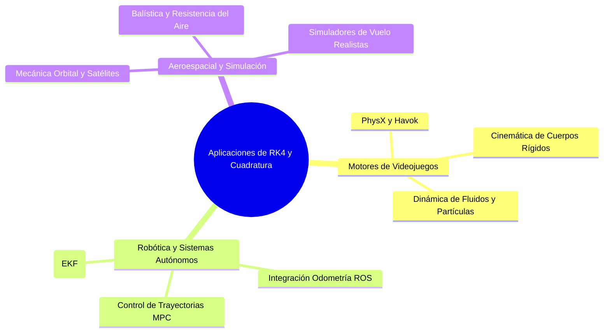
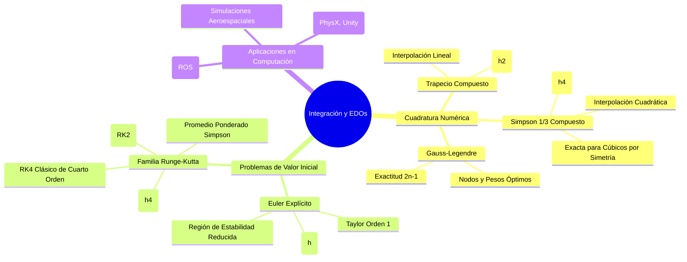

# Métodos Numéricos para Integración y Ecuaciones Diferenciales Ordinarias (EDO)

> [!abstract] Visión de la Cátedra de Computación Científica (EPN)
> En la modelación computacional de sistemas continuos del mundo real, la mayoría de integrales definidas y ecuaciones diferenciales que describen leyes físicas, dinámicas de tráfico de red o cinemática de robots no admiten una solución analítica en forma cerrada. La integración numérica (cuadratura) y los algoritmos para problemas de valor inicial (PVI) —especialmente la familia de **Runge-Kutta**— son los pilares algorítmicos que impulsan los motores de física para videojuegos (Unreal Engine, Unity, PhysX), la robótica autónoma y los simuladores de vuelo aeroespaciales.

> [!info] 💡 ¿Cómo entender esto desde cero? (Guía para novatos de pregrado)
> - **¿Cómo sabe un videojuego cómo cae una caja o vuela un cohete?** Las leyes de Newton nos dicen que la aceleración es la segunda derivada de la posición ($F = m \cdot a = m \cdot y''$). Eso es una Ecuación Diferencial Ordinaria (EDO).
> - **El problema:** No puedes resolver analíticamente la física de 100 objetos chocando en pantalla a 60 fotogramas por segundo.
> - **La solución numérica:**
>   - **Método de Euler:** Mira la velocidad actual y da un pasito en línea recta hacia adelante. Es muy simple pero acumula tanto error que los autos en un juego saldrían volando al espacio por inestabilidad.
>   - **Runge-Kutta 4 (RK4):** En lugar de dar un paso a ciegas, evalúa cuatro pendientes intermedias y saca un promedio ponderado inteligente. Es el **estándar de oro universal** en simulación física, robótica y gráficos por computadora porque casi no acumula error.

---

## 1. Integración Numérica: Fórmulas de Newton-Cotes

El problema general de la **cuadratura numérica** consiste en aproximar una integral definida sobre un intervalo compacto $[a, b]$:

$$I(f) = \int_a^b f(x) \, dx \approx \sum_{i=0}^n w_i f(x_i)$$

donde los $x_i$ son los nodos de cuadratura y los $w_i$ son sus respectivos pesos ponderados.



---

### 1.1. Regla del Trapecio

#### A. Trapecio Simple
Se aproxima la función integrando el polinomio interpolador lineal de Lagrange $P_1(x)$ que une $(a, f(a))$ y $(b, f(b))$. Con $h = b - a$:

$$I_{\text{Trap}} = \int_a^b \left[ f(a) \frac{b - x}{b - a} + f(b) \frac{x - a}{b - a} \right] dx = \frac{h}{2} \left[ f(a) + f(b) \right]$$

El error local de truncamiento por integración del residuo de Taylor es:
$$E_T^{\text{local}} = -\frac{h^3}{12} f''(\xi), \quad \xi \in (a, b)$$

#### B. Trapecio Compuesto
Dividiendo $[a, b]$ en $n$ subintervalos de paso uniforme $h = \frac{b - a}{n}$ con nodos $x_i = a + i h$:

$$\int_a^b f(x) \, dx = \frac{h}{2} \left[ f(x_0) + 2 \sum_{i=1}^{n-1} f(x_i) + f(x_n) \right] + E_T$$

> [!important] Deducción del Error Global de Truncamiento
> Sumando los errores locales en los $n$ subintervalos:
> $$E_T = -\sum_{i=1}^n \frac{h^3}{12} f''(\xi_i) = -\frac{h^3}{12} n \left( \frac{1}{n} \sum_{i=1}^n f''(\xi_i) \right)$$
> Por el Teorema del Valor Intermedio para sumas continuas, existe $\mu \in (a, b)$ tal que $\frac{1}{n} \sum f''(\xi_i) = f''(\mu)$. Sustituyendo $n = \frac{b-a}{h}$:
> $$E_T = -\frac{(b - a) h^2}{12} f''(\mu) = \mathcal{O}(h^2)$$
> La regla del trapecio compuesto es un método de **orden 2**. Al reducir el paso a la mitad ($h/2$), el error se divide por 4.

---

### 1.2. Regla de Simpson 1/3

#### A. Simpson 1/3 Simple
Aproxima $f(x)$ mediante un polinomio de segundo orden (parábola) $P_2(x)$ que interpola tres nodos equiespaciados: $x_0 = a$, $x_1 = \frac{a+b}{2}$, $x_2 = b$, con $h = \frac{b-a}{2}$:

$$\int_{x_0}^{x_2} f(x) \, dx \approx \frac{h}{3} \left[ f(x_0) + 4 f(x_1) + f(x_2) \right]$$

#### B. Simpson 1/3 Compuesto
Requiere un número **par** de subintervalos $n$ ($n = 2m$):

$$\int_a^b f(x) \, dx = \frac{h}{3} \left[ f(x_0) + 4 \sum_{i=1, 3, 5}^{n-1} f(x_i) + 2 \sum_{j=2, 4, 6}^{n-2} f(x_j) + f(x_n) \right] + E_S$$

> [!tip] ¿Por qué Simpson es Exacta para Polinomios Cúbicos?
> Aunque Simpson 1/3 se deduce a partir de una parábola (grado 2), el método integra **exactamente polinomios de grado 3**.
> 
> *Demostración conceptual:* Expandiendo $f(x)$ en serie de Taylor simétrica alrededor del punto medio $x_1$:
> $$f(x_1 + t) = f(x_1) + f'(x_1)t + \frac{f''(x_1)}{2}t^2 + \frac{f'''(x_1)}{6}t^3 + \frac{f^{(4)}(x_1)}{24}t^4 + \dots$$
> Al integrar entre $-h$ y $+h$, todas las potencias impares ($t, t^3$) son funciones impares y su integral sobre el intervalo simétrico es **estrictamente cero**:
> $$\int_{-h}^h t^k dt = 0 \quad \forall k \in \{1, 3, 5, \dots\}$$
> Esto hace que el término de error de orden 3 se anule de forma idéntica, y el primer término no nulo del error dependa de la cuarta derivada:
> $$E_S = -\frac{(b - a) h^4}{180} f^{(4)}(\mu) = \mathcal{O}(h^4)$$
> Al reducir $h$ a la mitad, el error global disminuye por un factor de $2^4 = 16$.

---

### 1.3. Cuadratura Gaussiana (Gauss-Legendre)

A diferencia de Newton-Cotes, donde los nodos están fijos equiespaciados, la **Cuadratura de Gauss** libera tanto los nodos $t_i$ como los pesos $w_i$ como grados de libertad optimizables:

$$\int_{-1}^1 g(t) \, dt \approx \sum_{i=1}^n w_i g(t_i)$$

Con $n$ puntos de evaluación se tienen $2n$ parámetros libres ($n$ nodos y $n$ pesos). Por ende, se puede diseñar una fórmula que sea exacta para todo polinomio de grado hasta:

$$\text{Grado Máximo} = 2n - 1$$

- Los nodos $t_i \in (-1, 1)$ son las raíces exactas del **Polinomio de Legendre** de grado $n$, $P_n(t)$.
- Los pesos se obtienen integrando los polinomios base de Lagrange: $w_i = \int_{-1}^1 L_i(t) \, dt$.

#### Cambio de Intervalo General $[a, b]$ a $[-1, 1]$
Mediante la transformación afín biyectiva:
$$x(t) = \frac{b - a}{2} t + \frac{a + b}{2} \implies dx = \frac{b - a}{2} dt$$
$$\int_a^b f(x) \, dx = \frac{b - a}{2} \int_{-1}^1 f\left( \frac{b - a}{2} t + \frac{a + b}{2} \right) dt$$

*Ejemplo para $n = 2$ puntos:*
Nodos: $t_1 = -\frac{1}{\sqrt{3}}, \; t_2 = \frac{1}{\sqrt{3}}$. Pesos: $w_1 = 1, \; w_2 = 1$. Exacta para cualquier polinomio hasta grado $2(2)-1 = 3$ evaluando solo $2$ puntos.

---

## 2. Solución Numérica de Problemas de Valor Inicial (PVI)

Sea el problema de valor inicial de una EDO de primer orden:

$$\frac{dy}{dt} = f(t, y), \qquad y(t_0) = y_0$$

Se busca aproximar los valores $y_n \approx y(t_n)$ sobre una malla temporal discreta $t_n = t_0 + n h$.

---

### 2.1. Método de Euler (Explícito)

#### Deducción Formal por Serie de Taylor
Expandiendo la solución exacta $y(t)$ alrededor de $t_n$:

$$y(t_{n+1}) = y(t_n + h) = y(t_n) + h y'(t_n) + \frac{h^2}{2} y''(\xi_n), \quad \xi_n \in (t_n, t_{n+1})$$

Dado que $y'(t_n) = f(t_n, y(t_n))$, truncando los términos de orden dos y superiores:

$$y_{n+1} = y_n + h f(t_n, y_n)$$

- **Error Local de Truncamiento (LTE):** $\mathcal{O}(h^2)$ por paso.
- **Error Global Acumulado (GTE):** Como se realizan $N = \frac{T - t_0}{h}$ pasos, el error global acumulado es:
  $$\text{GTE} \sim N \times \text{LTE} = \frac{T - t_0}{h} \mathcal{O}(h^2) = \mathcal{O}(h)$$
  Euler es un método de **primer orden**.

---

### 2.2. Análisis de Estabilidad Absoluta y Ecuaciones Rígidas (*Stiffness*)

Para evaluar si los errores de redondeo y truncamiento se disipan o crecen exponencialmente, se aplica la **Ecuación de Prueba de Dahlquist**:

$$y' = \lambda y, \quad \lambda \in \mathbb{C}, \quad \text{Re}(\lambda) < 0$$

cuya solución analítica $y(t) = y_0 e^{\lambda t} \to 0$ decae asintóticamente a cero cuando $t \to \infty$.

Aplicando el Método de Euler:
$$y_{n+1} = y_n + h (\lambda y_n) = (1 + h\lambda) y_n$$

El factor de amplificación es $R(z) = 1 + z$, donde $z = h\lambda \in \mathbb{C}$.

> [!danger] Condición de Estabilidad de Euler
> Para que las perturbaciones no diverjan ($|y_n| \to 0$), se exige que el factor de amplificación sea contractivo:
> $$|R(z)| = |1 + h\lambda| \le 1$$
> Esto define en el plano complejo un **círculo de radio 1 centrado en $(-1, 0)$**.
> 
> *Consecuencia para sistemas rígidos (Stiff Systems):*
> Si $\lambda \in \mathbb{R}$ es negativo y de gran magnitud (ej. $\lambda = -1000$, como en circuitos RC o reacciones químicas rápidas):
> $$|1 - 1000 h| \le 1 \implies -1 \le 1 - 1000 h \le 1 \implies h \le \frac{2}{1000} = 0.002$$
> Si $h > 0.002$, **la simulación explota hacia el infinito**, aunque la solución física real sea suave y decreciente.



---

## 3. Familia de Métodos de Runge-Kutta

Los métodos de Runge-Kutta logran la precisión de las series de Taylor de orden superior evaluando la función derivada $f(t, y)$ en puntos intermedios calculados astutamente, sin requerir derivar analíticamente $f(t, y)$.

### 3.1. Métodos RK2 (Segundo Orden)

- **Método del Punto Medio (Midpoint):**
  $$k_1 = f(t_n, y_n)$$
  $$k_2 = f\left(t_n + \frac{h}{2}, \; y_n + \frac{h}{2} k_1\right)$$
  $$y_{n+1} = y_n + h k_2$$

- **Método de Heun (Euler Mejorado):**
  $$k_1 = f(t_n, y_n)$$
  $$k_2 = f(t_n + h, \; y_n + h k_1)$$
  $$y_{n+1} = y_n + \frac{h}{2}(k_1 + k_2)$$
  Ambos poseen error global $\mathcal{O}(h^2)$.

---

### 3.2. Método Clásico RK4 de Cuarto Orden

El algoritmo RK4 es el caballo de batalla de la computación científica. Computa cuatro pendientes ponderadas en cada paso temporal:

$$\begin{aligned}
k_1 &= f(t_n, y_n) && \text{[Pendiente al inicio del intervalo]} \\
k_2 &= f\left(t_n + \frac{h}{2}, \; y_n + \frac{h}{2} k_1\right) && \text{[Pendiente en el punto medio usando } k_1\text{]} \\
k_3 &= f\left(t_n + \frac{h}{2}, \; y_n + \frac{h}{2} k_2\right) && \text{[Pendiente en el punto medio usando } k_2\text{]} \\
k_4 &= f(t_n + h, \; y_n + h k_3) && \text{[Pendiente al final del intervalo usando } k_3\text{]}
\end{aligned}$$

La actualización del estado pondera las pendientes según la regla de Simpson:

$$y_{n+1} = y_n + \frac{h}{6}\left( k_1 + 2 k_2 + 2 k_3 + k_4 \right)$$



#### Propiedades Matemáticas de RK4
- **Error Local de Truncamiento:** $\mathcal{O}(h^5)$.
- **Error Global Acumulado:** $\mathcal{O}(h^4)$.
- **Polinomio de Estabilidad:**
  $$R(z) = 1 + z + \frac{z^2}{2} + \frac{z^3}{6} + \frac{z^4}{24}$$
  La región de estabilidad absoluta $\{z \in \mathbb{C} : |R(z)| \le 1\}$ intersecta el eje real negativo hasta $z \approx -2.785$ e incluye una porción significativa del eje imaginario $[-2\sqrt{2}i, 2\sqrt{2}i]$, permitiendo integrar sistemas oscilatorios no disipativos sin amplificación espuria.

---

## 4. Aplicaciones en la Industria del Software y Computación



1. **Motores de Física en Videojuegos ([[computacion grafica]]):** Integración numérica de leyes de Newton para colisiones, telas elásticas y cinemática en tiempo real con pasos variables adaptativos (Runge-Kutta-Fehlberg RK45).
2. **Robótica Móvil (ROS):** Los modelos cinemáticos de robots no holonómicos (vehículos autónomos con dirección tipo Ackerman) integran la odometría mediante RK4 para evitar la deriva acumulativa severa inherente a Euler.
3. **Simulaciones Aeroespaciales:** Resolución de sistemas acoplados de 6 grados de libertad (6-DOF) sujetos a gravedad variable, empuje y resistencia atmosférica cuadrática no lineal.

---

## 5. Implementación Canónica en Python

A continuación se presenta un script modular que implementa las fórmulas de cuadratura compuesta y compara cuantitativamente la precisión de **Euler vs RK4** resolviendo la trayectoria de un proyectil con resistencia no lineal del aire:

```python
"""
Módulo de Cuadratura Numérica y Solución de EDOs
Departamento de Ciencias de la Computación - EPN
"""

from typing import Callable, Tuple, List
import numpy as np


# ==========================================
# 1. CUADRATURA NUMÉRICA (INTEGRACIÓN)
# ==========================================

def composite_trapezoidal(f: Callable[[float], float], a: float, b: float, n: int) -> float:
    """Regla del Trapecio Compuesta con n subintervalos (O(h^2))."""
    if n <= 0:
        raise ValueError("n debe ser un entero positivo.")
    h = (b - a) / n
    x = np.linspace(a, b, n + 1)
    y = np.array([f(xi) for xi in x])
    return (h / 2.0) * (y[0] + 2.0 * np.sum(y[1:-1]) + y[-1])


def composite_simpson13(f: Callable[[float], float], a: float, b: float, n: int) -> float:
    """Regla de Simpson 1/3 Compuesta (O(h^4)). Requiere n par."""
    if n % 2 != 0:
        raise ValueError("El número de intervalos n debe ser estrictamente PAR para Simpson 1/3.")
    h = (b - a) / n
    x = np.linspace(a, b, n + 1)
    y = np.array([f(xi) for xi in x])
    sum_odd = np.sum(y[1:-1:2])
    sum_even = np.sum(y[2:-1:2])
    return (h / 3.0) * (y[0] + 4.0 * sum_odd + 2.0 * sum_even + y[-1])


def gauss_legendre_quadrature(f: Callable[[float], float], a: float, b: float, n_points: int = 3) -> float:
    """Cuadratura de Gauss-Legendre de n_points (Exactitud de grado 2n - 1)."""
    # Raíces y pesos normalizados en [-1, 1]
    nodes, weights = np.polynomial.legendre.leggauss(n_points)
    # Transformación afín de variable a [a, b]
    mid = 0.5 * (b + a)
    half_len = 0.5 * (b - a)
    t_mapped = half_len * nodes + mid
    return half_len * np.sum(weights * np.array([f(ti) for ti in t_mapped]))


# ==========================================
# 2. SOLUCIONADORES DE EDOs PARA PVI
# ==========================================

def euler_method(f: Callable[[float, np.ndarray], np.ndarray], 
                 t0: float, y0: np.ndarray, t_end: float, h: float) -> Tuple[np.ndarray, np.ndarray]:
    """Método de Euler Explícito para sistemas de EDOs y' = f(t, y)."""
    t_vals = np.arange(t0, t_end + h/2.0, h)
    y_vals = np.zeros((len(t_vals), len(y0)))
    y_vals[0] = y0
    
    for i in range(len(t_vals) - 1):
        ti = t_vals[i]
        yi = y_vals[i]
        y_vals[i + 1] = yi + h * f(ti, yi)
        
    return t_vals, y_vals


def rk4_method(f: Callable[[float, np.ndarray], np.ndarray], 
               t0: float, y0: np.ndarray, t_end: float, h: float) -> Tuple[np.ndarray, np.ndarray]:
    """Método Clásico de Runge-Kutta de 4to Orden (RK4) para sistemas de EDOs."""
    t_vals = np.arange(t0, t_end + h/2.0, h)
    y_vals = np.zeros((len(t_vals), len(y0)))
    y_vals[0] = y0
    
    for i in range(len(t_vals) - 1):
        ti = t_vals[i]
        yi = y_vals[i]
        
        k1 = f(ti, yi)
        k2 = f(ti + 0.5 * h, yi + 0.5 * h * k1)
        k3 = f(ti + 0.5 * h, yi + 0.5 * h * k2)
        k4 = f(ti + h, yi + h * k3)
        
        y_vals[i + 1] = yi + (h / 6.0) * (k1 + 2.0 * k2 + 2.0 * k3 + k4)
        
    return t_vals, y_vals


# ==========================================
# 3. EXPERIMENTO DE VERIFICACIÓN COMPUTACIONAL
# ==========================================
if __name__ == "__main__":
    # Integración de f(x) = exp(-x^2) en [0, 1] (Integral del error)
    func = lambda x: np.exp(-x**2)
    analytical_approx = 0.746824132812427  # Valor de referencia con 15 cifras
    
    trap_res = composite_trapezoidal(func, 0.0, 1.0, 20)
    simp_res = composite_simpson13(func, 0.0, 1.0, 20)
    gauss_res = gauss_legendre_quadrature(func, 0.0, 1.0, 3)
    
    print("--- COMPARACIÓN DE MÉTODOS DE INTEGRACIÓN NUMÉRICA ---")
    print(f"Trapecio Compuesto (n=20) : {trap_res:.10f} | Error: {abs(trap_res - analytical_approx):.2e}")
    print(f"Simpson 1/3 Compuesto (n=20): {simp_res:.10f} | Error: {abs(simp_res - analytical_approx):.2e}")
    print(f"Gauss-Legendre (n=3 puntos) : {gauss_res:.10f} | Error: {abs(gauss_res - analytical_approx):.2e}\n")
    
    # Simulación de Oscilador Armónico Simple: y'' + y = 0 -> y(t) = cos(t)
    # Convertido a sistema de 1er orden:
    # y[0]' = y[1]
    # y[1]' = -y[0]
    harmonic_ode = lambda t, y: np.array([y[1], -y[0]])
    y_init = np.array([1.0, 0.0])  # y(0) = 1, y'(0) = 0
    t_end = 2.0 * np.pi  # Un ciclo completo
    step = 0.1
    
    t_eu, y_eu = euler_method(harmonic_ode, 0.0, y_init, t_end, step)
    t_rk, y_rk = rk4_method(harmonic_ode, 0.0, y_init, t_end, step)
    
    exact_end = np.cos(t_end)  # cos(2*pi) = 1.0
    print("--- COMPARACIÓN EULER VS RK4 (Oscilador Armónico en t = 2*pi) ---")
    print(f"Valor Exacto : {exact_end:.10f}")
    print(f"Euler (h=0.1): {y_eu[-1, 0]:.10f} | Error: {abs(y_eu[-1, 0] - exact_end):.2e}")
    print(f"RK4   (h=0.1): {y_rk[-1, 0]:.10f} | Error: {abs(y_rk[-1, 0] - exact_end):.2e}")
```

---

## 6. Síntesis y Enlaces Cruzados



### Navegación del Programa
- Fundamentos de probabilidad: [[Probabilidad y Variables Aleatorias]]
- Inferencia y contrastes: [[Teoremas Limite e Inferencia Estadistica (MLE y Contraste de Hipotesis)]]
- Raíces e interpolación: [[Metodos Numericos para Ecuaciones No Lineales e Interpolacion]]