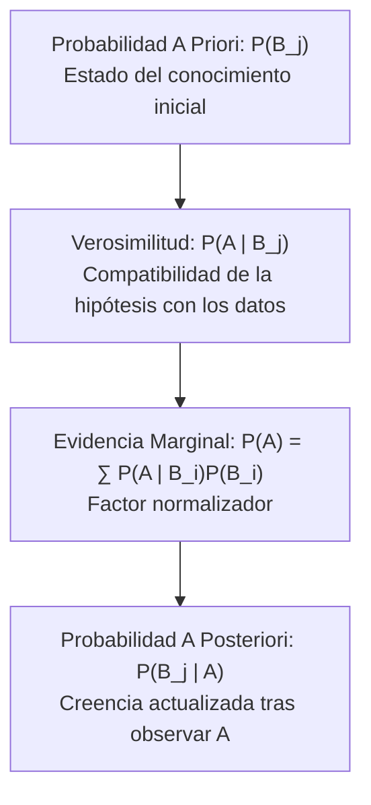
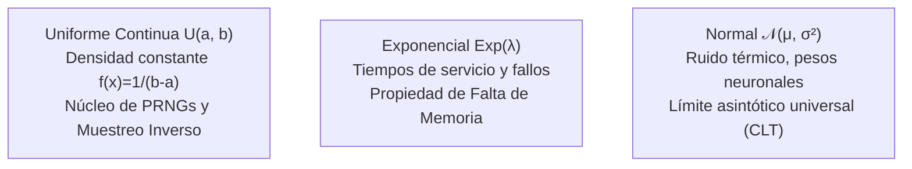
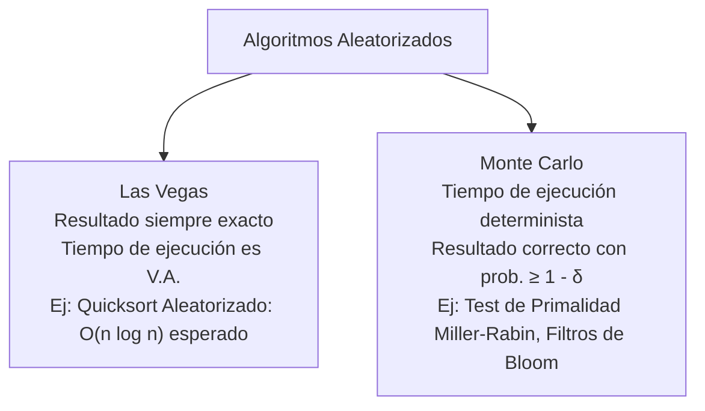
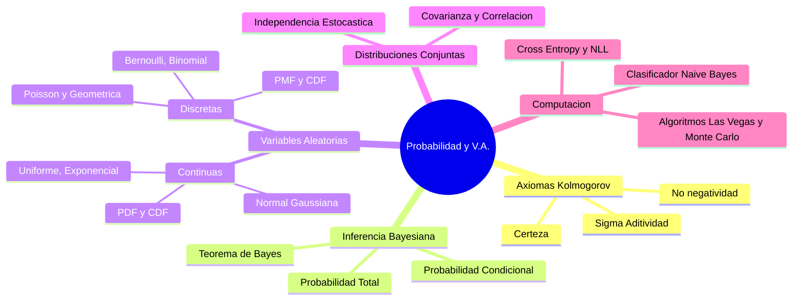

# Probabilidad y Variables Aleatorias: Fundamentos Matemáticos y Aplicaciones en Computación

> [!abstract] Contexto Académico y Epistemológico
> En la formación del Ingeniero en Ciencias de la Computación de la Escuela Politécnica Nacional (EPN), el cálculo de probabilidades trasciende el conteo combinatorio para erigirse como el **lenguaje formal del modelado bajo incertidumbre**. La computación moderna —desde el análisis de tráfico en redes y algoritmos aleatorizados hasta el aprendizaje automático profundo ([[machine learning]]) y la criptografía— opera sobre espacios estocásticos donde las decisiones se rigen por la teoría de la medida y la inferencia bayesiana.

> [!info] 💡 ¿Cómo entender esto desde cero? (Guía para novatos de pregrado)
> - **¿Por qué la informática no es 100% determinista?** Si solo programáramos algoritmos simples, todo sería blanco o negro. Pero en los sistemas reales, los paquetes de red se demoran según el tráfico, los discos duros fallan impredeciblemente y los datos de los usuarios tienen ruido y errores.
> - **La Probabilidad no es adivinar:** Es la ciencia rigurosa de **medir numéricamente la incertidumbre** para tomar la decisión óptima bajo riesgo.
> - **Variables Aleatorias:** No son variables algebraicas comunes; son funciones que traducen sucesos del mundo real a números (por ejemplo: $X = 	ext{número de peticiones HTTP que recibe el servidor en un minuto}$).
> - **Distribuciones fundamentales:**
>   - **Poisson:** Modela colas de espera y llegadas de usuarios por segundo a una página web.
>   - **Exponencial:** Modela el tiempo exacto que pasará hasta que un componente electrónico falle.
>   - **Gaussiana (Normal):** La famosa campana donde la mayoría de cosas en la naturaleza y en los datos se concentran alrededor de un promedio.

---

## 1. Fundamentos Axiomáticos de la Teoría de la Probabilidad

La formulación rigurosa de la teoría de la probabilidad fue establecida en 1933 por el matemático soviético **Andrey Kolmogorov**, fundamentando el cálculo estocástico sobre la teoría de la medida.

### 1.1. El Espacio de Probabilidad $(\Omega, \mathcal{F}, P)$

Un experimento estocástico queda unívocamente determinado por una terna formal denominada **espacio de probabilidad** $(\Omega, \mathcal{F}, P)$:

1. **Espacio Muestral ($\Omega$):** El conjunto universal exhaustivo de todos los posibles resultados elementales $\omega \in \Omega$ del experimento.
2. **$\sigma$-Álgebra de Eventos ($\mathcal{F}$):** Una familia de subconjuntos de $\Omega$ que cumple con:
   - $\Omega \in \mathcal{F}$.
   - **Cerradura bajo complementos:** Si $A \in \mathcal{F} \implies A^c = \Omega \setminus A \in \mathcal{F}$.
   - **Cerradura bajo uniones contables:** Si $A_1, A_2, A_3, \dots \in \mathcal{F} \implies \bigcup_{i=1}^\infty A_i \in \mathcal{F}$.
3. **Medida de Probabilidad ($P$):** Una función con valor real $P: \mathcal{F} \to [0, 1]$ que asigna una cuantificación métrica a cada evento admisible.

### 1.2. Los Tres Axiomas de Kolmogorov

Toda medida de probabilidad $P$ sobre $(\Omega, \mathcal{F})$ debe satisfacer indefectiblemente los siguientes tres axiomas:

> [!important] Axiomas de Kolmogorov
> 1. **Axioma 1 (No Negatividad):** Para todo evento $A \in \mathcal{F}$,
>    $$P(A) \ge 0$$
> 2. **Axioma 2 (Certeza / Normalización):** La probabilidad del espacio muestral completo es unitaria:
>    $$P(\Omega) = 1$$
> 3. **Axioma 3 (Aditividad Contable o $\sigma$-aditividad):** Si $\{A_i\}_{i=1}^\infty$ es una sucesión de eventos mutuamente excluyentes dos a dos (disjuntos, es decir, $A_i \cap A_j = \emptyset$ para todo $i \ne j$), entonces:
>    $$P\left( \bigcup_{i=1}^\infty A_i \right) = \sum_{i=1}^\infty P(A_i)$$

### 1.3. Consecuencias y Teoremas Inmediatos

A partir de los axiomas se derivan analíticamente las siguientes propiedades cardinales:

- **Probabilidad del conjunto vacío:** $P(\emptyset) = 0$.
- **Regla del complemento:** Para cualquier $A \in \mathcal{F}$, $P(A^c) = 1 - P(A)$.
- **Monotonía estocástica:** Si $A \subseteq B \implies P(A) \le P(B)$.
- **Principio de Inclusión-Exclusión:** Para cualesquiera $A, B \in \mathcal{F}$:
  $$P(A \cup B) = P(A) + P(B) - P(A \cap B)$$
- **Subaditividad (Desigualdad de Boole):** Para cualquier secuencia $\{A_i\}$:
  $$P\left( \bigcup_{i=1}^n A_i \right) \le \sum_{i=1}^n P(A_i)$$

---

## 2. Probabilidad Condicional, Probabilidad Total y Teorema de Bayes

### 2.1. Definición Formal de Probabilidad Condicional

Sean $A, B \in \mathcal{F}$ dos eventos tales que $P(B) > 0$. La **probabilidad condicional** de $A$ dado que ha ocurrido el evento $B$ se define como:

$$P(A \mid B) \triangleq \frac{P(A \cap B)}{P(B)}$$

> [!note] Regla de la Cadena (Multiplicación Generalizada)
> Despejando la intersección y aplicando inducción matemática para $n$ eventos $A_1, A_2, \dots, A_n$:
> $$P(A_1 \cap A_2 \cap \dots \cap A_n) = P(A_1) P(A_2 \mid A_1) P(A_3 \mid A_1 \cap A_2) \dots P(A_n \mid \bigcap_{i=1}^{n-1} A_i)$$

### 2.2. Partición del Espacio y Regla de la Probabilidad Total

Una colección de eventos $\{B_1, B_2, \dots, B_k\}$ constituye una **partición** de $\Omega$ si:
1. $B_i \cap B_j = \emptyset$ para todo $i \ne j$ (mutuamente disjuntos).
2. $\bigcup_{i=1}^k B_i = \Omega$ (exhaustivos).
3. $P(B_i) > 0$ para todo $i \in \{1, \dots, k\}$.

Para cualquier evento arbitrario $A \in \mathcal{F}$, la **Regla de la Probabilidad Total** establece:

$$P(A) = \sum_{i=1}^k P(A \cap B_i) = \sum_{i=1}^k P(A \mid B_i) P(B_i)$$

### 2.3. El Teorema de Bayes Formal

El Teorema de Bayes invierte la relación de condicionamiento, permitiendo actualizar la creencia a priori $P(B_j)$ de una hipótesis causal ante la evidencia observada $A$:

$$P(B_j \mid A) = \frac{P(A \mid B_j) P(B_j)}{P(A)} = \frac{P(A \mid B_j) P(B_j)}{\sum_{i=1}^k P(A \mid B_i) P(B_i)}$$

---

## 3. Variables Aleatorias Discretas

Una **variable aleatoria (V.A.)** $X$ es una función medible que mapea elementos del espacio muestral al conjunto de los números reales:

$$X: \Omega \to \mathbb{R}$$

Una variable aleatoria es **discreta** si su rango o imagen $R_X = X(\Omega)$ es un conjunto finito o contablemente infinito.

### 3.1. Caracterización: PMF y CDF

1. **Función de Masa de Probabilidad (PMF - *Probability Mass Function*):**
   $$p_X(x) = P(X = x)$$
   Propiedades obligatorias:
   - $p_X(x) \ge 0 \quad \forall x \in R_X$
   - $\sum_{x \in R_X} p_X(x) = 1$

2. **Función de Distribución Acumulada (CDF - *Cumulative Distribution Function*):**
   $$F_X(x) = P(X \le x) = \sum_{t \le x} p_X(t)$$
   Propiedades: monótona no decreciente, continua por la derecha, $\lim_{x \to -\infty} F_X(x) = 0$, $\lim_{x \to \infty} F_X(x) = 1$.

### 3.2. Momentos Estadísticos: Esperanza y Varianza

- **Esperanza Matemática ($\mathbb{E}[X]$ o media $\mu_X$):**
  $$\mathbb{E}[X] \triangleq \sum_{x \in R_X} x \, p_X(x)$$
  *(Existe si y solo si $\sum_{x} |x| p_X(x) < \infty$)*.
  
  **Propiedad de Linealidad:** Para constantes $a, b \in \mathbb{R}$:
  $$\mathbb{E}[aX + b] = a\mathbb{E}[X] + b$$

- **Varianza ($\text{Var}(X)$ o $\sigma_X^2$):**
  $$\text{Var}(X) \triangleq \mathbb{E}\left[(X - \mu_X)^2\right] = \sum_{x \in R_X} (x - \mu_X)^2 p_X(x)$$
  **Fórmula computacional:**
  $$\text{Var}(X) = \mathbb{E}[X^2] - (\mathbb{E}[X])^2$$
  **Propiedad de escala:** $\text{Var}(aX + b) = a^2 \text{Var}(X)$.

---

### 3.3. Modelos Discretos Fundamentales

| Distribución | Parámetros | PMF $p_X(k)$ | Soporte $R_X$ | $\mathbb{E}[X]$ | $\text{Var}(X)$ | Aplicación Primaria en Computación |
| :--- | :--- | :--- | :--- | :--- | :--- | :--- |
| **Bernoulli** | $p \in [0, 1]$ | $p^k (1-p)^{1-k}$ | $\{0, 1\}$ | $p$ | $p(1-p)$ | Bit transmitido con error, predicción binaria ([[regresion logistica]]). |
| **Binomial** | $n \in \mathbb{N}, p \in [0,1]$ | $\binom{n}{k} p^k (1-p)^{n-k}$ | $\{0, 1, \dots, n\}$ | $np$ | $np(1-p)$ | Número de paquetes corrompidos en una ráfaga de $n$ tramas. |
| **Poisson** | $\lambda > 0$ | $\frac{\lambda^k e^{-\lambda}}{k!}$ | $\{0, 1, 2, \dots\}$ | $\lambda$ | $\lambda$ | Solicitudes entrantes por segundo a un servidor web ([[teoria de colas]], modelo M/M/1). |
| **Geométrica** | $p \in (0, 1]$ | $(1-p)^{k-1} p$ | $\{1, 2, 3, \dots\}$ | $\frac{1}{p}$ | $\frac{1-p}{p^2}$ | Intentos de retransmisión hasta establecer sincronización TCP SYN-ACK. |

> [!tip] La Distribución de Poisson como Límite de la Binomial
> Cuando $n \to \infty$ y $p \to 0$ tal que el producto $n p = \lambda$ se mantiene constante, la distribución Binomial converge asintóticamente a la distribución de Poisson:
> $$\lim_{n \to \infty} \binom{n}{k} \left(\frac{\lambda}{n}\right)^k \left(1 - \frac{\lambda}{n}\right)^{n-k} = \frac{\lambda^k e^{-\lambda}}{k!}$$
> Esta deducción sustenta por qué modelamos fallos raros de hardware o llegadas masivas de peticiones concurrentes como procesos de Poisson.

---

## 4. Variables Aleatorias Continuas

Una variable aleatoria $X$ es **continua** si existe una función integrable $f_X(x)$, denominada **Función de Densidad de Probabilidad (PDF - *Probability Density Function*)**, tal que para cualquier conjunto medible $B \subseteq \mathbb{R}$:

$$P(X \in B) = \int_B f_X(x) \, dx$$

### 4.1. Propiedades Fundamentales de la PDF y CDF

1. **No Negatividad:** $f_X(x) \ge 0 \quad \forall x \in \mathbb{R}$.
2. **Normalización Total:** $\int_{-\infty}^\infty f_X(x) \, dx = 1$.
3. **Probabilidad Puntual Nula:** Para cualquier $c \in \mathbb{R}$, $P(X = c) = \int_c^c f_X(x) \, dx = 0$.
4. **Relación Fundamental con la CDF:**
   $$F_X(x) = P(X \le x) = \int_{-\infty}^x f_X(t) \, dt \implies f_X(x) = \frac{d}{dx} F_X(x) \quad \text{(casi en todas partes)}$$
5. **Cálculo de Intervalos:**
   $$P(a \le X \le b) = F_X(b) - F_X(a) = \int_a^b f_X(x) \, dx$$

### 4.2. Momentos Continuos

$$\mathbb{E}[X] \triangleq \int_{-\infty}^\infty x f_X(x) \, dx$$
$$\text{Var}(X) \triangleq \int_{-\infty}^\infty (x - \mu_X)^2 f_X(x) \, dx = \mathbb{E}[X^2] - (\mathbb{E}[X])^2$$

---

### 4.3. Modelos Continuos Clave en Ciencias de la Computación

#### A. Distribución Uniforme Continua: $\mathcal{U}(a, b)$
- **PDF:** $f_X(x) = \frac{1}{b-a}$ para $x \in [a, b]$; $0$ en otro caso.
- **$\mathbb{E}[X] = \frac{a+b}{2}$, $\text{Var}(X) = \frac{(b-a)^2}{12}$.**
- **Relevancia computacional:** Generación de números pseudoaleatorios (PRNG) y método de la transformación inversa para simulación de Monte Carlo: si $U \sim \mathcal{U}(0, 1)$, entonces $X = F^{-1}(U)$ tiene distribución con CDF $F$.

#### B. Distribución Exponencial: $\text{Exp}(\lambda)$
- **PDF:** $f_X(x) = \lambda e^{-\lambda x}$ para $x \ge 0$; $0$ si $x < 0$.
- **CDF:** $F_X(x) = 1 - e^{-\lambda x}$ para $x \ge 0$.
- **$\mathbb{E}[X] = \frac{1}{\lambda}$, $\text{Var}(X) = \frac{1}{\lambda^2}$.**
- **Modelado en Sistemas:** Tiempo transcurrido entre fallas consecutivas de un servidor (MTBF - *Mean Time Between Failures*).

> [!important] Demostración de la Propiedad de Pérdida de Memoria (*Memoryless Property*)
> Una variable aleatoria positiva continua $X$ satisface la pérdida de memoria si y solo si es Exponencial:
> $$P(X > t + s \mid X > t) = P(X > s) \quad \forall s, t > 0$$
> **Demostración:**
> $$P(X > t + s \mid X > t) = \frac{P(X > t + s \cap X > t)}{P(X > t)} = \frac{P(X > t + s)}{P(X > t)}$$
> Dado que $P(X > x) = 1 - F_X(x) = e^{-\lambda x}$:
> $$P(X > t + s \mid X > t) = \frac{e^{-\lambda(t+s)}}{e^{-\lambda t}} = \frac{e^{-\lambda t} e^{-\lambda s}}{e^{-\lambda t}} = e^{-\lambda s} = P(X > s) \quad \blacksquare$$
> *Implicación:* La probabilidad de que un chip falle en los próximos 10 minutos no depende de cuánto tiempo haya estado operando previamente.

#### C. Distribución Normal o Gaussiana: $\mathcal{N}(\mu, \sigma^2)$
- **PDF:**
  $$f_X(x) = \frac{1}{\sigma \sqrt{2\pi}} \exp\left( -\frac{(x - \mu)^2}{2\sigma^2} \right), \quad x \in \mathbb{R}$$
- **Parámetros:** Media $\mu \in \mathbb{R}$, Desviación estándar $\sigma > 0$.
- **Estandarización $Z$:** Si $X \sim \mathcal{N}(\mu, \sigma^2)$, entonces $Z = \frac{X - \mu}{\sigma} \sim \mathcal{N}(0, 1)$, con PDF canónica $\phi(z) = \frac{1}{\sqrt{2\pi}} e^{-z^2/2}$.
- **Regla Empírica 68-95-99.7:**
  - $P(\mu - \sigma \le X \le \mu + \sigma) \approx 0.6827$
  - $P(\mu - 2\sigma \le X \le \mu + 2\sigma) \approx 0.9545$
  - $P(\mu - 3\sigma \le X \le \mu + 3\sigma) \approx 0.9973$

---

## 5. Variables Aleatorias Conjuntas e Independencia Estocástica

Cuando dos o más variables aleatorias se miden simultáneamente sobre el mismo espacio de probabilidad $(\Omega, \mathcal{F}, P)$, se describe su comportamiento mediante distribuciones multivariadas.

### 5.1. Distribución Conjunta y Marginal

Para el caso continuo, la PDF conjunta $f_{X,Y}(x, y)$ satisface:
$$P((X, Y) \in A) = \iint_A f_{X,Y}(x, y) \, dx \, dy, \quad \iint_{\mathbb{R}^2} f_{X,Y}(x, y) \, dx \, dy = 1$$

Las **densidades marginales** se obtienen "integrando la variable no deseada":
$$f_X(x) = \int_{-\infty}^\infty f_{X,Y}(x, y) \, dy, \qquad f_Y(y) = \int_{-\infty}^\infty f_{X,Y}(x, y) \, dx$$

### 5.2. Independencia Estocástica

Dos variables aleatorias $X$ e $Y$ son **estocásticamente independientes** ($X \perp Y$) si y solo si su distribución conjunta factoriza como el producto de sus marginales:

$$\text{Caso Discreto:} \quad P(X = x, Y = y) = P(X = x) P(Y = y) \quad \forall x, y$$
$$\text{Caso Continuo:} \quad f_{X,Y}(x, y) = f_X(x) f_Y(y) \quad \forall x, y$$

### 5.3. Covarianza y Coeficiente de Correlación Lineal de Pearson

La **Covarianza** mide el grado de dependencia lineal entre dos variables:

$$\text{Cov}(X, Y) \triangleq \mathbb{E}\left[(X - \mu_X)(Y - \mu_Y)\right] = \mathbb{E}[XY] - \mathbb{E}[X]\mathbb{E}[Y]$$

El **Coeficiente de Correlación de Pearson ($\rho_{X,Y}$)** normaliza la covarianza en el intervalo $[-1, 1]$:

$$\rho_{X,Y} \triangleq \frac{\text{Cov}(X, Y)}{\sigma_X \sigma_Y} \in [-1, 1]$$

> [!warning] Distinción Teórica Crítica: Independencia vs No Correlación
> - Si $X$ e $Y$ son **independientes**, entonces $\mathbb{E}[XY] = \mathbb{E}[X]\mathbb{E}[Y]$, lo que implica $\text{Cov}(X, Y) = 0$ y $\rho_{X,Y} = 0$.
> - **El recíproco es FALSO en general:** Que $\rho_{X,Y} = 0$ (no correlacionadas) **NO** implica independencia estocástica, pues pueden existir relaciones funcionales no lineales perfectas.
>   *(Ejemplo clásico: $X \sim \mathcal{U}(-1, 1)$ y $Y = X^2$. Se tiene $\text{Cov}(X, Y) = 0$, pero $Y$ depende determinísticamente de $X$)*.
>   *Excepción notable:* Si el vector $(X, Y)$ sigue una distribución **Normal Bivariada**, entonces no correlación equivale rigurosamente a independencia.

---

## 6. Aplicaciones Cardinales en Ciencias de la Computación

### 6.1. Clasificador Bayesiano Ingenuo (*Naive Bayes*)

Dado un vector de características observadas $\mathbf{x} = (x_1, x_2, \dots, x_d)$ y un conjunto de clases discretas $C \in \{c_1, c_2, \dots, c_K\}$, el clasificador busca la clase que maximiza la probabilidad a posteriori (principio **MAP - *Maximum A Posteriori***):

$$\hat{y} = \arg\max_{c_k} P(C = c_k \mid \mathbf{x}) = \arg\max_{c_k} \frac{P(\mathbf{x} \mid C = c_k) P(C = c_k)}{P(\mathbf{x})}$$

Como el denominador $P(\mathbf{x})$ es invariante respecto a $c_k$:
$$\hat{y} = \arg\max_{c_k} P(\mathbf{x} \mid c_k) P(c_k)$$

#### El Supuesto "Ingenuo" (*Naive Assumption*)
Se asume que todas las características $x_i$ son **mutuamente independientes dada la clase** $c_k$:
$$P(\mathbf{x} \mid c_k) = \prod_{i=1}^d P(x_i \mid c_k)$$

Sustituyendo en la función objetivo y aplicando logaritmos para evitar subdesbordamiento aritmético (*arithmetic underflow*):

$$\hat{y} = \arg\max_{c_k} \left[ \ln P(c_k) + \sum_{i=1}^d \ln P(x_i \mid c_k) \right]$$

> [!tip] Suavizado de Laplace (*Additive Smoothing*)
> Si un atributo categórico nunca aparece en el conjunto de entrenamiento para la clase $c_k$, la probabilidad empírica sería cero, anulando todo el producto. Se introduce un hiperparámetro $\alpha \ge 1$:
> $$\hat{P}(x_i = v \mid c_k) = \frac{N_{v, c_k} + \alpha}{N_{c_k} + \alpha |V|}$$
> donde $|V|$ es la cardinalidad del vocabulario de atributos.

---

### 6.2. Funciones de Pérdida Probabilísticas en Redes Neuronales

En el aprendizaje supervisado probabilístico, el objetivo de una red neuronal es parametrizar una distribución condicional $P(Y \mid \mathbf{x}; \boldsymbol{\theta})$.

1. **Entropía Cruzada Categórica (*Categorical Cross-Entropy*):**
   Para una etiqueta observada codificada en *one-hot* $\mathbf{y} \in \{0, 1\}^K$ y la salida de la capa softmax $\hat{\mathbf{y}} = \text{softmax}(\mathbf{z})$, la pérdida por muestra es:
   $$\mathcal{L}_{CE}(\boldsymbol{\theta}) = -\sum_{k=1}^K y_k \ln \hat{y}_k$$

2. **Equivalencia Matemática con el Log-Likelihood Negativo (NLL):**
   Bajo el modelo multinomial, la verosimilitud de la muestra es $P(Y \mid \mathbf{x}) = \prod_{k=1}^K (\hat{y}_k)^{y_k}$. Aplicando logaritmo natural y signo negativo:
   $$-\ln P(Y \mid \mathbf{x}) = -\ln \left( \prod_{k=1}^K \hat{y}_k^{y_k} \right) = -\sum_{k=1}^K y_k \ln \hat{y}_k \equiv \mathcal{L}_{CE}$$
   Por ende, minimizar la entropía cruzada en [[redes neuronales]] equivale con total rigor a **maximizar la verosimilitud** del modelo estocástico subyacente.

---

### 6.3. Algoritmos Aleatorizados (*Randomized Algorithms*)

En la ingeniería de algoritmos avanzados, la aleatoriedad es un recurso computacional para reducir la complejidad temporal o espacial.

- **Quicksort Aleatorizado:** Al seleccionar el pivote de forma uniforme $U \sim \mathcal{U}\{1, n\}$, se destruye la posibilidad de que el peor caso $O(n^2)$ sea provocado por una entrada adversarial preordenada, garantizando un tiempo esperado de $\mathbb{E}[T(n)] = 2n \ln n + \mathcal{O}(n) = \Theta(n \log n)$.
- **Filtros de Bloom:** Estructura de datos probabilística basada en $k$ funciones hash independientes para verificar pertenencia a conjuntos con probabilidad de falsos positivos controlable:
  $$P(\text{Falso Positivo}) \approx \left( 1 - e^{-kn/m} \right)^k$$

---

## 7. Síntesis y Enlaces Cruzados

### Navegación del Programa
- Siguiente módulo teórico: [[Teoremas Limite e Inferencia Estadistica (MLE y Contraste de Hipotesis)]]
- Fundamentos de cálculo computacional: [[Metodos Numericos para Ecuaciones No Lineales e Interpolacion]]
- Modelado continuo dinámico: [[Metodos Numericos para Integracion y Ecuaciones Diferenciales Ordinarias (EDO)]]