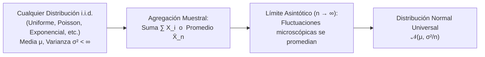
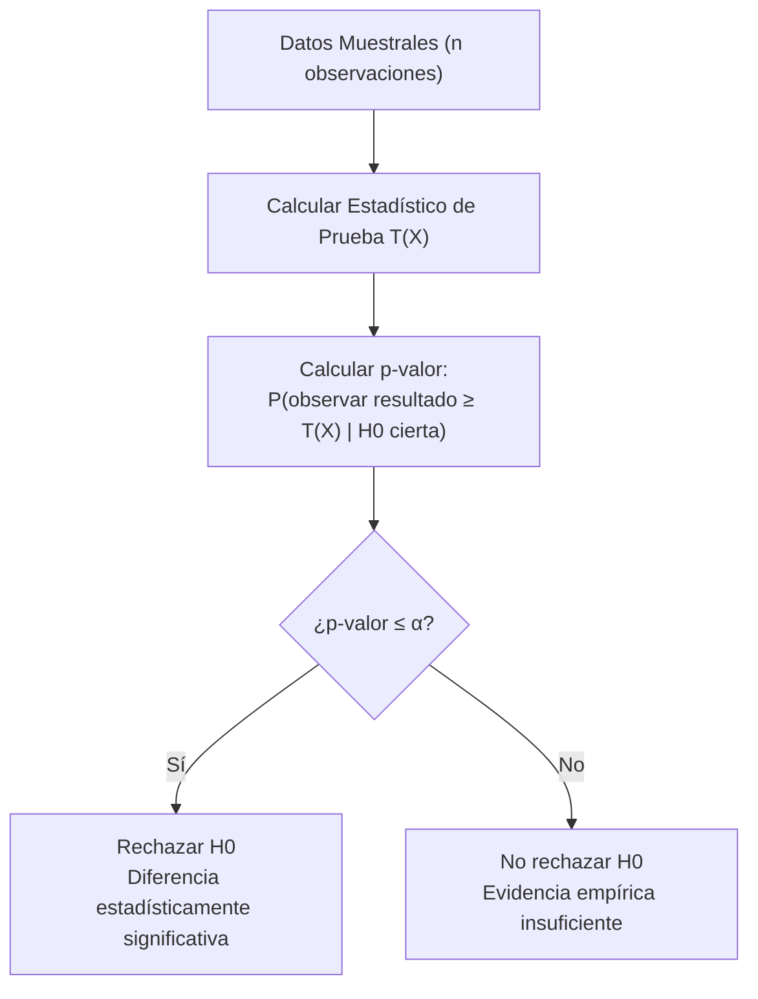
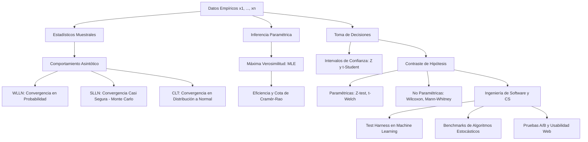

# Teoremas Límite e Inferencia Estadística: MLE, Intervalos y Contraste de Hipótesis

> [!abstract] Perspectiva del Departamento de Ciencias de la Computación (EPN)
> La inferencia estadística proporciona el marco axiomático para transformar observaciones empíricas finitas y ruidosas en conocimiento probabilístico generalizable. En la computación contemporánea, la inferencia estadística no es un ejercicio analítico estéril, sino el **motor matemático del aprendizaje supervisado** (estimación por máxima verosimilitud en [[redes neuronales]]), la validación experimental rigurosa de algoritmos mediante un [[test harness]], y la toma de decisiones empíricas en interfaces humano-computador vía [[pruebas de usabilidad]] y pruebas A/B.

> [!info] 💡 ¿Cómo entender esto desde cero? (Guía para novatos de pregrado)
> - **El gran problema de la Ciencia de Datos:** Casi nunca puedes analizar a todos los habitantes del planeta o a todos los clics que ocurrirán en la historia. Solo tienes una pequeña **muestra** de datos del pasado. ¿Cómo sacas conclusiones generales para el futuro sin equivocarte?
> - **Teorema Central del Límite (La magia estadística):** Sin importar qué forma loca tengan tus datos originales, si tomas suficientes muestras y promedias, ¡el promedio SIEMPRE se comportará como una curva Normal perfecta! Es lo que permite hacer predicciones confiables.
> - **Máxima Verosimilitud (MLE):** "¿Qué parámetros hacen que los datos que acabo de observar hayan sido lo más probables posible de ocurrir?". Es el motor matemático con el que se entrena la regresión logística y casi todo el Machine Learning.
> - **Contraste de Hipótesis y Pruebas A/B:** Si cambiaste el botón de tu aplicación a color verde y las ventas subieron un 2%, ¿fue por el color o fue pura casualidad? El contraste de hipótesis te da la prueba matemática irrefutable con un $p$-valor.

---

## 1. Desigualdades Fundamentales y Leyes de los Grandes Números

Antes de analizar la convergencia en el límite, es imperativo contar con cotas probabilísticas no paramétricas que acoten la probabilidad de eventos extremos sin asumir distribuciones específicas.

### 1.1. Desigualdad de Markov y Desigualdad de Chebyshev

> [!important] Desigualdad de Markov
> Sea $Y$ una variable aleatoria no negativa ($Y \ge 0$) con esperanza finita $\mathbb{E}[Y] < \infty$. Para cualquier constante $a > 0$:
> $$P(Y \ge a) \le \frac{\mathbb{E}[Y]}{a}$$
> **Demostración:**
> $$\mathbb{E}[Y] = \int_0^\infty y f_Y(y) dy = \int_0^a y f_Y(y) dy + \int_a^\infty y f_Y(y) dy \ge \int_a^\infty y f_Y(y) dy \ge a \int_a^\infty f_Y(y) dy = a P(Y \ge a) \quad \blacksquare$$

> [!important] Desigualdad de Chebyshev
> Sea $X$ una variable aleatoria con media finita $\mu$ y varianza finita $\sigma^2$. Aplicando Markov sobre la variable no negativa $Y = (X - \mu)^2$ con $a = \epsilon^2 > 0$:
> $$P\left(|X - \mu| \ge \epsilon\right) = P\left((X - \mu)^2 \ge \epsilon^2\right) \le \frac{\mathbb{E}[(X - \mu)^2]}{\epsilon^2} = \frac{\sigma^2}{\epsilon^2}$$
> Expresada en múltiplos de desviación estándar ($\epsilon = k\sigma$ con $k > 0$):
> $$P\left(|X - \mu| \ge k\sigma\right) \le \frac{1}{k^2}$$

---

### 1.2. Leyes de los Grandes Números (LLN)

Sea $\{X_1, X_2, \dots, X_n\}$ una sucesión de variables aleatorias independientes e idénticamente distribuidas (**i.i.d.**) con media $\mathbb{E}[X_i] = \mu$ y varianza $\text{Var}(X_i) = \sigma^2 < \infty$. Se define la **media muestral** como:

$$\bar{X}_n = \frac{1}{n} \sum_{i=1}^n X_i$$

Nótese que $\mathbb{E}[\bar{X}_n] = \mu$ y $\text{Var}(\bar{X}_n) = \frac{\sigma^2}{n}$.

#### A. Ley Débil de los Grandes Números (WLLN - *Weak Law*)
Establece la **convergencia en probabilidad** ($\bar{X}_n \xrightarrow{P} \mu$): para cualquier $\epsilon > 0$ arbitrariamente pequeño:

$$\lim_{n \to \infty} P\left( |\bar{X}_n - \mu| \ge \epsilon \right) = 0$$

*Demostración analítica:* Aplicando la desigualdad de Chebyshev sobre $\bar{X}_n$:
$$P\left( |\bar{X}_n - \mu| \ge \epsilon \right) \le \frac{\text{Var}(\bar{X}_n)}{\epsilon^2} = \frac{\sigma^2}{n \epsilon^2}$$
Al tomar el límite cuando $n \to \infty$, el término tiende asintóticamente a $0$. $\blacksquare$

#### B. Ley Fuerte de los Grandes Números (SLLN - *Strong Law*)
Establece la **convergencia casi segura** (con probabilidad $1$, $\bar{X}_n \xrightarrow{a.s.} \mu$):

$$P\left( \lim_{n \to \infty} \bar{X}_n = \mu \right) = 1$$

> [!tip] Significado en Computación
> La SLLN garantiza teóricamente que las simulaciones de **Monte Carlo** convergen determinísticamente al valor real esperado a medida que se aumenta el número de iteraciones o muestras computadas.

---

## 2. El Teorema Central del Límite (CLT de Lindeberg-Lévy)

El Teorema Central del Límite es la piedra angular de la estadística paramétrica y explica por qué la distribución Normal domina los fenómenos naturales y computacionales.

> [!important] Teorema Central del Límite (Lindeberg-Lévy)
> Sean $X_1, X_2, \dots, X_n$ variables aleatorias i.i.d. con $\mathbb{E}[X_i] = \mu$ y $0 < \text{Var}(X_i) = \sigma^2 < \infty$. A medida que el tamaño muestral $n \to \infty$, la variable aleatoria estandarizada $Z_n$ **converge en distribución** a una normal estándar:
> $$Z_n = \frac{\bar{X}_n - \mu}{\sigma / \sqrt{n}} = \frac{\sum_{i=1}^n X_i - n\mu}{\sigma \sqrt{n}} \xrightarrow{d} \mathcal{N}(0, 1)$$
> Equivalente en términos de la distribución acumulada $\Phi(z)$:
> $$\lim_{n \to \infty} P(Z_n \le z) = \Phi(z) = \frac{1}{\sqrt{2\pi}} \int_{-\infty}^z e^{-t^2/2} dt$$

### 2.1. Bosquejo de Demostración vía Funciones Generadoras de Momentos (MGF)

Asumiendo que la MGF de $(X_i - \mu)$ existe y es denotada por $M(t)$:
1. La variable centrada $Y_i = \frac{X_i - \mu}{\sigma}$ tiene media $0$ y varianza $1$. Su expansión en serie de Taylor alrededor de $t = 0$ es:
   $$M_{Y}(t) = 1 + \mathbb{E}[Y] t + \frac{\mathbb{E}[Y^2]}{2!} t^2 + o(t^2) = 1 + 0 + \frac{t^2}{2} + o(t^2)$$
2. La variable $Z_n = \frac{1}{\sqrt{n}} \sum_{i=1}^n Y_i$ posee la MGF conjunta por independencia:
   $$M_{Z_n}(t) = \left[ M_Y\left( \frac{t}{\sqrt{n}} \right) \right]^n = \left[ 1 + \frac{t^2}{2n} + o\left(\frac{t^2}{n}\right) \right]^n$$
3. Tomando el límite fundamental $\lim_{n \to \infty} (1 + \frac{a}{n})^n = e^a$:
   $$\lim_{n \to \infty} M_{Z_n}(t) = e^{t^2 / 2}$$
   La función $e^{t^2/2}$ corresponde de manera única y biyectiva a la MGF de una variable aleatoria $\mathcal{N}(0, 1)$. Por el Teorema de Continuidad de Lévy, $Z_n \xrightarrow{d} \mathcal{N}(0, 1)$. $\blacksquare$

---

## 3. Estimación Puntual y Máxima Verosimilitud (MLE)

Dado un conjunto de datos observados $\mathbf{x} = (x_1, x_2, \dots, x_n)$ provenientes de una distribución con densidad $f(x; \boldsymbol{\theta})$ indexada por un vector de parámetros desconocidos $\boldsymbol{\theta} \in \Theta$, el objetivo es inferir el estimador óptimo $\hat{\boldsymbol{\theta}}$.

### 3.1. Definición Formal de Verosimilitud y Log-Verosimilitud

Bajo el supuesto de observaciones i.i.d., la **Función de Verosimilitud** $L(\boldsymbol{\theta}; \mathbf{x})$ invierte la perspectiva: los datos son fijos y el parámetro varía:

$$L(\boldsymbol{\theta}; \mathbf{x}) \triangleq \prod_{i=1}^n f(x_i; \boldsymbol{\theta})$$

La **Función de Log-Verosimilitud** $\ell(\boldsymbol{\theta})$ es su transformación logarítmica monótona creciente:

$$\ell(\boldsymbol{\theta}) \triangleq \ln L(\boldsymbol{\theta}; \mathbf{x}) = \sum_{i=1}^n \ln f(x_i; \boldsymbol{\theta})$$

El estimador de máxima verosimilitud se define formalmente como:
$$\hat{\boldsymbol{\theta}}_{\text{MLE}} \triangleq \arg\max_{\boldsymbol{\theta} \in \Theta} \ell(\boldsymbol{\theta})$$

Condición de primer orden (ecuación de verosimilitud o *Score function*):
$$\nabla_{\boldsymbol{\theta}} \ell(\boldsymbol{\theta}) = \mathbf{0}$$
Condición de segundo orden: la matriz Hessiana $H(\hat{\boldsymbol{\theta}}) = \nabla^2 \ell(\hat{\boldsymbol{\theta}})$ debe ser **definida negativa**.

---

### 3.2. Deducción Completa: Parámetro $p$ de una Distribución Bernoulli

Sea $X_i \sim \text{Bernoulli}(p)$ con $x_i \in \{0, 1\}$. La PMF es $f(x_i; p) = p^{x_i} (1-p)^{1-x_i}$.

1. **Verosimilitud:**
   $$L(p; \mathbf{x}) = \prod_{i=1}^n p^{x_i} (1-p)^{1-x_i} = p^{\sum x_i} (1-p)^{n - \sum x_i}$$
2. **Log-Verosimilitud:**
   $$\ell(p) = \left( \sum_{i=1}^n x_i \right) \ln p + \left( n - \sum_{i=1}^n x_i \right) \ln (1-p)$$
3. **Derivación e igualación a cero:**
   $$\frac{d\ell(p)}{dp} = \frac{\sum x_i}{p} - \frac{n - \sum x_i}{1 - p} = 0$$
   $$(1-p)\sum x_i = p(n - \sum x_i) \implies \sum x_i - p\sum x_i = n p - p\sum x_i \implies \sum x_i = n p$$
   $$\hat{p}_{\text{MLE}} = \frac{1}{n} \sum_{i=1}^n x_i = \bar{X}$$
4. **Verificación de Máximo (Concavidad):**
   $$\frac{d^2\ell(p)}{dp^2} = -\frac{\sum x_i}{p^2} - \frac{n - \sum x_i}{(1-p)^2} < 0 \quad \forall p \in (0, 1) \implies \text{Máximo global estricto.}$$

> [!note] Conexión con Regresión Logística
> En la clasificación binaria supervisada, el parámetro $p_i$ se modela mediante la función sigmoide evaluada en una combinación lineal de entradas: $p_i = \sigma(\mathbf{w}^T \mathbf{x}_i) = \frac{1}{1 + e^{-\mathbf{w}^T \mathbf{x}_i}}$. El algoritmo de entrenamiento es precisamente el cálculo de $\hat{\mathbf{w}}_{\text{MLE}}$ maximizando esta log-verosimilitud mediante descenso de gradiente.

---

### 3.3. Deducción Completa: Normal Multivariante / Unidimensional $\mathcal{N}(\mu, \sigma^2)$

Sea $X_i \sim \mathcal{N}(\mu, \sigma^2)$. Con $\boldsymbol{\theta} = (\mu, \sigma^2)$:

$$\ell(\mu, \sigma^2) = \sum_{i=1}^n \ln \left[ \frac{1}{\sqrt{2\pi \sigma^2}} \exp\left( -\frac{(x_i - \mu)^2}{2\sigma^2} \right) \right] = -\frac{n}{2}\ln(2\pi) - \frac{n}{2}\ln(\sigma^2) - \frac{1}{2\sigma^2} \sum_{i=1}^n (x_i - \mu)^2$$

1. **Derivada respecto a $\mu$:**
   $$\frac{\partial \ell}{\partial \mu} = \frac{1}{\sigma^2} \sum_{i=1}^n (x_i - \mu) = 0 \implies \sum_{i=1}^n x_i - n\mu = 0 \implies \hat{\mu}_{\text{MLE}} = \frac{1}{n} \sum_{i=1}^n x_i = \bar{X}$$
2. **Derivada respecto a $\sigma^2$:**
   $$\frac{\partial \ell}{\partial \sigma^2} = -\frac{n}{2\sigma^2} + \frac{1}{2(\sigma^2)^2} \sum_{i=1}^n (x_i - \mu)^2 = 0 \implies \hat{\sigma}^2_{\text{MLE}} = \frac{1}{n} \sum_{i=1}^n (x_i - \bar{X})^2$$

> [!warning] El Sesgo del Estimador MLE de la Varianza
> Calculando la esperanza matemática del estimador:
> $$\mathbb{E}[\hat{\sigma}^2_{\text{MLE}}] = \frac{n-1}{n}\sigma^2 \ne \sigma^2$$
> El estimador MLE es **sesgado** para muestras finitas. Para obtener un estimador insesgado se aplica la **corrección de Bessel**, definiendo la cuasivarianza muestral:
> $$S^2 = \frac{1}{n - 1} \sum_{i=1}^n (x_i - \bar{X})^2 \implies \mathbb{E}[S^2] = \sigma^2$$

---

### 3.4. Matriz de Información de Fisher y Cota de Cramér-Rao (CRLB)

La **Información de Fisher** mide la cantidad de información que una muestra observable porta sobre el parámetro desconocido $\theta$:

$$I(\theta) \triangleq \mathbb{E}\left[ \left( \frac{\partial \ln f(X; \theta)}{\partial \theta} \right)^2 \right] = -\mathbb{E}\left[ \frac{\partial^2 \ln f(X; \theta)}{\partial \theta^2} \right]$$

Para una muestra i.i.d. de tamaño $n$, la información total es $I_n(\theta) = n I(\theta)$.

> [!important] Cota Inferior de Cramér-Rao (CRLB)
> Sea $\hat{\theta}$ cualquier estimador insesgado de $\theta$ ($\mathbb{E}[\hat{\theta}] = \theta$). Entonces, su varianza está acotada inferiormente por el recíproco de la Información de Fisher:
> $$\text{Var}(\hat{\theta}) \ge \frac{1}{n I(\theta)}$$
> Un estimador cuya varianza alcanza esta cota se denomina **estimador eficiente** o UMVUE (*Uniformly Minimum Variance Unbiased Estimator*). Los estimadores MLE son asintóticamente eficientes: $\lim_{n \to \infty} \sqrt{n}(\hat{\theta}_{\text{MLE}} - \theta) \xrightarrow{d} \mathcal{N}\left(0, \frac{1}{I(\theta)}\right)$.

---

## 4. Intervalos de Confianza y Contraste de Hipótesis

### 4.1. Intervalos de Confianza para la Media $\mu$

Un intervalo de confianza a nivel $(1 - \alpha)$ garantiza que el procedimiento aleatorio contendrá al verdadero parámetro con probabilidad $(1 - \alpha)$:

1. **Varianza poblacional $\sigma^2$ conocida (Distribución $Z$):**
   $$\text{IC}_{1-\alpha}(\mu) = \left[ \bar{X} - z_{\alpha/2} \frac{\sigma}{\sqrt{n}}, \; \bar{X} + z_{\alpha/2} \frac{\sigma}{\sqrt{n}} \right]$$
2. **Varianza $\sigma^2$ desconocida (Distribución $t$-Student con $n-1$ grados de libertad):**
   $$\text{IC}_{1-\alpha}(\mu) = \left[ \bar{X} - t_{\alpha/2, n-1} \frac{S}{\sqrt{n}}, \; \bar{X} + t_{\alpha/2, n-1} \frac{S}{\sqrt{n}} \right]$$

---

### 4.2. Estructura Formal del Contraste de Hipótesis

Se confrontan dos afirmaciones mutuamente excluyentes:
- **Hipótesis Nula ($H_0$):** Postula ausencia de efecto, igualdad o estado basal (ej. "el nuevo algoritmo de ordenamiento tiene igual tiempo de ejecución que el estándar").
- **Hipótesis Alternativa ($H_1$ o $H_a$):** Postula la presencia de un efecto, diferencia o mejora.

#### Errores de Decisión Estadística

| Decisión Tomada | Estado Real: $H_0$ es Verdadera | Estado Real: $H_0$ es Falsa ($H_1$ Verdadera) |
| :--- | :--- | :--- |
| **No Rechazar $H_0$** | Decisión Correcta (Probabilidad $1 - \alpha$) | **Error Tipo II ($\beta$)** *(Falso Negativo)* |
| **Rechazar $H_0$** | **Error Tipo I ($\alpha$)** *(Falso Positivo)* | Decisión Correcta: **Potencia ($1 - \beta$)** |

- **Nivel de Significancia ($\alpha$):** $\alpha = P(\text{Rechazar } H_0 \mid H_0 \text{ es verdadera})$. Usualmente $0.05$ o $0.01$.
- **Potencia de la Prueba ($1 - \beta$):** Capacidad del test para detectar diferencias genuinas cuando realmente existen.

---

### 4.3. Catálogo de Pruebas Estadísticas

#### A. Pruebas Paramétricas (Asumen Normalidad de los residuos)
1. **$Z$-test de dos muestras:** Para comparar medias cuando $n$ es grande ($n \ge 30$) o $\sigma$ es conocida:
   $$Z = \frac{(\bar{X}_1 - \bar{X}_2) - \Delta_0}{\sqrt{\frac{\sigma_1^2}{n_1} + \frac{\sigma_2^2}{n_2}}}$$
2. **$t$-Student para muestras independientes (Test de Welch):** Robusto ante varianzas no homogéneas ($\sigma_1^2 \ne \sigma_2^2$):
   $$t = \frac{\bar{X}_1 - \bar{X}_2}{\sqrt{\frac{S_1^2}{n_1} + \frac{S_2^2}{n_2}}}$$
3. **$t$-Student pareado:** Cuando las muestras son emparejadas (mismo benchmark ejecutado en dos versiones del software). Se opera sobre las diferencias $D_i = X_{1i} - X_{2i}$.

#### B. Pruebas No Paramétricas (Libres de distribución)
Indispensables en ciencias de la computación, donde los tiempos de respuesta de servidores y latencias de red exhiben colas pesadas (*heavy tails*) que violan severamente la normalidad:

1. **Test de Wilcoxon de Rangos con Signo (*Wilcoxon Signed-Rank Test*):** Alternativa no paramétrica al $t$-test pareado. Se calculan las diferencias, se ordenan sus valores absolutos por rangos y se suman los rangos positivos frente a negativos.
2. **Test $U$ de Mann-Whitney (Wilcoxon Rank-Sum):** Alternativa no paramétrica para dos grupos independientes. Evalúa la hipótesis nula de que es igualmente probable que una observación del grupo $A$ sea mayor que una del grupo $B$.

---

## 5. Aplicaciones Cardinales en Ciencias de la Computación

### 5.1. El Arnés de Pruebas de Machine Learning ([[test harness]])

Al comparar dos modelos de aprendizaje supervisado (por ejemplo, *Random Forest* vs *Deep Neural Network* en validación cruzada de 10 particiones, 10-fold CV):
- **La trampa del $t$-test estándar:** Las particiones de entrenamiento se solapan en un $90\%$, violando el supuesto de independencia i.i.d. de las observaciones.
- **Solución rigurosa:** Emplear la **corrección de Nadeau y Bengio** para el $t$-test pareado:
  $$S_{\text{corregido}} = S_D \sqrt{\frac{1}{K} + \frac{n_{\text{test}}}{n_{\text{train}}}}$$
  O bien utilizar la prueba no paramétrica de **Wilcoxon** sobre los rendimientos pareados en $N$ conjuntos de datos heterogéneos según la metodología estándar de Janez Demšar (2006).

---

### 5.2. Comparación Rigurosa de Algoritmos de Optimización

Al evaluar metaheurísticas estocásticas (Algoritmos Genéticos, Optimización por Enjambre de Partículas - PSO, Descenso de Gradiente Estocástico con *warm restarts*):
1. **Ejecuciones Múltiples:** Ejecutar un mínimo de $N \ge 30$ semillas aleatorias (*seeds*) independientes por cada algoritmo sobre las mismas funciones objetivo de benchmark.
2. **Test de Normalidad:** Aplicar la prueba de **Shapiro-Wilk** sobre la métrica de convergencia final.
3. **Selección del Test:**
   - Si los datos son gaussianos: Análisis de Varianza (**ANOVA**) + prueba post-hoc de Tukey HSD.
   - Si no son normales: Test de **Kruskal-Wallis** + prueba post-hoc de Conover-Iman con corrección de FDR.

---

### 5.3. Pruebas A/B en Interacción Humano-Computador ([[pruebas de usabilidad]])

Una prueba A/B mide el impacto de una modificación en la interfaz sobre una tasa de conversión o tiempo de tarea:
- **Hipótesis:** $H_0: p_B - p_A \le 0$ vs $H_1: p_B - p_A > 0$.
- **Cálculo del Tamaño Muestral Mínimo ($N$ por variante):**
  Para detectar un efecto mínimo detectable ($\delta = p_B - p_A$) con potencia $1 - \beta$ y nivel $\alpha$:
  $$N \approx \frac{\left( z_{\alpha/2}\sqrt{2\bar{p}(1-\bar{p})} + z_{\beta}\sqrt{p_A(1-p_A) + p_B(1-p_B)} \right)^2}{\delta^2}$$
- **Corrección por Múltiples Métricas:** Si se evalúan simultáneamente $M$ métricas de usabilidad (tiempo en sitio, clics, rebote, satisfacción), el riesgo de falso positivo conjunto se dispara ($1 - (1-\alpha)^M$). Se aplica el **Procedimiento de Benjamini-Hochberg** para controlar la tasa de falso descubrimiento (**FDR - *False Discovery Rate***).

---

## 6. Síntesis Teórica y Mapa Conceptual

### Navegación del Programa
- Fundamentos previos: [[Probabilidad y Variables Aleatorias]]
- Métodos computacionales para raíces e interpolación: [[Metodos Numericos para Ecuaciones No Lineales e Interpolacion]]
- Integración y sistemas dinámicos: [[Metodos Numericos para Integracion y Ecuaciones Diferenciales Ordinarias (EDO)]]