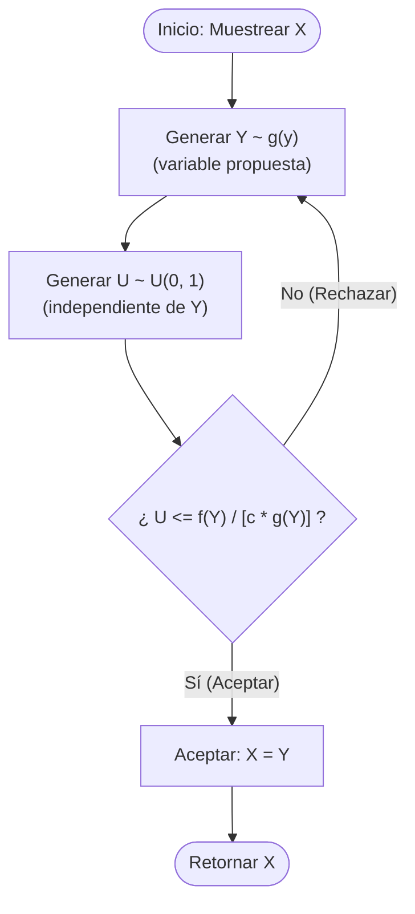
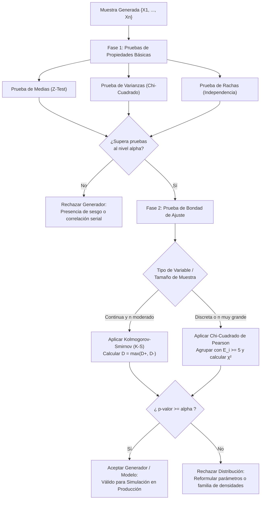

# Método de Monte Carlo y Generación de Números Pseudoaleatorios

> [!info] 💡 ¿Cómo entender esto desde cero? (Guía para novatos de pregrado)
> Imagina que dibujas un círculo perfecto dentro de una cartulina cuadrada de $1\,\text{m} \times 1\,\text{m}$. Si te pidieran calcular el área del círculo sin usar la fórmula $\pi r^2$ y sin regla, ¿cómo lo harías?
> 
> Una solución fascinante es vendarte los ojos y lanzar al azar 10 000 granos de arroz sobre la cartulina. Al final, cuentas cuántos granos cayeron dentro del círculo y cuántos cayeron en total sobre el cuadrado. La proporción $\frac{\text{granos dentro}}{\text{granos totales}}$ convergerá casi mágicamente hacia el área del círculo ($\pi / 4$). **Este es el Método de Monte Carlo**: resolver problemas matemáticos deterministas o probabilísticos extremadamente difíciles mediante muestreo estadístico masivo.
> 
> Sin embargo, surge una paradoja informática: una computadora digital es un autómata estrictamente determinista (dadas las mismas entradas y el mismo código, siempre produce la misma salida). ¿Cómo puede generar "azar"? No lo hace: fabrica **números pseudoaleatorios (PRNG)** mediante fórmulas aritméticas ultra-rápidas diseñadas para aparentar un caos perfecto. En este documento aprenderás la matemática rigurosa para generar variables aleatorias de cualquier tipo y las pruebas estadísticas de hipótesis para certificar que el generador no esté sesgado.

---

## 1. El Método de Monte Carlo

El término **Monte Carlo** fue acuñado durante el Proyecto Manhattan en Los Álamos por Stanislaw Ulam, John von Neumann y Nicholas Metropolis (haciendo alusión al célebre casino de Mónaco). Se formaliza como una clase amplia de algoritmos computacionales que emplean muestreo aleatorio repetido para obtener resultados numéricos aproximados ante problemas analíticamente intratables.

```
       [ Universo Paramétrico / Espacio de Muestreo Ω ]
  +---------------------------------------------------------+
  |    • X1                                                 |
  |             • X3           • X5                         |
  |     • X2                                                |
  |                        [ Región de Interés A ]          |
  |                     /--------------------\              |
  |                    /   • X4     • X7      \             |
  |                   |        • X6            |            |
  |                    \                      /             |
  |                     \--------------------/              |
  |         • X8                                            |
  +---------------------------------------------------------+
    Estimación: P(X ∈ A) ≈ N_dentro / N_total  (Convergencia O(1/√N))
```

---

### Fundamento Matemático Riguroso

El método descansa sobre dos pilares axiomáticos de la Teoría de la Probabilidad:

#### 1. La Ley Fuerte de los Grandes Números (SLLN)
Sea $X_1, X_2, \dots, X_N$ una sucesión de variables aleatorias independientes e idénticamente distribuidas (i.i.d.) muestreadas a partir de una densidad $p(\mathbf{x})$, y sea $f(\mathbf{x})$ una función integrable tal que $\mathbb{E}[|f(X)|] < \infty$.

> [!definition] Ley Fuerte de los Grandes Números (Kolmogorov)
> La media muestral converge de manera **casi segura** (*almost surely*) hacia la esperanza matemática teórica cuando el tamaño muestral tiende al infinito:
> $$\mathbb{P}\left(\lim_{N \to \infty} \frac{1}{N}\sum_{i=1}^N f(X_i) = \mathbb{E}[f(X)]\right) = 1$$

#### 2. El Teorema del Límite Central (CLT) y Error Asintótico
Si la varianza poblacional de $f(X)$ es finita ($\operatorname{Var}(f(X)) = \sigma^2 < \infty$), el estimador de Monte Carlo:
$$\hat{I}_N = \frac{1}{N}\sum_{i=1}^N f(X_i)$$
satisface la convergencia en distribución:
$$\sqrt{N} \left( \hat{I}_N - \mathbb{E}[f(X)] \right) \xrightarrow{d} \mathcal{N}(0, \sigma^2)$$

Esto demuestra formalmente que el **Error Estándar (*Standard Error*)** del estimador decrece con tasa asintótica:
$$\text{SE}(\hat{I}_N) = \frac{\sigma}{\sqrt{N}} = \mathcal{O}\left(\frac{1}{\sqrt{N}}\right)$$

> [!important] Intervalo de Confianza Asintótico de Monte Carlo
> Para un nivel de significancia $\alpha$, el intervalo de confianza al $(1 - \alpha) \cdot 100\%$ para la integral estimada viene dado por:
> $$\hat{I}_N \pm z_{1 - \alpha/2} \cdot \frac{S_N}{\sqrt{N}}$$
> donde $S_N^2 = \frac{1}{N-1}\sum_{i=1}^N (f(X_i) - \hat{I}_N)^2$ es la varianza muestral insesgada y $z_{1 - \alpha/2}$ es el cuantil correspondiente de la distribución Normal estándar $\mathcal{N}(0, 1)$ (por ejemplo, $1.96$ para el $95\%$).

---

### Estimación de Integrales Multidimensionales no Analíticas

Consideremos el cómputo de una integral definida multidimensional sobre un dominio cerrado $\Omega \subset \mathbb{R}^d$:
$$I = \int_{\Omega} f(\mathbf{x}) \, d\mathbf{x}$$

Multiplicando y dividiendo por el hipervolumen $\text{Vol}(\Omega) = \int_{\Omega} d\mathbf{x}$:
$$I = \text{Vol}(\Omega) \int_{\Omega} f(\mathbf{x}) \cdot \left(\frac{1}{\text{Vol}(\Omega)}\right) \, d\mathbf{x} = \text{Vol}(\Omega) \cdot \mathbb{E}_{\mathbf{X} \sim \mathcal{U}(\Omega)} [f(\mathbf{X})]$$

donde $\mathbf{X}$ es un vector aleatorio con distribución continua uniforme sobre $\Omega$. El estimador de Monte Carlo se formula como:
$$\hat{I}_N = \frac{\text{Vol}(\Omega)}{N} \sum_{i=1}^N f(\mathbf{X}_i), \quad \mathbf{X}_i \stackrel{\text{i.i.d.}}{\sim} \mathcal{U}(\Omega)$$

#### La "Maldición de la Dimensionalidad" (*Curse of Dimensionality*)

En el análisis numérico clásico, las fórmulas de cuadratura determinista (Newton-Cotes como el Trapecio o Simpson, o Gauss-Legendre) aproximan integrales discretizando el dominio mediante una malla o cuadrícula regular.

Si se asignan $m$ nodos en cada dimensión para un espacio de dimensión $d$, el número total de evaluaciones requeridas de la función es:
$$N = m^d \implies m = N^{1/d}$$

El error de integración numérico en las reglas clásicas de orden $k$ escala como:
$$\text{Error}_{\text{Newton-Cotes}} = \mathcal{O}\left(m^{-k}\right) = \mathcal{O}\left(N^{-k/d}\right)$$

| Dimensión ($d$) | Método del Trapecio ($k=2$) | Regla de Simpson ($k=4$) | Monte Carlo Puro |
| :---: | :---: | :---: | :---: |
| $d = 1$ | $\mathcal{O}(N^{-2})$ | $\mathcal{O}(N^{-4})$ | $\mathcal{O}(N^{-0.5})$ |
| $d = 2$ | $\mathcal{O}(N^{-1})$ | $\mathcal{O}(N^{-2})$ | $\mathcal{O}(N^{-0.5})$ |
| $d = 4$ | $\mathcal{O}(N^{-0.5})$ | $\mathcal{O}(N^{-1})$ | $\mathcal{O}(N^{-0.5})$ |
| **$d = 8$** | $\mathcal{O}(N^{-0.25})$ | $\mathcal{O}(N^{-0.5})$ | $\mathbf{\mathcal{O}(N^{-0.5})}$ |
| **$d = 30$** | $\mathcal{O}(N^{-0.066})$ | $\mathcal{O}(N^{-0.133})$ | $\mathbf{\mathcal{O}(N^{-0.5})}$ |

> [!important] Ruptura de la Maldición de la Dimensionalidad
> Nótese que a medida que la dimensión $d$ crece ($d > 4$), la tasa de convergencia de los métodos deterministas colapsa catastróficamente hacia cero debido al exponente fraccionario $-k/d$.
> 
> En contraste, la tasa de convergencia de Monte Carlo es **estrictamente $\mathcal{O}(N^{-1/2})$, completamente independiente de la dimensión $d$**. Por esta razón matemática, Monte Carlo es la única técnica viable en física cuántica, modelado climático, procesamiento de lenguaje natural y valoración financiera de carteras complejas donde $d \sim 10^2 - 10^6$.

---

### Casos de Estudio Aplicados

#### 1. Estimación de $\pi$ por el Método del Círculo Inscrito
Considérese el cuadrado $[-1, 1]^2$ con área $A_{\text{cuadrado}} = 4$, y un círculo unitario inscrito $x^2 + y^2 \le 1$ con área $A_{\text{círculo}} = \pi$.
Muestreando pares independientes $X_i, Y_i \sim \mathcal{U}(-1, 1)$:
$$p = \mathbb{P}(X^2 + Y^2 \le 1) = \frac{A_{\text{círculo}}}{A_{\text{cuadrado}}} = \frac{\pi}{4}$$
El estimador es:
$$\hat{\pi}_N = 4 \cdot \frac{N_{\text{dentro}}}{N} = \frac{4}{N}\sum_{i=1}^N \mathbb{I}_{\{X_i^2 + Y_i^2 \le 1\}}$$
Dado que cada punto representa un ensayo Bernoulli de parámetro $p = \pi/4$, la varianza del estimador es:
$$\operatorname{Var}(\hat{\pi}_N) = 16 \cdot \frac{p(1 - p)}{N} = \frac{16 \cdot \frac{\pi}{4}\left(1 - \frac{\pi}{4}\right)}{N} \approx \frac{2.6967}{N}$$

#### 2. Simulación de Riesgos Financieros: Movimiento Browniano Geométrico (GBM)
El precio de un activo $S_t$ se modela mediante la Ecuación Diferencial Estocástica de Black-Scholes-Merton:
$$dS_t = \mu S_t dt + \sigma S_t dW_t$$
cuya solución exacta evaluada en pasos de tiempo discretos $\Delta t$ es:
$$S_{t + \Delta t} = S_t \exp\left( \left(\mu - \frac{\sigma^2}{2}\right)\Delta t + \sigma \sqrt{\Delta t} Z \right), \quad Z \sim \mathcal{N}(0, 1)$$
Generando $N = 10^6$ trayectorias sintéticas, se calcula empíricamente el **Valor en Riesgo (*Value at Risk - VaR*)** al percentil $99\%$, cuantificando la pérdida máxima esperada ante escenarios de estrés financiero.

#### 3. Fiabilidad y Disponibilidad de Sistemas Distribuidos
En una arquitectura de alta disponibilidad con $M$ microservicios interconectados según un grafo de fiabilidad $G=(V, E)$, cada componente $j$ falla con probabilidad estocástica $p_j(t) = 1 - e^{-\lambda_j t}$. Monte Carlo simula millones de vectores de estado binario $\mathbf{s} \in \{0, 1\}^M$ y evalúa la función de conectividad topológica para determinar la disponibilidad global $A(t)$ y el Tiempo Medio Hasta la Falla (*Mean Time To Failure - MTTF*).

---

## 2. Generación de Números Pseudoaleatorios (PRNG)

Un **Generador de Números Pseudoaleatorios (PRNG - *Pseudorandom Number Generator*)** es una estructura de datos algorítmica y determinista que genera una sucesión de números que satisfacen pruebas estadísticas de uniformidad e independencia, a pesar de ser producidos por reglas puramente algebraicas.

### Determinismo Algorítmico y Periodo de Ciclo

Cualquier PRNG implementado en hardware finito puede representarse formalmente como una máquina de estados finita:
$$\mathcal{M} = \langle \mathcal{S}, s_0, f, \mathcal{U}, g \rangle$$
donde:
- $\mathcal{S}$ es el conjunto finito de estados internos.
- $s_0 \in \mathcal{S}$ es la **semilla inicial (*seed*)**.
- $f: \mathcal{S} \to \mathcal{S}$ es la función de transición de estados determinista ($s_{n+1} = f(s_n)$).
- $g: \mathcal{S} \to \mathcal{U}$ es la función de salida que mapea el estado interno a una variable flotante $U_n \in [0, 1)$.

> [!important] Teorema de Periodicidad Inevitable
> Puesto que el conjunto de estados $\mathcal{S}$ es finito ($|\mathcal{S}| < \infty$), por el principio del palomar de Dirichlet, la sucesión de estados forzosamente repetirá un estado previo: $s_{i + P} = s_i$. A partir de ese momento, la secuencia se repite idénticamente de forma infinita. Al entero positivo más pequeño $P$ se lo denomina **Periodo del Generador**. Un buen generador debe garantizar un periodo astronómico $P \gg N_{\text{simulacion}}$.

---

### Generadores Congruenciales Lineales (LCG)

Propuestos por D. H. Lehmer en 1951, los LCG son los generadores aritméticos más célebres y estudiados en la historia computacional.

#### Formulación Matemática
$$X_{n+1} = (a X_n + c) \pmod m$$
$$U_n = \frac{X_n}{m} \in [0, 1)$$

donde:
- $m$: Módulo ($m > 0$). Delimita el periodo máximo posible ($P \le m$).
- $a$: Multiplicador ($0 < a < m$).
- $c$: Incremento constante ($0 \le c < m$). Si $c=0$, se denomina LCG multiplicativo.
- $X_0$: Semilla inicial ($0 \le X_0 < m$).

#### El Teorema de Hull-Dobell (1962)

Para que un LCG alcance el **periodo máximo completo $P = m$** (independientemente del valor de la semilla $X_0$), sus parámetros deben cumplir rigurosamente tres condiciones aritméticas necesarias y suficientes:

> [!definition] Teorema de Hull-Dobell
> La relación de recurrencia $X_{n+1} = (a X_n + c) \pmod m$ posee periodo máximo $P = m$ si y solo si:
> 1. $c$ y $m$ son **primos relativos** ($\gcd(c, m) = 1$).
> 2. Para todo número primo $p$ que divida a $m$, $(a - 1)$ es **múltiplo de $p$** ($a \equiv 1 \pmod p$).
> 3. Si $m$ es divisible por $4$, entonces $(a - 1)$ debe ser **divisible por $4$** ($a \equiv 1 \pmod 4$).

*Ejemplo clásico*: ANSI C `rand()` utiliza $m = 2^{31}$, $a = 1103515245$, $c = 12345$.
1. $\gcd(12345, 2^{31}) = 1$ (coprimos, pues $12345$ es impar).
2. El único factor primo de $m = 2^{31}$ es $p = 2$. $(a - 1) = 1103515244$, el cual es divisible por $2$.
3. $m$ es múltiplo de 4, y $1103515244 / 4 = 275878811$ (entero exacto, divisible por 4).
Cumple Hull-Dobell: su periodo es exactamente $2^{31} \approx 2.14 \times 10^9$.

#### Patología Estructural: El Teorema de los Hiperplanos de Marsaglia (1968)
George Marsaglia demostró en su célebre artículo *"Random Numbers Fall Mainly in the Planes"* que los $k$-tuplas consecutivas $(U_n, U_{n+1}, \dots, U_{n+k-1})$ producidas por cualquier LCG no se distribuyen uniformemente en el hipercubo $[0, 1)^k$, sino que se encuentran estrictamente confinadas sobre un número reducido de hiperplanos paralelos:
$$\text{Número de Hiperplanos} \le (k! \cdot m)^{1/k}$$
En $\mathbb{R}^3$, un LCG con $m = 2^{32}$ concentra todos sus puntos en a lo sumo $(6 \cdot 2^{32})^{1/3} \approx 2953$ planos, dejando inmensas regiones del espacio tridimensional completamente vacías. Por esta razón, **los LCG están totalmente obsoletos para simulaciones científicas de alta fidelidad**.

---

### Generadores Avanzados Modernos

```
                     PRNG TAXONOMÍA
                           |
       +-------------------+-------------------+
       |                                       |
  [ No Criptográficos ]               [ Criptográficos (CSPRNG) ]
  (Altísima velocidad / Periodo colosal)    (Impredecibilidad / Criptoanálisis)
       |                                       |
       +---> Mersenne Twister (MT19937)        +---> ChaCha20-DRBG
       +---> PCG (Permuted Congruential)       +---> AES-CTR PRNG
       +---> Xoshiro256**                      +---> /dev/urandom
```

#### 1. Mersenne Twister (MT19937)
Diseñado en 1997 por Makoto Matsumoto y Takuji Nishimura, es el estándar de facto en computación científica moderna:
- Basado en una matriz de recurrencia lineal sobre el cuerpo de Galois $\mathbb{F}_2$: algoritmo **Twisted Generalized Feedback Shift Register (TGFSR)**.
- **Periodo descomunal**: $P = 2^{19937} - 1 \approx 4.3 \times 10^{6001}$ (un número primo de Mersenne).
- **Equidistribución multidimensional**: Probado formalmente como $k$-distribuido hasta la dimensión $k = 623$ con precisión de 32 bits.
- **Estado interno**: Vector de 624 palabras de 32 bits (2496 bytes).
- **Transformación de templado (*Tempering*)**: Aplica una serie de operaciones bitwise (`AND`, `OR`, `XOR`, shifts) para aplanar el espectro y eliminar correlaciones lineales en las salidas.
- *Limitación*: No es criptográficamente seguro (observando 624 salidas consecutivas, se puede reconstruir su estado interno completo invirtiendo las matrices de templado).

#### 2. Generadores Criptográficamente Seguros (CSPRNG)
Pasan la **Prueba del Siguiente Bit** (*Next-Bit Test*): ningún algoritmo en tiempo polinomial probabilístico puede predecir el bit $n+1$ con una probabilidad estrictamente mayor a $0.5 + \epsilon$, habiendo observado los $n$ bits precedentes.
- Emplean primitivas de cifrado robustas como **AES-CTR** o funciones hash en modo contador (**ChaCha20**).

---

### Generación de Variables Aleatorias no Uniformes

Una vez garantizada una secuencia uniforme estándar $U \sim \mathcal{U}(0, 1)$, se requiere transformarla matemáticamente para modelar distribuciones de probabilidad del mundo real.

#### 1. Método de la Transformada Inversa

> [!definition] Teorema de la Transformada Inversa
> Sea $X$ una variable aleatoria continua con función de distribución acumulada (CDF) $F(x) = \mathbb{P}(X \le x)$ continua y estrictamente creciente en su soporte, cuya función inversa es $F^{-1}(u)$ para $u \in (0, 1)$.
> Si $U \sim \mathcal{U}(0, 1)$, entonces la variable aleatoria transformada:
> $$X = F^{-1}(U)$$
> posee exactamente la función de distribución acumulada $F(x)$.

**Demostración Formal:**

Calculando la CDF de la variable transformada $X = F^{-1}(U)$:
$$F_X(x) = \mathbb{P}(X \le x) = \mathbb{P}(F^{-1}(U) \le x)$$

Dado que $F$ es una función continua y estrictamente monótona creciente, aplicar $F$ en ambos lados preserva idénticamente el sentido de la desigualdad:
$$\mathbb{P}(F^{-1}(U) \le x) = \mathbb{P}(F(F^{-1}(U)) \le F(x)) = \mathbb{P}(U \le F(x))$$

Por definición, para una variable uniforme $U \sim \mathcal{U}(0, 1)$, la probabilidad $\mathbb{P}(U \le u) = u$ para cualquier $u \in [0, 1]$. Haciendo $u = F(x)$:
$$\mathbb{P}(U \le F(x)) = F(x)$$
Por lo tanto:
$$F_X(x) = F(x) \quad \blacksquare$$

> [!example] Deducción para la Distribución Exponencial ($X \sim \text{Exp}(\lambda)$)
> 1. Función acumulada: $F(x) = 1 - e^{-\lambda x}$ para $x \ge 0$.
> 2. Igualando a $U$:
>    $$U = 1 - e^{-\lambda x} \implies 1 - U = e^{-\lambda x} \implies \ln(1 - U) = -\lambda x \implies x = -\frac{1}{\lambda}\ln(1 - U)$$
> 3. Como $U \sim \mathcal{U}(0, 1)$, la variable complementaria $(1 - U)$ también se distribuye idénticamente como $\mathcal{U}(0, 1)$. Por ende, el algoritmo computacional óptimo es:
>    $$X = -\frac{1}{\lambda}\ln(U)$$

---

#### 2. Método de Aceptación y Rechazo de von Neumann

Se aplica cuando la CDF acumulada $F(x)$ no posee una forma inversa cerrada analítica (por ejemplo, distribuciones Beta, Gamma o Normal truncada).

**Fundamento:**
Sea $f(x)$ la densidad objetivo deseada. Se selecciona una densidad instrumental o de propuesta $g(x)$ fácil de muestrear directamente (p. ej. uniforme o exponencial), y una constante de escalado $c \ge 1$ tal que la función mayorante cubra globalmente a $f(x)$:
$$c \cdot g(x) \ge f(x), \quad \forall x$$



> [!important] Eficiencia y Rendimiento Computacional
> La probabilidad de aceptar una muestra generada en cualquier iteración es:
> $$\mathbb{P}(\text{Aceptar}) = \frac{1}{c}$$
> El número de iteraciones $K$ hasta obtener una muestra válida sigue una distribución Geométrica con media $\mathbb{E}[K] = c$. Para maximizar el rendimiento computacional, $c$ debe ser el valor óptimo mínimo:
> $$c = \sup_{x} \frac{f(x)}{g(x)}$$

---

#### 3. Transformación de Box-Muller

Diseñada por George E. P. Box y Mervin E. Muller en 1958, permite generar variables Gaussianas estándar $\mathcal{N}(0, 1)$ exactas a partir de variables uniformes $\mathcal{U}(0, 1)$ eludiendo la ausencia de forma cerrada de la función de error $\text{erf}(x)$.

**Deducción Matemática por Coordenadas Polares:**

La densidad de probabilidad conjunta de dos variables normales estándar independientes $Z_1, Z_2 \sim \mathcal{N}(0, 1)$ es:
$$f_{Z_1, Z_2}(z_1, z_2) = \frac{1}{2\pi} \exp\left(-\frac{z_1^2 + z_2^2}{2}\right)$$

Efectuando el cambio de variable a coordenadas polares en $\mathbb{R}^2$:
$$z_1 = R \cos \Theta, \quad z_2 = R \sin \Theta, \quad \text{donde } R \in [0, \infty), \, \Theta \in [0, 2\pi)$$

El determinante del Jacobiano de la transformación es $|J| = R$. La densidad conjunta polar factoriza como:
$$f_{R, \Theta}(r, \theta) = \left[ r \exp\left(-\frac{r^2}{2}\right) \right] \cdot \left[ \frac{1}{2\pi} \right]$$

Al ser el producto de dos funciones marginales independientes:
1. El ángulo $\Theta$ es uniforme en la circunferencia: $\Theta \sim \mathcal{U}(0, 2\pi) \implies \Theta = 2\pi U_2$.
2. El radio $R$ tiene densidad $f_R(r) = r e^{-r^2/2}$. Su CDF es:
   $$F_R(r) = \int_{0}^{r} \rho e^{-\rho^2/2} d\rho = 1 - e^{-r^2/2}$$
   Aplicando transformada inversa a $R$:
   $$U_1 = 1 - e^{-R^2/2} \implies R = \sqrt{-2\ln(1 - U_1)} \stackrel{d}{=} \sqrt{-2\ln(U_1)}$$

Sustituyendo $R$ y $\Theta$ en las componentes polares, se obtienen las **Fórmulas de Box-Muller**:
$$Z_1 = \sqrt{-2\ln(U_1)} \cos(2\pi U_2)$$
$$Z_2 = \sqrt{-2\ln(U_1)} \sin(2\pi U_2)$$
donde $Z_1$ y $Z_2$ son variables aleatorias normales independientes $\mathcal{N}(0, 1)$.

---

## 3. Validación Estadística y Pruebas de Bondad de Ajuste

Cualquier generador pseudoaleatorio o modelo de entrada estocástico debe ser validado empíricamente antes de alimentar una simulación en producción.

```
       [ SECUENCIA GENERADA U1, U2, ..., Un ]
                         |
        +----------------+----------------+
        |                                 |
   [ UNIFORMIDAD ]                 [ INDEPENDENCIA ]
        |                                 |
        +---> Prueba de Medias            +---> Prueba de Rachas (Runs)
        +---> Prueba de Varianzas         +---> Autocorrelación serial
        |
        v
   [ BONDAD DE AJUSTE A DISTRIBUCIÓN TEÓRICA F0(x) ]
        |
        +---> Datos Continuos / Muestras Pequeñas: Kolmogorov-Smirnov (K-S)
        +---> Datos Discretos / Muestras Masivas: Chi-Cuadrado (χ²) de Pearson
```

---

### Pruebas de Uniformidad e Independencia

Bajo la hipótesis nula de aleatoriedad ideal:
$$H_0: U_i \stackrel{\text{i.i.d.}}{\sim} \mathcal{U}(0, 1)$$

#### 1. Prueba de Medias
Para una muestra de tamaño $N$, la media teórica es $\mu_0 = 1/2$ y la varianza teórica es $\sigma_0^2 = 1/12$.
El estadístico de prueba estandarizado es:
$$Z_0 = \frac{\bar{X} - 0.5}{\sqrt{\frac{1}{12 N}}} = \frac{\left(\frac{1}{N}\sum_{i=1}^N U_i\right) - 0.5}{\sqrt{\frac{1}{12 N}}}$$
Bajo $H_0$, $Z_0 \sim \mathcal{N}(0, 1)$. Se rechaza $H_0$ a un nivel de significancia $\alpha$ si $|Z_0| > z_{1 - \alpha/2}$.

#### 2. Prueba de Varianzas
La varianza muestral es $S^2 = \frac{1}{N-1}\sum_{i=1}^N (U_i - \bar{X})^2$. El estadístico de prueba:
$$\chi_0^2 = \frac{(N-1)S^2}{\sigma_0^2} = 12(N-1)S^2$$
sigue una distribución $\chi^2$ con $N-1$ grados de libertad. Se rechaza $H_0$ si $\chi_0^2 < \chi^2_{1-\alpha/2, N-1}$ o $\chi_0^2 > \chi^2_{\alpha/2, N-1}$.

#### 3. Prueba de Rachas (*Runs Test*)
Detecta la falta de independencia serial y correlaciones ocultas en la secuencia.
- Se convierte la secuencia en una cadena binaria de símbolos $+$ y $-$ (según el valor sea mayor o menor a la mediana $0.5$).
- Una **racha** es una subsecuencia contigua de símbolos idénticos.
- Si $N_1$ es el total de signos $+$ y $N_2$ el de signos $-$, el número total de rachas observado $R$ posee:
  $$\mathbb{E}[R] = \frac{2 N_1 N_2}{N_1 + N_2} + 1, \quad \sigma_R^2 = \frac{2 N_1 N_2 (2 N_1 N_2 - N_1 - N_2)}{(N_1 + N_2)^2 (N_1 + N_2 - 1)}$$
  El estadístico $Z_R = \frac{R - \mathbb{E}[R]}{\sigma_R} \sim \mathcal{N}(0, 1)$ detecta tanto agrupamientos sistemáticos ($Z_R \ll 0$) como oscilaciones hiperactivas no naturales ($Z_R \gg 0$).

---

### Pruebas de Bondad de Ajuste Distribucional

Determinan si un conjunto de observaciones $\{X_1, X_2, \dots, X_N\}$ proviene de una distribución teórica postulada $F_0(x)$.

#### 1. Prueba Chi-Cuadrado ($\chi^2$) de Pearson

Apta para variables discretas o muestras continuas grandes agrupadas en clases.

1. Se divide el soporte en $k$ clases o intervalos disjuntos $I_1, I_2, \dots, I_k$.
2. Se calculan las frecuencias observadas $O_i$ en cada intervalo.
3. Se calculan las probabilidades teóricas bajo $H_0$:
   $$p_i = \mathbb{P}_{H_0}(X \in I_i) = F_0(b_i) - F_0(a_i)$$
4. Se determinan las frecuencias esperadas teóricas:
   $$E_i = N \cdot p_i$$
   *(Criterio de Cochran: se exige $E_i \ge 5$ para toda clase; de lo contrario, fusionar clases contiguas).*
5. Se calcula el **Estadístico de Pearson**:
   $$\chi_0^2 = \sum_{i=1}^k \frac{(O_i - E_i)^2}{E_i}$$
6. **Grados de Libertad**:
   $$\nu = k - p - 1$$
   donde $p$ es el número de parámetros de la distribución teórica estimados a partir de los datos muestrales mediante máxima verosimilitud (p. ej., si $F_0$ es normal y se estimaron $\mu$ y $\sigma$, entonces $p=2$).

> [!important] Regla de Decisión Estadística
> Se rechaza la hipótesis nula $H_0$ al nivel de significancia $\alpha$ si:
> $$\chi_0^2 > \chi^2_{\alpha, \, \nu}$$
> o equivalentemente si el $p\text{-valor} = \mathbb{P}(\chi^2_\nu \ge \chi_0^2) < \alpha$.

---

#### 2. Prueba de Kolmogorov-Smirnov (K-S)

La prueba K-S es un método no paramétrico exacto superior para variables continuas, puesto que compara funciones continuas acumuladas sin necesidad de discretizar arbitrariamente los datos en intervalos.

```
       Probabilidad Acumulada
         1.0 |                              / F0(x) (Teórica)
             |                       ..---''
             |                     / :   
             |                .--'   : <--- D = sup |Fn(x) - F0(x)|
             |            .--'  |    :
             |          .-'     |...-+- Fn(x) (Empírica escalonada)
             |      _.-'        |
         0.0 +--------------------------------- Valores de X
                    X(1)  X(2)  ...  X(n)
```

##### Función de Distribución Empírica (ECDF)
Dada la muestra ordenada $X_{(1)} \le X_{(2)} \le \dots \le X_{(n)}$, la ECDF $F_n(x)$ es una función escalonada:
$$F_n(x) = \frac{1}{n}\sum_{i=1}^n \mathbb{I}_{(-\infty, x]}(X_i) = \begin{cases} 
0, & x < X_{(1)} \\ 
\frac{i}{n}, & X_{(i)} \le x < X_{(i+1)} \\ 
1, & x \ge X_{(n)} 
\end{cases}$$

##### Estadístico de Kolmogorov-Smirnov
El estadístico $D_n$ mide la distancia vertical suprema entre la función empírica y la teórica:
$$D_n = \sup_{x \in \mathbb{R}} |F_n(x) - F_0(x)|$$

Computacionalmente, se evalúa calculando las discrepancias máxima por exceso y por defecto en cada punto muestral:
$$D^+ = \max_{1 \le i \le n} \left\{ \frac{i}{n} - F_0(X_{(i)}) \right\}$$
$$D^- = \max_{1 \le i \le n} \left\{ F_0(X_{(i)}) - \frac{i-1}{n} \right\}$$
$$D_n = \max(D^+, D^-)$$

##### Criterio de Decisión
Se rechaza $H_0$ si:
$$D_n > D_{\alpha, n}$$
donde $D_{\alpha, n}$ es el valor crítico tabulado en la distribución de Kolmogorov. Para muestras grandes ($n > 35$), se emplea la aproximación asintótica de Smirnov:
$$D_{0.05, n} \approx \frac{1.36}{\sqrt{n}}, \quad D_{0.01, n} \approx \frac{1.63}{\sqrt{n}}$$

---

### Pipeline Metodológico de Validación



---

### Comparación Crítica: Kolmogorov-Smirnov vs Chi-Cuadrado

| Criterio | Prueba Chi-Cuadrado ($\chi^2$) | Prueba de Kolmogorov-Smirnov (K-S) |
| :--- | :--- | :--- |
| **Tipo de Variable** | Discretas o continuas arbitrariamente agrupadas. | **Estrictamente continuas**. |
| **Pérdida de Información** | **Alta**: Agrupar datos en intervalos destruye la posición individual de las muestras. | **Nula**: Trabaja directamente sobre los valores exactos $X_{(i)}$. |
| **Sensibilidad al Muestreo** | Requiere muestras grandes ($N \ge 50$) con $E_i \ge 5$. | **Válida para muestras pequeñas** ($N < 30$) y grandes. |
| **Dependencia del Usuario** | Los resultados pueden variar según el número $k$ de intervalos elegido. | **Invariante y determinista**: No depende de parámetros de binning. |
| **Parámetros Estimados** | Fácilmente adaptable ajustando grados de libertad ($\nu = k - p - 1$). | Tablas críticas estándar asumen parámetros teóricos conocidos a priori (requiere corrección de Lilliefors si se estiman). |
