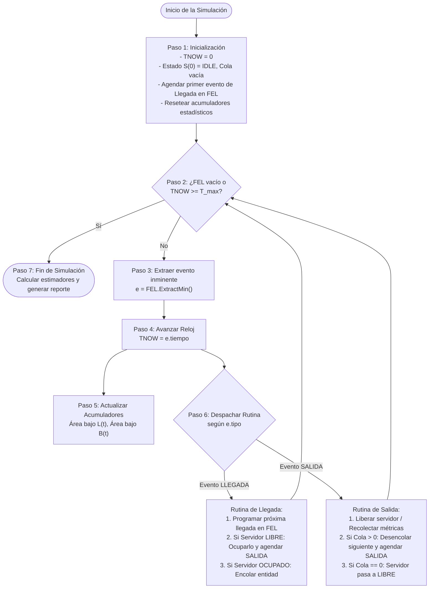
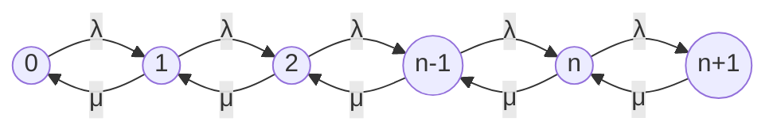

# Simulación por Eventos Discretos y Teoría de Colas

> [!info] 💡 ¿Cómo entender esto desde cero? (Guía para novatos de pregrado)
> Imagina una cafetería universitaria o una taquilla en el campus de la EPN donde solo atiende una persona. Los estudiantes llegan de forma impredecible: a veces llega uno cada 5 minutos, a veces llegan tres de golpe. Cada atención toma un tiempo variable (algunos piden solo un café, otros un almuerzo completo). 
> 
> Si intentaras simular esto en una computadora segundo a segundo (segundo 1, segundo 2, segundo 3...), la CPU pasaría el 99% del tiempo procesando segundos vacíos donde no ocurre absolutamente nada. **La Simulación por Eventos Discretos (DES)** soluciona esto de forma elegante: el tiempo del simulador no avanza de forma continua, sino que *salta mágicamente* de un acontecimiento relevante al siguiente (de una llegada a una salida del servidor).
> 
> Por otro lado, **la Teoría de Colas** es la contraparte matemática analítica: en lugar de esperar a que un programa corra durante horas para estimar cuánto tiempo pasará un estudiante esperando en la fila, proporciona fórmulas exactas (como las de Kendall, Little y Erlang) para predecir colas, tiempos de espera y cuellos de botella antes de gastar un solo dólar en servidores, cajeros o enlaces de fibra óptica.

---

## 1. Fundamentos Epistemológicos y Ontológicos de la Simulación

En la ciencia computacional y la ingeniería, la experimentación directa sobre sistemas reales suele ser inviable, peligrosa, prohibitivamente costosa o físicamente imposible (por ejemplo, probar la saturación del clúster de bases de datos de una entidad bancaria colapsándolo en producción, o rediseñar el espacio aéreo metropolitano). La simulación constituye la disciplina paradigmática para resolver esta limitación.

```
+-------------------------------------------------------------------------+
|                                ENTORNO                                  |
|                                                                         |
|      +-----------------------------------------------------------+      |
|      |                  SISTEMA (Frontera)                       |      |
|      |                                                           |      |
|      |    Entidades ---> [ Estado: S(t) ] ---> Salidas / Métricas |      |
|      |                       |                                   |      |
|      |                       v                                   |      |
|      |             Recursos y Servidores                         |      |
|      +-----------------------------------------------------------+      |
|                                                                         |
+-------------------------------------------------------------------------+
```

### Conceptos Fundamentales

> [!definition] Sistema
> Un **Sistema** se define formalmente como una colección delimitada de objetos, entidades y procesos interrelacionados que interactúan dinámicamente en el tiempo para cumplir un propósito específico. El sistema se encuentra confinado por una **Frontera (*System Boundary*)**, la cual discrimina qué elementos forman parte intrínseca de la dinámica interna y cuáles pertenecen al exterior.

> [!definition] Entorno (*Environment*)
> El **Entorno** es el conjunto de factores, variables y fuentes externas que afectan el comportamiento del sistema (inputs exógenos) o son afectadas por sus respuestas (outputs), sin que el sistema posea control directo sobre sus dinámicas generadoras.

> [!definition] Modelo
> Un **Modelo** es una representación abstracta, conceptual, matemática o computacional simplificada de un sistema real. Filtra el ruido irrelevante para aislar y formalizar exclusivamente los mecanismos causales y estocásticos necesarios para responder a preguntas de investigación u optimización de ingeniería.

> [!definition] Simulación
> La **Simulación** es la ejecución numérica y la experimentación controlada de un modelo dinámico en una computadora a lo largo del tiempo sintético. Su propósito es inferir el comportamiento operativo, transitorio y estacionario del sistema analizado bajo diversos escenarios contrafácticos (*What-if analysis*).

### Tipología Canónica de Modelos

Los modelos en ingeniería computacional se clasifican rigurosamente según tres dimensiones ortogonales:

| Dimensión | Tipo A | Tipo B | Criterio de Distinción |
| :--- | :--- | :--- | :--- |
| **Tratamiento del Tiempo** | **Continuo** | **Discreto** | En los modelos continuos, las variables de estado evolucionan suavemente en $t \in \mathbb{R}$ gobernadas por Ecuaciones Diferenciales Ordinarias (EDO) o Parciales (EDP). En los discretos, el estado cambia únicamente en puntos aislados del tiempo ($t_1, t_2, \dots \in \mathbb{R}^+$). |
| **Naturaleza de las Variables** | **Determinista** | **Estocástico** | Los modelos deterministas no contienen componentes aleatorios (entradas idénticas generan salidas idénticas). Los estocásticos integran variables aleatorias regidas por distribuciones de probabilidad; sus resultados son estimaciones estadísticas. |
| **Evolución Temporal** | **Estático** | **Dinámico** | Los modelos estáticos no involucran el paso del tiempo intrínseco (p. ej., Monte Carlo puro para aproximar una integral). Los modelos dinámicos modelan explícitamente trayectorias de estados en función del tiempo. |

---

## 2. Simulación por Eventos Discretos (DES - Discrete-Event Simulation)

La **Simulación por Eventos Discretos (DES)** modela la operación de un sistema como una secuencia cronológica de eventos instantáneos. Entre dos eventos consecutivos, el estado del sistema permanece rigurosamente inmutable; por tanto, el reloj del simulador puede saltar directamente de un evento al siguiente sin pérdida de precisión.

### Componentes Ontológicos de un Modelo DES

1. **Entidades (*Entities*)**:
   - Elementos dinámicos que fluyen a través del sistema.
   - *Ejemplos*: Paquetes de red TCP en un router, transacciones SQL en un motor de base de datos, clientes en una entidad bancaria, tareas en el planificador del kernel.
   - Pueden ser temporales (se crean, transitan y se destruyen al salir) o permanentes (permanecen fijas dentro del sistema).

2. **Atributos (*Attributes*)**:
   - Variables locales asociadas de forma única a una entidad individual.
   - *Ejemplos*: `timestamp_llegada`, `tamaño_paquete_bytes`, `nivel_prioridad_qos`, `tiempo_requerido_servicio`.

3. **Recursos / Servidores (*Resources/Servers*)**:
   - Componentes estáticos de capacidad finita $c$ que proveen un servicio a las entidades.
   - Poseen estados operacionales discretos: `LIBRE (IDLE)`, `OCUPADO (BUSY)`, `BLOQUEADO (BLOCKED)`, `FALLA (FAILED)`.
   - Si una entidad requiere un recurso ocupado, se suspende y se encola.

4. **Estado del Sistema ($S(t)$)**:
   - Vector de variables de estado mínimas necesarias para describir completamente la condición del sistema en el instante temporal $t$.
   - En una cola simple, $S(t) = \langle N(t), B(t) \rangle$, donde $N(t)$ es el número de entidades en cola y $B(t) \in \{0, 1\}$ es el estado del servidor.

5. **Cola de Espera (*Queue / Buffer*)**:
   - Estructura de contención temporal donde aguardan las entidades que no pueden ser atendidas de inmediato.
   - Caracterizada por su capacidad (finita $K$ o infinita $\infty$) y su **disciplina de servicio**:
     * **FIFO (First-In, First-Out) / FCFS (First-Come, First-Served)**: Orden estricto de llegada.
     * **LIFO (Last-In, First-Out) / LCFS**: Pila; el último en llegar es el primero en ser procesado.
     * **Prioridad sin Apropiación (*Non-Preemptive Priority*)**: Se atiende al de mayor prioridad, pero no se interrumpe a quien ya está en el servidor.
     * **Prioridad con Apropiación (*Preemptive Priority*)**: La llegada de una entidad de mayor prioridad expulsa de inmediato a la entidad en servicio actual.
     * **Round Robin (RR)**: Cada entidad recibe un cuanto temporal (*quantum* $\delta$); si no termina, vuelve a la cola.

---

### Mecanismo de Avance Temporal: El Reloj y la Lista de Eventos Futuros (FEL)

Existen dos filosofías computacionales para avanzar el tiempo de simulación:

```
A) Avance por incremento fijo (Fixed-Increment Time Advance):
   |-----dt-----|-----dt-----|-----dt-----|-----dt-----|  (Iniciativo / Ineficiente)
  t0           t1           t2           t3           t4

B) Avance por próximo evento (Next-Event Time Advance - DES Canónico):
   |-------- e1 ------------|---- e2 ----|------------- e3 ----|  (Óptimo)
  t0                       t1           t2                    t3
```

En DES se utiliza exclusivamente el **Avance por Próximo Evento (*Next-Event Time Advance*)**, orquestado mediante:

1. **Reloj de Simulación ($T_{NOW}$ o `CLK`)**: Variable escalar que almacena el instante temporal actual del modelo.
2. **Calendario de Eventos Futuros (FEL - *Future Event List*)**: 
   - Cola de prioridad estructurada habitualmente como un **Min-Heap binario** o un árbol balanceado.
   - Cada nodo en el FEL es una tupla:
     $$e_i = \langle t_{\text{evento}}, \text{TipoEvento}, \text{ID\_Entidad}, \text{Metadatos} \rangle$$
   - Los eventos están rigurosamente ordenados por su marca temporal de ocurrencia:
     $$t_{e_1} \le t_{e_2} \le t_{e_3} \le \dots \le t_{e_M}$$
   - Las operaciones principales son:
     * `Insert(e)`: Inserción de un nuevo evento futuro ($\mathcal{O}(\log M)$).
     * `ExtractMin()`: Extracción del evento inminente con menor $t_{\text{evento}}$ ($\mathcal{O}(\log M)$).

---

### Ciclo de Ejecución del Simulador Paso a Paso

El núcleo algorítmico de un motor DES (como SimPy, OMNeT++ o ns-3) opera en un bucle cerrado continuo:



> [!important] Conservación del Área Bajo la Curva para Estadísticas
> Las métricas acumulativas continuas en el tiempo, como el número medio de clientes en el sistema $\bar{L}$, no se calculan mediante un promedio aritmético simple, sino mediante la integral escalonada dividida por el tiempo total de simulación:
> $$\bar{L} = \frac{1}{T_{\text{max}}} \int_{0}^{T_{\text{max}}} N(t) \, dt = \frac{1}{T_{\text{max}}} \sum_{k=1}^{K} N(t_{k-1}) \cdot (t_k - t_{k-1})$$
> Esto garantiza que cada estado pese exactamente el tiempo que el sistema permaneció en él.

---

## 3. Teoría de Colas (Sistemas de Espera y Teletráfico)

Mientras que la simulación numérica por eventos discretos aproxima el comportamiento del sistema mediante corridas muestrales, la **Teoría de Colas** proporciona herramientas analíticas formales y cerradas basadas en la teoría de procesos estocásticos.

### Modelo Estructural de un Sistema de Espera

El diagrama canónico de un sistema de colas captura con precisión las transformaciones de estado y los flujos de entidades:

![[queueing-theory-model.png]]

> [!definition] Desglose Exhaustivo del Modelo Canónico de Colas
> Analizando en profundidad los componentes del modelo estructural ilustrado:
> 
> 1. **Proceso de Llegada con Tasa $\lambda$**:
>    - Las entidades provienen de una fuente externa y arriban al sistema según un proceso estocástico caracterizado por una tasa media de llegadas $\lambda$ (entidades por unidad de tiempo).
>    - El tiempo entre llegadas consecutivas es una variable aleatoria $T_a$, con valor esperado $\mathbb{E}[T_a] = \frac{1}{\lambda}$.
> 
> 2. **Cola de Espera (*Buffer* FIFO)**:
>    - Área de retención donde las entidades aguardan cuando el servidor se encuentra ocupado.
>    - La disciplina estándar mostrada es **FIFO (*First-In, First-Out*)**, donde el primer paquete o cliente en llegar es el primero en recibir atención.
>    - Métrica asociada: Longitud promedio de la cola $L_q$, que cuantifica exclusivamente a las entidades esperando servicio.
> 
> 3. **Servidor con Tasa de Servicio $\mu$**:
>    - Recurso activo que procesa las entidades. Posee una tasa media de servicio $\mu$ (entidades atendidas por unidad de tiempo cuando el servidor opera continuamente).
>    - El tiempo requerido para atender a una entidad es una variable aleatoria $T_s$, con valor esperado $\mathbb{E}[T_s] = \frac{1}{\mu}$.
> 
> 4. **Flujo de Salidas**:
>    - Entidades que han completado su procesamiento y abandonan el sistema. En régimen estacionario y sin pérdidas de capacidad, la tasa media de salida es idéntica a la tasa de llegada $\lambda$.
> 
> 5. **Límite del Sistema (*System Boundary*)**:
>    - Frontera que engloba tanto la **Cola** como el **Servidor**.
>    - Métrica asociada: Número promedio total de entidades en el sistema $L = L_q + L_s$.
> 
> 6. **Intensidad de Tráfico ($\rho$)**:
>    - Razón adimensional entre la demanda entrante y la capacidad de servicio: $\rho = \frac{\lambda}{\mu}$. Representa la probabilidad matemática de que el servidor esté ocupado en estado estacionario.
> 
> 7. **Tiempos de Permanencia ($W$ y $W_q$)**:
>    - $W_q$: Tiempo medio que una entidad pasa esperando estrictamente en la cola.
>    - $W$: Tiempo medio total que una entidad permanece en el sistema ($W = W_q + \frac{1}{\mu}$).

---

### Fundamento Estocástico: Procesos de Poisson y Distribución Exponencial

En sistemas de teletráfico y redes de computadoras, los arribos agregados de una gran población de usuarios independientes convergen de forma natural a un **Proceso de Poisson**.

> [!definition] Proceso de Poisson
> Un proceso de conteo $\{N(t), t \ge 0\}$ es un Proceso de Poisson homogéneo de tasa $\lambda > 0$ si:
> 1. $N(0) = 0$.
> 2. Posee incrementos independientes y estacionarios.
> 3. La probabilidad de que ocurra exactamente $k$ eventos en un intervalo de longitud $t$ sigue la distribución de Poisson:
>    $$\mathbb{P}(N(t) = k) = \frac{(\lambda t)^k e^{-\lambda t}}{k!}, \quad k = 0, 1, 2, \dots$$

Una consecuencia directa y fundamental es que el tiempo entre arribos consecutivos $T$ sigue una **Distribución Exponencial** de parámetro $\lambda$:
$$f(t) = \lambda e^{-\lambda t}, \quad t \ge 0$$
$$F(t) = \mathbb{P}(T \le t) = 1 - e^{-\lambda t}, \quad t \ge 0$$
$$\mathbb{P}(T > t) = e^{-\lambda t}$$

#### Demostración Formal de la Propiedad de Falta de Memoria (Amnesia)

La distribución exponencial es la **única** distribución continua que goza de la propiedad de falta de memoria (*Memoryless Property*).

> [!important] Teorema: Propiedad de Falta de Memoria
> Sea $T \sim \text{Exp}(\lambda)$ el tiempo hasta que ocurre un evento (llegada o finalización de servicio). Entonces, para cualesquiera $s, t \ge 0$:
> $$\mathbb{P}(T > s + t \mid T > s) = \mathbb{P}(T > t)$$

**Demostración Matemática Rigurosa:**

Por la definición canónica de probabilidad condicional:
$$\mathbb{P}(T > s + t \mid T > s) = \frac{\mathbb{P}(T > s + t \cap T > s)}{\mathbb{P}(T > s)}$$

Dado que el evento $\{T > s + t\}$ es un subconjunto estricto del evento $\{T > s\}$ (si el tiempo supera $s+t$, forzosamente supera $s$):
$$\{T > s + t\} \cap \{T > s\} = \{T > s + t\}$$

Sustituyendo en la razón:
$$\mathbb{P}(T > s + t \mid T > s) = \frac{\mathbb{P}(T > s + t)}{\mathbb{P}(T > s)}$$

Aplicando la función de supervivencia $\mathbb{P}(T > x) = e^{-\lambda x}$:
$$\mathbb{P}(T > s + t \mid T > s) = \frac{e^{-\lambda(s + t)}}{e^{-\lambda s}} = \frac{e^{-\lambda s} \cdot e^{-\lambda t}}{e^{-\lambda s}} = e^{-\lambda t}$$

Puesto que $\mathbb{P}(T > t) = e^{-\lambda t}$, se concluye idénticamente:
$$\mathbb{P}(T > s + t \mid T > s) = \mathbb{P}(T > t) \quad \blacksquare$$

> [!tip] Implicación Práctica en Computación
> Si un paquete de red lleva esperando $s = 100\,\text{ms}$ en el buffer de un router, la probabilidad de que requiera al menos $t = 50\,\text{ms}$ adicionales para terminar de ser atendido es exactamente la misma que si acabara de llegar al servidor. El sistema no almacena "historial de desgaste" ni "antigüedad".

---

### Notación Estándar de Kendall

David G. Kendall propuso una notación taquigráfica universal de 6 campos para caracterizar unívocamente cualquier sistema de colas:

$$A \,/\, B \,/\, c \,/\, K \,/\, m \,/\, Z$$

| Campo | Símbolo | Significado | Ejemplos Comunes |
| :---: | :---: | :--- | :--- |
| **$A$** | Distribución de llegadas | Distribución estadística del tiempo entre arribos | $M$ (Markoviano/Exponencial), $D$ (Determinista), $E_k$ (Erlang-$k$), $G$ o $GI$ (General) |
| **$B$** | Distribución de servicio | Distribución estadística del tiempo de servicio | $M$ (Exponencial), $D$ (Constante), $G$ (General) |
| **$c$** | Número de servidores | Cantidad de servidores o canales en paralelo | $1, 2, 4, 16, \dots$ |
| **$K$** | Capacidad del sistema | Límite máximo de entidades (en cola + en servicio) | $\infty$ (por defecto si se omite), $100, 1024$ |
| **$m$** | Población de origen | Tamaño de la población fuente generadora | $\infty$ (por defecto si se omite), $N$ (cerrado) |
| **$Z$** | Disciplina de servicio | Regla de selección de la siguiente entidad | $\text{FIFO}$ (por defecto), $\text{LIFO}, \text{PRI}, \text{RR}$ |

*Ejemplo*: Un modelo $M/M/1$ denota arribos Poisson ($M$), tiempos de servicio exponenciales ($M$), un único servidor ($1$), capacidad de almacenamiento ilimitada ($K=\infty$), población infinita ($m=\infty$) y disciplina FIFO.

---

### Análisis Analítico del Modelo Canónico $M/M/1$

El modelo $M/M/1$ es el arquetipo elemental de la teoría de colas. Se modela como una **Cadena de Markov de Tiempo Continuo (CTMC)** unidimensional de tipo **Proceso de Nacimiento y Muerte (*Birth-Death Process*)**, donde el estado $n \in \{0, 1, 2, \dots\}$ representa el número total de clientes presentes en el sistema.



#### Ecuaciones de Balance Global y Derivación de $P_n$

En estado estacionario (equilibrio ergódico), la tasa de flujo probabilístico que entra a cualquier estado debe igualar a la tasa de flujo que sale de él:

- **Para el estado 0:**
  $$\lambda P_0 = \mu P_1 \implies P_1 = \left(\frac{\lambda}{\mu}\right) P_0$$

- **Para el estado 1:**
  $$(\lambda + \mu) P_1 = \lambda P_0 + \mu P_2$$
  Sustituyendo $P_1 = \left(\frac{\lambda}{\mu}\right) P_0$:
  $$(\lambda + \mu)\left(\frac{\lambda}{\mu}\right) P_0 = \lambda P_0 + \mu P_2 \implies \mu P_2 = \frac{\lambda^2}{\mu} P_0 \implies P_2 = \left(\frac{\lambda}{\mu}\right)^2 P_0$$

- **Por inducción matemática para el estado $n$:**
  $$P_n = \left(\frac{\lambda}{\mu}\right)^n P_0 = \rho^n P_0, \quad \text{donde } \rho = \frac{\lambda}{\mu}$$

#### Factor de Utilización y Condición de Estabilidad

> [!important] Condición de Estabilidad Ergódica
> El sistema alcanza un régimen estacionario si y solo si la intensidad de tráfico es estrictamente menor que la unidad:
> $$\rho = \frac{\lambda}{\mu} < 1 \iff \lambda < \mu$$
> Si $\rho \ge 1$, la tasa de arribos iguala o supera la capacidad de procesamiento. La cola diverge probabilísticamente hacia el infinito ($\lim_{t \to \infty} N(t) = \infty$) y el sistema colapsa sin alcanzar equilibrio estacionario.

Aplicando la **condición de normalización** de la teoría de probabilidad ($\sum_{n=0}^{\infty} P_n = 1$):
$$\sum_{n=0}^{\infty} P_n = P_0 \sum_{n=0}^{\infty} \rho^n = 1$$

Puesto que $\rho < 1$, reconocemos la suma de una serie geométrica infinita $\sum_{n=0}^{\infty} \rho^n = \frac{1}{1 - \rho}$:
$$P_0 \left(\frac{1}{1 - \rho}\right) = 1 \implies P_0 = 1 - \rho$$

Sustituyendo $P_0$ obtenemos la distribución de probabilidad de estado estacionario de $M/M/1$:
$$P_n = (1 - \rho)\rho^n, \quad n = 0, 1, 2, \dots$$

---

#### Deducción Rigurosa de las Métricas de Rendimiento

##### 1. Número promedio en el sistema ($L$)
$L$ es el valor esperado del número de entidades en el sistema ($L = \mathbb{E}[N]$):
$$L = \sum_{n=0}^{\infty} n P_n = \sum_{n=0}^{\infty} n (1 - \rho)\rho^n = (1 - \rho)\rho \sum_{n=1}^{\infty} n \rho^{n-1}$$

Recordando que la serie corresponde a la derivada de la serie geométrica:
$$\sum_{n=1}^{\infty} n \rho^{n-1} = \frac{d}{d\rho} \left(\sum_{n=0}^{\infty} \rho^n\right) = \frac{d}{d\rho} \left(\frac{1}{1 - \rho}\right) = \frac{1}{(1 - \rho)^2}$$

Sustituyendo el resultado:
$$L = (1 - \rho)\rho \cdot \frac{1}{(1 - \rho)^2} = \frac{\rho}{1 - \rho} = \frac{\lambda}{\mu - \lambda}$$

##### 2. Longitud promedio de la cola ($L_q$)
$L_q$ cuantifica únicamente las entidades que están esperando en la cola (excluyendo la que está en el servidor):
$$L_q = \sum_{n=1}^{\infty} (n - 1) P_n = \sum_{n=1}^{\infty} n P_n - \sum_{n=1}^{\infty} P_n = L - (1 - P_0)$$
Dado que $1 - P_0 = 1 - (1 - \rho) = \rho$:
$$L_q = L - \rho = \frac{\rho}{1 - \rho} - \rho = \frac{\rho - \rho(1 - \rho)}{1 - \rho} = \frac{\rho^2}{1 - \rho} = \frac{\lambda^2}{\mu(\mu - \lambda)}$$

---

#### La Ley de Little Formal

> [!definition] Teorema de Little (1961)
> En cualquier sistema de colas estable y estacionario (sin importar la distribución de llegadas, la distribución de servicio o la disciplina de cola interna), el número promedio de entidades en el sistema $L$ es estrictamente igual al producto de la tasa media de llegada $\lambda$ y el tiempo promedio de permanencia en el sistema $W$:
> $$L = \lambda W$$
> Análogamente, aplicándolo estrictamente a la cola:
> $$L_q = \lambda W_q$$

##### 3. Tiempo promedio en el sistema ($W$)
Despejando directamente mediante la Ley de Little:
$$W = \frac{L}{\lambda} = \frac{\frac{\lambda}{\mu - \lambda}}{\lambda} = \frac{1}{\mu - \lambda}$$

##### 4. Tiempo promedio en la cola ($W_q$)
Aplicando Little a la cola:
$$W_q = \frac{L_q}{\lambda} = \frac{\frac{\lambda^2}{\mu(\mu - \lambda)}}{\lambda} = \frac{\lambda}{\mu(\mu - \lambda)}$$

Comprobando la consistencia aditiva elemental entre tiempos:
$$W = W_q + \mathbb{E}[T_s] = \frac{\lambda}{\mu(\mu - \lambda)} + \frac{1}{\mu} = \frac{\lambda + (\mu - \lambda)}{\mu(\mu - \lambda)} = \frac{\mu}{\mu(\mu - \lambda)} = \frac{1}{\mu - \lambda}$$

> [!example] Caso Práctico de Teletráfico en EPN
> Un switch de borde en el campus de la EPN recibe paquetes a una tasa media de $\lambda = 800\,\text{paquetes/segundo}$. Su puerto de salida puede procesar hasta $\mu = 1000\,\text{paquetes/segundo}$.
> 
> 1. Factor de utilización: $\rho = \frac{800}{1000} = 0.80$ ($80\%$ de ocupación).
> 2. Paquetes promedio en el buffer del switch: $L = \frac{0.80}{1 - 0.80} = 4\,\text{paquetes}$.
> 3. Paquetes esperando en cola: $L_q = \frac{0.80^2}{1 - 0.80} = 3.2\,\text{paquetes}$.
> 4. Latencia media total introducida por el switch: $W = \frac{1}{1000 - 800} = \frac{1}{200} = 0.005\,\text{segundos} = 5\,\text{ms}$.
> 5. Tiempo de espera en buffer: $W_q = 5\,\text{ms} - \frac{1}{1000}\,\text{s} = 5\,\text{ms} - 1\,\text{ms} = 4\,\text{ms}$.

---

### Extensión a Sistemas Multicanal $M/M/c$ y Fórmulas de Erlang-C

Cuando un clúster de cómputo o centro de datos cuenta con $c$ servidores idénticos en paralelo atendiendo una única cola compartida, la tasa de servicio global se adapta dinámicamente según el número de clientes presentes $n$:

$$\mu_n = \begin{cases} 
n\mu, & 0 \le n < c \quad (\text{servidores parcialmente ocupados}) \\
c\mu, & n \ge c \quad (\text{todos los servidores ocupados, saturación})
\end{cases}$$

El factor de utilización del clúster multicanal es:
$$\rho = \frac{\lambda}{c\mu} < 1$$

Definiendo la **intensidad de tráfico ofrecido** (en Erlangs):
$$a = \frac{\lambda}{\mu}$$

#### Probabilidad de Sistema Desocupado ($P_0$)
Resolviendo las ecuaciones de balance de nacimiento y muerte para $M/M/c$:
$$P_0 = \left[ \sum_{k=0}^{c-1} \frac{a^k}{k!} + \frac{a^c}{c!\left(1 - \frac{a}{c}\right)} \right]^{-1} = \left[ \sum_{k=0}^{c-1} \frac{a^k}{k!} + \frac{a^c}{c!(1 - \rho)} \right]^{-1}$$

#### Fórmula de Erlang-C: Probabilidad de Espera en Cola
La fórmula de Erlang-C, denotada $C(c, a)$, determina la probabilidad de que una entidad entrante encuentre todos los servidores ocupados y deba aguardar en la cola:

$$P_{\text{espera}} = C(c, a) = \sum_{n=c}^{\infty} P_n = \frac{\frac{a^c}{c!(1 - \rho)}}{\sum_{k=0}^{c-1} \frac{a^k}{k!} + \frac{a^c}{c!(1 - \rho)}}$$

#### Métricas de Rendimiento para $M/M/c$
Conocida $C(c, a)$, las métricas de desempeño se expresan de forma compacta:

$$L_q = C(c, a) \frac{\rho}{1 - \rho} = C(c, a) \frac{\lambda \mu (a)^{c-1}}{(c-1)! (c\mu - \lambda)^2}$$
$$W_q = \frac{L_q}{\lambda} = \frac{C(c, a)}{c\mu - \lambda}$$
$$W = W_q + \frac{1}{\mu} = \frac{C(c, a)}{c\mu - \lambda} + \frac{1}{\mu}$$
$$L = \lambda W = L_q + \frac{\lambda}{\mu} = L_q + a$$

> [!tip] Aplicación en Ingeniería de Software: Dimensionamiento de Réplicas en Kubernetes
> En la arquitectura de microservicios, el dimensionamiento de Pods y Workers Pools gestionados por Envoy o Nginx se formula con Erlang-C:
> Si un microservicio recibe $\lambda = 300\,\text{req/s}$ y cada instancia atiende a $\mu = 100\,\text{req/s}$, el tráfico ofrecido es $a = 3\,\text{Erlangs}$.
> Con $c=3$ réplicas, $\rho = 1$ (inestable).
> Con $c=4$ réplicas ($\rho = 0.75$), $C(4, 3) \approx 0.51$, lo cual significa que el $51\%$ de las peticiones sufrirá retardo en cola.
> Si se escala a $c=5$ réplicas ($\rho = 0.60$), $C(5, 3) \approx 0.236$ (solo el $23.6\%$ de peticiones espera), garantizando SLAs estrictos de latencia P99.
