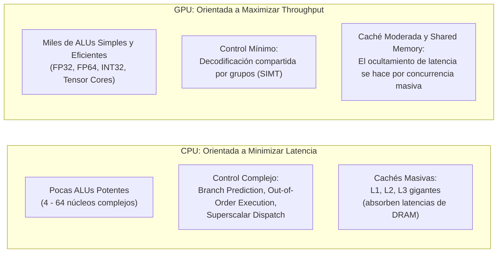
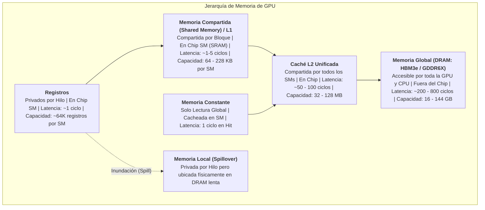
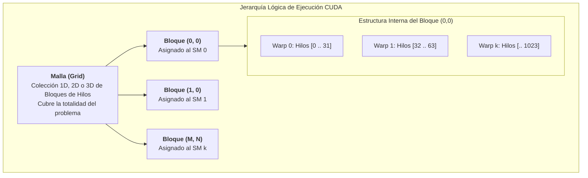
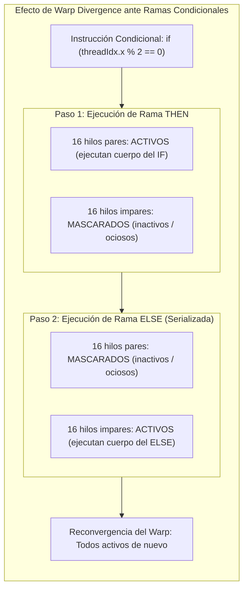
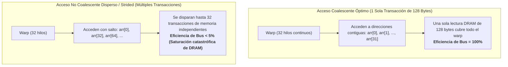
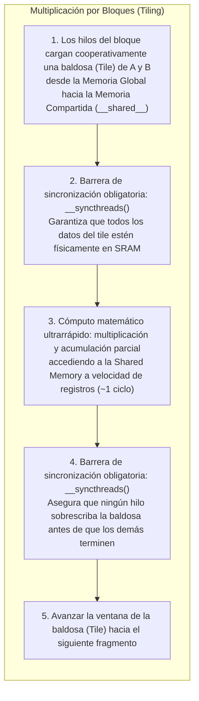

# Arquitectura de GPU y Programación Heterogénea con NVIDIA CUDA

**Cátedra:** Multiprocesamiento y Arquitecturas Alternativas (ICCD432)  
**Facultad:** Ingeniería de Sistemas / Computación — Escuela Politécnica Nacional (EPN)  
**Nivel:** Pregrado Avanzado  

---

> [!info] 💡 ¿Cómo entender esto desde cero? (Guía para novatos de pregrado)
> Imagina que necesitas transportar a 1000 personas al otro lado de la ciudad:
> 
> - **La CPU es un Ferrari ultrarrápido:** Tiene un motor sofisticadísimo, caja de cambios inteligente (predicción de saltos, ejecución fuera de orden) y solo 4 o 8 asientos (núcleos). Llega a 300 km/h y hace el viaje en 2 minutos (latencia mínima). Pero para llevar a las 1000 personas debe hacer cientos de viajes de ida y vuelta, tardando horas en total.
> - **La GPU es un convoy masivo de 30 autobuses escolares:** Cada autobús viaja despacio a 50 km/h (baja frecuencia de reloj, núcleos simples sin predicción compleja). Sin embargo, en un solo viaje simultáneo transporta a todos los pasajeros de golpe.
> 
> La CPU está obsesionada con **minimizar la latencia** de una sola tarea secuencial. La GPU está diseñada para **maximizar el rendimiento global (*Throughput*)**, resolviendo millones de cálculos idénticos en paralelo (píxeles, matrices de redes neuronales, dinámica de fluidos). En la computación heterogénea moderna, la CPU actúa como el cerebro director de orquesta (*Host*) y la GPU como el músculo matemático masivo (*Device*).

---

## 1. Filosofía Arquitectural: Del Modelo Latencia-Centrista al Modelo Throughput-Centrista

El diseño físico de un microprocesador contemporáneo está restringido por el presupuesto de silicio (*Die Size*) y la disipación térmica máxima admisible (*TDP*). Las CPUs y las GPUs asignan estos transistores con filosofías radicalmente opuestas:



### 1.1 CPU: Latency-Oriented Design
- **Objetivo:** Ejecutar una única secuencia de instrucciones en el menor número posible de nanosegundos.
- **Técnicas hardware:** Ejecución especulativa agresiva, predictores de saltos basados en redes neuronales, ejecución fuera de orden (*Out-of-Order*), renombramiento de registros, y enormes jerarquías de caché L2 y L3 que ocupan más del $50\%$ del área del chip para evitar acceder a la DRAM.

### 1.2 GPU: Throughput-Oriented Design y Ocultamiento de Latencia (*Latency Hiding*)
- **Objetivo:** Completar el mayor volumen total de operaciones aritméticas en coma flotante por segundo (**FLOPS**).
- **Mecanismo de Ocultamiento de Latencia:** En lugar de gastar transistores en gigantescas cachés para amortiguar los $\sim 400$ ciclos de espera al leer la memoria DRAM global, la GPU mantiene **miles de hilos en vuelo simultáneamente dentro del hardware**.
- Cuando un grupo de 32 hilos queda bloqueado esperando un dato de la memoria DRAM, el programador de hardware (*Warp Scheduler*) conmuta instantáneamente en **cero ciclos de reloj (*Zero-overhead scheduling*)** hacia otro grupo de hilos que esté listo para calcular. Para que este mecanismo funcione, la GPU requiere una saturación masiva de paralelismo.

---

## 2. Jerarquía de Hardware y el Modelo de Co-procesamiento Heterogéneo

En la computación acelerada por GPU, el sistema opera bajo una arquitectura maestro-esclavo desacoplada:

- **Host (CPU):** Ejecuta el sistema operativo, gestiona el flujo de control general del programa, maneja operaciones de entrada/salida (disco, red) y orquesta el lanzamiento de tareas computacionales.
- **Device (GPU):** Funciona como un acelerador masivo conectado a la CPU a través del bus de expansión **PCI Express (PCIe Gen 4/5)** o enlaces propietarios de alto ancho de banda como **NVLink**.

### 2.1 Análisis Exhaustivo del Diagrama Arquitectural de la GPU

A continuación se presenta la organización arquitectural de hardware y el modelo de ejecución jerárquico de NVIDIA CUDA:

![[cuda-gpu-architecture.png]]

> [!important] Desglose Técnico del Diagrama de Arquitectura CUDA
> El diagrama superior ilustra la correspondencia directa entre los componentes lógicos de software del programador y los subsistemas físicos de silicio:
> 
> 1. **La Dualidad Host (CPU) vs Device (GPU):**
>    - La CPU (**Host**) posee su propia memoria física (**Host Memory** / RAM del sistema) y orquesta la aplicación.
>    - La GPU (**Device**) es un chip independiente compuesto por una matriz de multiprocesadores de transmisión (**Streaming Multiprocessors - SMs**) y una memoria física dedicada de altísimo ancho de banda (**Global Memory / DRAM**).
> 2. **Streaming Multiprocessors (SMs):**
>    - El chip de la GPU contiene decenas o cientos de SMs (por ejemplo, 128 o 144 SMs en arquitecturas Ada Lovelace y Hopper).
>    - Cada SM es un motor de procesamiento autónomo que alberga sus propias unidades de despacho de instrucciones (*Warp Schedulers*), cientos de núcleos aritméticos (núcleos CUDA FP32/INT32), núcleos especializados (Tensor Cores), un banco gigantesco de **Registros**, y un bloque de **Memoria Compartida (Shared Memory / Caché L1 configurable)** en chip de latencia ultrabaja.
> 3. **Jerarquía Lógica (Software) vs Hardware:**
>    - **Grid (Malla):** Es el conjunto completo de hilos que ejecutan una invocación de kernel. A nivel de hardware, los bloques que componen el Grid se distribuyen dinámicamente entre todos los SMs disponibles del chip.
>    - **Thread Block (Bloque de Hilos):** Un bloque se asigna íntegramente a un único SM durante todo su ciclo de vida. Todos los hilos del mismo bloque residen en el mismo SM físico y pueden cooperar estrechamente.
>    - **Shared Memory:** Es el espacio de almacenamiento local ultrarrápido (en chip) que comparten **exclusivamente los hilos que pertenecen a un mismo Bloque**. Los bloques distintos no pueden leer ni escribir en la memoria compartida de otros bloques.
>    - **Global Memory:** Es accesible por **todos los hilos de todos los bloques del Grid**, así como por la CPU (Host) a través del bus PCIe/NVLink.
>    - **Warps:** Dentro de cada bloque en el SM, el hardware agrupa los hilos en unidades indivisibles de **32 hilos consecutivos denominadas Warps**, que se ejecutan bajo el paradigma SIMT.

---

### 2.2 Jerarquía de Hardware: SMs, Núcleos CUDA y Tensor Cores

1. **Streaming Multiprocessor (SM):**
   - Es la unidad constructiva fundamental de las GPUs NVIDIA.
   - En cada ciclo de reloj, los *Warp Schedulers* del SM seleccionan warps listos para ejecutar y emiten sus instrucciones hacia las unidades de ejecución.
2. **Núcleos CUDA (CUDA Cores):**
   - Son unidades funcionales elementales compuestas por una ALU de enteros (INT32) y una FPU de punto flotante de precisión simple (FP32) o doble precisión (FP64).
   - Ejecutan operaciones como `FMA` (*Fused Multiply-Add*: $a \times b + c$) en un solo ciclo.
3. **Núcleos Tensor (Tensor Cores):**
   - Motores de procesamiento matricial denso introducidos a partir de la microarquitectura Volta.
   - Computan multiplicaciones de matrices de precisión mixta en hardware a nivel de microcódigo en un solo paso:
     
     $$D = A \times B + C$$
     
   - Soportan formatos numéricos optimizados para Inteligencia Artificial y Deep Learning: FP16, BF16, TF32, INT8, FP8 y FP4, alcanzando órdenes de magnitud más PetaFLOPS que los núcleos CUDA convencionales.

---

### 2.3 Jerarquía de Memorias en la GPU

La velocidad de un kernel CUDA depende críticamente de entender en qué nivel de la pirámide de memoria reside cada dato:



| Tipo de Memoria | Ubicación Física | Alcance (*Scope*) | Acceso | Latencia Típica |
| :--- | :--- | :--- | :--- | :--- |
| **Registros** | En chip (SM) | Hilo individual | Lectura / Escritura | $\sim 1$ ciclo |
| **Shared Memory** | En chip (SRAM del SM) | Bloque de hilos | Lectura / Escritura | $\sim 1 - 5$ ciclos |
| **Constant Memory** | Fuera de chip (DRAM con caché en SM) | Todos los hilos del Grid | Solo Lectura | $\sim 1$ ciclo (en caché) |
| **Caché L2** | En chip (centralizada) | Todos los SMs | Lectura / Escritura | $\sim 50 - 100$ ciclos |
| **Global Memory** | Fuera de chip (HBM / GDDR) | Todos los hilos + Host | Lectura / Escritura | $\sim 200 - 800$ ciclos |
| **Local Memory** | Fuera de chip (DRAM) | Hilo individual | Lectura / Escritura | $\sim 200 - 800$ ciclos |

> [!caution] Presión de Registros (*Register Pressure*) y *Spilling*
> Cada SM tiene un número finito de registros físicos (ej. 65,536 registros de 32 bits). Si un kernel declara demasiadas variables locales y el compilador `nvcc` requiere más registros por hilo de los disponibles, los registros excedentes se expulsan a la **Memoria Local**. Aunque se llama "local", reside físicamente en la **lenta memoria DRAM externa**, lo que destruye el rendimiento del kernel.

---

## 3. El Modelo de Programación CUDA

### 3.1 Jerarquía de Hilos: Hilo, Bloque y Malla (Grid)

Para descomponer un problema multidimensional, CUDA provee una abstracción geométrica estructurada en tres niveles:



1. **Hilo (`Thread`):** Es la unidad de computación más fina. Ejecuta el código del kernel y posee su propio espacio de registros y contador de programa.
2. **Bloque de Hilos (`Thread Block`):**
   - Agrupación lógica de hasta **1024 hilos** que se ejecutan concurrentemente en el mismo SM.
   - Pueden sincronizarse mediante barreras hardware y comunicarse a través de la Memoria Compartida.
   - Se organizan en dimensiones 1D, 2D o 3D mediante la estructura `dim3`.
3. **Malla de Bloques (`Grid`):**
   - Conjunto de todos los bloques de hilos lanzados para ejecutar un kernel determinado.
   - No existe garantía de orden ni sincronización directa entre diferentes bloques del mismo grid durante la ejecución del kernel (independencia estricta de bloques).

---

### 3.2 Planificación por Warps y el Cuello de Botella de la Divergencia (Warp Divergence)

Físicamente, el SM nunca ejecuta hilos individuales; el SM agrupa y programa los hilos en **Warps de 32 hilos continuos** bajo la arquitectura **SIMT (Single Instruction, Multiple Threads)**.

- En SIMT, los 32 hilos del warp reciben la misma instrucción en el mismo ciclo, pero operan sobre sus propios registros y direcciones de memoria independientes.



> [!danger] El Problema de la Divergencia de Warps (*Warp Divergence*)
> Si el código dentro de un warp encuentra una bifurcación dependiente del ID de los hilos (`if-else` o bucle de longitud variable):
> 
> ```cpp
> if (threadIdx.x < 16) {
>     // Rama A
> } else {
>     // Rama B
> }
> ```
> 
> El hardware del SM no puede bifurcar el flujo físico de instrucciones. Por ende, **el SM serializa la ejecución**:
> 1. Ejecuta la Rama A activando solo los primeros 16 hilos, mientras los otros 16 se apagan (eficiencia del $50\%$).
> 2. Ejecuta la Rama B activando los 16 hilos restantes y apagando a los primeros.
> 3. El tiempo de ejecución es la suma del tiempo de ambas ramas ($T = T_A + T_B$).
> 
> **Regla de Optimización EPN:** Asegurar que las ramas condicionales dependan de condiciones homogéneas para todo el warp (`threadIdx.x / 32`), de modo que todos los hilos del warp tomen siempre la misma ruta.

---

### 3.3 Coalescencia de Memoria Global (*Memory Coalescing*)

La memoria global DRAM transfiere datos en transacciones atómicas alineadas de **32, 64 o 128 bytes** (equivalentes a líneas de caché L2).



- **Acceso Coalescente:** Cuando el hilo $k$ del warp accede a la dirección base $+ k \times 4$ bytes (ej. elementos contiguos de un vector `float`), el controlador combina las 32 peticiones en **una única transacción de memoria de 128 bytes**.
- **Acceso No Coalescente:** Si los hilos acceden con un salto (*stride*) grande o de forma aleatoria, el controlador de memoria debe emitir decenas de transacciones independientes donde la mayor parte de los bytes transferidos son descartados, reduciendo el ancho de banda efectivo a una fracción del teórico.

---

## 4. Sintaxis de Programación CUDA C/C++

### 4.1 Calificadores de Funciones

| Calificador | Dónde se ejecuta | Desde dónde se invoca | Propósito / Restricciones |
| :--- | :--- | :--- | :--- |
| `__global__` | En la **GPU (Device)** | Desde la **CPU (Host)** | Declara la función de entrada al kernel. Debe retornar `void`. |
| `__device__` | En la **GPU (Device)** | Solo desde la **GPU (Device)** | Funciones auxiliares llamadas por kernels dentro del device. |
| `__host__` | En la **CPU (Host)** | Solo desde la **CPU (Host)** | Funciones estándar de C/C++ en la CPU (calificador por omisión). |

### 4.2 Variables Intrínsecas del Hardware
Son variables provistas automáticamente por el compilador `nvcc` dentro del cuerpo de un kernel:
- `threadIdx.{x, y, z}`: Coordenadas del hilo dentro de su bloque actual.
- `blockIdx.{x, y, z}`: Coordenadas del bloque dentro del grid.
- `blockDim.{x, y, z}`: Dimensiones (número de hilos) del bloque.
- `gridDim.{x, y, z}`: Dimensiones (número de bloques) del grid.

#### Cálculo Canónico del Índice Global Único:
- **Espacio 1D:**
  
  $$\text{id}_{\text{global}} = \text{blockIdx.x} \times \text{blockDim.x} + \text{threadIdx.x}$$

- **Espacio 2D (Matrices de tamaño $M \times N$):**
  
  $$\text{col} = \text{blockIdx.x} \times \text{blockDim.x} + \text{threadIdx.x}$$
  
  $$\text{row} = \text{blockIdx.y} \times \text{blockDim.y} + \text{threadIdx.y}$$
  
  $$\text{indice\_lineal} = \text{row} \times \text{ancho} + \text{col}$$

---

### 4.3 Gestión del Ciclo de Vida de Memoria en el Runtime

1. `cudaMalloc((void**)&d_ptr, bytes)`: Reserva memoria en la Global Memory de la GPU.
2. `cudaFree(d_ptr)`: Libera la memoria en la GPU.
3. `cudaMemcpy(dst, src, bytes, direccion)`: Transfiere bloques de bytes a través del bus PCIe.
   - `cudaMemcpyHostToDevice`: Copia desde la RAM del sistema hacia la DRAM de la GPU.
   - `cudaMemcpyDeviceToHost`: Recupera los resultados desde la GPU hacia la CPU.
4. **Sintaxis del Operador Triple Chevrón (`<<< ... >>>`):**
   ```cpp
   dim3 hilosPorBloque(16, 16);
   dim3 bloquesPorGrid((ancho + 15) / 16, (alto + 15) / 16);
   mi_kernel<<<bloquesPorGrid, hilosPorBloque>>>(d_A, d_B, d_C, ancho, alto);
   ```

---

## 5. Patrón Maestro de Optimización: Multiplicación de Matrices por Bloques (*Tiled Matrix Multiplication*)

La multiplicación de matrices estándar $C = A \times B$ para matrices cuadradas de tamaño $N \times N$ es el algoritmo arquetípico para ilustrar la transición de un kernel ingenuo limitado por memoria (*memory-bound*) a un kernel de alto rendimiento optimizado mediante **Shared Memory**.

### 5.1 Análisis Teórico: ¿Por qué el algoritmo ingenuo fracasa?
En el kernel ingenuo, cada hilo calcula un elemento $C_{i,j} = \sum_{k=0}^{N-1} A_{i,k} \cdot B_{k,j}$.
- Para calcular cada uno de los $N^2$ elementos, se leen $N$ elementos de $A$ y $N$ elementos de $B$ directamente desde la **Global Memory**.
- **Accesos totales a DRAM lenta:** $2 \times N^3$ operaciones de lectura en DRAM.
- Relación de intensidad aritmética: Por cada 2 operaciones de punto flotante (1 multiplicación + 1 suma = 1 FMA), se leen 8 bytes de DRAM. La GPU gasta el $98\%$ de su tiempo esperando transferencias de memoria global y las ALUs permanecen hambrientas.

### 5.2 La Solución por Baldosas (*Tiling*) con Memoria Compartida



Al cargar cooperativamente una submatriz de tamaño $\text{TILE\_DIM} \times \text{TILE\_DIM}$ en la Memoria Compartida del SM:
- Cada elemento cargado en Memoria Compartida es reutilizado $\text{TILE\_DIM}$ veces por los distintos hilos del bloque.
- **Reducción del tráfico a DRAM:** El número de accesos a memoria global se reduce drásticamente por un factor de $\text{TILE\_DIM}$:

$$\text{Accesos a DRAM (Tiled)} = \frac{2 \cdot N^3}{\text{TILE\_DIM}}$$

Si elegimos $\text{TILE\_DIM} = 32$, ¡reducimos el tráfico de memoria en un **$96.8\%$**, transformando una aplicación paralizada por el bus en un cálculo que corre a la velocidad máxima del silicio!

---

### 5.3 Código CUDA C++ Canónico Completo: Multiplicación por Bloques

```cpp
#include <iostream>
#include <cuda_runtime.h>

#define TILE_DIM 16 // Dimensión del bloque (16x16 = 256 hilos por bloque)

// =========================================================================
// Kernel CUDA Optimizado con Memoria Compartida (Shared Memory Tiling)
// =========================================================================
__global__ void matrixMulTiledKernel(const float* __restrict__ A,
                                     const float* __restrict__ B,
                                     float* __restrict__ C,
                                     int N) {
    // Memoria Compartida local del SM asignada para este Bloque
    __shared__ float tile_A[TILE_DIM][TILE_DIM];
    __shared__ float tile_B[TILE_DIM][TILE_DIM];

    // Identificadores de fila y columna globales del elemento C[row, col]
    int row = blockIdx.y * TILE_DIM + threadIdx.y;
    int col = blockIdx.x * TILE_DIM + threadIdx.x;

    float acc = 0.0f;

    // Número de baldosas requeridas para recorrer toda la dimensión N
    int numTiles = (N + TILE_DIM - 1) / TILE_DIM;

    for (int t = 0; t < numTiles; ++t) {
        // 1. Carga cooperativa del elemento correspondiente del Tile A
        int a_col = t * TILE_DIM + threadIdx.x;
        if (row < N && a_col < N) {
            tile_A[threadIdx.y][threadIdx.x] = A[row * N + a_col];
        } else {
            tile_A[threadIdx.y][threadIdx.x] = 0.0f; // Relleno de frontera
        }

        // 2. Carga cooperativa del elemento correspondiente del Tile B
        int b_row = t * TILE_DIM + threadIdx.y;
        if (b_row < N && col < N) {
            tile_B[threadIdx.y][threadIdx.x] = B[b_row * N + col];
        } else {
            tile_B[threadIdx.y][threadIdx.x] = 0.0f; // Relleno de frontera
        }

        // BARRERA 1: Asegurar que todos los 256 hilos cargaron sus celdas en __shared__
        __syncthreads();

        // 3. Multiplicar las dos baldosas cargadas en la SRAM del SM
        #pragma unroll
        for (int k = 0; k < TILE_DIM; ++k) {
            acc += tile_A[threadIdx.y][k] * tile_B[k][threadIdx.x];
        }

        // BARRERA 2: Esperar a que todos terminen de usar la baldosa actual
        // antes de que el siguiente ciclo del bucle la sobrescriba
        __syncthreads();
    }

    // 4. Escribir el resultado acumulado en la memoria global de salida
    if (row < N && col < N) {
        C[row * N + col] = acc;
    }
}

// Macro para verificación de errores de CUDA Runtime
#define CUDA_CHECK(call) \
    do { \
        cudaError_t err = call; \
        if (err != cudaSuccess) { \
            std::cerr << "Error CUDA en " << __FILE__ << ":" << __LINE__ \
                      << " -> " << cudaGetErrorString(err) << std::endl; \
            exit(EXIT_FAILURE); \
        } \
    } while (0)

int main() {
    const int N = 2048; // Matriz 2048 x 2048
    size_t bytes = N * N * sizeof(float);

    std::cout << "Inicializando matrices de " << N << "x" << N << " (" 
              << (bytes * 3) / (1024 * 1024) << " MB)..." << std::endl;

    // Asignación de memoria en el Host (CPU)
    float *h_A = (float*)malloc(bytes);
    float *h_B = (float*)malloc(bytes);
    float *h_C = (float*)malloc(bytes);

    for (int i = 0; i < N * N; ++i) {
        h_A[i] = 1.0f;
        h_B[i] = 2.0f;
    }

    // Asignación de memoria en el Device (GPU Global Memory)
    float *d_A, *d_B, *d_C;
    CUDA_CHECK(cudaMalloc((void**)&d_A, bytes));
    CUDA_CHECK(cudaMalloc((void**)&d_B, bytes));
    CUDA_CHECK(cudaMalloc((void**)&d_C, bytes));

    // Copiar matrices desde Host a Device vía bus PCIe
    CUDA_CHECK(cudaMemcpy(d_A, h_A, bytes, cudaMemcpyHostToDevice));
    CUDA_CHECK(cudaMemcpy(d_B, h_B, bytes, cudaMemcpyHostToDevice));

    // Configuración geométrica del kernel (Bloques 2D y Grid 2D)
    dim3 threadsPerBlock(TILE_DIM, TILE_DIM); // 16 x 16 = 256 hilos
    dim3 blocksPerGrid((N + TILE_DIM - 1) / TILE_DIM, 
                       (N + TILE_DIM - 1) / TILE_DIM);

    // Eventos de CUDA para medición rigurosa de tiempo en hardware
    cudaEvent_t start, stop;
    CUDA_CHECK(cudaEventCreate(&start));
    CUDA_CHECK(cudaEventCreate(&stop));

    std::cout << "Lanzando kernel matrixMulTiledKernel<<<(" 
              << blocksPerGrid.x << "," << blocksPerGrid.y << "), (" 
              << threadsPerBlock.x << "," << threadsPerBlock.y << ")>>>..." << std::endl;

    CUDA_CHECK(cudaEventRecord(start));
    matrixMulTiledKernel<<<blocksPerGrid, threadsPerBlock>>>(d_A, d_B, d_C, N);
    CUDA_CHECK(cudaEventRecord(stop));
    CUDA_CHECK(cudaEventSynchronize(stop));

    float ms = 0.0f;
    CUDA_CHECK(cudaEventElapsedTime(&ms, start, stop));

    // Recuperar matriz C calculada hacia el Host
    CUDA_CHECK(cudaMemcpy(h_C, d_C, bytes, cudaMemcpyDeviceToHost));

    std::cout << "=====================================================" << std::endl;
    std::cout << "   Multiplicación Matricial con CUDA Tiling (EPN)   " << std::endl;
    std::cout << "=====================================================" << std::endl;
    std::cout << "Elemento de prueba C[0, 0] : " << h_C[0] << " (Esperado: " << N * 2.0f << ")" << std::endl;
    std::cout << "Tiempo de ejecución kernel : " << ms << " milisegundos" << std::endl;
    double gflops = (2.0 * (double)N * (double)N * (double)N * 1e-9) / (ms * 1e-3);
    std::cout << "Rendimiento alcanzado      : " << gflops << " GFLOPS" << std::endl;
    std::cout << "=====================================================" << std::endl;

    // Liberación rigurosa de recursos
    CUDA_CHECK(cudaFree(d_A));
    CUDA_CHECK(cudaFree(d_B));
    CUDA_CHECK(cudaFree(d_C));
    CUDA_CHECK(cudaEventDestroy(start));
    CUDA_CHECK(cudaEventDestroy(stop));
    free(h_A);
    free(h_B);
    free(h_C);

    return 0;
}
```

*Compilación con el compilador oficial de NVIDIA `nvcc`:*
```bash
nvcc -O3 -arch=sm_80 matrix_mul_tiled.cu -o matrix_mul_tiled
./matrix_mul_tiled
```

---

## 6. Resumen de Directrices de Optimización para Kernels CUDA

1. **Maximizar la Ocupación del SM:** Ajustar el tamaño del bloque a múltiplos enteros de 32 (tamaño de un warp), típicamente entre 128 y 256 hilos por bloque.
2. **Garantizar Coalescencia en Memoria Global:** El índice más interno de la memoria debe estar indexado directamente por `threadIdx.x`.
3. **Erradicar la Divergencia de Warps:** Evitar estructuras `if/else` donde los hilos de un mismo warp sigan caminos distintos; estructurar los algoritmos para que la condición sea compartida a nivel de warp.
4. **Explotar la Memoria Compartida para Reuso de Datos:** Siempre que un dato en memoria global sea referenciado más de una vez por los hilos vecinos, cargarlo a `__shared__` cooperativamente y sincronizar con `__syncthreads()`.
5. **Minimizar Transferencias Host-Device:** La comunicación por PCIe es órdenes de magnitud más lenta que el cómputo interno; mantener los datos en la memoria global de la GPU el mayor tiempo posible entre kernels sucesivos.

---

## 7. Preguntas de Autoevaluación (Nivel Examen EPN ICCD432)

1. **¿Por qué es estrictamente necesario invocar `__syncthreads()` dos veces dentro del bucle del kernel de multiplicación por bloques?**  
   *Respuesta esperada:* La primera barrera garantiza que todos los hilos del bloque hayan culminado la carga de sus elementos respectivos desde la memoria global hacia `tile_A` y `tile_B` antes de que cualquier hilo empiece a multiplicar. La segunda barrera es indispensable para evitar una condición de carrera (*Write-After-Read Hazard*): asegura que todos los hilos hayan terminado sus multiplicaciones parciales antes de que los hilos rápidos avancen al siguiente ciclo del bucle y sobrescriban los tiles de la memoria compartida con nuevos datos.
2. **Si un bloque de hilos se configura como `dim3 block(64, 1, 1);`, ¿cuántos warps físicos despachará el SM para atenderlo? Si dentro del bloque se ejecuta `if (threadIdx.x < 32)`, ¿hay divergencia de warps?**  
   *Respuesta esperada:*  
   - Se crean exactamente $64 / 32 = 2$ warps (Warp 0: hilos 0 a 31; Warp 1: hilos 32 a 63).  
   - **No existe divergencia de warps:** Todos los hilos del Warp 0 evalúan la condición como verdadera y toman el camino `if`. Todos los hilos del Warp 1 la evalúan como falsa y toman el camino alternativo. Dado que la divergencia solo ocurre **intra-warp** (entre hilos del mismo warp), ambos warps ejecutan a plena eficiencia sin serialización.
3. **¿Cuál es la diferencia fundamental entre Memoria Compartida (`__shared__`) y Memoria Global en términos de hardware y ciclo de reloj?**  
   *Respuesta esperada:* La Memoria Compartida reside físicamente en el silicio del SM (*on-chip SRAM*), con una latencia mínima de 1 a 5 ciclos de reloj y organizada en bancos de acceso simultáneo, pero su alcance está restringido al bloque de hilos. La Memoria Global es memoria DRAM externa (*off-chip*), de gran capacidad (GBs) y accesible por toda la GPU, pero con una latencia penalizada de 200 a 800 ciclos de reloj.

---

## 8. Siguiente Paso de Aprendizaje: Guía Práctica de CUDA y OpenAI Triton

Para estudiantes que inician desde cero en la programación de aceleradores o que buscan dominar el paradigma moderno de **programación a nivel de bloques** utilizado en Inteligencia Artificial y LLMs:

👉 Consulta la nota especializada: **[[Programacion de GPU con CUDA y OpenAI Triton (Desde Cero)]]**
- Desmitificación conceptual: **Kernel de Sistema Operativo** (Ring 0, drivers, interrupciones) vs. **Kernel de GPU** (SIMT, funciones matemáticas clonadas).
- La invocación del kernel explicada paso a paso: llamadas al sistema (`ioctl`), DMA, registros *Doorbell* por MMIO y colas circulares PCIe.
- Código canónico comentado desde cero en **CUDA C/C++** (`vectorAdd.cu`) con deducción de indexación 1D/2D.
- Programación moderna de alto rendimiento con **OpenAI Triton en Python**: por qué sustituye a CUDA en PyTorch 2.0 y cómo optimiza la memoria mediante *Kernel Fusion* (caso de estudio Softmax).

