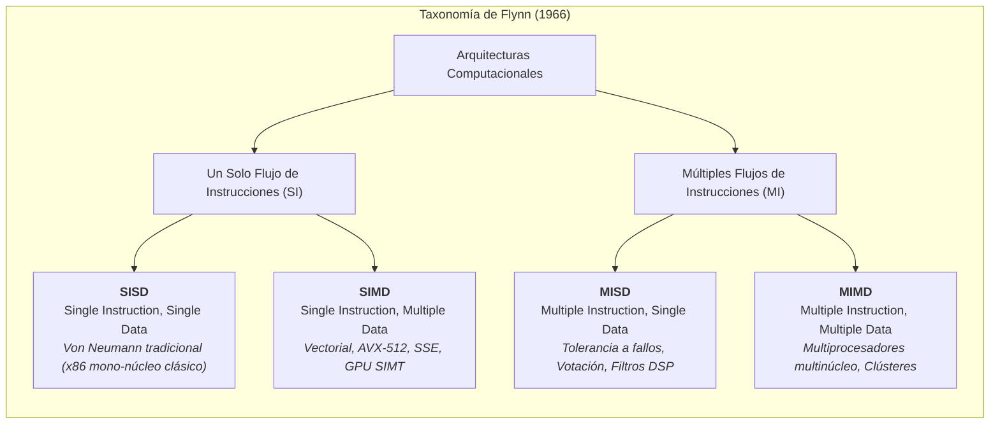
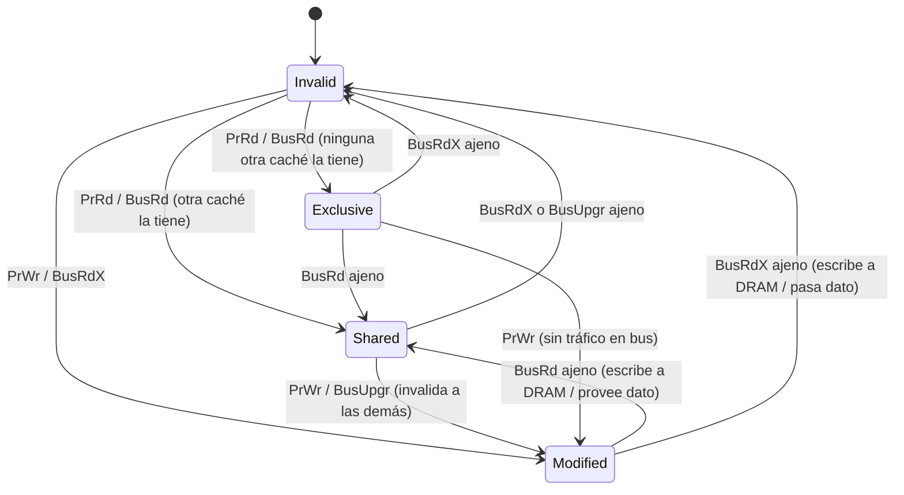
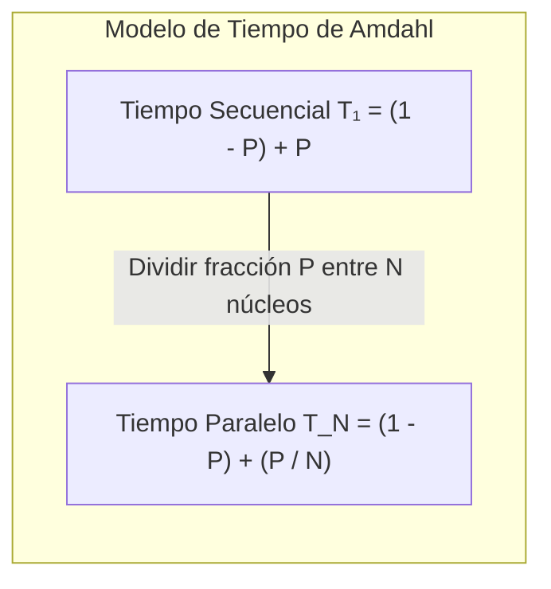
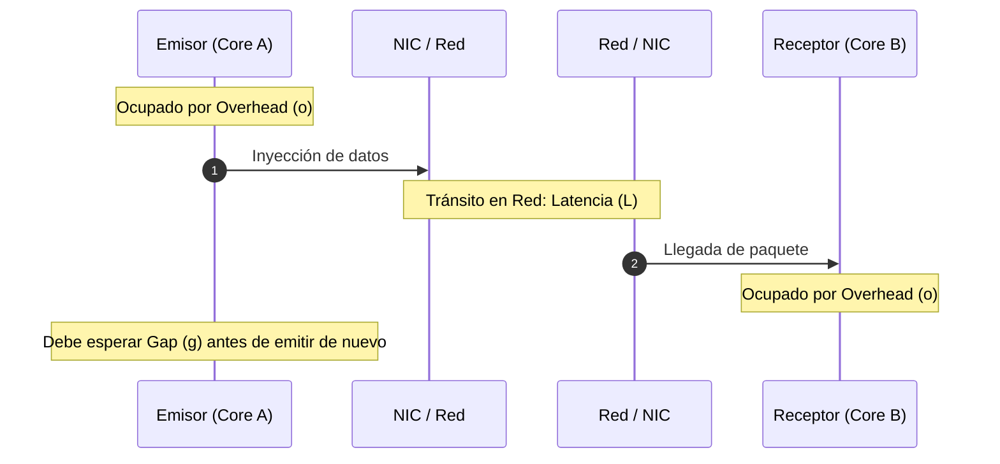

# Fundamentos de Computación Paralela y Leyes de Escalamiento

**Cátedra:** Multiprocesamiento y Arquitecturas Alternativas (ICCD432)  
**Facultad:** Ingeniería de Sistemas / Computación — Escuela Politécnica Nacional (EPN)  
**Nivel:** Pregrado Avanzado  

---

> [!info] 💡 ¿Cómo entender esto desde cero? (Guía para novatos de pregrado)
> Imagina que tienes una cocina de restaurante con una sola cocinera ultrarrápida preparando platos de inicio a fin. Durante décadas, los fabricantes de chips hacían que esa cocinera moviera los brazos más rápido (mayor frecuencia de reloj en GHz). Pero alrededor de 2004 nos estrellamos contra el **muro térmico** (*Power Wall*): aumentar la frecuencia derretiría el chip de silicio por el consumo cuadrático de energía.
> 
> La solución de la industria no fue crear cocineras infinitamente veloces, sino contratar **múltiples cocineros en paralelo**. Aquí nacen los desafíos centrales de esta materia:
> 1. **¿Cómo se coordinan los cocineros?** ¿Comparten la misma mesa e ingredientes (Memoria Compartida / UMA-NUMA) o cada uno tiene su propia mesa en otra habitación y deben pasarse ingredientes gritando por el pasillo (Memoria Distribuida / Clústeres)?
> 2. **¿Cómo evitamos que se estorben?** Si dos cocineros intentan picar la misma cebolla al mismo tiempo, arruinan la comida (Condición de carrera / Coherencia de Caché).
> 3. **¿Contratar 100 cocineros terminará la comida 100 veces más rápido?** No. Si hornear el pavo toma 2 horas obligatorias y nadie puede acelerar el horno (fracción secuencial del programa), 1000 cocineros seguirán esperando esas 2 horas. Esta es la esencia de la **Ley de Amdahl**. Sin embargo, si en lugar de un pavo cocinamos un banquete para 1000 invitados, el trabajo paralelo crece y el rendimiento sí escala: esa es la visión de la **Ley de Gustafson**.

---

## 1. El Ocaso del Escalado Mononúcleo y la Revolución Paralela

Durante casi cuatro décadas, la computación se benefició de dos fenómenos empíricos complementarios:
1. **Ley de Moore (1965):** La densidad de transistores en un circuito integrado se duplica aproximadamente cada 18 a 24 meses.
2. **Escalado de Dennard (1974):** Al reducir las dimensiones físicas de un transistor MOS, la densidad de potencia se mantiene constante, lo que permitía aumentar la frecuencia de reloj ($f$) de forma proporcional a la reducción geométrica sin disparar la disipación térmica por unidad de área.

$$\text{Potencia Dinámica} \approx C \cdot V_{DD}^2 \cdot f$$

Hacia los años 2004-2005, el escalado de Dennard colapsó: el voltaje de alimentación ($V_{DD}$) no pudo reducirse por debajo de $\sim 0.8\text{ V}$ debido a las corrientes de fuga cuántica subumbral (*leakage current*). El calor generado por centímetro cuadrado alcanzó los niveles de una tobera de cohete nuclear (**Power Wall**).

Adicionalmente, se agotó la capacidad de extraer paralelismo a nivel de instrucción (**ILP** - *Instruction-Level Parallelism*) mediante ejecución fuera de orden (*out-of-order*), ejecución especulativa y predicción de saltos sin un costo exponencial en transistores y energía. 

La respuesta de la arquitectura de computadores fue el cambio de paradigma hacia el **Paralelismo a Nivel de Hilo (TLP)** y el **Paralelismo a Nivel de Datos (DLP)**: en lugar de un único núcleo gigante y complejo, se integran múltiples núcleos más simples y eficientes dentro de la misma pastilla de silicio (*Multicore / Manycore*).

---

## 2. Taxonomía Clásica de Flynn (1966)

Michael J. Flynn clasificó las arquitecturas computacionales basándose en la multiplicidad de dos flujos ortogonales: el **Flujo de Instrucciones** (*Instruction Stream*) y el **Flujo de Datos** (*Data Stream*).



### 2.1 SISD (Single Instruction, Single Data)
- **Definición:** Una sola unidad de control despacha una única instrucción por ciclo sobre un único registro de datos.
- **Implementación física:** Computadores secuenciales clásicos de arquitectura von Neumann pura (ej. procesadores Intel 8086, PDP-11, o núcleos embebidos simples sin extensiones vectoriales).
- **Características:** No existe concurrencia en el procesamiento de datos a nivel arquitectural visible para el software.

### 2.2 SIMD (Single Instruction, Multiple Data)
- **Definición:** Una única unidad de control emite una sola instrucción que opera simultáneamente y de forma sincronizada (*lockstep*) sobre múltiples elementos de datos independientes distribuidos en múltiples unidades aritmético-lógicas (ALUs).
- **Implementación física:**
  - **Supercomputadores vectoriales clásicos:** CRAY-1, CRAY X-MP.
  - **Extensiones de conjunto de instrucciones (ISA) en CPUs modernas:**
    - Intel/AMD: MMX (64-bit), SSE (128-bit), AVX/AVX2 (256-bit), AVX-512 (512-bit).
    - ARM: NEON (128-bit), SVE (Scalable Vector Extension, hasta 2048-bit).
- **Mecanismo:** Un registro vectorial de 512 bits (como `zmm0` en AVX-512) puede almacenar:
  - 16 números en coma flotante de precisión simple (`float`, 32 bits).
  - 8 números de doble precisión (`double`, 64 bits).
  - 64 enteros de 8 bits (`int8_t`).
  Una sola instrucción suma vectorial (`_mm512_add_ps`) ejecuta 16 adiciones en un solo ciclo de reloj.
- **Ventaja:** Altísima densidad computacional por vatio en algoritmos regulares (procesamiento de imágenes, álgebra lineal densa, procesamiento de señales de radar y telecomunicaciones).

### 2.3 MISD (Multiple Instruction, Single Data)
- **Definición:** Múltiples unidades de control ejecutan distintas secuencias de instrucciones sobre el mismo flujo único de datos.
- **Implementación y casos reales:** Es el cuadrante menos común comercialmente, pero crítico en ingeniería de alta fiabilidad:
  - **Sistemas redundantes tolerantes a fallos (FTMR - Fault-Tolerant Majority Voting):** Sistemas aeroespaciales críticos (computadores de control de vuelo del transbordador espacial de la NASA, Boeing 777/787, sistemas de control de barras en reactores nucleares). Tres o cuatro procesadores independientes ejecutan algoritmos distintos (o el mismo algoritmo compilado con herramientas distintas) sobre los mismos datos de telemetría de los sensores; un circuito de votación mayoritaria descarta anomalías causadas por radiación ionizante (*single event upsets*).
  - **Pipelines sistólicos y filtros DSP encadenados:** Un flujo continuo de audio o señal RF pasa a través de múltiples procesadores en cascada donde cada procesador aplica una transformación matemática distinta en tiempo real.

### 2.4 MIMD (Multiple Instruction, Multiple Data)
- **Definición:** Múltiples procesadores autónomos ejecutan diferentes programas (o diferentes partes de un mismo programa) sobre conjuntos disjuntos de datos.
- **Implementación física:** Es la base de prácticamente todos los sistemas paralelos de propósito general actuales:
  - Servidores multicore modernos (Intel Xeon, AMD EPYC, Apple Silicon M-series).
  - Supercomputadores y clústeres de cómputo de alto rendimiento (HPC).
- **Subclasificación del modelo de programación en MIMD:**
  - **SPMD (Single Program, Multiple Data):** Todos los procesadores ejecutan una copia del mismo binario ejecutable, pero cada proceso ramifica su lógica de control y procesa un subconjunto de datos basándose en su identificador único (*rank* o *thread ID*). Es el estándar de facto en MPI y OpenMP.
  - **MPMD (Multiple Program, Multiple Data):** Procesos completamente distintos ejecutan ejecutables desacoplados (ej. arquitectura Master-Worker donde el maestro corre un programa de planificación y los trabajadores ejecutan simulaciones numéricas complejas).

---

## 3. Modelos de Organización de Memoria Física

En arquitecturas MIMD, la forma en que los procesadores físicos se comunican con los módulos de memoria física determina radicalmente la latencia, el ancho de banda y la escalabilidad del sistema.

```mermaid
flowchart TB
    subgraph UMA_Arch ["Arquitectura UMA / SMP (Memoria Compartida Uniforme)"]
        direction TB
        P1["CPU 0"] --- BusInter["Bus / Crossbar Compartido"]
        P2["CPU 1"] --- BusInter
        P3["CPU 2"] --- BusInter
        P4["CPU 3"] --- BusInter
        BusInter --- RAM_UMA["Memoria Principal Global (DRAM)<br><i>Latencia idéntica t₁ = t₂ = t₃ = t₄</i>"]
    end

    subgraph NUMA_Arch ["Arquitectura NUMA (Memoria Compartida No Uniforme)"]
        direction TB
        subgraph Node0 ["Nodo NUMA 0"]
            CPU0["CPU Socket 0"] <--> DRAM0["Memoria Local 0<br><i>Latencia ultrabaja (~60 ns)</i>"]
        end
        subgraph Node1 ["Nodo NUMA 1"]
            CPU1["CPU Socket 1"] <--> DRAM1["Memoria Local 1<br><i>Latencia ultrabaja (~60 ns)</i>"]
        end
        Node0 <== Interconnect["Interconexión Coherente Punto a Punto<br>(Intel UPI / AMD Infinity Fabric / QPI)<br><i>Penalización Remota (~140 ns)</i>"] ==> Node1
    end
```

### 3.1 Memoria Compartida: UMA vs NUMA

#### A. UMA (Uniform Memory Access / SMP)
- En un sistema multiprocesador simétrico (**SMP**), todos los procesadores comparten el espacio global de direcciones de memoria física a través de un bus común o una red de conmutación centralizada (*crossbar switch*).
- **Propiedad fundamental:** La latencia de acceso y el ancho de banda para leer o escribir cualquier dirección de memoria es idéntica para cualquier núcleo del sistema:
  
  $$\text{Latencia}(CPU_i \to M_k) = \text{constante}, \quad \forall i, k$$

- **Límite de ingeniería:** El bus compartido o el conmutador se convierte rápidamente en un cuello de botella de contención. Los sistemas UMA no escalan eficientemente más allá de 4 a 8 sockets (o unas pocas decenas de núcleos).

#### B. NUMA (Non-Uniform Memory Access)
- Para superar el cuello de botella de contención, la memoria física se divide y se acopla físicamente a cada zócalo (*socket*) o grupo de núcleos, formando un **Nodo NUMA**.
- Los nodos se comunican mediante redes de interconexión punto a punto de altísima velocidad y coherencia de caché por hardware (ej. **Intel UPI - Ultra Path Interconnect**, **AMD Infinity Fabric**, **NVIDIA NVLink**).
- **Propiedad fundamental:** El espacio de direcciones sigue siendo compartido y transparente para el sistema operativo y el programador, pero **la latencia de acceso depende de la ubicación física del dato**:

$$\text{Latencia}(\text{Acceso Local}) \ll \text{Latencia}(\text{Acceso Remoto})$$

> [!important] Razón NUMA (*NUMA Factor*) y la Política *First-Touch*
> La relación entre la latencia remota y la local se denomina **NUMA Factor** (usualmente entre $1.5\times$ y $3.0\times$).  
> En Linux, la asignación de páginas de memoria por defecto sigue la regla **First-Touch Policy**: la página física no se asigna al llamar a `malloc()`, sino en el instante en que el primer hilo escribe en ella. Si el hilo principal (hilo maestro) inicializa todo un vector gigante en un bucle secuencial, toda la memoria quedará ubicada físicamente en el Nodo NUMA 0. Cuando los demás núcleos de otros sockets intenten procesar sus fragmentos en paralelo, colapsarán la interconexión con accesos remotos lentos.

### 3.2 Memoria Distribuida (Clústeres y Supercomputadores)
- Cada nodo del clúster es un computador completo y autónomo con su propia CPU, memoria DRAM, bus de E/S y sistema operativo independiente.
- **Aislamiento absoluto:** No existe un espacio global de direcciones en hardware. El núcleo del Nodo A no puede emitir una instrucción `LOAD` o `STORE` que acceda a la DRAM del Nodo B.
- **Mecanismo de comunicación:** La transferencia de datos se realiza explícitamente mediante el intercambio de paquetes a través de una red de interconexión de alta velocidad y baja latencia:
  - **InfiniBand (HDR 200 Gb/s, NDR 400/800 Gb/s, XDR):** Protocolo optimizado con soporte para **RDMA** (*Remote Direct Memory Access*), lo que permite a la tarjeta de red (HCA) transferir datos de memoria a memoria entre nodos saltándose por completo la pila del kernel del sistema operativo (*kernel bypass*) y evitando copias intermedias en CPU.
  - **RoCE (RDMA over Converged Ethernet):** RDMA ejecutado sobre infraestructura Ethernet estándar con control de congestión DCB/PFC.

---

## 4. Coherencia de Caché en Arquitecturas Multinúcleo

En un sistema de memoria compartida con jerarquías de caché privadas por núcleo (L1/L2 privadas y L3 compartida), surge inmediatamente el **problema de la coherencia de caché**: múltiples copias de la misma posición de memoria principal pueden coexistir en las cachés de diferentes núcleos. Si un núcleo actualiza su copia privada, las copias de los demás núcleos quedan obsoletas (*stale data*).

```
    Tiempo t₀: Dirección X = 100 en DRAM. Ambos núcleos leen X.
    Tiempo t₁: Core 0 ejecuta: X = 200 (escritura en su caché L1 privada).
    Tiempo t₂: Core 1 lee X. Si no hay coherencia, leerá 100 (ERROR CRÍTICO).
```

### 4.1 Protocolo de Coherencia MESI (Protocolo Illinois)

MESI es un protocolo de snooping basado en invalidación de líneas de caché de 4 estados. Cada línea de caché (típicamente de 64 bytes) posee 2 bits adicionales para rastrear su estado:

| Estado | Nombre | Significado Semántico | ¿Dato válido? | ¿Copia en DRAM limpia? | ¿Otros núcleos la tienen? |
| :---: | :---: | :--- | :---: | :---: | :---: |
| **M** | *Modified* | La línea está presente únicamente en esta caché y ha sido modificada (sucia). Es la única copia correcta del sistema; la DRAM está desactualizada. | Sí | **No** (Sucia) | **No** (Exclusiva) |
| **E** | *Exclusive* | La línea está presente únicamente en esta caché, pero coincide exactamente con la DRAM (limpia). | Sí | Sí (Limpia) | **No** (Exclusiva) |
| **S** | *Shared* | La línea está presente en esta caché y posiblemente en las cachés de otros núcleos. Coincide con la DRAM (o con el propietario). | Sí | Sí (Limpia) | **Sí** (Compartida) |
| **I** | *Invalid* | La línea no contiene datos válidos; no se puede leer ni escribir sin generar un fallo de caché (*cache miss*). | **No** | N/A | N/A |



#### Transiciones y Eventos Clave en MESI:
1. **PrRd (Processor Read) / PrWr (Processor Write):** Solicitudes generadas por el propio núcleo de procesamiento local.
2. **BusRd (Bus Read):** Mensaje en el bus escuchador (*snooping bus*) donde un procesador solicita leer una línea sin intención de modificarla.
3. **BusRdX (Bus Read with Intent to Modify):** Solicitud de lectura con intención exclusiva de escribir. Todas las demás cachés que tengan esa línea deben transicionar a **Invalid (I)**.
4. **BusUpgr (Bus Upgrade):** Un procesador que ya tiene la línea en estado **Shared (S)** desea escribir en ella; emite una señal de actualización para invalidar a los demás sin requerir volver a transferir los 64 bytes de datos.

> [!tip] La ventaja del Estado Exclusive (E)
> Si un núcleo lee un dato que nadie más tiene, entra en estado **Exclusive (E)**. Si inmediatamente después realiza una escritura sobre ese dato, puede transicionar de **E a M silenciosamente sin emitir ningún mensaje al bus**. Esto ahorra un tráfico masivo de interconexión en accesos secuenciales privados.

### 4.2 Protocolo MOESI (Optimización con Estado Owned)

Utilizado por procesadores AMD (y arquitecturas modernas de alta concurrencia), añade el quinto estado: **Owned (O)**.
- **Problema en MESI:** Cuando una línea está en estado **Modified (M)** en el Core 0 y el Core 1 desea leerla (`BusRd`), Core 0 se ve obligado a escribir los 64 bytes completos de vuelta a la lenta memoria DRAM principal antes de permitir que ambos queden en **Shared (S)**.
- **Solución MOESI:** El Core 0 pasa de **Modified (M)** a **Owned (O)**. El Core 1 pasa a **Shared (S)**. 
  - El estado **Owned** significa: *"Esta línea está compartida por varias cachés, pero esta caché es la dueña responsable de guardar la copia sucia y actualizar la DRAM cuando sea desalojada"*.
  - **Ganancia:** Se elimina por completo el ciclo de escritura síncrona a la DRAM en transferencias caché-a-caché (*cache-to-cache transfers*), reduciendo la latencia de decenas de nanosegundos a simples ciclos de reloj de interconexión.

---

### 4.3 El Fenómeno de Falsa Compartición (*False Sharing*)

> [!caution] Definición de False Sharing
> La **Falsa Compartición** ocurre cuando dos o más hilos que se ejecutan en núcleos físicamente distintos leen o escriben variables independientes en memoria, pero dichas variables caen casualmente dentro de la **misma línea de caché física** (generalmente 64 bytes).

A nivel de software, los programadores creen que cada hilo trabaja en su propia variable privada sin conflicto de carreras de datos. Sin embargo, a nivel de hardware, el protocolo de coherencia (MESI) opera con granularidad de **líneas de caché completas de 64 bytes**.

```
Línea de Caché de 64 bytes en DRAM:
[ byte 0 .. 7: a[0] (hilo 0) | byte 8 .. 15: a[1] (hilo 1) | ... | byte 56 .. 63: a[7] ]

    1. Core 0 escribe en a[0]: Línea en Caché 0 -> MODIFIED.
       Línea en Caché 1 -> INVALIDADA.
    2. Core 1 escribe en a[1]: Sufre Cache Miss (¡a pesar de que a[1] no cambió en Core 0!).
       Línea en Caché 1 pasa a MODIFIED.
       Línea en Caché 0 -> INVALIDADA.
    3. Resultado: "Ping-Pong de Líneas de Caché" a través de la interconexión.
       El rendimiento se degrada entre 10x y 100x por saturación del bus.
```

#### Demostración en C++ y Mitigación con Alineamiento de Memoria

```cpp
#include <iostream>
#include <thread>
#include <vector>
#include <chrono>

// CASO PÉSIMO: Falsa compartición masiva
// Ambas variables ocupan 16 bytes consecutivos dentro de la misma línea de 64 bytes.
struct MalRendimiento {
    uint64_t cuenta_hilo0{0}; // 8 bytes
    uint64_t cuenta_hilo1{0}; // 8 bytes
};

// CASO ÓPTIMO: Alineación forzada a nivel de línea de caché
// alignas(64) obliga al compilador a ubicar cada variable al inicio de una línea distinta.
struct BuenRendimiento {
    alignas(64) uint64_t cuenta_hilo0{0};
    alignas(64) uint64_t cuenta_hilo1{0};
};

void trabajo_inseguro(MalRendimiento& datos, int id) {
    for (uint64_t i = 0; i < 1'000'000'000; ++i) {
        if (id == 0) datos.cuenta_hilo0++;
        else datos.cuenta_hilo1++;
    }
}

void trabajo_optimizado(BuenRendimiento& datos, int id) {
    for (uint64_t i = 0; i < 1'000'000'000; ++i) {
        if (id == 0) datos.cuenta_hilo0++;
        else datos.cuenta_hilo1++;
    }
}
```

---

## 5. Métricas de Rendimiento y Leyes Teóricas de Escalamiento

Para evaluar cuantitativamente el beneficio de paralelizar una aplicación sobre $N$ procesadores/núcleos, se definen las siguientes métricas fundamentales:

### 5.1 Aceleración (*Speedup*) y Eficiencia (*Efficiency*)

> [!definition] Factor de Aceleración ($S_N$)
> Relación entre el tiempo de ejecución secuencial en un único procesador ($T_1$) y el tiempo de ejecución paralelo empleando $N$ procesadores idénticos ($T_N$):
> 
> $$S(N) = \frac{T_1}{T_N}$$

- **Speedup Ideal (Lineal):** $S(N) = N$. Si usamos 16 núcleos, el programa termina 16 veces más rápido.
- **Speedup Superlineal:** $S(N) > N$. Fenómeno excepcional en la práctica; ocurre cuando el particionamiento del problema hace que los datos quepan íntegramente en las cachés rápidas L1/L2/L3 de los múltiples núcleos, eliminando los accesos a la lenta DRAM (*Cache Effect*).
- **Speedup Sublineal:** $S(N) < N$. El comportamiento normal en la vida real debido a la fracción secuencial obligatoria, la contención de memoria y la sobrecarga de sincronización/comunicación.

> [!definition] Eficiencia Paralela ($E_N$)
> Mide la fracción del tiempo durante la cual los $N$ procesadores están realizando trabajo computacional útil:
> 
> $$E(N) = \frac{S(N)}{N} = \frac{T_1}{N \cdot T_N}$$
> 
> - En un sistema con aceleración lineal perfecta: $E(N) = 1$ (o $100\%$).
> - En sistemas reales: $0 < E(N) < 1$.

---

### 5.2 Ley de Amdahl: Deducción Formal y Escalamiento Fuerte (*Strong Scaling*)

Propuesta por Gene Amdahl en 1967, establece el límite superior teórico de aceleración cuando el **tamaño total del problema permanece fijo e invariable** mientras se incrementa el número de procesadores.



#### Deducción Matemática Rigurosa:
Sea $T_1$ el tiempo total de ejecución secuencial en 1 procesador. Supongamos que una fracción $P \in [0, 1]$ del algoritmo puede paralelizarse de forma perfectamente equilibrada sin sobrecarga, mientras que la fracción restante $(1 - P)$ es intrínsecamente secuencial e indecomponible (E/S de disco, inicialización de variables, sincronizaciones críticas).

1. El tiempo de ejecución en $N$ procesadores ($T_N$) se compone de:
   - La parte secuencial que no puede acelerarse: $(1 - P) \cdot T_1$
   - La parte paralelizable dividida equitativamente entre los $N$ procesadores: $\frac{P \cdot T_1}{N}$

$$T_N = (1 - P) \cdot T_1 + \frac{P \cdot T_1}{N} = T_1 \left( (1 - P) + \frac{P}{N} \right)$$

2. Sustituyendo en la definición de Speedup $S(N) = \frac{T_1}{T_N}$:

$$S(N) = \frac{T_1}{T_1 \left( (1 - P) + \frac{P}{N} \right)}$$

$$\boxed{S(N) = \frac{1}{(1 - P) + \frac{P}{N}}}$$

#### Límite Asintótico de Amdahl ($N \to \infty$):
Tomando el límite cuando el número de procesadores tiende al infinito:

$$\lim_{N \to \infty} S(N) = \lim_{N \to \infty} \frac{1}{(1 - P) + \frac{P}{N}} = \frac{1}{(1 - P) + 0} = \boxed{\frac{1}{1 - P}}$$

> [!important] Implicación Práctica de la Ley de Amdahl
> Si un algoritmo tiene apenas un **$5\%$ de código estrictamente secuencial** ($1 - P = 0.05$ y $P = 0.95$):
> 
> $$S_{\max} = \frac{1}{0.05} = 20$$
> 
> Aunque invirtamos millones de dólares y contratemos el supercomputador más potente del planeta con $N = 100\,000$ núcleos, **la aceleración jamás podrá superar $20\times$**. La fracción secuencial es un cuello de botella implacable.

---

### 5.3 Ley de Gustafson-Barsis: Deducción Formal y Escalamiento Débil (*Weak Scaling*)

En 1988, John Gustafson y Edwin Barsis señalaron que la Ley de Amdahl asume un supuesto poco realista para la ciencia y la ingeniería: en la práctica, los científicos no ejecutan un problema diminuto en un supercomputador gigante solo para esperar menos segundos; **aprovechan el incremento de procesadores y memoria para resolver problemas mucho más grandes y detallados** (ej. mayor resolución de malla meteorológica, simulación cuántica con más partículas).

Esto define el **Escalamiento Débil (Weak Scaling)**: el tamaño del problema crece proporcionalmente al número de procesadores $N$, manteniendo constante la cantidad de trabajo por procesador.

#### Deducción Matemática Rigurosa:
Sea $T_N$ el tiempo que toma ejecutar el problema escalado en el sistema paralelo de $N$ procesadores. Normalicemos este tiempo a la unidad:

$$T_N = s + p = 1$$

Donde:
- $s$: fracción de tiempo consumida ejecutando código secuencial ($s = 1 - P$).
- $p$: fracción de tiempo consumida ejecutando código paralelo en los $N$ procesadores.

Si este mismo problema gigantesco tuviera que ser resuelto por **un único procesador secuencial**, dicho procesador debería asumir la fracción secuencial $s$, pero tendría que realizar la fracción paralela $p$ él solo para todos los $N$ dominios:

$$T_1 = s + p \cdot N$$

Sustituyendo en la definición de aceleración escalada (*Scaled Speedup*):

$$S(N) = \frac{T_1}{T_N} = \frac{s + p \cdot N}{1} = s + p \cdot N$$

Como $p = 1 - s$:

$$S(N) = s + (1 - s) \cdot N = s + N - s \cdot N = N - s(N - 1)$$

Expresado en términos de la fracción paralela $P$ (donde la fracción secuencial es $1 - P$):

$$\boxed{S(N) = N - (1 - P)(N - 1) = P \cdot N + (1 - P)}$$

> [!example] Comparación de Amdahl vs Gustafson-Barsis con $P = 0.95$ y $N = 64$ núcleos
> - **Amdahl (Strong Scaling, problema fijo):**
>   $$S(64) = \frac{1}{(1 - 0.95) + \frac{0.95}{64}} = \frac{1}{0.05 + 0.01484} = \frac{1}{0.06484} \approx 15.42\times$$
> - **Gustafson-Barsis (Weak Scaling, problema escalado):**
>   $$S(64) = 64 - (1 - 0.95)(64 - 1) = 64 - 0.05 \cdot 63 = 64 - 3.15 = \mathbf{60.85\times}$$
> 
> Mientras Amdahl proyecta un estancamiento en $15.42\times$, Gustafson demuestra que si escalamos el volumen de datos con el hardware, alcanzamos casi la linealidad ($60.85\times$ de $64\times$ teóricos).

---

### 5.4 Sobrecarga de Comunicación y el Modelo LogP

En cualquier sistema paralelo real (especialmente en memoria distribuida), los procesadores deben coordinarse. El costo de comunicación no es nulo y penaliza el Speedup.

#### A. Modelo Lineal Básico de Comunicación
El tiempo requerido para transmitir un mensaje continuo de $m$ bytes entre dos nodos se modela como:

$$T_{\text{comm}}(m) = \alpha + m \cdot \beta$$

- $\alpha$ (**Latencia de inicio** o *startup latency*): Tiempo fijo requerido para preparar el paquete, interrupciones del sistema operativo y enrutamiento en la tarjeta de red, independiente del tamaño del mensaje.
- $\beta$ (**Tiempo de transferencia por byte**): Inverso del ancho de banda efectivo del enlace ($\beta = \frac{1}{BW}$).

#### B. Modelo LogP (Culler et al., 1993)
Para superar las limitaciones del modelo lineal simple y reflejar los cuellos de botella de procesadores e interfaces de red, el **Modelo LogP** caracteriza la red mediante cuatro parámetros clave:

1. **$L$ (Latency):** El límite superior del retardo en la red física para propagar un mensaje de palabra pequeña desde la interfaz origen hasta la interfaz destino.
2. **$o$ (Overhead):** El tiempo durante el cual la CPU principal está ocupada exclusivamente transmitiendo o recibiendo el mensaje (durante este tiempo la CPU no puede realizar cómputo útil).
3. **$g$ (Gap):** El intervalo mínimo de tiempo entre envíos consecutivos de mensajes impuesto por el ancho de banda del controlador de red ($1/g = \text{tasa máxima de inyección}$).
4. **$P$ (Processors):** El número de nodos procesadores autónomos en el sistema.



> [!tip] Granularidad Computacional y Rendimiento
> La relación entre la cantidad de cómputo local ($T_{\text{comp}}$) y la cantidad de comunicación requerida ($T_{\text{comm}}$) define la **granularidad**:
> 
> $$\text{Granularidad} = \frac{T_{\text{comp}}}{T_{\text{comm}}}$$
> 
> - **Granularidad fina:** Se sincroniza muy seguido con poco cómputo. El sistema pasará la mayor parte del tiempo pagando latencia $\alpha$ y overhead $o$. Eficiencia baja.
> - **Granularidad gruesa:** Cada nodo realiza largos cómputos independientes antes de emitir grandes bloques de datos agrupados. Maximiza el ancho de banda y mitiga la latencia.

---

## 6. Resumen Conceptual Comparativo

| Concepto | Eje Central | Premisa Fundamental | Aplicación en la Práctica |
| :--- | :--- | :--- | :--- |
| **Taxonomía de Flynn** | Flujos de Control y Datos | Clasificación arquitectural ortogonal (SISD, SIMD, MISD, MIMD). | Guía para elegir hardware (CPU, GPU, FPGA, Clúster). |
| **UMA (SMP)** | Latencia de Memoria | Acceso uniforme a toda la DRAM global. | Estaciones de trabajo y servidores pequeños (hasta 4-8 sockets). |
| **NUMA** | Topología de Interconexión | Latencia variable: local rápida vs remota penalizada. | Servidores empresariales multicore modernos (AMD EPYC, Intel Xeon). |
| **Protocolo MESI** | Coherencia de Caché | Líneas de 64B en estados M, E, S, I vía bus snooping. | Consistencia de memoria transparente en CPUs multinúcleo. |
| **False Sharing** | Interferencia Espacial | Variables disjuntas en la misma línea de caché rebotan entre núcleos. | Evitar mediante relleno (*padding*) y `alignas(64)`. |
| **Ley de Amdahl** | Strong Scaling | Tamaño del problema fijo. Límite asintótico $\frac{1}{1-P}$. | Analiza la aceleración al optimizar un algoritmo preexistente. |
| **Ley de Gustafson** | Weak Scaling | Tamaño del problema crece proporcional al número de núcleos $N$. | Justifica el diseño y la inversión en supercomputadores HPC. |
| **Modelo LogP** | Red de Comunicación | Descompone el costo en Latencia ($L$), Overhead ($o$) y Gap ($g$). | Optimización de algoritmos de paso de mensajes masivos (MPI). |

---

## 7. Preguntas de Autoevaluación (Nivel Examen EPN ICCD432)

1. **¿Por qué una GPU moderna no puede clasificarse puramente como SIMD según la taxonomía estricta de Flynn?**  
   *Respuesta esperada:* Porque aunque internamente los hilos de un warp ejecutan la misma instrucción sobre diferentes datos (SIMT), cada hilo posee su propio contador de programa y registros, y múltiples SMs independientes pueden despachar diferentes instrucciones simultáneamente sobre bloques distintos (combinación híbrida MIMD a nivel macro y SIMD/SIMT a nivel micro).
2. **Si una aplicación posee una fracción paralelizable del $90\%$ ($P=0.90$), calcule el Speedup máximo según Amdahl con procesadores infinitos y el Speedup según Gustafson con $N=128$ procesadores.**  
   *Respuesta esperada:*  
   - Amdahl: $S_{\max} = \frac{1}{1 - 0.90} = \frac{1}{0.10} = \mathbf{10\times}$.  
   - Gustafson: $S(128) = 128 - (1 - 0.90)(128 - 1) = 128 - 0.10(127) = 128 - 12.7 = \mathbf{115.3\times}$.
3. **¿Qué sucede a nivel de transiciones MESI cuando dos hilos en Core 0 y Core 1 ejecutan simultáneamente `sum++` sobre la misma variable compartida en DRAM?**  
   *Respuesta esperada:* Se desencadena una tormenta de invalidaciones (`BusRdX` e invalidaciones cruzadas de M a I) con condiciones de carrera no deterministas, lo que destruye el rendimiento y genera corrupción de datos a menos que se use exclusión mutua o instrucciones atómicas de hardware.
